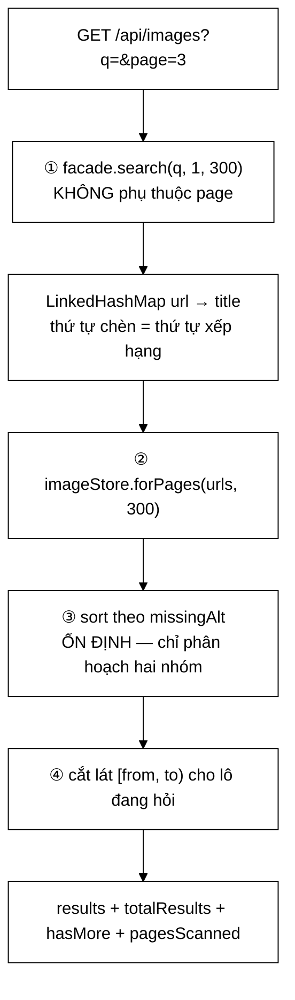

# ImageSearchController — xếp hạng ảnh **gián tiếp**, và một hằng số lạc hậu sau một lần đổi thiết kế

**File nguồn:** `search-engine/src/main/java/com/vnsearch/controller/ImageSearchController.java` (201 dòng)
**Gói:** `com.vnsearch.controller` · **Loại:** `@RestController @RequestMapping("/api")`
**Vị trí trong luồng:** `GET /api/images?q=&page=&size=` — tab "Hình ảnh" của browser-app
**Đọc kèm:** [`../crawler/modular/ImageStore.md`](../crawler/modular/ImageStore.md) · [`../crawler/modular/ImageQuality.md`](../crawler/modular/ImageQuality.md) · [`../service/SearchEngineFacade.md`](../service/SearchEngineFacade.md) · [`FeedController.md`](./FeedController.md)

---

## 📌 Hiểu trong 30 giây

Không có mô hình xếp hạng ảnh nào. Chỉ có **hai bước**:

```
   1. Chạy CHÍNH truy vấn đó qua máy tìm kiếm văn bản  -> danh sách trang, đã xếp hạng
   2. Tra ảnh của các trang đó theo đúng thứ tự ấy      -> danh sách ảnh
```



```
   ⭐ ĐIỀU QUAN TRỌNG NHẤT VỀ SƠ ĐỒ NÀY:
     BA BƯỚC ĐẦU HOÀN TOÀN KHÔNG PHỤ THUỘC `page`.

   ⇒ Danh sách nền GIỐNG NHAU ở mọi lô.
   ⇒ Lô 2 nối đúng vào sau lô 1: không ảnh nào hiện hai lần,
     không ảnh nào bị nhảy qua.

   ⇒ Đây là bất biến trung tâm của cả tệp, và nó được nhắc
     lại ở BA chỗ khác nhau trong bình luận.
```

---

## 1. Vì sao **không** xếp hạng ảnh trực tiếp

Javadoc dòng 35–38:

> *"Tín hiệu để làm việc đó là nội dung *của chính bức ảnh*, và hệ thống này không
> có nó — mặc định còn không tải ảnh về. Xếp hạng theo `altText` thì chỉ là xếp hạng
> một chuỗi vài từ, kém hơn hẳn so với xếp hạng cả trang chứa nó."*

```
   BA PHƯƠNG ÁN, VÀ VÌ SAO PHƯƠNG ÁN BA THẮNG

   ① Xếp hạng theo nội dung ảnh (embedding, nhận dạng vật thể)
     ✓ đúng nhất về nguyên tắc
     ✗ cần tải ảnh về — mặc định app.crawler.images.download=false
     ✗ cần mô hình học máy, GPU
     ⇒ ngoài phạm vi

   ② Xếp hạng theo altText
     ✓ rẻ, dữ liệu đã có
     ✗ altText thường 3-8 từ, nhiều ảnh KHÔNG có
     ✗ TF-IDF trên một chuỗi vài từ gần như vô nghĩa
       (không có đủ tín hiệu để phân biệt)

   ③ Thừa hưởng xếp hạng của TRANG chứa ảnh        ← chọn
     ✓ dùng lại TOÀN BỘ TF-IDF/BM25/PageRank/boost tiêu đề
     ✓ 0 dòng mã xếp hạng mới
     ✓ mọi cải tiến ở tầng xếp hạng văn bản tự động
       cải thiện tab ảnh

   ⇒ Điểm cuối là điểm mạnh nhất, và Javadoc không nêu:
     nâng cấp scorer (../ranking/ScorerFactory.md) sẽ
     cải thiện tab Hình ảnh mà không ai phải đụng tới tệp này.
```

```
   ⭐ VÀ HỆ QUẢ ĐƯỢC GHI THẲNG, KHÔNG GIẤU

   Javadoc dòng 40–43:
   "mot trang RAT LIEN QUAN nhung KHONG CO ANH se khong dong
    gop gi, con mot trang lien quan VUA PHAI ma NHIEU ANH co
    the chiem phan lon ket qua"

   ⇒ Đây là thiên lệch cấu trúc của phương án ③.
   ⇒ FETCH_PAGE_MULTIPLIER được nhắc tới như biện pháp
     giảm bớt...

   ⚠️ NHƯNG HẰNG SỐ ĐÓ KHÔNG TỒN TẠI TRONG MÃ.
     Javadoc dòng 42 tham chiếu {@link #FETCH_PAGE_MULTIPLIER},
     còn tệp chỉ có MAX_SCANNED_PAGES.

   ⇒ Một tham chiếu Javadoc trỏ vào một hằng số đã bị đổi tên
     hoặc xoá. Nó sẽ làm `javadoc` báo lỗi, và nó cho thấy
     Javadoc lớp chưa được cập nhật cùng lúc với mã.
   ⇒ Xem đề xuất 3.
```

---

## 2. `MAX_SCANNED_PAGES = 300` — một hằng số từng đúng, rồi lạc hậu

Javadoc dòng 73–76 kể lại toàn bộ câu chuyện:

> *"Bản trước để 60 ở đây, và con số đó **có căn cứ ĐÚNG VÀO LÚC ẤY** — mỗi trang
> cho 5–15 ảnh nên 60 trang là vài trăm ảnh. Giữ nguyên 60 sau khi đổi sang **một
> ảnh mỗi trang** thì mọi truy vấn đều dừng ở 60 ảnh: người dùng cuộn hết ba lô là
> hết, dù chỉ mục có hàng nghìn trang khớp."*

```
   ⭐ ĐÂY LÀ MẪU LỖI ĐÁNG HỌC NHẤT CỦA CẢ GÓI controller.

   Một hằng số KHÔNG SAI. Nó chỉ mất căn cứ khi một
   giả định ở lớp khác thay đổi.

   Trước:  ImageStore giữ NHIỀU ảnh mỗi trang (5-15)
           ⇒ 60 trang × ~8 ảnh = ~480 ảnh
           ⇒ 60 là con số hợp lý

   Sau:    ImageStore chỉ giữ MỘT ảnh mỗi trang
           ⇒ 60 trang × 1 ảnh = 60 ảnh
           ⇒ 60 trở thành trần CỨNG cho toàn bộ tab ảnh

   ⇒ Không có lỗi biên dịch.
   ⇒ Không có ngoại lệ.
   ⇒ Triệu chứng: "cuộn ba lô là hết" — trông như
     corpus nhỏ, không như một lỗi.
```

```
   VÀ PHÉP SỬA ĐI KÈM MỘT RÀNG BUỘC MỚI ĐƯỢC PHÁT BIỂU

   "Con so nay BUOC PHAI BANG MAX_TOTAL_IMAGES. Tu khi
    ImageStore chi giu MOT anh cho moi trang, quan he giua
    hai dai luong tro thanh MOT-MOT: quet N trang thi co
    nhieu nhat N anh."

   MAX_SCANNED_PAGES = 300
   MAX_TOTAL_IMAGES  = 300

   ⇒ Hai hằng số PHẢI bằng nhau, và lý do được ghi.
   ⇒ Nhưng chúng vẫn là HAI khai báo độc lập.
   ⇒ Sửa một mà quên cái kia: không lỗi nào, chỉ là
     một trong hai trở thành trần thật còn cái kia vô nghĩa.

   ⇒ Đúng loại lỗi vừa xảy ra, chỉ ở dạng khác. Xem đề xuất 1.
```

```
   VÀ CHI PHÍ CỦA VIỆC NÂNG LÊN 300 ĐƯỢC ĐO

   "facade.search co CACHE, va buoc tra anh chi la 300 lan
    tra bang bam"

   ⇒ Không phải "chắc là rẻ" mà là hai lý do cụ thể.
   ⇒ Đây là mức lập luận cần có khi nâng một trần lên 5 lần.
```

---

## 3. Phân trang ổn định — bất biến được nhắc ba lần

```java
// So trang lay KHONG phu thuoc `page`: luon quet cung mot tap trang da
// xep hang, roi moi cat lat o buoc 4. Day la mau chot de phan trang
// dung — neu so trang quet thay doi theo `page` thi tap anh nen cung
// doi, va anh se VUA LAP VUA THIEU giua cac lo.
SearchResponse pages = facade.search(q, 1, MAX_SCANNED_PAGES);
```

```
   CÁCH LÀM SAI (VÀ RẤT TỰ NHIÊN)

   SearchResponse pages = facade.search(q, page, size);
   ⇒ "chỉ lấy đúng trang đang cần, tiết kiệm"

   Vì sao hỏng:
     lô 1: lấy 30 trang đầu → gom được 22 ảnh (8 trang không có ảnh)
     lô 2: lấy trang 31-60 → gom được 25 ảnh
   ⇒ Lô 1 hiện 22 ảnh nhưng giao diện hỏi 30
   ⇒ Lô 2 bắt đầu từ trang 31, nhưng 8 ảnh cuối của
     "vùng trang 1-30" chưa bao giờ được hiện
   ⇒ VỪA LẶP VỪA THIẾU

   ⇒ Nguyên nhân gốc: quan hệ trang → ảnh KHÔNG phải 1-1
     ổn định, nên cắt lát ở tầng TRANG không tương ứng
     với cắt lát ở tầng ẢNH.
```

```
   ⭐ LỜI GIẢI: CẮT LÁT Ở ĐÚNG TẦNG CỦA THỨ ĐANG PHÂN TRANG.

   Đang phân trang ẢNH ⇒ phải dựng đủ danh sách ẢNH rồi
   mới cắt.

   ⇒ Ba bước đầu chạy y hệt nhau cho mọi lô.
   ⇒ Tốn hơn (mỗi lô đều dựng lại 300 ảnh), nhưng:
     - facade.search có cache
     - forPages là 300 lần tra bảng băm
   ⇒ Chi phí lặp lại là chấp nhận được, và tính đúng
     thì không thoả hiệp được.

   ⇒ Cùng bài toán, cùng lời giải với FeedController.md,
     nơi nó được giải bằng một seed thay vì bằng một trần
     cố định.
```

```
   VÀ LinkedHashMap ĐƯỢC CHỌN CÓ LÝ DO GHI RÕ

   Map<String, String> titleByUrl = new LinkedHashMap<>();

   "LinkedHashMap vi thu tu chen CHINH LA thu tu xep hang,
    va ImageStore.forPages DUA VAO thu tu do"

   ⇒ HashMap ở đây sẽ phá vỡ toàn bộ việc xếp hạng gián tiếp:
     ảnh vẫn ra, nhưng theo thứ tự băm — tức là NGẪU NHIÊN.
   ⇒ Và không có lỗi nào. Kết quả vẫn "trông hợp lý".

   ⇒ Đây là lần thứ ba trong dự án LinkedHashMap được dùng
     có chủ ý (xem ../config/GlobalExceptionHandler.md mục 7,
     HealthController.md mục 4) — nhưng là lần DUY NHẤT
     lý do được ghi ra.
   ⇒ Và cũng là lần mà việc mất nó gây hậu quả NẶNG NHẤT.
```

---

## 4. Bước 3 — sắp xếp **ổn định** theo `missingAlt`

```java
images.sort(Comparator.comparing(ImageFound::missingAlt));
```

```
   MỘT DÒNG, VÀ BỐN Ý TRONG BÌNH LUẬN

   ① Phần lọc ảnh trang trí NẶNG đã chuyển vào ImageQuality,
     chạy LÚC CRAWL
     ⇒ mỗi trang chỉ giữ tấm tốt nhất
     ⇒ "luoi khong con bi logo cua mot trang duy nhat nuot cho"

   ② Nhưng còn một ca bước đó không xử lý được:
     "mot trang ma TOAN BO anh deu la trang tri thi tam
      'tot nhat' cua no VAN LA MOT CAI LOGO"

   ③ Phép sắp xếp này đẩy những trang như vậy xuống cuối

   ④ Sắp xếp ỔN ĐỊNH ⇒ trong cùng nhóm, thứ tự xếp hạng
     trang được GIỮ NGUYÊN
     ⇒ "day chi la mot lan PHAN HOACH HAI NHOM, khong phai
        THAY THE phep xep hang cua may tim kiem"
   ```

```
   ⭐ Ý ④ LÀ Ý QUAN TRỌNG NHẤT, VÀ NÓ DỄ BỊ PHÁ.

   List.sort của Java dùng TimSort ⇒ ỔN ĐỊNH (được BẢO ĐẢM
   bởi đặc tả, không phải may mắn).

   ⇒ Nên `comparing(missingAlt)` chỉ chia hai nhóm
     (có alt / không alt) và giữ nguyên thứ tự trong mỗi nhóm.

   ⚠️ Một phép "cải tiến" rất tự nhiên sẽ phá nó:
     images.sort(comparing(ImageFound::missingAlt)
             .thenComparing(ImageFound::declaredWidth).reversed());
   ⇒ "sắp thêm theo kích thước cho ảnh to lên trước"
   ⇒ và toàn bộ xếp hạng TF-IDF/BM25/PageRank bị VỨT BỎ

   ⇒ Bình luận đã cảnh báo, nhưng không gì canh giữ.
```

```
   VÀ missingAlt LÀ MỘT TÍN HIỆU YẾU

   Giả định: ảnh nội dung thì có alt, ảnh trang trí thì không.

   Đúng với: báo chí tuân thủ chuẩn trợ năng
   Sai với:  - ảnh nội dung của trang viết ẩu (không có alt)
             - logo có alt="Logo VnExpress" (có alt!)

   ⇒ Tín hiệu này đúng theo XU HƯỚNG chứ không theo từng ca.
   ⇒ Với vai trò "phân hoạch hai nhóm để đẩy rác xuống cuối"
     thì đủ.
   ⇒ Với vai trò xếp hạng thì không — và nó không được
     dùng để xếp hạng. Ranh giới đúng.
```

---

## 5. Bốn trường siêu dữ liệu trong phản hồi

```java
response.put("totalResults", total);      // TỔNG, không phải số ảnh lô này
response.put("hasMore", to < total);      // tính ở MÁY CHỦ
response.put("pagesScanned", titleByUrl.size());
response.put("timeTakenMs", ...);
```

```
   ⭐ `hasMore` — VÀ CA BIÊN ĐƯỢC NÊU CHÍNH XÁC

   "Tinh o may chu chu khong de giao dien tu suy tu
    `results.length === pageSize`: cach suy do SAI DUNG O
    CA BIEN HAY GAP NHAT — khi tong so anh CHIA HET cho
    pageSize, lo cuoi day du nen giao dien tuong con nua,
    goi them mot lan roi nhan ve rong."

   Ví dụ: 60 ảnh, pageSize = 30
     lô 1: 30 ảnh ⇒ length === pageSize ⇒ "còn nữa"
     lô 2: 30 ảnh ⇒ length === pageSize ⇒ "còn nữa"
     lô 3: 0 ảnh  ⇒ hết
   ⇒ Một request thừa, và một khoảnh khắc giao diện hiện
     spinner rồi không có gì.

   ⇒ Xác suất gặp: 1/pageSize ≈ 3% với mỗi truy vấn.
   ⇒ Đủ hiếm để không ai để ý, đủ thường xuyên để
     luôn có mặt.
```

```
   ⭐ `pagesScanned` — PHÂN BIỆT HAI CA TRÔNG GIỐNG HỆT NHAU

   pagesScanned = 0  → truy vấn không khớp trang nào
                     → "Không tìm thấy"
   pagesScanned > 0  → có trang khớp, nhưng chưa trang nào
                       được Image Download Service xử lý
                     → "Hãy chạy crawl"

   ⇒ Nếu chỉ nhìn `results` rỗng thì HAI ca này giống hệt.
   ⇒ Và lời khuyên đúng cho chúng KHÁC HẲN nhau.

   ⇒ Cùng loại vấn đề với ../config/ImageStorePreloader.md
     mục 1: một lời khuyên "đúng về hành vi nhưng sai về
     nguyên nhân" sẽ che mất nguyên nhân thật mãi mãi.
   ⇒ Ở đó vấn đề được bịt bằng preloader; ở đây nó được
     bịt bằng một trường siêu dữ liệu.
```

```
   ⚠️ NHƯNG `totalResults` NÓI DỐI MỘT NỬA

   "TONG so anh khop truy van"

   Thực tế: tổng số ảnh gom được, tối đa MAX_TOTAL_IMAGES = 300.

   ⇒ Một truy vấn khớp 5.000 trang có ảnh vẫn báo
     totalResults = 300.
   ⇒ Giao diện hiện "300 ảnh" trong khi thực tế là "300+".

   ⇒ Không sai nghiêm trọng, nhưng bình luận hứa nhiều hơn
     mã làm được.
```

---

## 6. Hướng dẫn thực hành

### 6.1 Gọi endpoint

```bash
curl -s 'http://localhost:8080/api/images?q=hà%20nội&page=1&size=30' | jq

# {
#   "query": "hà nội",
#   "results": [ { imageUrl, pageUrl, pageTitle, host, altText,
#                  width, height, missingAlt } ],
#   "page": 1, "pageSize": 30,
#   "totalResults": 87,      <- toi da 300
#   "hasMore": true,
#   "pagesScanned": 142,     <- phan biet hai ca rong
#   "timeTakenMs": 34
# }
```

### 6.2 Chẩn đoán kết quả rỗng

```
   results = [], pagesScanned = 0
     ⇒ Truy vấn không khớp trang nào.
     ⇒ Thông báo đúng: "Không tìm thấy".

   results = [], pagesScanned = 142
     ⇒ Có 142 trang khớp, nhưng KHÔNG trang nào có ảnh.
     ⇒ Kho ảnh rỗng hoặc chưa nạp.
     ⇒ Kiểm: log khởi động của ImageStorePreloader,
       và ../config/ImageStoreListener.md mục 6.2.

   results đầy nhưng chỉ ~60 ảnh dù corpus lớn
     ⇒ MAX_SCANNED_PAGES đang thấp — đúng lỗi ở mục 2.
```

### 6.3 Cạm bẫy

```
   ① MAX_SCANNED_PAGES và MAX_TOTAL_IMAGES PHẢI bằng nhau.
     Hai khai báo độc lập, không gì kiểm.

   ② LinkedHashMap KHÔNG được đổi thành HashMap — thứ tự
     chèn CHÍNH LÀ thứ tự xếp hạng.

   ③ Đừng thêm tiêu chí sắp xếp thứ hai vào bước 3.
     Nó sẽ vứt bỏ toàn bộ xếp hạng TF-IDF/BM25/PageRank.

   ④ Ba bước đầu KHÔNG được phụ thuộc `page`. Bất kỳ
     "tối ưu" nào theo hướng đó sẽ phá phân trang.

   ⑤ totalResults bị chặn ở 300, không phải tổng thật.

   ⑥ Javadoc tham chiếu {@link #FETCH_PAGE_MULTIPLIER} —
     hằng số KHÔNG tồn tại.

   ⑦ Mỗi lô đều dựng lại toàn bộ 300 ảnh. Chi phí lặp lại
     là có chủ ý (đổi lấy tính đúng), nhưng nó là thật.

   ⑧ Trả về Map<String, Object> — không hợp đồng, khác hẳn
     /api/search vốn trả SearchResponse (record).
```

---

## 7. Độ phức tạp & chi phí

| Thao tác | Chi phí |
|---|---|
| ① `facade.search(q, 1, 300)` | có cache; không cache thì $O(C \log 300)$ |
| ② `forPages` | $O(P)$ tra bảng băm, $P \le 300$ |
| ③ `sort` | $O(A \log A)$, $A \le 300$ |
| ④ cắt lát + dựng JSON | $O(size)$ |

```
   PHÂN TÍCH — CHI PHÍ LẶP LẠI MỖI LÔ

   Người dùng cuộn 5 lô (150 ảnh):
     5 × (search 300 trang + 300 lần tra + sort 300)

   ⇒ Bước ① được cache cứu (cùng truy vấn, cùng tham số)
   ⇒ Bước ② và ③ chạy lại đủ 5 lần

   300 × log(300) ≈ 300 × 8 = 2.400 phép so sánh
   ⇒ vài chục micro-giây
   ⇒ hoàn toàn không đáng kể

   ⇒ Nên đánh đổi "tính lại mỗi lô để phân trang đúng"
     là đánh đổi RẺ, và đó là lý do nó chấp nhận được.
   ⇒ Nếu MAX_TOTAL_IMAGES là 30.000 thì kết luận sẽ khác hẳn.
```

---

## 8. Kiểm thử liên quan

| Tệp test | Kiểm gì |
|---|---|
| [`ImageStoreTest`](../../../../../test/java/com/vnsearch/crawler/modular/ImageStoreTest.md) | `forPages`, `forPage`, khử trùng |
| [`ImageStorageTest`](../../../../../test/java/com/vnsearch/crawler/modular/ImageStorageTest.md) | Đọc/ghi kho ảnh |

```
   ⚠️ KHÔNG CÓ TEST NÀO CHO CHÍNH CONTROLLER.

   Và bất biến trung tâm — phân trang ổn định — chỉ kiểm
   được ở tầng controller: nó là tính chất của cách BỐN BƯỚC
   phối hợp, không phải của bất kỳ lớp nào riêng lẻ.
```

```
   NHỮNG TÍNH CHẤT KHÔNG ĐƯỢC CANH GIỮ

   ✗ Lô 1 + lô 2 = đúng 60 ảnh phân biệt, không lặp,
     không thiếu — BẤT BIẾN TRUNG TÂM, và nó đã từng hỏng
     ở tab Hình ảnh (theo Javadoc của FeedController)

   ✗ MAX_SCANNED_PAGES == MAX_TOTAL_IMAGES

   ✗ Ảnh có altText đứng trước ảnh không có altText

   ✗ Trong cùng nhóm, thứ tự xếp hạng trang được GIỮ NGUYÊN
     — tức là sắp xếp phải ỔN ĐỊNH

   ✗ hasMore = false khi total chia hết cho pageSize
     — ca biên mà chính bình luận nêu ra

   ✗ pagesScanned > 0 khi có trang khớp nhưng không có ảnh

   ⇒ Sáu tính chất, tất cả kiểm được bằng @WebMvcTest với
     hai bean giả, và tính chất đầu tiên đã hỏng thật một lần.
```

---

## 9. Liên kết

- Kho ảnh và `forPages` — nơi thứ tự trang được tôn trọng: [`../crawler/modular/ImageStore.md`](../crawler/modular/ImageStore.md)
- Lớp lọc ảnh trang trí lúc crawl, và quyết định "một ảnh mỗi trang": [`../crawler/modular/ImageQuality.md`](../crawler/modular/ImageQuality.md)
- Kiểu dữ liệu của một ảnh: [`../crawler/bus/ImageFound.md`](../crawler/bus/ImageFound.md)
- Máy tìm kiếm văn bản mà tab này thừa hưởng xếp hạng: [`../service/SearchEngineFacade.md`](../service/SearchEngineFacade.md) · [`../ranking/ScorerFactory.md`](../ranking/ScorerFactory.md)
- Hình dạng kết quả bước 1: [`../model/SearchResponse.md`](../model/SearchResponse.md) · [`../model/SearchResult.md`](../model/SearchResult.md)
- Cùng bài toán phân trang ổn định, giải bằng seed: [`FeedController.md`](./FeedController.md)
- Hai đường nạp kho ảnh, và lý do tab này có thể rỗng: [`../config/ImageStoreListener.md`](../config/ImageStoreListener.md) · [`../config/ImageStorePreloader.md`](../config/ImageStorePreloader.md)
- Endpoint anh em, trả về record thay vì `Map`: [`SearchController.md`](./SearchController.md)
- Luật cho phép `/api/images` công khai, và lần nó trả 401: [`../config/SecurityConfig.md`](../config/SecurityConfig.md) mục 2
