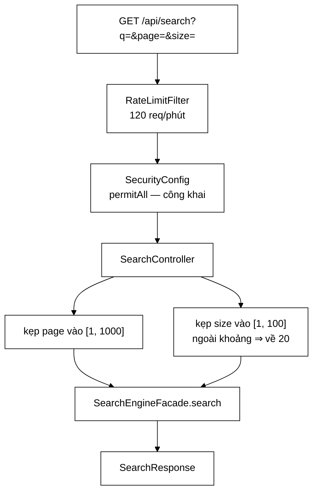

# SearchController — 51 dòng, và điều đáng học nhất là một hằng số chặn trên

**File nguồn:** `search-engine/src/main/java/com/vnsearch/controller/SearchController.java` (51 dòng)
**Gói:** `com.vnsearch.controller` · **Loại:** `@RestController @RequestMapping("/api")`
**Vị trí trong luồng:** cửa vào duy nhất của chức năng chính — `GET /api/search`
**Đọc kèm:** [`../service/SearchEngineFacade.md`](../service/SearchEngineFacade.md) · [`../model/SearchResponse.md`](../model/SearchResponse.md) · [`../config/SecurityConfig.md`](../config/SecurityConfig.md) · [`../datastructure/MinHeap.md`](../datastructure/MinHeap.md)

---

## 📌 Hiểu trong 30 giây

Toàn bộ controller là **ba dòng**: kẹp `page`, kẹp `size`, uỷ nhiệm cho facade.

```java
@GetMapping("/search")
public SearchResponse search(@RequestParam("q") String q,
                              @RequestParam(value = "page", defaultValue = "1") int page,
                              @RequestParam(value = "size", defaultValue = "20") int size) {
    int safePage = Math.min(Math.max(page, 1), MAX_PAGE);
    int safeSize = size < 1 || size > MAX_SIZE ? DEFAULT_SIZE : size;
    return facade.search(q, safePage, safeSize);
}
```



```
   ⭐ ĐIỀU KHÔNG CÓ Ở ĐÂY QUAN TRỌNG NGANG ĐIỀU CÓ:

   ✗ không try/catch      → GlobalExceptionHandler lo
   ✗ không kiểm xác thực  → SecurityConfig lo
   ✗ không giới hạn tần suất → RateLimitFilter lo
   ✗ không logic tìm kiếm → SearchEngineFacade lo
   ✗ không dựng JSON      → Jackson lo

   ⇒ Còn lại đúng MỘT trách nhiệm: hợp thức hoá tham số
     TẠI CHỖ NGƯỜI DÙNG NHẬP VÀO.
```

---

## 1. `MAX_PAGE = 1000` — bịt một phụ thuộc ngầm, không bịt một lỗi

Javadoc dòng 16–29 là phần duy nhất đáng đọc kỹ của cả tệp:

> *"Trước đây `page` chỉ bị ép `>= 1`, không có chặn trên. Mà `SearchEngineFacade`
> tính `topN = page * size` — với `page=30000000` và `size=100`, phép nhân này
> **TRÀN int** và `topN` nhận một giá trị vô nghĩa (có thể âm)."*

```
   PHÉP TÍNH TRÀN, CỤ THỂ

   int topN = page * size;

   page = 30_000_000, size = 100
   ⇒ 3_000_000_000

   Integer.MAX_VALUE = 2_147_483_647
   ⇒ 3_000_000_000 - 4_294_967_296 = -1_294_967_296

   ⇒ topN = -1.294.967.296  (ÂM)
```

```
   ⭐ NHƯNG ĐÂY MỚI LÀ CÂU ĐÁNG HỌC NHẤT:

   "Hien tai hau qua bang khong, vi MinHeap.topK khong bao
    gio giu nhieu hon so ung vien that. Nhung do la mot bat
    bien duoc mot LOP KHAC giu ho — dung loai PHU THUOC NGAM
    ma phan con lai cua du an can than tranh."

   ⇒ Người viết THỪA NHẬN lỗi này hiện không gây hậu quả gì.
   ⇒ Và vẫn sửa.
   ⇒ Lý do không phải "để chắc ăn" mà là một lý do
     KIẾN TRÚC có tên: phụ thuộc ngầm liên lớp.
```

```
   VÌ SAO "ĐÚNG NHỜ LỚP KHÁC" LÀ MỘT VẤN ĐỀ THẬT

   Chuỗi hiện tại:
     SearchController  không chặn page
     → SearchEngineFacade  tính page * size, có thể tràn
       → MinHeap.topK       kẹp về số ứng viên thật
         ⇒ kết quả đúng

   Tính đúng của lớp ĐẦU phụ thuộc vào hành vi của lớp THỨ BA.

   Điều đó vỡ khi:
     ① MinHeap được thay bằng cấu trúc khác
     ② topK được tối ưu để cấp phát trước topN phần tử
        ⇒ cấp phát mảng kích thước ÂM ⇒ NegativeArraySizeException
     ③ ai đó dùng topN cho việc khác (phân trang SQL,
        LIMIT/OFFSET) trước khi tới MinHeap

   ⇒ Trường hợp ② đặc biệt đáng sợ: "tối ưu bộ nhớ bằng
     cách cấp phát trước" là một phép sửa hoàn toàn hợp lý
     ở MinHeap, và nó sẽ làm hỏng một lớp cách đó ba tầng.
```

```
   VÌ SAO CHẶN Ở ĐÂY, KHÔNG CHẶN Ở FACADE

   "Chan o day, TAI CHO NGUOI DUNG NHAP VAO."

   Nguyên tắc: hợp thức hoá ở BIÊN của hệ thống.

   Chặn ở facade cũng đúng về mặt kết quả, nhưng:
     - facade có nhiều người gọi (controller, test, eval)
     - mỗi người gọi có ngưỡng hợp lý khác nhau
     - "1000 trang" là một quyết định về SẢN PHẨM
       (người dùng cuộn tới đâu), không phải về THUẬT TOÁN

   ⇒ Quyết định sản phẩm thuộc về tầng gần người dùng nhất.
   ⇒ Cùng lập luận với ../service/LanguageDetector.md mục 1:
     đặt logic ở đúng miền tri thức của nó.
```

```
   VÀ CON SỐ 1000 ĐƯỢC BIỆN MINH

   "1.000 trang x 100 ket qua = 100.000 ket qua. Khong ai
    cuon toi do; may tim kiem that con chan THAP HON nhieu."

   ⇒ Neo vào hành vi người dùng, không phải vào giới hạn
     kỹ thuật.
   ⇒ Và tự nhận rằng đây vẫn là ngưỡng RỘNG so với thực tế
     (Google chặn ở khoảng trang 100).

   ⇒ Chọn ngưỡng rộng là đúng ở đây: mục đích là chặn
     TRÀN SỐ, không phải tối ưu trải nghiệm.
```

---

## 2. Hai kiểu kẹp khác nhau — và sự thiếu nhất quán

```java
int safePage = Math.min(Math.max(page, 1), MAX_PAGE);          // KẸP về biên
int safeSize = size < 1 || size > MAX_SIZE ? DEFAULT_SIZE : size;  // VỀ MẶC ĐỊNH
```

```
   HAI HÀNH VI KHÁC NHAU CHO CÙNG MỘT LOẠI LỖI

   page = 99999  ⇒ safePage = 1000   (kẹp về biên gần nhất)
   size = 99999  ⇒ safeSize = 20     (về mặc định)

   page = -5     ⇒ safePage = 1
   size = -5     ⇒ safeSize = 20

   ⇒ Với page, người dùng nhận trang GẦN NHẤT với ý định.
   ⇒ Với size, người dùng nhận một con số KHÔNG LIÊN QUAN
     tới thứ họ gõ.

   size=200 (muốn nhiều kết quả) ⇒ nhận 20
   ⇒ ÍT HƠN cả khi họ không truyền gì.
```

```
   ⚠️ SỰ THIẾU NHẤT QUÁN NÀY KHÔNG ĐƯỢC GIẢI THÍCH.

   Javadoc của MAX_SIZE chỉ nói: "Chan tren cho so ket qua
   moi trang. Vuot qua thi dung mac dinh."
   ⇒ Mô tả hành vi, không nêu lý do.

   Với `Math.min(Math.max(size, 1), MAX_SIZE)`:
     size=200 ⇒ 100  (nhiều nhất có thể — đúng ý định hơn)
     size=-5  ⇒ 1

   ⇒ Nhất quán với page, và phục vụ người dùng tốt hơn.
   ⇒ Không có lý do nào trong mã giải thích vì sao chọn khác.
```

```
   VÀ MỘT HỆ QUẢ THỰC TẾ

   Cả hai cách đều KHÔNG báo cho người gọi biết tham số
   của họ đã bị sửa.

   GET /api/search?q=abc&size=200
   ⇒ 200 OK, 20 kết quả
   ⇒ Client tích hợp nghĩ "chỉ có 20 kết quả tồn tại"

   ⇒ SearchResponse có trả về `size` thực tế không?
     Nếu có thì client tự phát hiện được. Xem
     ../model/SearchResponse.md.
   ⇒ Nếu không thì đây là im lặng thật sự.
```

---

## 3. Kẹp âm thầm hay trả 400 — quyết định không được nêu

```
   HAI TRIẾT LÝ ĐỐI LẬP

   ① Kẹp âm thầm (Postel: khoan dung với đầu vào)  ← chọn
     ✓ giao diện không bao giờ vỡ vì một tham số lạ
     ✓ URL chia sẻ/bookmark cũ vẫn dùng được
     ✗ client tích hợp sai không biết mình sai

   ② Trả 400 (thất bại nhanh)
     ✓ client biết ngay
     ✗ một `page=0` do lỗi làm tròn ở giao diện
       biến thành màn hình lỗi cho người dùng cuối

   ⇒ Với một endpoint CÔNG KHAI mà giao diện chính là
     người gọi lớn nhất, ① hợp lý hơn.

   ⇒ Nhưng lựa chọn này KHÔNG được ghi, trong khi
     ../config/GlobalExceptionHandler.md mục 3 lại lập luận
     rất mạnh theo hướng NGƯỢC LẠI ("người gọi cần biết họ
     gửi sai chỗ nào thì mới sửa được").

   ⇒ Hai tệp trong cùng dự án, hai triết lý, không tệp nào
     nhắc tới tệp kia.
```

---

## 4. `q` — tham số duy nhất **không** được hợp thức hoá

```java
@RequestParam("q") String q          // khong co gia tri mac dinh
...
return facade.search(q, safePage, safeSize);   // q di thang xuong
```

```
   BA TRẠNG THÁI CỦA `q`, VÀ CHÚNG ĐI VỀ ĐÂU

   ① Thiếu hẳn tham số
     ⇒ MissingServletRequestParameterException
     ⇒ GlobalExceptionHandler → 400 "Thieu tham so bat buoc: q"
     ⇒ ĐÚNG, và thông báo rõ ràng

   ② Chuỗi rỗng (?q=)
     ⇒ đi thẳng xuống facade
     ⇒ hành vi tuỳ SearchEngineFacade

   ③ Chuỗi CỰC DÀI (?q=<100.000 ký tự>)
     ⇒ đi thẳng xuống facade
     ⇒ tokenizer xử lý 100.000 ký tự
     ⇒ có thể sinh hàng nghìn term
     ⇒ mỗi term một lần tra chỉ mục + gộp posting list

   ⇒ Trường hợp ③ là một vector tấn công tốn CPU,
     và nó KHÔNG bị chặn ở đây.
```

```
   ⚠️ NGHỊCH LÝ CỦA TỆP NÀY

   Cả một khối Javadoc dài giải thích vì sao phải chặn `page`
   — một tham số mà hậu quả HIỆN TẠI BẰNG KHÔNG.

   Còn `q` — tham số duy nhất người dùng thật sự điều khiển,
   và là tham số quyết định chi phí tính toán — thì không
   có một dòng nào.

   ⇒ Không phải người viết sai: RateLimitFilter (120 req/phút)
     và giới hạn độ dài URL của servlet container (~8 KB
     mặc định cho Tomcat) đã che phần lớn rủi ro.
   ⇒ Nhưng cả hai đều là "một lớp KHÁC giữ hộ" — đúng loại
     phụ thuộc ngầm mà chính Javadoc này lên án.
   ⇒ Xem đề xuất 1.
```

---

## 5. Vì sao controller mỏng là đúng ở đây

```
   ĐỐI CHIẾU VỚI CÁC CONTROLLER KHÁC TRONG GÓI

   SearchController        51 dòng — chỉ kẹp tham số
   SuggestController       29 dòng — chỉ kẹp limit
   HealthController        55 dòng — có LOGIC (503 khi rỗng)
   AuthController         216 dòng — có nhiều luật
   ImageSearchController  201 dòng

   ⇒ Endpoint càng quan trọng, controller càng MỎNG.
   ⇒ Đó không phải nghịch lý: chức năng chính đã được
     tách hết vào SearchEngineFacade, còn các chức năng
     phụ thì logic chưa đủ nhiều để đáng tách.
```

```
   ⭐ VÀ SearchEngineFacade CHÍNH LÀ NƠI ĐÃ TỪNG PHÌNH TO

   ../service/SearchEngineFacade.md kể lại: nó từng có
   420 dòng ôm bảy trách nhiệm, và bốn trách nhiệm đã được
   tách ra (LanguageDetector, IndexBuilder, CandidateResolver,
   SuggestionService).

   ⇒ Controller mỏng chỉ có nghĩa khi lớp bên dưới nó
     KHÔNG phải một cái sọt rác.
   ⇒ Ở đây điều đó đúng — nhưng nó đúng nhờ một đợt tái
     cấu trúc, không nhờ thiết kế ban đầu.
```

---

## 6. Hướng dẫn thực hành

### 6.1 Gọi endpoint

```bash
curl -s 'http://localhost:8080/api/search?q=máy%20tính&page=1&size=20' | jq

# Cong khai — KHONG can header xac thuc nao
# Bi RateLimitFilter gioi han 120 req/phut theo IP
```

### 6.2 Hành vi ở biên

```
   ?q=abc                → page=1,    size=20   (mac dinh)
   ?q=abc&page=0         → page=1
   ?q=abc&page=-5        → page=1
   ?q=abc&page=999999    → page=1000  (kep ve bien)
   ?q=abc&size=0         → size=20    (ve MAC DINH)
   ?q=abc&size=200       → size=20    (ve MAC DINH, khong phai 100)
   ?q=abc&size=abc       → 400 (Spring khong ep duoc kieu int)
   (khong co q)          → 400 "Thieu tham so bat buoc: q"
   ?q=                   → chuoi rong di thang xuong facade
```

### 6.3 Cạm bẫy

```
   ① size=200 cho ra 20, KHÔNG phải 100.
     Người gọi muốn nhiều kết quả lại nhận ÍT HƠN mặc định.

   ② Tham số bị sửa mà KHÔNG có cảnh báo nào trong phản hồi.
     Client tích hợp sai sẽ không bao giờ biết.

   ③ `q` không bị giới hạn độ dài ở đây. Phần bảo vệ đến từ
     RateLimitFilter và giới hạn URL của Tomcat — hai lớp khác.

   ④ page=1000 vẫn được chấp nhận dù chỉ mục chỉ có 40 kết quả.
     Kết quả là một trang rỗng với 200 OK.

   ⑤ Endpoint CÔNG KHAI. Thêm dữ liệu nhạy cảm vào
     SearchResponse là phơi nó ra Internet.

   ⑥ Không có `@Validated`/`@Max` nào, nên
     ConstraintViolationException của
     ../config/GlobalExceptionHandler.md không áp dụng ở đây —
     mọi hợp thức hoá đều làm bằng tay.
```

---

## 7. Độ phức tạp & chi phí

| Thao tác | Chi phí |
|---|---|
| Kẹp tham số | $O(1)$ |
| Chi phí thật | toàn bộ nằm trong `SearchEngineFacade.search` |

```
   PHÂN TÍCH — VÌ SAO MAX_SIZE = 100 LÀ CHẶN CÓ Ý NGHĨA

   SearchEngineFacade.search tính topN = page * size,
   rồi MinHeap giữ topN ứng viên.

   Với size = 100, page = 1000:
     topN = 100.000
   ⇒ MinHeap phải giữ tới 100.000 phần tử
   ⇒ ~100.000 × (điểm double + id int) ≈ 1,2 MB mỗi truy vấn

   Với 120 truy vấn/phút cùng lúc ở mức trần:
     ⇒ có thể ~144 MB rác mỗi phút chỉ cho heap tìm kiếm

   ⇒ MAX_SIZE và MAX_PAGE cùng nhau đặt trần cho chi phí
     MỘT truy vấn, còn RateLimitFilter đặt trần cho SỐ truy vấn.
   ⇒ Hai lớp chặn nhân với nhau ra trần tổng.
   ⇒ Phép nhân này không được nêu ở tệp nào trong hai tệp.
```

---

## 8. Kiểm thử liên quan

| Tệp test | Kiểm gì |
|---|---|
| [`SearchEngineFacadeApiTest`](../../../../../test/java/com/vnsearch/service/SearchEngineFacadeApiTest.md) | API của facade — lớp bên dưới |
| [`EmptyCorpusFallbackTest`](../../../../../test/java/com/vnsearch/service/EmptyCorpusFallbackTest.md) | Hành vi khi chỉ mục rỗng |

```
   ⚠️ KHÔNG CÓ TEST NÀO CHO CHÍNH CONTROLLER.

   Cả hai tệp trên test facade, không đi qua tầng HTTP.
```

```
   NHỮNG TÍNH CHẤT KHÔNG ĐƯỢC CANH GIỮ

   ✗ page > MAX_PAGE bị kẹp về 1000
     — đây là toàn bộ lý do khối Javadoc dài nhất tệp tồn tại

   ✗ page <= 0 bị kẹp về 1

   ✗ size ngoài [1, 100] về 20

   ✗ Thiếu `q` → 400 với thông báo nêu đúng tên tham số
     (nối controller này với GlobalExceptionHandler)

   ✗ Endpoint truy cập được KHÔNG cần xác thực
     — nối với bảng phân quyền của SecurityConfig; mất nó
       thì chức năng chính của cả hệ thống trả 401

   ⇒ Năm tính chất, tất cả kiểm được bằng MỘT lớp
     @WebMvcTest với facade giả, chạy trong ~1 giây.
   ⇒ Và tính chất thứ nhất chính là thứ mà người viết
     đã bỏ công viết 14 dòng Javadoc để biện minh.
```

---

## 9. Chấm theo chuẩn doanh nghiệp

| Tiêu chí | Điểm | Nhận xét |
|---|---|---|
| **Sửa một lỗi "hiện tại vô hại" vì lý do kiến trúc** | 10/10 | Thừa nhận hậu quả bằng không, và vẫn sửa — vì tính đúng đang được **một lớp khác giữ hộ** |
| **Gọi tên đúng vấn đề: phụ thuộc ngầm liên lớp** | 10/10 | Không phải "để chắc ăn" mà là một khuôn lỗi có tên, và dự án tránh nó ở nhiều chỗ khác |
| **Chặn tại biên, nơi người dùng nhập vào** | 10/10 | Ngưỡng phân trang là quyết định **sản phẩm**, thuộc về tầng gần người dùng nhất |
| Con số `MAX_PAGE` neo vào hành vi người dùng | 9/10 | *"Không ai cuộn tới đó; máy tìm kiếm thật còn chặn thấp hơn nhiều"* — và tự nhận ngưỡng còn rộng |
| Controller mỏng đúng mức | 9/10 | Không try/catch, không kiểm quyền, không logic — mỗi thứ đã có tầng lo riêng |
| Trình bày phép tràn cụ thể | 8/10 | Nêu đúng cặp giá trị gây tràn, dù không viết ra kết quả âm thực tế |
| **Kiểm thử** | **0/10** | **Không một test nào**, kể cả cho chính bất biến mà 14 dòng Javadoc dựng lên |
| **`q` không bị giới hạn độ dài** | **4/10** | Tham số duy nhất người dùng thật sự điều khiển, quyết định chi phí tính toán, và không có một dòng nào |
| **Hai kiểu kẹp thiếu nhất quán** | **4/10** | `size=200` cho ra 20 — **ít hơn** cả khi không truyền gì; không có lý do nào giải thích |
| Không báo cho người gọi biết tham số bị sửa | 5/10 | Client tích hợp sai sẽ tin rằng chỉ có 20 kết quả tồn tại |
| Triết lý "kẹp âm thầm" không được ghi | 5/10 | `GlobalExceptionHandler` lập luận mạnh theo hướng ngược lại, và hai tệp không nhắc tới nhau |
| Không nêu trần chi phí tổng | 6/10 | `MAX_SIZE × MAX_PAGE × RateLimitFilter` cùng đặt trần cho tài nguyên, phép nhân đó không ở đâu cả |

**Ba đề xuất nâng lên mức sản phẩm:**

1. **Chặn độ dài `q` — bằng chính lập luận mà tệp này đã dùng cho `page`.** Javadoc
   lên án việc để tính đúng phụ thuộc vào *"một lớp khác giữ hộ"*, rồi để `q` — tham
   số quyết định toàn bộ chi phí tính toán — được che bởi hai lớp khác:
   `RateLimitFilter` và giới hạn URL mặc định của Tomcat. Cả hai đều là cấu hình có
   thể đổi mà không ai nghĩ tới endpoint này:
   ```java
   /**
    * Do dai toi da cua truy van.
    *
    * <p>Cung ly do voi {@link #MAX_PAGE}: hien tai chuoi qua dai bi chan boi
    * gioi han URL cua servlet container (~8 KB voi Tomcat) va boi
    * {@code RateLimitFilter} — nhung ca hai deu la BAT BIEN DO LOP KHAC GIU HO,
    * va deu la cau hinh co the doi ma khong ai nghi toi endpoint nay.
    *
    * <p>256 ky tu ≈ 40-60 am tiet tieng Viet. Moi truy van that deu ngan hon
    * nhieu; con mot chuoi 100.000 ky tu sinh ra hang nghin term, moi term mot
    * lan tra chi muc va mot lan gop posting list.
    */
   private static final int MAX_QUERY_LENGTH = 256;

   String safeQ = q.length() > MAX_QUERY_LENGTH ? q.substring(0, MAX_QUERY_LENGTH) : q;
   ```
   Cắt ngắn (thay vì trả 400) giữ đúng triết lý khoan dung mà `page`/`size` đang
   theo — nhưng lựa chọn đó phải được ghi ra, xem đề xuất 3.

2. **Làm cho hai phép kẹp nhất quán, và trả lại giá trị đã dùng.** Hiện `size=200`
   cho ra **20** — ít hơn cả khi không truyền gì — nên người gọi muốn nhiều kết quả
   lại nhận ít nhất. Kẹp về biên phục vụ ý định của họ tốt hơn, và nhất quán với
   cách `page` đã làm ngay dòng trên:
   ```java
   int safePage = Math.min(Math.max(page, 1), MAX_PAGE);
   int safeSize = Math.min(Math.max(size, 1), MAX_SIZE);   // KEP, giong page
   ```
   Quan trọng hơn: [`SearchResponse`](../model/SearchResponse.md) phải mang **giá
   trị thực tế đã dùng**, không phải giá trị client gửi lên. Không có nó, một client
   tích hợp sai sẽ vĩnh viễn tin rằng hệ thống chỉ có 20 kết quả — và không có tín
   hiệu nào giúp họ nhận ra.

3. **Một lớp `@WebMvcTest` cho năm tính chất ở biên.** Người viết đã bỏ 14 dòng
   Javadoc để biện minh cho `MAX_PAGE`, nhưng không có gì ngăn ai đó xoá nó — và
   việc xoá sẽ **không** gây triệu chứng nào cho tới ngày `MinHeap` được tối ưu:
   ```java
   @WebMvcTest(SearchController.class)
   class SearchControllerTest {

       @Autowired MockMvc mockMvc;
       @MockBean SearchEngineFacade facade;
       @Captor ArgumentCaptor<Integer> page, size;

       @Test
       void pageQuaLonBiKepVe1000() throws Exception {
           mockMvc.perform(get("/api/search").param("q", "abc").param("page", "30000000"))
                  .andExpect(status().isOk());

           verify(facade).search(eq("abc"), page.capture(), anyInt());
           assertEquals(1000, page.getValue(),
                   "Khong kep thi facade tinh page*size va TRAN int — hien tai vo hai"
                           + " chi vi MinHeap.topK giu ho bat bien do.");
       }

       @ParameterizedTest
       @CsvSource({"0,1", "-5,1", "1,1", "999999,1000"})
       void bienCuaPage(int gui, int mongDoi) throws Exception { ... }

       @Test
       void thieuQThiTra400KemTenThamSo() throws Exception {
           mockMvc.perform(get("/api/search"))
                  .andExpect(status().isBadRequest())
                  .andExpect(jsonPath("$.message").value(containsString("q")));
       }
   }
   ```
   Test cuối cùng đáng có riêng: nó ghim mối nối giữa controller này và
   [`GlobalExceptionHandler`](../config/GlobalExceptionHandler.md) — một hợp đồng
   trải qua hai tệp mà hiện không tệp nào canh giữ.

---

## 10. Liên kết

- Nơi toàn bộ logic tìm kiếm thật sự nằm: [`../service/SearchEngineFacade.md`](../service/SearchEngineFacade.md)
- Hình dạng phản hồi: [`../model/SearchResponse.md`](../model/SearchResponse.md) · [`../model/SearchResult.md`](../model/SearchResult.md)
- Lớp giữ hộ bất biến `topN`, và lý do phụ thuộc đó đáng lo: [`../datastructure/MinHeap.md`](../datastructure/MinHeap.md)
- Luật cho phép endpoint này công khai: [`../config/SecurityConfig.md`](../config/SecurityConfig.md)
- Lớp chặn số lượng truy vấn, bổ sung cho việc chặn chi phí mỗi truy vấn ở đây: [`../config/RateLimitFilter.md`](../config/RateLimitFilter.md)
- Nơi `q` thiếu biến thành 400 với thông báo rõ ràng: [`../config/GlobalExceptionHandler.md`](../config/GlobalExceptionHandler.md)
- Endpoint anh em, cùng khuôn kẹp tham số: [`SuggestController.md`](./SuggestController.md)
- Cùng nguyên tắc "đặt logic ở đúng miền tri thức của nó": [`../service/LanguageDetector.md`](../service/LanguageDetector.md) mục 1
