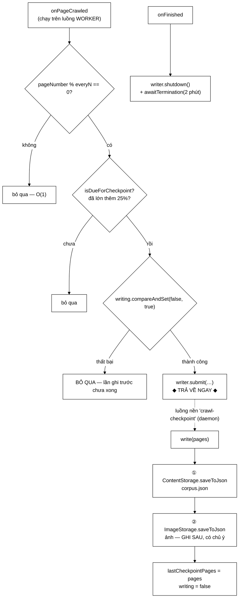

# CheckpointCrawlListener — thông lượng tụt 37%, và cách chu kỳ giãn dần cứu nó

**File nguồn:** `search-engine/src/main/java/com/vnsearch/crawler/CheckpointCrawlListener.java` (239 dòng)
**Gói:** `com.vnsearch.crawler` · **Loại:** `final class implements CrawlListener`, có luồng nền daemon
**Ghi đè:** 2/5 sự kiện (`onPageCrawled`, `onFinished`)
**Đọc kèm:** [`ContentStorage.md`](./ContentStorage.md) · [`CrawlListener.md`](./CrawlListener.md) · [`modular/ImageStorage.md`](./modular/ImageStorage.md)

---

## 📌 Hiểu trong 30 giây

[`ContentStorage`](./ContentStorage.md) giữ toàn bộ corpus **trong bộ nhớ** và
chỉ ghi ra tệp sau khi `crawl()` trả về. Trước thời điểm đó, mọi trang đã tải
chỉ tồn tại trong RAM của một tiến trình.

Lớp này ghi corpus xuống đĩa **định kỳ giữa phiên**. Nhưng phần đáng đọc nhất
không phải ý tưởng đó — mà là một **số đo thật**: chu kỳ ghi cố định làm thông
lượng crawl **tụt 37%** (38 → 24 trang/giây), và cách sửa là để chu kỳ **giãn
dần theo kích thước corpus**.



```
   MẤT MÁT: TỪ "CẢ PHIÊN" THÀNH "PHẦN SAU ĐIỂM KIỂM TRA GẦN NHẤT"

   Phiên 20.000 trang chạy 15 phút, Ctrl+C ở phút 14:

   ── Không có điểm kiểm tra ───────────────────────────────────────
   MẤT TRẮNG.  Không phải mất một tệp — mất CẢ CÔNG TẢI VỀ:
        15 phút băng thông
        20.000 lượt gõ vào máy chủ người khác
        và phải gõ LẠI TỪ ĐẦU

   ── Có điểm kiểm tra ─────────────────────────────────────────────
   giữ được phần tới điểm kiểm tra gần nhất
        + kết hợp crawl nối tiếp → phiên sau nạp lại tệp này và đi tiếp
```

---

## 1. Số đo thật: chu kỳ cố định làm crawler chậm 37%

Javadoc dòng 45–50 — đây là phần giá trị nhất của cả file, vì nó là **một vấn đề
được phát hiện bằng đo đạc, không bằng suy đoán**:

```
   Mỗi lần ghi là ghi LẠI TOÀN BỘ corpus
        → chi phí một lần ghi TỈ LỆ với số tài liệu đang có

   Ghi đều đặn mỗi everyN trang:
        lần ghi thứ k tốn ~ (k × everyN) đơn vị
        tổng cả phiên = everyN × (1 + 2 + … + n/everyN)
                      ≈ O(n² / everyN)          ← BẬC HAI

   ĐO ĐƯỢC:
        thông lượng crawl tụt 37%  (38 → 24 trang/giây) GIỮA phiên
        vì ở mốc 30.000 tài liệu, mỗi lần ghi đã nặng ~350 MB
        mà VẪN ghi 10 giây một lần
```

Biểu đồ chi phí tích luỹ:

```
   chi phí ghi
   tích luỹ  │                                    ╱  chu kỳ CỐ ĐỊNH
             │                                  ╱    O(n²/everyN)
             │                               ╱
             │                           ╱
             │                      ╱
             │                 ╱
             │            ╱          ___________________ chu kỳ GIÃN DẦN
             │       ╱      _________                     O(n)
             │  ╱ _________
             └──────────────────────────────────────────
               0        10k        20k        30k trang
```

### 1.1 Cách sửa: chu kỳ giãn theo **tỉ lệ tăng trưởng**

```java
private static final double GROWTH_RATIO = 0.25;

static boolean isDueForCheckpoint(int pages, int lastCheckpoint, int everyN) {
    int grown = pages - lastCheckpoint;
    return grown >= Math.max(everyN, (int) (lastCheckpoint * GROWTH_RATIO));
}
```

> Chỉ ghi lại khi corpus đã **lớn thêm 25%** so với lần ghi trước.

```
   Với everyN = 250:

   lastCheckpoint   ngưỡng = max(250, 25% × last)   ghi ở trang
   ──────────────   ─────────────────────────────   ────────────
             0                  250                      250
           250                  250                      500
           500                  250                      750
         1.000                  250                    1.250
         1.500                  375                    1.875
         2.500                  625                    3.125
         5.000                1.250                    6.250
        10.000                2.500                   12.500
        20.000                5.000                   25.000

   ⇒ ~21 lần ghi cho 30.000 trang, thay vì 120 lần
   ⇒ giảm ~12 LẦN lượng byte ghi
   ⇒ khoảng cách giãn CÙNG NHỊP với chi phí → tổng ≈ O(n)
```

`Math.max(everyN, …)` giữ một **sàn**: khi corpus còn nhỏ, 25% của nó cũng nhỏ,
nên `everyN` bảo đảm không ghi quá dày ở giai đoạn đầu.

### 1.2 Vì sao chọn 25% — và cái mất đi

Javadoc dòng 70–76 và 60–64 trả lời cả hai vế:

```
   VÌ SAO 25%
        tổng chi phí ghi cả phiên ≈ 5 lần kích thước corpus cuối — chấp nhận được
        nhỏ hơn → ghi dày hơn, chậm hơn
        lớn hơn → lưới an toàn thưa dần tới mức gần như không còn tác dụng

   CÁI MẤT ĐI
        ở mốc 30.000 trang, điểm kiểm tra cách nhau ~6.000 trang thay vì 250
        → hỏng giữa chừng có thể mất tới 20% phần cuối
```

Và lập luận vì sao đánh đổi đó **đúng hướng**:

> Điểm kiểm tra sinh ra để khỏi mất *cả phiên*, và mất 20% cuối vẫn tốt hơn
> nhiều so với việc crawl **chậm đi 37%** khiến phiên dài thêm và **rủi ro hỏng
> giữa chừng tăng theo**.

Vế cuối là điểm sắc sảo nhất: ghi dày hơn *tưởng* là an toàn hơn, nhưng nó kéo
dài phiên crawl, mà phiên dài hơn thì **xác suất bị hỏng cũng cao hơn**. Hai
hiệu ứng ngược chiều nhau, và tối ưu không nằm ở cực nào.

---

## 2. Ba cơ chế bảo vệ luồng worker

Đây là listener duy nhất làm việc **nặng**, nên nó phải tuân thủ nghiêm ngặt
điều khoản ngầm "listener chạy đồng bộ trên luồng worker nên phải nhanh"
([`CrawlListener.md`](./CrawlListener.md) mục 4.2).

### 2.1 Ghi trên **luồng nền riêng**

```java
private final ExecutorService writer = Executors.newSingleThreadExecutor(r -> {
    Thread t = new Thread(r, "crawl-checkpoint");
    t.setDaemon(true);          // ← daemon
    return t;
});
```

```
   Ghi ngay trong luồng gọi:
        serial hoá 25 MB JSON mất ~1 GIÂY
        → treo MỘT WORKER suốt thời gian đó
        → với 8 worker, mất 1/8 công suất mỗi lần ghi

   Luồng nền:
        onPageCrawled trả về sau ~1 µs (chỉ submit)
        worker đi tiếp ngay
```

**`setDaemon(true)`** — Javadoc dòng 91–94: *"nếu phiên crawl kết thúc bất
thường, luồng này không được phép giữ cho JVM sống mãi."*

```
   Luồng KHÔNG daemon:
        crawl ném exception → onFinished KHÔNG được gọi → writer không shutdown
        → JVM không thoát được, treo vĩnh viễn
        → phải kill -9

   Luồng daemon:
        JVM thoát khi mọi luồng non-daemon đã xong, bất kể luồng này còn chạy
```

**`newSingleThreadExecutor`** — chỉ một luồng ghi, nên hai lần ghi không bao giờ
chồng nhau ở tầng thực thi. Kết hợp với cờ `writing` (mục 2.2) thành hai lớp bảo
vệ độc lập.

### 2.2 **Bỏ qua** nếu lần ghi trước chưa xong

```java
if (!writing.compareAndSet(false, true)) {
    log.debug("Bỏ qua điểm kiểm tra ở trang {}: lần ghi trước chưa xong", e.pageNumber());
    return;
}
```

Javadoc dòng 34–40 nêu vấn đề nếu **xếp hàng** thay vì bỏ qua:

```
   Nếu chu kỳ ghi NGẮN HƠN thời gian ghi:
        ghi #1 mất 3 giây, lần ghi #2 tới sau 2 giây → xếp hàng
        ghi #2 mất 3,5 giây, #3 tới sau 2 giây → xếp hàng
        …
        → hàng đợi CÀNG LÚC CÀNG DÀI
        → crawler dần biến thành "chương trình chuyên ghi đĩa"
        → và mỗi mục trong hàng đợi giữ một bản chụp cũ, vô dụng

   Bỏ qua:
        "điểm kiểm tra chỉ cần ĐỦ GẦN ĐÂY, không cần ĐỦ MỌI LẦN"
```

**`compareAndSet` chứ không phải "kiểm tra rồi đặt"** — comment dòng 146–148:

```
   ❌  if (!writing.get()) { writing.set(true); … }
        onPageCrawled chạy ĐỒNG THỜI trên mọi worker
        → hai luồng cùng thấy false → cùng xếp một lần ghi
        → hai lần ghi cùng bản chụp, hoặc ghi đè nhau

   ✅  writing.compareAndSet(false, true)
        NGUYÊN TỬ: đúng một luồng nhận true
```

Cùng mẫu test-and-set nguyên tử với
[`UrlSeenFilter.markSeenIfNew`](./UrlSeenFilter.md) và
[`ContentSeenFilter.seenBefore`](./ContentSeenFilter.md) — ba lớp, ba cách đạt
được, cùng một nguyên tắc: **không cung cấp API cho phép làm sai**.

### 2.3 Ngoại lệ **không** được ném ra ngoài

```java
} catch (Exception e) {
    // Không ném ra ngoài: hỏng việc ghi điểm kiểm tra là mất một lưới an
    // toàn, còn ném ngoại lệ lên luồng worker sẽ làm hỏng chính phiên
    // crawl mà lưới đó đang bảo vệ.
    log.warn("Không ghi được điểm kiểm tra vào {}: {}", path, e.toString());
}
```

Lập luận này rất gọn và đúng: **công cụ bảo vệ không được phép phá thứ nó bảo
vệ.** Cùng nguyên tắc với [`UrlStorage.append`](./UrlStorage.md) mục 3.2 — dữ
liệu phụ trợ hỏng thì ghi log, không giết tiến trình.

(Về mặt kỹ thuật, ngoại lệ trong `writer.submit` sẽ bị `Future` nuốt chứ không
lan sang worker — nhưng bắt tường minh vẫn đúng, vì nó biến một lỗi **im lặng
hoàn toàn** thành một dòng log.)

---

## 3. `onFinished` — ghi nốt lần cuối và **chờ**

```java
@Override
public void onFinished(int totalPages, long elapsedMs) {
    writer.shutdown();
    try {
        if (!writer.awaitTermination(2, TimeUnit.MINUTES)) {
            log.warn("Điểm kiểm tra cuối chưa ghi xong sau 2 phút, bỏ dở");
        }
    } catch (InterruptedException ex) {
        Thread.currentThread().interrupt();
    }
}
```

Javadoc dòng 163–166: *"Không có bước này, phần crawl được sau điểm kiểm tra
cuối cùng sẽ nằm lại trong luồng nền và **mất khi JVM thoát** — đúng thứ lớp này
sinh ra để ngăn."*

```
   Luồng daemon + không chờ:
        crawl xong → main thread kết thúc → JVM thoát
        → luồng "crawl-checkpoint" đang ghi dở bị GIẾT
        → tệp .tmp còn đó, corpus.json là bản CŨ
        → mỉa mai: chính tính daemon (đúng ở mục 2.1) gây ra mất mát ở đây

   shutdown() + awaitTermination():
        chờ lần ghi đang chạy hoàn tất
        trần 2 phút để không treo vĩnh viễn nếu đĩa hỏng
```

Cặp `daemon` + `awaitTermination` là thiết kế đúng: daemon lo ca **bất thường**
(crawl ném exception, `onFinished` không được gọi), `awaitTermination` lo ca
**bình thường**.

`Thread.currentThread().interrupt()` trong `catch` — chi tiết đúng và hay bị
quên, đã gặp ở [`RobotsTxtParser`](./RobotsTxtParser.md).

> ⚠️ **Một khoảng trống:** `onFinished` chỉ *chờ* lần ghi đang chạy, **không**
> kích hoạt một lần ghi mới. Nếu điểm kiểm tra cuối ở trang 25.000 và phiên dừng
> ở 30.000, thì 5.000 trang cuối chỉ được ghi bởi `CrawlerService` sau khi
> `crawl()` trả về — tức nằm ngoài tầm bảo vệ của lớp này. Trong luồng bình
> thường thì ổn; nhưng nếu ai đó bỏ bước ghi cuối ở `CrawlerService`, mất mát sẽ
> im lặng. Xem đề xuất 2.

---

## 4. Ảnh ghi **sau** corpus — và vì sao thứ tự quan trọng

### 4.1 Vì sao ảnh phải đi cùng nhịp với corpus

Javadoc dòng 116–121:

```
   Nếu CHỈ corpus có điểm kiểm tra:
        Ctrl+C ở phút thứ 40
        → trên đĩa: 12.000 trang, và 0 ẢNH
        → người chạy tưởng phiên crawl đó KHÔNG TÌM ĐƯỢC ẢNH NÀO
        → trong khi thật ra ảnh có đủ và vừa bốc hơi cùng tiến trình

   "Hai tệp mô tả cùng một phiên crawl, nên chúng phải CÙNG SỐNG HOẶC CÙNG CHẾT."
```

Chi phí thêm gần như bằng không: tệp ảnh nhỏ hơn corpus **vài chục lần** (chỉ có
siêu dữ liệu, không có `bodyText`), và ghi trên cùng luồng nền.

### 4.2 Thứ tự ghi — comment dòng 210–214

```java
ContentStorage.saveToJson(docs, path);              // ① corpus TRƯỚC
...
ImageStorage.saveToJson(snapshotImages, ...);       // ② ảnh SAU
```

```
   Bị cắt ngang giữa ① và ②:
        corpus MỚI  +  ảnh CŨ
        → thiếu ảnh của vài trăm trang cuối
        → chỗ trống, dễ nhận ra, vô hại

   Nếu đảo thứ tự (ảnh trước, corpus sau) — bị cắt ngang:
        ảnh MỚI  +  corpus CŨ
        → kho ảnh trỏ tới những trang KHÔNG CÓ trong corpus
        → ImageStore.forPages không bao giờ tra ra chúng
        → RÁC CÂM: chiếm chỗ, không dùng được, không ai biết
```

Nguyên tắc: **khi hai tệp phải nhất quán mà không có transaction, ghi tệp được
tham chiếu trước, tệp tham chiếu sau.** Bản ghi "mồ côi" luôn tệ hơn bản ghi
"thiếu".

Kết hợp với việc [`ContentStorage.saveToJson`](./ContentStorage.md) mục 3 dùng
tệp tạm + `ATOMIC_MOVE`, ta có: **mỗi tệp riêng lẻ luôn nguyên vẹn**, chỉ có
quan hệ giữa hai tệp là có thể lệch — và lệch theo chiều vô hại.

---

## 5. Hướng dẫn về code

### 5.1 `Supplier` chứ không phải danh sách truyền sẵn — dòng 42–43

```java
private final Supplier<List<WebDocument>> snapshot;
```

> Nội dung cần ghi là trạng thái **tại lúc ghi**, không phải lúc đăng ký listener.

```java
// ❌ Truyền danh sách
new CheckpointCrawlListener(storage.all(), path, 250);
//                          ↑ chụp NGAY lúc đăng ký — lúc đó corpus RỖNG
//                            → mọi điểm kiểm tra ghi ra một danh sách rỗng

// ✅ Truyền Supplier
new CheckpointCrawlListener(storage::all, path, 250);
//                          ↑ gọi TẠI LÚC ghi → luôn là trạng thái hiện tại
```

Đây cũng là cách lớp này **không cần biết** [`ContentStorage`](./ContentStorage.md)
là gì — nó chỉ cần một hàm trả danh sách. Ghép lỏng, và test dựng được bằng một
lambda.

### 5.2 `isDueForCheckpoint` là hàm **tĩnh, thuần** — dòng 190–193

```java
static boolean isDueForCheckpoint(int pages, int lastCheckpoint, int everyN)
```

Javadoc nêu lý do rất thực dụng:

> Viết thành hàm tĩnh, thuần (chỉ phụ thuộc tham số, không đọc trạng thái nào)
> **để kiểm thử được trực tiếp**. Kiểm thử qua `onPageCrawled` thì phải dựng
> luồng nền và tệp tạm — nhiều công sức cho một phép so sánh số học.

Đây là mẫu đáng học: **tách phần logic thuần khỏi phần có tác dụng phụ**, rồi
test phần thuần trực tiếp. Cùng tinh thần với `parseForTest` của
[`RobotsTxtParser`](./RobotsTxtParser.md).

Mức `static` package-private: test cùng gói gọi được, API công khai không phình.

### 5.3 `volatile int lastCheckpointPages`

```java
private volatile int lastCheckpointPages;
```

Trường này được **ghi** từ luồng nền (`write`) và **đọc** từ mọi luồng worker
(`onPageCrawled`). `volatile` bảo đảm luồng worker thấy giá trị mới nhất.

Không cần nguyên tử hơn thế: nếu hai worker đọc giá trị hơi cũ và cùng thấy "đến
lúc ghi", cờ `writing` đã chặn ở bước sau.

### 5.4 Cạm bẫy khi sửa lớp này

| Cạm bẫy | Hậu quả | Cách đúng |
|---|---|---|
| Ghi đồng bộ trong `onPageCrawled` | Treo một worker ~1 giây mỗi lần ghi | Giữ luồng nền |
| **Bỏ `GROWTH_RATIO`, ghi đều đặn** | **Thông lượng tụt 37% — đã đo** | Giữ chu kỳ giãn dần |
| Xếp hàng thay vì bỏ qua khi đang ghi | Hàng đợi dồn, crawler thành chương trình ghi đĩa | Giữ `compareAndSet` |
| `if (!writing.get()) writing.set(true)` | Hai worker cùng xếp một lần ghi | Giữ `compareAndSet` |
| Bỏ `setDaemon(true)` | JVM treo khi crawl ném exception | Giữ |
| Bỏ `awaitTermination` trong `onFinished` | Lần ghi cuối bị JVM giết giữa chừng | Giữ |
| Ném ngoại lệ từ `write` | Lưới an toàn phá thứ nó bảo vệ | Giữ `catch` + log |
| Ghi ảnh **trước** corpus | Kho ảnh trỏ tới trang không tồn tại — rác câm | Giữ thứ tự |
| Truyền `List` thay `Supplier` | Ghi ra danh sách rỗng của lúc đăng ký | Giữ `Supplier` |
| Bỏ `volatile` | Worker đọc `lastCheckpointPages` cũ | Giữ |

### 5.5 Tệp đích **trùng** tệp đầu ra cuối phiên

```java
 * @param path tệp đích — TRÙNG với tệp đầu ra cuối phiên, để lần chạy
 *             sau nạp lại được mà không cần biết có điểm kiểm tra hay không
```

Quyết định đơn giản mà quan trọng: không có `corpus.checkpoint.json` riêng.
[`IndexBuilder`](../service/IndexBuilder.md) và lần crawl nối tiếp chỉ cần đọc
`corpus.json`, không phải kiểm tra xem có điểm kiểm tra hay không, cũng không
phải chọn tệp nào mới hơn.

Cái giá: điểm kiểm tra **ghi đè** tệp đầu ra của phiên trước. Nếu phiên mới chạy
được ít trang hơn phiên cũ, corpus bị thu nhỏ lại. Nhưng với crawl nối tiếp
(phiên sau nạp lại rồi đi tiếp) thì điều đó không xảy ra.

---

## 6. Độ phức tạp & chi phí

Gọi $n$ = số trang, $S$ = kích thước corpus.

| Thao tác | Chi phí | Luồng |
|---|---|---|
| `onPageCrawled` — bị lọc | $O(1)$, ~3 ns | worker |
| `onPageCrawled` — submit | $O(1)$, ~1 µs | worker |
| `write` — `snapshot.get()` | $O(n)$ sao chép tham chiếu | nền |
| **`write` — `saveToJson`** | **$O(S)$ ≈ 1–3 giây cho 40 MB** | nền |
| `write` — ảnh | $O(I)$, nhỏ hơn ~50 lần | nền |
| `onFinished` | Chờ tối đa 2 phút | worker |

Tổng chi phí ghi cả phiên:

```
   Chu kỳ CỐ ĐỊNH (everyN = 250, n = 30.000):
        120 lần ghi, kích thước trung bình S/2
        tổng ≈ 120 × 175 MB = 21 GB ghi đĩa
        → và thông lượng crawl tụt 37%

   Chu kỳ GIÃN DẦN (GROWTH_RATIO = 0,25):
        ~21 lần ghi
        tổng ≈ 5 × S = 1,75 GB
        ────────────────────────────
        GIẢM ~12 LẦN
```

Bộ nhớ thêm: `snapshot.get()` tạo một `ArrayList` sao chép **tham chiếu** (~250
KB cho 31.030 tài liệu), không sao chép nội dung. Đỉnh bộ nhớ trong lúc ghi
không tăng đáng kể — Jackson ghi theo luồng.

---

## 7. Kiểm thử liên quan

| Test | Bảo vệ điều gì |
|---|---|
| `test/java/com/vnsearch/crawler/CheckpointCrawlListenerTest.java` | Chủ yếu là `isDueForCheckpoint` — hàm thuần |

```powershell
cd search-engine
.\mvnw.cmd -q -Dtest='CheckpointCrawlListenerTest' test
```

Bảng ca kiểm thử cho hàm thuần (`everyN = 250`, `GROWTH_RATIO = 0,25`):

```
   pages    lastCheckpoint   ngưỡng = max(250, 25%×last)   kết quả
   ──────   ──────────────   ──────────────────────────    ────────
      250              0            250                    ✓ ghi   ← lần đầu LUÔN được
      100              0            250                    ✗
      500            250            250                    ✓
      400            250            250                    ✗
    1.250          1.000            250                    ✓
    1.100          1.000            250                    ✗
    6.250          5.000          1.250                    ✓       ← ngưỡng ĐÃ GIÃN
    5.500          5.000          1.250                    ✗
   25.000         20.000          5.000                    ✓
```

Ca `lastCheckpoint == 0` đáng nhấn mạnh: Javadoc dòng 187–188 nói *"lần ghi đầu
tiên luôn được phép, nếu không thì phiên crawl ngắn sẽ chẳng có điểm kiểm tra
nào."*

Ba kịch bản chưa có test và đáng có:

```java
// 1. Bỏ qua khi đang ghi — cờ writing hoạt động
//    Dùng một Supplier chậm (sleep 200 ms) rồi gọi onPageCrawled hai lần liên tiếp
//    → chỉ MỘT tệp được ghi

// 2. onFinished CHỜ lần ghi cuối hoàn tất
@Test
void onFinishedChoGhiXong() throws Exception {
    var listener = new CheckpointCrawlListener(supplierCham, tepTam, 1);
    listener.onPageCrawled(new CrawlEvent(1, 10, "https://a.vn/", 1, 5, 100, 2));
    listener.onFinished(1, 1000);
    assertTrue(Files.exists(Path.of(tepTam)));   // ← ghi xong TRƯỚC khi onFinished trả về
}

// 3. Lỗi ghi KHÔNG ném ra ngoài
@Test
void loiGhiKhongNem() {
    var listener = new CheckpointCrawlListener(supplier, "/duong-dan-khong-ghi-duoc/x.json", 1);
    assertDoesNotThrow(() -> {
        listener.onPageCrawled(...);
        listener.onFinished(1, 1000);
    });
}
```

Kịch bản 2 quan trọng nhất — nó bảo vệ đúng thứ mà Javadoc dòng 163–166 mô tả là
lý do tồn tại của `onFinished`.

---

## 8. Liên kết

- Interface: [`CrawlListener.md`](./CrawlListener.md)
- Nguồn bản chụp corpus, và hàm ghi nguyên tử: [`ContentStorage.md`](./ContentStorage.md)
- Nguồn bản chụp ảnh: [`modular/ImageStorage.md`](./modular/ImageStorage.md) · [`bus/ImageFound.md`](./bus/ImageFound.md)
- Nơi đăng ký listener và ghi corpus lần cuối: [`CrawlerService.md`](./CrawlerService.md)
- Nơi tệp này được nạp lại: [`../service/IndexBuilder.md`](../service/IndexBuilder.md)
- Cơ chế tiếp tục phiên cho URL (song song với lớp này): [`UrlStorage.md`](./UrlStorage.md)
- Listener anh em: [`ConsoleCrawlListener.md`](./ConsoleCrawlListener.md) · [`ProgressBarCrawlListener.md`](./ProgressBarCrawlListener.md)
- Tổng quan: `docs/ARCHITECTURE.md`, `docs/DEVOPS.md`
