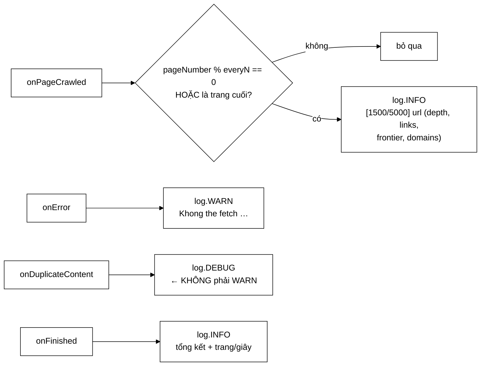

# ConsoleCrawlListener — cùng một hành vi, nhưng nay tắt được

**File nguồn:** `search-engine/src/main/java/com/vnsearch/crawler/ConsoleCrawlListener.java` (58 dòng)
**Gói:** `com.vnsearch.crawler` · **Loại:** `final class implements CrawlListener`
**Ghi đè:** 4/5 sự kiện (bỏ `onForeignLanguage`)
**Đọc kèm:** [`CrawlListener.md`](./CrawlListener.md) · [`ProgressBarCrawlListener.md`](./ProgressBarCrawlListener.md) · [`CrawlerService.md`](./CrawlerService.md)

---

## 📌 Hiểu trong 30 giây

Đây **chính là** hành vi trước đây bị chôn cứng trong vòng lặp worker — nhưng
nay nó là *một trong nhiều* listener có thể có.

Javadoc dòng 10–11 nêu lợi ích quan trọng nhất một cách rất gọn: *"test có thể
đơn giản **KHÔNG đăng ký nó**, thay vì phải chịu spam console."*

Ba quyết định trong 58 dòng, và cả ba đều xoay quanh **không làm nhiễu log**:

1. **SLF4J** thay `System.out.printf`
2. **Tiết lưu** — chỉ in mỗi `everyN` trang
3. **Mức log đúng với bản chất sự kiện** — `DEBUG` cho trùng nội dung, không phải `WARN`



```
   VÌ SAO SLF4J CHỨ KHÔNG PHẢI System.out.printf

   System.out.printf          SLF4J
   ─────────────────────      ────────────────────────────────────
   không tắt được             tắt theo cấu hình (logback.xml)
   không có phân mức          INFO / WARN / DEBUG
   không có mốc thời gian     có timestamp
   chỉ ra màn hình            định tuyến ra file, ra syslog, ra bất kỳ đâu
   ghép chuỗi LUÔN            {} chỉ ghép khi mức log đang bật
```

Điểm cuối là một tối ưu thật, không phải hình thức:

```java
log.debug("Trung noi dung, bo qua: {}", url);
//        ↑ nếu mức DEBUG đang tắt, chuỗi KHÔNG BAO GIỜ được ghép
// so với:
log.debug("Trung noi dung, bo qua: " + url);
//        ↑ ghép chuỗi LUÔN, rồi vứt đi — lãng phí ở mọi lần gọi
```

Với `onDuplicateContent` chạy hàng nghìn lần mỗi phiên, khác biệt này đo được.

---

## 1. Tiết lưu: `everyN`

```java
public ConsoleCrawlListener(int everyN) {
    this.everyN = Math.max(1, everyN);        // ← chống everyN = 0 hoặc âm
}

@Override
public void onPageCrawled(CrawlEvent e) {
    if (e.pageNumber() % everyN != 0 && e.pageNumber() != e.maxPages()) {
        return;
    }
    log.info("[{}/{}] {} (depth={}, {} links, frontier={}, domains={})", ...);
}
```

```
   Không tiết lưu, crawl 31.030 trang:
        31.030 dòng log
        → tệp log ~4 MB
        → cuộn không nổi, không đọc được gì
        → và ghi log CŨNG tốn thời gian trên luồng worker

   everyN = 100:
        311 dòng — vừa đủ để theo dõi tiến độ
```

### 1.1 Hai chi tiết nhỏ nhưng đúng

**`Math.max(1, everyN)`** — `everyN = 0` sẽ gây `ArithmeticException: / by zero`
ở phép `%`. Kẹp về 1 (in mọi trang) thay vì ném: một tham số cấu hình sai không
nên làm chết crawler, và "in nhiều quá" là hậu quả nhẹ, tự thấy ngay.

**`|| e.pageNumber() != e.maxPages()`** — luôn in **trang cuối cùng**:

```
   maxPages = 5.000, everyN = 300
        in ở trang 300, 600, …, 4.800
        rồi im lặng cho tới hết
        → dòng cuối cùng người dùng thấy là "[4800/5000]"
        → tưởng crawler treo ở 4.800

   Với điều kiện bổ sung:
        in thêm "[5000/5000]"  → rõ ràng là đã xong
```

> ⚠️ Điều kiện này chỉ đúng khi phiên crawl dừng vì **đủ `maxPages`**. Nếu dừng
> vì hết giờ hoặc hết việc (frontier rỗng), trang cuối cùng không bằng `maxPages`
> nên vẫn có thể không được in. Nhưng `onFinished` luôn in tổng kết, nên khoảng
> trống này được bù.

---

## 2. Mức log — `DEBUG` cho trùng nội dung

Javadoc dòng 41–45 nêu lý do rất rõ:

> Ở mức `DEBUG` chứ không phải `WARN`: vứt trang trùng nội dung là crawler **làm
> đúng việc của nó**, không phải sự cố. In ở mức `warn` sẽ làm nhiễu log vì trên
> báo điện tử **tỷ lệ trùng không hề nhỏ**.

```
   Bảng mức log theo bản chất sự kiện:

   onPageCrawled      INFO   tiến độ bình thường, người vận hành muốn thấy
   onFinished         INFO   tổng kết
   onError            WARN   thật sự có vấn đề — cần chú ý
   onDuplicateContent DEBUG  hệ thống làm đúng — chỉ xem khi chẩn đoán

   Nếu onDuplicateContent ở mức WARN:
        ~2.500 dòng WARN mỗi phiên (8% của 31.030 trang)
        → người vận hành quen với việc "có nhiều warning"
        → khi có WARN THẬT, nó chìm trong đám kia
        ⇒ đây là cách làm hỏng một hệ thống cảnh báo
```

Đây là hệ quả trực tiếp của việc [`CrawlListener`](./CrawlListener.md) tách
`onDuplicateContent` khỏi `onError`: nhờ tách ở tầng interface, bản cài đặt mới
**chọn được** mức log khác nhau.

### 2.1 `onForeignLanguage` **không** được ghi đè

Lớp này bỏ qua sự kiện thứ tư. Hợp lý ở mức "không làm nhiễu log" — nhưng nó
cũng có nghĩa là số liệu ngoại ngữ **hoàn toàn vô hình** trên console.

Số liệu đó chỉ đến được người vận hành qua các bộ đếm của
[`LanguageFilter`](./LanguageFilter.md), và chỉ khi có ai đó chủ động in ra ở
cuối phiên. Vòng phản hồi mô tả ở [`CrawlListener.md`](./CrawlListener.md) mục
1.2 vì thế **không tự động** — nó cần một bước thủ công. Xem đề xuất 2.

---

## 3. `onFinished` — tổng kết và một chi tiết chia cho 0

```java
@Override
public void onFinished(int totalPages, long elapsedMs) {
    double seconds = elapsedMs / 1000.0;
    log.info("Ket thuc crawl: {} trang trong {} giay ({} trang/giay)",
            totalPages, String.format("%.1f", seconds),
            String.format("%.2f", seconds > 0 ? totalPages / seconds : 0.0));
}
```

`seconds > 0 ? … : 0.0` chặn chia cho 0 — xảy ra khi phiên crawl kết thúc trong
dưới một mili giây (crawl 0 trang, hoặc bị huỷ ngay). Không có nó, kết quả là
`Infinity` và dòng log thành `"Infinity trang/giay"`.

**"trang/giây" là chỉ số hữu ích nhất trong dòng này:**

```
   ~4 trang/giây   → bình thường với 8 worker, timeout 10 giây
   ~0,3 trang/giây → CHẬM — hai khả năng:
        ├─ nhiều URL timeout (host chết, mạng kém)
        └─ politeness delay quá lớn so với số host
   ~40 trang/giây  → NHANH bất thường — có thể đang tải trang lỗi rất nhẹ
```

> **Một điểm không nhất quán:** hai lời gọi `String.format` được đánh giá **luôn**,
> ngay cả khi mức INFO đang tắt — đúng cái mà cú pháp `{}` sinh ra để tránh.
> Ở đây vô hại (chạy đúng một lần mỗi phiên), nhưng nó cho thấy tối ưu `{}` ở
> `onDuplicateContent` là có ý thức chứ không phải thói quen tự động.

---

## 4. Hướng dẫn về code

### 4.1 `final class` — có chủ ý

```java
public final class ConsoleCrawlListener implements CrawlListener {
```

Không có lý do để kế thừa: muốn hành vi khác thì viết một listener khác và đăng
ký cả hai — đó chính là điểm mạnh của mẫu Observer. `final` nói rõ điều đó.

### 4.2 Không giữ trạng thái ⇒ an toàn đa luồng miễn phí

Trường duy nhất là `everyN` (`final`, chỉ đọc). `Logger` của SLF4J thread-safe
theo đặc tả. Nên lớp này thoả mãn điều khoản ngầm "listener phải an toàn đa
luồng" ([`CrawlListener.md`](./CrawlListener.md) mục 4.1) mà không cần làm gì.

Nhưng có một hệ quả về thứ tự:

```
   8 worker cùng gọi onPageCrawled:
        pageNumber tăng ĐÚNG (do CrawlerService cấp phát)
        nhưng THỨ TỰ IN có thể lệch:
             [1500/5000] …
             [1600/5000] …
             [1500/5000] …   ← không, cái này không xảy ra vì mỗi số chỉ có một lần

        Thực tế: các dòng in ra CÓ THỂ không tăng dần đều
             [1500/5000] …
             [1700/5000] …
             [1600/5000] …   ← worker chậm hơn in sau
```

Không phải lỗi, nhưng người đọc log nên biết — số thứ tự không bảo đảm tăng dần
theo dòng.

### 4.3 Cạm bẫy khi sửa lớp này

| Cạm bẫy | Hậu quả | Cách đúng |
|---|---|---|
| Đổi `onDuplicateContent` lên `WARN` | ~2.500 dòng WARN giả mỗi phiên, che lấp lỗi thật | Giữ `DEBUG` |
| Bỏ `Math.max(1, everyN)` | `everyN = 0` → chia cho 0 ở phép `%` | Giữ |
| Bỏ điều kiện in trang cuối | Người dùng tưởng crawler treo | Giữ |
| Quay lại `System.out.printf` | Mất khả năng tắt, mất phân mức, spam test | Giữ SLF4J |
| Dùng `"..." + url` thay `{}` | Ghép chuỗi cả khi mức log tắt | Giữ `{}` |
| Thêm thao tác chậm (ghi CSDL, gọi HTTP) | Làm chậm luồng worker | Viết listener riêng có hàng đợi |
| Thêm trạng thái mà không đồng bộ | Gọi từ N worker đồng thời | Dùng `AtomicLong` |

### 4.4 Cấu hình mức log

Để **bật** dòng `DEBUG` khi cần chẩn đoán tỷ lệ trùng:

```xml
<!-- src/main/resources/logback-spring.xml -->
<logger name="com.vnsearch.crawler.ConsoleCrawlListener" level="DEBUG"/>
```

Để **tắt hẳn** listener này khi chạy test — cách đúng là **không đăng ký nó**,
đúng như Javadoc nêu. Nhưng nếu nó được đăng ký ở đâu đó ngoài tầm kiểm soát:

```xml
<logger name="com.vnsearch.crawler.ConsoleCrawlListener" level="OFF"/>
```

---

## 5. Độ phức tạp & chi phí

| Thao tác | Chi phí |
|---|---|
| `onPageCrawled` — bị tiết lưu bỏ qua | $O(1)$, ~2 ns (một phép `%`) |
| `onPageCrawled` — có in | ~2–10 µs (định dạng + ghi) |
| `onError` / `onDuplicateContent` (DEBUG tắt) | ~5 ns — SLF4J kiểm tra mức rồi trả về |
| `onFinished` | ~10 µs, một lần |

```
   Phiên 31.030 trang, everyN = 100:
        30.720 lần bị tiết lưu × 2 ns   ≈ 0,00006 giây
           311 lần in       × 5 µs      ≈ 0,0016 giây
        ────────────────────────────────────────────
        TỔNG ≈ 2 mili giây trên cả phiên crawl 1 giờ 43 phút

   Không tiết lưu:
        31.030 × 5 µs ≈ 0,16 giây — vẫn nhỏ, nhưng tệp log 4 MB thì không dùng được
```

Kết luận: **chi phí thật của việc ghi log không phải CPU mà là khả năng đọc
được.** `everyN` tồn tại vì lý do thứ hai, không phải thứ nhất.

---

## 6. Kiểm thử liên quan

| Test | Bảo vệ điều gì |
|---|---|
| `test/java/com/vnsearch/crawler/CrawlerServiceBusWiringTest.java` | Sự kiện được phát đúng lúc |

Lớp này **không có test riêng** — chấp nhận được với một listener chỉ ghi log,
nhưng hai hành vi thì đáng test vì chúng là logic thật, không phải định dạng:

```java
// 1. Tiết lưu: everyN = 3, gọi 10 lần → in đúng 3 lần (trang 3, 6, 9)
//    + trang cuối (pageNumber == maxPages) LUÔN được in
@Test
void chiInMoiNTrangVaLuonInTrangCuoi() {
    // Bắt log bằng một ListAppender của Logback
    var listener = new ConsoleCrawlListener(3);
    for (int i = 1; i <= 10; i++) {
        listener.onPageCrawled(new CrawlEvent(i, 10, "https://a.vn/" + i, 1, 5, 100, 2));
    }
    // trang 3, 6, 9 (theo everyN) + trang 10 (là maxPages) = 4 dòng
    assertEquals(4, soDongInfoDaGhi());
}

// 2. everyN = 0 không gây ArithmeticException
@Test
void everyNBangKhongThiKepVeMot() {
    var listener = new ConsoleCrawlListener(0);
    assertDoesNotThrow(() ->
        listener.onPageCrawled(new CrawlEvent(1, 10, "https://a.vn/", 1, 5, 100, 2)));
}
```

Test thứ nhất bảo vệ điều kiện `|| e.pageNumber() != e.maxPages()` — một dòng
trông thừa mà thật ra chặn hiện tượng "tưởng crawler treo".

---

## 7. Liên kết

- Interface: [`CrawlListener.md`](./CrawlListener.md)
- Listener anh em: [`ProgressBarCrawlListener.md`](./ProgressBarCrawlListener.md) · [`CheckpointCrawlListener.md`](./CheckpointCrawlListener.md)
- Nơi đăng ký listener: [`CrawlerService.md`](./CrawlerService.md)
- Nguồn `onDuplicateContent`: [`ContentSeenFilter.md`](./ContentSeenFilter.md)
- Sự kiện bị bỏ qua: [`LanguageFilter.md`](./LanguageFilter.md)
- Cấu hình mức log: `docs/CONFIGURATION.md`, `docs/DEVOPS.md`
