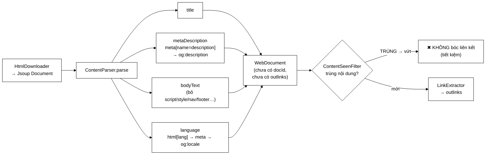

# ContentParser — vì sao *không* bóc liên kết ở đây

**File nguồn:** `search-engine/src/main/java/com/vnsearch/crawler/ContentParser.java` (85 dòng)
**Gói:** `com.vnsearch.crawler` · **Loại:** `class` không trạng thái, một hàm công khai
**Vị trí trong sơ đồ:** khối **"Content Parser"**, chạy sau [`HtmlDownloader`](./HtmlDownloader.md), trước [`ContentSeenFilter`](./ContentSeenFilter.md)
**Đọc kèm:** [`LinkExtractor.md`](./LinkExtractor.md) · [`LanguageFilter.md`](./LanguageFilter.md) · [`../model/WebDocument.md`](../model/WebDocument.md)

---

## 📌 Hiểu trong 30 giây

Nhận cây DOM đã tải, rút ra **nội dung**: tiêu đề, mô tả meta, văn bản thân bài,
ngôn ngữ tự khai. Dựng thành một [`WebDocument`](../model/WebDocument.md).

Điều đáng đọc nhất là một việc lớp này **cố tình không làm**: bóc liên kết.
Trong bản cũ (`HtmlExtractor`) hai việc đó nằm chung một lớp, và tách chúng ra
là một quyết định có lợi ích đo được.



```
   VÌ SAO TÁCH LÀM HAI KHỐI — SƠ ĐỒ QUYẾT ĐỊNH THỨ TỰ

   Content Parser  →  Content Seen?  →  Link Extractor
                       ↑ khối này NẰM GIỮA

   ── Gộp làm một (HtmlExtractor bản cũ) ───────────────────────────
   mọi trang đều bị bóc liên kết, KỂ CẢ trang sắp bị vứt vì trùng
        → công việc bỏ đi ngay sau khi làm xong

   ── Tách hai (đang dùng) ─────────────────────────────────────────
   trang trùng bị vứt TRƯỚC khi tới Link Extractor
        → và các liên kết đó ĐÃ được lấy từ bản gốc rồi, nên không mất gì
```

---

## 1. Lợi ích của việc tách — định lượng

```
   Giả sử 8% trang tải về là bản trùng nội dung (con số hợp lý cho báo điện tử,
   xem ContentSeenFilter.md mục 1):

   31.030 trang tải về
        └─ ~2.480 trang là bản trùng

   Bóc liên kết một trang: duyệt ~79 thẻ <a href>, mỗi thẻ
        ├─ absUrl()      — ghép URL tương đối thành tuyệt đối
        ├─ canonicalize() — ~1,5 µs
        └─ thêm vào LinkedHashSet
        ≈ 250 µs mỗi trang

   Tiết kiệm: 2.480 × 250 µs ≈ 0,62 giây
```

Con số tuyệt đối nhỏ. Nhưng lợi ích thật **không phải hiệu năng**:

| Lợi ích | Giá trị thực |
|---|---|
| Tiết kiệm CPU | 0,62 giây — không đáng kể |
| **Mã nguồn khớp sơ đồ kiến trúc** | Đọc sơ đồ là biết tìm lớp nào |
| **Mỗi lớp một trách nhiệm** | `ContentParser` test được mà không cần biết gì về URL |
| **Thứ tự trở nên bắt buộc** | Không thể vô tình bóc liên kết trước khi khử trùng |

Lợi ích thứ ba đáng nói: khi hai việc nằm chung một hàm, **không có cách nào**
chèn bước khử trùng vào giữa. Tách ra thì thứ tự trở thành một phần của thiết
kế, không phải một quy ước mà người viết phải nhớ.

---

## 2. Bản đồ lớp

```
ContentParser  (không trạng thái → an toàn đa luồng miễn phí)
├── parse(url, Document) → WebDocument          public
├── extractDeclaredLanguage(Document)  private  ── 3 nguồn, theo thứ tự ưu tiên
├── extractMetaDescription(Document)   private  ── 2 nguồn
└── extractBodyText(Document)          private  ── CLONE rồi xoá thẻ nhiễu
```

### 2.1 `WebDocument` trả về **chưa hoàn chỉnh** — có chủ ý

Javadoc dòng 34–36 nói rõ hai trường còn thiếu:

| Trường | Ai điền | Khi nào |
|---|---|---|
| `docId` | [`CrawlerService`](./CrawlerService.md) | Sau khi trang được chấp nhận |
| `outlinks` | [`LinkExtractor`](./LinkExtractor.md) | **Chỉ khi** trang vượt qua khử trùng |
| `language` | Bị [`LanguageFilter`](./LanguageFilter.md) **ghi đè** | Sau khi phân tích nội dung |

Đây là mẫu **dựng dần** (progressive construction): mỗi khối trong luồng crawl
điền phần của mình. Nó hợp lý vì mỗi khối có thông tin mà khối khác không có —
`ContentParser` không biết `docId` tiếp theo là bao nhiêu, `CrawlerService`
không biết cách bóc thân bài.

> ⚠️ **Cái giá:** giữa các khối, `WebDocument` ở trạng thái **chưa hợp lệ**. Ai
> đọc `doc.getOutlinks()` ngay sau `parse()` sẽ nhận danh sách rỗng và tưởng
> trang không có liên kết nào. Javadoc cảnh báo, nhưng trình biên dịch thì
> không. Xem đề xuất 3.

### 2.2 Jsoup — thư viện HTML **duy nhất** được phép dùng

Javadoc dòng 24–27 nêu một ràng buộc của đề bài, và cách nó được tôn trọng:

```
   ĐƯỢC dùng Jsoup cho:          KHÔNG được dùng Jsoup (hay thư viện nào) cho:
   ─────────────────────         ──────────────────────────────────────────────
   parse HTML → DOM              tách từ tiếng Việt  → VietnameseTokenizer (tự cài)
   duyệt/chọn phần tử (select)   dựng chỉ mục ngược   → InvertedIndex      (tự cài)
   ghép URL tuyệt đối (absUrl)   chấm điểm xếp hạng   → ResultRanker       (tự cài)
```

Ranh giới rất rõ: Jsoup làm đúng việc **phân tích cú pháp HTML** — thứ không
phải trọng tâm học thuật của đồ án và tự viết thì tốn hàng nghìn dòng cho một
kết quả kém hơn. Mọi thuật toán thuộc phần lõi (tách từ, chỉ mục, xếp hạng) đều
tự cài.

Đây là loại ranh giới nên nêu rõ khi bảo vệ: nó cho thấy tác giả phân biệt được
"phần phải tự làm để chứng minh năng lực" và "phần dùng thư viện là hợp lý".

---

## 3. Hướng dẫn về code

### 3.1 `extractBodyText` — `clone()` là chi tiết quan trọng nhất

```java
private String extractBodyText(Document document) {
    Document clone = document.clone();                                    // ① SAO CHÉP
    clone.select("script, style, noscript, nav, footer, header, iframe, svg").remove();
    return clone.body() != null ? clone.body().text().trim() : "";        // ② có thể null
}
```

**① Vì sao phải `clone()`:**

```
   Không clone → .remove() SỬA TRỰC TIẾP cây DOM gốc
        │
        ├─ ContentParser chạy TRƯỚC LinkExtractor
        └─ LinkExtractor nhận CÙNG một Document
             │
             └─ nếu <nav> và <footer> đã bị xoá…
                  → MẤT toàn bộ liên kết trong thanh điều hướng và chân trang
                  → mà đó chính là nơi có nhiều liên kết chuyên mục nhất!
                  → crawler bỏ sót phần lớn cấu trúc site
```

Đây là một **tác dụng phụ giữa hai lớp** — loại lỗi rất khó lần ra vì triệu
chứng ("crawl được ít trang") xuất hiện ở một nơi hoàn toàn khác với nguyên nhân
(một lời gọi `.remove()` trong lớp phân tích nội dung).

Cái giá của `clone()`: sao chép toàn bộ cây DOM, tốn ~1–3 ms và một lượng bộ nhớ
bằng kích thước trang. Xem mục 4 để biết vì sao vẫn đáng.

**② `clone.body()` có thể `null`:** một tài liệu HTML méo (chỉ có `<head>`, hoặc
phản hồi không phải HTML lọt qua) không có phần tử `body`. Trả `""` thay vì ném
là đúng — và chuỗi rỗng đó được
[`ContentSeenFilter`](./ContentSeenFilter.md) xử lý riêng (đếm vào
`blankSkipped`, không coi là trùng).

### 3.2 Danh sách thẻ bị xoá — mỗi thẻ một lý do

```java
"script, style, noscript, nav, footer, header, iframe, svg"
```

| Thẻ | Vì sao xoá | Nếu giữ lại |
|---|---|---|
| `script` | Mã JavaScript | Hàng KB `function(){...}` vào chỉ mục → term rác |
| `style` | CSS | `.header{color:#fff}` thành "từ khoá" |
| `noscript` | Nội dung dự phòng | Thường là "Vui lòng bật JavaScript" — lặp ở mọi trang |
| `nav` | Thanh điều hướng | Menu **giống hệt nhau** ở mọi trang cùng site |
| `footer` | Chân trang | Bản quyền, địa chỉ toà soạn — lặp ở mọi trang |
| `header` | Đầu trang | Logo, menu — lặp |
| `iframe` | Khung nhúng | Nội dung của trang **khác** |
| `svg` | Đồ hoạ vector | Thẻ `<text>` bên trong lẫn vào văn bản |

Bốn thẻ `nav`/`footer`/`header`/`noscript` xoá vì cùng một lý do sâu hơn:
**nội dung lặp lại phá hỏng cả chỉ mục lẫn khử trùng.**

```
   Nếu giữ nav + footer:
        ├─ MỌI trang cùng site chứa cùng ~200 từ giống nhau
        ├─ IDF của những từ đó tụt xuống gần 0 → vô hại
        └─ NHƯNG: vân tay SHA-256 của ContentSeenFilter
             hai bài THẬT SỰ TRÙNG mà một bản có banner khác
             → vân tay khác → không phát hiện được trùng
             ↑ chất lượng khử trùng phụ thuộc TRỰC TIẾP vào bước làm sạch này
```

Điểm nối này quan trọng: `extractBodyText` càng sạch thì
[`ContentSeenFilter`](./ContentSeenFilter.md) càng hiệu quả. Hai lớp cách nhau
một bước trong luồng nhưng gắn chặt về chất lượng.

> **Còn thiếu:** thẻ `aside` (thanh bên, thường là "Tin liên quan"), `form`, và
> các phần tử có `class` chứa `ad`/`banner`/`comment`. Đây là hướng cải thiện
> rõ nhất — xem đề xuất 1.

### 3.3 `extractDeclaredLanguage` — một **gợi ý**, không phải kết luận

```java
Element html = document.selectFirst("html");
String declared = html != null ? html.attr("lang") : "";
if (declared.isBlank()) {
    Element meta = document.selectFirst("meta[http-equiv=content-language]");
    if (meta == null) meta = document.selectFirst("meta[property=og:locale]");
    declared = meta != null ? meta.attr("content") : "";
}
return LanguageFilter.normalizeLanguageTag(declared);
```

Thứ tự ưu tiên: `<html lang>` → `meta[http-equiv]` → `og:locale`. Đúng thứ tự
độ tin cậy giảm dần theo chuẩn HTML.

Javadoc dòng 53–57 nêu lý do **không tin** giá trị này:

```
   Rất nhiều mã nguồn website để mặc định lang="en" trên TOÀN BỘ site,
   kể cả các trang tiếng Việt.

   ⇒ <html lang="en"> KHÔNG chứng minh trang đó là tiếng Anh.
   ⇒ LanguageFilter GHI ĐÈ trường này bằng kết quả nhận diện theo NỘI DUNG.
   ⇒ Giá trị khai báo chỉ được dùng khi trang QUÁ NGẮN để có bằng chứng nội dung.
```

Đây là ví dụ tốt về **phân cấp nguồn thông tin**: dữ liệu do trang tự khai là
gợi ý rẻ nhưng không đáng tin; bằng chứng từ nội dung đắt hơn nhưng đáng tin
hơn; khi bằng chứng đắt không có sẵn thì mới lùi về gợi ý rẻ.

Cùng khuôn với quan hệ [`UrlFilter`](./UrlFilter.md) ↔
[`LanguageFilter`](./LanguageFilter.md) ở mục 4.3 của tài liệu kia — **tuyến rẻ
chặn trước, tuyến đắt dọn sau**.

### 3.4 `extractMetaDescription` — dự phòng hai tầng

```java
Element meta = document.selectFirst("meta[name=description]");
if (meta == null) meta = document.selectFirst("meta[property=og:description]");
return meta != null ? meta.attr("content").trim() : "";
```

`meta[name=description]` là chuẩn HTML; `og:description` là Open Graph
(Facebook). Nhiều trang chỉ có cái thứ hai — báo điện tử Việt Nam đặc biệt hay
như vậy vì họ tối ưu cho chia sẻ mạng xã hội.

`.trim()` cần thiết vì thuộc tính `content` thường có xuống dòng và thụt lề khi
HTML được định dạng đẹp.

Mô tả meta quan trọng vì nó là **đoạn tóm tắt do chính tác giả viết** — chất
lượng thường cao hơn đoạn trích tự động, và nó được dùng làm dự phòng khi
[`SnippetBuilder`](../ranking/SnippetBuilder.md) không tìm được đoạn chứa từ
khoá.

### 3.5 `Instant.now()` trực tiếp — điểm không nhất quán

```java
doc.setCrawledAt(Instant.now());
```

Các lớp khác trong dự án ([`SessionStore`](../auth/SessionStore.md),
[`UserService`](../auth/UserService.md)) đều **tiêm `Clock`** để test được hành
vi theo thời gian. Ở đây thì gọi thẳng `Instant.now()`.

Chấp nhận được vì `crawledAt` chỉ là siêu dữ liệu hiển thị, không có logic nào
phụ thuộc vào nó. Nhưng nó khiến test không khẳng định được giá trị chính xác
của trường này — một điểm không nhất quán nhỏ so với phần còn lại của dự án.

### 3.6 Cạm bẫy khi sửa lớp này

| Cạm bẫy | Hậu quả | Cách đúng |
|---|---|---|
| Bỏ `document.clone()` | **Mất toàn bộ liên kết** trong nav/footer ở `LinkExtractor` | Giữ `clone()` |
| Thêm việc bóc liên kết vào đây | Chạy cả cho trang sắp bị vứt; phá thứ tự sơ đồ | Để `LinkExtractor` làm |
| Tin `<html lang>` là kết luận | Nhận sai ngôn ngữ cho phần lớn trang | Để `LanguageFilter` ghi đè |
| Xoá thêm `div.content` hay tương tự | Mỗi site một cấu trúc; xoá nhầm thì mất thân bài | Chỉ xoá thẻ ngữ nghĩa chuẩn |
| Ném khi `body()` là `null` | Một trang méo giết luồng worker | Trả `""` |
| Dùng Jsoup để tách từ / dựng chỉ mục | Vi phạm ràng buộc đề bài | Chỉ dùng cho DOM |
| Thêm trạng thái vào lớp | Mất tính an toàn đa luồng | Giữ không trạng thái |

---

## 4. Độ phức tạp & chi phí

Gọi $N$ = số nút DOM, $T$ = độ dài văn bản.

| Bước | Thời gian | Bộ nhớ |
|---|---|---|
| `document.title()` | $O(1)$ — Jsoup đã lưu sẵn | — |
| `selectFirst("meta[...]")` × ≤ 3 | $O(N)$ mỗi lần | — |
| **`document.clone()`** | **$O(N)$ ≈ 1–3 ms** | **$O(N)$ ≈ bằng kích thước trang** |
| `select(...).remove()` | $O(N)$ | — |
| `body().text()` | $O(T)$ | $O(T)$ |
| **Tổng `parse`** | **≈ 3–6 ms** | ~2× kích thước trang, tạm thời |

`clone()` là phần đắt nhất — chiếm khoảng một nửa thời gian của cả hàm. Có đáng
không?

```
   clone()             ~   2.000 µs
   Tải trang qua mạng  ~ 200.000 µs      ← chậm hơn 100 LẦN

   ⇒ clone() ≈ 1% thời gian xử lý một trang.
   ⇒ Cái nó ngăn chặn: MẤT toàn bộ liên kết nav/footer → crawler bỏ sót
     phần lớn cấu trúc site.
   ⇒ Đánh đổi rõ ràng có lợi.
```

Có cách tránh `clone()` mà vẫn an toàn: chạy `LinkExtractor` **trước**
`ContentParser`. Nhưng như vậy lại phá đúng thứ tự sơ đồ mà lớp này sinh ra để
tôn trọng (bóc liên kết cho cả trang sắp bị vứt). Giữ `clone()` là lựa chọn
đúng — đánh đổi 1% CPU lấy sự rõ ràng về kiến trúc.

Bộ nhớ đỉnh ~2× kích thước trang là điểm cần lưu ý khi chạy nhiều worker:

```
   8 worker × trang 500 KB × 2 (bản gốc + bản clone) = 8 MB đỉnh
   → không đáng kể

   nhưng nếu gặp một trang 50 MB (có thật: trang lưu trữ, danh mục dài):
   8 × 50 MB × 2 = 800 MB → có thể gây OutOfMemoryError
   ⇒ Giới hạn kích thước tải nằm ở HtmlDownloader, không ở đây.
```

---

## 5. Kiểm thử liên quan

| Test | Bảo vệ điều gì |
|---|---|
| `test/java/com/vnsearch/crawler/ContentParserTest.java` | Bóc đúng tiêu đề/mô tả/thân bài; xoá đúng thẻ nhiễu; ngôn ngữ khai báo |
| `test/java/com/vnsearch/crawler/LinkExtractorTest.java` | Khối kế tiếp — và gián tiếp bảo vệ tác dụng của `clone()` |
| `test/java/com/vnsearch/crawler/ContentSeenFilterTest.java` | Chất lượng đầu ra quyết định hiệu quả khử trùng |

```powershell
cd search-engine
.\mvnw.cmd -q -Dtest='ContentParserTest' test
```

Bảng ca kiểm thử cốt lõi:

```
   HTML ĐẦU VÀO                                    KẾT QUẢ MONG ĐỢI
   ────────────────────────────────────────        ────────────────────────
   <title>Bài A</title>                            title = "Bài A"
   <meta name=description content=" X ">           metaDescription = "X"  (đã trim)
   chỉ có <meta property=og:description>           dùng og:description
   không có meta nào                               ""  (không null)
   <html lang="vi">                                language = "vi"
   <html lang="en-US">                             normalizeLanguageTag("en-US")
   không có lang, có og:locale=vi_VN               dùng og:locale
   <body>A<script>var x=1</script>B</body>         bodyText = "A B"  (không có "var x=1")
   <body><nav>Menu</nav>Nội dung</body>            bodyText = "Nội dung"
   không có <body>                                 bodyText = ""  (không ném)
```

Ca kiểm thử **quan trọng nhất** lại là ca dễ quên nhất — bảo vệ `clone()`:

```java
@Test
void parseKhongLamHongCayDomGoc() {
    Document doc = Jsoup.parse("""
        <html><body>
          <nav><a href="/chuyen-muc-1">CM1</a></nav>
          <p>Nội dung bài</p>
          <footer><a href="/gioi-thieu">Giới thiệu</a></footer>
        </body></html>""", "https://a.vn/");

    new ContentParser().parse("https://a.vn/", doc);

    // Sau khi parse, cây DOM gốc PHẢI còn nguyên nav và footer
    assertEquals(2, doc.select("a[href]").size());
    assertNotNull(doc.selectFirst("nav"));
}
```

Không có test này, ai đó bỏ `clone()` để "tiết kiệm bộ nhớ" sẽ thấy toàn bộ test
xanh — và crawler bỏ sót phần lớn liên kết mà không ai biết.

---

## 6. Liên kết

- Bước trước: [`HtmlDownloader.md`](./HtmlDownloader.md) — nơi HTML được tải và phân tích thành DOM
- Bước sau (nếu không trùng): [`ContentSeenFilter.md`](./ContentSeenFilter.md) → [`LinkExtractor.md`](./LinkExtractor.md)
- Lớp ghi đè trường `language`: [`LanguageFilter.md`](./LanguageFilter.md)
- Kiểu dữ liệu được dựng: [`../model/WebDocument.md`](../model/WebDocument.md)
- Nơi `metaDescription` được dùng làm dự phòng: [`../ranking/SnippetBuilder.md`](../ranking/SnippetBuilder.md)
- Nơi lắp ráp và gán `docId`: [`CrawlerService.md`](./CrawlerService.md)
- Tổng quan: `docs/ARCHITECTURE.md`
