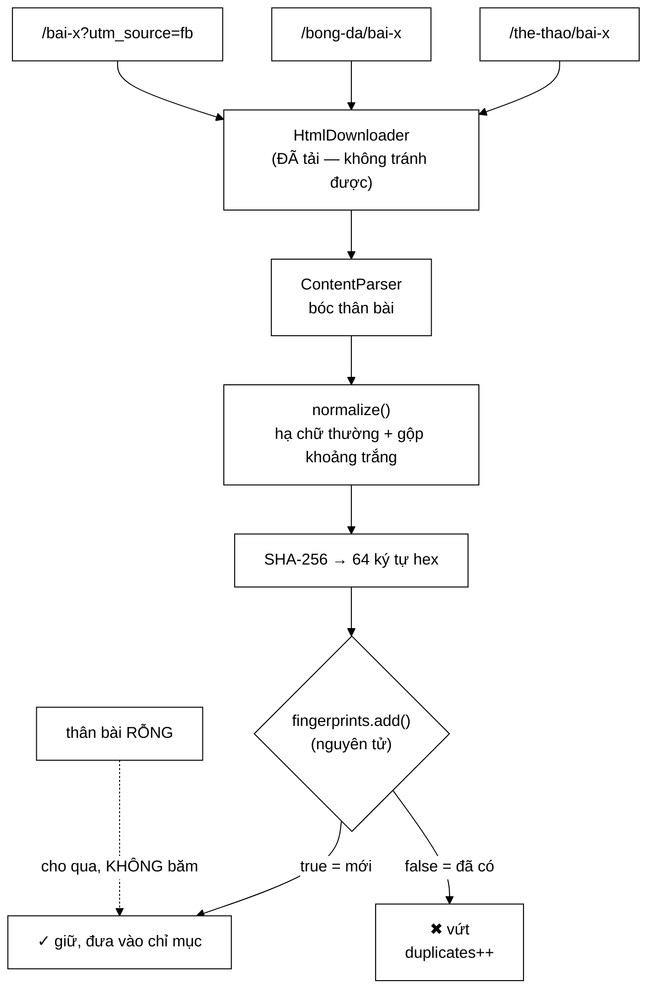

# ContentSeenFilter — khối trước đây hoàn toàn không có trong hệ thống

**File nguồn:** `search-engine/src/main/java/com/vnsearch/crawler/ContentSeenFilter.java` (148 dòng)
**Gói:** `com.vnsearch.crawler` · **Loại:** `class`, trạng thái là một `Set` đồng thời
**Vị trí trong sơ đồ:** khối **"Content Seen?"**, chạy **sau** khi tải và bóc văn bản
**Đọc kèm:** [`UrlSeenFilter.md`](./UrlSeenFilter.md) · [`UrlCanonicalizer.md`](./UrlCanonicalizer.md) · [`ContentParser.md`](./ContentParser.md)

---

## 📌 Hiểu trong 30 giây

[`UrlSeenFilter`](./UrlSeenFilter.md) bảo đảm mỗi **URL** chỉ tải một lần.
[`UrlCanonicalizer`](./UrlCanonicalizer.md) gom các biến thể của cùng một URL.
Nhưng cả hai đều bất lực trước tình huống này:

> **Hai URL thực sự khác nhau, trả về cùng một nội dung.**

Lớp này băm phần văn bản thân bài bằng SHA-256 và so vân tay. Javadoc dòng
12–13 nói thẳng: đây là khối *"trước đây **hoàn toàn không có** trong hệ thống"*
— tức là một lỗ hổng được phát hiện và bịt lại, không phải một tính năng có sẵn
từ đầu.



```
   VÌ SAO CHỐNG TRÙNG THEO URL LÀ CHƯA ĐỦ

   Ba nguồn trùng lặp phổ biến trên báo điện tử Việt Nam:

   ① Cùng một bài nằm ở HAI chuyên mục
        /the-thao/doi-tuyen-thang-2-0
        /bong-da/doi-tuyen-thang-2-0        ← URL khác, nội dung y hệt

   ② Bản in / bản AMP
        /bai-x            và    /amp/bai-x

   ③ Tham số theo dõi khác nhau
        /bai-x?utm_source=facebook
        /bai-x?utm_source=zalo
        ↑ UrlCanonicalizer CỐ Ý không đụng query string
          (đó là phép chuẩn hoá KHÔNG AN TOÀN — xem UrlCanonicalizer.md mục 2.4)
          → nên chính lớp này phải dọn phần đó
```

---

## 1. Hậu quả nếu không có lớp này

Javadoc dòng 28–30 liệt kê ba mức thiệt hại, và mức thứ ba là mức ít người nghĩ
tới nhất:

```
   ① BĂNG THÔNG          tải cùng một bài nhiều lần
                          → khó chịu, nhưng chịu được

   ② CHỈ MỤC + KẾT QUẢ    các bản sao cùng vào chỉ mục
                          → người dùng thấy 3 dòng GIỐNG HỆT trong một trang kết quả
                          → chất lượng cảm nhận giảm thấy rõ

   ③ PAGERANK BỊ NHIỄU    ← ĐÂY mới là thiệt hại tinh vi nhất
                          một bài được đếm như NHIỀU trang độc lập
```

Cơ chế của ③ đáng được vẽ ra, vì nó là lỗi lan toả:

```
   Bài "Đội tuyển thắng 2-0" nằm ở 3 URL.
   50 trang khác trỏ tới nó, chia đều cho ba URL:

   ── KHÔNG khử trùng ──────────────────────────────────────────────
   /the-thao/bai-x   ← 17 liên kết vào  → PageRank thấp
   /bong-da/bai-x    ← 17 liên kết vào  → PageRank thấp
   /amp/bai-x        ← 16 liên kết vào  → PageRank thấp
        → uy tín bị CHIA BA
        → một bài quan trọng bị xếp hạng như ba bài tầm thường
        → và nó chiếm BA dòng trong kết quả tìm kiếm

   ── CÓ khử trùng ─────────────────────────────────────────────────
   /the-thao/bai-x   ← 50 liên kết vào  → PageRank cao, đúng thực tế
```

Đây là ví dụ điển hình của một lỗi ở tầng crawl **lan sang tầng xếp hạng**: nó
không gây exception, không hiện trong log, chỉ làm kết quả tìm kiếm tệ đi một
cách không giải thích được.

---

## 2. Bốn quyết định thiết kế

### 2.1 Lưu **vân tay**, không lưu nội dung

```
   Lưu nội dung:      độ dài trang × số trang
                      31.030 trang × ~8 KB văn bản ≈ 248 MB
                      + so sánh là O(độ dài) mỗi cặp

   Lưu vân tay:       64 ký tự hex × số trang
                      31.030 × 64 ký tự ≈ 2 MB (kèm chi phí String ≈ 5 MB)
                      + so sánh là O(1) qua bảng băm
                      ────────────────────────────────────────
                      nhỏ hơn ~50 LẦN, và KHÔNG PHỤ THUỘC trang dài bao nhiêu
```

Câu cuối là điểm mấu chốt: một bài 50 KB và một bài 2 KB đều tốn đúng 64 ký tự.
Chi phí bộ nhớ chỉ phụ thuộc **số trang**, không phụ thuộc kích thước corpus.

### 2.2 Chuẩn hoá **trước** khi băm — dòng 114–117

```java
private static String normalize(String text) {
    return text.toLowerCase(Locale.ROOT).replaceAll("\\s+", " ").trim();
}
```

Không có bước này thì phép so trở nên **vô dụng**:

```
   Cùng một bài, hai lần render HTML khác nhau:

   Bản A:  "Đội tuyển Việt Nam thắng 2-0 trong trận đấu tối qua."
   Bản B:  "Đội tuyển   Việt Nam thắng 2-0\ntrong trận đấu tối qua."
                       ↑ 3 dấu cách        ↑ xuống dòng

   Không chuẩn hoá → SHA-256 khác nhau HOÀN TOÀN
        (băm mật mã: đổi một bit → đổi ~50% bit đầu ra)
        → hai vân tay không liên quan gì nhau → không phát hiện được trùng

   Có chuẩn hoá → cả hai thành
        "đội tuyển việt nam thắng 2-0 trong trận đấu tối qua."
        → cùng một vân tay ✓
```

Đây chính là ví dụ trong `main()` ở dòng 138–139 — demo được chọn để minh hoạ
đúng điểm này.

`Locale.ROOT` lại xuất hiện, cùng lý do như ở
[`UrlCanonicalizer`](./UrlCanonicalizer.md): kết quả băm không được phụ thuộc
locale của máy chạy. Nếu không, cùng một corpus băm trên hai máy khác locale sẽ
cho hai tập vân tay khác nhau — và tính năng tiếp tục phiên crawl sẽ hỏng theo
cách không ai đoán được.

### 2.3 Phát hiện trùng **chính xác**, không phải gần đúng — dòng 41–47

Đây là phần Javadoc thẳng thắn nhất, vì nó **tự nêu giới hạn của chính mình**:

| | Trùng chính xác (đang dùng) | Trùng gần đúng (SimHash/MinHash) |
|---|---|---|
| Bắt được | Bản sao **y hệt** sau chuẩn hoá | Bản sao khác vài phần trăm |
| Bỏ sót | Bài chỉ khác "cập nhật lúc 14:05" | Ít hơn nhiều |
| **Vứt nhầm** | **Không bao giờ** | **Có thể** — hai bài khác nhau bị coi là trùng |
| Độ phức tạp cài đặt | 20 dòng | Shingle + LSH + ngưỡng, hàng trăm dòng |
| Tra cứu | $O(1)$ bảng băm | $O(1)$ nhưng cần cấu trúc LSH |

Lập luận chọn phương án đơn giản (dòng 45–47):

> Phép chính xác **không bao giờ vứt nhầm** một trang thật sự khác nội dung —
> sai lầm đắt hơn nhiều so với việc bỏ sót một bản trùng.

Lại là nguyên tắc **hai loại sai không cân xứng**, xuất hiện xuyên suốt dự án:

```
   Bỏ sót một bản trùng  →  chỉ mục có thêm một bản sao.  Lãng phí.
   Vứt nhầm một bài thật →  bài đó KHÔNG BAO GIỜ tìm được. Vĩnh viễn.

   ⇒ Nghiêng về phía GIỮ LẠI.
```

Điểm yếu thực tế cần biết: một dòng "Cập nhật: 14:05" hay một banner quảng cáo
lọt vào phần thân là đủ để hai bản sao có vân tay khác nhau. Hiệu quả của lớp
này vì thế **phụ thuộc trực tiếp vào chất lượng của
[`ContentParser`](./ContentParser.md)** — bóc thân bài càng sạch, phát hiện
trùng càng tốt.

### 2.4 **Không** dùng Bloom Filter — khác hẳn `UrlSeenFilter`

Đây là quyết định đối lập trực tiếp với lớp anh em, và lý do rất rõ:

```
   UrlSeenFilter dùng Bloom Filter:
        false positive → báo "đã gặp" cho một URL chưa gặp
        → BỎ SÓT một trang.  Với hàng trăm nghìn URL, 1% là chấp nhận được.

   ContentSeenFilter dùng Set chính xác:
        nếu dùng Bloom Filter, false positive → báo "đã thấy nội dung này"
        → VỨT HẲN một trang CÓ NỘI DUNG RIÊNG khỏi corpus
        → và trang đó ĐÃ ĐƯỢC TẢI VỀ RỒI — vứt đi là phí hoàn toàn
```

Cộng thêm một lý lẽ về **quy mô** (dòng 52–54):

```
   Số URL đã gặp    ≈ 2.450.000   ← rất lớn → Bloom Filter tiết kiệm 210 lần
   Số trang đã tải  ≈    31.030   ← nhỏ hơn ~79 lần → Set chính xác chỉ tốn ~5 MB

   ⇒ Cùng một bài toán "đã thấy chưa", hai quy mô khác nhau,
     hai cấu trúc dữ liệu khác nhau. Cả hai đều đúng.
```

Đây là một trong những đoạn đáng nêu nhất khi bảo vệ đồ án: nó cho thấy việc
chọn cấu trúc dữ liệu được lập luận theo **quy mô và chi phí của sai lầm**, chứ
không phải "dùng Bloom Filter vì nó hay".

---

## 3. Hướng dẫn về code

### 3.1 `seenBefore` — test-and-set nguyên tử trong một dòng

```java
public boolean seenBefore(String bodyText) {
    if (bodyText == null || bodyText.isBlank()) {
        blankSkipped.incrementAndGet();
        return false;                                  // ① rỗng → CHO QUA
    }
    String fingerprint = fingerprint(bodyText);
    boolean isNew = fingerprints.add(fingerprint);     // ② NGUYÊN TỬ
    if (!isNew) duplicates.incrementAndGet();
    return !isNew;
}
```

**② `Set.add` của `ConcurrentHashMap.newKeySet()` là nguyên tử** và chỉ trả
`true` cho **đúng một** luồng:

```
   Hai worker cùng lúc tải xong hai bản sao của cùng một bài:

   Worker A: fingerprints.add("a3f9…")  → true   → giữ ✓
   Worker B: fingerprints.add("a3f9…")  → false  → vứt ✓

   Không cần synchronized. Không có khe hở check-then-act.
```

So sánh với [`UrlSeenFilter.markSeenIfNew`](./UrlSeenFilter.md) mục 2: ở đó
phải tự viết khối `synchronized` vì `BloomFilter` không thread-safe. Ở đây
`ConcurrentHashMap` đã cung cấp sẵn ngữ nghĩa cần thiết. **Cùng một yêu cầu
nguyên tử, hai cách đạt được — và cách nào rẻ hơn thì dùng cách đó.**

### 3.2 ① Thân bài rỗng được **cho qua** — dòng 78–81

Đây là chi tiết tinh tế nhất của lớp, và nếu làm sai thì hậu quả rất lớn:

```
   Thân bài rỗng KHÔNG có nghĩa "các trang này giống nhau".
   Nó có nghĩa "trích xuất THẤT BẠI" — thường vì trang dựng bằng JavaScript.

   ── Nếu coi rỗng là một nội dung bình thường ─────────────────────
   trang lỗi #1  → vân tay của chuỗi rỗng → mới → giữ
   trang lỗi #2  → CÙNG vân tay           → trùng → VỨT
   trang lỗi #3  → CÙNG vân tay           → trùng → VỨT
   …
   trang lỗi #500 → VỨT
        ⇒ 499 trang bị vứt IM LẶNG, gộp làm một "bản sao"
        ⇒ và chúng thật ra là 500 trang KHÁC NHAU, chỉ là chưa bóc được nội dung
        ⇒ số liệu duplicates tăng vọt → chẩn đoán sai hoàn toàn nguyên nhân

   ── Cách đang dùng ───────────────────────────────────────────────
   cho qua, đếm riêng vào blankSkipped
        ⇒ số liệu tách bạch: "trùng thật" và "không bóc được nội dung"
        ⇒ blankSkipped cao = tín hiệu cần xem lại ContentParser,
          không phải tín hiệu web có nhiều bản sao
```

Việc tách `blankSkipped` thành **một bộ đếm riêng** là điểm đáng khen: nó biến
một trường hợp biên thành một **chỉ số chẩn đoán**.

### 3.3 `fingerprint` — vì sao SHA-256 và vì sao ném khi thiếu

```java
} catch (NoSuchAlgorithmException e) {
    // SHA-256 là thuật toán bắt buộc mọi JVM phải có theo đặc tả Java.
    throw new IllegalStateException("JVM không hỗ trợ SHA-256", e);
}
```

Comment đúng: đặc tả Java bắt buộc mọi bản cài đặt hỗ trợ `MD5`, `SHA-1`,
`SHA-256`. Nhánh `catch` này **không bao giờ chạy** trên một JVM hợp lệ, nên
ném `IllegalStateException` là đúng — nó nói "môi trường hỏng", không phải "đầu
vào sai".

Vì sao SHA-256 chứ không phải một hàm băm nhanh hơn (`String.hashCode`, MurmurHash):

```
   String.hashCode()  → 32 bit
        Nghịch lý ngày sinh: với 31.030 trang, xác suất có ÍT NHẤT một cặp đụng độ
             ≈ 1 − exp(−n²/2m) với n = 31.030, m = 2^32
             ≈ 1 − exp(−0,112)  ≈  10,6%
        ⇒ cứ 10 phiên crawl thì có 1 phiên vứt nhầm một bài thật.

   SHA-256 → 256 bit
        xác suất đụng độ ở quy mô này  ≈ 10^-68
        ⇒ không bao giờ xảy ra.
```

Chi phí: SHA-256 trên một bài 8 KB tốn ~30 µs. So với ~200 ms để tải trang đó,
đây là **0,015%**. Không có lý do để đánh đổi độ an toàn lấy tốc độ ở đây.

Chuyển sang hex thủ công bằng `Character.forDigit` (dòng 102–107) thay vì
`String.format("%02x", b)` — nhanh hơn khoảng 10 lần vì không qua bộ máy định
dạng chuỗi. Chi tiết nhỏ nhưng đúng hướng cho một hàm chạy 31.030 lần.

### 3.4 `fingerprint` là `public static` — có chủ ý

Nó `public` để dùng được ở nơi khác mà không cần tạo thể hiện: ví dụ khi so hai
tài liệu trong công cụ chẩn đoán, hay khi kiểm tra một trang cụ thể có trùng với
trang trong corpus không. Hàm thuần, không trạng thái, an toàn đa luồng.

### 3.5 Cạm bẫy khi sửa lớp này

| Cạm bẫy | Hậu quả | Cách đúng |
|---|---|---|
| Coi thân bài rỗng là nội dung bình thường | Vứt im lặng hàng trăm trang lỗi trích xuất | Giữ nhánh `isBlank` → `return false` |
| Bỏ `normalize` trước khi băm | Phép so hoàn toàn vô dụng | Giữ nguyên |
| Đổi SHA-256 sang `hashCode()` | ~10% phiên crawl vứt nhầm một bài thật | Giữ SHA-256 |
| Bỏ `Locale.ROOT` | Vân tay phụ thuộc máy chạy | Luôn ghi rõ |
| Băm **cả HTML** thay vì thân bài | Mọi trang khác nhau (script, timestamp) → không bắt được gì | Băm văn bản đã bóc |
| Đổi sang Bloom Filter "cho nhẹ" | Vứt hẳn trang có nội dung riêng | Giữ `Set` chính xác |
| Tách `add` thành `contains` + `add` | Hai worker cùng giữ một bản sao | Giữ `add` nguyên tử |
| Xoá `blankSkipped` vì "không ai đọc" | Mất tín hiệu chẩn đoán `ContentParser` | Giữ |

### 3.6 `main()` — demo cho báo cáo

```powershell
cd search-engine
.\mvnw.cmd -q compile exec:java "-Dexec.mainClass=com.vnsearch.crawler.ContentSeenFilter"
```

Demo được thiết kế tốt: ba chuỗi, trong đó chuỗi thứ hai **chỉ khác khoảng
trắng** — minh hoạ đúng vai trò của `normalize` trong một màn hình.

---

## 4. Độ phức tạp & chi phí

Gọi $T$ = độ dài văn bản thân bài, $P$ = số trang đã xử lý.

| Thao tác | Thời gian | Ghi chú |
|---|---|---|
| `normalize` | $O(T)$ — ~15 µs cho 8 KB | `replaceAll` dùng regex, là phần đắt hơn cả băm |
| SHA-256 | $O(T)$ — ~30 µs cho 8 KB | |
| Chuyển hex | $O(1)$ — 32 byte cố định | |
| `fingerprints.add` | $O(1)$ | |
| **`seenBefore` toàn phần** | **$O(T)$ ≈ 45 µs** | |
| Bộ nhớ | $O(P)$ — 64 ký tự/trang | ~5 MB cho 31.030 trang |

Đặt vào bối cảnh:

```
   seenBefore     ~      45 µs
   Tải trang      ~ 200.000 µs      ← chậm hơn 4.400 LẦN
   Phân tích HTML ~   5.000 µs
   ⇒ chi phí khử trùng ≈ 0,02% thời gian xử lý một trang

   Lợi ích: mỗi bản trùng phát hiện được tiết kiệm
        ├─ một mục trong chỉ mục
        ├─ một dòng rác trong kết quả tìm kiếm
        └─ một nhiễu trong PageRank
```

Một nhận xét về hiệu năng: `replaceAll("\\s+", " ")` biên dịch lại biểu thức
chính quy **mỗi lần gọi**. Với 31.030 lần thì tổng chi phí biên dịch không đáng
kể so với tải mạng, nhưng đây là chỗ sửa được bằng một `static final Pattern` —
xem đề xuất 3.

Bộ nhớ tăng tuyến tính theo số trang và **không bao giờ được dọn** trong một
phiên. Ở quy mô hiện tại (5 MB) không thành vấn đề; ở 1 triệu trang thì là
~160 MB — vẫn chấp nhận được, nên đây **không** phải giới hạn cấp bách.

---

## 5. Kiểm thử liên quan

| Test | Bảo vệ điều gì |
|---|---|
| `test/java/com/vnsearch/crawler/ContentSeenFilterTest.java` | Bản sao khác khoảng trắng bị bắt; bài khác nhau được giữ; thân rỗng cho qua |
| `test/java/com/vnsearch/crawler/ContentParserTest.java` | Chất lượng đầu vào — quyết định hiệu quả của lớp này |

```powershell
cd search-engine
.\mvnw.cmd -q -Dtest='ContentSeenFilterTest' test
```

Bảng ca kiểm thử cốt lõi:

```
   ĐẦU VÀO                                             KẾT QUẢ
   ─────────────────────────────────────────────       ──────────────────
   "Đội tuyển thắng 2-0."           (lần 1)            false (mới)
   "Đội tuyển thắng 2-0."           (lần 2)            true  (trùng)
   "Đội   tuyển\nthắng 2-0."                           true  (trùng — khoảng trắng)
   "ĐỘI TUYỂN THẮNG 2-0."                              true  (trùng — hoa/thường)
   "Giá vàng tăng."                                    false (bài khác)
   ""                                                  false + blankSkipped++
   "   \n\t  "                                         false + blankSkipped++
   null                                                false + blankSkipped++
```

Hai kịch bản chưa có test tự động, và cả hai đều quan trọng:

```java
// 1. Đa luồng: N worker cùng nộp CÙNG một nội dung → đúng MỘT lần trả false
@Test
void haiWorkerCungNoiDungChiMotBanDiTiep() throws Exception {
    var loc = new ContentSeenFilter();
    var demGiuLai = new AtomicInteger();
    // 16 luồng cùng gọi seenBefore(cungMotBai)
    // assertEquals(1, demGiuLai.get());
    // assertEquals(15, loc.getDuplicateCount());
}

// 2. Bất biến bộ đếm: size() + duplicates == số lần gọi có nội dung
@Test
void tongBoDemKhopSoLanGoi() {
    // sau 8 ca ở bảng trên (5 ca có nội dung, 3 ca rỗng):
    // assertEquals(2, loc.size());               // 2 nội dung phân biệt
    // assertEquals(3, loc.getDuplicateCount());
    // assertEquals(3, loc.getBlankSkippedCount());
}
```

---

## 6. Liên kết

- Lớp anh em cho **URL** (và vì sao dùng cấu trúc khác): [`UrlSeenFilter.md`](./UrlSeenFilter.md)
- Vì sao query string không được chuẩn hoá, để lại việc cho lớp này: [`UrlCanonicalizer.md`](./UrlCanonicalizer.md) mục 2.4
- Nguồn đầu vào — chất lượng bóc thân bài quyết định hiệu quả: [`ContentParser.md`](./ContentParser.md)
- Tầng bị ảnh hưởng nếu không khử trùng: [`../ranking/PageRankService.md`](../ranking/PageRankService.md)
- Khuôn mẫu lưu bền cho đề xuất 1: [`UrlStorage.md`](./UrlStorage.md)
- Nơi lắp ráp: [`CrawlerService.md`](./CrawlerService.md)
- Tổng quan: `docs/ARCHITECTURE.md`, `docs/EVALUATION.md`
