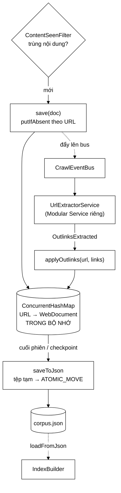

# ContentStorage — vân tay ở một nơi, nội dung ở nơi khác

**File nguồn:** `search-engine/src/main/java/com/vnsearch/crawler/ContentStorage.java` (138 dòng)
**Gói:** `com.vnsearch.crawler` · **Loại:** `class` giữ `ConcurrentHashMap` + hai hàm tĩnh ghi/đọc JSON
**Vị trí trong sơ đồ:** khối **"Content Storage"**, nối hai chiều với [`ContentSeenFilter`](./ContentSeenFilter.md)
**Đọc kèm:** [`ContentSeenFilter.md`](./ContentSeenFilter.md) · [`bus/OutlinksExtracted.md`](./bus/OutlinksExtracted.md) · [`CheckpointCrawlListener.md`](./CheckpointCrawlListener.md)

---

## 📌 Hiểu trong 30 giây

Giữ **nội dung thật** của những trang đã vượt qua khối `Content Seen?`. Trong sơ
đồ, hai khối này nối nhau bằng mũi tên hai chiều — nhưng trách nhiệm được tách
rạch ròi:

| | [`ContentSeenFilter`](./ContentSeenFilter.md) | `ContentStorage` (lớp này) |
|---|---|---|
| Giữ gì | **Vân tay** SHA-256, 64 ký tự | **Nội dung thật**, `WebDocument` đầy đủ |
| Trả lời | "Đã thấy nội dung này chưa?" | "Cho tôi tài liệu của URL này" |
| Khoá | Vân tay | **URL đã chuẩn hoá** |
| Kích thước | ~5 MB cho 31.030 trang | **hàng trăm MB** |

Javadoc dòng 24–25 nêu lý do tách: *"Gộp làm một sẽ khiến mỗi lần kiểm tra trùng
phải **quét cả kho nội dung**."* — tức $O(N)$ thay vì $O(1)$, cho một thao tác
chạy ở mỗi trang.



```
   VÌ SAO OUTLINKS TỚI SAU NỘI DUNG

   Từ khi khối "URL Extractor" tách thành một Modular Service riêng:

        crawler  ──lưu trang──→ ContentStorage
             │
             └──đẩy sự kiện──→ bus ──→ UrlExtractorService
                                            │ bóc liên kết
                        applyOutlinks ←─────┘ OutlinksExtracted

   In-process : gửi ngược ĐỒNG BỘ, ngay trong cùng lời gọi
   Kafka      : tới sau VÀI CHỤC MILI GIÂY

   ⇒ Tách được làm hai bước vì outlinks KHÔNG cần có lúc lưu —
     chỉ cần có TRƯỚC KHI lập chỉ mục (PageRank chạy trên đồ thị liên kết).
```

---

## 1. Bản đồ lớp

```
ContentStorage
├── byUrl : ConcurrentHashMap<String url, WebDocument>   ── TRONG BỘ NHỚ
│
├── save(WebDocument)              → boolean   putIfAbsent
├── applyOutlinks(url, List)       → boolean   gắn liên kết TỚI SAU
├── size()                         → int
├── all()                          → List<WebDocument>   bản sao
├── saveToJson(List, path)  static → tệp tạm + ATOMIC_MOVE
└── loadFromJson(path)      static → List<WebDocument>
```

### 1.1 Lưu trong bộ nhớ, ghi ra đĩa **một lần ở cuối** — Javadoc dòng 27–31

```
   Một phiên crawl 5.000 trang chiếm khoảng vài trăm MB
        → vừa đủ cho bộ nhớ
        → tránh chi phí ghi đĩa trên ĐƯỜNG ĐI NÓNG của crawler

   Với quy mô lớn hơn nhiều: phải đổi sang ghi thẳng xuống cơ sở dữ liệu
        → khi đó CHỈ CẦN THAY LỚP NÀY, phần còn lại của crawler không đổi
```

Câu cuối là điểm đáng chú ý: lớp này là **ranh giới thay thế được**. Nó không
được khai báo qua interface (khác [`UrlStorage`](./UrlStorage.md) hay
`DocumentStore`), nhưng bề mặt API đủ hẹp — bốn hàm — để việc thay thế là khả
thi. Xem đề xuất 1.

Ước lượng bộ nhớ thực tế:

```
   Một WebDocument điển hình:
        url          ~   80 byte
        title        ~  120 byte
        metaDesc     ~  300 byte
        bodyText     ~ 8.000 byte     ← chi phối
        outlinks     ~ 79 × 80 = 6.320 byte
        ─────────────────────────────
        ≈ 15 KB / trang (kể cả chi phí đối tượng)

   5.000 trang   →  ~75 MB
   31.030 trang  →  ~465 MB      ← quy mô thật của dự án
   100.000 trang →  ~1,5 GB      ← vượt heap mặc định
```

Con số 465 MB cho quy mô thật là **sát trần**: heap mặc định của JVM thường là
1/4 RAM vật lý. Đây là giới hạn cứng đầu tiên của lớp — và
[`CheckpointCrawlListener`](./CheckpointCrawlListener.md) chỉ *ghi* định kỳ chứ
không *giải phóng* bộ nhớ.

### 1.2 Khoá là URL đã chuẩn hoá — Javadoc dòng 33–34

> Một URL chỉ có một bản ghi **kể cả khi [`UrlSeenFilter`](./UrlSeenFilter.md)
> có sai sót.**

```java
public boolean save(WebDocument doc) {
    return byUrl.putIfAbsent(doc.getUrl(), doc) == null;
}
```

`putIfAbsent` là **lớp phòng thủ cuối cùng** cho trùng lặp:

```
   Ba lớp chống trùng URL, xếp chồng nhau:
        ① UrlCanonicalizer  — gom các biến thể của cùng một URL
        ② UrlSeenFilter     — Bloom Filter, có 1% FALSE POSITIVE
                              và có thể có false negative nếu khoá bị phá
        ③ ContentStorage    — putIfAbsent, CHÍNH XÁC tuyệt đối  ← lớp này

   Lớp ③ vừa nguyên tử vừa chính xác, nên dù ② sai sót thì kho nội dung
   vẫn không bao giờ có hai bản ghi cho cùng một URL.
```

Giá trị trả về `boolean` cho phép người gọi đếm số lần trùng lọt tới đây — một
chỉ số gián tiếp cho sức khoẻ của bộ lọc Bloom.

**Bản cũ được giữ nguyên** (không ghi đè). Đúng: bản đầu tiên là bản đã qua
[`ContentSeenFilter`](./ContentSeenFilter.md) và đã được đẩy lên bus để bóc liên
kết. Ghi đè nó sẽ làm mất `outlinks` vừa gắn vào.

---

## 2. `applyOutlinks` — điểm nối với kiến trúc sự kiện

```java
public boolean applyOutlinks(String url, List<String> outlinks) {
    if (url == null || outlinks == null) return false;
    WebDocument doc = byUrl.get(url);
    if (doc == null) return false;                        // ① sự kiện tới muộn
    doc.setOutlinks(new ArrayList<>(outlinks));           // ② SAO CHÉP
    return true;
}
```

### 2.1 ① Trả `false` khi không tìm thấy — và vì sao phải **đếm**

Javadoc dòng 66–69 rất cẩn thận:

> `false` nghĩa là một sự kiện tới muộn cho một trang không được lưu (trùng nội
> dung, hoặc thuộc phiên crawl trước). **Bỏ qua là đúng, nhưng người gọi nên đếm
> để con số đó không âm thầm lớn lên.**

```
   Ba nguyên nhân hợp lệ khiến doc == null:
        ├─ trang bị ContentSeenFilter loại sau khi đã đẩy sự kiện
        ├─ sự kiện Kafka thuộc phiên crawl TRƯỚC (bus còn tồn đọng)
        └─ trang bị LanguageFilter loại

   Một nguyên nhân KHÔNG hợp lệ:
        └─ URL trong sự kiện KHÔNG khớp URL đã lưu
             ví dụ: một bên chuẩn hoá, một bên không
             → MỌI sự kiện đều trả false
             → toàn bộ corpus KHÔNG CÓ outlinks
             → PageRank chạy trên đồ thị RỖNG, mọi trang điểm bằng nhau
             → và KHÔNG CÓ EXCEPTION NÀO
```

Kịch bản cuối là lý do vì sao Javadoc nhấn mạnh việc đếm: đây là một lỗi **hoàn
toàn câm**, chỉ lộ ra qua chất lượng xếp hạng kém đi mà không ai giải thích được.

### 2.2 ② Sao chép danh sách — hai lý do

```java
// Sao chép: danh sách gốc thuộc về một thông điệp bất biến, và
// WebDocument.setOutlinks giữ nguyên tham chiếu được truyền vào.
doc.setOutlinks(new ArrayList<>(outlinks));
```

```
   Lý do 1: thông điệp OutlinksExtracted là BẤT BIẾN
        nếu WebDocument giữ thẳng tham chiếu tới danh sách của nó,
        và ai đó về sau gọi doc.getOutlinks().add(...)
        → sửa vào một đối tượng lẽ ra bất biến
        → ở chế độ Kafka, thông điệp đó có thể đang được xử lý ở nơi khác

   Lý do 2: setOutlinks KHÔNG tự sao chép
        → nếu không sao ở đây thì không ai sao cả
```

Đây là ví dụ tốt của việc **biết rõ hợp đồng của lớp mình gọi**: comment nói
thẳng `setOutlinks` giữ nguyên tham chiếu, nên trách nhiệm sao chép thuộc về nơi
gọi.

### 2.3 Vì sao tách được làm hai bước mà không hỏng gì

Javadoc dòng 62–64:

> Dữ liệu này **bắt buộc phải có trước khi lập chỉ mục** vì PageRank chạy trên
> đồ thị liên kết. Nó *không* cần có trước lúc lưu — đó là lý do tách được làm
> hai bước.

```
   Thứ tự BẮT BUỘC:            crawl → lưu → (bóc liên kết) → LẬP CHỈ MỤC
                                                    ↑
                                        chỉ cần xong TRƯỚC bước này

   Ở chế độ in-process: gửi ngược đồng bộ  → luôn kịp
   Ở chế độ Kafka     : tới sau vài chục ms → vẫn kịp, vì lập chỉ mục
                                               chạy sau khi crawl KẾT THÚC
```

Nhưng đây cũng là một **giả định chưa được kiểm chứng bằng mã**: không có gì
trong hệ thống bảo đảm mọi `OutlinksExtracted` đã tới trước khi
[`IndexBuilder`](../service/IndexBuilder.md) chạy. Ở chế độ Kafka với bus tắc
nghẽn, một phần corpus có thể vào chỉ mục mà thiếu liên kết. Xem đề xuất 3.

---

## 3. `saveToJson` — ghi nguyên tử, và vì sao nó quan trọng hơn ta tưởng

```java
Path temp = filePath.resolveSibling(filePath.getFileName() + ".tmp");
mapper.writeValue(temp.toFile(), documents);
try {
    Files.move(temp, filePath, REPLACE_EXISTING, ATOMIC_MOVE);
} catch (AtomicMoveNotSupportedException e) {
    Files.move(temp, filePath, REPLACE_EXISTING);
}
```

Đây là **khuôn mẫu thứ hai** trong dự án dùng tệp tạm + đổi tên, sau
[`JsonUserStore`](../auth/JsonUserStore.md). Javadoc dòng 97–103 nêu rủi ro cụ
thể:

```
   Corpus thật nặng VÀI CHỤC MB → việc ghi kéo dài CẢ GIÂY

   ── Ghi đè trực tiếp ─────────────────────────────────────────────
   t0    mở corpus.json ở chế độ ghi  → tệp bị CẮT VỀ 0 BYTE
   t0…t1 ghi 40 MB (mất ~1 giây)
   t0,4  ✖ Ctrl+C  hoặc mất điện
         → corpus.json là JSON CỤT
         → MẤT LUÔN corpus CŨ vốn đang hoàn chỉnh
         → đổi lấy corpus mới cũng hỏng
         ⇒ MẤT CẢ HAI

   ── Tệp tạm + đổi tên (đang dùng) ────────────────────────────────
   t0…t1 ghi corpus.json.tmp   → corpus.json KHÔNG BỊ ĐỘNG TỚI
   t0,4  ✖ Ctrl+C
         → corpus.json vẫn là bản CŨ NGUYÊN VẸN
         ⇒ mất đúng phần mới, giữ được phần cũ
```

### 3.1 Vì sao chi tiết này quan trọng **hơn hẳn** khi có checkpoint

Javadoc dòng 105–107 nêu một hệ quả ít ai nghĩ tới:

```
   Không có checkpoint:  ghi 1 lần / phiên
        cửa sổ nguy hiểm: 1 giây trong 2 giờ  →  xác suất ~0,014%

   Có CheckpointCrawlListener: ghi HÀNG CHỤC lần / phiên
        cửa sổ nguy hiểm: 30 × 1 giây trong 2 giờ  →  ~0,42%
        → tăng 30 LẦN

   Và người dùng Ctrl+C thì KHÔNG bấm ngẫu nhiên — họ thường bấm khi
   thấy màn hình "đang ghi checkpoint", tức ĐÚNG lúc nguy hiểm nhất.
```

Vế cuối là quan sát sắc sảo: rủi ro thực tế cao hơn xác suất tính theo thời gian,
vì hành vi người dùng tương quan với thời điểm nguy hiểm.

### 3.2 Đường lui khi không nguyên tử được — comment dòng 126–128

```
   Vài hệ tệp (thường là ổ mạng) không hỗ trợ đổi tên nguyên tử.
   Đổi tên thường VẪN TỐT HƠN NHIỀU so với ghi đè trực tiếp:
        cửa sổ nguy hiểm rút từ CẢ GIÂY xuống còn MỘT THAO TÁC SIÊU DỮ LIỆU.
```

Lập luận này chính xác và đáng học: khi không đạt được bảo đảm lý tưởng, vẫn nên
lấy phần cải thiện lớn nhất có thể, thay vì từ bỏ. Cùng đường lui với
[`JsonUserStore`](../auth/JsonUserStore.md) mục 3.1.

### 3.3 Cấu hình `ObjectMapper`

```java
new ObjectMapper()
        .registerModule(new JavaTimeModule())              // ① Instant crawledAt
        .disable(SerializationFeature.WRITE_DATES_AS_TIMESTAMPS)  // ② ISO-8601
        .enable(SerializationFeature.INDENT_OUTPUT);       // ③ đọc được bằng mắt
```

Ba tuỳ chọn đầu giống hệt [`JsonUserStore`](../auth/JsonUserStore.md) mục 2.1 —
nhưng **thiếu tuỳ chọn thứ tư**:

```java
// JsonUserStore CÓ:
.disable(DeserializationFeature.FAIL_ON_UNKNOWN_PROPERTIES)
// ContentStorage KHÔNG có  ← và loadFromJson cũng không có
```

Hệ quả: nếu `WebDocument` được thêm trường ở phiên bản sau rồi hạ cấp phần mềm,
`loadFromJson` sẽ **ném** thay vì bỏ qua trường lạ — làm mất khả năng đọc lại
corpus cũ. Xem đề xuất 2.

`INDENT_OUTPUT` làm tệp phình khoảng 20–30% nhưng đổi lại `git diff` dùng được
và mở bằng trình soạn thảo đọc được. Với corpus vài chục MB, đó là đánh đổi hợp
lý cho một đồ án — nơi việc **kiểm chứng dữ liệu bằng mắt** có giá trị cao.

### 3.4 `saveToJson` là `static` — và hệ quả

```java
public static void saveToJson(List<WebDocument> documents, String path)
```

Nó **không** đọc `byUrl` mà nhận danh sách từ ngoài, nên người gọi phải viết:

```java
ContentStorage.saveToJson(storage.all(), "corpus.json");
```

Ưu điểm: ghi được bất kỳ danh sách nào (lọc, gộp từ nhiều nguồn). Nhược điểm:
`all()` tạo một `ArrayList` sao chép toàn bộ — với 31.030 tài liệu là ~250 KB
tham chiếu (không sao chép nội dung), chấp nhận được.

---

## 4. Hướng dẫn về code

### 4.1 `ConcurrentHashMap` — vì sao đủ, không cần khoá

```java
private final ConcurrentHashMap<String, WebDocument> byUrl = new ConcurrentHashMap<>();
```

| Thao tác | An toàn đa luồng? |
|---|---|
| `save` — `putIfAbsent` | ✓ Nguyên tử sẵn |
| `applyOutlinks` — `get` rồi `doc.setOutlinks` | ⚠ Xem bên dưới |
| `size` / `all` | ✓ |

`applyOutlinks` sửa **bên trong** một `WebDocument` — `ConcurrentHashMap` không
bảo vệ điều đó. Trong thực tế không có vấn đề vì:

- Mỗi URL chỉ nhận **một** sự kiện `OutlinksExtracted`.
- Không luồng nào đọc `outlinks` trong lúc crawl (chỉ đọc lúc lập chỉ mục, sau
  khi crawl kết thúc).

Nhưng đây là bất biến **không được mã bảo vệ**. Nếu một ngày có hai nguồn cùng
gọi `applyOutlinks`, hoặc có nơi đọc `outlinks` giữa phiên, sẽ cần đồng bộ.

### 4.2 `all()` trả bản sao

```java
public List<WebDocument> all() { return new ArrayList<>(byUrl.values()); }
```

Bản sao **nông**: danh sách mới, nhưng cùng các đối tượng `WebDocument`. Đủ cho
mục đích ở đây (tránh `ConcurrentModificationException` khi ghi JSON trong lúc
crawl vẫn chạy) nhưng không ngăn người gọi sửa nội dung tài liệu.

Với `saveToJson` thì đúng — Jackson chỉ đọc. Với người gọi khác thì đây là một
cửa mở.

### 4.3 Cạm bẫy khi sửa lớp này

| Cạm bẫy | Hậu quả | Cách đúng |
|---|---|---|
| Ghi thẳng đè lên `corpus.json` | Ctrl+C giữa chừng mất **cả** corpus cũ lẫn mới | Giữ tệp tạm + đổi tên |
| Đổi `putIfAbsent` thành `put` | Ghi đè bản đã có `outlinks` | Giữ |
| Bỏ `new ArrayList<>(outlinks)` | Sửa vào một thông điệp bất biến | Giữ sao chép |
| Bỏ qua giá trị trả về của `applyOutlinks` | Lỗi khớp URL trở nên hoàn toàn câm | Đếm ở nơi gọi |
| Gộp vào `ContentSeenFilter` | Mỗi lần kiểm tra trùng phải quét cả kho — $O(N)$ | Giữ tách |
| Lưu `WebDocument` chưa qua `LanguageFilter` | Corpus lẫn ngoại ngữ | Giữ thứ tự trong `CrawlerService` |
| Thêm `FAIL_ON_UNKNOWN_PROPERTIES` mặc định | Corpus cũ không đọc lại được sau khi thêm trường | Xem đề xuất 2 |

---

## 5. Độ phức tạp & chi phí

Gọi $N$ = số tài liệu, $S$ = tổng kích thước.

| Thao tác | Thời gian | Ghi chú |
|---|---|---|
| `save` | $O(1)$ | **Đường nóng**, một lần mỗi trang |
| `applyOutlinks` | $O(L)$, $L$ = số liên kết (~79) | Sao chép danh sách |
| `size` | $O(1)$ | |
| `all` | $O(N)$ | Sao chép tham chiếu |
| **`saveToJson`** | **$O(S)$ ≈ 1–3 giây cho 40 MB** | Một lần cuối phiên, hoặc mỗi checkpoint |
| `loadFromJson` | $O(S)$ + **$O(S)$ bộ nhớ** | Một lần lúc lập chỉ mục |
| Bộ nhớ | **$O(S)$ ≈ 465 MB cho 31.030 trang** | Giới hạn cứng đầu tiên |

```
   save              ~      1 µs
   Tải một trang     ~ 200.000 µs
   ⇒ lưu nội dung ≈ 0,0005% thời gian xử lý một trang — miễn phí

   saveToJson        ~ 1–3 GIÂY
   ⇒ đáng kể, nhưng chạy NGOÀI đường nóng (cuối phiên / checkpoint)
```

**Đỉnh bộ nhớ lúc ghi JSON** là điểm cần lưu ý:

```
   Lúc saveToJson chạy:
        byUrl              ~465 MB   (vẫn giữ nguyên)
      + all() ArrayList    ~250 KB   (chỉ tham chiếu)
      + đệm của Jackson    ~ vài MB
        ─────────────────────────────
        ≈ 470 MB, không nhân đôi — Jackson ghi theo luồng (streaming)

   Ngược lại, loadFromJson đọc CẢ MẢNG vào bộ nhớ:
        mapper.readValue(file, WebDocument[].class)
        → 465 MB tài liệu + mảng trung gian
        → đỉnh cao hơn saveToJson
```

---

## 6. Kiểm thử liên quan

| Test | Bảo vệ điều gì |
|---|---|
| `test/java/com/vnsearch/crawler/bus/CrawlEventTest.java` | Luồng sự kiện dẫn tới `applyOutlinks` |
| `test/java/com/vnsearch/crawler/modular/UrlExtractorServiceTest.java` | Nguồn của `OutlinksExtracted` |
| `test/java/com/vnsearch/crawler/CheckpointCrawlListenerTest.java` | Ghi JSON định kỳ |

Lớp này **không có test riêng**. Bốn kịch bản chạy nhanh, không cần mạng:

```java
// 1. save hai lần cùng URL → lần hai trả false, bản CŨ được giữ
@Test void luuTrungUrlThiGiuBanCu() { ... }

// 2. applyOutlinks cho URL chưa lưu → false, KHÔNG ném
@Test void outlinksToiMuonThiTraFalse() {
    assertFalse(new ContentStorage().applyOutlinks("https://a.vn/x", List.of("https://a.vn/y")));
}

// 3. Sửa danh sách gốc sau applyOutlinks → tài liệu KHÔNG đổi
@Test void applyOutlinksSaoChepDanhSach() {
    var links = new ArrayList<>(List.of("https://a.vn/y"));
    storage.save(doc); storage.applyOutlinks(doc.getUrl(), links);
    links.add("https://a.vn/z");
    assertEquals(1, doc.getOutlinks().size());     // ← bảo vệ dòng 81
}

// 4. Ghi rồi đọc lại → dữ liệu khớp, kể cả Instant crawledAt
@Test void ghiRoiDocLaiGiuNguyenDuLieu() { ... }
```

Kịch bản 3 quan trọng nhất — nó bảo vệ `new ArrayList<>(outlinks)` khỏi bị "tối
ưu" thành gán thẳng.

Và ca kiểm tra tính nguyên tử của `saveToJson`, làm được bằng cách ghi đè lên
một tệp đã có rồi kiểm tra tệp `.tmp` không còn sót:

```java
@Test void ghiJsonKhongDeLaiTepTam() throws Exception {
    ContentStorage.saveToJson(List.of(doc), duongDan);
    assertFalse(Files.exists(Path.of(duongDan + ".tmp")));
}
```

---

## 7. Chấm theo chuẩn doanh nghiệp

| Tiêu chí | Điểm | Nhận xét |
|---|---|---|
| Tách trách nhiệm | 10/10 | Vân tay và nội dung tách rõ, kèm lý do về độ phức tạp ($O(1)$ vs $O(N)$) |
| Ghi bền an toàn | 10/10 | Tệp tạm + `ATOMIC_MOVE`; phân tích đúng vì sao checkpoint làm rủi ro tăng 30 lần |
| Xử lý bất đồng bộ | 9/10 | `applyOutlinks` trả `boolean`, Javadoc yêu cầu nơi gọi đếm |
| Sao chép phòng thủ | 9/10 | Sao chép `outlinks`, có comment nêu rõ hai lý do |
| Chống trùng | 10/10 | `putIfAbsent` là lớp phòng thủ chính xác sau Bloom Filter |
| **Khả năng mở rộng** | **5/10** | **Toàn bộ corpus trong RAM** — ~465 MB ở quy mô hiện tại, sát trần |
| Tương thích dữ liệu cũ | 6/10 | `loadFromJson` thiếu `FAIL_ON_UNKNOWN_PROPERTIES = false` |
| Khả năng kiểm thử | 4/10 | Không có test riêng, dù có bốn kịch bản dễ viết |

**Ba đề xuất nâng lên mức sản phẩm:**

1. **Tách interface `ContentSink`.** Javadoc đã nói *"chỉ cần thay lớp này"*
   nhưng chưa có interface để thay. Bốn hàm (`save`, `applyOutlinks`, `size`,
   `all`) là bề mặt vừa đủ hẹp. Có nó thì bản ghi thẳng xuống PostgreSQL vào
   được mà không đụng [`CrawlerService`](./CrawlerService.md) — và quan trọng
   hơn, gỡ được **giới hạn cứng 465 MB RAM** đang là trần thật của quy mô crawl.
   Khuôn mẫu đã có sẵn: [`UrlStorage`](./UrlStorage.md) và `DocumentStore`.

2. **Thêm `FAIL_ON_UNKNOWN_PROPERTIES = false` vào `loadFromJson`.** Một dòng.
   Hiện nếu `WebDocument` thêm trường ở phiên bản sau rồi ai đó đọc lại corpus
   bằng bản cũ, Jackson sẽ ném và corpus coi như mất. `JsonUserStore` đã có
   phòng thủ này; ở đây thì chưa — một sự không nhất quán giữa hai lớp cùng dùng
   Jackson trong cùng dự án.

3. **Đếm và cảnh báo số `applyOutlinks` trả `false`.** Javadoc yêu cầu nơi gọi
   đếm, nhưng không có gì bắt buộc. Nếu tỷ lệ vượt một ngưỡng (ví dụ 5%), ghi
   `log.warn` — nó sẽ biến kịch bản câm nguy hiểm nhất ở mục 2.1 (URL không khớp
   ⇒ PageRank chạy trên đồ thị rỗng) thành một cảnh báo nhìn thấy được. Cùng
   với đó: một phép kiểm tra trước khi lập chỉ mục rằng tỷ lệ tài liệu có
   `outlinks` đạt mức hợp lý.

---

## 8. Liên kết

- Lớp anh em giữ vân tay: [`ContentSeenFilter.md`](./ContentSeenFilter.md)
- Nguồn sự kiện `applyOutlinks`: [`bus/OutlinksExtracted.md`](./bus/OutlinksExtracted.md) · [`modular/UrlExtractorService.md`](./modular/UrlExtractorService.md)
- Nơi gọi `saveToJson` định kỳ: [`CheckpointCrawlListener.md`](./CheckpointCrawlListener.md)
- Kiểu dữ liệu được lưu: [`../model/WebDocument.md`](../model/WebDocument.md)
- Khuôn mẫu ghi nguyên tử tương tự: [`../auth/JsonUserStore.md`](../auth/JsonUserStore.md) mục 3.1
- Phía **đọc** corpus về sau: [`../storage/DocumentStore.md`](../storage/DocumentStore.md)
- Nơi `outlinks` được dùng: [`../ranking/PageRankService.md`](../ranking/PageRankService.md)
- Nơi lắp ráp: [`CrawlerService.md`](./CrawlerService.md)
- Tổng quan: `docs/ARCHITECTURE.md`
