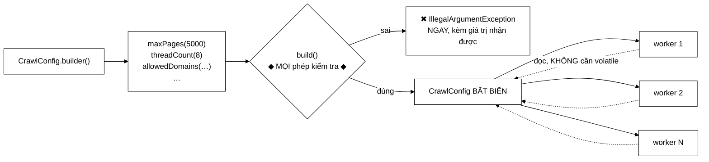

# CrawlConfig — cấu hình sai bị bắt ngay, thay vì sau 30 phút

**File nguồn:** `search-engine/src/main/java/com/vnsearch/crawler/CrawlConfig.java` (179 dòng)
**Gói:** `com.vnsearch.crawler` · **Loại:** `final class` bất biến + `Builder` lồng bên trong
**Người dùng:** [`CrawlerService`](./CrawlerService.md), [`MultiDomainCrawlRunner`](./MultiDomainCrawlRunner.md), `AdminController`
**Đọc kèm:** [`UrlFilter.md`](./UrlFilter.md) · [`UrlStorage.md`](./UrlStorage.md) · [`CrawlerService.md`](./CrawlerService.md)

---

## 📌 Hiểu trong 30 giây

Bảy tham số điều khiển một phiên crawl. Bản cũ có trường `public` và setter trả
`this` — nghe tiện, nhưng nó cho phép **sửa cấu hình giữa phiên crawl** và
**không kiểm tra tính hợp lệ ở đâu cả**.

Bản này là đối tượng **bất biến**, dựng qua `Builder`, và **mọi** phép kiểm tra
nằm trong `build()` — một chỗ duy nhất.



```
   BẢN CŨ — HAI VẤN ĐỀ

   ① SỬA ĐƯỢC GIỮA PHIÊN CRAWL
      CrawlConfig cfg = new CrawlConfig().maxPages(5000);
      crawler.crawl(seeds, cfg);
      cfg.maxPages = -1;        ← sửa GIỮA phiên, không ai chặn
                                  12 worker đang đọc trường này

   ② KHÔNG KIỂM TRA TÍNH HỢP LỆ
      maxPages = -1  ·  threadCount = 0  ·  maxDepth = -5   đều được chấp nhận
           │
           └─ rồi hỏng ở MỘT CHỖ KHÁC HOÀN TOÀN:
              newFixedThreadPool(0) ném ngoại lệ khó hiểu
              ở giữa phiên crawl, CÁCH XA chỗ đặt sai cấu hình
```

---

## 1. Vấn đề: khoảng cách giữa **nơi sai** và **nơi hỏng**

Đây là điểm mạnh nhất của bản mới, và nó là một nguyên tắc chung của thiết kế
phần mềm:

```
   ── Bản cũ ───────────────────────────────────────────────────────
   t=0      threadCount = 0 được đặt trong AdminController
   t=0      crawl() bắt đầu, đọc cấu hình, khởi tạo…
   t=0,3s   newFixedThreadPool(0)
                → IllegalArgumentException
                → stack trace trỏ vào Executors.java
                → người đọc log thấy: "lỗi trong thư viện chuẩn Java?"
                → phải lần ngược qua 4 lớp mới tới nguyên nhân

   ── Bản mới ──────────────────────────────────────────────────────
   t=0      build()
                → IllegalArgumentException: "threadCount phai > 0, nhan duoc: 0"
                → stack trace trỏ thẳng vào dòng gọi threadCount(0)
                → thông điệp NÓI RÕ giá trị sai là bao nhiêu
```

Nguyên tắc: **phát hiện lỗi càng gần nơi gây ra càng tốt.** Ở đây "gần" nghĩa là
gần cả về *thời gian* (trước khi crawl bắt đầu, không phải sau 30 phút) lẫn về
*vị trí trong mã* (dòng đặt sai, không phải dòng dùng).

---

## 2. Bản đồ lớp

```
CrawlConfig (final, bất biến)
├── maxDepth              : int          mặc định 3
├── maxPages              : int          mặc định 100
├── threadCount           : int          mặc định 4
├── allowedDomains        : Set<String>  mặc định rỗng = KHÔNG giới hạn
├── excludedHostPrefixes  : Set<String>  mặc định rỗng
├── maxDurationMinutes    : int          mặc định 60
├── urlStoragePath        : String       mặc định null = KHÔNG lưu bền
│
├── builder()   static → Builder
├── 7 hàm đọc (không có setter)
├── toString()  ── rút gọn, dùng cho log
│
└── Builder (static, final, hàm dựng private)
    ├── 7 hàm đặt trả về this
    └── build()  ── MỌI phép kiểm tra + tạo đối tượng
```

### 2.1 Bảy tham số và ý nghĩa

| Tham số | Mặc định | Ảnh hưởng tới đâu |
|---|---|---|
| `maxDepth` | 3 | [`UrlFilter.accept`](./UrlFilter.md) — phép lọc **rẻ nhất**, đứng đầu chuỗi |
| `maxPages` | 100 | Điều kiện dừng; **và** kích thước [`UrlSeenFilter`](./UrlSeenFilter.md) (× 200) |
| `threadCount` | 4 | Số worker trong [`CrawlerService`](./CrawlerService.md) |
| `allowedDomains` | rỗng | [`UrlFilter.isAllowedDomain`](./UrlFilter.md) — **rỗng = không giới hạn** |
| `excludedHostPrefixes` | rỗng | Chặn bản ngoại ngữ trên subdomain — xem [`UrlFilter`](./UrlFilter.md) mục 4 |
| `maxDurationMinutes` | 60 | Điều kiện dừng theo thời gian |
| `urlStoragePath` | `null` | Bật/tắt [`UrlStorage`](./UrlStorage.md) |

**`maxPages` có tác dụng phụ ít ai ngờ:** nó không chỉ là điều kiện dừng mà còn
quyết định kích thước bộ lọc Bloom qua `UrlSeenFilter.forMaxPages(maxPages)`.
Đặt `maxPages` quá nhỏ so với thực tế crawl sẽ làm bộ lọc bão hoà — chi tiết ở
[`UrlSeenFilter.md`](./UrlSeenFilter.md) mục 3.1.

### 2.2 Bốn phép kiểm tra trong `build()`

```java
if (maxPages <= 0)           throw new IllegalArgumentException("maxPages phai > 0, nhan duoc: " + maxPages);
if (maxDepth < 0)            throw new IllegalArgumentException("maxDepth phai >= 0, nhan duoc: " + maxDepth);
if (threadCount <= 0)        throw new IllegalArgumentException("threadCount phai > 0, nhan duoc: " + threadCount);
if (maxDurationMinutes <= 0) throw new IllegalArgumentException("maxDurationMinutes phai > 0, nhan duoc: " + maxDurationMinutes);
```

Chú ý sự khác biệt giữa `<= 0` và `< 0` — nó không tuỳ tiện:

```
   maxDepth = 0   HỢP LỆ  → chỉ crawl đúng các trang hạt giống, không đi tiếp
                             (dùng để kiểm tra nhanh một danh sách URL)
   maxPages = 0   VÔ NGHĨA → không crawl trang nào; nếu muốn vậy thì đừng gọi crawl
   threadCount=0  VÔ NGHĨA → không có worker nào chạy, treo vĩnh viễn
```

Mỗi thông điệp **kèm giá trị nhận được** — cùng phong cách với
[`UrlFilter`](./UrlFilter.md) và [`HtmlDownloader`](./HtmlDownloader.md). Chi
tiết nhỏ nhưng tiết kiệm rất nhiều thời gian: người đọc log không phải đoán giá
trị nào đã gây lỗi.

> ⚠️ **Không** kiểm tra `allowedDomains` rỗng — vì rỗng có nghĩa hợp lệ ("không
> giới hạn"). Nhưng đó cũng là cấu hình nguy hiểm nhất: crawler sẽ đi ra toàn bộ
> Internet. Xem đề xuất 2.

---

## 3. Ba lợi ích của bất biến

### 3.1 Không sửa được giữa phiên crawl

```java
public final class CrawlConfig {
    private final int maxDepth;      // ← private + final
    // KHÔNG có setter
    private CrawlConfig(Builder builder) { ... }   // ← hàm dựng private
```

Không có đường nào để thay đổi một `CrawlConfig` sau khi nó ra đời. Cấu hình mà
worker đọc ở phút thứ 30 **chắc chắn** giống cấu hình lúc bắt đầu.

### 3.2 An toàn đa luồng **miễn phí** — Javadoc dòng 24–25

> 12 worker thread cùng đọc cấu hình này mà **không cần `volatile` hay đồng bộ
> gì**.

Đây là bảo đảm của **Java Memory Model**, không phải may mắn:

```
   JMM: trường `final` được đặt trong hàm dựng có bảo đảm "an toàn khi công bố"
        (safe publication) — mọi luồng thấy đối tượng đều thấy giá trị đã đầy đủ,
        KỂ CẢ khi tham chiếu được truyền đi qua một trường không đồng bộ.

   Nếu trường KHÔNG final:
        luồng B có thể thấy tham chiếu đã gán nhưng trường vẫn là 0
        → threadCount = 0 giữa phiên → hành vi không đoán được
        → và lỗi này CỰC hiếm, chỉ xuất hiện trên máy nhiều nhân
```

Bất biến không chỉ "sạch hơn về phong cách" — nó loại bỏ hẳn một lớp lỗi tương
tranh mà không tốn một dòng đồng bộ nào.

### 3.3 `Set.copyOf` — sao chép phòng thủ

```java
this.allowedDomains = Set.copyOf(builder.allowedDomains);   // bản sao BẤT BIẾN
this.excludedHostPrefixes = Set.copyOf(builder.excludedHostPrefixes);
```

Không có dòng này thì tính bất biến chỉ là bề ngoài:

```java
Set<String> domains = new HashSet<>(Set.of("nhandan.vn"));
CrawlConfig cfg = CrawlConfig.builder().allowedDomains(domains).build();

crawler.crawl(seeds, cfg);
domains.add("facebook.com");     // ← nếu KHÔNG copyOf: crawler đổi hành vi
                                 //   GIỮA phiên, không ai chặn
```

`Set.copyOf` trả về một `Set` **bất biến thật sự** (ném `UnsupportedOperationException`
nếu ai đó cố sửa), nên hàm đọc `allowedDomains()` trả thẳng ra ngoài cũng an
toàn — không cần bọc thêm `Collections.unmodifiableSet`.

Cùng khuôn với [`UrlFilter`](./UrlFilter.md) mục 5.3, nơi `Set.copyOf` cũng là
điều kiện để lớp an toàn đa luồng mà không cần khoá.

---

## 4. Hướng dẫn về code

### 4.1 Vì sao Builder chứ không phải record

Java 16+ có `record`, vốn cũng bất biến. Vì sao không dùng?

```java
// Nếu là record — bảy tham số vị trí
new CrawlConfig(3, 5000, 8, Set.of("nhandan.vn"), Set.of("cn."), 60, "urls.txt");
//              ↑  ↑     ↑                                        ↑
//              đâu là maxDepth, đâu là maxPages, đâu là maxDuration?
//              Đảo nhầm hai số int → BIÊN DỊCH ĐƯỢC, chạy sai

// Với Builder — mỗi giá trị có tên
CrawlConfig.builder()
        .maxDepth(3)
        .maxPages(5000)
        .threadCount(8)
        .allowedDomains(Set.of("nhandan.vn"))
        .maxDurationMinutes(60)
        .build();
```

Ba lý do cụ thể:

| Lý do | Chi tiết |
|---|---|
| **Bảy tham số, năm trong đó là `int`** | Đảo nhầm thứ tự biên dịch được nhưng chạy sai — lỗi câm |
| **Mặc định hợp lý** | Chỉ cần đặt cái mình quan tâm; record buộc truyền đủ bảy |
| **Chỗ đặt phép kiểm tra** | `record` có compact constructor làm được, nhưng Builder tách rõ "đang dựng" và "đã hợp lệ" |

Điểm thứ hai quan trọng trong thực tế: phần lớn nơi gọi chỉ đặt 2–3 tham số.

### 4.2 `Builder` có hàm dựng **private**

```java
public static Builder builder() { return new Builder(); }
...
public static final class Builder {
    private Builder() { }      // ← không tạo trực tiếp được
```

Ép mọi người đi qua `CrawlConfig.builder()`. Lợi ích: chỉ có **một** cách khởi
đầu, nên tìm mọi nơi tạo cấu hình chỉ cần tìm chuỗi `CrawlConfig.builder()`.

### 4.3 `urlStoragePath` — chuỗi rỗng thành `null`

```java
public Builder urlStoragePath(String value) {
    this.urlStoragePath = value == null || value.isBlank() ? null : value;
    return this;
}
```

Chuẩn hoá ngay tại điểm vào, nên phần còn lại của hệ thống chỉ phải kiểm tra
`null`:

```
   Không chuẩn hoá:
        urlStoragePath = ""  (từ một tệp cấu hình có dòng trống)
        → UrlStorage.file(Path.of(""))  → tạo tệp ở đường dẫn rỗng
        → hành vi phụ thuộc hệ điều hành, khó chẩn đoán

   Có chuẩn hoá:
        "" → null → UrlStorage.disabled()  → hành vi rõ ràng
```

Cùng tinh thần với `allowedDomains(null)` → `Set.of()` ở dòng 125: **biến giá
trị mơ hồ thành giá trị có nghĩa ngay tại biên**.

### 4.4 `toString()` rút gọn — dòng 88–93

```java
return "CrawlConfig{maxDepth=" + maxDepth + ", maxPages=" + maxPages
        + ", threadCount=" + threadCount + ", domains=" + allowedDomains.size()
        + ", maxDurationMinutes=" + maxDurationMinutes + "}";
```

In `domains.size()` chứ không in cả tập — đúng cho dòng log đầu phiên crawl: một
danh sách 50 domain sẽ làm dòng log dài vô ích. Nhưng `urlStoragePath` và
`excludedHostPrefixes` bị bỏ hẳn, nên log không cho biết lưu bền có bật hay
không — một thiếu sót nhỏ. Xem đề xuất 3.

### 4.5 Cạm bẫy khi sửa lớp này

| Cạm bẫy | Hậu quả | Cách đúng |
|---|---|---|
| Thêm setter vào `CrawlConfig` | Mất bất biến, mất an toàn đa luồng miễn phí | Thêm hàm đặt vào `Builder` |
| Bỏ `Set.copyOf` | Người gọi sửa tập → crawler đổi hành vi giữa phiên | Giữ |
| Bỏ trường `final` | Mất bảo đảm công bố an toàn của JMM | Giữ |
| Đặt phép kiểm tra ở nơi khác ngoài `build()` | Mất "một chỗ duy nhất"; dễ bỏ sót nhánh | Gom về `build()` |
| Đổi `maxDepth < 0` thành `<= 0` | Chặn mất ca hợp lệ "chỉ crawl hạt giống" | Giữ phân biệt |
| Thông điệp lỗi không kèm giá trị | Người đọc log phải đoán | Giữ `+ nhan duoc: ` |
| Thêm tham số mà quên kiểm tra | Lỗi lại nổ ở nơi xa | Thêm vào `build()` cùng lúc |
| Trả `builder.allowedDomains` trực tiếp | Cùng lỗi với bỏ `copyOf` | Giữ |

### 4.6 Một lỗi hình thức trong file — dòng 63–70

```java
/** Tap domain duoc phep crawl; rong nghia la KHONG gioi han. */     // ← ①
/**                                                                   // ← ②
 * Tien to host bi loai, du domain goc duoc phep — xem
 * {@link UrlFilter#NON_VI_EN_HOST_PREFIXES}.
 */
public Set<String> excludedHostPrefixes() { ... }
```

**Hai khối Javadoc liên tiếp** trước cùng một hàm. Javadoc ① mô tả
`allowedDomains()` nhưng bị đặt nhầm chỗ — nó đứng trước `excludedHostPrefixes()`,
nên javadoc-tool sẽ **bỏ qua** nó (chỉ khối cuối cùng được dùng), và
`allowedDomains()` ở dòng 72 thì **không có tài liệu nào**.

Không ảnh hưởng lúc chạy, nhưng nó là loại lỗi mà một hội đồng chấm đọc kỹ sẽ
thấy. Sửa: chuyển khối ① xuống ngay trên `allowedDomains()`.

---

## 5. Độ phức tạp & chi phí

| Thao tác | Chi phí |
|---|---|
| Mỗi hàm đặt của `Builder` | $O(1)$ |
| `build()` — 4 phép kiểm tra | $O(1)$ |
| `Set.copyOf` × 2 | $O(D + P)$ — vài chục phần tử |
| Mọi hàm đọc | $O(1)$, không khoá |
| **Tổng dựng một cấu hình** | **< 1 µs** |

Chi phí không đáng kể (một lần mỗi phiên crawl). Giá trị của lớp nằm ở chỗ khác:

```
   Cấu hình sai bị bắt ở  t = 0     thay vì  t = 30 phút
   → tiết kiệm 30 PHÚT mỗi lần đặt sai
   → và tránh một stack trace trỏ vào thư viện chuẩn Java
```

Bộ nhớ: một đối tượng ~80 byte + hai `Set` bất biến. Được chia sẻ giữa mọi
worker — không sao chép mỗi luồng.

---

## 6. Kiểm thử liên quan

| Test | Bảo vệ điều gì |
|---|---|
| `test/java/com/vnsearch/crawler/CrawlConfigTest.java` | Bốn phép kiểm tra; giá trị mặc định; sao chép phòng thủ |

```powershell
cd search-engine
.\mvnw.cmd -q -Dtest='CrawlConfigTest' test
```

Bảng ca kiểm thử cốt lõi:

```
   ĐẦU VÀO                          KẾT QUẢ
   ──────────────────────────       ─────────────────────────────────
   không đặt gì                     maxDepth=3, maxPages=100,
                                    threadCount=4, maxDuration=60,
                                    domains rỗng, urlStoragePath=null
   maxPages(0)                      ✖ IllegalArgumentException
   maxPages(-1)                     ✖
   maxDepth(0)                      ✓ HỢP LỆ — chỉ crawl hạt giống
   maxDepth(-1)                     ✖
   threadCount(0)                   ✖
   maxDurationMinutes(0)            ✖
   allowedDomains(null)             ✓ → Set.of()
   urlStoragePath("")               ✓ → null
   urlStoragePath("  ")             ✓ → null
```

Ca kiểm thử **quan trọng nhất** lại là ca dễ quên — bảo vệ `Set.copyOf`:

```java
@Test
void suaTapSauKhiBuildKhongAnhHuongCauHinh() {
    Set<String> domains = new HashSet<>(Set.of("nhandan.vn"));
    CrawlConfig cfg = CrawlConfig.builder().allowedDomains(domains).build();

    domains.add("facebook.com");                       // sửa tập GỐC
    assertEquals(Set.of("nhandan.vn"), cfg.allowedDomains());   // cấu hình KHÔNG đổi

    // Và tập trả ra cũng không sửa được
    assertThrows(UnsupportedOperationException.class,
                 () -> cfg.allowedDomains().add("x.vn"));
}
```

Không có test này, ai đó bỏ `Set.copyOf` để "tránh sao chép thừa" sẽ thấy mọi
test xanh — và mở lại đúng lỗ hổng "sửa cấu hình giữa phiên crawl" mà cả lớp
sinh ra để bịt.

Ca đáng có thứ hai: **thông điệp lỗi phải chứa giá trị nhận được.**

```java
@Test
void thongDiepLoiKemGiaTriNhanDuoc() {
    var e = assertThrows(IllegalArgumentException.class,
            () -> CrawlConfig.builder().threadCount(-3).build());
    assertTrue(e.getMessage().contains("-3"));
}
```

---

## 7. Chấm theo chuẩn doanh nghiệp

| Tiêu chí | Điểm | Nhận xét |
|---|---|---|
| Bất biến | 10/10 | `final` toàn phần + `Set.copyOf`; an toàn đa luồng miễn phí theo JMM |
| Kiểm tra tính hợp lệ | 10/10 | Một chỗ duy nhất; phân biệt đúng `< 0` và `<= 0`; thông điệp kèm giá trị |
| Chọn mẫu thiết kế | 10/10 | Builder đúng chỗ: 7 tham số, 5 kiểu `int`, phần lớn nơi gọi chỉ đặt vài cái |
| Chuẩn hoá đầu vào | 9/10 | `null`/rỗng thành giá trị có nghĩa ngay tại biên |
| So sánh với bản cũ | 10/10 | Javadoc kể rõ lỗi cũ bằng mã ví dụ — người đọc hiểu vì sao đổi |
| Khả năng kiểm thử | 8/10 | Rất dễ test; thiếu test bảo vệ `Set.copyOf` |
| An toàn khi mở rộng | 7/10 | Không có gì bắt buộc tham số mới phải được kiểm tra |
| Chất lượng tài liệu trong mã | 5/10 | Javadoc **không dấu tiếng Việt**; và hai khối Javadoc đặt nhầm chỗ (mục 4.6) |

**Ba đề xuất nâng lên mức sản phẩm:**

1. **Kiểm tra quan hệ giữa `maxPages` và bộ lọc Bloom.** `maxPages` có tác dụng
   phụ quyết định kích thước [`UrlSeenFilter`](./UrlSeenFilter.md), và đặt nó
   quá nhỏ so với thực tế crawl sẽ làm bộ lọc bão hoà — crawler dừng im lặng sau
   vài trang. Ràng buộc này hiện **không** được nói ở đâu trong `CrawlConfig`.
   Tối thiểu: thêm một dòng Javadoc cho `maxPages(int)` cảnh báo điều đó.

2. **Cảnh báo khi `allowedDomains` rỗng.** Rỗng = crawl toàn bộ Internet — hợp
   lệ nhưng gần như luôn là nhầm lẫn ở môi trường thật. `build()` không nên ném
   (đó là cấu hình có nghĩa), nhưng [`CrawlerService`](./CrawlerService.md) nên
   `log.warn` lúc khởi động. Cùng đề xuất đã nêu ở [`UrlFilter.md`](./UrlFilter.md).

3. **Sửa hai khối Javadoc đặt nhầm chỗ** (mục 4.6) và **thống nhất tiếng Việt có
   dấu**. Nội dung Javadoc ở đây rất tốt — đoạn kể lại lỗi của bản cũ bằng mã ví
   dụ là cách giải thích thiết kế thuyết phục nhất trong cả gói — nên không đáng
   bị trừ điểm vì hình thức.

---

## 8. Liên kết

- Nơi cấu hình được dùng: [`CrawlerService.md`](./CrawlerService.md)
- `maxDepth`, `allowedDomains`, `excludedHostPrefixes` được áp dụng ở: [`UrlFilter.md`](./UrlFilter.md)
- Tác dụng phụ của `maxPages` lên kích thước bộ lọc: [`UrlSeenFilter.md`](./UrlSeenFilter.md) mục 3.1
- `urlStoragePath` bật/tắt: [`UrlStorage.md`](./UrlStorage.md)
- Hạt giống trong mã nguồn dùng cấu hình riêng: [`MultiDomainCrawlRunner.md`](./MultiDomainCrawlRunner.md)
- Endpoint nhận cấu hình từ ngoài: [`../controller/AdminController.md`](../controller/AdminController.md)
- Tổng quan: `docs/CONFIGURATION.md`, `docs/ARCHITECTURE.md`
