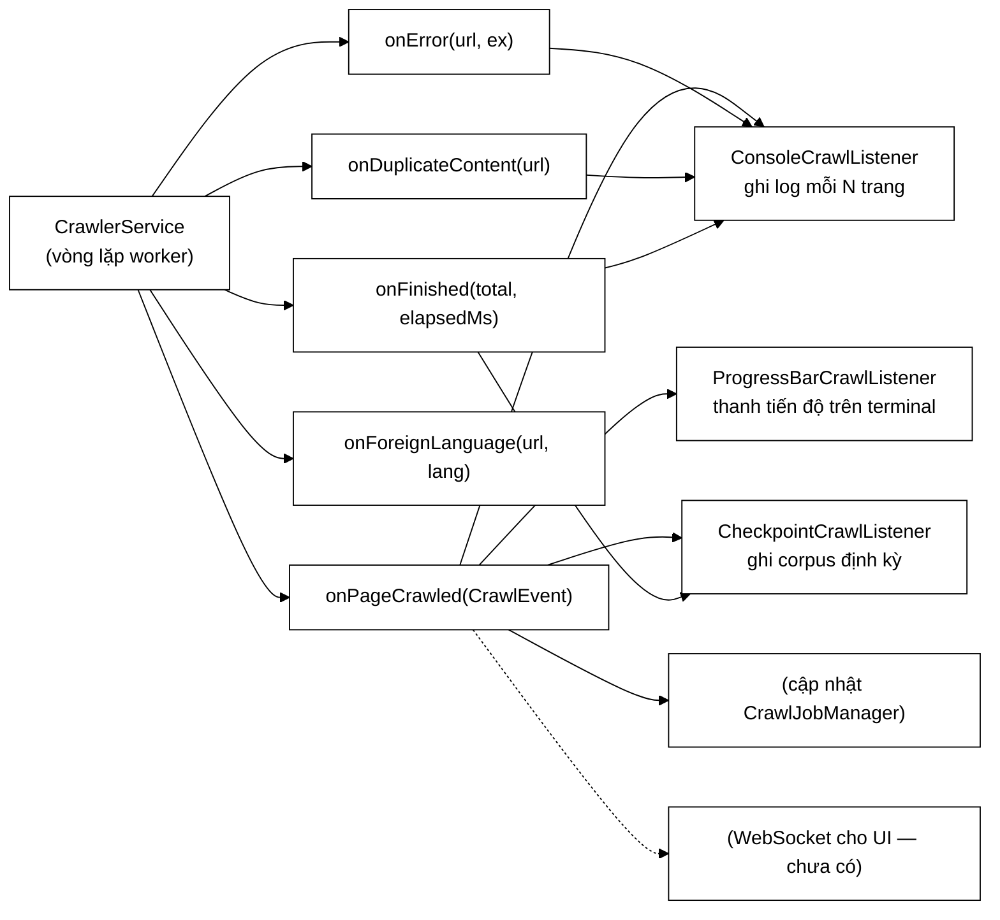

# CrawlListener — tách việc *quan sát* khỏi việc *thực thi*

**File nguồn:** `search-engine/src/main/java/com/vnsearch/crawler/CrawlListener.java` (78 dòng)
**Gói:** `com.vnsearch.crawler` · **Loại:** `interface` với 5 phương thức `default` rỗng + `record CrawlEvent`
**Bản cài đặt:** [`ConsoleCrawlListener`](./ConsoleCrawlListener.md) · [`ProgressBarCrawlListener`](./ProgressBarCrawlListener.md) · [`CheckpointCrawlListener`](./CheckpointCrawlListener.md)
**Đọc kèm:** [`CrawlerService.md`](./CrawlerService.md) · [`ContentSeenFilter.md`](./ContentSeenFilter.md) · [`LanguageFilter.md`](./LanguageFilter.md)

---

## 📌 Hiểu trong 30 giây

**Observer pattern.** Bản cũ chôn thẳng một dòng `System.out.printf` vào vòng
lặp worker. Bản này: [`CrawlerService`](./CrawlerService.md) **phát sự kiện**,
ai quan tâm thì **tự đăng ký**.

Điểm đáng chú ý nhất không phải bản thân mẫu Observer (ai cũng biết), mà là
**cách chia sự kiện**: `onError`, `onDuplicateContent`, `onForeignLanguage` là
**ba** sự kiện riêng, không phải một — vì hai cái sau **không phải lỗi**.



```
   BẢN CŨ — MỘT DÒNG PRINTF, BỐN HẬU QUẢ

   System.out.printf("[%d/%d] %s (depth=%d, %d links, frontier=%d, domains=%d)%n", …);

   ✖ không TẮT được khi chạy test        → spam output, log test không đọc nổi
   ✖ không đẩy lên WebSocket cho UI      → không theo dõi thời gian thực được
   ✖ không ghi ra file để phân tích sau  → mất dữ liệu ngay khi terminal đóng
   ✖ không ĐO được                       → chỉ có chuỗi, không có số liệu có cấu trúc
```

---

## 1. Năm sự kiện — và vì sao chia như vậy

| Sự kiện | Ý nghĩa | Có phải lỗi không |
|---|---|---|
| `onPageCrawled(CrawlEvent)` | Trang tải và trích xuất thành công | — |
| `onError(url, ex)` | URL thất bại **sau khi hết số lần thử lại** | **Có** |
| `onDuplicateContent(url)` | Trang bị vứt vì trùng nội dung | **Không** |
| `onForeignLanguage(url, lang)` | Trang bị vứt vì không phải vi/en | **Không** |
| `onFinished(total, elapsedMs)` | Phiên kết thúc, vì bất kỳ lý do gì | — |

### 1.1 Vì sao `onDuplicateContent` **không** phải `onError`

Javadoc dòng 37–39 nói thẳng:

> Đây **không phải lỗi** mà là crawler làm đúng việc của nó. Nhưng vẫn đáng theo
> dõi, vì **tỷ lệ trùng cao bất thường là dấu hiệu bẫy nhện (spider trap) hoặc
> chuẩn hoá URL còn thiếu**.

```
   Nếu gộp vào onError:
        log đầy "lỗi" mà thật ra hệ thống đang chạy đúng
        → người vận hành mất niềm tin vào cảnh báo
        → và khi có LỖI THẬT thì nó chìm trong 2.000 dòng "lỗi" giả
        ⇒ đây là cách làm hỏng một hệ thống cảnh báo

   Tách riêng:
        onError           → mức WARN, cần chú ý
        onDuplicateContent → mức DEBUG, chỉ theo dõi
```

Nhưng vế thứ hai của Javadoc mới là phần giá trị: **tỷ lệ** trùng là một tín
hiệu chẩn đoán.

```
   Tỷ lệ trùng ~5–10%   → bình thường trên báo điện tử
   Tỷ lệ trùng ~60%     → BẤT THƯỜNG, hai khả năng:
        ├─ BẪY NHỆN: một trang lịch sinh vô hạn URL
        │      /lich?thang=1  /lich?thang=2  …  /lich?thang=999999
        │      mỗi URL khác nhau, nội dung gần như giống hệt
        └─ CHUẨN HOÁ URL CÒN THIẾU: xem UrlCanonicalizer.md
```

### 1.2 Vì sao `onForeignLanguage` cũng tách riêng

Javadoc dòng 48–52 nêu một hành động cụ thể mà số liệu này dẫn tới:

> Tỷ lệ loại cao bất thường cho biết crawler đang đi lạc vào một vùng ngoại ngữ
> và **nên chặn từ sớm bằng `CrawlConfig.excludedHostPrefixes`, rẻ hơn nhiều so
> với tải về rồi vứt**.

```
   Đây là VÒNG PHẢN HỒI giữa hai tuyến phòng thủ:

   LanguageFilter (tuyến 2, ĐẮT — sau khi tải)
        │ phát onForeignLanguage 2.533 lần cho host cn.nhandan.vn
        ▼
   người vận hành thấy số liệu
        │
        ▼
   thêm "cn." vào CrawlConfig.excludedHostPrefixes
        │
        ▼
   UrlFilter (tuyến 1, RẺ — trước khi tải) chặn từ đầu ở phiên sau

   ⇒ Số liệu ở tuyến đắt được dùng để CHỈNH tuyến rẻ.
     Đây chính là cách con số "2.533 trang (8,4%)" trong UrlFilter.md
     được phát hiện ra.
```

Tham số `language` (`"zh"`, `"ja"`, `"other"`…) khiến số liệu **hành động
được**: biết "2.533 trang tiếng Trung" thì thêm được `cn.`, `zh.`; chỉ biết
"2.533 trang ngoại ngữ" thì không biết thêm gì.

### 1.3 `onFinished` — "dù vì lý do gì"

```java
/** Phiên crawl kết thúc (dù vì lý do gì: đủ trang, hết việc, hay hết giờ). */
default void onFinished(int totalPages, long elapsedMs) { }
```

Ba lý do dừng, **một** sự kiện. Đúng cho mục đích hiện tại (ghi corpus lần cuối,
in tổng kết) vì cả ba đều cần cùng hành động.

Nhưng nó **không** cho biết vì sao dừng — và ba lý do có ý nghĩa vận hành rất
khác nhau:

```
   "đủ maxPages"  → thành công, muốn nhiều hơn thì tăng maxPages
   "hết việc"     → frontier rỗng — có thể allowedDomains quá hẹp
   "hết giờ"      → bị cắt ngang — corpus KHÔNG đầy đủ
```

Người đọc báo cáo cần phân biệt ca thứ ba với hai ca đầu. Xem đề xuất 2.

---

## 2. `record CrawlEvent` — số liệu có **cấu trúc**

```java
record CrawlEvent(int pageNumber, int maxPages, String url, int depth,
                  int outlinks, int frontierSize, int domainCount) { }
```

Javadoc dòng 63–65: *"khác hẳn một dòng log dạng chuỗi, dữ liệu này **đo được và
tổng hợp được**."*

```
   ── Dòng log dạng chuỗi ──────────────────────────────────────────
   "[1523/5000] https://a.vn/tin (depth=2, 79 links, frontier=8213, domains=12)"
        muốn biết "độ sâu trung bình" → phải PHÂN TÍCH LẠI chuỗi bằng regex
        muốn vẽ biểu đồ frontier theo thời gian → cũng vậy
        định dạng đổi một chút → mọi công cụ phân tích gãy

   ── record CrawlEvent ────────────────────────────────────────────
   e.depth()  e.frontierSize()  e.domainCount()
        → cộng, trung bình, vẽ biểu đồ, đẩy WebSocket, ghi CSV
        → trình biên dịch canh giữ tên trường
```

### 2.1 Bảy trường và ý nghĩa chẩn đoán

| Trường | Cho biết gì | Bất thường nghĩa là gì |
|---|---|---|
| `pageNumber` / `maxPages` | Tiến độ | — |
| `url` | Trang vừa crawl | — |
| `depth` | Độ sâu BFS | Tăng nhanh ⇒ đi sâu thay vì đi rộng |
| `outlinks` | Số liên kết ra | `0` liên tục ⇒ [`LinkExtractor`](./LinkExtractor.md) hỏng hoặc thiếu `baseUri` |
| **`frontierSize`** | Số URL đang chờ | **Tăng mãi ⇒ crawler không bao giờ kết thúc; về 0 sớm ⇒ hết việc bất ngờ** |
| **`domainCount`** | Số host còn URL chờ | **Giảm dần về 1 ⇒ crawler kẹt vào một site duy nhất** |

Hai trường cuối là hai chỉ số sức khoẻ quan trọng nhất của một phiên crawl, và
chúng chỉ có nghĩa khi **theo dõi theo thời gian** — điều mà một dòng log rời
rạc không cho phép.

```
   frontierSize theo thời gian:

   khoẻ mạnh          bẫy nhện              hết việc sớm
   │                  │        ╱            │╲
   │      ╱╲          │      ╱              │ ╲
   │    ╱    ╲        │    ╱                │  ╲___________
   │  ╱        ╲___   │  ╱                  │
   └──────────────    └──────────           └──────────────
   tăng rồi giảm      TĂNG MÃI              rơi nhanh về 0
   → bình thường      → có bẫy              → allowedDomains quá hẹp?
```

### 2.2 Vì sao `record` được khai báo **bên trong** interface

`CrawlEvent` là kiểu chỉ có nghĩa trong ngữ cảnh của `CrawlListener`. Đặt lồng
bên trong:

- Không thêm một file vào gói.
- Tên đọc thành `CrawlListener.CrawlEvent` — nói rõ nó thuộc về đâu.
- Trong bản cài đặt, `import` interface là có luôn kiểu sự kiện.

Record lồng trong interface **mặc nhiên** `public static` — không cần ghi từ
khoá.

---

## 3. Mọi phương thức là `default` rỗng

```java
default void onPageCrawled(CrawlEvent event) { }
default void onError(String url, Exception error) { }
...
```

Javadoc dòng 20–21: *"cài đặt chỉ cần ghi đè đúng sự kiện mình quan tâm."*

```
   ConsoleCrawlListener     ghi đè 4/5   (bỏ onForeignLanguage)
   CheckpointCrawlListener  ghi đè 2/5   (chỉ onPageCrawled + onFinished)
   ProgressBarCrawlListener ghi đè 3/5

   Nếu tất cả là abstract:
        mỗi bản cài đặt phải viết 5 hàm, trong đó 2–3 hàm rỗng
        → nhiễu, và mỗi lần THÊM sự kiện mới thì MỌI bản cài đặt gãy biên dịch
```

Điểm cuối quan trọng cho khả năng tiến hoá: thêm `onRobotsBlocked(url)` vào
interface **không** làm hỏng bản cài đặt nào.

> ⚠️ Cái giá: nếu ai đó viết sai tên hàm khi ghi đè (`onPageCrawl` thay vì
> `onPageCrawled`), trình biên dịch **không** báo — nó tưởng đó là một hàm mới,
> và listener im lặng không nhận sự kiện nào. `@Override` chặn được điều này, và
> cả ba bản cài đặt hiện có đều dùng đúng.

---

## 4. Ba khoảng trống trong hợp đồng

Interface không nói gì về ba điều mà mọi bản cài đặt cần biết:

### 4.1 Sự kiện được phát từ **nhiều luồng**

```
   CrawlerService chạy N worker song song.
   onPageCrawled được gọi từ BẤT KỲ worker nào, ĐỒNG THỜI.

   ⇒ Mọi bản cài đặt phải an toàn đa luồng.
   ⇒ Nhưng interface KHÔNG nói điều đó ở đâu cả.
```

Đây là bất biến quan trọng nhất mà một người viết listener mới sẽ không biết nếu
không đọc [`CrawlerService`](./CrawlerService.md). So sánh với
[`UserStore`](../auth/UserStore.md), nơi Javadoc ghi rõ *"Mọi bản cài đặt phải
an toàn đa luồng"*.

### 4.2 Listener chậm sẽ **làm chậm crawler**

Không có gì nói listener được gọi **đồng bộ** trên luồng worker:

```
   onPageCrawled ghi một dòng vào CSDL (~5 ms)
        → worker CHỜ 5 ms
        → 31.030 trang × 5 ms / 8 worker ≈ 19 giây thêm

   onPageCrawled ghi cả corpus ra đĩa (CheckpointCrawlListener, ~2 giây)
        → worker CHỜ 2 giây, mỗi lần checkpoint
        → xem CheckpointCrawlListener.md để biết nó xử lý thế nào
```

### 4.3 Ngoại lệ từ listener sẽ đi đâu?

Nếu `onPageCrawled` ném, chuyện gì xảy ra với worker? Interface không nói.
[`CrawlerService`](./CrawlerService.md) phải bọc `try/catch` — nhưng đó là quy
ước, không phải hợp đồng. Xem đề xuất 3.

---

## 5. Hướng dẫn về code

### 5.1 Viết một listener mới — danh sách kiểm tra

```java
public final class MyListener implements CrawlListener {
    @Override                                    // ① LUÔN dùng @Override
    public void onPageCrawled(CrawlEvent e) {
        // ② An toàn đa luồng: dùng AtomicLong / ConcurrentHashMap
        // ③ NHANH: không chạm mạng, không chạm đĩa đồng bộ
        // ④ KHÔNG ném: bọc try/catch nếu có thao tác rủi ro
    }
}
```

| # | Quy tắc | Vì sao |
|---|---|---|
| ① | `@Override` | `default` rỗng khiến lỗi gõ tên trở nên câm (mục 3) |
| ② | An toàn đa luồng | Gọi từ N worker đồng thời (mục 4.1) |
| ③ | Nhanh | Chạy đồng bộ trên luồng worker (mục 4.2) |
| ④ | Không ném | Không rõ ai xử lý (mục 4.3) |

Nếu cần làm việc chậm: xếp vào hàng đợi và xử lý ở luồng riêng — đúng cách
[`ProgressBarCrawlListener`](./ProgressBarCrawlListener.md) và
[`CheckpointCrawlListener`](./CheckpointCrawlListener.md) giải quyết.

### 5.2 Cạm bẫy khi sửa interface này

| Cạm bẫy | Hậu quả | Cách đúng |
|---|---|---|
| Gộp `onDuplicateContent` vào `onError` | Log đầy "lỗi" giả, lỗi thật bị chìm | Giữ tách |
| Bỏ tham số `language` khỏi `onForeignLanguage` | Số liệu không hành động được | Giữ |
| Đổi `default` thành `abstract` | Mọi bản cài đặt gãy khi thêm sự kiện | Giữ `default` |
| Thêm sự kiện **không** `default` | Cùng vấn đề | Luôn `default` rỗng |
| Truyền `WebDocument` thay vì `CrawlEvent` | Listener sửa được tài liệu → tác dụng phụ | Giữ record bất biến |
| Bỏ `frontierSize`/`domainCount` vì "ít dùng" | Mất hai chỉ số sức khoẻ quan trọng nhất | Giữ |

### 5.3 Ba listener hiện có — phân công

| Listener | Ghi đè | Vai trò |
|---|---|---|
| [`ConsoleCrawlListener`](./ConsoleCrawlListener.md) | 4 sự kiện | Ghi log, có tiết lưu mỗi N trang |
| [`ProgressBarCrawlListener`](./ProgressBarCrawlListener.md) | 3 sự kiện | Thanh tiến độ trên terminal |
| [`CheckpointCrawlListener`](./CheckpointCrawlListener.md) | 2 sự kiện | Ghi corpus định kỳ để không mất khi dừng giữa chừng |

Ba vai trò hoàn toàn khác nhau từ cùng một luồng sự kiện — đúng lợi ích mà mẫu
Observer hứa hẹn, và ở đây nó được dùng thật chứ không chỉ để "có pattern".

---

## 6. Độ phức tạp & chi phí

Interface tự nó không có chi phí. Chi phí nằm ở **cách phát sự kiện**:

| Thành phần | Chi phí |
|---|---|
| Tạo một `CrawlEvent` | $O(1)$, ~48 byte, chết ngay sau lời gọi |
| Duyệt danh sách listener | $O(K)$ với $K$ = số listener (2–3) |
| Thân mỗi listener | **Do bản cài đặt quyết định** |

```
   Phát sự kiện (không tính thân listener):
        31.030 trang × 3 listener × ~50 ns ≈ 0,005 giây
        → miễn phí

   Cấp phát CrawlEvent:
        31.030 × 48 byte ≈ 1,5 MB tổng, đều là rác thế hệ trẻ
        → GC dọn gần như miễn phí
```

**Chi phí thật nằm ở bản cài đặt**, và đó là lý do mục 4.2 quan trọng: một
listener chậm biến một mẫu thiết kế "miễn phí" thành nút thắt của cả crawler.

---

## 7. Kiểm thử liên quan

| Test | Bảo vệ điều gì |
|---|---|
| `test/java/com/vnsearch/crawler/CheckpointCrawlListenerTest.java` | Một bản cài đặt |
| `test/java/com/vnsearch/crawler/CrawlerServiceBusWiringTest.java` | Sự kiện được phát đúng lúc |

Interface không cần test riêng. Nhưng nó khiến **`CrawlerService` test được** —
đó mới là giá trị:

```java
@Test
void phatDuSuKienChoMoiTrang() {
    var suKien = Collections.synchronizedList(new ArrayList<CrawlEvent>());
    var listenerGia = new CrawlListener() {
        @Override public void onPageCrawled(CrawlEvent e) { suKien.add(e); }
    };
    // …chạy crawl với một máy chủ giả 5 trang…
    assertEquals(5, suKien.size());
    assertEquals(1, suKien.get(0).pageNumber());
    // frontierSize phải giảm dần về cuối
    assertTrue(suKien.get(4).frontierSize() < suKien.get(0).frontierSize());
}
```

Một listener giả **5 dòng** thay cho việc phải đọc và phân tích log — đây chính
là lợi ích "không tắt được khi chạy test" mà Javadoc nêu ở dòng 12.

---

## 8. Chấm theo chuẩn doanh nghiệp

| Tiêu chí | Điểm | Nhận xét |
|---|---|---|
| Chọn mẫu thiết kế | 10/10 | Observer dùng đúng chỗ; ba bản cài đặt có vai trò thật khác nhau |
| Phân loại sự kiện | 10/10 | Tách "không phải lỗi" khỏi `onError` — và nêu rõ mỗi sự kiện dẫn tới **hành động** gì |
| Dữ liệu có cấu trúc | 10/10 | `record CrawlEvent` thay chuỗi log; `frontierSize`/`domainCount` là chỉ số chẩn đoán thật |
| Khả năng tiến hoá | 9/10 | `default` rỗng cho phép thêm sự kiện không phá bản cài đặt |
| Khả năng kiểm thử | 10/10 | Listener giả 5 dòng thay cho phân tích log |
| **Rõ ràng của hợp đồng** | **5/10** | **Không nói gì** về an toàn đa luồng, về việc gọi đồng bộ, hay về xử lý ngoại lệ |
| Đầy đủ | 7/10 | Thiếu sự kiện bắt đầu phiên; `onFinished` không cho biết **vì sao** dừng |
| Chất lượng tài liệu trong mã | 7/10 | Nội dung tốt (nêu rõ tỷ lệ bất thường nghĩa là gì) nhưng **không dấu tiếng Việt** |

**Ba đề xuất nâng lên mức sản phẩm:**

1. **Ghi rõ ba điều khoản ngầm vào Javadoc** (mục 4): sự kiện được phát từ nhiều
   luồng đồng thời; listener chạy **đồng bộ** trên luồng worker nên phải nhanh;
   ngoại lệ ném ra sẽ bị `CrawlerService` nuốt (hoặc làm chết worker — cần xác
   định rõ). Đây là điểm yếu lớn nhất: cả ba đều là bất biến thật mà người viết
   listener mới không có cách nào biết. `UserStore` đã làm đúng việc này.

2. **`onFinished(int totalPages, long elapsedMs, FinishReason reason)`** với
   `enum FinishReason { MAX_PAGES, FRONTIER_EMPTY, TIME_LIMIT, CANCELLED }`.
   Ba lý do dừng có ý nghĩa vận hành rất khác nhau (mục 1.3), và người đọc báo
   cáo cần phân biệt "crawl xong" với "crawl bị cắt ngang".

3. **`onStarted(CrawlConfig config, Set<String> seeds)`.** Hiện listener không
   biết `maxPages` cho tới sự kiện đầu tiên, nên
   [`ProgressBarCrawlListener`](./ProgressBarCrawlListener.md) không vẽ được
   thanh tiến độ trước khi trang đầu xong. Sự kiện bắt đầu cũng là chỗ tự nhiên
   để [`CheckpointCrawlListener`](./CheckpointCrawlListener.md) dọn tệp cũ và
   để ghi lại cấu hình đã dùng vào báo cáo.

---

## 9. Liên kết

- Nơi phát sự kiện: [`CrawlerService.md`](./CrawlerService.md)
- Ba bản cài đặt: [`ConsoleCrawlListener.md`](./ConsoleCrawlListener.md) · [`ProgressBarCrawlListener.md`](./ProgressBarCrawlListener.md) · [`CheckpointCrawlListener.md`](./CheckpointCrawlListener.md)
- Nguồn `onDuplicateContent`: [`ContentSeenFilter.md`](./ContentSeenFilter.md)
- Nguồn `onForeignLanguage`, và vòng phản hồi ở mục 1.2: [`LanguageFilter.md`](./LanguageFilter.md) → [`UrlFilter.md`](./UrlFilter.md)
- Nguồn `frontierSize`/`domainCount`: [`frontier/UrlFrontier.md`](./frontier/UrlFrontier.md)
- Nơi trạng thái job được cập nhật: [`../service/CrawlJobManager.md`](../service/CrawlJobManager.md)
- Tổng quan: `docs/ARCHITECTURE.md`
