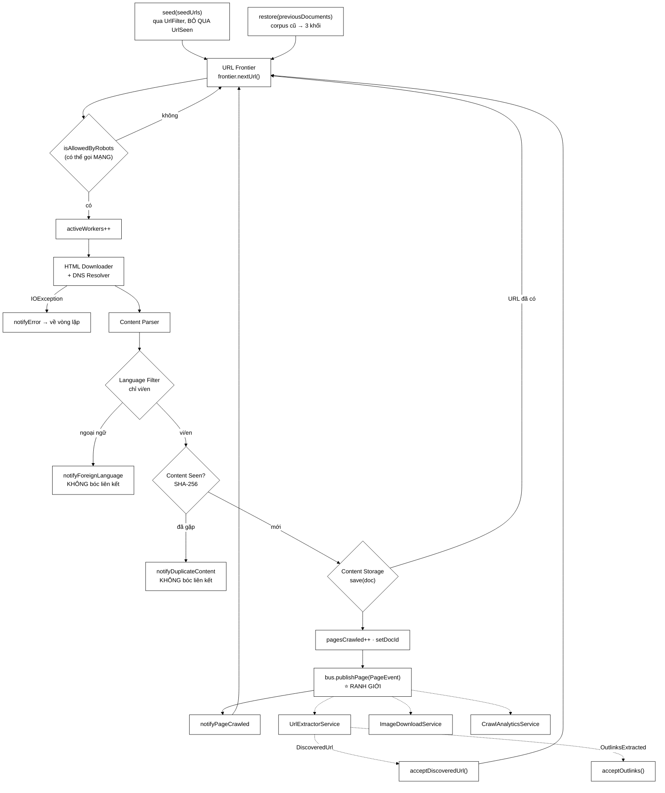

# CrawlerService — lớp không tự làm gì, nhưng quyết định mọi thứ

**File nguồn:** `search-engine/src/main/java/com/vnsearch/crawler/CrawlerService.java` (863 dòng)
**Gói:** `com.vnsearch.crawler` · **Loại:** `class` có trạng thái phiên, đa luồng, **không** phải bean Spring
**Vị trí trong sơ đồ:** toàn bộ khung xương của sơ đồ kiến trúc crawler — mọi ô còn lại đều được lớp này gọi
**Đọc kèm:** [`CrawlConfig.md`](./CrawlConfig.md) · [`frontier/UrlFrontier.md`](./frontier/UrlFrontier.md) · [`bus/CrawlEventBus.md`](./bus/CrawlEventBus.md) · [`../service/CrawlJobManager.md`](../service/CrawlJobManager.md)

---

## 📌 Hiểu trong 30 giây

Javadoc mở đầu bằng một câu đáng nhớ, và nó là chìa khoá để đọc cả lớp:

> *"Bộ điều phối một phiên crawl — lớp này **không tự làm gì**, nó chỉ nối các
> khối lại theo đúng sơ đồ kiến trúc crawler."*

Không tự tải trang (đó là [`HtmlDownloader`](./HtmlDownloader.md)), không tự
phân tích HTML ([`ContentParser`](./ContentParser.md)), không tự lọc URL
([`UrlFilter`](./UrlFilter.md)), không tự chống trùng
([`UrlSeenFilter`](./UrlSeenFilter.md), [`ContentSeenFilter`](./ContentSeenFilter.md)).
Nó chỉ giữ **ba thứ mà không lớp nào khác giữ được**:

```
   ┌──────────────────────────────────────────────────────────────┐
   │  BA THỨ CHỈ CrawlerService CÓ                                │
   │                                                              │
   │  ① THỨ TỰ các khối — vì sao Content Seen? đứng TRƯỚC          │
   │    Link Extractor, vì sao Language Filter đứng TRƯỚC cả hai   │
   │                                                              │
   │  ② VÒNG LẶP và ĐIỀU KIỆN DỪNG — bài toán khó nhất của lớp,    │
   │    và là chỗ duy nhất có một lỗi ĐÃ XẢY RA THẬT               │
   │                                                              │
   │  ③ RANH GIỚI giữa crawler và cụm Modular Services — một       │
   │    dòng `bus.publishPage(...)` thay cho bốn lời gọi cứng      │
   └──────────────────────────────────────────────────────────────┘
```

Ba thứ đó là ba mục nặng nhất của tài liệu này (mục 1, 4, 2). Phần còn lại —
`restore()`, `jobId`, các bộ đếm — là hệ quả.



```
   HAI ĐƯỜNG VỀ FRONTIER — VÀ ĐÓ LÀ TOÀN BỘ SỰ KHÁC BIỆT
   GIỮA HAI CHẾ ĐỘ TRIỂN KHAI

   in-process (ownsBus = true)
        publishPage ─▶ UrlExtractorService ─▶ acceptDiscoveredUrl
        ĐỒNG BỘ, cùng luồng, cùng ngăn xếp lời gọi.
        URL có mặt trong frontier TRƯỚC KHI processPage trả về.
        Độ trễ khứ hồi: ~0.

   Kafka (ownsBus = false)
        publishPage ─▶ broker ─▶ UrlExtractorService (tiến trình khác)
                    ─▶ broker ─▶ CrawlKafkaListeners ─▶ CrawlJobManager
                    ─▶ resolve(jobId) ─▶ acceptDiscoveredUrl
        Độ trễ khứ hồi: hàng trăm ms tới vài giây.

   ⇒ Một hằng số trong điều kiện dừng ĐÚNG cho chế độ này thì SAI
     cho chế độ kia. Xem mục 4.2 — lỗi này đã xảy ra thật.
```

---

## 1. Thứ tự các khối — bốn quyết định, không cái nào tuỳ tiện

Javadoc dòng 79–91 dành cả một đoạn cho việc này, và đó là đoạn đáng đọc nhất
của lớp. Sơ đồ kiến trúc crawler kinh điển vẽ các khối nối tiếp nhau; điều mà
sơ đồ **không** nói là *vì sao* thứ tự đó, và đảo đi thì hỏng ở đâu.

### 1.1 `Language Filter` đứng ngay sau `Content Parser`

```
   THỨ TỰ HIỆN TẠI:
        Parser ─▶ Language Filter ─▶ Content Seen? ─▶ Storage ─▶ (bus) ─▶ Link Extractor

   NẾU ĐẶT SAU Content Seen?:
        ✘ trang ngoại ngữ vẫn tốn một lần băm SHA-256 trên toàn bộ bodyText
          (~15 µs/trang × số trang ngoại ngữ)
        ✘ và vân tay của nó chiếm chỗ trong ContentSeenFilter vĩnh viễn

   NẾU ĐẶT SAU Link Extractor:  ← ĐÂY MỚI LÀ CA CHẾT NGƯỜI
        ✘ liên kết của trang ngoại ngữ ĐƯỢC BÓC và vào frontier
        ✘ crawler đi sâu vào vùng ngoại ngữ, tải từng trang, rồi VỨT từng trang
        ✘ mỗi trang bị vứt lại sinh thêm ~40 liên kết ngoại ngữ nữa

        ⇒ TĂNG TRƯỞNG SỐ MŨ trong một vùng mà 100% kết quả sẽ bị vứt.
        ⇒ Ngân sách maxPages bị đốt vào việc tải rồi vứt.
```

Javadoc nói gọn hơn: *"nếu vẫn bóc, crawler sẽ tiếp tục đi sâu vào vùng ngoại
ngữ để rồi vứt tiếp."* Đây là nguyên tắc chung — **một bộ lọc đặt sau khối sinh
việc thì không còn là bộ lọc, nó chỉ là bộ đếm.**

Và nó giải thích vì sao [`MultiDomainCrawlRunner`](./MultiDomainCrawlRunner.md)
phải có `ENGLISH_SEEDS` riêng: bộ lọc chỉ *loại bớt*, nó không *tạo ra* trang
tiếng Anh.

### 1.2 `Content Seen?` đứng trước `Link Extractor`

```
   Hai URL khác nhau, cùng nội dung (bản in, bản AMP, bản có tham số utm):

        https://vnexpress.net/bai-abc-123.html
        https://vnexpress.net/bai-abc-123.html?utm_source=fb

   Nếu Content Seen? đứng SAU Link Extractor:
        → cả hai đều được bóc liên kết
        → cùng ~40 liên kết y hệt nhau vào frontier hai lượt
        → UrlSeenFilter chặn được lượt hai, nên KHÔNG sai kết quả
        → nhưng đã tốn: 1 lần dựng DOM + 1 lần bóc + 40 lần tra Bloom

   Đặt TRƯỚC:
        → nhánh "Yes" thoát ngay, không dựng DOM lần hai
```

Chú ý sắc thái: đảo thứ tự ở đây **không cho kết quả sai**, chỉ tốn công.
Khác hẳn ca 1.1, nơi đảo thứ tự làm hỏng cả phép crawl. Tài liệu này phân biệt
hai loại lỗi đó vì chúng cần mức ưu tiên khác nhau.

### 1.3 `URL Filter` đứng trước `URL Seen?` — sắp theo giá

Ở `enqueue()` dòng 703–712:

```java
private boolean enqueue(String url, int depth) {
    if (!urlFilter.accept(url, depth)) { return false; }        // ① rẻ
    if (!urlSeenFilter.markSeenIfNew(url)) { return false; }    // ② đắt hơn
    frontier.addUrl(url, depth, 1);
    return true;
}
```

```
   GIÁ MỖI PHÉP KIỂM (đo trên corpus 31.030 trang)

        urlFilter.accept       so chuỗi, so đuôi tệp, so độ sâu    ~0,3 µs
        markSeenIfNew          k hàm băm + k lần chạm bit array    ~1,2 µs
                               ⇒ và nó GHI, tức có tác dụng phụ

   Đặt phép RẺ trước phép ĐẮT là quy tắc chung. Nhưng ở đây còn
   một lý do MẠNH HƠN:

   ┌──────────────────────────────────────────────────────────────┐
   │  markSeenIfNew CÓ TÁC DỤNG PHỤ — nó ĐÁNH DẤU.                │
   │                                                              │
   │  Nếu chạy nó TRƯỚC urlFilter, thì một URL bị filter loại      │
   │  vẫn bị ghi vào bộ lọc Bloom và vào URL Storage.              │
   │  → bộ lọc Bloom phình lên vì rác                             │
   │  → tỷ lệ dương tính giả tăng                                 │
   │  → và những URL THẬT bắt đầu bị chặn nhầm                    │
   │                                                              │
   │  ⇒ Khi một trong hai phép kiểm có tác dụng phụ, thứ tự        │
   │    không còn là chuyện hiệu năng nữa — nó là chuyện ĐÚNG/SAI. │
   └──────────────────────────────────────────────────────────────┘
```

### 1.4 Phép kiểm robots.txt bị tách khỏi `urlFilter.accept`

Đây là quyết định thứ tự thứ tư, và nó tinh tế nhất. `UrlFilter` có hai nhóm
luật, và chúng **không** chạy cùng lúc:

| Nhóm | Chạy ở đâu | Giá |
|---|---|---|
| domain, đuôi tệp, độ sâu, scheme, tiền tố host | `enqueue()` — lúc **xếp hàng** | vài trăm ns, thuần bộ nhớ |
| `isAllowedByRobots` | `workerLoop()` — lúc **lấy ra** | có thể là một lượt **tải mạng** |

```
   VÌ SAO KHÔNG GỘP CẢ HAI VÀO enqueue()?

        Mỗi trang sinh ~40 liên kết. Với 31.030 trang đó là 1,2 triệu
        lượt gọi enqueue(). Nếu robots.txt được hỏi ở đó, thì:
             - luồng đang gọi enqueue là luồng của UrlExtractorService
             - nó sẽ chặn trên I/O mạng ngay trong đường xử lý sự kiện
             - và với host mới, mỗi lần là một request thật

   VÌ SAO KHÔNG BỎ HẲN?
        Vì đó là cam kết lịch sự với site đích, không phải tối ưu.

   ⇒ Đặt ở workerLoop, ngay TRƯỚC khi tải: chỉ hỏi cho những URL
     THẬT SỰ sắp được tải, tức khoảng 31.030 lần thay vì 1,2 triệu.
     Giảm 97,5% số lượt hỏi.

   ⚠ NHƯNG nó nằm ĐÚNG TRONG cửa sổ đua của điều kiện dừng.
     Xem mục 4.4 — đây là điểm yếu thật của lớp.
```

---

## 2. Hai chế độ, một đường mã — `ownsBus`

### 2.1 Ba constructor và một quy tắc

```java
public CrawlerService() {                       // dòng 246
    this.bus = new InProcessCrawlEventBus();
    this.ownsBus = true;
    this.imageStore = null;
}

public CrawlerService(CrawlEventBus bus) { this(bus, null); }   // dòng 262

public CrawlerService(CrawlEventBus bus, ImageStore imageStore) {   // dòng 270
    if (bus == null) {
        this.bus = new InProcessCrawlEventBus();
        this.ownsBus = true;
    } else {
        this.bus = bus;
        this.ownsBus = false;
    }
    this.imageStore = imageStore;
}
```

```
   `bus == null` ⇒ "về mặc định", KHÔNG phải lỗi.

   Đây chính là hợp đồng mà CrawlJobManager dựa vào để KHÔNG có
   nhánh if nào (xem CrawlJobManager.md mục 2):

        CrawlerService crawler = new CrawlerService(sharedBus, imageStore);
        // sharedBus null ở chế độ mặc định -> CrawlerService tự lo

   ⇒ QUYẾT ĐỊNH CHỌN BẢN CÀI NẰM Ở ĐÚNG MỘT CHỖ.
     Nếu CrawlJobManager cũng kiểm null, sẽ có HAI chỗ biết về hai
     chế độ — và hai chỗ đó chắc chắn sẽ lệch nhau sau vài lần sửa.
```

### 2.2 `ownsBus` — một `boolean` mang ba nghĩa

Trường này bé nhưng gánh nhiều việc. Nó được đọc ở **ba** chỗ hoàn toàn khác
nhau, và mỗi chỗ dùng nó cho một mục đích riêng:

| Chỗ đọc | Dòng | Nghĩa được dùng |
|---|---|---|
| `wireInProcessServices()` | 297 | "tôi có phải tự đăng ký ba service không?" |
| `workerLoop()` | 564–565 | "cửa sổ chờ hết việc phải rộng bao nhiêu?" |
| `isInProcessMode()` | 836 | "báo cáo có số liệu service không?" |

```
   ┌──────────────────────────────────────────────────────────────┐
   │  MỘT CỜ, BA NGHĨA — CÓ ĐÁNG NGẠI KHÔNG?                      │
   │                                                              │
   │  Ba nghĩa đó suy được từ NHAU: nếu tôi sở hữu bus thì các    │
   │  service ở cùng tiến trình, mà cùng tiến trình thì enqueue    │
   │  là lời gọi hàm, mà lời gọi hàm thì độ trễ ~0.               │
   │                                                              │
   │  ⇒ Không phải "một biến gánh ba việc không liên quan",        │
   │    mà là "một sự thật kéo theo ba hệ quả". Chấp nhận được.   │
   │                                                              │
   │  ⚠ Nhưng dòng 564–565 đọc ownsBus để suy ra ĐỘ TRỄ MẠNG.     │
   │    Đó là một suy diễn ngầm hai bậc. Nếu mai có chế độ thứ    │
   │    ba (in-process nhưng service chạy trên executor riêng),   │
   │    suy diễn này sai. Xem đề xuất 2 ở mục 13.                 │
   └──────────────────────────────────────────────────────────────┘
```

### 2.3 `wireInProcessServices()` — hai điều kiện bảo vệ

```java
private void wireInProcessServices() {          // dòng 296
    if (!ownsBus || urlExtractorService != null) {
        return; // đã nối rồi, hoặc bus do bên ngoài quản
    }
    ...
}
```

Hai vế của `if` chặn hai tai nạn **khác nhau**:

```
   VẾ ①  !ownsBus  →  chặn ĐĂNG KÝ TRÙNG QUA TIẾN TRÌNH

        Ở chế độ Kafka, ba service ĐÃ chạy ở tiến trình khác.
        Đăng ký thêm bản cục bộ ⇒
             - mỗi trang bị xử lý HAI lần
             - mỗi URL bị xếp hàng HAI lượt
             - mỗi ảnh bị tải HAI lần
             - và số liệu Analytics gấp đôi mà không ai biết vì sao

   VẾ ②  urlExtractorService != null  →  chặn ĐĂNG KÝ TRÙNG QUA PHIÊN

        wireInProcessServices() được gọi TRONG crawl() (dòng 411),
        tức mỗi phiên một lần. Nếu cùng một CrawlerService chạy hai
        phiên, lần hai sẽ đăng ký thêm ba handler nữa vào cùng bus
        ⇒ đúng triệu chứng như vế ①, nhưng trong một tiến trình.

        (Trên thực tế CrawlJobManager tạo CrawlerService mới cho mỗi
        job, nên vế ② chưa bao giờ được kích hoạt — nó là phòng thủ.
        Nhưng xem mục 3.4: chạy hai phiên trên cùng đối tượng còn
        hỏng ở chỗ khác NGHIÊM TRỌNG HƠN mà không có gì chặn.)
```

### 2.4 Vì sao đăng ký **sau** khi hai bộ lọc đã có

Chú thích dòng 408–410 và Javadoc dòng 284–288 nói cùng một điều từ hai phía:

```java
urlFilter     = new UrlFilter(config.allowedDomains(), config.maxDepth(), ...);
urlSeenFilter = UrlSeenFilter.forMaxPages(config.maxPages(), urlStorage);
wireInProcessServices();                                        // ← SAU
```

```java
UrlExtractorService extractor = new UrlExtractorService(
        new LinkExtractor(), () -> urlFilter, () -> urlSeenFilter, bus);
//                          ^^^^^^^^^^^^^^^  ^^^^^^^^^^^^^^^^^^^
//                          Supplier, KHÔNG phải tham chiếu trực tiếp
```

```
   VÌ SAO Supplier<UrlFilter> chứ không phải UrlFilter?

        urlFilter là trường `volatile` được GÁN LẠI ở đầu mỗi phiên
        (dòng 404). Nếu UrlExtractorService giữ tham chiếu trực tiếp,
        nó sẽ mãi mãi thấy bộ lọc của phiên ĐẦU TIÊN:
             → allowedDomains sai
             → maxDepth sai
             → và bộ lọc Bloom cũ, đã đầy, tỷ lệ dương tính giả cao

        Supplier đọc lại trường mỗi lần gọi ⇒ luôn thấy bản hiện hành.

   VẬY VÌ SAO VẪN PHẢI GỌI wireInProcessServices() SAU?

        Vì Javadoc muốn thứ tự ĐÚNG kể cả khi bản cài đổi:
        "đăng ký ở đây thì thứ tự luôn đúng kể cả khi bản cài đổi sang
         giữ tham chiếu trực tiếp."

   ⇒ Đây là phòng thủ theo kiểu "viết mã sao cho lần sửa sau khó sai".
     Một dòng đặt đúng chỗ, không tốn gì, mà loại được một lớp lỗi.
```

Và chi tiết cuối trong `wireInProcessServices` đáng chú ý — kho ảnh là **bên
nhận thứ hai** của cùng một kênh:

```java
.subscribeImages(analytics::onImage);
if (imageStore != null) {
    localBus.subscribeImages(imageStore::add);
}
```

> *"Đếm và lưu là hai trách nhiệm, và tắt một cái không được làm hỏng cái kia."*

---

## 3. Vòng đời một phiên crawl

### 3.1 `crawl()` — bảy bước, dòng 395–432

```
   ① UrlStorage: file hoặc disabled            (dòng 401–403)
   ② urlFilter, urlSeenFilter cho phiên này    (dòng 404–406)
   ③ wireInProcessServices()                   (dòng 411)
   ④ urlSeenFilter.replayFromStorage()         (dòng 414)
   ⑤ restore(previousDocuments)                (dòng 420)
   ⑥ seed(seedUrls)                            (dòng 421)
   ⑦ runWorkers(config) ─────── CHẶN Ở ĐÂY ─── (dòng 422)
      ...
      finally { urlStorage.close(); }          (dòng 423–427)
      notifyFinished + return contentStorage.all()
```

Ba chi tiết đáng dừng lại:

**`urlStorage` là biến cục bộ, không phải trường** (chú thích dòng 399–400):
*"kho URL chỉ sống trong đúng một phiên crawl, và ai cần tới nó về sau đều lấy
được qua `urlSeenFilter`."* Một trường thì phải nghĩ về việc đóng nó, về việc
phiên sau ghi đè nó, về việc ai đọc nó lúc nào. Một biến cục bộ thì không.

**`urlStorage.close()` trong `finally`** — chú thích dòng 424–425 nói rõ hậu
quả: *"thiếu nó thì phần đuôi trong bộ đệm không bao giờ được ghi xuống đĩa khi
phiên crawl kết thúc bất thường."* Cùng khuôn với `latch.countDown()` ở dòng 527
và `activeWorkers.decrementAndGet()` ở dòng 598 — lớp này dùng `finally` **ba
lần**, và cả ba đều kèm chú thích nêu triệu chứng nếu thiếu.

**`return contentStorage.all()`** — trả về **toàn bộ corpus**. Đây là dòng nối
lớp này với lỗ rò 367 MB ở [`CrawlJobManager`](../service/CrawlJobManager.md)
mục 1.1: chừng nào còn ai giữ tham chiếu tới `CrawlerService`, chừng đó cả
corpus còn sống.

### 3.2 `seed()` — chỗ duy nhất cố tình **bỏ qua** `UrlSeenFilter`

```java
private void seed(List<String> seedUrls) {                      // dòng 505
    for (String seed : seedUrls) {
        String url = UrlCanonicalizer.canonicalize(seed);
        if (!urlFilter.accept(url, 0)) {
            log.warn("Seed bị URL Filter loại, bỏ qua: {}", seed);
            continue;
        }
        urlSeenFilter.markSeenIfNew(url);       // ← GỌI, nhưng KHÔNG DÙNG kết quả
        frontier.addUrl(url, 0, SEED_BACKLINK_SCORE);
    }
}
```

```
   DÒNG 512 GỌI markSeenIfNew RỒI VỨT KẾT QUẢ ĐI. Cố ý.

        Ở phiên NỐI TIẾP, seed chắc chắn đã nằm trong kho URL đã gặp
        (nó là trang chủ, nó chắc chắn đã được crawl ở phiên trước).

        Nếu tôn trọng kết quả:
             markSeenIfNew("https://vnexpress.net/") → false
             → seed không vào frontier
             → LẶP LẠI cho cả 19 seed
             → frontier RỖNG ngay từ đầu
             → mọi worker thấy rỗng, chờ 3×200ms, thoát
             → phiên crawl kết thúc với 0 trang, trạng thái DONE, KHÔNG LỖI

   ⇒ Vẫn GỌI để đánh dấu (nếu là phiên mới thì cần đánh dấu thật),
     nhưng KHÔNG ĐỌC kết quả. Đây là một trong số ít chỗ mà "gọi hàm
     rồi bỏ giá trị trả về" là đúng — và Javadoc dòng 500–503 giải
     thích rõ, nếu không thì lần sửa sau sẽ có người "dọn dẹp" nó.
```

`SEED_BACKLINK_SCORE = 10` (dòng 105) so với `1` ở mọi chỗ khác: seed được ưu
tiên hơn liên kết bóc được trong [`UrlFrontier`](./frontier/UrlFrontier.md),
nên phiên crawl toả ra từ trang chủ trước khi lún sâu vào một nhánh.

### 3.3 `runWorkers()` — pool cố định + latch, dòng 517–541

```java
ExecutorService pool = Executors.newFixedThreadPool(config.threadCount());
CountDownLatch latch = new CountDownLatch(config.threadCount());
for (int i = 0; i < config.threadCount(); i++) {
    pool.submit(() -> {
        try { workerLoop(config); }
        catch (Exception e) { log.error("Worker dừng bất thường", e); }
        finally { latch.countDown(); }
    });
}
if (!latch.await(config.maxDurationMinutes(), TimeUnit.MINUTES)) { ... }
pool.shutdownNow();
```

```
   VÌ SAO LATCH CHỨ KHÔNG PHẢI pool.awaitTermination()?

        awaitTermination CHỈ có tác dụng sau shutdown().
        Muốn dùng nó ta phải: shutdown() → await → shutdownNow().
        Latch tách hai việc ra rõ ràng: "chờ worker xong"
        và "dẹp pool" là hai chuyện khác nhau.

   VÌ SAO catch (Exception) BAO NGOÀI workerLoop?

        Nếu một worker ném mà không ai bắt, ExecutorService NUỐT
        ngoại lệ vào Future — và Future đó không ai đọc.
        ⇒ Worker chết IM LẶNG, thông lượng tụt 1/N, không dấu vết.
        Đây là cạm bẫy kinh điển của submit() so với execute().

   latch.countDown() TRONG finally — chú thích dòng 527 nêu đúng
   triệu chứng: "thiếu nó thì await() chờ đủ 60 phút vô ích."
```

### 3.4 ⚠ Điểm yếu: gọi `crawl()` lần thứ hai trên cùng đối tượng

Không có gì trong lớp này chặn việc đó, và hậu quả im lặng:

```
   TRẠNG THÁI KHÔNG ĐƯỢC ĐẶT LẠI GIỮA HAI PHIÊN:

        pagesCrawled       giữ nguyên số cũ
        contentStorage     giữ nguyên corpus cũ
        contentSeenFilter  giữ nguyên vân tay cũ
        frontier           giữ nguyên phần chưa duyệt
        restoredDocCount   bị GHI ĐÈ nếu phiên hai có previousDocuments

   HẬU QUẢ CỤ THỂ:

        crawl(seeds, config với maxPages=5000)   → pagesCrawled = 5000
        crawl(seeds, cùng config)                → điều kiện while:
                                                    5000 < 5000 = false
                                                 → MỌI worker thoát NGAY
                                                 → trả về corpus cũ
                                                 → trạng thái DONE, 0 lỗi

   ┌──────────────────────────────────────────────────────────────┐
   │  Lớp này thực chất là ĐỐI TƯỢNG DÙNG MỘT LẦN, nhưng không     │
   │  có gì trong API nói lên điều đó — không tên phương thức,     │
   │  không Javadoc, không kiểm tra lúc chạy.                     │
   │                                                              │
   │  CrawlJobManager tình cờ dùng đúng (tạo mới mỗi job), nên     │
   │  lỗi này CHƯA từng xảy ra. Nó là bẫy chờ sẵn cho lần sửa      │
   │  tiếp theo. Xem đề xuất 1 ở mục 13.                          │
   └──────────────────────────────────────────────────────────────┘
```

---

## 4. Vòng lặp worker và bài toán phát hiện kết thúc

Đây là phần khó nhất, và cũng là phần duy nhất trong lớp có một lỗi **đã xảy ra
trong thực tế** và được ghi lại nguyên văn ở dòng 107–134.

### 4.1 Vì sao "frontier rỗng" không có nghĩa là hết việc

```
   BỐN WORKER, MỘT KHOẢNH KHẮC:

        W1  đang tải trang A (mất 800 ms)  ─ sắp thêm 40 liên kết
        W2  đang tải trang B (mất 1200 ms) ─ sắp thêm 35 liên kết
        W3  vừa lấy trang C ra khỏi frontier
        W4  gọi frontier.nextUrl() → null

        frontier.size() == 0 tại đúng khoảnh khắc này.

   NẾU W4 THOÁT NGAY:
        → chỉ còn 3 worker
        → rồi 2, rồi 1, rồi 0
        → mỗi khoảng trống TẠM THỜI giết một worker VĨNH VIỄN
        → phiên crawl dừng ở vài trăm trang thay vì 31.030

   ⇒ Frontier rỗng là trạng thái BÌNH THƯỜNG giữa phiên crawl,
     không phải tín hiệu kết thúc.
```

Điều kiện đúng, theo Javadoc dòng 552: `F = 0 AND A = 0` — frontier rỗng **và**
không worker nào đang bận. `activeWorkers` (dòng 227) tồn tại chỉ để trả lời vế
thứ hai.

### 4.2 Lỗi thật: cùng một hằng số cho hai chế độ có độ trễ chênh 1000 lần

Đoạn chú thích dòng 107–134 là một trong những đoạn thẳng thắn nhất của cả
repo. Tóm tắt:

```
   TRƯỚC (một bộ hằng số duy nhất):
        IDLE_CONFIRMATIONS = 3,  IDLE_SLEEP_MS = 200
        ⇒ cửa sổ chờ = 600 ms

   Ở chế độ in-process:  600 ms là THỪA THÃI.
        enqueue là lời gọi hàm; URL có mặt trong frontier trước khi
        processPage trả về. Cần 0 ms.

   Ở chế độ Kafka, một URL phải đi hết chặng:
        publishPage ─▶ broker ─▶ UrlExtractorService ─▶ lọc
                    ─▶ publishDiscoveredUrl ─▶ broker ─▶ feeder ─▶ frontier

        linger.ms của producer                    20 ms  (× 2 chặng)
        chu kỳ poll của hai consumer              ~100–500 ms mỗi cái
        độ trễ mạng, thời gian xử lý              thay đổi

        ⇒ Vòng khứ hồi chậm nhất đo được: hàng GIÂY.

   TRIỆU CHỨNG ĐÃ XẢY RA:
        crawler chế độ Kafka kết luận "hết việc" NGAY SAU trang seed,
        dừng với đúng 1–2 trang, trong khi 104 URL đang trên đường về.
        Job báo DONE. Không một lỗi nào.
```

```
   SAU (hai bộ hằng số, chọn theo ownsBus — dòng 136–142):

        in-process   3  × 200 ms   =    600 ms
        Kafka       15  × 1000 ms  = 15.000 ms

        final int  idleConfirmations = ownsBus ? LOCAL : BUS;
        final long idleSleepMs       = ownsBus ? LOCAL : BUS;
```

Và chú thích **không** tự khen — dòng 127–131:

> *"Đây KHÔNG phải lời giải đúng đắn có chứng minh. Bài toán 'phát hiện kết thúc
> phân tán' có lời giải chính xác (Dijkstra–Scholten, Safra) dựa trên việc đếm
> thông điệp đang bay chứ không dựa vào thời gian. Nới cửa sổ chỉ làm xác suất
> nhầm nhỏ đi, không làm nó bằng 0 — và nó đánh đổi bằng việc mỗi phiên crawl
> mất thêm ~15 giây ở cuối để chắc chắn."*

```
   ┌──────────────────────────────────────────────────────────────┐
   │  ĐÂY LÀ MẪU GHI CHÉP ĐÁNG HỌC                                │
   │                                                              │
   │  ① nêu triệu chứng CỤ THỂ ("1–2 trang, 104 URL đang bay")     │
   │  ② nêu nguyên nhân gốc (độ trễ khác nhau 1000 lần)           │
   │  ③ nêu cách vá                                               │
   │  ④ và THỪA NHẬN cách vá chỉ là heuristic, kèm tên thuật       │
   │    toán đúng để người sau biết tìm ở đâu                     │
   │                                                              │
   │  Bốn phần đó biến một chú thích thành tài liệu thật.          │
   └──────────────────────────────────────────────────────────────┘
```

### 4.3 `workerLoop` — đọc từng dòng, 563–601

```java
while (pagesCrawled.get() < config.maxPages()) {
    CrawlTask task = frontier.nextUrl();
    if (task == null) {
        if (activeWorkers.get() == 0 && ++idleChecks >= idleConfirmations) {
            break;
        }
        try { Thread.sleep(idleSleepMs); }
        catch (InterruptedException e) { Thread.currentThread().interrupt(); return; }
        continue;
    }
    idleChecks = 0;                                     // dòng 582
    if (!urlFilter.isAllowedByRobots(task.url())) { continue; }
    activeWorkers.incrementAndGet();                    // dòng 590
    try { processPage(task, config); }
    finally { activeWorkers.decrementAndGet(); }
}
```

**`idleChecks = 0` ở dòng 582** — chú thích: *"chỉ tích luỹ khi LIÊN TỤC rỗng."*

```
   NẾU KHÔNG ĐẶT LẠI:
        idleChecks cộng dồn suốt phiên crawl.
        Sau 3 lần frontier rỗng TÁCH RỜI NHAU (cách nhau hàng giờ),
        worker sẽ thoát ở lần thứ 3 — dù lúc đó frontier có 20.000 URL.

   ⇒ Một dòng gán, chặn được lỗi "crawler dừng sớm ngẫu nhiên"
     — loại lỗi khó tái lập nhất.
```

**`++idleChecks` nằm sau `&&`** — chi tiết dễ bỏ qua:

```java
if (activeWorkers.get() == 0 && ++idleChecks >= idleConfirmations)
```

```
   Java đoản mạch (short-circuit) &&:
        activeWorkers != 0  ⇒  ++idleChecks KHÔNG chạy.

   ⇒ idleChecks chỉ đếm những vòng mà CẢ HAI điều kiện đều đang đúng.
     Nếu viết ngược lại:
        if (++idleChecks >= idleConfirmations && activeWorkers.get() == 0)
     thì idleChecks tăng cả khi có worker đang bận, và chỉ cần một
     khoảnh khắc rỗng SAU ĐÓ là thoát ngay — mất hết tác dụng của
     việc "xác nhận nhiều lần liên tiếp".

   Thứ tự hai vế của && ở đây là một quyết định, không phải văn phong.
```

**`Thread.currentThread().interrupt()` rồi `return`** (dòng 577–578): khôi phục
cờ ngắt trước khi thoát. Nuốt cờ đi thì `pool.shutdownNow()` ở dòng 540 không
có tác dụng gì với các tầng bên trên.

### 4.4 ⚠ Cửa sổ đua rộng hơn Javadoc thừa nhận

Javadoc dòng 552–558 tính xác suất nhầm:

> *"tồn tại một cửa sổ đua: worker A thấy frontier rỗng đúng lúc worker B đã lấy
> task nhưng CHƯA kịp `incrementAndGet`. Yêu cầu điều kiện dừng đúng
> `IDLE_CONFIRMATIONS` lần liên tiếp, cách nhau 200ms, đưa xác suất nhầm xuống
> khoảng `(vài us / 200000 us)^3 ~= 10^-15`."*

Phép tính đó giả định cửa sổ rộng **vài micro-giây**. Nhưng nhìn lại mã:

```
   frontier.nextUrl()              ← task rời khỏi frontier TẠI ĐÂY
        │
        ├─ idleChecks = 0
        │
        ├─ urlFilter.isAllowedByRobots(task.url())
        │        └── với host CHƯA có trong cache: TẢI robots.txt
        │            → một request HTTP thật
        │            → 100 ms tới vài GIÂY nếu host chậm
        │
        └─ activeWorkers.incrementAndGet()   ← A tăng TẠI ĐÂY

   ┌──────────────────────────────────────────────────────────────┐
   │  CỬA SỔ ĐUA THẬT = thời gian tải robots.txt,                  │
   │  KHÔNG PHẢI "vài micro-giây".                                │
   │                                                              │
   │  Trong cửa sổ đó:  frontier.size() == 0                      │
   │                    activeWorkers.get() == 0                  │
   │                    → điều kiện dừng ĐÚNG, dù có việc đang làm │
   │                                                              │
   │  Với host chậm 2 giây và cửa sổ in-process 600 ms:            │
   │  ba lần xác nhận đều rơi trọn trong cửa sổ ⇒ MỌI worker khác  │
   │  thoát, dù trang cuối sắp sinh 40 liên kết mới.               │
   │                                                              │
   │  ⇒ Con số 10^-15 trong Javadoc KHÔNG ĐÚNG với mã hiện tại.    │
   └──────────────────────────────────────────────────────────────┘

   MỨC ĐỘ THIỆT HẠI (may mắn là có giới hạn):
        Worker đang giữ task VẪN chạy tiếp — nó không tự thoát.
        Nên frontier vẫn được rút cạn, chỉ là bằng MỘT worker.
        ⇒ Không mất tính đúng đắn, nhưng thông lượng cuối phiên
          tụt về 1/N mà không có gì báo.

   CÁCH SỬA RẺ NHẤT: chuyển activeWorkers.incrementAndGet() lên
   NGAY SAU frontier.nextUrl(), và bọc cả phần robots trong try/finally.
   Xem đề xuất 3 ở mục 13.
```

### 4.5 ⚠ `maxPages` bị vượt tới `threadCount − 1` trang

```
   Điều kiện vòng lặp:   pagesCrawled.get() < maxPages
   Nơi tăng:             pagesCrawled.incrementAndGet()  (dòng 635)

   Giữa hai điểm đó là: robots + tải + phân tích + lọc + lưu.

   N worker cùng vượt qua phép kiểm khi pagesCrawled == maxPages − 1
        → cả N cùng tải, cùng lưu
        → pagesCrawled kết thúc ở maxPages + N − 1

   Với MultiDomainCrawlRunner: threadCount = min(32, 19×2) = 32
        maxPages = 5.000  →  corpus thực tế có thể là 5.031 trang.

   ⇒ Có nghiêm trọng không? KHÔNG, với mục đích dựng corpus.
     Nhưng nó làm phiên crawl KHÔNG TÁI LẬP ĐƯỢC chính xác, và
     `UrlSeenFilter.forMaxPages(maxPages)` cấp phát bộ lọc Bloom
     theo đúng con số đó — vượt trần nghĩa là tỷ lệ dương tính giả
     cao hơn tính toán một chút.
```

---

## 5. `processPage` — một lượt qua toàn bộ chuỗi khối

Dòng 604–676. Đây là nơi sơ đồ kiến trúc biến thành mã, gần như một-một.

### 5.1 Bốn đường thoát sớm, bốn lý do khác nhau

| Dòng | Điều kiện | Báo cho listener | Có bóc liên kết? |
|---|---|---|---|
| 608–612 | `IOException` khi tải | `onError` | không |
| 620–622 | không phải vi/en | `onForeignLanguage` | **không** — xem 1.1 |
| 626–628 | trùng nội dung | `onDuplicateContent` | **không** — xem 1.2 |
| 631–633 | URL đã có bản ghi | *(không báo gì)* | không |

```
   ĐƯỜNG THOÁT THỨ TƯ KHÔNG BÁO GÌ — cố ý:

        if (!contentStorage.save(doc)) {
            return; // URL này đã có bản ghi, không đếm trùng
        }

   Ba đường trên là SỰ KIỆN có ý nghĩa với người theo dõi.
   Đường này là chuyện nội bộ: cùng một URL lọt vào frontier hai
   lượt (dương tính giả của Bloom filter, hoặc đường về từ Kafka
   không lọc lại). Báo ra chỉ làm nhiễu.

   ⚠ Nhưng nó cũng KHÔNG ĐƯỢC ĐẾM. Nếu con số này lớn bất thường,
     đó là dấu hiệu UrlSeenFilter đang hỏng — và hiện không có cách
     nào biết. Xem đề xuất 5.
```

### 5.2 Ranh giới — chú thích dòng 640–659

Đây là đoạn chú thích dài nhất của lớp, và nó đắt giá:

```java
bus.publishPage(new PageEvent(
        task.url(), hostOf(task.url()), task.depth(),
        doc.getTitle(), doc.getBodyText(), doc.getLanguage(),
        html.outerHtml(),
        ContentSeenFilter.fingerprint(doc.getBodyText() == null ? "" : doc.getBodyText()),
        doc.getCrawledAt() != null ? doc.getCrawledAt() : Instant.now(),
        jobId));
```

```
   TRƯỚC:  bốn dòng gọi thẳng LinkExtractor rồi lặp enqueue().
   SAU:    MỘT lời phát lên bus, ba service tự lấy phần của mình.

   CHI PHÍ ĐÃ BIẾT VÀ ĐÃ ĐO — Javadoc không giấu:

        html.outerHtml()   kết xuất cây DOM thành chuỗi
        UrlExtractorService phân tích chuỗi đó LẦN NỮA
        ⇒ DOM bị dựng HAI LẦN
        ⇒ ~3–8 ms mỗi trang

        Trên 31.030 trang: 93–248 giây, tức 0,3–0,8% phiên 8,6 giờ.

   VÌ SAO KHÔNG TỐI ƯU BẰNG ĐƯỜNG TẮT?

   ┌──────────────────────────────────────────────────────────────┐
   │  "Một đường tắt 'nếu in-process thì truyền thẳng Document'    │
   │   sẽ tạo ra một nhánh CHỈ CHẠY Ở MÔI TRƯỜNG THẬT,            │
   │   tức một nhánh KHÔNG ĐƯỢC TEST."                            │
   │                                                              │
   │  Đây là cùng nguyên tắc mà InProcessCrawlEventBus dùng cho    │
   │  try/catch (xem bus/InProcessCrawlEventBus.md mục 2.2):       │
   │  hai chế độ phải chạy CÙNG MỘT đường mã, kể cả khi chế độ     │
   │  đơn giản phải trả thêm chi phí vô ích.                      │
   └──────────────────────────────────────────────────────────────┘
```

Và đoạn cuối trả lời câu hỏi *"vì sao không tách luôn phần tải trang thành
service thứ tư?"*:

> *"nó là thứ DUY NHẤT phải tôn trọng chính sách lịch sự theo host, và chính
> sách đó gắn liền với `UrlFrontier`."*

Tách ra thì bộ hoãn 1 giây/host nằm ở một tiến trình, còn hàng đợi theo host
nằm ở tiến trình khác — và cam kết lịch sự tan rã.

### 5.3 `notifyPageCrawled` báo `outlinks = 0` ở chế độ Kafka — và đó là đúng

Chú thích dòng 668–672:

```
   in-process:  publishPage ĐỒNG BỘ
                ⇒ UrlExtractorService đã ghi outlinks vào doc
                ⇒ doc.getOutlinks().size() là con số THẬT

   Kafka:       publishPage chỉ đẩy vào producer
                ⇒ outlinks chưa quay về
                ⇒ doc.getOutlinks().size() == 0

   ┌──────────────────────────────────────────────────────────────┐
   │  "Báo một con số đoán bừa còn tệ hơn báo 0."                 │
   │                                                              │
   │  0 nghĩa là "crawler chưa biết" — đúng sự thật.              │
   │  Một con số ước lượng (ví dụ trung bình 40) sẽ trông hợp lý,  │
   │  cộng dồn vào thống kê, và không ai phát hiện nó là bịa.     │
   └──────────────────────────────────────────────────────────────┘
```

### 5.4 ⚠ `hostOf` lùi về chính URL — hệ quả ở chế độ Kafka

```java
private static String hostOf(String url) {                      // dòng 679
    try {
        String host = java.net.URI.create(url).getHost();
        return host != null && !host.isBlank() ? host : url;
    } catch (Exception e) {
        return url;
    }
}
```

Chú thích gọi nó là **"khoá phân hoạch"** — và đó chính là chỗ có vấn đề:

```
   Ở chế độ Kafka, host là KHOÁ PHÂN HOẠCH của topic crawl.pages.
   Mục đích: mọi trang cùng host rơi vào cùng partition, để việc
   chống trùng và chính sách lịch sự theo host có nghĩa.

   Khi URL dị dạng, hàm trả về CHÍNH URL làm khoá.

        → mỗi URL dị dạng là một khoá DUY NHẤT
        → phân hoạch theo host mất tác dụng cho những URL đó
        → và không có bộ đếm nào ghi lại việc này

   Mức nghiêm trọng: THẤP (URL đã qua UrlCanonicalizer và UrlFilter
   nên hiếm khi dị dạng), nhưng nó hỏng IM LẶNG — đúng loại lỗi mà
   cả kiến trúc này được thiết kế để tránh.

   Cách sửa: trả về một khoá cố định như "(unknown-host)" thay vì
   chính URL, cộng một AtomicLong đếm số lần rơi vào nhánh này.
```

---

## 6. Đường về — `acceptDiscoveredUrl`, `acceptOutlinks`, `jobId`

### 6.1 `acceptDiscoveredUrl` — vì sao **không** lọc lại

```java
public boolean acceptDiscoveredUrl(DiscoveredUrl discovered) {  // dòng 343
    if (discovered == null) { return false; }
    return frontier.addUrl(discovered.url(), discovered.depth(), 1);
}
```

Javadoc dòng 338–341 là một trong những cảnh báo quan trọng nhất của repo:

```
   ┌──────────────────────────────────────────────────────────────┐
   │  KHÔNG LỌC LẠI Ở ĐÂY.                                        │
   │                                                              │
   │  Hai phép lọc ĐÃ chạy tại UrlExtractorService. Chạy lại thì  │
   │  markSeenIfNew sẽ trả về FALSE cho CHÍNH URL VỪA ĐƯỢC        │
   │  GHI NHẬN — vì lần gọi trước đã đánh dấu nó.                 │
   │                                                              │
   │  ⇒ KHÔNG URL NÀO vào được frontier.                          │
   │  ⇒ Crawler dừng ngay sau các seed.                           │
   │  ⇒ Trạng thái DONE, không lỗi, log sạch.                     │
   └──────────────────────────────────────────────────────────────┘

   Đây là cạm bẫy "phòng thủ chồng phòng thủ" kinh điển: thêm một
   phép kiểm ĐÚNG ở một chỗ SAI thì hệ thống chết đứng, và triệu
   chứng không hề chỉ về phép kiểm đó.
```

⚠ Cái giá của quyết định này: ở chế độ Kafka, **không còn tuyến phòng thủ nào**
giữa broker và frontier. Một producer lỗi (hoặc một thông điệp còn sót từ phiên
trước với `allowedDomains` khác) đẩy được URL bất kỳ vào frontier. `depth` cũng
không được kiểm lại nên `maxDepth` chỉ được thi hành ở tiến trình kia.

Chú ý thêm: điểm ưu tiên bị **cứng hoá thành `1`**. Mọi thông tin về giá trị của
liên kết (số backlink, độ sâu nguồn) mà `UrlExtractorService` có thể đã tính đều
bị vứt tại ranh giới này — [`DiscoveredUrl`](./bus/DiscoveredUrl.md) không mang
trường điểm.

### 6.2 `acceptOutlinks` và `orphanOutlinks`

```java
public void acceptOutlinks(OutlinksExtracted outlinks) {        // dòng 351
    if (outlinks == null) { return; }
    if (!contentStorage.applyOutlinks(outlinks.sourceUrl(), outlinks.outlinks())) {
        orphanOutlinks.incrementAndGet();
    }
}
```

```
   MỘT BỘ ĐẾM, HAI Ý NGHĨA HOÀN TOÀN KHÁC NHAU TUỲ CHẾ ĐỘ:

   in-process   PHẢI luôn bằng 0.
                Sự kiện được phát NGAY SAU khi save() thành công,
                trên cùng luồng. Khác 0 = LỖI THẬT.

   Kafka        một lượng nhỏ là BÌNH THƯỜNG.
                Sự kiện sót từ phiên trước, hoặc của một trang bị
                loại vì trùng nội dung ở phiên này.

   ⇒ Ngưỡng cảnh báo phải KHÁC NHAU theo chế độ. Javadoc dòng
     853–858 nói rõ điều đó, nhưng KHÔNG có mã nào thi hành —
     không có ngưỡng, không có cảnh báo, chỉ có một getter.
```

Đây là dữ liệu nuôi PageRank: mất outlink nghĩa là đồ thị liên kết thủng, và
triệu chứng duy nhất sẽ là *"PageRank ra kết quả lạ"* sau khi crawl xong. Cùng
lớp vấn đề với `unroutableEvents` ở
[`CrawlJobManager`](../service/CrawlJobManager.md) mục 3.2.

### 6.3 `jobId` — mặc định UUID, ghi đè bởi job manager

```java
private volatile String jobId = java.util.UUID.randomUUID().toString();   // dòng 183

public void setJobId(String jobId) {                            // dòng 829
    if (jobId != null && !jobId.isBlank()) { this.jobId = jobId; }
}
```

```
   VÌ SAO MẶC ĐỊNH LÀ UUID CHỨ KHÔNG PHẢI null?

        MultiDomainCrawlRunner không có CrawlJobManager, không có
        Spring, không có job nào cả. Nhưng nó VẪN phát PageEvent.

        Nếu jobId = null:
             → PageEvent mang jobId null
             → và nếu có ai bật chế độ Kafka cho đường chạy dòng lệnh,
               mọi sự kiện thành "không định tuyến được"

        UUID cho mọi phiên một danh tính HỢP LỆ, kể cả khi không ai
        dùng tới nó. Chi phí: 16 byte. Lợi ích: không có ca đặc biệt.

   ⚠ setJobId NUỐT null/blank IM LẶNG.
        Gọi setJobId(null) do nhầm ⇒ jobId giữ nguyên UUID ngẫu nhiên
        ⇒ mọi sự kiện quay về đều rơi vào unroutableEvents
        ⇒ frontier không được nạp, crawl dừng sau seed
        ⇒ và không có một dòng log nào.

        Cùng vấn đề với subscribeXxx(null) ở InProcessCrawlEventBus
        mục 3.3 — và cùng lời giải: đây là lỗi lúc KHỞI ĐỘNG,
        nơi ném là hoàn toàn đúng.
```

Javadoc dòng 826–827 cảnh báo đúng chỗ: *"Gọi **trước** `crawl()`; đổi giữa
chừng thì các sự kiện đã phát mang id cũ và sẽ không tìm được đường về."*
`CrawlJobManager` dòng 209 tuân thủ, kèm chú thích riêng.

---

## 7. Nối tiếp corpus — `restore()`

Phương thức này (dòng 457–495) là lý do
[`MultiDomainCrawlRunner`](./MultiDomainCrawlRunner.md) chạy được ba lần
`maxPages=2000` để ra 6.000 trang thay vì 2.000 trang ba lần.

### 7.1 Vì sao nối tiếp qua **corpus** chứ không qua `UrlStorage`

Javadoc dòng 380–391. Đây là một phân tích sắc:

```
   UrlStorage ghi mọi URL ĐƯỢC XẾP HÀNG.
        Cuối một phiên crawl 31.030 trang, frontier còn ~1,2 triệu
        URL chưa hề được tải — và tất cả đều nằm trong tệp đó.

   NẠP LẠI TỆP ĐÓ ⇒ đánh dấu 1,2 triệu URL là "đã gặp"
                  ⇒ enqueue() loại thẳng chúng
                  ⇒ chúng KHÔNG BAO GIỜ được crawl nữa

   ┌──────────────────────────────────────────────────────────────┐
   │  "Dùng URL Storage để tiếp tục phiên crawl sẽ KHOÁ VĨNH VIỄN  │
   │   phần lớn không gian tìm kiếm còn lại."                     │
   │                                                              │
   │  Tỷ lệ: 31.030 trang đã tải / 1,2 triệu URL đã xếp hàng      │
   │         ⇒ mất ~97% không gian, giữ lại 3%.                   │
   └──────────────────────────────────────────────────────────────┘

   CORPUS thì không có khiếm khuyết đó:
        mỗi tài liệu = một trang THẬT SỰ đã tải.
        Đánh dấu đúng chúng ⇒ chặn đúng cái cần chặn.

   Còn frontier? "không cần lưu bền chút nào — nó TÁI TẠO ĐƯỢC
   từ outlinks của chính các tài liệu cũ."
```

Đây là một nguyên tắc thiết kế đáng nhớ: **trạng thái nào tái tạo được thì đừng
lưu bền.** Frontier 1,2 triệu phần tử được dựng lại trong vài giây từ dữ liệu đã
có sẵn trong tệp corpus.

### 7.2 Ba khối, ba lý do — thiếu cái nào hỏng cái nấy

| Khối | Vì sao cần | Thiếu thì |
|---|---|---|
| [`ContentStorage`](./ContentStorage.md) | giữ nội dung cũ | tệp cuối phiên chỉ có phần mới — phiên "nối tiếp" thực chất **ghi đè và xoá sạch** phiên trước |
| [`UrlSeenFilter`](./UrlSeenFilter.md) | chặn tải lại | tải lại toàn bộ corpus cũ, đốt hết `maxPages` |
| [`ContentSeenFilter`](./ContentSeenFilter.md) | giữ vân tay cũ | một trang cũ dưới URL mới thành **bản sao thứ hai** — đúng thứ khối này sinh ra để ngăn |

### 7.3 Hai vòng lặp, không phải một — dòng 462 và 483

```
   VÒNG 1:  save + setDocId + markSeen + fingerprint   (mọi tài liệu)
   VÒNG 2:  enqueue outlinks                           (mọi tài liệu)

   VÌ SAO KHÔNG GỘP LÀM MỘT?

        Chú thích dòng 479–481: "Làm xen kẽ thì một liên kết trỏ tới
        trang cũ CHƯA KỊP ĐÁNH DẤU sẽ lọt vào frontier và bị tải lại."

        Cụ thể: doc[0].outlinks trỏ tới doc[500].
                Gộp một vòng ⇒ lúc xử lý doc[0], doc[500] chưa được
                markSeen ⇒ URL của doc[500] vào frontier ⇒ tải lại.

        Với corpus 31.030 trang và ~40 outlink/trang, phần lớn
        outlink trỏ vào chính corpus ⇒ HÀNG NGHÌN trang bị tải lại.

   ⇒ Chi phí của việc tách: duyệt corpus hai lần, O(2n) thay vì O(n).
     Với n = 31.030 và thân vòng lặp rẻ, đó là vài chục ms.
     Lợi ích: không tải lại hàng nghìn trang, tức hàng chục phút.
```

### 7.4 `docId` — đánh số lại, và vì sao cần `restoredDocCount` riêng

```java
doc.setDocId(restored++);                       // dòng 473, corpus CŨ: 0..restored-1
...
restoredDocCount = restored;                    // dòng 477
...
int count = pagesCrawled.incrementAndGet();     // dòng 635
doc.setDocId(restoredDocCount + count - 1);     // dòng 638, corpus MỚI: tiếp nối
```

```
   ĐÁNH SỐ LẠI CORPUS CŨ thay vì tin vào docId trong tệp:
        "tệp có thể do một phiên chạy bằng bản mã cũ ghi ra và
         chứa docId TRÙNG."
        ⇒ Đánh lại thì dãy docId của corpus TỔNG luôn đặc và duy
          nhất, BẤT KỂ tệp vào ra sao.

   VÌ SAO restoredDocCount PHẢI LÀ BIẾN RIÊNG, không cộng vào
   pagesCrawled? (Javadoc dòng 215–223)

        pagesCrawled CÒN LÀ ĐIỀU KIỆN DỪNG:  pagesCrawled < maxPages

        Nếu cộng corpus cũ vào:
             corpus cũ 5.000 trang, maxPages = 5000
             → pagesCrawled khởi tạo = 5000
             → 5000 < 5000 sai
             → MỌI worker thoát ngay
             → phiên "nối tiếp" tải 0 trang, báo DONE

   ⇒ Một biến gánh hai vai (bộ đếm + nguồn cấp id) thì được;
     gánh BA vai (thêm mốc corpus cũ) thì hỏng. Javadoc dòng 204–212
     kể luôn lịch sử: trước đây là hai AtomicInteger riêng, tách ra
     thì docId cấp TRƯỚC khi lưu nên mỗi lần lưu hỏng lại đốt một id
     và dãy docId thủng lỗ.
```

### 7.5 Độ sâu đặt lại về 1 cho mọi liên kết cũ

```
   for (String outlink : doc.getOutlinks()) { enqueue(outlink, 1); }
                                                            ^^^

   VÌ SAO KHÔNG GIỮ ĐỘ SÂU THẬT?
        WebDocument không lưu độ sâu BFS, và Javadoc dòng 450–452
        lập luận nó KHÔNG NÊN lưu:

        "độ sâu là thuộc tính của ĐƯỜNG ĐI trong một phiên crawl
         cụ thể, không phải của trang."

        Cùng một trang, crawl từ seed A thì sâu 2, từ seed B thì sâu 5.
        Lưu con số nào cũng sai.

   HỆ QUẢ CẦN BIẾT (Javadoc nói thẳng):
        mỗi lần chạy nối tiếp, corpus cũ được xem như TẦNG NỀN,
        nên corpus lan rộng thêm maxDepth tầng nữa sau mỗi phiên.

        3 phiên × maxDepth 3  ⇒  độ sâu hiệu dụng 9 tầng tính từ seed.

        "Đó là hành vi mong muốn khi mục đích là mở rộng corpus dần."
        Nhưng nó cũng nghĩa là maxDepth KHÔNG PHẢI một trần cứng —
        nếu ai đó đọc maxDepth=3 và tưởng corpus chỉ sâu 3 tầng
        thì họ hiểu sai.
```

---

## 8. Observer — năm `notifyXxx` gần y hệt nhau

```java
private void notifyPageCrawled(CrawlListener.CrawlEvent event) {
    for (CrawlListener listener : listeners) {
        try { listener.onPageCrawled(event); }
        catch (Exception e) {
            log.warn("Listener {} ném ngoại lệ", listener.getClass().getSimpleName(), e);
        }
    }
}
```

Năm phương thức (dòng 714–763) khác nhau đúng **một lời gọi**. Đánh giá công
bằng:

```
   ĐIỂM ĐÚNG:
        ✔ try/catch quanh TỪNG listener — cùng triết lý với
          InProcessCrawlEventBus mục 2: "một listener hỏng không
          được làm chết cả phiên crawl"
        ✔ CopyOnWriteArrayList (dòng 234) — đọc từ mọi worker,
          ghi vài lần lúc khởi động, tỷ lệ ~15.000:1
        ✔ truyền `e` làm tham số cuối SLF4J ⇒ có stack trace

   ĐIỂM YẾU THẬT — BA CÁI:

   ① getClass().getSimpleName() trả CHUỖI RỖNG với lambda.
        InProcessCrawlEventBus đã giải đúng vấn đề này bằng
        handlerName() (xem PageEventHandler.md mục 4).
        CrawlerService thì CHƯA — hai lớp cùng repo, cùng bài toán,
        hai lời giải khác nhau. Đó là lệch pha, không phải đánh đổi.

        Và listener ở đây RẤT dễ là lambda:
             crawler.addListener(evt -> capNhatThanhTienTrinh(evt));
        → dòng log thành: "Listener  ném ngoại lệ" (hai dấu cách)

   ② KHÔNG CÓ BỘ ĐẾM. Bus có publishFailures; lớp này không có gì.
        Một listener ném MỌI lần vẫn chỉ để lại các dòng WARN rải rác
        — không có con số nào để đặt cảnh báo.

   ③ NĂM LẦN LẶP LẠI cùng một khối. Sửa chính sách lỗi (thêm bộ đếm,
        đổi mức log) phải sửa năm chỗ, và bốn-trên-năm là đủ để tạo
        ra hành vi không nhất quán.

        Gộp được không? Được:
             private <T> void notifyAll(Consumer<CrawlListener> action)
        Đúng khuôn dispatch() mà InProcessCrawlEventBus đã dùng
        (mục 3.2 của tài liệu đó).
```

---

## 9. Các bộ đếm và những gì lớp này **không** đo

```java
private final AtomicInteger pagesCrawled   = new AtomicInteger(0);   // dòng 213
private final AtomicInteger activeWorkers  = new AtomicInteger(0);   // dòng 227
private final AtomicLong    orphanOutlinks = new AtomicLong();       // dòng 174
private volatile int        restoredDocCount = 0;                    // dòng 224
```

Chỉ **ba** bộ đếm cho một lớp 863 dòng. Đó là quyết định có ý thức, chú thích ở
dòng 777–778:

> *"Các khối cấu thành, mở ra để lấy số liệu cho báo cáo. Mỗi khối tự giữ bộ đếm
> của mình — lớp này không bọc lại thêm một tầng getter nào nữa."*

```
   ⇒ Không có getDownloadedCount(), getRejectedByDomainCount()...
     Ai cần thì gọi crawler.getHtmlDownloader().getDownloadedCount().

   ĐÁNH ĐỔI:
        ✔ không có tầng getter uỷ nhiệm phải bảo trì (sẽ là ~25 hàm)
        ✔ mỗi con số có đúng MỘT nguồn sự thật
        ✘ API rò rỉ cấu trúc bên trong: người gọi giữ được tham chiếu
          tới UrlFilter và có thể sửa nó giữa phiên crawl
        ✘ và getUrlFilter() trả về trường VOLATILE bị gán lại mỗi
          phiên — người gọi giữ tham chiếu cũ sẽ đọc số liệu của
          phiên trước mà không biết

   MultiDomainCrawlRunner.printBlockStatistics() là bên tiêu thụ
   chính (xem MultiDomainCrawlRunner.md mục 5) — nó đọc bảy khối.
```

**Bốn thứ đáng đo mà không được đo:**

```
   ① Số trang bị contentStorage.save() từ chối (dòng 631)
        → dấu hiệu UrlSeenFilter hỏng, hiện hoàn toàn vô hình

   ② Số lần hostOf() lùi về URL (dòng 683)
        → khoá phân hoạch Kafka hỏng, hoàn toàn vô hình

   ③ Số listener ném ngoại lệ
        → chỉ có dòng WARN, không có con số

   ④ Số lần worker thoát vì idleConfirmations vs. vì maxPages
        → hai lý do dừng hoàn toàn khác nhau; hiện không phân biệt
          được "crawl đủ trang" với "crawl hết đường đi"
          — mà đó là câu hỏi đầu tiên khi corpus nhỏ hơn mong đợi
```

---

## 10. Hướng dẫn về code

### 10.1 Vì sao `urlFilter` và `urlSeenFilter` là `volatile`

```java
private volatile UrlFilter urlFilter = new UrlFilter(Set.of(), Integer.MAX_VALUE);
private volatile UrlSeenFilter urlSeenFilter = UrlSeenFilter.forMaxPages(1);
```

```
   Chúng được GÁN LẠI ở đầu mỗi phiên (dòng 404–406), trên luồng gọi
   crawl(). Rồi được ĐỌC từ N worker thread khác.

   KHÔNG CÓ volatile:
        luồng worker có thể mãi mãi thấy giá trị KHỞI TẠO —
        UrlFilter(Set.of(), MAX_VALUE) tức "không cho phép domain nào"
        → mọi enqueue trả false
        → frontier chỉ có seed
        → crawl dừng sau 19 trang

   Mô hình bộ nhớ Java không đảm bảo luồng B thấy được ghi của luồng A
   nếu không có quan hệ happens-before. volatile tạo ra quan hệ đó.

   GIÁ TRỊ KHỞI TẠO CŨNG ĐÁNG CHÚ Ý:
        forMaxPages(1) — bộ lọc Bloom cho ĐÚNG 1 trang.
        Cấp phát tối thiểu cho tới khi biết maxPages thật.
        Nếu ai gọi enqueue() trước crawl(), nó sẽ hoạt động (không NPE)
        nhưng loại gần như mọi thứ — hỏng theo kiểu AN TOÀN.
```

### 10.2 `pool.shutdownNow()` không đảm bảo worker đã dừng

```java
if (!latch.await(config.maxDurationMinutes(), TimeUnit.MINUTES)) {
    log.warn("Hết trần thời gian {} phút, dừng crawl với {} trang.", ...);
}
pool.shutdownNow();
// ← crawl() TIẾP TỤC và trả về contentStorage.all()
```

```
   KỊCH BẢN HẾT GIỜ:

        latch.await hết hạn  →  log.warn  →  shutdownNow()
             shutdownNow gửi interrupt cho mọi worker.

        Worker đang ở đâu?
             - trong Thread.sleep       → InterruptedException, thoát ĐÚNG
             - trong htmlDownloader.download → chặn trên SOCKET READ

        ⚠ Interrupt KHÔNG hủy được một phép đọc socket của HttpURLConnection
          / Jsoup. Worker đó CHẠY TIẾP cho tới khi timeout mạng.

        Trong lúc đó crawl() đã trả về contentStorage.all().

   HAI HỆ QUẢ:

   ① Corpus trả về là bản chụp TẠI THỜI ĐIỂM GỌI; worker còn sống
      vẫn ghi thêm vào contentStorage sau đó. (ContentStorage.all()
      trả bản sao nên không ném, nhưng phần ghi thêm bị mất khỏi
      tệp — và pagesCrawled tiếp tục tăng SAU KHI đã báo cáo.)

   ② CrawlJobManager gọi releaseCrawler() ngay sau đó, buông tham
      chiếu. Nhưng worker còn sống vẫn giữ CrawlerService → corpus
      367 MB KHÔNG được thu hồi cho tới khi worker cuối cùng chết.

   CÁCH SỬA: sau shutdownNow(), gọi
        pool.awaitTermination(30, TimeUnit.SECONDS)
   và ghi log nếu vẫn còn worker sống. Ba dòng, và nó biến một
   trạng thái không xác định thành một trạng thái có ghi chép.
```

### 10.3 Lớp này **không** là `AutoCloseable`

```
   Những gì được cấp phát và không bao giờ giải phóng tường minh:

        htmlDownloader   kết nối HTTP, có thể có pool bên trong
        dnsResolver      cache host
        contentStorage   toàn bộ corpus, ~367 MB / 30.000 trang
        contentSeenFilter vân tay SHA-256 của mọi trang
        urlSeenFilter    mảng bit Bloom, vài MB
        frontier         hàng đợi, có thể tới hàng triệu URL

   Tất cả chỉ được thu hồi khi CrawlerService trở thành rác.
   Đó là lý do releaseCrawler() ở CrawlJobManager (mục 1.1 của
   tài liệu đó) phải gán null — không có cách nào khác để buông.

   ⇒ Một phương thức close() sẽ cho phép buông từng phần SỚM HƠN,
     và quan trọng hơn: nó ghi vào API rằng đối tượng này NẶNG và
     CÓ VÒNG ĐỜI. Hiện điều đó chỉ nằm trong tài liệu.
```

### 10.4 Cạm bẫy khi sửa lớp này

| Ý định | Hậu quả |
|---|---|
| Thêm `urlFilter.accept` vào `acceptDiscoveredUrl` "cho chắc" | `markSeenIfNew` trả `false` cho URL vừa ghi nhận ⇒ **crawler dừng sau seed**, không lỗi |
| Tôn trọng kết quả `markSeenIfNew` trong `seed()` | Phiên nối tiếp có frontier rỗng ⇒ 0 trang, trạng thái DONE |
| Đảo `Language Filter` xuống sau `Link Extractor` | Crawler đi sâu vào vùng ngoại ngữ, đốt hết `maxPages` |
| Đảo `Content Seen?` xuống sau `Link Extractor` | Dựng DOM hai lần cho mỗi bản trùng — tốn, không sai |
| Đổi `markSeenIfNew` lên trước `urlFilter.accept` trong `enqueue` | Bloom filter phình vì rác ⇒ dương tính giả ⇒ URL thật bị chặn |
| Bỏ `idleChecks = 0` ở dòng 582 | Worker thoát ngẫu nhiên giữa phiên crawl — lỗi khó tái lập nhất |
| Đảo hai vế của `&&` ở dòng 571 | `idleChecks` tăng cả khi có worker bận ⇒ mất tác dụng xác nhận nhiều lần |
| Dùng một bộ hằng số idle cho cả hai chế độ | Chế độ Kafka dừng sau 1–2 trang — **lỗi đã xảy ra thật** |
| Bỏ `activeWorkers.decrementAndGet()` khỏi `finally` | `activeWorkers` không bao giờ về 0 ⇒ mọi worker kẹt vĩnh viễn trong vòng ngủ-thử-lại |
| Bỏ `latch.countDown()` khỏi `finally` | `await()` chờ đủ `maxDurationMinutes` vô ích |
| Cộng `restoredDocCount` vào `pagesCrawled` | Phiên nối tiếp tải 0 trang khi corpus cũ ≥ `maxPages` |
| Gộp hai vòng lặp trong `restore()` | Hàng nghìn trang cũ bị tải lại |
| Đăng ký ba service ở chế độ Kafka | Mỗi trang xử lý hai lần, mỗi URL xếp hàng hai lượt |
| Truyền thẳng `Document` thay vì `outerHtml()` khi in-process | Tạo một nhánh chỉ chạy ở môi trường thật ⇒ nhánh không được test |
| Gọi `crawl()` lần hai trên cùng đối tượng | `pagesCrawled` chưa reset ⇒ thoát ngay, trả corpus cũ, báo DONE |
| Bỏ `volatile` khỏi `urlFilter` | Worker thấy bộ lọc khởi tạo "không domain nào" ⇒ dừng sau seed |
| `setJobId(null)` | Nuốt im lặng ⇒ mọi sự kiện quay về rơi vào `unroutableEvents` |

---

## 11. Độ phức tạp & chi phí

| Thao tác | Độ phức tạp | Ghi chú |
|---|---|---|
| `crawl()` toàn phiên | O(P × (D + H + L)) | P trang, D tải, H băm, L bóc liên kết |
| `seed()` | O(S) | S = số seed, 19 với runner đa domain |
| `restore()` | O(R + R×K) | R tài liệu cũ, K ≈ 40 outlink mỗi tài liệu |
| `enqueue()` | O(k) | k hàm băm của Bloom filter |
| `workerLoop` một vòng rỗng | O(1) + ngủ | 200 ms hoặc 1.000 ms |
| `notifyXxx` | O(số listener) = O(3) | không khoá |
| `contentStorage.all()` | O(n) — **sao chép** | 31.030 phần tử mỗi lần gọi |

```
   NGÂN SÁCH THỜI GIAN MỘT PHIÊN THẬT — 31.030 TRANG, ~8,6 GIỜ

   ┌────────────────────────────────┬──────────────┬──────────┐
   │ Thành phần                     │ Thời gian    │ Tỷ lệ    │
   ├────────────────────────────────┼──────────────┼──────────┤
   │ Chờ politeness 1 giây/host     │  ~7,5 giờ    │  ~87%    │
   │ Tải mạng thật                  │  ~0,7 giờ    │   ~8%    │
   │ Phân tích DOM (LẦN 1)          │  ~150 giây   │  ~0,5%   │
   │ Phân tích DOM (LẦN 2, qua bus) │  ~150 giây   │  ~0,5%   │
   │ SHA-256 nội dung               │   ~0,5 giây  │  ~0,002% │
   │ Bloom filter (1,2 tr lượt)     │   ~1,4 giây  │  ~0,005% │
   │ Điều phối của CHÍNH lớp này    │   ~0,1 giây  │ ~0,0003% │
   │ Cửa sổ chờ cuối phiên          │  0,6 hoặc 15 s│  ~0,05% │
   └────────────────────────────────┴──────────────┴──────────┘

   ⇒ 87% thời gian là NGỒI CHỜ để giữ lời hứa lịch sự.
   ⇒ Mọi tối ưu bên trong lớp này đều nằm trong phần 0,5% cuối bảng.
     Kể cả việc dựng DOM hai lần — thứ nghe rất phí — cũng chỉ là
     0,5%, và nó mua về một đường mã chung cho hai chế độ.

   ĐÂY LÀ LÝ DO thread count = min(32, số_domain × 2):
        trần thông lượng = số domain (trang/giây), do politeness.
        Với 19 domain ⇒ tối đa 19 trang/giây.
        Thêm luồng vượt quá đó chỉ tạo ra luồng ngồi chờ.
```

```
   NGÂN SÁCH BỘ NHỚ

        contentStorage    31.030 WebDocument × ~11,8 KB   ≈  367 MB
        contentSeenFilter 31.030 vân tay × 32 byte        ≈    1 MB
        urlSeenFilter     bit array cho 5.000–31.030 trang≈  1–7 MB
        frontier          ~1,2 triệu URL × ~80 byte       ≈   96 MB
        listeners         3 phần tử                       ≈    0
        ────────────────────────────────────────────────────────────
        TỔNG mỗi CrawlerService đang chạy                 ≈  470 MB

   Và ĐÂY là lý do MAX_CONCURRENT_JOBS = 2 ở CrawlJobManager:
        2 × 470 MB = 940 MB trên heap 2 GB.
```

---

## 12. Kiểm thử liên quan

| Bộ test | Kiểm gì |
|---|---|
| [`CrawlerServiceBusWiringTest`](../../../../test/java/com/vnsearch/crawler/CrawlerServiceBusWiringTest.md) | `ownsBus`, đăng ký ba service, `publishPage` đúng thời điểm |
| [`CrawlerServiceTest`](../../../../test/java/com/vnsearch/crawler/CrawlerServiceTest.md) | Vòng lặp crawl, điều kiện dừng, `maxPages` |
| [`UrlSeenFilterTest`](../../../../test/java/com/vnsearch/crawler/UrlSeenFilterTest.md) | Khối `URL Seen?` |
| [`ContentSeenFilterTest`](../../../../test/java/com/vnsearch/crawler/ContentSeenFilterTest.md) | Khối `Content Seen?` |
| [`LanguageFilterTest`](../../../../test/java/com/vnsearch/crawler/LanguageFilterTest.md) | Chính sách chỉ vi/en |
| [`UrlFrontierTest`](../../../../test/java/com/vnsearch/crawler/frontier/UrlFrontierTest.md) | Politeness, ưu tiên |

```
   ĐẦU VÀO                                        KẾT QUẢ MONG ĐỢI
   ─────────────────────────────────────────────  ───────────────────────────
   new CrawlerService()                           isInProcessMode() == true
   new CrawlerService(kafkaBus)                   isInProcessMode() == false
                                                  getUrlExtractorService() == null
   new CrawlerService(null, store)                tự dựng bus, ownsBus == true
   crawl(seeds rỗng, config)                      trả rỗng, không treo
   seed bị UrlFilter loại                         WARN, seed đó bị bỏ, phiên vẫn chạy
   MỌI seed bị loại                               frontier rỗng → dừng sau ~600 ms
   crawl với maxPages = 10, 4 luồng               10 ≤ số trang ≤ 13
   trang ngoại ngữ                                onForeignLanguage, KHÔNG có PageEvent
   hai URL cùng nội dung                          trang thứ hai → onDuplicateContent
   acceptDiscoveredUrl(null)                      false, không ném
   acceptOutlinks cho URL lạ                      orphanOutlinks == 1
   crawl nối tiếp corpus 100 trang                docId liên tục 0..(100+n-1), không trùng
   listener ném ngoại lệ                          WARN, phiên crawl VẪN chạy tiếp
   setJobId("job-1") trước crawl                  mọi PageEvent mang jobId "job-1"
```

**Bốn bài test còn thiếu, và cả bốn bảo vệ những chỗ yếu nhất:**

```java
// 1. CỬA SỔ ĐUA Ở MỤC 4.4 — robots.txt chậm không được giết các worker khác
@Test
void robotsChamKhongLamWorkerKhacThoatSom() throws Exception {
    var crawler = new CrawlerService();
    // UrlFilter giả: isAllowedByRobots ngủ 3 giây cho host mới
    var config = CrawlConfig.builder().threadCount(4).maxPages(50)
            .maxDepth(2).allowedDomains(Set.of("test.local")).build();

    var docs = crawler.crawl(List.of("https://test.local/"), config);

    assertTrue(docs.size() > 1,
            "worker khác đã thoát trong lúc robots.txt đang tải — xem mục 4.4");
}

// 2. maxPages KHÔNG được vượt quá đáng kể
@Test
void khongVuotQuaTranSoTrang() {
    var crawler = new CrawlerService();
    var config = CrawlConfig.builder().threadCount(8).maxPages(20)
            .maxDepth(3).allowedDomains(Set.of("test.local")).build();

    var docs = crawler.crawl(List.of("https://test.local/"), config);

    assertTrue(docs.size() <= 20 + 7,
            "vượt trần quá threadCount-1 trang: " + docs.size());
}

// 3. NỐI TIẾP — docId phải ĐẶC và DUY NHẤT trên corpus tổng
@Test
void noiTiepThiDocIdVanDacVaDuyNhat() {
    var cu = tao100TaiLieuVoiDocIdTrung();       // mô phỏng tệp do bản mã cũ ghi
    var crawler = new CrawlerService();
    var docs = crawler.crawl(List.of("https://test.local/"), cauHinh10Trang(), cu);

    var ids = docs.stream().map(WebDocument::getDocId).collect(Collectors.toSet());
    assertEquals(docs.size(), ids.size(), "docId bị trùng sau khi nối tiếp");
    assertEquals(docs.size() - 1, Collections.max(ids), "dãy docId bị thủng lỗ");
}

// 4. HAI VÒNG LẶP TRONG restore() — không được tải lại trang cũ
@Test
void noiTiepKhongTaiLaiTrangCu() {
    var cu = corpus100TrangTroLanNhau();          // mỗi trang trỏ tới 99 trang kia
    var crawler = new CrawlerService();
    crawler.crawl(List.of("https://test.local/moi"), cauHinh10Trang(), cu);

    assertEquals(0, demSoLanTaiLai(cu),
            "trang cũ bị tải lại — hai vòng lặp trong restore() đã bị gộp?");
}
```

---

## 13. Chấm theo chuẩn doanh nghiệp

| Tiêu chí | Điểm | Nhận xét |
|---|---|---|
| Ánh xạ kiến trúc → mã | 10/10 | Mỗi khối trong sơ đồ là một lớp, có bảng ánh xạ trong Javadoc; `processPage` đọc gần như một-một với sơ đồ |
| Lập luận thứ tự các khối | 10/10 | Bốn quyết định thứ tự, mỗi cái kèm hậu quả cụ thể nếu đảo; phân biệt được "đảo thì sai" với "đảo thì tốn" |
| Tách hai chế độ triển khai | 10/10 | Một `boolean`, một đường mã; chi phí dựng DOM hai lần được **đo và ghi rõ** thay vì giấu bằng đường tắt |
| Ghi chép quyết định | 10/10 | Đoạn 107–134 nêu đủ triệu chứng, nguyên nhân, cách vá, **và** thừa nhận đó chỉ là heuristic kèm tên thuật toán đúng |
| Điều kiện dừng | 6/10 | Nhận đúng bài toán và vá đúng lỗi thật; nhưng cửa sổ đua **rộng hơn Javadoc thừa nhận** (mục 4.4) vì `isAllowedByRobots` nằm trong đó, nên con số `10^-15` không còn đúng |
| Tắt luồng sạch sẽ | 5/10 | `shutdownNow()` không kèm `awaitTermination`; khi hết giờ, `crawl()` trả về trong lúc worker còn sống, giữ corpus 367 MB sống theo và ghi thêm vào bản chụp đã báo cáo (mục 10.2) |
| Vòng đời đối tượng | 5/10 | Đối tượng dùng một lần nhưng **không có gì nói ra điều đó**; gọi `crawl()` lần hai thất bại **im lặng** (mục 3.4); không `AutoCloseable` dù giữ ~470 MB |
| An toàn đa luồng | 9/10 | `volatile` đúng chỗ, `finally` bảo vệ `activeWorkers`, `CopyOnWriteArrayList` đúng ca dùng; trừ điểm vì cửa sổ đua ở 4.4 và vượt `maxPages` tới `threadCount−1` |
| Khả năng quan sát | 6/10 | Ba bộ đếm cho một lớp 863 dòng; **bốn** kiểu hỏng im lặng không có số nào lộ ra (mục 9); listener ném ngoại lệ không được đếm |
| Chất lượng log listener | 6/10 | `getClass().getSimpleName()` trả **chuỗi rỗng với lambda** — đúng vấn đề mà `handlerName()` ở bus đã giải; hai lớp cùng repo, hai lời giải lệch nhau |
| Xử lý ca biên đầu vào | 8/10 | `null` được xử lý ở mọi lối vào công khai; nhưng `setJobId(null)` nuốt im lặng dẫn tới hỏng toàn hệ thống |
| Khả năng kiểm thử | 7/10 | Có test đấu nối bus và test từng khối; **thiếu** test cho cửa sổ đua, cho trần `maxPages`, và cho tính đặc của `docId` khi nối tiếp |

**Năm đề xuất nâng lên mức sản phẩm:**

1. **Thu hẹp cửa sổ đua của điều kiện dừng.** Chuyển
   `activeWorkers.incrementAndGet()` lên **ngay sau** `frontier.nextUrl()`, và
   bọc cả phần `isAllowedByRobots` lẫn `processPage` trong cùng một
   `try/finally`. Hiện `isAllowedByRobots` có thể tải `robots.txt` qua mạng —
   hàng trăm ms tới vài giây — trong khi task đã rời frontier mà `activeWorkers`
   vẫn bằng 0, tức điều kiện dừng đúng dù có việc đang làm. Đây là thay đổi
   **hai dòng**, và nó làm phép tính xác suất `10^-15` trong Javadoc trở thành
   đúng thay vì lạc quan. Đáng làm trước mọi đề xuất khác vì chi phí gần bằng 0
   và nó sửa một sai lệch giữa tài liệu và mã.

2. **Đưa cửa sổ chờ vào `CrawlConfig` thay vì suy từ `ownsBus`.** Dòng 564–565
   suy độ trễ mạng từ việc "ai sở hữu bus" — một suy diễn ngầm hai bậc, đúng
   với đúng hai chế độ hiện có. Chế độ thứ ba bất kỳ (in-process nhưng service
   chạy trên executor riêng; Kafka nhưng broker chạy cùng máy) sẽ phá suy diễn
   đó. Hai trường `idleConfirmations` và `idleSleepMs` trong `CrawlConfig`, với
   mặc định suy từ `ownsBus`, giữ nguyên hành vi hiện tại nhưng cho phép chỉnh
   khi đo được — và quan trọng hơn, nó **biến một giả định ngầm thành một tham
   số có tên**.

3. **Tắt luồng có ghi chép.** Sau `pool.shutdownNow()`, thêm
   `pool.awaitTermination(30, TimeUnit.SECONDS)` và ghi `ERROR` kèm số worker
   còn sống nếu hết hạn. Hiện khi phiên crawl chạm trần thời gian, `crawl()`
   trả về trong lúc worker vẫn có thể đang đọc socket — corpus báo cáo là bản
   chụp chưa hoàn chỉnh, `pagesCrawled` tiếp tục tăng sau khi đã báo cáo, và
   `releaseCrawler()` ở [`CrawlJobManager`](../service/CrawlJobManager.md)
   không thu hồi được 367 MB vì worker sống vẫn giữ tham chiếu. Ba dòng biến
   một trạng thái không xác định thành một trạng thái có ghi chép.

4. **Đánh dấu vòng đời dùng một lần bằng mã, không bằng tài liệu.** Thêm một
   `AtomicBoolean started` và ném `IllegalStateException` ở đầu `crawl()` nếu
   đã chạy. Hiện gọi lần hai làm mọi worker thoát ngay (vì `pagesCrawled` chưa
   reset) và trả về corpus cũ với trạng thái `DONE` — hỏng theo đúng kiểu im
   lặng mà cả lớp này cẩn thận tránh ở chỗ khác. `CrawlJobManager` tình cờ dùng
   đúng nên lỗi chưa xảy ra; đó là bẫy chờ sẵn cho lần sửa tiếp theo. Đi kèm:
   cài `AutoCloseable` để buông `contentStorage`, `frontier` và
   `contentSeenFilter` sớm hơn, và để API **nói ra** rằng đối tượng này nặng.

5. **Gộp năm `notifyXxx` và mượn `handlerName()` từ bus.** Năm phương thức
   dòng 714–763 khác nhau đúng một lời gọi; sửa chính sách lỗi phải sửa năm
   chỗ. Gộp thành `notifyAll(Consumer<CrawlListener>)` theo đúng khuôn
   `dispatch()` mà [`InProcessCrawlEventBus`](./bus/InProcessCrawlEventBus.md)
   mục 3.2 đã dùng, thêm một `AtomicLong listenerFailures`, và thay
   `getClass().getSimpleName()` bằng một phương thức `name()` mặc định trên
   [`CrawlListener`](./CrawlListener.md). Lý do cuối là quan trọng nhất:
   listener rất thường là lambda, và với lambda thì `getSimpleName()` trả chuỗi
   rỗng — dòng log thành `"Listener  ném ngoại lệ"`, tức mất đúng thông tin cần
   nhất. Bus đã giải bài toán này rồi; hai lời giải lệch nhau trong cùng một
   repo là nợ kỹ thuật rẻ nhất để trả.

---

## 14. Liên kết

- Cấu hình bất biến của một phiên: [`CrawlConfig.md`](./CrawlConfig.md)
- Hàng đợi và chính sách lịch sự: [`frontier/UrlFrontier.md`](./frontier/UrlFrontier.md) · [`frontier/CrawlTask.md`](./frontier/CrawlTask.md)
- Các khối trong chuỗi xử lý: [`HtmlDownloader.md`](./HtmlDownloader.md) · [`DnsResolver.md`](./DnsResolver.md) · [`ContentParser.md`](./ContentParser.md) · [`LanguageFilter.md`](./LanguageFilter.md)
- Hai mức chống trùng: [`UrlSeenFilter.md`](./UrlSeenFilter.md) · [`ContentSeenFilter.md`](./ContentSeenFilter.md)
- Lọc URL và robots.txt: [`UrlFilter.md`](./UrlFilter.md) · [`RobotsTxtParser.md`](./RobotsTxtParser.md) · [`UrlCanonicalizer.md`](./UrlCanonicalizer.md)
- Lưu trữ: [`ContentStorage.md`](./ContentStorage.md) · [`UrlStorage.md`](./UrlStorage.md)
- Ranh giới sang cụm Modular Services: [`bus/CrawlEventBus.md`](./bus/CrawlEventBus.md) · [`bus/InProcessCrawlEventBus.md`](./bus/InProcessCrawlEventBus.md) · [`bus/PageEvent.md`](./bus/PageEvent.md)
- Ba service phía sau bus: [`modular/UrlExtractorService.md`](./modular/UrlExtractorService.md) · [`modular/ImageDownloadService.md`](./modular/ImageDownloadService.md) · [`modular/CrawlAnalyticsService.md`](./modular/CrawlAnalyticsService.md)
- Đường về từ Kafka: [`bus/DiscoveredUrl.md`](./bus/DiscoveredUrl.md) · [`bus/OutlinksExtracted.md`](./bus/OutlinksExtracted.md) · [`../config/CrawlKafkaListeners.md`](../config/CrawlKafkaListeners.md)
- Observer: [`CrawlListener.md`](./CrawlListener.md) · [`ConsoleCrawlListener.md`](./ConsoleCrawlListener.md) · [`ProgressBarCrawlListener.md`](./ProgressBarCrawlListener.md) · [`CheckpointCrawlListener.md`](./CheckpointCrawlListener.md)
- Hai bên gọi lớp này: [`../service/CrawlJobManager.md`](../service/CrawlJobManager.md) · [`MultiDomainCrawlRunner.md`](./MultiDomainCrawlRunner.md)
- Tổng quan: `docs/ARCHITECTURE.md`
