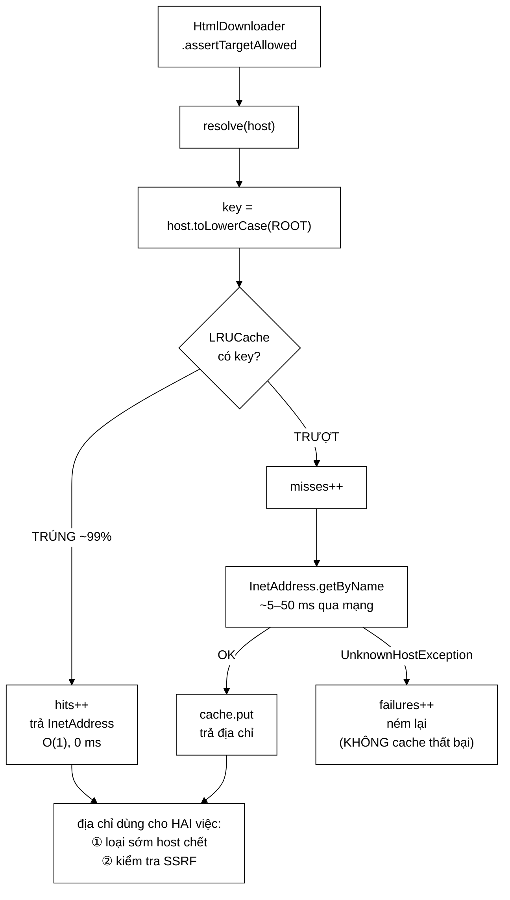

# DnsResolver — tách một việc bị chôn trong JVM ra để đo được

**File nguồn:** `search-engine/src/main/java/com/vnsearch/crawler/DnsResolver.java` (151 dòng)
**Gói:** `com.vnsearch.crawler` · **Loại:** `class` có cache LRU + bộ đếm nguyên tử
**Vị trí trong sơ đồ:** khối **"DNS Resolver"**, đích của mũi tên từ [`HtmlDownloader`](./HtmlDownloader.md)
**Đọc kèm:** [`HtmlDownloader.md`](./HtmlDownloader.md) · [`SeedUrlValidator.md`](./SeedUrlValidator.md) · [`../datastructure/LRUCache.md`](../datastructure/LRUCache.md)

---

## 📌 Hiểu trong 30 giây

Trước đây crawler gọi thẳng `Jsoup.connect(url)`, và việc phân giải tên miền bị
**chôn bên trong tầng mạng của JVM**: không quan sát được, không đo được, không
thay thế được khi test.

Tách ra thành một khối riêng đem về ba lợi ích cụ thể — và lợi ích thứ tư, quan
trọng nhất, chỉ xuất hiện sau: **địa chỉ IP lấy được ở đây là thứ mà
[`HtmlDownloader`](./HtmlDownloader.md) dùng để chặn tấn công SSRF.**



```
   LỢI ÍCH SỐ MỘT: LOẠI SỚM HOST CHẾT

   ── Không hỏi DNS trước ──────────────────────────────────────────
   URL trỏ tới tên miền không tồn tại
        HtmlDownloader thử lần 1 → chờ hết timeout 10 giây
        HtmlDownloader thử lần 2 → chờ hết timeout 10 giây
        HtmlDownloader thử lần 3 → chờ hết timeout 10 giây
        ────────────────────────────────────────────────
        30 GIÂY cho một URL vốn KHÔNG BAO GIỜ tải được

   ── Hỏi DNS trước (đang dùng) ────────────────────────────────────
        resolve(host) → UnknownHostException sau ~5 ms
        HtmlDownloader ném NGAY, không vào vòng thử lại
        ────────────────────────────────────────────────
        5 MILI GIÂY.  Nhanh hơn 6.000 lần.
```

---

## 1. Ba lợi ích của việc tách khối

Javadoc dòng 19–29 liệt kê, và cả ba đều định lượng được:

| Lợi ích | Định lượng |
|---|---|
| **Loại sớm host chết** | 30 giây → 5 ms cho mỗi URL hỏng |
| **Cache theo host** | Crawler bị giới hạn trong `allowedDomains` ⇒ hàng nghìn URL dùng chung vài chục host |
| **Đo được** | `hitRate()` là một số liệu đưa thẳng vào báo cáo |

Lợi ích thứ hai đáng tính ra con số:

```
   Phiên crawl 31.030 trang trên ~50 host phân biệt:

   Không cache:  31.030 lần truy vấn DNS × ~20 ms  =  620 GIÂY (10 phút)
   Có cache:         50 lần                        =  1 giây
                31.030 lần tra bảng LRU × ~0,1 µs  =  0,003 giây
   ─────────────────────────────────────────────────────────────
   Tỷ lệ trúng cache ≈ 49.980 / 50.030  ≈  99,84%
```

> Trên thực tế JVM **cũng** có cache DNS riêng (`networkaddress.cache.ttl`), nên
> lợi ích tốc độ nhỏ hơn con số trên. Nhưng cache đó không đo được, không cấu
> hình được từ code, và không cho ta `InetAddress` để đem đi kiểm tra SSRF —
> đó mới là lý do thật để có lớp này.

---

## 2. Bản đồ lớp

```
DnsResolver
├── DEFAULT_CACHE_SIZE = 1_000
├── cache    : LRUCache<String, InetAddress>   ← CẤU TRÚC TỰ CÀI
├── hits / misses / failures : AtomicLong
│
├── resolve(host)          → InetAddress  throws UnknownHostException
├── resolveHostOf(url)     → InetAddress  ── tiện ích
├── hostOf(url)   static   → String       ── trả null nếu URL méo
├── getCacheHits / getCacheMisses / getResolveFailures / getCachedHostCount
├── hitRate()              → double [0,1]
└── main(String[])         ── demo cho báo cáo
```

### 2.1 Tái sử dụng `LRUCache` — minh chứng cho tính tổng quát

Javadoc dòng 31–34 nêu một ý đáng chú ý với đồ án:

> Cache dùng [`LRUCache`](../datastructure/LRUCache.md) — chính cấu trúc đã viết
> cho cache kết quả tìm kiếm. Đây là **lần thứ hai** nó được dùng trong hệ
> thống, cho một mục đích hoàn toàn khác, nên là một minh chứng tốt rằng cấu
> trúc đó đủ tổng quát.

```
   LRUCache<String, InetAddress>      ← ở đây: host → IP
   LRUCache<String, SearchResponse>   ← ở SearchEngineFacade: truy vấn → kết quả

   Cùng một lớp, hai kiểu tham số, hai bài toán không liên quan.
```

Đây là loại lập luận có trọng lượng trong một đồ án môn cấu trúc dữ liệu: một
cấu trúc tự cài được **dùng lại** ở nơi tác giả không nghĩ tới lúc viết nó, đó
là bằng chứng thiết kế đúng — mạnh hơn nhiều so với việc chỉ nói "tôi đã cài
LRU Cache".

Kích thước 1.000: dư thừa gấp ~20 lần so với ~50 host thực tế. Với mỗi mục tốn
~100 byte, tổng cùng lắm 100 KB — cấp phát rộng rãi là đúng, vì cache đầy sẽ
làm mất chính lợi ích của nó.

### 2.2 **Không** cache kết quả thất bại — dòng 43–46

```java
} catch (UnknownHostException e) {
    failures.incrementAndGet();
    throw e;                      // ← KHÔNG cache.put(key, null)
}
```

Hai lý do, và lý do thứ hai quan trọng hơn:

```
   ① Kỹ thuật: LRUCache không lưu được giá trị null.

   ② Nghiệp vụ: một host tạm thời không phân giải được (mạng chập chờn,
      máy chủ DNS quá tải) KHÔNG NÊN bị loại vĩnh viễn khỏi phiên crawl.

      Cache thất bại:
           mạng chập chờn 10 giây lúc gặp host mới
                → "cand.com.vn không phân giải được" được ghi nhớ
                → cả host đó bị loại khỏi phiên crawl (vài giờ)
                → một sự cố 10 giây làm mất hàng nghìn trang
```

Cùng triết lý với [`RobotsTxtParser`](./RobotsTxtParser.md) mục 4 — **lỗi hạ
tầng thoáng qua không được biến thành quyết định vĩnh viễn**.

Cái giá: một host thật sự chết sẽ bị hỏi DNS lại ở mỗi URL. Nhưng
[`UrlSeenFilter`](./UrlSeenFilter.md) đã chặn trùng URL, và mỗi lần hỏi chỉ tốn
~5 ms, nên cái giá đó nhỏ hơn nhiều so với rủi ro ở trên.

### 2.3 `get` rồi `put` **không nguyên tử** — đánh đổi có chủ ý

Javadoc dòng 36–41 thừa nhận thẳng:

```java
InetAddress cached = cache.get(key);      // ①
if (cached != null) { hits++; return cached; }
misses++;
InetAddress resolved = InetAddress.getByName(key);   // ② CÓ THỂ CHẠY 2 LẦN
cache.put(key, resolved);                 // ③
```

```
   Hai worker cùng gặp host mới:
   Worker A: get → null ─┐
   Worker B: get → null ─┤ cả hai đều trượt
   Worker A: getByName ──┤ hai truy vấn DNS cho CÙNG một host
   Worker B: getByName ──┘
   Worker A: put
   Worker B: put         ← ghi đè bằng giá trị tương đương, vô hại

   Hậu quả xấu nhất: MỘT truy vấn DNS thừa (~20 ms).
```

Vì sao **không** dùng `computeIfAbsent` như
[`RobotsTxtParser`](./RobotsTxtParser.md):

| | `DnsResolver` (đang dùng) | `RobotsTxtParser` |
|---|---|---|
| Cách chống trùng | Không — chấp nhận truy vấn thừa | `computeIfAbsent` |
| Chi phí một lần trượt | ~20 ms | **~200 ms** (tải cả tệp HTTP) |
| Khoá chặn ai | Không ai | Worker khác cùng bucket, tới 5 giây |
| Kết luận | Khoá **đắt hơn** cái nó tiết kiệm | Khoá đáng giá |

Hai lớp trong cùng một gói, cùng bài toán "cache kết quả tải mạng", hai lựa
chọn ngược nhau — và cả hai đều đúng vì chi phí một lần trượt chênh nhau 10 lần.
Đây là kiểu so sánh rất đáng nêu khi bảo vệ: nó cho thấy quyết định được cân
theo số liệu chứ không theo thói quen.

Ngoài ra `LRUCache` **tự nó** thread-safe, nên không có nguy cơ hỏng cấu trúc
dữ liệu — chỉ có khả năng làm việc thừa.

---

## 3. Hướng dẫn về code

### 3.1 Host rỗng cũng tính vào `failures` — dòng 75–81

```java
if (host == null || host.isBlank()) {
    // Tính vào failures luôn: đây là bộ đếm DUY NHẤT cho "URL bị loại
    // vì không phân giải được tên miền". Bỏ sót ca này thì con số trong
    // báo cáo nhỏ hơn thực tế.
    failures.incrementAndGet();
    throw new UnknownHostException("Tên miền rỗng");
}
```

Comment giải thích một quyết định về **tính toàn vẹn của số liệu**, không phải
về logic. Host rỗng (URL méo mà `URI.getHost()` trả `null`) là một ca khác hẳn
"tên miền không tồn tại" về nguyên nhân, nhưng **giống nhau về hệ quả**: URL đó
không tải được.

```
   Nếu không đếm:
        báo cáo ghi "1.203 URL bị loại vì DNS"
        thực tế    "1.847 URL bị loại vì DNS"
        → 644 URL biến mất khỏi mọi bộ đếm
        → tổng số URL vào ≠ tổng số URL ra ở mọi nhánh
        → không kiểm tra được tính nhất quán của báo cáo
```

Nguyên tắc: **mỗi URL bị loại phải được đếm ở đúng một chỗ, và tổng phải khớp.**
Cùng nguyên tắc với bảy bộ đếm của [`UrlFilter`](./UrlFilter.md).

Điều này được nhắc lại ở phía đối diện — Javadoc của
`HtmlDownloader.getFailedCount()` (dòng 243–248) nói rõ nó **không** đếm URL bị
loại vì DNS, vì lớp này đã đếm rồi. Hai lớp phối hợp để mỗi sự kiện xuất hiện
đúng một lần trong báo cáo.

### 3.2 `hostOf` trả `null` thay vì ném — dòng 106–113

```java
public static String hostOf(String url) {
    try {
        return URI.create(url).getHost();
    } catch (Exception e) {
        return null;
    }
}
```

`null` ở đây **hợp lệ** vì nó chảy thẳng vào `resolve(null)` — vốn đã có nhánh
xử lý và đếm đúng. Không cần hai cơ chế báo lỗi cho cùng một tình huống.

`static` vì nó là hàm thuần, dùng được ở nơi khác mà không cần thể hiện.

### 3.3 `toLowerCase(Locale.ROOT)` cho khoá cache — dòng 82

Lần thứ tư trong dự án mà `Locale.ROOT` xuất hiện (sau
[`JsonUserStore`](../auth/JsonUserStore.md),
[`UrlCanonicalizer`](./UrlCanonicalizer.md),
[`ContentSeenFilter`](./ContentSeenFilter.md)). Ở đây nó chặn hai vấn đề:

```
   ① Không có toLowerCase:
      "VnExpress.NET" và "vnexpress.net" thành hai mục cache khác nhau
      → hai truy vấn DNS cho cùng một host, cache phình vô ích

   ② toLowerCase() không có Locale.ROOT, máy đặt tiếng Thổ Nhĩ Kỳ:
      "VIETNAMNET.VN".toLowerCase()  → "vıetnamnet.vn"  (ı không chấm)
      → InetAddress.getByName("vıetnamnet.vn") → UnknownHostException
      → HOST HỢP LỆ bị coi là chết, chỉ vì locale của máy
```

Tên miền theo chuẩn là không phân biệt hoa thường, nên hạ chữ thường là đúng —
nhưng phải hạ theo cách không phụ thuộc ngôn ngữ.

### 3.4 `hitRate()` — chia cho 0 được xử lý

```java
public double hitRate() {
    long total = hits.get() + misses.get();
    return total == 0 ? 0.0 : (double) hits.get() / total;
}
```

Trả `0.0` khi chưa có lượt tra nào, thay vì `NaN`. Quan trọng vì con số này đi
thẳng vào JSON của bảng điều khiển — `NaN` không phải giá trị JSON hợp lệ và sẽ
làm hỏng phản hồi.

> ⚠️ Một điểm nhỏ: `hits.get()` được đọc **hai lần** (một cho `total`, một cho
> tử số). Giữa hai lần đọc, một worker khác có thể tăng bộ đếm, khiến kết quả
> lệch một chút — về lý thuyết có thể ra giá trị > 1. Với một số liệu hiển thị
> thì không đáng lo, nhưng đọc một lần vào biến cục bộ sẽ triệt để hơn.

### 3.5 Cạm bẫy khi sửa lớp này

| Cạm bẫy | Hậu quả | Cách đúng |
|---|---|---|
| Cache kết quả thất bại | Sự cố mạng 10 giây loại cả host khỏi phiên crawl | Giữ nguyên |
| Bỏ `Locale.ROOT` | Host hợp lệ bị coi là chết trên máy locale Thổ | Luôn ghi rõ |
| Không đếm ca host rỗng | Số liệu báo cáo nhỏ hơn thực tế | Giữ `failures++` |
| Thêm `synchronized` cho cặp `get`/`put` | Chặn mọi worker trong lúc chờ mạng — đắt hơn cái nó tiết kiệm | Giữ đánh đổi hiện tại |
| Cache theo IP thay vì theo host | Mất mối liên hệ dùng cho kiểm tra SSRF | Giữ khoá là host |
| Bỏ lớp này, gọi thẳng `InetAddress.getByName` | Mất khả năng đo, mất `InetAddress` cho kiểm tra SSRF | Giữ |
| Trả `NaN` từ `hitRate()` | Hỏng JSON của bảng điều khiển | Giữ nhánh `total == 0` |

### 3.6 `main()` — demo cho báo cáo

```powershell
cd search-engine
.\mvnw.cmd -q compile exec:java "-Dexec.mainClass=com.vnsearch.crawler.DnsResolver"
```

Demo gọi `resolve` hai lần trên cùng host: lần đầu trượt, lần sau trúng — minh
hoạ đúng vai trò cache, và in ra tỷ lệ 50%. Cần mạng để chạy.

---

## 4. Độ phức tạp & chi phí

| Thao tác | Thời gian | Ghi chú |
|---|---|---|
| `resolve` — trúng cache | $O(1)$ ≈ 0,1 µs | **~99,8% số lần gọi** |
| `resolve` — trượt cache | ~5–50 ms (mạng) | ~50 lần trong cả phiên |
| `resolve` — host rỗng | $O(1)$ | Ném ngay |
| `hostOf` | $O(L)$ ≈ 0,8 µs | `URI.create` |
| `hitRate` | $O(1)$ | |
| Bộ nhớ | $O(\min(H, 1000))$ ≈ 5 KB | $H$ = số host phân biệt |

```
   Tổng chi phí trong phiên crawl 31.030 trang:
        trượt:  50 × 20 ms      = 1 giây
        trúng:  31.030 × 0,1 µs = 0,003 giây
        ────────────────────────────────────
        ≈ 1 giây trên tổng 1 giờ 43 phút  ≈ 0,016%

   Cái nó TIẾT KIỆM:
        mỗi URL có host chết:  30 giây → 5 ms
        chỉ cần 100 URL như vậy trong phiên = tiết kiệm 50 PHÚT
```

Bảng này cho thấy giá trị thật của lớp không nằm ở việc cache nhanh, mà ở việc
**cắt sớm nhánh đắt nhất**.

---

## 5. Kiểm thử liên quan

| Test | Bảo vệ điều gì |
|---|---|
| `test/java/com/vnsearch/crawler/SsrfProtectionTest.java` | Địa chỉ phân giải được dùng đúng để chặn mạng nội bộ |
| `test/java/com/vnsearch/datastructure/LRUCacheTest.java` | Tầng dưới |

```powershell
cd search-engine
.\mvnw.cmd -q -Dtest='SsrfProtectionTest,LRUCacheTest' test
```

Lớp này **chưa có test riêng**, và đó là thiếu sót đáng kể vì nó đứng trên đường
bảo mật. Ba kịch bản test được **không cần mạng**:

```java
// 1. Host rỗng / null → ném và ĐẾM
@Test
void hostRongThiNemVaDem() {
    var r = new DnsResolver();
    assertThrows(UnknownHostException.class, () -> r.resolve(null));
    assertThrows(UnknownHostException.class, () -> r.resolve("  "));
    assertEquals(2, r.getResolveFailures());
}

// 2. hostOf với URL méo → null, không ném
@Test
void hostOfUrlMeoTraNull() {
    assertNull(DnsResolver.hostOf("khong-phai-url"));
    assertNull(DnsResolver.hostOf("mailto:a@b.vn"));
    assertEquals("a.vn", DnsResolver.hostOf("https://a.vn/tin"));
}

// 3. hitRate khi chưa có lượt tra nào → 0.0, KHÔNG NaN
@Test
void hitRateBanDauLaKhong() {
    assertEquals(0.0, new DnsResolver().hitRate());
}
```

Kịch bản cần mạng (nên đánh dấu `@Tag("integration")`):

```java
// 4. Trúng cache: gọi hai lần cùng host → hits = 1, misses = 1
// 5. Không cache thất bại: gọi hai lần host chết → misses = 2, failures = 2
```

Kịch bản 5 quan trọng nhất — nó bảo vệ quyết định ở mục 2.2 khỏi bị "tối ưu"
thành cache thất bại.

---

## 6. Liên kết

- Người gọi duy nhất, và nơi `InetAddress` được dùng để chặn SSRF: [`HtmlDownloader.md`](./HtmlDownloader.md)
- Phép kiểm tra địa chỉ nội bộ: [`SeedUrlValidator.md`](./SeedUrlValidator.md)
- Cấu trúc dữ liệu tự cài được dùng lại: [`../datastructure/LRUCache.md`](../datastructure/LRUCache.md)
- Lớp cache anh em với lựa chọn đồng thời ngược lại: [`RobotsTxtParser.md`](./RobotsTxtParser.md)
- Nơi `hitRate` hiện lên bảng điều khiển: [`../analytics/AdminDashboard.md`](../analytics/AdminDashboard.md)
- Nơi lắp ráp: [`CrawlerService.md`](./CrawlerService.md)
- Tổng quan: `docs/ARCHITECTURE.md`, `docs/SECURITY.md`
