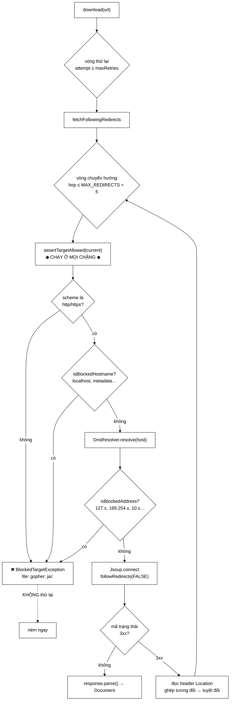

# HtmlDownloader — nơi một lỗ hổng SSRF được vá ở *từng chặng* chuyển hướng

**File nguồn:** `search-engine/src/main/java/com/vnsearch/crawler/HtmlDownloader.java` (257 dòng)
**Gói:** `com.vnsearch.crawler` · **Loại:** `class` không trạng thái (ngoài bộ đếm), chứa `BlockedTargetException`
**Vị trí trong sơ đồ:** khối **"HTML Downloader"**, có mũi tên tới [`DnsResolver`](./DnsResolver.md)
**Đọc kèm:** [`SeedUrlValidator.md`](./SeedUrlValidator.md) · [`DnsResolver.md`](./DnsResolver.md) · [`ContentParser.md`](./ContentParser.md)

---

## 📌 Hiểu trong 30 giây

Tải một trang, trả về cây DOM. Nghe đơn giản — nhưng lớp này chứa **phép vá cho
hai lỗ hổng SSRF** mà một `Jsoup.connect(url).get()` thông thường không có.

Hai lỗ hổng, cùng một nguyên nhân gốc: [`SeedUrlValidator`](./SeedUrlValidator.md)
chỉ kiểm tra URL hạt giống ở `AdminController`, nên **mọi URL đến từ đường
khác** đều không được soi.



```
   HAI ĐƯỜNG VÀO MÀ SeedUrlValidator KHÔNG PHỦ ĐƯỢC

   ── Đường 1: CHUYỂN HƯỚNG ────────────────────────────────────────
   seed: https://trang-cua-toi.com/     ✓ IP công cộng, qua kiểm tra
              │  HTTP 302
              ▼
        http://169.254.169.254/latest/meta-data/iam/
              ↑ Jsoup followRedirects(true) TỰ ĐI THEO
                trước đây KHÔNG ai kiểm tra chặng này

   ── Đường 2: LIÊN KẾT BÓC ĐƯỢC ───────────────────────────────────
   LinkExtractor moi <a href> ra khỏi trang đã tải
        → những URL này KHÔNG đi qua AdminController
        → trước đây chưa từng được kiểm tra lần nào

   ⇒ Cách vá: MỌI URL đều phải qua assertTargetAllowed mới tải được,
     bất kể nó đến từ đâu.
```

---

## 1. Vì sao tắt `followRedirects` của Jsoup

Javadoc dòng 128–143 gọi đây là *"chính lỗ hổng mà hàm này vá"*.

```java
Connection.Response response = Jsoup.connect(current)
        .followRedirects(false)   // ← tự đi, để kiểm tra được từng chặng
        .execute();
```

```
   ── followRedirects(true) — mặc định của Jsoup ───────────────────
   một lời gọi → Jsoup tự đi qua N chặng → trả về trang cuối
        ├─ ta chỉ kiểm tra được URL BAN ĐẦU
        ├─ N-1 chặng còn lại đi qua mà không ai soi
        └─ kẻ tấn công chỉ cần một tên miền công khai trả về 302

   ── followRedirects(false) + tự đi (đang dùng) ───────────────────
   vòng lặp hop = 0…5
        mỗi vòng: assertTargetAllowed(current)  ← MỘT phép kiểm tra
                  rồi mới mở kết nối
        → chặng thứ mười được soi kỹ như chặng đầu
```

Cái giá phải trả: tự xử lý mã 3xx, tự đọc header `Location`, tự ghép URL tương
đối. Khoảng 20 dòng code. Đổi lại là một lỗ hổng bị bịt kín — đánh đổi rõ ràng
có lợi.

### 1.1 Ghép `Location` tương đối — dòng 180–181

```java
// Location có thể là đường dẫn tương đối; phân giải theo URL hiện tại.
current = URI.create(current).resolve(location.trim()).toString();
```

```
   Đang ở:  https://a.vn/tin/bai-1
   Location: /tin-moi              →  https://a.vn/tin-moi        ✓
   Location: bai-2                 →  https://a.vn/tin/bai-2      ✓
   Location: https://b.vn/x        →  https://b.vn/x              ✓
   Location: //cdn.a.vn/y          →  https://cdn.a.vn/y          ✓

   Nếu chỉ dùng thẳng chuỗi Location:
        "/tin-moi" không phải URL hợp lệ → URI.create thành công nhưng
        không có scheme/host → assertTargetAllowed ném "chỉ chấp nhận http/https"
        → mọi chuyển hướng tương đối (RẤT phổ biến) đều thất bại
```

`URI.resolve` làm đúng luật RFC 3986 — cùng công việc mà `absUrl` của Jsoup làm
cho [`LinkExtractor`](./LinkExtractor.md).

### 1.2 `MAX_REDIRECTS = 5` — vì sao phải có trần

Javadoc dòng 46–52:

```
   Không có trần:
        ① Vòng lặp vô hạn: A → B → A → B → …
             hai trang trỏ vòng vào nhau, xảy ra do lỗi cấu hình rất thường
        ② Tấn công tiêu tài nguyên: một chuỗi 10.000 chặng
             mỗi chặng là một lần mở kết nối + một truy vấn DNS
             → một URL duy nhất giữ chân một worker hàng phút

   5 chặng đủ cho MỌI ca thật:
        http → https            (1)
        thêm www                (2)
        đổi đường dẫn cũ → mới  (3)
        chuẩn hoá dấu / cuối    (4)
        → còn dư 1 chặng
```

Nếu vượt trần, ném `IOException` với thông điệp chứa URL gốc (dòng 184) — người
đọc log biết được chuỗi bắt đầu từ đâu, không chỉ kết thúc ở đâu.

---

## 2. `assertTargetAllowed` — ba lớp kiểm tra

```java
private void assertTargetAllowed(String url) throws IOException {
    URI uri = URI.create(url);                                    // ném IOException nếu méo

    String scheme = uri.getScheme();                              // ① SCHEME
    if (scheme == null || !(http || https)) throw new BlockedTargetException(...);

    String host = uri.getHost();                                  // ② TÊN MÁY
    if (SeedUrlValidator.isBlockedHostname(host)) { log.warn(...); throw ...; }

    InetAddress address = dnsResolver.resolve(host);              // ③ ĐỊA CHỈ IP
    if (SeedUrlValidator.isBlockedAddress(address)) { log.warn(...); throw ...; }
}
```

### 2.1 Lớp ① — chặn scheme mà **chuyển hướng** có thể trả về

Comment dòng 205–206 rất chính xác về mối đe doạ:

```
   Chặn cả file:, gopher:, jar: — những scheme mà một redirect có thể
   trả về và thư viện HTTP có thể vô tình phục vụ.

   Location: file:///etc/passwd
   Location: file:///C:/Users/kelly/.ssh/id_rsa
        ↑ nếu tầng dưới phục vụ scheme này → ĐỌC TỆP CỤC BỘ
        ↑ và nội dung đó đi vào chỉ mục, đọc lại được qua /api/search
```

Đây là biến thể **LFI qua redirect** — ít gặp hơn SSRF nhưng cùng chuỗi khai
thác: nội dung tải về vào chỉ mục, rồi đọc ra qua API tìm kiếm.

### 2.2 Lớp ③ — vì sao phải kiểm tra **sau** khi phân giải DNS

Đây là điểm quan trọng nhất, và Javadoc của
[`SeedUrlValidator`](./SeedUrlValidator.md) dòng 30–35 giải thích:

```
   Lọc trên CHUỖI URL là vô dụng:
        kẻ tấn công đăng ký evil.example.com  (tên miền công khai, vô hại)
        trỏ bản ghi A về 127.0.0.1  hoặc  169.254.169.254

        Chuỗi "http://evil.example.com/" không có gì đáng ngờ.
        Nhưng KẾT NỐI thì đi thẳng vào mạng nội bộ.

   ⇒ Phép kiểm tra DUY NHẤT có giá trị: phân giải tên miền, xét ĐỊA CHỈ IP.
```

Và một chi tiết thiết kế đẹp — comment dòng 216–218:

> Địa chỉ lấy được ở đây vừa dùng để loại sớm host chết, vừa là thứ được đem đi
> kiểm tra ngay dưới — **một lần phân giải, hai công dụng**.

```
   resolve(host)  ──┬──→ ném UnknownHostException  → loại sớm host chết (30s → 5ms)
                    └──→ InetAddress               → kiểm tra SSRF

   Không có DnsResolver: phải phân giải HAI lần, hoặc bỏ một trong hai lợi ích.
```

### 2.3 Dùng lại phép kiểm tra, không viết bản thứ hai — dòng 190–192

```java
if (SeedUrlValidator.isBlockedHostname(host)) { ... }
if (SeedUrlValidator.isBlockedAddress(address)) { ... }
```

Javadoc nêu lý do rất đáng nhớ:

> Hai cài đặt song song của cùng một quy tắc bảo mật thì **sớm muộn cũng lệch
> nhau**, và bản bị quên cập nhật chính là lỗ hổng.

```
   Nếu viết bản thứ hai trong HtmlDownloader:
        tháng 3: thêm dải 100.64.0.0/10 vào SeedUrlValidator
        tháng 3: QUÊN thêm vào HtmlDownloader
        → seed bị chặn, nhưng liên kết bóc được thì lọt
        → và không ai phát hiện vì cả hai bản đều "có kiểm tra"
```

Đây là lý do vì sao `isBlockedHostname` và `isBlockedAddress` được để `public
static` trong [`SeedUrlValidator`](./SeedUrlValidator.md) (Javadoc dòng 144–145
ở đó nói rõ: *"Công khai để `HtmlDownloader` dùng lại"*). **Một nguồn sự thật
duy nhất** cho một quy tắc bảo mật.

### 2.4 Hạn chế còn lại: DNS rebinding — được ghi nhận, không bị bỏ sót

Javadoc dòng 150–156 rất thẳng thắn:

```
   t0  DnsResolver.resolve("evil.com")  →  93.184.216.34  (công khai) ✓ QUA
   t1  Jsoup.connect("https://evil.com/")
            └─ Jsoup TỰ PHÂN GIẢI LẦN NỮA lúc mở socket
            └─ nếu bản ghi DNS đã đổi (TTL = 0)  →  127.0.0.1
                                                     ↑ LỌT

   Cửa sổ này HẸP HƠN trước:
        DnsResolver có cache → phần lớn lần tải dùng lại đúng địa chỉ vừa kiểm tra

   Đóng hẳn thì phải:
        ghim IP đã kiểm tra + tự đặt header Host
        → PHÁ SNI của HTTPS (máy chủ không biết phục vụ chứng chỉ nào)
        → tức phải sửa cả tầng tải trang
```

Cách viết này đáng học: nêu rủi ro, nêu cách đóng triệt để, nêu cái giá của cách
đó, rồi kết luận *"ghi nhận là rủi ro còn lại, không phải chỗ bị bỏ sót"*. Trong
một buổi bảo vệ, đây là câu trả lời mạnh hơn nhiều so với im lặng — nó chứng
minh tác giả **biết** giới hạn của mình nằm ở đâu.

> ⚠️ Có một khoảng trống **hẹp hơn nhưng đóng được rẻ**: `DnsResolver.resolve`
> gọi `InetAddress.getByName` — chỉ trả về **bản ghi đầu tiên**. Trong khi
> [`SeedUrlValidator`](./SeedUrlValidator.md) dùng `getAllByName` và kiểm tra
> **mọi** địa chỉ. Một host có hai bản ghi A (một công khai, một `127.0.0.1`)
> sẽ được đường hạt giống chặn nhưng đường này có thể bỏ lọt. Xem đề xuất 1.

---

## 3. Chính sách thử lại — ba loại lỗi, ba cách xử lý

```java
try {
    Document document = fetchFollowingRedirects(url);
    downloaded.incrementAndGet();
    return document;
} catch (BlockedTargetException e) {
    failed.incrementAndGet();
    throw e;                       // ① KHÔNG thử lại
} catch (UnknownHostException e) {
    throw e;                       // ② KHÔNG thử lại, KHÔNG đếm failed
} catch (IOException e) {
    lastError = e;                 // ③ THỬ LẠI
} catch (Exception e) {
    lastError = new IOException(e.getMessage(), e);   // ④ gói lại rồi THỬ LẠI
}
```

| Loại lỗi | Thử lại? | Đếm `failed`? | Lý do |
|---|---|---|---|
| ① `BlockedTargetException` | **Không** | Có | *"Địa chỉ sẽ không tự trở thành công khai"* — và mỗi lần thử lại là thêm một lần chạm vào hạ tầng nội bộ |
| ② `UnknownHostException` | **Không** | **Không** | Host chết; [`DnsResolver.getResolveFailures`](./DnsResolver.md) đã đếm rồi |
| ③ `IOException` khác | Có | Có (sau khi hết lượt) | Timeout, 5xx, ngắt kết nối — đều là lỗi **thoáng qua** |
| ④ Unchecked từ Jsoup | Có | Có | URL sai định dạng, kiểu nội dung không hỗ trợ |

Ba nhận xét về bảng này:

**① là một quyết định bảo mật, không phải hiệu năng.** Comment dòng 104–106 nêu
vế thứ hai: *"mỗi lần thử lại là thêm một lần chạm vào hạ tầng nội bộ"*. Kể cả
khi kết nối bị chặn, việc thử lại vẫn tạo thêm lưu lượng tới địa chỉ nội bộ —
đúng thứ cần tránh.

**② không đếm `failed`** — và Javadoc dòng 243–248 giải thích:

> Không tính các URL bị loại vì DNS: những ca đó chưa từng mở kết nối, và
> `DnsResolver.getResolveFailures()` đã đếm rồi. Đếm ở cả hai nơi thì cùng một
> sự kiện xuất hiện **hai lần** trong báo cáo.

Cùng nguyên tắc toàn vẹn số liệu đã gặp ở [`DnsResolver`](./DnsResolver.md) mục
3.1 và [`UrlFilter`](./UrlFilter.md): **mỗi sự kiện đếm đúng một lần, tổng phải
khớp.**

**④ gói unchecked thành `IOException`** để người gọi chỉ phải bắt một kiểu.
Jsoup ném cả `IllegalArgumentException` (URL méo) lẫn
`UnsupportedMimeTypeException` (tải phải PDF) — bắt sót một trong số đó sẽ giết
luồng worker.

### 3.1 Không có exponential backoff — giới hạn được thừa nhận

Javadoc dòng 29–33:

> Tối đa `DEFAULT_MAX_RETRIES + 1` lần, **không có exponential backoff**.
> Politeness delay 1 giây của [`UrlFrontier`](./frontier/UrlFrontier.md) đã tạo
> một mức giãn tối thiểu giữa hai lần chạm cùng một host, nhưng mức giãn đó
> *không* tăng theo số lần lỗi — đây là điểm còn đơn giản hoá so với crawler
> thực tế.

```
   Máy chủ đang quá tải (trả 503):
   ── Có backoff ───────────────────────────────────────────────────
        thử lại sau 1s → 2s → 4s   giúp máy chủ hồi phục

   ── Không backoff (hiện tại) ─────────────────────────────────────
        thử lại sau ~1s → ~1s      (chỉ nhờ politeness delay của frontier)
        → tiếp tục dội vào một máy chủ đang ốm
        → có thể bị chặn IP
```

Ở quy mô đồ án thì chấp nhận được, nhưng đây là điểm cần nêu khi so với crawler
sản phẩm — xem đề xuất 2.

---

## 4. Hướng dẫn về code

### 4.1 `BlockedTargetException` là **kiểu riêng**, không phải cờ

```java
public static class BlockedTargetException extends IOException {
    public BlockedTargetException(String message) { super(message); }
}
```

Javadoc dòng 226–231 nêu lý do: *"để `download` phân biệt được: lỗi mạng thì
đáng thử lại, còn địa chỉ nội bộ thì thử lại bao nhiêu lần cũng vẫn là địa chỉ
nội bộ."*

```java
// ❌ Nếu dùng IOException thường + kiểm tra thông điệp
if (e.getMessage().contains("bi chan")) { ... }   // mong manh, vỡ khi đổi chữ

// ✅ Kiểu riêng — trình biên dịch và catch block lo
catch (BlockedTargetException e) { ... }
```

Kế thừa `IOException` (không phải `RuntimeException`) để người gọi ngoài cùng
chỉ cần bắt `IOException` nếu không quan tâm phân biệt. Đúng thiết kế: **thông
tin thêm cho ai cần, không bắt buộc ai cũng phải xử lý**.

### 4.2 Thông điệp log **có** chi tiết, ngoại lệ **không** — dòng 212, 221

```java
log.warn("Chan URL tro toi dia chi noi bo: {} -> {}", host, address.getHostAddress());
throw new BlockedTargetException("Dia chi khong duoc phep crawl");
//                                ↑ KHÔNG có IP, KHÔNG có host
```

Cùng nguyên tắc với hằng số `REJECTED` của
[`SeedUrlValidator`](./SeedUrlValidator.md): **chi tiết thật chỉ vào log phía
máy chủ.** Nếu ngoại lệ mang theo địa chỉ IP và nó nổi lên tới phản hồi HTTP,
hệ thống trở thành một **máy quét mạng nội bộ** cho kẻ gọi.

### 4.3 Ba hàm dựng và kiểm tra tham số

```java
if (timeoutMs <= 0)  throw new IllegalArgumentException("timeoutMs phải > 0, nhận được: " + timeoutMs);
if (maxRetries < 0)  throw new IllegalArgumentException("maxRetries phải >= 0, nhận được: " + maxRetries);
```

`maxRetries = 0` **hợp lệ** (tải đúng một lần, không thử lại) nhưng
`timeoutMs = 0` thì không — vì timeout 0 trong Jsoup nghĩa là **chờ vô hạn**,
tức một máy chủ treo sẽ giữ chân một worker mãi mãi. Phân biệt này đúng và tinh
tế.

Thông điệp lỗi kèm giá trị nhận được — cùng phong cách với
[`UrlFilter`](./UrlFilter.md).

### 4.4 `USER_AGENT` — tự khai danh tính

```java
public static final String USER_AGENT = "VnSearchBot/1.0 (+do an DSA; hoc thuat)";
```

Đúng thông lệ crawler lịch sự: nêu tên bot, phiên bản, và mục đích. Chuỗi này
cũng là thứ [`RobotsTxtParser`](./RobotsTxtParser.md) dùng để chọn section trong
`robots.txt` — nên đổi nó sẽ đổi luôn tập luật được áp dụng.

Giả mạo user-agent của trình duyệt (`Mozilla/5.0…`) là điều **không** nên làm:
nó khiến chủ trang không thể chặn bot một cách có chọn lọc, và biến một crawler
học thuật thành một crawler lén lút.

### 4.5 Cạm bẫy khi sửa lớp này

| Cạm bẫy | Hậu quả | Cách đúng |
|---|---|---|
| Bật lại `followRedirects(true)` | Mở lại lỗ hổng SSRF qua chuyển hướng | Giữ `false` + vòng lặp tự đi |
| Bỏ `assertTargetAllowed` khỏi vòng chuyển hướng | Chỉ chặng đầu được kiểm tra | Giữ trong vòng lặp |
| Viết bản kiểm tra riêng thay vì gọi `SeedUrlValidator` | Hai bản lệch nhau, bản quên cập nhật là lỗ hổng | Dùng lại |
| Thử lại `BlockedTargetException` | Thêm lưu lượng tới hạ tầng nội bộ | Giữ ném ngay |
| Đưa IP vào thông điệp ngoại lệ | Biến hệ thống thành máy quét mạng | Chi tiết chỉ vào log |
| Đếm `failed` cho ca DNS | Sự kiện xuất hiện hai lần trong báo cáo | Giữ nguyên |
| `timeoutMs = 0` | Chờ vô hạn, worker treo | Đã có kiểm tra |
| Bỏ `catch (Exception)` cuối | Unchecked từ Jsoup giết luồng worker | Giữ |
| Bóc title/body ngay tại đây | Vi phạm phân công trách nhiệm (dòng 86–88) | Để `ContentParser` |

---

## 5. Độ phức tạp & chi phí

| Thành phần | Chi phí | Ghi chú |
|---|---|---|
| `assertTargetAllowed` — DNS trúng cache | ~2 µs | Hầu hết lần gọi |
| `assertTargetAllowed` — DNS trượt | ~20 ms | ~50 lần/phiên |
| `Jsoup.connect().execute()` | **~150 ms** | Mạng — chi phối tuyệt đối |
| `response.parse()` | ~5 ms | Phân tích HTML thành DOM |
| **Một lần tải thành công** | **~200 ms** | |
| Tải thất bại (hết 3 lượt) | **~30 s** | 3 × timeout 10 s |
| URL bị chặn / host chết | ~2 µs – 20 ms | Không thử lại |

```
   Phiên crawl 31.030 trang, 8 worker song song:
        31.030 × 200 ms / 8  ≈  776 giây  ≈  13 phút thời gian thực

   Nếu 1% URL là host chết (310 URL) và KHÔNG loại sớm:
        310 × 30 s / 8  ≈  1.163 giây  ≈  19 PHÚT thêm
        → chậm hơn GẤP ĐÔI cả phiên crawl, chỉ vì các URL không tải được
   ⇒ Đây là lý do vì sao mũi tên tới DnsResolver tồn tại.
```

Số chặng chuyển hướng nhân thẳng vào chi phí: một URL đi 5 chặng tốn ~5 × 150 ms
= 750 ms và **5 lần** kiểm tra + 5 truy vấn DNS (đều trúng cache sau chặng đầu).
Trần 5 giữ con số này bị chặn trên.

Lớp này **không giữ trạng thái** ngoài ba `AtomicLong`, nên an toàn đa luồng
miễn phí. `DnsResolver` được chia sẻ giữa các worker — đó là điều mong muốn, vì
cache dùng chung mới có ý nghĩa.

---

## 6. Kiểm thử liên quan

| Test | Bảo vệ điều gì |
|---|---|
| `test/java/com/vnsearch/crawler/SsrfProtectionTest.java` | Chặn địa chỉ nội bộ ở cả đường hạt giống và đường tải |
| `test/java/com/vnsearch/crawler/RobotsTxtParserTest.java` | Lớp phối hợp |

```powershell
cd search-engine
.\mvnw.cmd -q -Dtest='SsrfProtectionTest' test
```

Ba nhóm ca kiểm thử cần có:

```
   ① CHẶN THEO TÊN MÁY (không cần mạng)
      http://localhost/x               → BlockedTargetException
      http://metadata.google.internal/ → BlockedTargetException
      http://169.254.169.254/          → BlockedTargetException
      http://abc.localhost/            → BlockedTargetException

   ② CHẶN THEO SCHEME (không cần mạng)
      file:///etc/passwd               → BlockedTargetException
      gopher://a.vn/                   → BlockedTargetException
      ftp://a.vn/tep                   → BlockedTargetException

   ③ KHÔNG THỬ LẠI KHI BỊ CHẶN
      đếm số lần gọi thật → phải đúng 1, không phải 3
```

Ca **quan trọng nhất** lại khó test nhất — chuyển hướng vào mạng nội bộ. Cần một
máy chủ HTTP cục bộ trả 302:

```java
@Test
void chuyenHuongVaoMangNoiBoBiChanODungChangDo() throws Exception {
    // Máy chủ giả (WireMock hoặc com.sun.net.httpserver) trên cổng ngẫu nhiên:
    //   GET /bat-dau  →  302, Location: http://169.254.169.254/latest/meta-data/
    //
    // Lưu ý: chính máy chủ giả cũng nằm trên localhost, nên phải chạy nó
    // trên một địa chỉ được phép, hoặc tiêm một SeedUrlValidator giả cho test.
    assertThrows(HtmlDownloader.BlockedTargetException.class,
                 () -> downloader.download(urlMayChuGia + "/bat-dau"));
}
```

Ghi chú trong khối trên chỉ ra một khó khăn thật của việc test lớp này: phép
kiểm tra bảo mật chặn luôn cả máy chủ giả dùng để test. Cách gỡ là tiêm phép
kiểm tra thành một phụ thuộc — xem đề xuất 3.

---

## 7. Chấm theo chuẩn doanh nghiệp

| Tiêu chí | Điểm | Nhận xét |
|---|---|---|
| Chặn SSRF | 9/10 | Kiểm tra ở **mọi chặng**, mọi nguồn URL; sau phân giải DNS chứ không lọc chuỗi |
| Không lặp lại quy tắc bảo mật | 10/10 | Dùng lại `SeedUrlValidator`, có lý do được ghi lại |
| Tự nhận giới hạn | 10/10 | DNS rebinding: nêu rủi ro, cách đóng, cái giá, rồi kết luận rõ ràng |
| Phân loại lỗi | 10/10 | Ba loại lỗi, ba cách xử lý, mỗi cách có lý do |
| Toàn vẹn số liệu | 10/10 | Phối hợp với `DnsResolver` để không đếm hai lần |
| Không rò thông tin | 10/10 | Chi tiết chỉ vào log; ngoại lệ nói chung chung |
| Chính sách thử lại | 6/10 | Không có exponential backoff — được thừa nhận là đơn giản hoá |
| Khả năng kiểm thử | 6/10 | Phụ thuộc mạng cứng vào `Jsoup.connect`; khó dựng máy chủ giả vì bị chính phép kiểm tra chặn |

**Ba đề xuất nâng lên mức sản phẩm:**

1. **Kiểm tra *mọi* địa chỉ, không chỉ địa chỉ đầu tiên.**
   [`SeedUrlValidator`](./SeedUrlValidator.md) dùng `getAllByName` và duyệt hết;
   đường này qua [`DnsResolver`](./DnsResolver.md) chỉ lấy `getByName` — một
   host có hai bản ghi A (một công khai, một `127.0.0.1`) sẽ bị chặn ở đường hạt
   giống nhưng có thể lọt ở đường liên kết. Đây là **sự lệch nhau giữa hai
   đường** mà chính Javadoc của lớp muốn tránh, chỉ khác là nó nằm ở tầng dưới.
   Sửa: đổi `DnsResolver` trả `InetAddress[]`, kiểm tra hết.

2. **Exponential backoff cho mã 5xx và 429.** Hiện thử lại ngay, dội vào một máy
   chủ đang ốm. Cài tối thiểu: `Thread.sleep(1000 << attempt)` cho các mã đó,
   và tôn trọng header `Retry-After` nếu có. Vừa lịch sự hơn, vừa giảm nguy cơ
   bị chặn IP.

3. **Tiêm phép kiểm tra đích thành một phụ thuộc**
   (`interface TargetPolicy { void assertAllowed(String url) throws IOException; }`).
   Hai lợi ích: test dựng được máy chủ HTTP cục bộ để kiểm tra hành vi chuyển
   hướng (hiện bị chính phép kiểm tra chặn), và chính sách chặn có thể khác nhau
   giữa môi trường phát triển và sản phẩm mà không phải sửa mã. Đây là điều kiện
   để viết được ca kiểm thử quan trọng nhất ở mục 6.

---

## 8. Liên kết

- Nguồn phép kiểm tra được dùng lại: [`SeedUrlValidator.md`](./SeedUrlValidator.md)
- Nơi cung cấp `InetAddress`, và lý do "một lần phân giải, hai công dụng": [`DnsResolver.md`](./DnsResolver.md)
- Bước sau: [`ContentParser.md`](./ContentParser.md) — nơi cây DOM được bóc thành nội dung
- Nguồn `USER_AGENT` dùng để chọn section robots: [`RobotsTxtParser.md`](./RobotsTxtParser.md)
- Nơi tạo giãn cách giữa hai lần chạm cùng host: [`frontier/UrlFrontier.md`](./frontier/UrlFrontier.md)
- Đường thứ hai không qua `AdminController`: [`LinkExtractor.md`](./LinkExtractor.md)
- Nơi lắp ráp: [`CrawlerService.md`](./CrawlerService.md)
- Tổng quan: `docs/SECURITY.md`, `docs/ARCHITECTURE.md`
