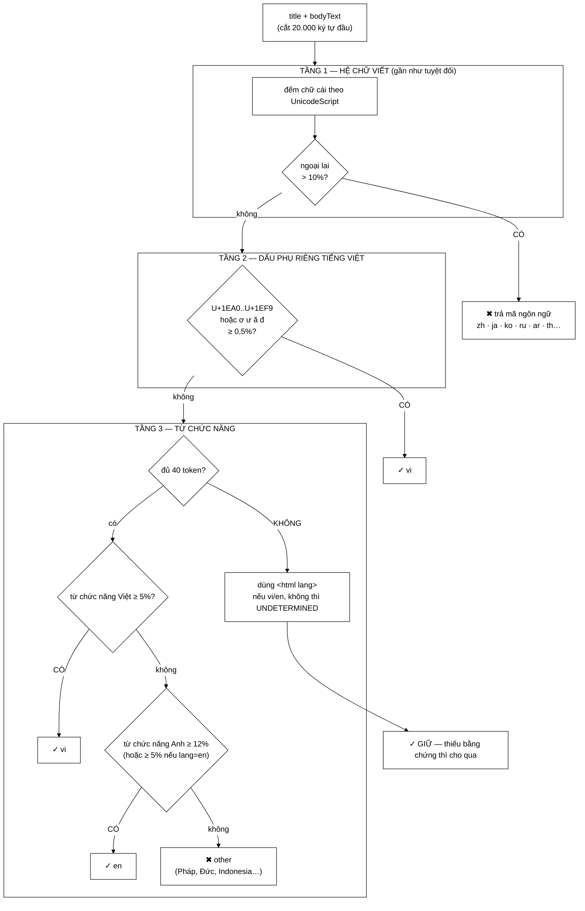

# LanguageFilter — ba tầng bằng chứng, và vì sao `ơ ư ă đ` đáng tin hơn `é à ô`

**File nguồn:** `search-engine/src/main/java/com/vnsearch/crawler/LanguageFilter.java` (370 dòng)
**Gói:** `com.vnsearch.crawler` · **Loại:** `class` có bảng từ bất biến + bộ đếm nguyên tử
**Vị trí trong sơ đồ:** khối **"Language Filter"**, nằm giữa [`ContentParser`](./ContentParser.md) và [`ContentSeenFilter`](./ContentSeenFilter.md)
**Đọc kèm:** [`UrlFilter.md`](./UrlFilter.md) mục 4 · [`ContentParser.md`](./ContentParser.md) · [`../index/VietnameseTokenizer.md`](../index/VietnameseTokenizer.md)

---

## 📌 Hiểu trong 30 giây

[`UrlFilter`](./UrlFilter.md) chặn ngoại ngữ bằng **tiền tố host** (`cn.`, `ja.`,
`ru.`) — rẻ, nhưng chỉ bắt được những bản mà toà soạn tự đặt lên subdomain có
quy ước. Lớp này nhìn **nội dung thật**, tức thứ sẽ thực sự vào chỉ mục.

Cách nhận diện dùng **ba tầng bằng chứng xếp theo độ tin cậy giảm dần**, và mỗi
tầng chỉ chạy khi tầng trên không kết luận được.



```
   ĐIỂM QUAN TRỌNG NHẤT VỀ HIỆU QUẢ

   Trang bị loại KHÔNG được bóc liên kết — giống hệt cách Content Seen? xử lý bản trùng.

   Vì sao: một bài tiếng Trung hầu như CHỈ trỏ sang các bài tiếng Trung khác.

   ── Nếu vẫn nuốt liên kết của nó ─────────────────────────────────
   trang zh #1 → vứt, nhưng nuốt 79 liên kết → toàn trang zh
        → trang zh #2…#80 → vứt, mỗi trang lại nuốt 79 liên kết
             → crawler đi SÂU vào vùng ngoại ngữ
             → tải hàng NGHÌN trang chỉ để vứt

   ── Chặn cả tài liệu lẫn liên kết (đang dùng) ────────────────────
   trang zh #1 → vứt, KHÔNG bóc liên kết → nhánh đó CỤT ngay
```

---

## 1. Ba loại trang mà `UrlFilter` bỏ sót

Javadoc dòng 18–29 liệt kê chính xác:

```
   ① Bài tiếng Trung/Nhật/Hàn nằm LẪN trong đường dẫn tiếng Việt
        nhandan.vn/the-gioi/...   →  dẫn sang bản dịch
        host là "nhandan.vn" — không có tiền tố nào để chặn

   ② Toà soạn đặt bản ngoại ngữ ở ĐƯỜNG DẪN, không ở subdomain
        vietnamplus.vn/zh/...
        vietnamplus.vn/ru/...
        host vẫn sạch → UrlFilter cho qua

   ③ Tiêu đề tiếng Việt nhưng THÂN BÀI là ngôn ngữ khác
        không có manh mối nào ở URL cả
```

Lọc theo **nội dung** bắt được cả ba, vì nó nhìn đúng thứ sẽ vào chỉ mục.

Đây là ví dụ hoàn chỉnh của mẫu **hai tuyến phòng thủ**:

| | [`UrlFilter`](./UrlFilter.md) (tuyến 1) | `LanguageFilter` (tuyến 2) |
|---|---|---|
| Khi nào | **Trước** khi tải | **Sau** khi tải và bóc nội dung |
| Chi phí | ~150 ns | ~500 µs + **một lượt tải trang** |
| Bắt được | Subdomain theo quy ước | Mọi thứ, kể cả ba ca trên |
| Vai trò | Chặn phần lớn với giá gần bằng 0 | Dọn phần còn lại |

Không thể bỏ tuyến nào: bỏ tuyến 1 thì phải tải 2.533 trang rồi mới vứt; bỏ
tuyến 2 thì ba ca trên lọt hết.

---

## 2. Tầng 1 — hệ chữ viết: bằng chứng gần như tuyệt đối

```java
Character.UnicodeScript script = Character.UnicodeScript.of(c);
if (script == LATIN || script == COMMON || script == INHERITED) continue;
foreignLetters++;
```

```
   Chữ Hán, Kana, Hangul, Kirin, Ả Rập, Thái…
        KHÔNG THỂ là tiếng Việt hay tiếng Anh.
        → bằng chứng gần như tuyệt đối
        → và RẺ: một phép tra bảng cho mỗi ký tự
```

### 2.1 Vì sao ngưỡng **10%** chứ không phải 0

Javadoc dòng 44–46 giải thích: *"trang tiếng Việt bình thường vẫn có thể trích
một tên riêng tiếng Hán hay một dòng tiếng Nga."*

```
   Bài tiếng Việt về quan hệ Việt–Trung:
        "...Chủ tịch Tập Cận Bình (习近平) đã..."
        → 3 ký tự Hán trong 5.000 chữ cái = 0,06%
        → ngưỡng 0 thì bài này bị loại nhầm ✗
        → ngưỡng 10% thì được giữ ✓

   Bài tiếng Trung thật:
        → ~95% ký tự là chữ Hán
        → vượt xa 10% ✓
```

Khoảng cách giữa hai ca là rất lớn (0,06% so với 95%), nên ngưỡng 10% nằm ở giữa
một vùng an toàn rộng — không phải một con số phải tinh chỉnh cẩn thận.

### 2.2 `COMMON` và `INHERITED` cũng được bỏ qua

Hai script này là chi tiết dễ bỏ sót:

```
   COMMON     : chữ số 0-9, dấu câu, ký hiệu — dùng chung MỌI ngôn ngữ
   INHERITED  : dấu phụ tổ hợp (combining marks) — kế thừa script của ký tự trước

   Nếu KHÔNG bỏ qua INHERITED:
        "Tiếng Việt" viết ở dạng NFD (tổ hợp):
             "Viê" + U+0323 (dấu nặng tổ hợp)
        → dấu nặng bị tính là "chữ ngoại lai"
        → trang tiếng Việt bị loại nhầm hàng loạt

   ⇒ Đây là ca chỉ xuất hiện khi văn bản không được chuẩn hoá NFC —
     và HTML thật thì có cả hai dạng.
```

### 2.3 Tối ưu: bỏ qua tra bảng cho ký tự tiếng Việt

```java
if ((c >= 'Ạ' && c <= 'ỹ') || VIETNAMESE_ONLY_CHARS.contains(c)) {
    vietnameseMarks++;
    continue; // chắc chắn là chữ Latinh, khỏi tra bảng script
}
```

`Character.UnicodeScript.of(c)` là phép tra bảng nhị phân trên bảng script của
Unicode — không đắt, nhưng chạy cho **mọi ký tự của mọi trang**. Với văn bản
tiếng Việt (chiếm phần lớn corpus), phép so sánh khoảng `>= 'Ạ' && <= 'ỹ'` là
hai phép so sánh số nguyên, nhanh hơn hẳn.

Hai công dụng trong một nhánh: vừa đếm `vietnameseMarks` cho tầng 2, vừa bỏ qua
tra bảng. Đây là loại tối ưu đúng chỗ — nằm trên vòng lặp chạy 20.000 lần mỗi
trang × 31.030 trang.

### 2.4 `SCRIPT_LANGUAGE` — để **thống kê đọc được**

```java
private static final Map<Character.UnicodeScript, String> SCRIPT_LANGUAGE =
        new EnumMap<>(Map.of(HAN, "zh", HIRAGANA, "ja", KATAKANA, "ja",
                HANGUL, "ko", CYRILLIC, "ru", ARABIC, "ar", THAI, "th",
                DEVANAGARI, "hi", HEBREW, "he", GREEK, "el"));
```

Không cần thiết cho việc **chặn** (chặn chỉ cần biết "không phải vi/en"), nhưng
cần cho việc **báo cáo**:

```
   Không có bảng ánh xạ:
        rejectedByLanguage = { "han": 2.533, "cyrillic": 411, "hangul": 89 }
        → tên script, không phải tên ngôn ngữ

   Có bảng:
        rejectedByLanguage = { "zh": 2.533, "ru": 411, "ko": 89 }
        → đọc được, đưa thẳng vào báo cáo
```

`EnumMap` thay vì `HashMap`: khoá là enum nên `EnumMap` dùng một mảng theo
`ordinal()`, tra cứu $O(1)$ không băm và tốn ít bộ nhớ hơn.

Với script không có trong bảng, dùng `script.name().toLowerCase()` làm mã dự
phòng — nên một trang chữ Armenia sẽ hiện là `"armenian"` thay vì biến mất khỏi
thống kê.

**HIRAGANA và KATAKANA cùng ánh xạ về `"ja"`** — đúng, vì tiếng Nhật dùng cả hai
(và cả HAN). Một bài tiếng Nhật sẽ có ký tự thuộc ba script, nhưng gộp hai kana
lại giúp `"ja"` thắng `"zh"` trong phép `max` ở dòng 257–260 khi bài đó nhiều
kana hơn kanji.

---

## 3. Tầng 2 — dấu phụ riêng tiếng Việt: phần tinh tế nhất

```java
private static final Set<Character> VIETNAMESE_ONLY_CHARS = Set.of(
        'ơ', 'ư', 'ă', 'đ', 'Ơ', 'Ư', 'Ă', 'Đ');
```

Javadoc dòng 121–123 nêu chính xác **những gì cố ý không có**:

```
   ── KHÔNG có: â ê ô é à á ─────────────────────────────────────────
   Tiếng Pháp:      "à", "é", "ê", "ô"    →  très, école, être, hôtel
   Tiếng Bồ:        "á", "ã", "ô"         →  não, você, avô
   Tiếng Tây Ban Nha: "á", "é", "ó"       →  también, está

   Đưa chúng vào → bài tiếng Pháp bị NHẬN NHẦM là tiếng Việt
        và tiếng Pháp là ngôn ngữ RẤT phổ biến trên web Việt Nam
        (báo song ngữ, tài liệu lịch sử, trích dẫn)

   ── CÓ: ơ ư ă đ ──────────────────────────────────────────────────
   Gần như CHỈ tiếng Việt dùng.
   ('đ' cũng có trong tiếng Croatia — nhưng crawler này không đi tới đó,
    và Javadoc ghi nhận điều đó thay vì im lặng)
```

Cộng thêm khối `U+1EA0..U+1EF9` (kiểm tra bằng `c >= 'Ạ' && c <= 'ỹ'`) — đây là
khối Unicode **Latin Extended Additional** chứa các nguyên âm tiếng Việt có hai
dấu (`ạ ậ ặ ẹ ệ ị ọ ộ ợ ụ ự ỵ` và các biến thể). Không ngôn ngữ nào khác dùng
khối này với mật độ đáng kể.

### 3.1 Vì sao ngưỡng chỉ **0,5%**

```
   Câu tiếng Việt điển hình:
        "Đội tuyển Việt Nam giành chiến thắng trong trận đấu tối qua"
         ↑         ↑ệ                          ↑ậ

        ~48 chữ cái, ~3 ký tự thuộc khối đặc trưng = 6,25%
        → cao hơn ngưỡng 0,5% GẤP 12 LẦN

   Tiếng Pháp/Anh/Đức: 0% — không có ký tự nào thuộc khối này

   ⇒ Ngưỡng 0,5% rất thấp nhưng khoảng cách giữa hai bên là TUYỆT ĐỐI (6% vs 0%),
     nên nó chỉ cần đủ để chịu được nhiễu (một từ tiếng Việt lọt vào bài tiếng Anh).
```

Javadoc dòng 47–51 kết luận: *"Dùng chúng làm dấu hiệu nhận tiếng Việt cho kết
quả chắc chắn hơn nhiều so với đếm từ chức năng."* — đúng, và đó là lý do tầng
này đứng **trước** tầng 3.

> ⚠️ **Điểm yếu đã biết:** văn bản tiếng Việt **không dấu** (khá phổ biến trong
> bình luận, tiêu đề cũ, một số trang lỗi mã hoá) sẽ trượt tầng 2 và rơi xuống
> tầng 3. Ở đó nó cũng không khớp từ chức năng tiếng Việt (vốn chọn từ **có
> dấu**), nên kết quả là `OTHER_LATIN` → **bị loại**. Xem đề xuất 2.

---

## 4. Tầng 3 — từ chức năng: phân biệt tiếng Anh với các thứ tiếng Latinh khác

### 4.1 Chọn từ chức năng có kỷ luật

**Tiếng Việt** (dòng 129–131): *"Chọn những từ **có dấu** là chính, vì từ không
dấu (`co`, `cho`, `ra`) trùng với chuỗi ký tự của nhiều thứ tiếng khác."*

```
   "cho"  →  tiếng Việt: "cho"     |  tiếng Tây Ban Nha: có trong "chocolate"…
   "co"   →  tiếng Việt: "có"      |  tiếng Anh: "company", tiếng Ý: "co"
   "la"   →  tiếng Việt: "là"      |  tiếng Pháp/TBN: mạo từ RẤT phổ biến

   ⇒ Bảng ưu tiên "của", "và", "được", "những", "đã" — có dấu, không trùng.
```

**Tiếng Anh** (dòng 142–144): cố ý **loại** `a`, `an`, `no`, `en`, `de`.

```
   "a"   →  tiếng Anh (mạo từ)  |  tiếng Pháp/TBN/Bồ: động từ/giới từ RẤT phổ biến
   "de"  →  không có trong tiếng Anh  |  tiếng Pháp/TBN/Bồ: giới từ phổ biến NHẤT
   "en"  →  không có trong tiếng Anh  |  tiếng Pháp/TBN: giới từ phổ biến
   "no"  →  tiếng Anh  |  tiếng TBN: phủ định phổ biến nhất

   Giữ lại → điểm tiếng Anh của bài tiếng Pháp/TBN VƯỢT ngưỡng
           → bài tiếng Pháp bị nhận nhầm thành tiếng Anh → lọt vào corpus
```

Đây là loại quyết định chỉ có được sau khi **thử và thấy sai**. Việc nó được
ghi lại trong Javadoc khiến người bảo trì sau không "sửa" lại thành sai.

### 4.2 Ngưỡng 12% cho tiếng Anh — và vì sao cao hơn tiếng Việt (5%)

```
   Javadoc dòng 52–56:
        văn bản tiếng Anh THẬT có 25–40% token nằm trong bảng từ chức năng
        các thứ tiếng khác hiếm khi vượt 12%

   Vì sao ngưỡng tiếng Anh (12%) CAO HƠN tiếng Việt (5%)?

   ── Tiếng Việt ──────────────────────────────────────────────────
   tầng 2 (dấu phụ) đã bắt gần hết bài tiếng Việt rồi
        → tầng 3 chỉ còn xử lý ca hiếm → ngưỡng thấp là an toàn
        → và bảng từ tiếng Việt gồm từ CÓ DẤU, gần như không trùng ngôn ngữ khác

   ── Tiếng Anh ───────────────────────────────────────────────────
   phải phân biệt với Pháp/Đức/Indonesia/TBN — đều dùng chữ Latinh trần
        → nhiều từ chức năng trùng chuỗi ký tự ("in", "to", "at" có trong tiếng Đức/Hà Lan)
        → cần ngưỡng cao hơn để tránh dương tính giả
```

### 4.3 Ngưỡng nới khi có gợi ý `<html lang>` — dòng 109–113

```java
if (englishRatio >= ENGLISH_WORD_THRESHOLD                           // 12%
        || (ENGLISH.equals(hint) && englishRatio >= ENGLISH_WORD_THRESHOLD_WITH_HINT)) {  // 5%
    return ENGLISH;
}
```

> *"Hai bằng chứng yếu độc lập cộng lại đủ mạnh."*

```
   Bài tiếng Anh ngắn, nhiều thuật ngữ chuyên ngành:
        "Quantum entanglement enables secure key distribution protocols…"
        → tỷ lệ từ chức năng chỉ ~8% (thấp, vì nhiều danh từ chuyên môn)
        → dưới ngưỡng 12% → sẽ bị loại nhầm ✗

   Nhưng <html lang="en">:
        → hai bằng chứng YẾU (8% từ chức năng + khai báo lang)
        → cộng lại đủ mạnh → giữ ✓
```

Cách dùng `<html lang>` ở đây rất đúng mực: **không** tin nó một mình (Javadoc
dòng 59–63 nói rõ vì sao), nhưng dùng nó để **hạ ngưỡng** cho một bằng chứng
độc lập khác. Đây là suy luận Bayes ở dạng đơn giản nhất.

---

## 5. Nguyên tắc bao trùm: thiếu bằng chứng thì **CHO QUA**

Javadoc dòng 65–69 — đây là quyết định định hình toàn bộ lớp:

```java
if (total < MIN_TOKENS_FOR_CONTENT_EVIDENCE) {      // < 40 token
    return isViOrEn(hint) ? hint : UNDETERMINED;    // → được GIỮ
}
```

> Trang chỉ có menu và vài chữ (trang chuyên mục, trang phân trang) không đủ dữ
> liệu để kết luận — mà đó lại chính là **những trang cung cấp nhiều liên kết
> nhất**. Vứt nhầm chúng làm **cụt cả một nhánh của đồ thị crawl**, trong khi
> giữ nhầm chỉ tốn một bản ghi gần như rỗng.

```
   HAI LOẠI SAI, KHÔNG CÂN XỨNG

   Giữ nhầm một trang ngắn ngoại ngữ
        → một bản ghi ~200 ký tự trong chỉ mục.  Gần như vô hại.

   Vứt nhầm một trang chuyên mục tiếng Việt
        → KHÔNG bóc liên kết của nó
        → mất TOÀN BỘ nhánh con phía sau — có thể hàng trăm bài
        → và không có gì báo cho ta biết điều đó đã xảy ra

   ⇒ Nghiêng về phía GIỮ.
```

Đây là lần thứ tư nguyên tắc "hai loại sai không cân xứng" xuất hiện trong gói
`crawler` (sau [`UrlStorage`](./UrlStorage.md),
[`UrlFilter`](./UrlFilter.md) mục 4.4, [`ContentSeenFilter`](./ContentSeenFilter.md)
mục 2.3). Tính nhất quán này là một điểm mạnh đáng nêu khi bảo vệ: nó cho thấy
dự án có **một triết lý xử lý sự không chắc chắn**, không phải bốn quyết định
rời rạc.

`UNDETERMINED` được **đếm riêng** (`acceptedUndeterminedCount`) chứ không gộp
vào `vi`/`en` — nên tỷ lệ trang "cho qua vì không kết luận được" là một chỉ số
theo dõi được. Nếu nó tăng bất thường, đó là tín hiệu
[`ContentParser`](./ContentParser.md) đang bóc thân bài kém.

---

## 6. Hướng dẫn về code

### 6.1 Ghép **tiêu đề** với thân bài — dòng 190–193

```java
String text = (doc.getTitle() == null ? "" : doc.getTitle() + " ")
        + (doc.getBodyText() == null ? "" : doc.getBodyText());
```

> Trang danh mục có thân bài rất ngắn, tiêu đề khi đó là phần văn bản **đáng
> tin duy nhất**.

Chi tiết nhỏ nhưng quan trọng: tiêu đề là phần do biên tập viên viết, luôn đúng
ngôn ngữ của trang. Thân bài của trang danh mục thì chủ yếu là menu và tên
chuyên mục — ít token, nhiều nhiễu.

Dấu cách sau tiêu đề là bắt buộc: không có nó, từ cuối tiêu đề dính vào từ đầu
thân bài thành một token rác.

### 6.2 **Luôn** ghi nhãn ngôn ngữ, kể cả khi loại — dòng 179–181

```java
String language = detect(doc.getLanguage(), text);
doc.setLanguage(language);          // ← ghi TRƯỚC khi quyết định giữ hay vứt
```

> Tài liệu được giữ thì mang theo nhãn dùng được về sau: lọc kết quả theo ngôn
> ngữ, **chọn bộ tách từ đúng** cho tiếng Anh và tiếng Việt.

Vế cuối là điểm nối quan trọng với tầng chỉ mục:

```
   doc.language = "vi"  →  VietnameseTokenizer (ghép âm tiết thành từ ghép)
   doc.language = "en"  →  tách theo khoảng trắng là đủ

   Dùng nhầm bộ tách từ:
        "international relations" qua VietnameseTokenizer
             → thử ghép "international_relations" thành từ ghép tiếng Việt
             → không có trong từ điển → vẫn tách đúng, nhưng tốn công vô ích
```

Trường này **ghi đè** giá trị mà [`ContentParser`](./ContentParser.md) đặt từ
`<html lang>` — đúng như Javadoc bên đó đã báo trước.

### 6.3 `normalizeLanguageTag` — `public static`, dùng chung

```java
public static String normalizeLanguageTag(String tag) {
    // "en-US" → "en" ;  "vi_VN" → "vi" ;  null/"" → ""
}
```

`public static` vì [`ContentParser`](./ContentParser.md) gọi nó (dòng 69 bên đó)
để chuẩn hoá giá trị `<html lang>` ngay lúc bóc. Một nguồn sự thật duy nhất cho
việc chuẩn hoá thẻ ngôn ngữ — cùng khuôn với
`SeedUrlValidator.isBlockedAddress` được [`HtmlDownloader`](./HtmlDownloader.md)
dùng lại.

Xử lý cả `-` (chuẩn BCP 47: `en-US`) lẫn `_` (kiểu Java `Locale`: `vi_VN`) vì
HTML thật có cả hai. `indexOf > 0` chứ không `>= 0`: một thẻ bắt đầu bằng `-`
là rác, không nên biến thành chuỗi rỗng một cách im lặng.

### 6.4 `SAMPLE_LIMIT = 20.000` — trần trên đường nóng

Javadoc dòng 89–93:

> Một bài báo dài 40.000 ký tự không cho biết gì thêm về ngôn ngữ so với 20.000
> ký tự đầu, trong khi phần thừa **nhân đôi chi phí trên đường đi nóng** của
> crawler — khối này chạy cho **mọi** trang tải về.

Kết quả: độ phức tạp trở thành **$O(1)$ theo độ dài bài**, không phải $O(T)$.
Một trang lưu trữ 5 MB tốn đúng bằng một bài 20 KB.

### 6.5 Cạm bẫy khi sửa lớp này

| Cạm bẫy | Hậu quả | Cách đúng |
|---|---|---|
| Thêm `â ê ô é à` vào `VIETNAMESE_ONLY_CHARS` | Bài tiếng Pháp nhận nhầm thành tiếng Việt | Giữ đúng 8 ký tự |
| Thêm `a`, `de`, `en`, `no` vào bảng tiếng Anh | Bài Pháp/TBN nhận nhầm thành tiếng Anh | Giữ danh sách đã lọc |
| Hạ `MIN_TOKENS_FOR_CONTENT_EVIDENCE` xuống rất thấp | Vứt nhầm trang chuyên mục → **cụt cả nhánh crawl** | Giữ 40 |
| Đổi "thiếu bằng chứng thì cho qua" thành "thì vứt" | Mất phần lớn liên kết của site | Giữ nguyên |
| Bỏ `COMMON`/`INHERITED` khỏi nhánh bỏ qua | Dấu phụ tổ hợp bị tính là chữ ngoại lai → loại nhầm trang tiếng Việt NFD | Giữ cả ba |
| Đặt ngưỡng hệ chữ = 0 | Bài tiếng Việt trích một tên riêng chữ Hán bị loại | Giữ 10% |
| Cho phép bóc liên kết của trang bị loại | Crawler đi sâu vào vùng ngoại ngữ | Giữ chặn cả hai |
| Bỏ `SAMPLE_LIMIT` | Chi phí tỷ lệ với độ dài bài trên đường nóng | Giữ trần |
| Tin `<html lang>` một mình | Sai với phần lớn trang | Chỉ dùng làm phương án cuối / hạ ngưỡng |

### 6.6 `main()` — demo cho báo cáo

```powershell
cd search-engine
.\mvnw.cmd -q compile exec:java "-Dexec.mainClass=com.vnsearch.crawler.LanguageFilter"
```

Demo chọn rất khéo: bốn đoạn văn bản thật (Việt / Anh / Trung / **Pháp**) cộng
một trang ngắn. Đoạn tiếng Pháp là ca khó nhất — nó chứng minh bảng từ chức năng
đã được lọc đúng, chứ không chỉ chứng minh "chữ Hán khác chữ Latinh".

---

## 7. Độ phức tạp & chi phí

Gọi $T$ = độ dài văn bản (kẹp ở 20.000), $W$ = số token.

| Bước | Thời gian |
|---|---|
| Tầng 1 — quét ký tự | $O(T)$ ≈ 200 µs |
| Tầng 2 — đã đếm trong tầng 1 | $O(1)$ |
| Tầng 3 — `toLowerCase` + `split` regex | $O(T)$ ≈ 250 µs |
| Tầng 3 — tra bảng từ | $O(W)$ ≈ 30 µs |
| **Tổng** | **≈ 500 µs, chặn trên bởi `SAMPLE_LIMIT`** |

```
   LanguageFilter     ~     500 µs
   ContentParser      ~   3.000 µs
   Tải trang          ~ 200.000 µs
   ⇒ nhận diện ngôn ngữ ≈ 0,25% thời gian xử lý một trang

   Cái nó TIẾT KIỆM:
        chặn một trang zh → chặn luôn ~79 liên kết toàn trang zh
        → theo cấp số nhân: nhánh đó cụt hoàn toàn
```

**Tối ưu ngắn mạch có tác dụng thật:** phần lớn trang là tiếng Việt, và chúng
kết thúc ở **tầng 2** — không bao giờ chạy tới `split` regex của tầng 3 (bước
đắt nhất). Xếp tầng theo độ tin cậy tình cờ cũng xếp đúng theo chi phí.

Bộ nhớ: `foreignByLanguage` (`HashMap` nhỏ, thường rỗng) + mảng `tokens` từ
`split` ($O(W)$, ~3.000 chuỗi cho một bài dài). Mảng token là phần cấp phát lớn
nhất — chỉ tồn tại khi tầng 3 chạy.

---

## 8. Kiểm thử liên quan

| Test | Bảo vệ điều gì |
|---|---|
| `test/java/com/vnsearch/crawler/LanguageFilterTest.java` | Ba tầng; các ca biên; bảng từ đã lọc |
| `test/java/com/vnsearch/crawler/ContentParserTest.java` | Nguồn `declaredLang` |
| `test/java/com/vnsearch/crawler/UrlFilterTest.java` | Tuyến phòng thủ thứ nhất |

```powershell
cd search-engine
.\mvnw.cmd -q -Dtest='LanguageFilterTest' test
```

Bảng ca kiểm thử cốt lõi:

```
   VĂN BẢN                                              KẾT QUẢ    TẦNG QUYẾT ĐỊNH
   ────────────────────────────────────────────────     ───────    ───────────────
   Đoạn tiếng Việt dài, có dấu                          vi         2
   Đoạn tiếng Việt trích một tên riêng chữ Hán (<10%)   vi         2
   Đoạn tiếng Anh dài, nhiều từ chức năng               en         3
   Đoạn tiếng Anh chuyên ngành + lang="en"              en         3 (ngưỡng nới)
   Đoạn tiếng Trung                                     zh         1
   Đoạn tiếng Nhật (kana + kanji)                       ja         1
   Đoạn tiếng Nga                                       ru         1
   ── CA KHÓ NHẤT ──────────────────────────────────────────────────────────────
   Đoạn tiếng PHÁP dài  (có é à ô)                      other      3  ← bảng từ đã lọc
   Đoạn tiếng TÂY BAN NHA dài                           other      3
   Đoạn tiếng ĐỨC dài                                   other      3
   ── CA BIÊN ──────────────────────────────────────────────────────────────────
   "Trang chủ"  (2 token) + lang="en"                   en         3 (rơi về hint)
   "Trang chủ"  (2 token), không lang                   und        3 (CHO QUA)
   ""  /  null                                          und        —
   Chuỗi chỉ có số và dấu câu (letters == 0)            und        1
   Tiếng Việt dạng NFD (dấu tổ hợp)                     vi         2  ← INHERITED
```

Bốn ca "ngôn ngữ Latinh khác" là **quan trọng nhất**: chúng bảo vệ hai quyết
định lọc bảng từ (mục 4.1). Nếu ai đó thêm `"a"` vào bảng tiếng Anh, ca tiếng
Pháp sẽ chuyển từ `other` sang `en` và test đỏ ngay.

Ca NFD cũng đáng có — nó bảo vệ nhánh `INHERITED` mà nhìn qua trông thừa.

Kịch bản chưa có test và nên có:

```java
@Test
void trangBiLoaiVanDuocGanNhanNgonNgu() {
    var doc = new WebDocument();
    doc.setBodyText("越南国会常务委员会会议提交国会审议…");
    assertFalse(filter.accept(doc));
    assertEquals("zh", doc.getLanguage());   // ← nhãn vẫn được ghi
    assertEquals(1L, filter.getRejectedByLanguage().get("zh"));
}
```

---

## 9. Chấm theo chuẩn doanh nghiệp

| Tiêu chí | Điểm | Nhận xét |
|---|---|---|
| Thiết kế thuật toán | 10/10 | Ba tầng xếp theo độ tin cậy — và tình cờ cũng đúng theo chi phí |
| Chọn đặc trưng | 10/10 | Phân biệt `ơ ư ă đ` với `é à ô` là hiểu biết ngôn ngữ học thật, không phải đoán |
| Chống dương tính giả | 10/10 | Bảng từ tiếng Anh lọc bỏ `a`/`de`/`en`/`no` — quyết định chỉ có sau khi thử và thấy sai |
| Xử lý sự không chắc chắn | 10/10 | "Thiếu bằng chứng thì cho qua", có lý do định lượng về hậu quả |
| Hiệu năng | 10/10 | `SAMPLE_LIMIT` biến $O(T)$ thành $O(1)$; ngắn mạch tránh bước đắt nhất cho phần lớn trang |
| Quan sát được | 10/10 | Bốn bộ đếm + bảng theo từng ngôn ngữ, sắp giảm dần, sẵn cho báo cáo |
| Xử lý Unicode | 9/10 | `COMMON`/`INHERITED` cho thấy hiểu Unicode ở mức thật |
| Đầy đủ | 7/10 | Tiếng Việt **không dấu** bị loại nhầm; ngưỡng đóng cứng trong mã |

**Ba đề xuất nâng lên mức sản phẩm:**

1. **Xử lý tiếng Việt không dấu.** Đây là lỗ hổng thật và duy nhất đáng kể:
   văn bản tiếng Việt không dấu trượt tầng 2 (không có dấu phụ) và trượt tầng 3
   (bảng từ chọn từ **có dấu**), nên bị gán `OTHER_LATIN` và **loại**. Cách sửa
   rẻ: thêm một bảng từ chức năng tiếng Việt **không dấu** (`cua`, `nhung`,
   `duoc`, `nguoi`) với ngưỡng **cao hơn** (~15%) để tránh trùng với các ngôn
   ngữ khác — chạy như tầng 3b, chỉ khi tầng 3 sắp trả `OTHER_LATIN`.

2. **Đưa các ngưỡng ra cấu hình.** Sáu hằng số (`FOREIGN_SCRIPT_THRESHOLD`,
   `VIETNAMESE_DIACRITIC_THRESHOLD`, hai ngưỡng tiếng Anh,
   `MIN_TOKENS_FOR_CONTENT_EVIDENCE`, `SAMPLE_LIMIT`) là **chính sách corpus**,
   không phải hằng số thuật toán. Đưa vào [`CrawlConfig`](./CrawlConfig.md) cho
   phép tinh chỉnh theo tập hạt giống mà không dịch lại — và quan trọng hơn, làm
   cho chính sách đó hiện ra trong tệp cấu hình thay vì chôn trong mã.

3. **Bộ dữ liệu đánh giá có nhãn.** Hiện độ chính xác của lớp này chưa được đo:
   ta biết nó *hoạt động* nhưng không biết nó *đúng bao nhiêu phần trăm*. Một
   tệp ~200 đoạn văn bản có nhãn (mỗi ngôn ngữ 20 đoạn, lấy từ chính corpus đã
   crawl) cho phép tính ma trận nhầm lẫn và tinh chỉnh ngưỡng bằng số liệu.
   Với một đồ án tốt nghiệp, đây là phần biến "tôi cài một bộ nhận diện ngôn
   ngữ" thành "bộ nhận diện của tôi đạt độ chính xác 97,3% trên tập kiểm thử" —
   khác biệt lớn về sức thuyết phục.

---

## 10. Liên kết

- Tuyến phòng thủ thứ nhất (rẻ hơn, chặn trước khi tải): [`UrlFilter.md`](./UrlFilter.md) mục 4
- Nguồn `declaredLang`, và lý do không tin nó: [`ContentParser.md`](./ContentParser.md) mục 3.3
- Bước sau: [`ContentSeenFilter.md`](./ContentSeenFilter.md) → [`LinkExtractor.md`](./LinkExtractor.md)
- Nơi nhãn ngôn ngữ được dùng để chọn bộ tách từ: [`../index/VietnameseTokenizer.md`](../index/VietnameseTokenizer.md)
- Vì sao chữ Hán làm hỏng chỉ mục: [`UrlFilter.md`](./UrlFilter.md) mục 4.2
- Kiểu dữ liệu mang nhãn: [`../model/WebDocument.md`](../model/WebDocument.md)
- Nơi lắp ráp: [`CrawlerService.md`](./CrawlerService.md)
- Tổng quan: `docs/ARCHITECTURE.md`, `docs/EVALUATION.md`
