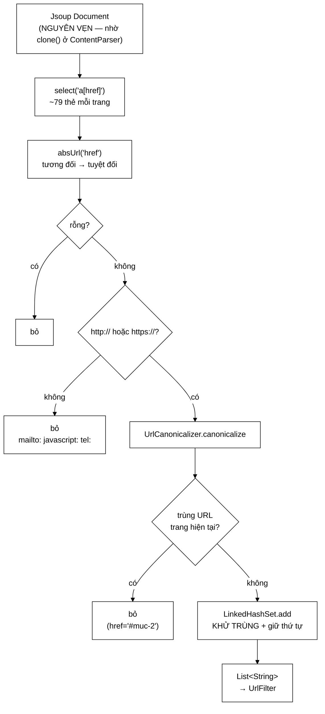

# LinkExtractor — nguồn duy nhất sinh ra URL mới cho cả crawler

**File nguồn:** `search-engine/src/main/java/com/vnsearch/crawler/LinkExtractor.java` (65 dòng)
**Gói:** `com.vnsearch.crawler` · **Loại:** `class` không trạng thái, một hàm công khai
**Vị trí trong sơ đồ:** khối **"Link Extractor"**, chạy **sau** [`ContentSeenFilter`](./ContentSeenFilter.md), trước [`UrlFilter`](./UrlFilter.md)
**Đọc kèm:** [`ContentParser.md`](./ContentParser.md) · [`UrlCanonicalizer.md`](./UrlCanonicalizer.md) · [`UrlFilter.md`](./UrlFilter.md)

---

## 📌 Hiểu trong 30 giây

65 dòng, một vòng lặp — nhưng đây là **nguồn duy nhất sinh ra URL mới** cho cả
vòng lặp crawl. Không có lớp này, crawler chỉ tải đúng những hạt giống rồi dừng.

Ba phép lọc được áp dụng ngay tại đây, và tiêu chí để một phép lọc *thuộc về*
lớp này rất rõ: **rẻ, và không cần biết gì về cấu hình phiên crawl**.



```
   RANH GIỚI: PHÉP LỌC NÀO THUỘC VỀ ĐÂU

   ── LinkExtractor (lớp này) ──────────────────────────────────────
   Điều kiện: RẺ  +  KHÔNG cần biết cấu hình phiên crawl
        ✓ bỏ mailto:/javascript:   — luôn đúng, không cấu hình gì
        ✓ khử trùng trong một trang — luôn đúng
        ✓ bỏ tự trỏ về chính mình  — luôn đúng

   ── UrlFilter ────────────────────────────────────────────────────
   Điều kiện: CẦN cấu hình của phiên crawl
        allowedDomains, maxDepth, excludedHostPrefixes, robots.txt
        → khác nhau giữa các phiên → phải là đối tượng có trạng thái
```

---

## 1. Vì sao tách khỏi `ContentParser`

Javadoc dòng 19–21 nêu lý do, và nó là lý do **về thứ tự**, không phải về kích
thước file:

```
   Sơ đồ kiến trúc:
        Content Parser  →  Content Seen?  →  Link Extractor
                            ↑ NẰM GIỮA

   Trang trùng nội dung bị vứt TRƯỚC khi tới đây
        → không phải bóc liên kết cho nó
        → và các liên kết đó ĐÃ được lấy từ bản gốc rồi, nên không mất gì
```

Chi tiết đầy đủ về đánh đổi này nằm ở [`ContentParser.md`](./ContentParser.md)
mục 1. Điểm cần nhớ ở đây: `LinkExtractor` nhận được cây DOM **nguyên vẹn** vì
`ContentParser` đã `clone()` trước khi xoá thẻ. Nếu không, mọi liên kết trong
`<nav>` và `<footer>` — nơi tập trung liên kết chuyên mục — sẽ biến mất.

---

## 2. Ba phép lọc, mỗi phép một lý do

### 2.1 Chỉ giữ `http`/`https` — dòng 55–57

```java
if (!absUrl.startsWith("http://") && !absUrl.startsWith("https://")) continue;
```

```
   Một trang báo điện tử thật có những gì trong <a href>:

   href="mailto:toasoan@baomoi.vn"     ← không phải trang để tải
   href="tel:19001234"                 ← không phải trang để tải
   href="javascript:void(0)"           ← nút bấm, không phải liên kết
   href="ftp://tailieu.vn/file.zip"    ← giao thức không hỗ trợ
   href="data:image/png;base64,..."    ← dữ liệu nhúng, có thể RẤT DÀI
   href="#top"                         ← neo trong trang (xử lý ở phép lọc ③)
```

Kiểm tra bằng `startsWith` trên chuỗi đã **tuyệt đối hoá** — đơn giản và đủ.
Không cần phân tích URI ở bước này (mà `URI.create` thì đắt gấp ~8 lần).

Lưu ý `data:` URI: một ảnh nhúng base64 có thể dài hàng trăm KB. Không lọc thì
chuỗi đó đi thẳng vào [`UrlSeenFilter`](./UrlSeenFilter.md) và được băm — lãng
phí, và làm phình tệp [`UrlStorage`](./UrlStorage.md). Phép lọc rẻ nhất chặn
đúng ca tốn kém nhất.

### 2.2 Khử trùng bằng `LinkedHashSet` — vì sao không phải `HashSet`

```java
Set<String> seen = new LinkedHashSet<>();
```

Một trang tin thường trỏ tới **cùng một bài từ nhiều vị trí**:

```
   Bài "Đội tuyển thắng 2-0" xuất hiện trên trang chủ:
        ├─ <a></a>     ← liên kết trên ảnh đại diện
        ├─ <a>Đội tuyển thắng 2-0</a>       ← liên kết trên tiêu đề
        ├─ <a>Xem thêm</a>                  ← nút xem thêm
        └─ <a>Bình luận (24)</a>            ← liên kết tới phần bình luận

   → 4 thẻ <a>, CÙNG một URL sau khi chuẩn hoá
   → khử trùng ngay tại đây: 79 thẻ → thường còn ~40–50 URL phân biệt
```

**Vì sao `LinkedHashSet` chứ không `HashSet`** — Javadoc dòng 30 nói rõ: *"Giữ
thứ tự xuất hiện để kết quả ổn định giữa các lần chạy."*

```
   HashSet: thứ tự duyệt phụ thuộc giá trị băm và kích thước bảng
        → cùng một trang HTML, hai lần chạy có thể cho hai thứ tự khác nhau
        → URL vào frontier theo thứ tự khác
        → độ sâu gán khác, hàng đợi khác, TRANG CRAWL ĐƯỢC KHÁC NHAU
        → hai lần chạy cùng cấu hình cho hai corpus khác nhau
             ⇒ không so sánh được kết quả đánh giá giữa hai lần chạy
             ⇒ không tái hiện được lỗi

   LinkedHashSet: thứ tự = thứ tự xuất hiện trong HTML
        → TÁI HIỆN ĐƯỢC (deterministic)
```

Tính tái hiện quan trọng với một đồ án hơn cả với sản phẩm: mọi con số đo đạc
trong báo cáo (31.030 trang, 23 cặp trùng, 2.533 trang tiếng Trung) chỉ có ý
nghĩa nếu chạy lại cho kết quả giống nhau.

Chi phí thêm của `LinkedHashSet` so với `HashSet`: hai tham chiếu mỗi phần tử
(~16 byte), tức ~800 byte cho một trang. Không đáng kể.

### 2.3 Bỏ liên kết trỏ về chính trang đang xét — dòng 59

```java
String canonical = UrlCanonicalizer.canonicalize(absUrl);
if (!canonical.equals(canonicalBase)) {
    seen.add(canonical);
}
```

```
   <a href="#muc-2">Mục 2</a>   trên trang https://a.vn/bai-1
        │
        ├─ absUrl("href")  →  "https://a.vn/bai-1#muc-2"
        ├─ canonicalize    →  "https://a.vn/bai-1"      ← fragment bị bỏ
        └─ = canonicalBase →  BỎ QUA ✓

   Nếu để lọt:
        chính trang vừa crawl được xếp LẠI vào hàng đợi
        → UrlSeenFilter chặn được (đã ghi nhận rồi)
        → nhưng vẫn tốn: một lần băm, một dòng trong UrlStorage,
          một lượt tranh chấp khoá
        → và với ~10 neo mỗi trang × 31.030 trang = 310.000 lần vô ích
```

`UrlSeenFilter` là lưới an toàn, nhưng chặn ở đây rẻ hơn nhiều — và quan trọng
hơn, nó giữ cho số liệu `UrlFilter` phản ánh đúng thực tế.

### 2.4 Cả hai vế đều đi qua `canonicalize` — dòng 46 và 58

```java
String canonicalBase = UrlCanonicalizer.canonicalize(baseUrl);   // ← URL GỐC cũng chuẩn hoá
...
String canonical = UrlCanonicalizer.canonicalize(absUrl);        // ← URL ĐÍCH
if (!canonical.equals(canonicalBase)) { ... }
```

Javadoc dòng 36–38 giải thích vì sao **cả hai** vế:

```
   Nếu CHỈ bỏ fragment mà không chuẩn hoá đầy đủ:

   baseUrl = "https://a.com"        (không có / cuối)
   absUrl  = "https://a.com/"       (Jsoup thêm / khi ghép URL tương đối)

   "https://a.com/" != "https://a.com"
        → KHÔNG nhận ra là cùng một trang
        → trang tự trỏ về mình lọt qua
        → và tệ hơn: hai chuỗi này vào frontier như HAI trang khác nhau

   Với canonicalize cả hai vế: cả hai thành "https://a.com" → khớp ✓
```

Đây là điểm nối trực tiếp với [`UrlCanonicalizer`](./UrlCanonicalizer.md) mục
2.2 — quy tắc "đường dẫn gốc `/` rút gọn thành chuỗi rỗng" sinh ra chính là để
xử lý ca này.

`canonicalBase` được tính **một lần trước vòng lặp** (dòng 46), không phải mỗi
vòng — tiết kiệm ~79 lần gọi mỗi trang.

---

## 3. Hướng dẫn về code

### 3.1 `absUrl("href")` — Jsoup làm phần khó

```java
String absUrl = link.absUrl("href");
```

Đây là chỗ Jsoup được dùng đúng vai trò: ghép URL tương đối thành tuyệt đối theo
RFC 3986 — một việc nhiều quy tắc hơn vẻ ngoài của nó:

```
   Trang gốc: https://a.vn/tin/the-thao/bai-1

   href="bai-2"           → https://a.vn/tin/the-thao/bai-2      (cùng thư mục)
   href="/gioi-thieu"     → https://a.vn/gioi-thieu             (từ gốc)
   href="../kinh-doanh"   → https://a.vn/tin/kinh-doanh         (lùi một cấp)
   href="//cdn.a.vn/x"    → https://cdn.a.vn/x                  (kế thừa scheme)
   href="?page=2"         → https://a.vn/tin/the-thao/bai-1?page=2
   href="#muc-2"          → https://a.vn/tin/the-thao/bai-1#muc-2
```

Jsoup còn tôn trọng thẻ `<base href="...">` nếu trang có — một chi tiết mà tự
viết rất dễ quên và hậu quả là **toàn bộ** liên kết của trang đó sai.

**Điều kiện để `absUrl` hoạt động:** `Document` phải được tạo với `baseUri`.
[`HtmlDownloader`](./HtmlDownloader.md) truyền URL vào `Jsoup.parse(html, url)`.
Nếu thiếu, `absUrl` trả về chuỗi rỗng cho mọi liên kết tương đối — và crawler
chỉ đi được theo các liên kết tuyệt đối, tức bỏ sót phần lớn.

Đó là một phụ thuộc ngầm giữa hai lớp mà không có gì trong kiểu dữ liệu bảo vệ.
Kiểm tra `absUrl.isBlank()` ở dòng 52 chính là lưới an toàn cho ca này — nhưng
nó **im lặng**, nên nếu `baseUri` bị quên thì triệu chứng là "crawler không đi
đâu cả" mà không có dòng log nào. Xem đề xuất 2.

### 3.2 Vì sao trả `List` chứ không `Set`

```java
return new ArrayList<>(seen);
```

`LinkedHashSet` dùng bên trong để khử trùng; giá trị trả về là `List` vì:

- Người gọi cần **thứ tự** (đã bảo đảm), và `List` nói rõ điều đó trong kiểu.
- `WebDocument.outlinks` là `List` — dùng cho PageRank, nơi thứ tự ổn định giúp
  kết quả tái hiện được.
- Người gọi không cần tra cứu thành viên, nên `Set` không mang lại lợi ích gì.

`new ArrayList<>(seen)` cũng là một bản sao phòng thủ — người gọi sửa danh sách
không ảnh hưởng gì tới lớp này (dù ở đây `seen` là biến cục bộ nên không có rủi
ro thật).

### 3.3 Cạm bẫy khi sửa lớp này

| Cạm bẫy | Hậu quả | Cách đúng |
|---|---|---|
| Đổi `LinkedHashSet` thành `HashSet` | Crawl không tái hiện được giữa hai lần chạy | Giữ `LinkedHashSet` |
| Chỉ `canonicalize` một vế | `https://a.com` và `https://a.com/` thành hai trang | Chuẩn hoá **cả hai** |
| Đưa `allowedDomains` vào đây | Lớp phải có trạng thái; trùng việc với `UrlFilter` | Giữ ranh giới ở mục đầu |
| Bỏ kiểm tra `http/https` | `data:` URI hàng trăm KB vào bộ lọc và kho URL | Giữ |
| Quên `baseUri` khi tạo `Document` | Mọi liên kết tương đối thành rỗng, im lặng | Xem đề xuất 2 |
| Thêm `select("link[href]")` cho `<link rel=next>` | Kéo theo `stylesheet`, `canonical`, `alternate` — phần lớn là nhiễu | Nếu thêm, phải lọc theo `rel` |
| Thêm trạng thái (bộ đếm, cache) | Mất tính an toàn đa luồng | Giữ không trạng thái |

### 3.4 Những gì lớp này **không** bóc

| Nguồn liên kết | Có bóc không | Ghi chú |
|---|---|---|
| `<a href>` | ✓ | Nguồn chính |
| `<area href>` (image map) | ✗ | Rất hiếm trên web hiện đại |
| `<link rel="next">` | ✗ | Phân trang — có thể đáng thêm |
| `<iframe src>` | ✗ | Đúng — nội dung của trang khác |
| `` | ✗ | Đúng — ảnh đi đường riêng qua [`modular/ImageDownloadService`](./modular/ImageDownloadService.md) |
| URL trong JavaScript | ✗ | Cần chạy JS — ngoài phạm vi |
| Sitemap XML | ✗ | Nguồn hạt giống rất tốt nhưng chưa dùng |

Bỏ qua ba dòng cuối là giới hạn cơ bản của một crawler không chạy JavaScript —
với báo điện tử Việt Nam (phần lớn render phía máy chủ) thì không mất nhiều.
Sitemap thì đáng tiếc hơn: [`RobotsTxtParser`](./RobotsTxtParser.md) đã đọc
được dòng `Sitemap:` nhưng bỏ qua nó.

---

## 4. Độ phức tạp & chi phí

Gọi $L$ = số thẻ `<a href>` của trang (~79 theo số đo ở
[`UrlSeenFilter`](./UrlSeenFilter.md)).

| Bước | Thời gian |
|---|---|
| `select("a[href]")` | $O(N)$ với $N$ = số nút DOM |
| `absUrl` × $L$ | $O(L)$, mỗi lần ~1 µs |
| `startsWith` × $L$ | $O(L)$, không đáng kể |
| `canonicalize` × $L$ | $O(L)$, mỗi lần ~1,5 µs |
| `LinkedHashSet.add` × $L$ | $O(L)$ trung bình |
| **Tổng** | **$O(N + L)$ ≈ 250 µs** |

```
   LinkExtractor      ~     250 µs
   ContentParser      ~   3.000 µs   (chủ yếu là clone())
   Tải trang          ~ 200.000 µs
   ⇒ bóc liên kết ≈ 0,12% thời gian xử lý một trang
```

Bộ nhớ: `LinkedHashSet` giữ ~79 chuỗi × ~80 ký tự ≈ 12 KB mỗi trang, sống rất
ngắn (chết ngay sau khi hàm trả về). Với 8 worker thì đỉnh ~100 KB — không đáng
kể.

**Điểm cần lưu ý:** không có trần cho số liên kết. Một trang danh mục lưu trữ có
50.000 thẻ `<a>` sẽ tạo một `List` 50.000 phần tử ≈ 8 MB. Không gây lỗi, nhưng
nó đổ 50.000 URL vào frontier từ một trang duy nhất — làm lệch hẳn cân bằng hàng
đợi. Xem đề xuất 1.

---

## 5. Kiểm thử liên quan

| Test | Bảo vệ điều gì |
|---|---|
| `test/java/com/vnsearch/crawler/LinkExtractorTest.java` | Ba phép lọc; ghép URL tuyệt đối; khử trùng |
| `test/java/com/vnsearch/crawler/UrlCanonicalizerTest.java` | Tầng dưới |
| `test/java/com/vnsearch/crawler/ContentParserTest.java` | Bảo đảm cây DOM còn nguyên khi tới đây |

```powershell
cd search-engine
.\mvnw.cmd -q -Dtest='LinkExtractorTest' test
```

Bảng ca kiểm thử cốt lõi (trang gốc `https://a.vn/tin/bai-1`):

```
   href TRONG HTML                    KẾT QUẢ
   ──────────────────────────         ──────────────────────────────────
   "bai-2"                            https://a.vn/tin/bai-2
   "/gioi-thieu"                      https://a.vn/gioi-thieu
   "../kinh-doanh"                    https://a.vn/kinh-doanh
   "https://b.vn/x"                   https://b.vn/x        (khác miền — GIỮ,
                                                             UrlFilter mới lọc miền)
   "#muc-2"                           ✖ bỏ (tự trỏ)
   "bai-1"                            ✖ bỏ (tự trỏ, đường vòng)
   "mailto:toasoan@a.vn"              ✖ bỏ
   "javascript:void(0)"               ✖ bỏ
   "tel:19001234"                     ✖ bỏ
   "ftp://a.vn/tep"                   ✖ bỏ
   ""                                 ✖ bỏ
   "bai-2" (xuất hiện 4 lần)          → CHỈ MỘT lần trong kết quả
```

Ca `https://b.vn/x` đáng nhấn mạnh: lớp này **không** lọc theo miền. Đó là việc
của [`UrlFilter`](./UrlFilter.md), vì nó cần cấu hình phiên crawl. Một test
khẳng định điều này bảo vệ ranh giới trách nhiệm khỏi bị xói mòn.

Hai kịch bản chưa có test và nên có:

```java
// 1. THỨ TỰ được giữ nguyên — bảo vệ lựa chọn LinkedHashSet
@Test
void giuNguyenThuTuXuatHienTrongHtml() {
    Document d = Jsoup.parse("<a href=/c>C</a><a href=/a>A</a><a href=/b>B</a>",
                             "https://a.vn/");
    assertEquals(List.of("https://a.vn/c", "https://a.vn/a", "https://a.vn/b"),
                 new LinkExtractor().extract("https://a.vn/", d));
}

// 2. Không có baseUri → không nổ, trả danh sách rỗng
@Test
void thieuBaseUriThiKhongNem() {
    Document d = Jsoup.parse("<a href=/x>X</a>");   // KHÔNG truyền baseUri
    assertTrue(new LinkExtractor().extract("https://a.vn/", d).isEmpty());
}
```

Test thứ nhất là ca dễ bị "tối ưu" nhất — ai đó đổi sang `HashSet` sẽ không thấy
test nào đỏ nếu không có nó, mà tính tái hiện của toàn bộ phiên crawl thì mất.

---

## 6. Liên kết

- Bước trước: [`ContentParser.md`](./ContentParser.md) — và vì sao `clone()` ở đó quyết định lớp này có liên kết để bóc
- Khối chặn giữa hai lớp: [`ContentSeenFilter.md`](./ContentSeenFilter.md)
- Bước sau: [`UrlFilter.md`](./UrlFilter.md) — nơi áp dụng cấu hình phiên crawl
- Hàm chuẩn hoá dùng ở cả hai vế: [`UrlCanonicalizer.md`](./UrlCanonicalizer.md)
- Nơi `baseUri` được truyền vào Jsoup: [`HtmlDownloader.md`](./HtmlDownloader.md)
- Nguồn `Sitemap:` chưa được dùng: [`RobotsTxtParser.md`](./RobotsTxtParser.md)
- Ảnh đi đường riêng: [`modular/ImageDownloadService.md`](./modular/ImageDownloadService.md)
- Nơi `outlinks` được dùng: [`../ranking/PageRankService.md`](../ranking/PageRankService.md)
- Tổng quan: `docs/ARCHITECTURE.md`
