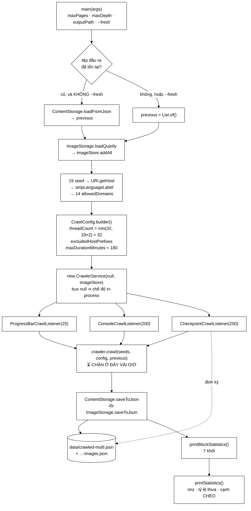

# MultiDomainCrawlRunner — công cụ chạy tay duy nhất biến một đồ án thành một thí nghiệm có số liệu

**File nguồn:** `search-engine/src/main/java/com/vnsearch/crawler/MultiDomainCrawlRunner.java` (410 dòng)
**Gói:** `com.vnsearch.crawler` · **Loại:** `class` chỉ có `static`, một `main()` trần, **không** phải bean Spring, **không** được lớp nào khác gọi
**Vị trí trong sơ đồ:** đứng **ngoài** sơ đồ kiến trúc crawler — nó là người *bấm nút*, không phải một khối trong dây chuyền
**Đọc kèm:** [`CrawlerService.md`](./CrawlerService.md) · [`CrawlConfig.md`](./CrawlConfig.md) · [`CheckpointCrawlListener.md`](./CheckpointCrawlListener.md) · [`ContentStorage.md`](./ContentStorage.md) · [`../service/CrawlJobManager.md`](../service/CrawlJobManager.md)

---

## 📌 Hiểu trong 30 giây

Đây là lớp **duy nhất** trong cả repo mà sản phẩm của nó là một *tệp dữ liệu*
chứ không phải một hành vi phần mềm. Chạy nó vài giờ, và ở cuối có
`data/crawled-multi.json` với **31.030 tài liệu** — cái corpus mà mọi con số
trong báo cáo đồ án đều dựa vào: độ thưa của ma trận liên kết, thời gian dựng
chỉ mục đảo, phân bố độ dài hậu tố, độ chính xác của PageRank, kết quả đánh giá
qrels.

Nói cách khác: **xoá lớp này thì ứng dụng vẫn chạy, nhưng đồ án không còn gì để
đo.**

```
   ┌──────────────────────────────────────────────────────────────────────┐
   │  BA CÂU HỎI LỚP NÀY TRẢ LỜI, VÀ KHÔNG LỚP NÀO KHÁC TRẢ LỜI ĐƯỢC     │
   │                                                                      │
   │  ① Corpus lấy ở ĐÂU ra?                                             │
   │     → 19 hạt giống, 14 domain được phép, chính sách chỉ vi/en        │
   │                                                                      │
   │  ② Chạy vài giờ mà mất điện thì SAO?                                │
   │     → nối tiếp mặc định + điểm kiểm tra + ghi nguyên tử             │
   │                                                                      │
   │  ③ Làm sao BIẾT corpus dùng được cho PageRank?                      │
   │     → printStatistics() in ra nnz, tỷ lệ thưa, và số cạnh CHÉO      │
   │       giữa các domain — con số quyết định PageRank có nghĩa hay không│
   └──────────────────────────────────────────────────────────────────────┘
```

Ba câu hỏi đó là ba mục nặng nhất của tài liệu này (mục 1, 4, 9). Phần còn lại
— `stripLanguageLabel`, `distinctSeedHosts`, ba listener — là hệ quả.



```
   VÌ SAO SƠ ĐỒ NÀY KHÔNG CÓ Ô NÀO TÊN LÀ "SPRING"

        MultiDomainCrawlRunner       →  new CrawlerService(...)
        CrawlJobManager (bean Spring)→  new CrawlerService(...)

        HAI đường vào cùng một máy crawl. Đường thứ nhất là một tiến
        trình JVM trần chạy hàng giờ trên máy của người làm đồ án.
        Đường thứ hai là một request HTTP tới ứng dụng web.

   ⇒ Toàn bộ gói `crawler` là POJO thuần, không một annotation Spring
     nào. Đó KHÔNG phải sự tình cờ — nó là điều kiện để tồn tại được
     cả hai đường vào. Xem mục 10.
```

---

## Mục lục

1. [Vì sao phải crawl đa domain — PageRank không có nghĩa trên một tờ báo](#1-vì-sao-phải-crawl-đa-domain--pagerank-không-có-nghĩa-trên-một-tờ-báo)
2. [Hai tập hạt giống, và vì sao bộ lọc không thay được hạt giống](#2-hai-tập-hạt-giống-và-vì-sao-bộ-lọc-không-thay-được-hạt-giống)
3. [`stripLanguageLabel` — 12 dòng, hai cái bẫy](#3-striplanguagelabel--12-dòng-hai-cái-bẫy)
4. [Nối tiếp là mặc định — ba cơ chế giữ cho công crawl không bị phí](#4-nối-tiếp-là-mặc-định--ba-cơ-chế-giữ-cho-công-crawl-không-bị-phí)
5. [Kho ảnh — vòng đời phải khớp corpus, từng chữ một](#5-kho-ảnh--vòng-đời-phải-khớp-corpus-từng-chữ-một)
6. [Cấu hình phiên — bốn con số, không con số nào tuỳ tiện](#6-cấu-hình-phiên--bốn-con-số-không-con-số-nào-tuỳ-tiện)
7. [Ba listener cùng lúc — Observer đúng chỗ nó sinh ra để dùng](#7-ba-listener-cùng-lúc--observer-đúng-chỗ-nó-sinh-ra-để-dùng)
8. [`printBlockStatistics` — bằng chứng mỗi khối thật sự có việc](#8-printblockstatistics--bằng-chứng-mỗi-khối-thật-sự-có-việc)
9. [`printStatistics` — nnz, tỷ lệ thưa, và con số quyết định](#9-printstatistics--nnz-tỷ-lệ-thưa-và-con-số-quyết-định)
10. [Vì sao là `main()` trần chứ không phải bean Spring](#10-vì-sao-là-main-trần-chứ-không-phải-bean-spring)
11. [Rủi ro vận hành khi chạy hàng giờ](#11-rủi-ro-vận-hành-khi-chạy-hàng-giờ)
12. [Hướng dẫn về code](#12-hướng-dẫn-về-code)
13. [Độ phức tạp & chi phí](#13-độ-phức-tạp--chi-phí)
14. [Kiểm thử liên quan](#14-kiểm-thử-liên-quan)
15. [Chấm theo chuẩn doanh nghiệp](#15-chấm-theo-chuẩn-doanh-nghiệp)
16. [Liên kết](#16-liên-kết)

---

## 1. Vì sao phải crawl đa domain — PageRank không có nghĩa trên một tờ báo

Javadoc mở đầu bằng đúng lý do tồn tại của lớp, và đó là lập luận đáng giá nhất
của cả tệp:

> *"corpus cũ chỉ gồm 150 trang của riêng vnexpress.net, khiến PageRank gần như
> vô nghĩa — liên kết nội bộ trong một tờ báo phản ánh cấu trúc điều hướng (menu,
> chuyên mục, bài liên quan) chứ không phản ánh uy tín trang."*

Đây không phải một nhận xét chung chung. Nó là một mệnh đề về **ý nghĩa của một
cạnh** trong đồ thị:

```
   MỘT CẠNH TRONG ĐỒ THỊ LIÊN KẾT NGHĨA LÀ GÌ?

   ┌──────────────────────────────────────────────────────────────────────┐
   │  GIẢ ĐỊNH NỀN CỦA PAGERANK                                          │
   │  "A trỏ tới B" = "người viết A tự nguyện bỏ phiếu cho B"            │
   │  Phiếu đó có giá trị vì nó TỐN CÔNG và người bỏ phiếu ĐỘC LẬP.      │
   └──────────────────────────────────────────────────────────────────────┘

   CORPUS MỘT DOMAIN — giả định trên SAI HOÀN TOÀN:

        vnexpress.net/bai-A  ──▶  vnexpress.net/kinh-doanh
        vnexpress.net/bai-B  ──▶  vnexpress.net/kinh-doanh
        vnexpress.net/bai-C  ──▶  vnexpress.net/kinh-doanh
        ...  (mọi bài đều có menu, và menu có link chuyên mục)

        ⇒ Trang chuyên mục nào cũng có in-degree ≈ số bài.
        ⇒ PageRank hội tụ về "trang nào nằm trên menu".
        ⇒ Kết quả xếp hạng: trang /kinh-doanh, /the-thao, /the-gioi
          đứng đầu MỌI truy vấn. Không một trang nội dung nào lọt vào.

        Đó không phải uy tín. Đó là bản sao của cây điều hướng —
        thứ mà một câu lệnh `SELECT` đọc `<nav>` cũng cho ra được.

   CORPUS ĐA DOMAIN — giả định được khôi phục một phần:

        tuoitre.vn/bai-X   ──▶  vnexpress.net/bai-Y
        dantri.com.vn/... ──▶  vnexpress.net/bai-Y

        Toà soạn khác trỏ sang là một quyết định biên tập THẬT.
        Cạnh này mang tín hiệu. Đây chính là "cạnh CHÉO" mà
        printStatistics() đếm riêng ở mục 9.
```

Và có một hệ quả toán học đi kèm mà Javadoc nói tới bằng đúng ngôn ngữ của báo
cáo DSA: *"Crawl nhiều báo cùng lúc còn làm tỷ lệ thưa `nnz/n²` của ma trận liên
kết giảm mạnh, đúng như dự đoán lý thuyết."*

```
   VÌ SAO ĐA DOMAIN LÀM MA TRẬN THƯA HƠN — chứ không phải đặc hơn

        n  = số trang trong corpus
        nnz= số cạnh nội bộ corpus (cả hai đầu đều đã crawl)

   MỘT DOMAIN, n = 150:
        mỗi trang trỏ tới ~40 trang, và gần như CẢ 40 đều nằm trong
        corpus (vì corpus phủ gần hết site nhỏ đó)
        nnz ≈ 150 × 40 = 6.000
        nnz/n² = 6.000 / 22.500 = 26,7 %   ← ĐẶC, không phải thưa

   ĐA DOMAIN, n = 31.030:
        mỗi trang vẫn trỏ ~40 liên kết, nhưng phần lớn trỏ ra ngoài
        corpus (trang chưa crawl, trang bị lọc, domain không cho phép)
        chỉ một phần nhỏ có cả hai đầu trong corpus
        nnz/n² rơi xuống mức phần vạn

   ⇒ Và ĐÓ mới là chế độ mà thuật toán PageRank thưa (nhân ma trận
     thưa – vector, lưu theo danh sách kề) thực sự có lý do tồn tại.
     Trên ma trận đặc 26,7 %, lưu dạng thưa còn TỐN HƠN mảng hai chiều.

   ⇒ Nói cách khác: corpus 150 trang không chỉ cho PageRank sai kết
     quả, nó còn làm cho việc CÀI ĐẶT ma trận thưa trở nên vô nghĩa —
     tức phá hỏng cả phần lập luận cấu trúc dữ liệu của đồ án.
```

```
   ┌──────────────────────────────────────────────────────────────────────┐
   │  RÚT RA: quy mô và hình dạng dữ liệu là MỘT PHẦN của thiết kế       │
   │  thuật toán, không phải một chuyện riêng của khâu vận hành.         │
   │                                                                      │
   │  Một cấu trúc dữ liệu chỉ chứng minh được giá trị của nó trên        │
   │  đúng chế độ dữ liệu mà nó nhắm tới. Lớp này tồn tại để tạo ra       │
   │  chế độ dữ liệu đó.                                                  │
   └──────────────────────────────────────────────────────────────────────┘
```

---

## 2. Hai tập hạt giống, và vì sao bộ lọc không thay được hạt giống

### 2.1 Con số thật

```java
private static final List<String> VIETNAMESE_SEEDS = List.of(...);  // 11 mục
private static final List<String> ENGLISH_SEEDS    = List.of(...);  //  8 mục
private static final List<String> DEFAULT_SEEDS = concat(VIETNAMESE_SEEDS, ENGLISH_SEEDS);
```

| | Số mục | Sau `stripLanguageLabel` | Đóng góp domain **mới** |
|---|---|---|---|
| `VIETNAMESE_SEEDS` | 11 | 11 domain phân biệt | 11 |
| `ENGLISH_SEEDS` | 8 | 5 trùng + 3 mới | 3 |
| **Tổng** | **19 hạt giống** | | **14 `allowedDomains`** |

Ba domain mới từ phía tiếng Anh: `vietnamnews.vn`, `english.vov.vn`, `vir.com.vn`.
Năm mục còn lại (`e.vnexpress.net`, `en.vietnamnet.vn`, `en.nhandan.vn`,
`en.baochinhphu.vn`, `en.vietnamplus.vn`) rút gọn về đúng domain đã có ở danh
sách tiếng Việt.

### 2.2 Lập luận trung tâm: bộ lọc **loại bớt**, nó không **tạo ra**

Javadoc của `ENGLISH_SEEDS` nói thẳng:

> *"`LanguageFilter` chỉ lọc chứ không tạo ra trang tiếng Anh: nếu mọi hạt giống
> đều là báo tiếng Việt thì crawler gần như không bao giờ chạm tới một trang
> tiếng Anh nào, và phần 'tiếng Anh' của chính sách thành vô nghĩa."*

```
   MỘT CHÍNH SÁCH HAI VẾ, THI HÀNH BẰNG HAI CƠ CHẾ NGƯỢC CHIỀU

   Chính sách: "corpus gồm tiếng Việt VÀ tiếng Anh"

        VẾ "chỉ hai thứ tiếng này"  →  cơ chế TRỪ
             UrlFilter.NON_VI_EN_HOST_PREFIXES   (trước khi tải)
             LanguageFilter                       (sau khi tải)

        VẾ "có tiếng Anh"           →  cơ chế CỘNG
             ENGLISH_SEEDS
             ← KHÔNG bộ lọc nào làm được việc này

   ┌──────────────────────────────────────────────────────────────────────┐
   │  ĐÂY LÀ LỖI TƯ DUY RẤT DỄ MẮC:                                       │
   │  "tôi đã có bộ lọc chấp nhận tiếng Anh, vậy corpus sẽ có tiếng Anh." │
   │                                                                      │
   │  KHÔNG. Bộ lọc chỉ chạy trên những gì crawler ĐI TỚI. Crawler đi     │
   │  theo liên kết. Liên kết bắt đầu từ hạt giống. Nếu hạt giống toàn    │
   │  tiếng Việt, đầu vào của bộ lọc gần như 100 % tiếng Việt, và bộ lọc  │
   │  "chấp nhận cả tiếng Anh" chạy suốt phiên crawl mà không bao giờ     │
   │  dùng tới nhánh đó.                                                  │
   │                                                                      │
   │  Kiểm chứng: printStatistics() in "Phan bo theo ngon ngu". Nếu       │
   │  dòng `en` bằng 0 thì chính sách hai ngôn ngữ chỉ tồn tại trên giấy. │
   └──────────────────────────────────────────────────────────────────────┘
```

### 2.3 Vì sao là bản tiếng Anh của báo Việt, không phải BBC/Reuters

Đây là chỗ hai quyết định thiết kế gặp nhau — chọn hạt giống tiếng Anh **để phục
vụ mục 1**, chứ không phải để "cho đa dạng":

```
   NẾU CHỌN BBC / REUTERS / AP:

        cụm Việt Nam                    cụm quốc tế
        ┌──────────────┐                ┌──────────────┐
        │ vnexpress    │                │ bbc.com      │
        │ tuoitre  ↔   │                │ reuters ↔    │
        │ dantri       │                │ ap.org       │
        └──────────────┘                └──────────────┘
              ▲                                ▲
              └────────  KHÔNG CÓ CẠNH  ───────┘

        ⇒ Đồ thị có HAI thành phần liên thông rời nhau.
        ⇒ PageRank chạy trên đồ thị rời = hai phép PageRank độc lập,
          và hệ số damping phải "rót" khối lượng qua vector nhảy ngẫu
          nhiên để cả hai không bị chết — tức phần lớn điểm số đến từ
          teleport chứ không từ liên kết.
        ⇒ Corpus to hơn nhưng tín hiệu KHÔNG giàu thêm.

   CHỌN e.vnexpress.net / en.vietnamnet.vn:

        ┌──────────────────────────────────┐
        │ vnexpress ←──────→ e.vnexpress   │  cùng toà soạn, cùng hệ
        │     ↕                    ↕       │  thống "bài liên quan",
        │ vietnamnet ←────→ en.vietnamnet  │  cùng chân trang
        └──────────────────────────────────┘

        ⇒ MỘT thành phần liên thông, có cạnh chéo THẬT giữa hai vùng
          ngôn ngữ.
        ⇒ Đúng thứ mục 1 cần.
```

### 2.4 Một hạt giống bị **cố tình** loại, và ghi chép của nó

Đoạn chú thích ở giữa `ENGLISH_SEEDS` (dòng 100–104) là một mẫu ghi chép đáng
học vì nó ghi lại một **kết quả đo**, không phải một linh cảm:

```
   KHONG dung tuoitrenews.vn: chung chi TLS cua site het han, moi
   lan tai deu nem CertPathValidatorException (do duoc o phien crawl
   10.017 trang — 0 trang thu duoc tu domain nay). Bo qua loi chung
   chi thi phai tat xac thuc TLS cho TOAN BO crawler, cai gia qua
   dat cho mot hat giong.
```

```
   BỐN PHẦN CỦA MỘT GHI CHÉP TỐT — đoạn trên có đủ cả bốn:

        ① QUYẾT ĐỊNH   : không dùng tuoitrenews.vn
        ② TRIỆU CHỨNG  : CertPathValidatorException mỗi lần tải
        ③ BẰNG CHỨNG   : đo ở phiên 10.017 trang, thu được ĐÚNG 0 trang
        ④ ĐÁNH ĐỔI ĐÃ  : cách khác là tắt xác thực TLS toàn cục —
          CÂN NHẮC       một lỗ hổng MITM cho cả crawler, đổi lấy
                         một hạt giống. Từ chối.

   Không có phần ③, lần sửa sau sẽ có người thêm lại nó "để thử".
   Không có phần ④, lần sửa sau sẽ có người tắt TLS "cho nhanh".
```

---

## 3. `stripLanguageLabel` — 12 dòng, hai cái bẫy

```java
private static final Set<String> LANGUAGE_LABELS = Set.of("www", "e", "en");

private static String stripLanguageLabel(String host) {
    int dot = host.indexOf('.');
    if (dot <= 0) {
        return host;
    }
    String first = host.substring(0, dot).toLowerCase(Locale.ROOT);
    String rest = host.substring(dot + 1);
    if (LANGUAGE_LABELS.contains(first) && rest.indexOf('.') > 0) {
        return rest;
    }
    return host;
}
```

### 3.1 Bẫy thứ nhất — hậu tố quá rộng

Điều kiện `rest.indexOf('.') > 0` trông thừa, nhưng nó chặn một lỗ hổng thật:

```
   NHỚ RẰNG UrlFilter DÙNG endsWith ĐỂ SO DOMAIN:

        allowedDomains.stream().anyMatch(host::endsWith)

   KỊCH BẢN KHÔNG CÓ PHÉP KIỂM:

        host = "e.com.vn"           (giả sử có một hạt giống như vậy)
        first = "e" ∈ LANGUAGE_LABELS
        rest  = "com.vn"
        → allowedDomains chứa "com.vn"

        → endsWith("com.vn") ĐÚNG với:
              shopee.com.vn, tiki.com.vn, bat-ky-thu-gi.com.vn
        → CRAWLER ĐƯỢC PHÉP ĐI KHẮP .com.vn

   ┌──────────────────────────────────────────────────────────────────────┐
   │  Một danh sách cho phép biến thành một danh sách cho phép TẤT CẢ,    │
   │  và không có gì báo. Corpus sẽ đầy trang thương mại điện tử, và      │
   │  người chạy chỉ phát hiện ra ở bảng "Phan bo theo domain" cuối       │
   │  phiên — tức sau vài giờ.                                            │
   └──────────────────────────────────────────────────────────────────────┘

   ⚠ PHÉP KIỂM HIỆN TẠI CHƯA ĐỦ CHẶT. Nó chỉ yêu cầu "phần còn lại
     có ít nhất hai nhãn". Với host "e.com.vn" thì rest = "com.vn"
     có hai nhãn ⇒ VẪN LỌT. Phép kiểm đúng phải là danh sách hậu tố
     công cộng (Public Suffix List). Xem đề xuất 2 ở mục 15.

     Mức nghiêm trọng hiện tại: THẤP, vì tập hạt giống là hằng số
     trong mã và không có mục nào rơi vào ca này. Nhưng nó là một
     phép kiểm TRÔNG NHƯ đã an toàn mà thực ra chưa.
```

### 3.2 Bẫy thứ hai — `english.` không phải `en.`

Đây là một chi tiết dễ bỏ qua và nó **đang có hiệu lực thật** trong phiên crawl:

```
   LANGUAGE_LABELS = {"www", "e", "en"}

        e.vnexpress.net    → "e"       ∈ tập  → vnexpress.net    ✔ cắt
        en.nhandan.vn      → "en"      ∈ tập  → nhandan.vn       ✔ cắt
        english.vov.vn     → "english" ∉ tập  → english.vov.vn   ✘ GIỮ NGUYÊN

   HẬU QUẢ CỤ THỂ:

        allowedDomains chứa "english.vov.vn", KHÔNG chứa "vov.vn".

        endsWith("english.vov.vn") → chỉ khớp chính subdomain đó.
        ⇒ Bản tiếng Việt vov.vn — một đài lớn — KHÔNG được crawl.
        ⇒ Và cạnh chéo giữa english.vov.vn và vov.vn (chân trang, nút
          chuyển ngôn ngữ) bị mất, đúng loại cạnh mà mục 2.3 nói là
          lý do chọn cụm site này.

   CÓ PHẢI LỖI KHÔNG? Không rõ, và đó chính là vấn đề —
   không có chú thích nào nói "cố ý" hay "bỏ sót".

        Nếu CỐ Ý (chỉ muốn phần tiếng Anh của VOV): nên ghi ra.
        Nếu BỎ SÓT: thêm "english" vào LANGUAGE_LABELS là xong,
        và corpus có thêm một domain lớn cùng một cụm cạnh chéo.

   ⇒ Đây là loại khoảng trống mà tài liệu phát hiện được còn mã thì
     không: mã chạy đúng như viết, chỉ là không ai biết nó có đúng
     như ĐỊNH viết hay không.
```

### 3.3 Vì sao phải cắt nhãn — hai lý do, không phải một

Javadoc nêu một lý do (`threadCount` phồng lên), nhưng thật ra có hai:

```
   LÝ DO ① — đếm domain sai làm threadCount sai
        threadCount = min(32, distinctSeedHosts() × 2)
        ⚠ Chú ý: distinctSeedHosts() đếm HOST của seed (19),
          KHÔNG dùng allowedDomains (14). Nên lý do này thực ra
          KHÔNG áp dụng cho threadCount — xem mục 6.2.
          Nó áp dụng cho DÒNG BÁO CÁO "tren %d domain".

   LÝ DO ② — trùng lặp vô nghĩa trong tập cho phép
        Không cắt thì allowedDomains = {vnexpress.net, e.vnexpress.net, ...}
        Mà endsWith("vnexpress.net") ĐÃ khớp "e.vnexpress.net".
        ⇒ Mục thứ hai không bao giờ được dùng tới.
        ⇒ Mỗi lần gọi UrlFilter.accept phải duyệt thêm những mục chết:
          19 mục thay vì 14, trên ~1,2 triệu lượt gọi enqueue.

   ⇒ Cắt nhãn không phải để "cho đẹp". Nó giữ cho tập cho phép là
     một tập TỐI TIỂU — và một tập tối tiểu thì đọc ra là hiểu ngay
     phạm vi crawl, không phải suy luận qua phép endsWith.
```

---

## 4. Nối tiếp là mặc định — ba cơ chế giữ cho công crawl không bị phí

Đây là mục quan trọng nhất về mặt **vận hành**, vì phiên crawl kéo dài hàng giờ
và mọi thứ có thể hỏng ở giữa.

### 4.1 Đảo mặc định: nối tiếp thay vì ghi đè

```java
List<WebDocument> previous = List.of();
if (!fresh && Files.exists(Path.of(outputPath))) {
    previous = ContentStorage.loadFromJson(outputPath);
    System.out.printf("Noi tiep corpus san co: %d tai lieu tu %s%n",
            previous.size(), outputPath);
}
```

Chú thích dòng 126–130 nêu đúng nguyên tắc:

```
   ┌──────────────────────────────────────────────────────────────────────┐
   │  HAI CHIỀU NHẦM LẪN KHÔNG ĐỐI XỨNG                                  │
   │                                                                      │
   │  Nhầm theo chiều "định --fresh mà quên gõ":                          │
   │       → corpus cũ được nối thêm vào                                  │
   │       → SỬA ĐƯỢC: xoá tệp rồi chạy lại                              │
   │                                                                      │
   │  Nhầm theo chiều "định nối tiếp mà mặc định lại ghi đè":             │
   │       → 8 giờ crawl bị xoá bởi một lệnh chạy 30 giây                 │
   │       → KHÔNG SỬA ĐƯỢC: dữ liệu đã mất                              │
   │                                                                      │
   │  ⇒ Mặc định phải nghiêng về phía KHÔNG PHÁ HUỶ. Ai thật sự muốn      │
   │    huỷ thì nói rõ bằng --fresh.                                      │
   └──────────────────────────────────────────────────────────────────────┘

   ĐÂY LÀ CÙNG NGUYÊN TẮC VỚI:
        rm     — mặc định không -r
        git    — không tự ép đẩy
        DROP   — cần xác nhận

   Và nó biến một lệnh chạy nhiều lần thành CỘNG DỒN:
        3 × maxPages=2000  →  ~6.000 trang
   chứ không phải "2.000 trang, ba lần".
```

⚠ Nhưng cách đọc cờ có một điểm yếu thật:

```java
boolean fresh = args.length > 3 && args[3].equalsIgnoreCase("--fresh");
```

```
   --fresh CHỈ ĐƯỢC NHẬN Ở ĐÚNG VỊ TRÍ THỨ TƯ.

        mvnw exec:java -Dexec.args="--fresh"
             → args[0] = "--fresh"
             → Integer.parseInt("--fresh") → NumberFormatException
             → chương trình chết ngay, TO và RÕ. Chấp nhận được.

        mvnw exec:java -Dexec.args="5000 3 --fresh"
             → args[2] = "--fresh"  → outputPath = "--fresh"
             → Files.exists("--fresh") = false → previous rỗng
             → crawl xong, GHI CORPUS VÀO MỘT TỆP TÊN "--fresh"
             → corpus thật KHÔNG bị đụng tới, nhưng cũng KHÔNG được
               cập nhật, và không có một dòng cảnh báo nào

        ⇒ Hỏng IM LẶNG, và người chạy chỉ biết sau vài giờ.

   Đây là cái giá của việc phân tích tham số bằng chỉ số mảng. Xem
   đề xuất 1 ở mục 15.
```

### 4.2 Ba cơ chế, ba loại hỏng khác nhau

Javadoc liệt kê ba cơ chế; điều đáng nói là **mỗi cơ chế chống một loại hỏng
khác nhau**, và bỏ bất cứ cái nào cũng để lại một lỗ:

```
   ┌────────────────────┬────────────────────────┬─────────────────────────┐
   │ Cơ chế             │ Chống loại hỏng nào    │ Mất gì nếu thiếu        │
   ├────────────────────┼────────────────────────┼─────────────────────────┤
   │ Nối tiếp mặc định  │ Người chạy muốn thêm   │ Cả phiên trước — hàng   │
   │ (previous)         │ dữ liệu, chạy lại lệnh │ giờ, do CHÍNH mình xoá  │
   ├────────────────────┼────────────────────────┼─────────────────────────┤
   │ CheckpointCrawl    │ Ctrl+C, mất điện,      │ Toàn bộ phần crawl kể   │
   │ Listener (250)     │ OutOfMemoryError       │ từ đầu phiên            │
   ├────────────────────┼────────────────────────┼─────────────────────────┤
   │ ContentStorage     │ Tiến trình chết ĐÚNG   │ Corpus cũ HỎNG — mất cả │
   │ .saveToJson        │ lúc đang ghi tệp       │ phiên trước LẪN phiên   │
   │ (ghi nguyên tử)    │                        │ này. Tệ nhất trong ba.  │
   └────────────────────┴────────────────────────┴─────────────────────────┘

   Chú ý cột thứ ba: mức thiệt hại TĂNG DẦN từ trên xuống, còn xác
   suất xảy ra thì GIẢM DẦN. Cơ chế thứ ba bảo vệ ca hiếm nhất nhưng
   đắt nhất — và nó cũng là cơ chế rẻ nhất để cài (ghi ra tệp tạm rồi
   đổi tên nguyên tử).
```

### 4.3 Nối tiếp không có nghĩa là tải lại

Điểm dễ hiểu nhầm: `previous` được truyền vào
`crawler.crawl(seeds, config, previous)`, và
[`CrawlerService.restore()`](./CrawlerService.md) làm **hai vòng lặp tách rời**
chứ không phải một:

```
   VÒNG 1 — nạp mọi tài liệu cũ vào contentStorage, contentSeenFilter,
            urlSeenFilter  ⇒ chúng được coi là "ĐÃ GẶP"
   VÒNG 2 — chỉ SAU khi vòng 1 xong, mới enqueue các outlink của chúng

   NẾU GỘP HAI VÒNG LÀM MỘT:
        tài liệu #1 được nạp, outlink của nó được enqueue ngay
        → trong đó có URL của tài liệu #500, mà #500 CHƯA được nạp
        → urlSeenFilter chưa biết #500 → nó vào frontier
        → và bị TẢI LẠI, dù đã có sẵn trong corpus

        Với corpus 31.030 trang trỏ lẫn nhau: hàng nghìn lượt tải lại,
        tức hàng chục phút băng thông đổi lấy đúng 0 tài liệu mới.

   ⇒ "Nối tiếp" là một hợp đồng giữa lớp này và CrawlerService, và
     phần khó của hợp đồng nằm ở phía CrawlerService.
```

---

## 5. Kho ảnh — vòng đời phải khớp corpus, từng chữ một

```java
ImageStore imageStore = new ImageStore();
String imagePath = ImageStorage.pathFor(outputPath);
if (!fresh) {
    List<ImageFound> previousImages = ImageStorage.loadQuietly(imagePath);
    if (!previousImages.isEmpty()) {
        imageStore.addAll(previousImages);
        System.out.printf("Noi tiep kho anh san co : %d anh tu %s%n",
                previousImages.size(), imagePath);
    }
}
```

Chú thích dòng 138–147 ghi lại một lỗi **đã xảy ra thật**, và triệu chứng của nó
rất đặc trưng:

```
   TRƯỚC:  CrawlerService()  — constructor không tham số ⇒ imageStore = null

        ImageDownloadService  vẫn chạy         (tốn CPU, tốn phân tích)
        CrawlAnalyticsService vẫn cộng số liệu (số đếm vẫn tăng)
        nhưng KHÔNG AI GIỮ LẠI một bản ghi nào

   TRIỆU CHỨNG NGƯỜI DÙNG THẤY:
        run-crawl.bat chạy xong, log báo "đã tìm thấy 47.000 ảnh"
        → mở tab "Hình ảnh" trong ứng dụng → TRỐNG
        → gọi /api/crawl-stats → không có gì để đọc

   ┌──────────────────────────────────────────────────────────────────────┐
   │  ĐÂY LÀ KIỂU HỎNG TỆ NHẤT: log nói CÓ, giao diện nói KHÔNG.          │
   │  Người đọc log sẽ đi tìm lỗi ở tầng API hoặc tầng giao diện,          │
   │  vì log đã "chứng minh" phần crawl chạy đúng. Trong khi nguyên       │
   │  nhân nằm ở một tham số null cách đó bốn tầng.                       │
   │                                                                      │
   │  Bộ đếm và bộ lưu là HAI trách nhiệm. Bộ đếm chạy được mà bộ lưu     │
   │  không có nghĩa là hệ thống "chạy được một phần" — nó có nghĩa là    │
   │  hệ thống NÓI DỐI.                                                   │
   └──────────────────────────────────────────────────────────────────────┘
```

### 5.1 Bốn điểm đồng bộ giữa ảnh và corpus

Sửa xong, ảnh có đúng bốn điểm mà vòng đời của nó khớp với corpus:

```
   ① NẠP LẠI Ở ĐẦU PHIÊN   ImageStorage.loadQuietly(imagePath)
                            cùng điều kiện !fresh với corpus
   ② GHI ĐIỂM KIỂM TRA     CheckpointCrawlListener nhận CẢ HAI supplier:
                            crawler::snapshotDocuments  VÀ  imageStore::all
   ③ GHI RA ĐĨA Ở CUỐI     ContentStorage.saveToJson  RỒI  ImageStorage.saveToJson
   ④ TÊN TỆP SUY RA        ImageStorage.pathFor(outputPath) — tệp ANH EM,
                            không phải một đường dẫn cấu hình riêng
```

Điểm ③ có một chú thích quan trọng về **thứ tự**:

```
   Ghi anh SAU corpus — cung thu tu ma CheckpointCrawlListener dung, va
   vi cung mot ly do: tep anh cu hon corpus thi chi thieu anh, con moi
   hon thi tro toi trang khong ton tai trong corpus.
```

```
   HAI TỆP, GHI KHÔNG NGUYÊN TỬ VỚI NHAU ⇒ LUÔN CÓ MỘT CỬA SỔ LỆCH.
   Câu hỏi không phải "làm sao hết lệch", mà "LỆCH VỀ PHÍA NÀO".

   ┌─────────────────────────┬────────────────────────────────────────┐
   │ corpus mới, ảnh CŨ      │ Một số trang mới chưa có ảnh.          │
   │ (thứ tự HIỆN TẠI)       │ → tab Hình ảnh thiếu vài mục            │
   │                         │ → KHÔNG có mục nào trỏ sai              │
   │                         │ → tự lành ở phiên nối tiếp sau          │
   ├─────────────────────────┼────────────────────────────────────────┤
   │ corpus CŨ, ảnh mới      │ Có bản ghi ảnh trỏ tới sourceUrl mà     │
   │ (thứ tự NGƯỢC)          │ corpus KHÔNG chứa.                      │
   │                         │ → tra ngược tài liệu → null             │
   │                         │ → NPE hoặc mục ảnh mồ côi trên giao diện│
   └─────────────────────────┴────────────────────────────────────────┘

   ⇒ Nguyên tắc chung: khi hai kho không ghi nguyên tử được với nhau,
     ghi kho ĐƯỢC THAM CHIẾU trước, kho THAM CHIẾU ĐI sau. Khoá ngoại
     chỉ hỏng theo một chiều.
```

### 5.2 `loadQuietly` — vì sao "quietly" là đúng ở đây

```
   Corpus là NGUỒN SỰ THẬT. Ảnh là DỮ LIỆU KÈM THEO.

        loadFromJson(outputPath)   → ném IOException, dừng chương trình
        loadQuietly(imagePath)     → nuốt lỗi, trả danh sách rỗng

   KHÔNG ĐỐI XỨNG, VÀ ĐÚNG:
        Corpus hỏng ⇒ phiên nối tiếp sẽ crawl lại từ đầu mà người chạy
        không biết ⇒ phải dừng ngay.
        Tệp ảnh hỏng ⇒ mất siêu dữ liệu ảnh của phiên trước, thu lại
        được ở phiên sau ⇒ không đáng để huỷ một phiên crawl 3 tiếng.

   ⚠ Nhưng "quietly" phải có nghĩa là "không NÉM", chứ không phải
     "không NÓI". Hiện tại `previousImages.isEmpty()` gộp hai trường
     hợp rất khác nhau vào một nhánh im lặng:
          - chưa từng có tệp ảnh (bình thường)
          - có tệp ảnh nhưng ĐỌC HỎNG (bất thường)
     Cả hai đều không in ra gì. Xem đề xuất 4 ở mục 15.
```

---

## 6. Cấu hình phiên — bốn con số, không con số nào tuỳ tiện

```java
CrawlConfig config = CrawlConfig.builder()
        .maxDepth(maxDepth)
        .maxPages(maxPages)
        .threadCount(Math.min(32, distinctSeedHosts() * 2))
        .allowedDomains(allowedDomains)
        .excludedHostPrefixes(UrlFilter.NON_VI_EN_HOST_PREFIXES)
        .maxDurationMinutes(180)
        .build();
```

### 6.1 Trần thông lượng do politeness, không do phần cứng

```
   CHÍNH SÁCH LỊCH SỰ: 1 giây giữa hai request TỚI CÙNG MỘT HOST.
   Thi hành ở UrlFrontier, không ở lớp này.

   HỆ QUẢ SỐ HỌC:

        Với H host phân biệt, mỗi host cho tối đa 1 trang/giây
        ⇒ TRẦN THÔNG LƯỢNG = H trang/giây, BẤT KỂ có bao nhiêu luồng.

        H = 19  ⇒  ≤ 19 trang/giây

   ┌──────────────────────────────────────────────────────────────────────┐
   │  ĐÂY LÀ MỘT TRẦN KHÔNG MUA ĐƯỢC BẰNG TIỀN.                          │
   │                                                                      │
   │  Thêm CPU: vô ích — luồng đang ngủ chứ không tính toán.              │
   │  Thêm băng thông: vô ích — không phải nút thắt.                      │
   │  Thêm luồng: vô ích quá 2×H — luồng thừa xếp hàng chờ hoãn.          │
   │  Thêm DOMAIN: ← ĐÂY là cách duy nhất nới trần.                       │
   │                                                                      │
   │  ⇒ Và điều này lại củng cố mục 1: crawl đa domain không chỉ tốt cho  │
   │    chất lượng đồ thị, nó là cách DUY NHẤT để crawl nhanh mà vẫn      │
   │    giữ được lời hứa lịch sự. Hai lý do độc lập, cùng một kết luận.   │
   └──────────────────────────────────────────────────────────────────────┘
```

### 6.2 `threadCount = min(32, distinctSeedHosts() × 2)`

```
   distinctSeedHosts() đếm HOST của seed = 19  (KHÔNG phải 14 domain)
        → 19 × 2 = 38
        → min(32, 38) = 32 luồng

   VÌ SAO NHÂN ĐÔI chứ không bằng đúng H?
        Một luồng không phải lúc nào cũng "đang tải". Nó còn:
             - chờ hoãn politeness cho host của task vừa lấy
             - phân tích DOM
             - băm SHA-256
             - phát sự kiện lên bus
        Trong lúc luồng A làm những việc đó, host của nó rảnh. Luồng
        thứ hai lấp vào chỗ trống ⇒ tiến gần trần hơn.

   VÌ SAO CHẶN TRÊN Ở 32?
        Mỗi luồng là một ngăn xếp (~1 MB mặc định) cộng bộ đệm socket.
        Và trần thông lượng vẫn là 19 trang/giây — luồng thứ 33 chỉ
        thêm một chỗ ngồi chờ, không thêm một trang nào.

   ⚠ MỘT LỆCH PHA NHỎ NHƯNG THẬT:
        distinctSeedHosts() duyệt DEFAULT_SEEDS mỗi lần được gọi,
        dựng một LinkedHashSet mới. Nó chỉ được gọi ĐÚNG MỘT LẦN nên
        chi phí bằng 0 — nhưng ngay phía trên đó, vòng lặp dựng
        allowedDomains ĐÃ duyệt đúng danh sách ấy. Hai lượt duyệt cho
        hai con số khác nhau (19 và 14) trên cùng một dữ liệu.
        Không sai, chỉ là dễ khiến người đọc tưởng hai con số là một.
```

### 6.3 `maxDurationMinutes(180)` — vì sao 180 chứ không phải 90

Chú thích dòng 191–198 là một tính toán ngân sách hoàn chỉnh:

```
   Politeness 1 giây/host với 18 host cho thông lượng trần
   ~18 trang/giây, tức 30.000 trang cần ~30 phút Ở TỐC ĐỘ TRẦN.
   Thực tế luôn thấp hơn (độ trễ mạng, trang bị robots.txt chặn,
   trang lỗi), nên mốc 90 phút cũ đủ sát để có thể cắt ngang phiên
   trước khi đạt maxPages...
```

```
   ┌──────────────────────────────────────────────────────────────────────┐
   │  LẬP LUẬN CỐT LÕI: HAI ĐIỀU KIỆN DỪNG, CHỈ MỘT CÁI ĐƯỢC PHÉP THẮNG  │
   │                                                                      │
   │  maxPages  = 5.000     → dừng vì ĐỦ TRANG                            │
   │  maxDuration = 180 phút→ dừng vì HẾT GIỜ                             │
   │                                                                      │
   │  Nếu HẾT GIỜ thắng: số trang thu được là một con số phụ thuộc        │
   │  tốc độ mạng của đúng buổi chiều hôm đó.                             │
   │  → Chạy lại ngày mai cho corpus khác kích thước.                     │
   │  → Mọi con số đo trên corpus đó KHÔNG TÁI LẬP ĐƯỢC.                  │
   │  → Và với một đồ án, "không tái lập được" nghĩa là không dùng làm    │
   │    bằng chứng được.                                                  │
   │                                                                      │
   │  ⇒ Trần thời gian phải là LƯỚI AN TOÀN (chống treo vĩnh viễn),       │
   │    không phải ĐIỀU KIỆN DỪNG THƯỜNG NGÀY.                            │
   └──────────────────────────────────────────────────────────────────────┘

   Kiểm chứng con số bằng số liệu thật:
        phiên 31.030 trang / 180 phút ⇒ trung bình ~2,9 trang/giây,
        tức chỉ ~15 % trần 19 trang/giây.
        ⇒ 180 phút KHÔNG dư dả như phép tính "30 phút" gợi ý.
        ⇒ Một phiên nhắm 31.000 trang vẫn có thể chạm trần thời gian.
          Đây là lý do phiên thật được chạy NHIỀU LẦN NỐI TIẾP thay
          vì một lần duy nhất — và cũng là lý do cơ chế nối tiếp ở
          mục 4 không phải tiện nghi mà là điều kiện bắt buộc.

   ⚠ Ghi chú của chính chú thích: nó viết "18 host" trong khi
     DEFAULT_SEEDS có 19 mục và cả 19 đều phân biệt. Lệch một —
     dấu vết của việc danh sách hạt giống được sửa sau khi chú thích
     được viết. Con số phái sinh trong chú thích luôn có nguy cơ này;
     cách chữa là đừng viết số vào chú thích mà in nó ra lúc chạy —
     và may là dòng `System.out.printf("Seeds : %d ...")` đã làm vậy.
```

### 6.4 `excludedHostPrefixes` — tuyến phòng thủ thứ nhất

```
   HAI TUYẾN THI HÀNH CHÍNH SÁCH NGÔN NGỮ — GIÁ CHÊNH NHAU RẤT XA

   ┌────────────────────────┬───────────────┬────────────────────────────┐
   │ Tuyến                  │ Chạy khi nào  │ Giá mỗi lượt               │
   ├────────────────────────┼───────────────┼────────────────────────────┤
   │ NON_VI_EN_HOST_PREFIXES│ TRƯỚC khi tải │ vài phép so chuỗi (~0,3 µs)│
   │ (cn. ja. ko. ru. fr.   │ trong enqueue │                            │
   │  es. de. pt. ar. th.   │               │                            │
   │  lo. km. zh. jp. kr.)  │               │                            │
   ├────────────────────────┼───────────────┼────────────────────────────┤
   │ LanguageFilter         │ SAU khi tải,  │ MỘT LƯỢT TẢI TRANG THẬT    │
   │ (nhìn nội dung)        │ trong process │ (~200 ms mạng + phân tích) │
   └────────────────────────┴───────────────┴────────────────────────────┘

   Tỷ lệ giá: khoảng 1 : 700.000

   TUYẾN 1 BẮT ĐƯỢC GÌ: subdomain đặt tên theo quy ước (cn.site.com).
   TUYẾN 2 BẮT ĐƯỢC GÌ: MỌI THỨ CÒN LẠI — trang tiếng Trung nằm trên
        đường dẫn /zh/, trang tiếng Nga không có subdomain riêng...

   ⇒ Tuyến 1 KHÔNG thay được tuyến 2 (nó chỉ đoán theo tên).
   ⇒ Tuyến 2 KHÔNG thay được tuyến 1 (nó đã trả tiền tải rồi).
   ⇒ Giữ cả hai. Đây là mẫu "lọc rẻ trước, lọc đúng sau" — cùng khuôn
     với thứ tự urlFilter → urlSeenFilter trong CrawlerService mục 1.3.

   ⚠ Lưu ý phép khớp có DẤU CHẤM: "en." chứ không phải "en", để
     enviro.example.vn không bị loại oan. Và cũng vì thế mà
     ENGLISH_SEEDS dùng được tiền tố "en." mà không tự loại mình —
     "en." không nằm trong danh sách loại trừ.
```

---

## 7. Ba listener cùng lúc — Observer đúng chỗ nó sinh ra để dùng

```java
CrawlerService crawler = new CrawlerService(null, imageStore);
crawler.addListener(new ProgressBarCrawlListener(25))
        .addListener(new ConsoleCrawlListener(200))
        .addListener(new CheckpointCrawlListener(
                crawler::snapshotDocuments, imageStore::all, outputPath, 250));
```

```
   BA NGƯỜI QUAN SÁT, BA CÂU HỎI KHÁC NHAU, KHÔNG AI BIẾT AI

   ┌──────────────────────┬──────────────────────────────────────────────┐
   │ ProgressBar (25)      │ "còn bao lâu nữa?"                          │
   │                       │ → người đang NGỒI NHÌN màn hình             │
   │                       │ → cần cập nhật dày, vẽ đè lên một dòng      │
   ├──────────────────────┼──────────────────────────────────────────────┤
   │ Console (200)         │ "chuyện gì đã xảy ra?"                      │
   │                       │ → người ĐỌC LẠI log sau phiên crawl         │
   │                       │ → cần thưa, mỗi dòng một mốc                │
   ├──────────────────────┼──────────────────────────────────────────────┤
   │ Checkpoint (250)      │ "nếu sập bây giờ thì mất bao nhiêu?"        │
   │                       │ → không phục vụ ai đang xem                 │
   │                       │ → ghi ra đĩa trên luồng riêng               │
   └──────────────────────┴──────────────────────────────────────────────┘

   ⇒ Đây chính là ca dùng mà Observer sinh ra để giải: N người quan sát
     ĐỘC LẬP trên cùng một luồng sự kiện, thêm/bớt được mà không sửa
     CrawlerService. Nếu chỉ có một listener, mẫu này là chi phí thừa;
     có ba, và ba cái phục vụ ba đối tượng khác nhau, thì nó là lời giải.
```

### 7.1 Vì sao `ConsoleCrawlListener(200)` chứ không phải `(50)`

```
   ProgressBarCrawlListener VẼ ĐÈ lên một dòng (dùng \r, không \n).
   Bất kỳ ai in ra stdout giữa chừng đều CẮT NGANG dòng đang vẽ,
   để lại rác kiểu:

        [######----] 3200/5000  [CRAWL] da tai 3200 trang0 (32%)  ...

   ⇒ Console phải in THƯA hơn hẳn nhịp vẽ. 200 so với 25 là tỷ lệ 8:1.
   ⇒ Đây là một ràng buộc ngầm giữa hai listener "độc lập" — chúng
     không biết nhau, nhưng chúng CHIA NHAU một tài nguyên (stdout).

   ⚠ Và ràng buộc đó chỉ được ghi trong chú thích của lớp này, không
     được thi hành ở đâu cả. Ai thêm một listener thứ tư có in ra
     màn hình sẽ phá thanh tiến trình mà không hiểu vì sao.
```

### 7.2 Vì sao `crawler` phải khai báo tách khỏi chuỗi `addListener`

Chú thích dòng 209–211 nêu đúng lý do kỹ thuật:

```java
// KHÔNG viết được thành một biểu thức:
CrawlerService crawler = new CrawlerService(null, imageStore)
        .addListener(new CheckpointCrawlListener(
                crawler::snapshotDocuments, ...));   // ✘ crawler chưa gán xong
```

```
   Java không cho tham chiếu tới một biến cục bộ trong CHÍNH biểu thức
   khởi tạo của nó ("variable might not have been initialized").

   Và đây không phải một hạn chế phiền phức — nó phản ánh một sự thật
   về thiết kế: CheckpointCrawlListener cần một Supplier trỏ NGƯỢC về
   crawler, tức có một VÒNG phụ thuộc giữa chủ thể và người quan sát.

   Vì sao lại là Supplier chứ không phải một danh sách truyền sẵn?
        Vì thứ cần ghi là trạng thái TẠI LÚC GHI, không phải lúc đăng
        ký listener. Truyền danh sách vào lúc đăng ký thì mọi điểm
        kiểm tra đều ghi ra một corpus RỖNG.

   ⇒ Hai dòng tách ra không phải văn phong. Nó là hệ quả của việc
     Observer ở đây mang dữ liệu theo chiều NGƯỢC (người quan sát KÉO
     trạng thái về) chứ không chỉ chiều xuôi (chủ thể ĐẨY sự kiện đi).
```

### 7.3 `new CrawlerService(null, imageStore)` — `null` là "về mặc định"

```
   Tham số thứ nhất là CrawlEventBus. Truyền null ⇒ CrawlerService tự
   dựng InProcessCrawlEventBus và đặt ownsBus = true.

   ⇒ MultiDomainCrawlRunner luôn chạy ở CHẾ ĐỘ IN-PROCESS.
     Không cần broker, không cần Docker, không cần cấu hình.

   Và điều đó khớp với application.properties: `app.crawler.bus=memory`
   là mặc định, với lý do ghi ngay tại đó — "một hệ thống không khởi
   động được khi thiếu broker là một hệ thống không demo được, không
   test được, và không ai chạy thử được".

   HỆ QUẢ CỤ THỂ CHO LỚP NÀY:
        cửa sổ chờ hết việc = 3 × 200 ms = 600 ms (không phải 15 giây)
        outlinks trong notifyPageCrawled là con số THẬT (không phải 0)
        printBlockStatistics đọc được số liệu của cả ba Modular Service
   Xem CrawlerService.md mục 2.2 và 4.2 để hiểu vì sao ba điều đó đi
   liền nhau.
```

---

## 8. `printBlockStatistics` — bằng chứng mỗi khối thật sự có việc

Javadoc gọi thẳng mục đích: *"đưa thẳng vào báo cáo để chứng minh mỗi khối thật
sự có việc để làm."*

```
   VẤN ĐỀ MÀ HÀM NÀY GIẢI, VÀ NÓ LÀ MỘT VẤN ĐỀ CỦA ĐỒ ÁN CHỨ KHÔNG
   PHẢI CỦA PHẦN MỀM:

        Sơ đồ kiến trúc crawler có 8 khối. Người chấm nhìn sơ đồ và
        hỏi một câu duy nhất: "khối nào trong đây là thật, khối nào
        vẽ cho đủ hình?"

        Một lớp tồn tại, biên dịch được, có test — vẫn có thể là một
        lớp KHÔNG BAO GIỜ TỪ CHỐI GÌ trong phiên crawl thật.

   ⇒ Bảy dòng printf này là câu trả lời bằng số liệu:
     mỗi khối in ra số lần nó ĐÃ TỪ CHỐI hoặc ĐÃ GIỮ LẠI thứ gì đó.
     Khối nào in ra toàn số 0 là khối cần xem lại.
```

| Khối | Con số quan trọng nhất | Nó chứng minh điều gì |
|---|---|---|
| DNS Resolver | `hitRate()` | Cache có tác dụng thật, không phải một `HashMap` trang trí |
| HTML Downloader | `getRetryCount()` | Cơ chế thử lại có được kích hoạt trên mạng thật |
| Language Filter | `getRejectedCount()` + phân bố theo mã ngôn ngữ | Chính sách vi/en **có** loại thứ gì đó, và loại đúng thứ |
| Content Seen? | `getDuplicateCount()` | Trang trùng nội dung tồn tại thật trên báo điện tử |
| URL Filter | 5 lý do loại tách riêng | Từng luật lọc có đóng góp riêng, không luật nào chết |
| URL Seen? | `getNumBits()`, `getNumHashes()` | Bloom filter được cấp phát theo `maxPages`, không phải hằng số |
| URL Storage | bật/tắt | Trung thực về một tính năng mặc định **tắt** |

```
   CHI TIẾT ĐÁNG KHEN NHẤT — PHÂN BỐ NGÔN NGỮ BỊ TỪ CHỐI:

        Map<String, Long> rejectedByLanguage = language.getRejectedByLanguage();
        → in ra "(zh 812 | ja 340 | ru 96 | ...)"

   Một con số tổng "VUT 4.213 ngoai ngu" chỉ nói rằng bộ lọc có chạy.
   Phân bố theo mã ngôn ngữ nói rằng nó chạy ĐÚNG:
        - thấy zh/ja/ko nhiều  ⇒ hợp lý, báo Việt có bản tiếng Trung/Nhật
        - thấy `en` bị TỪ CHỐI ⇒ BÁO ĐỘNG, chính sách đang bị vi phạm
        - thấy `vi` bị TỪ CHỐI ⇒ BÁO ĐỘNG NẶNG, bộ nhận diện hỏng

   ⇒ Một con số tổng cho biết "có hoạt động".
     Một phân bố cho biết "hoạt động có đúng không".
     Chênh lệch giữa hai thứ đó là toàn bộ giá trị của khả năng quan sát.
```

⚠ Nhưng cách in phân bố có một chỗ mong manh:

```java
StringBuilder line = new StringBuilder("                 (");
rejectedByLanguage.forEach((code, count) -> line.append(code).append(' ')
        .append(count).append(" | "));
line.setLength(line.length() - 3);      // ← cắt " | " cuối
System.out.println(line.append(')'));
```

```
   setLength(length - 3) CHỈ ĐÚNG khi map KHÔNG rỗng.

        Map rỗng → không vào được nhánh này (đã có if !isEmpty) ✔ an toàn
        Nhưng LOGIC "cắt ba ký tự cuối" ràng buộc ngầm với chuỗi " | ".
        Đổi dấu phân cách thành ", " (2 ký tự) mà quên sửa số 3
        ⇒ ăn mất một ký tự của con số cuối, IM LẶNG.

   Có sẵn String.join / StringJoiner trong JDK làm đúng việc này mà
   không cần hằng số ma. Nhỏ, nhưng đúng loại "đúng vì may" mà tài
   liệu này nên chỉ ra.
```

---

## 9. `printStatistics` — nnz, tỷ lệ thưa, và con số quyết định

Đây là hàm biến một phiên crawl thành **dữ liệu cho báo cáo**.

### 9.1 Đếm cạnh — và định nghĩa "cạnh" mới là phần khó

```java
Set<String> crawledUrls = new LinkedHashSet<>();
for (WebDocument doc : docs) { crawledUrls.add(doc.getUrl()); }

for (WebDocument doc : docs) {
    String from = hostOf(doc.getUrl());
    for (String outlink : doc.getOutlinks()) {
        if (!crawledUrls.contains(outlink)) {
            continue; // chi tinh lien ket noi bo corpus (canh cua do thi PageRank)
        }
        if (hostOf(outlink).equals(from)) { internalLinks++; }
        else                              { crossDomainLinks++; }
    }
}
```

```
   MỘT DÒNG `continue` QUYẾT ĐỊNH MỌI CON SỐ PHÍA SAU.

   HAI ĐỊNH NGHĨA "SỐ LIÊN KẾT", KHÁC NHAU CẢ BẬC ĐỘ LỚN:

   ┌────────────────────────────┬──────────────────────────────────────┐
   │ ① MỌI outlink              │ 31.030 × ~40 ≈ 1,2 TRIỆU             │
   │   (kể cả trỏ ra ngoài)     │ → đây là con số "Tong outlink" ở trên│
   ├────────────────────────────┼──────────────────────────────────────┤
   │ ② CHỈ outlink có đích      │ nhỏ hơn hẳn                          │
   │   NẰM TRONG corpus         │ → đây mới là nnz của MA TRẬN PageRank│
   └────────────────────────────┴──────────────────────────────────────┘

   VÌ SAO PHẢI LÀ ②:
        PageRank chạy trên ma trận n×n với n = số trang TRONG corpus.
        Một liên kết trỏ tới trang chưa crawl không có CỘT nào để rơi
        vào — nó đơn giản không tồn tại trong ma trận.

        Nếu báo cáo dùng con số ① làm nnz:
             nnz/n² = 1.200.000 / 31.030² = 0,125 %
        còn con số ĐÚNG (②) nhỏ hơn nhiều lần.
        ⇒ Báo cáo sẽ nói ma trận đặc hơn thực tế, và mọi lập luận về
          chi phí bộ nhớ của biểu diễn thưa đều lệch theo.

   ⇒ `continue` một dòng, nhưng nó là ranh giới giữa "một thống kê
     về crawler" và "một thống kê về ĐỒ THỊ mà thuật toán sẽ chạy".
```

### 9.2 Cạnh nội bộ và cạnh chéo — vì sao phải tách

```
   System.out.printf("Canh do thi (nnz): %d (noi bo %d, CHEO domain %d)%n", ...)

   ┌──────────────────────────────────────────────────────────────────────┐
   │  ĐÂY LÀ CON SỐ TRẢ LỜI CHO MỤC 1.                                    │
   │                                                                      │
   │  crossDomainLinks == 0  ⇒  đồ thị là 14 cụm rời nhau, PageRank      │
   │                            quay về đúng vấn đề của corpus 150 trang │
   │                            → CẢ PHIÊN CRAWL VÔ ÍCH cho PageRank     │
   │                                                                      │
   │  crossDomainLinks lớn   ⇒  có bỏ phiếu giữa các toà soạn độc lập    │
   │                            → PageRank có tín hiệu thật để chạy      │
   │                                                                      │
   │  Không tách hai con số này thì tổng nnz lớn trông vẫn "đẹp", trong  │
   │  khi 100 % có thể là cạnh menu nội bộ.                              │
   │  ⇒ Một tổng gộp có thể GIẤU ĐI đúng thứ cần kiểm chứng.             │
   └──────────────────────────────────────────────────────────────────────┘
```

### 9.3 Ba phép kiểm chứng còn lại

```
   ① PHÂN BỐ THEO DOMAIN — "crawler có bị lệch hẳn về một site không?"

        Triệu chứng xấu: 28.000/31.030 trang đến từ một domain.
        Nguyên nhân thường gặp: một site có phân trang vô hạn
        (?page=1,2,3...) mà UrlFilter không chặn ⇒ frontier bị ngập
        bởi một host, các host khác đói.
        ⇒ PageRank lại quay về "một tờ báo", dù cấu hình là 14 domain.

   ② PHÂN BỐ THEO NGÔN NGỮ — "chính sách vi/en có thật không?"

        `(chua gan)` chiếm đa số ⇒ LanguageFilter không ghi
        doc.getLanguage(), tức số liệu ở printBlockStatistics và
        corpus KHÔNG khớp nhau.

   ③ CẢNH BÁO DOMAIN TRẮNG

        for (String domain : allowedDomains)
            if (perDomain.keySet().stream().noneMatch(h -> h.endsWith(domain)))
                missing.add(domain);

        Một domain nằm trong allowedDomains mà thu được 0 trang nghĩa
        là hạt giống của nó chết: đổi tên miền, chặn crawler qua
        robots.txt, chứng chỉ TLS hết hạn (đúng ca tuoitrenews.vn).

   ┌──────────────────────────────────────────────────────────────────────┐
   │  CẢ BA ĐỀU LÀ "KIỂM CHỨNG SAU KHI CHẠY" (post-hoc assertion) —      │
   │  chúng không sửa được gì, chỉ NÓI RA. Nhưng với một phiên chạy tay   │
   │  vài giờ, nói ra đúng lúc là toàn bộ giá trị: người chạy biết ngay   │
   │  phiên này dùng được hay phải chạy lại, thay vì phát hiện ba tuần    │
   │  sau khi đang viết chương kết quả.                                   │
   └──────────────────────────────────────────────────────────────────────┘

   ⚠ Nhưng cảnh báo chỉ được IN RA. Mã thoát vẫn là 0, phiên vẫn
     "thành công". Nếu lệnh này chạy trong một kịch bản tự động, không
     có gì phân biệt "crawl tốt" với "crawl mất 5 domain". Xem đề xuất 3.
```

### 9.4 `hostOf` — lùi về `"(khong ro)"`, và vì sao khác `CrawlerService`

```java
private static String hostOf(String url) {
    String host = DnsResolver.hostOf(url);
    return host != null ? host : "(khong ro)";
}
```

```
   SO SÁNH VỚI CrawlerService.hostOf, vốn lùi về CHÍNH URL:

        CrawlerService : host lỗi → dùng URL làm KHOÁ PHÂN HOẠCH Kafka
                         → mỗi URL lỗi thành một khoá riêng, phân hoạch
                           theo host mất tác dụng, IM LẶNG
                         (xem CrawlerService.md mục 5.4)

        Lớp này        : host lỗi → gộp hết vào "(khong ro)"
                         → xuất hiện như MỘT dòng trong bảng phân bố
                         → nếu con số đó lớn, người đọc thấy NGAY

   ⇒ Cùng một hàm phụ, hai chiến lược dự phòng ngược nhau, và cả hai
     đều ĐÚNG với ngữ cảnh của mình:
          khoá phân hoạch cần DUY NHẤT   → lùi về URL
          nhãn thống kê   cần GỘP LẠI    → lùi về một nhãn cố định

     Bài học chung: giá trị dự phòng phải chọn theo VIỆC người ta làm
     với nó, không theo "giá trị nào an toàn nhất" một cách trừu tượng.
     Và mỉa mai là ở đây lớp *thống kê* làm đúng hơn lớp *lõi*.
```

---

## 10. Vì sao là `main()` trần chứ không phải bean Spring

Câu hỏi rất tự nhiên: ứng dụng đã có
[`CrawlJobManager`](../service/CrawlJobManager.md) chạy crawl qua REST. Vậy vì
sao còn một `main()` riêng?

```
   ┌──────────────────────────────────────────────────────────────────────┐
   │  BỐN LÝ DO, VÀ MỖI LÝ DO ĐỦ ĐỨNG MỘT MÌNH                            │
   └──────────────────────────────────────────────────────────────────────┘

   ① VÒNG ĐỜI KHÔNG KHỚP.
        Một phiên 3 giờ không phải một REST request. Không HTTP client
        nào chờ 3 giờ; không proxy nào không cắt kết nối. CrawlJobManager
        giải bằng cách chạy nền và trả job id — nhưng khi đó tiến trình
        ứng dụng web PHẢI sống suốt 3 giờ, và mọi lần khởi động lại
        (deploy, sửa cấu hình, OOM) giết luôn phiên crawl.

   ② NGÂN SÁCH BỘ NHỚ XUNG ĐỘT.
        Một CrawlerService đang chạy giữ ~470 MB (xem CrawlerService.md
        mục 11). Ứng dụng web đồng thời giữ chỉ mục đảo của corpus
        31.030 trang trong RAM. Nhét cả hai vào một heap là cách chắc
        chắn nhất để có OutOfMemoryError ở phút thứ 150.
        ⇒ Đó cũng chính là lý do MAX_CONCURRENT_JOBS = 2 bên kia.

   ③ CÔNG CỤ KHÔNG PHẢI DỊCH VỤ.
        Sản phẩm của lớp này là một TỆP. Nó được chạy vài lần trong
        cả vòng đời đồ án, bởi đúng một người, trên máy của người đó.
        Biến nó thành endpoint nghĩa là phải nghĩ về xác thực, giới hạn
        tần suất, huỷ job, báo tiến độ qua mạng — toàn bộ chi phí đó
        đổi lấy đúng 0 giá trị.

   ④ GÓI `crawler` PHẢI KHÔNG BIẾT SPRING.
        Đây là lý do sâu nhất. Nhìn SearchConfig:

            @Bean public ImageStore imageStore() { return new ImageStore(); }

        kèm chú thích: "Khai o day, KHONG danh @Component tren chinh
        lop do: cac lop trong package crawler deu la POJO thuan, khong
        biet gi ve Spring. Nho vay chung chay duoc tu cong cu dong lenh
        (MultiDomainCrawlRunner) va test duoc bang JUnit thuan."

        ⇒ Sự tồn tại của lớp này là thứ GIỮ CHO ràng buộc đó có hiệu lực.
          Nếu không có một đường vào không-Spring, sẽ không có gì ngăn
          ai đó gắn @Component lên CrawlerService — và ngày hôm sau
          mọi bài test crawler đều cần một ApplicationContext.
```

```
   CÁI GIÁ PHẢI TRẢ — GHI CHO SÒNG PHẲNG:

        ✘ Cấu hình bị nhân đôi: application.properties có
          app.crawler.images.download, app.crawler.images.max-per-page...
          Lớp này KHÔNG đọc tệp đó. Nó dùng mặc định trong mã.
          ⇒ Chỉnh cấu hình cho ứng dụng web KHÔNG ảnh hưởng phiên
            crawl chạy tay, và ngược lại. Không ai nói ra điều này.

        ✘ Không có log theo cấu hình logback-spring.xml (JSON ở prod).
          Phiên crawl dài nhất của dự án lại là phiên có log yếu nhất.

        ✘ Danh sách hạt giống là HẰNG SỐ TRONG MÃ. Thêm một tờ báo =
          sửa mã, biên dịch lại. Với một công cụ đồ án thì chấp nhận
          được; với một hệ thống thật thì đó là cấu hình, không phải mã.

   ⇒ Ba điểm này đều thật, nhưng không cái nào lật ngược được bốn lý do
     ở trên. Đánh đổi đúng — chỉ là chưa được ghi ở đâu ngoài tài liệu này.
```

---

## 11. Rủi ro vận hành khi chạy hàng giờ

Một chương trình chạy 30 giây và một chương trình chạy 3 giờ là hai loại phần
mềm khác nhau, dù mã giống hệt.

```
   BẢNG RỦI RO — MỘT PHIÊN 180 PHÚT

   ┌──────────────────────────────┬───────────┬────────────────────────────┐
   │ Rủi ro                       │ Đã phòng? │ Còn hở ở đâu               │
   ├──────────────────────────────┼───────────┼────────────────────────────┤
   │ Ctrl+C / mất điện            │  CÓ       │ Mất phần từ điểm kiểm tra  │
   │                              │ checkpoint│ gần nhất (chu kỳ GIÃN DẦN, │
   │                              │           │ nên cuối phiên mất nhiều   │
   │                              │           │ hơn đầu phiên)             │
   ├──────────────────────────────┼───────────┼────────────────────────────┤
   │ Ghi tệp bị cắt ngang         │  CÓ       │ —                          │
   │                              │ ghi nguyên│                            │
   │                              │ tử        │                            │
   ├──────────────────────────────┼───────────┼────────────────────────────┤
   │ OutOfMemoryError             │ MỘT PHẦN  │ Corpus + frontier ~470 MB  │
   │                              │           │ và KHÔNG có trần nào cho   │
   │                              │           │ frontier. maxPages chặn số │
   │                              │           │ TRANG, không chặn số URL   │
   │                              │           │ đang xếp hàng.             │
   ├──────────────────────────────┼───────────┼────────────────────────────┤
   │ Treo vĩnh viễn               │  CÓ       │ maxDurationMinutes(180)    │
   ├──────────────────────────────┼───────────┼────────────────────────────┤
   │ Chạm trần thời gian giữa     │ KHÔNG     │ crawl() trả về trong lúc   │
   │ chừng                        │           │ worker còn đọc socket —    │
   │                              │           │ xem CrawlerService.md 10.2 │
   ├──────────────────────────────┼───────────┼────────────────────────────┤
   │ Một site chặn IP giữa phiên  │ KHÔNG     │ Không có phát hiện 429/403 │
   │                              │           │ theo host, không giảm tốc  │
   │                              │           │ thích ứng. Chỉ thấy được ở │
   │                              │           │ bảng phân bố CUỐI phiên.   │
   ├──────────────────────────────┼───────────┼────────────────────────────┤
   │ Máy ngủ / mất mạng tạm thời  │ KHÔNG     │ Worker thấy lỗi liên tiếp, │
   │                              │           │ frontier cạn, có thể kết   │
   │                              │           │ luận "hết việc" và thoát   │
   │                              │           │ sớm với trạng thái BÌNH    │
   │                              │           │ THƯỜNG                     │
   ├──────────────────────────────┼───────────┼────────────────────────────┤
   │ Chạy hai phiên song song lên │ KHÔNG     │ Hai tiến trình ghi cùng    │
   │ cùng một outputPath          │           │ một tệp, không khoá. Ghi   │
   │                              │           │ nguyên tử giữ tệp KHÔNG    │
   │                              │           │ hỏng, nhưng phiên ghi sau  │
   │                              │           │ XOÁ TRẮNG kết quả phiên    │
   │                              │           │ kia. Im lặng hoàn toàn.    │
   └──────────────────────────────┴───────────┴────────────────────────────┘
```

```
   BA RỦI RO CUỐI BẢNG CÓ CHUNG MỘT HÌNH DẠNG:

        hệ thống vẫn kết thúc "THÀNH CÔNG", chỉ là với ít dữ liệu hơn
        đáng lẽ phải có — và không có ngưỡng nào để so.

   ┌──────────────────────────────────────────────────────────────────────┐
   │  MỘT PHIÊN CRAWL KHÔNG CÓ KHÁI NIỆM "THẤT BẠI".                     │
   │                                                                      │
   │  Thu được 31.030 trang: thành công.                                  │
   │  Thu được 400 trang vì Wi-Fi rớt ở phút thứ 6: cũng thành công,      │
   │  cùng một mã thoát, cùng một định dạng báo cáo.                      │
   │                                                                      │
   │  Cách chữa rẻ nhất: một tham số `--min-pages` và mã thoát khác 0     │
   │  khi không đạt. Xem đề xuất 3 ở mục 15.                              │
   └──────────────────────────────────────────────────────────────────────┘
```

---

## 12. Hướng dẫn về code

### 12.1 Chạy phiên đầu tiên

```bash
# Phiên nhỏ để kiểm chứng cấu hình (khoảng 2–4 phút)
./mvnw -q exec:java \
  -Dexec.mainClass=com.vnsearch.crawler.MultiDomainCrawlRunner \
  -Dexec.args="500 2 data/crawled-multi.json"

# Đọc ba dòng này trước khi chạy phiên dài:
#   Canh do thi (nnz): ... (noi bo X, CHEO domain Y)   ← Y phải > 0
#   Phan bo theo ngon ngu: ...                          ← phải có cả vi và en
#   CANH BAO: khong crawl duoc trang nao tu [...]       ← danh sách phải ngắn
```

```powershell
# PowerShell — phiên thật, nối tiếp nhiều lần
./mvnw -q exec:java `
  "-Dexec.mainClass=com.vnsearch.crawler.MultiDomainCrawlRunner" `
  "-Dexec.args=10000 3 data/crawled-multi.json"
# Chạy lại đúng lệnh trên 3 lần ⇒ corpus cộng dồn, KHÔNG phải ghi đè.
```

### 12.2 Thêm một tờ báo vào tập hạt giống

```java
// 1. Thêm vào ĐÚNG một trong hai danh sách (không phải DEFAULT_SEEDS).
private static final List<String> VIETNAMESE_SEEDS = List.of(
        ...,
        "https://vov.vn/");           // ← thêm ở đây

// 2. KIỂM TRA nhãn subdomain có bị stripLanguageLabel xử lý đúng không:
//      "www.x.vn"     → "x.vn"          ✔
//      "en.x.vn"      → "x.vn"          ✔
//      "english.x.vn" → "english.x.vn"  ⚠ KHÔNG cắt — xem mục 3.2
//    Nếu muốn cắt, thêm nhãn vào LANGUAGE_LABELS.

// 3. Chạy phiên NGẮN và đọc dòng CẢNH BÁO cuối:
//      CANH BAO: khong crawl duoc trang nao tu [vov.vn]
//    ⇒ hạt giống chết (robots.txt chặn, TLS hỏng, đổi tên miền).
//    Ghi lý do vào chú thích NGAY TẠI CHỖ, kèm số trang đo được —
//    đúng khuôn đoạn tuoitrenews.vn ở mục 2.4.
```

### 12.3 Kiểm tra corpus sau khi crawl mà không mở tệp 367 MB

```bash
# Số tài liệu (jq streaming, không nạp cả tệp vào RAM)
jq -c '.[] | .url' data/crawled-multi.json | wc -l

# Phân bố theo host — đối chiếu với bảng runner đã in
jq -r '.[].url' data/crawled-multi.json \
  | sed -E 's#https?://([^/]+)/.*#\1#' | sort | uniq -c | sort -rn

# Phân bố ngôn ngữ
jq -r '.[].language // "(chua gan)"' data/crawled-multi.json | sort | uniq -c

# Tệp ảnh anh em — tên do ImageStorage.pathFor suy ra
ls -la data/crawled-multi*.json
```

### 12.4 Cạm bẫy khi sửa lớp này

| Ý định | Hậu quả |
|---|---|
| Đổi mặc định thành ghi đè "cho sạch" | Một lệnh chạy 30 giây xoá trắng 8 giờ crawl, không hoàn tác được |
| Bỏ `previous` khỏi lời gọi `crawl()` | Corpus cũ vẫn tồn tại nhưng crawler tải lại từ đầu — phiên nối tiếp thành phiên trùng lặp |
| Gộp hai vòng lặp trong `CrawlerService.restore()` | Hàng nghìn trang cũ bị tải lại, đổi lấy 0 tài liệu mới |
| Ghi tệp ảnh **trước** corpus | Bản ghi ảnh trỏ tới trang không có trong corpus ⇒ tra ngược ra `null` |
| Quay lại `new CrawlerService()` không tham số | Ảnh chỉ được **đếm** rồi vứt; log báo có, giao diện trống — lỗi đã xảy ra thật |
| Bỏ `ENGLISH_SEEDS` "vì đã có LanguageFilter" | Corpus 100 % tiếng Việt; nhánh chấp nhận tiếng Anh không bao giờ chạy |
| Thêm BBC/Reuters vào hạt giống | Thêm một thành phần liên thông **rời**, PageRank phân mảnh chứ không giàu thêm |
| Bỏ điều kiện `rest.indexOf('.') > 0` | `allowedDomains` có thể chứa `com.vn` ⇒ crawler được phép đi khắp `.com.vn` |
| Đặt `ConsoleCrawlListener(25)` cho "nhiều thông tin hơn" | Cắt ngang dòng thanh tiến trình đang vẽ, màn hình thành rác |
| Hạ `maxDurationMinutes` xuống 90 | Hết giờ thắng `maxPages` ⇒ số trang phụ thuộc tốc độ mạng hôm đó ⇒ **không tái lập được** |
| Nâng `threadCount` lên 64 "cho nhanh" | Trần vẫn là 19 trang/giây do politeness; chỉ thêm 32 ngăn xếp ngồi chờ |
| Bỏ `continue` khi outlink không thuộc corpus | `nnz` phồng lên ~1,2 triệu, tỷ lệ thưa trong báo cáo sai cả bậc độ lớn |
| Gộp `internalLinks` và `crossDomainLinks` | Mất đúng con số chứng minh PageRank có ý nghĩa (mục 9.2) |
| Chạy hai phiên song song cùng `outputPath` | Phiên ghi sau xoá trắng kết quả phiên kia, im lặng hoàn toàn |
| Đổi dấu phân cách ba ký tự mà quên `setLength(len-3)` | Ăn mất ký tự cuối của dòng phân bố ngôn ngữ, im lặng |

---

## 13. Độ phức tạp & chi phí

| Thao tác | Độ phức tạp | Ghi chú trên corpus 31.030 tài liệu |
|---|---|---|
| `concat` + `distinctSeedHosts` + dựng `allowedDomains` | O(S) = O(19) | Chạy một lần, chi phí ~0 |
| `stripLanguageLabel` | O(độ dài host) | 19 lần gọi cả phiên |
| `ContentStorage.loadFromJson` (nối tiếp) | O(R) đọc + O(R) dựng đối tượng | 31.030 tài liệu ≈ **367 MB** RAM, ~20–40 giây |
| `ImageStorage.loadQuietly` | O(I) | ~47.000 bản ghi ảnh, vài chục MB |
| `crawler.crawl(...)` | O(P × (D + H + L)) | **Chiếm ~99,9 % thời gian tường** |
| `printBlockStatistics` | O(1) + O(số mã ngôn ngữ) | Chỉ đọc bộ đếm có sẵn |
| `perDomain` / `perLanguage` | O(n) | 31.030 lượt `merge` |
| Đếm cạnh (hai vòng lồng) | **O(n × K)** với K ≈ 40 | ~1,2 triệu lượt tra `HashSet` |
| `crawledUrls` | O(n) bộ nhớ | 31.030 chuỗi URL ≈ **~2,5 MB** thêm |
| `ContentStorage.saveToJson` | O(n) | Ghi ~367 MB, vài chục giây |

```
   NGÂN SÁCH THỜI GIAN MỘT PHIÊN THẬT — 31.030 TRANG

   ┌────────────────────────────────────┬──────────────┬──────────┐
   │ Giai đoạn                          │ Thời gian    │ Tỷ lệ    │
   ├────────────────────────────────────┼──────────────┼──────────┤
   │ Nạp corpus cũ (phiên nối tiếp)     │  20–40 giây  │  ~0,3 %  │
   │ Nạp kho ảnh cũ                     │   2–5 giây   │  ~0,04 % │
   │ crawler.crawl(...)                 │  ~178 phút   │ ~98,9 %  │
   │   ├─ chờ politeness                │  (phần lớn)  │          │
   │   ├─ tải mạng thật                 │              │          │
   │   └─ điểm kiểm tra định kỳ         │  ~21 lần ghi │          │
   │ saveToJson corpus                  │  30–60 giây  │  ~0,5 %  │
   │ saveToJson ảnh                     │   3–8 giây   │  ~0,07 % │
   │ printBlockStatistics               │   < 1 ms     │  ~0      │
   │ printStatistics (đếm cạnh)         │  ~0,3 giây   │  ~0,003 %│
   └────────────────────────────────────┴──────────────┴──────────┘

   ⇒ TOÀN BỘ phần mã của lớp này — 410 dòng — chiếm chưa tới 1 %
     thời gian phiên. Nó là một lớp CẤU HÌNH và BÁO CÁO, không phải
     một lớp tính toán.

   ⇒ Nên tối ưu nó là vô nghĩa. Điều đáng đầu tư là làm nó KHÓ DÙNG SAI
     hơn (mục 15 đề xuất 1 và 3), vì một lần dùng sai tốn 3 giờ —
     gấp mười nghìn lần mọi khoản tối ưu có thể có ở đây.
```

```
   NGÂN SÁCH BỘ NHỚ ĐỈNH — VÀ MỘT CHỖ NHÂN ĐÔI

        previous (corpus cũ nạp lại)          ≈ 367 MB
        contentStorage bên trong CrawlerService≈ 367 MB
        ──────────────────────────────────────────────
        ⚠ HAI BẢN cùng tồn tại trong lúc restore() chạy!

        `previous` là biến cục bộ của main() và vẫn nằm trên ngăn xếp
        SUỐT phiên crawl — nó không được thu hồi sau restore().

        Cộng thêm:
        frontier (~1,2 triệu URL)              ≈  96 MB
        urlSeenFilter (Bloom)                  ≈ 1–7 MB
        contentSeenFilter                      ≈   1 MB
        imageStore (~47.000 ImageFound)        ≈  20 MB
        ──────────────────────────────────────────────
        ĐỈNH                                   ≈ 860 MB

   ⇒ Với heap mặc định của JVM (¼ RAM máy), một máy 4 GB cho heap 1 GB
     ⇒ SÁT TRẦN. Đây là lý do thật khiến phiên dài đôi khi chết vì
     OutOfMemoryError ở giữa chừng, và checkpoint là thứ cứu lại.

   ⇒ Chữa được bằng một dòng: gán `previous = null` sau khi crawl()
     đã restore xong. Nhưng crawl() chặn suốt phiên nên không có chỗ
     nào chen vào — phải đổi chữ ký, tức việc của CrawlerService.
     Chạy với -Xmx2g là cách vá rẻ nhất, và nó nên được ghi trong
     lệnh chạy mẫu ở Javadoc.
```

---

## 14. Kiểm thử liên quan

| Bộ test | Kiểm gì |
|---|---|
| [`CrawlerServiceTest`](../../../../../test/java/com/vnsearch/crawler/CrawlerServiceTest.md) | Vòng lặp crawl, điều kiện dừng, `maxPages`, nối tiếp |
| [`UrlFilterTest`](../../../../../test/java/com/vnsearch/crawler/UrlFilterTest.md) | `allowedDomains` + `excludedHostPrefixes` |
| [`LanguageFilterTest`](../../../../../test/java/com/vnsearch/crawler/LanguageFilterTest.md) | Chính sách chỉ vi/en |
| [`CheckpointCrawlListenerTest`](../../../../../test/java/com/vnsearch/crawler/CheckpointCrawlListenerTest.md) | Chu kỳ giãn dần, bỏ qua khi lần ghi trước chưa xong |
| [`ContentStorageTest`](../../../../../test/java/com/vnsearch/crawler/ContentStorageTest.md) | Ghi nguyên tử, `loadFromJson` |

**Chính lớp này thì không có bài test nào** — và đó là một khoảng trống thật, vì
nó chứa **bốn** phần logic thuần tuý, không cần mạng, hoàn toàn kiểm thử được:
`stripLanguageLabel`, `distinctSeedHosts`, phép đếm cạnh chéo, và phép phát hiện
domain trắng.

```
   ĐẦU VÀO                                        KẾT QUẢ MONG ĐỢI
   ─────────────────────────────────────────────  ───────────────────────────
   stripLanguageLabel("e.vnexpress.net")          "vnexpress.net"
   stripLanguageLabel("www.vietnamplus.vn")       "vietnamplus.vn"
   stripLanguageLabel("english.vov.vn")           "english.vov.vn"  (KHÔNG cắt)
   stripLanguageLabel("EN.nhandan.vn")            "nhandan.vn"      (không phân biệt hoa/thường)
   stripLanguageLabel("e.com.vn")                 ⚠ hiện trả "com.vn" — hậu tố quá rộng
   stripLanguageLabel("localhost")                "localhost"       (không có dấu chấm)
   stripLanguageLabel(".vn")                      ".vn"             (dot == 0)
   ─────────────────────────────────────────────  ───────────────────────────
   DEFAULT_SEEDS                                  19 mục, 19 host phân biệt
   allowedDomains dựng từ DEFAULT_SEEDS           đúng 14 mục
   threadCount trong config                       min(32, 19×2) = 32
   ─────────────────────────────────────────────  ───────────────────────────
   corpus 3 trang, mọi outlink trỏ RA NGOÀI       nnz == 0, tỷ lệ thưa == 0
   corpus A→B cùng host                           internal 1, cross 0
   corpus A(host1)→B(host2), cả hai đã crawl      internal 0, cross 1
   corpus A→B mà B CHƯA crawl                     cạnh bị bỏ qua (continue)
   allowedDomains có domain 0 trang               tên domain đó nằm trong `missing`
   ─────────────────────────────────────────────  ───────────────────────────
   outputPath tồn tại, KHÔNG --fresh              previous.size() > 0, in "Noi tiep"
   outputPath tồn tại, CÓ --fresh                 previous rỗng, kho ảnh KHÔNG nạp lại
   args = "5000 3 --fresh"                        ⚠ outputPath thành "--fresh", im lặng
```

**Ba bài test đáng viết, và cả ba bảo vệ những chỗ yếu nhất:**

```java
// 1. CẮT NHÃN NGÔN NGỮ — không được tạo ra hậu tố quá rộng (mục 3.1)
@Test
void catNhanNgonNguKhongTaoHauToQuaRong() {
    // Mọi domain rút ra từ tập hạt giống phải có ít nhất hai nhãn VÀ
    // không được là một hậu tố công cộng như "com.vn".
    Set<String> domains = MultiDomainCrawlRunnerTestAccess.allowedDomains();

    assertFalse(domains.contains("com.vn"),
            "allowedDomains chứa hậu tố công cộng 'com.vn' — UrlFilter dùng "
            + "endsWith nên điều này CHO PHÉP crawl mọi trang .com.vn");
    assertTrue(domains.stream().allMatch(d -> d.chars().filter(c -> c == '.').count() >= 1),
            "một domain chỉ có một nhãn sẽ khớp endsWith với gần như mọi host");
}

// 2. HAI TẬP HẠT GIỐNG — bộ lọc không tạo ra tiếng Anh, hạt giống mới tạo (mục 2.2)
@Test
void tapHatGiongPhaiCoCaHaiNgonNgu() {
    assertFalse(MultiDomainCrawlRunnerTestAccess.englishSeeds().isEmpty(),
            "bỏ ENGLISH_SEEDS thì LanguageFilter chỉ LỌC chứ không TẠO RA trang "
            + "tiếng Anh — chính sách hai ngôn ngữ chỉ còn trên giấy");
    assertTrue(MultiDomainCrawlRunnerTestAccess.allowedDomains().size()
                    < MultiDomainCrawlRunnerTestAccess.seedCount(),
            "stripLanguageLabel không gộp được bản tiếng Anh về cùng domain — "
            + "allowedDomains đang chứa mục trùng nghĩa");
}

// 3. ĐẾM CẠNH — chỉ tính liên kết có CẢ HAI đầu trong corpus (mục 9.1)
@Test
void chiDemCanhCoCaHaiDauTrongCorpus() {
    var a = taiLieu("https://a.vn/1", List.of("https://b.vn/1", "https://ngoai.vn/x"));
    var b = taiLieu("https://b.vn/1", List.of("https://b.vn/2"));   // b/2 chưa crawl

    var thongKe = MultiDomainCrawlRunnerTestAccess.demCanh(List.of(a, b));

    assertEquals(1, thongKe.tongCanh(),
            "liên kết trỏ ra ngoài corpus không có cột nào trong ma trận PageRank — "
            + "đếm chúng làm nnz phồng lên cả bậc độ lớn");
    assertEquals(1, thongKe.cheoDomain(),
            "a.vn -> b.vn là cạnh CHÉO — chính là con số chứng minh PageRank có nghĩa");
    assertEquals(0, thongKe.noiBo(),
            "b.vn -> b.vn/2 không được tính vì b/2 chưa nằm trong corpus");
}
```

---

## 15. Chấm theo chuẩn doanh nghiệp

| Tiêu chí | Điểm | Nhận xét |
|---|---|---|
| Lập luận về mục đích tồn tại | 10/10 | Javadoc nêu đúng vì sao corpus một domain làm PageRank vô nghĩa, và nối được lập luận đó với tỷ lệ thưa `nnz/n²` trong báo cáo DSA |
| Ghi chép quyết định | 10/10 | Đoạn `tuoitrenews.vn` có đủ bốn phần: quyết định, triệu chứng, **bằng chứng đo được** (0/10.017 trang), và đánh đổi đã bị từ chối |
| An toàn dữ liệu | 9/10 | Ba lớp bảo vệ độc lập (nối tiếp mặc định, điểm kiểm tra, ghi nguyên tử), mỗi lớp chống một loại hỏng khác nhau; trừ điểm vì hai tiến trình cùng ghi một tệp không bị chặn |
| Thứ tự ghi hai kho | 10/10 | Ảnh ghi **sau** corpus, kèm lý do đúng: khoá ngoại chỉ được phép hỏng theo chiều "thiếu", không theo chiều "trỏ sai" |
| Kiểm chứng sau khi chạy | 9/10 | Bốn phép kiểm chứng độc lập (phân bố domain, phân bố ngôn ngữ, cạnh chéo, domain trắng) — hiếm thấy ở một công cụ chạy tay |
| Phân tích tham số dòng lệnh | 3/10 | Vị trí cố định theo chỉ số; `--fresh` ở sai vị trí biến thành **tên tệp đầu ra**, hỏng im lặng sau vài giờ chạy |
| Báo hiệu thất bại | 3/10 | Không có khái niệm "phiên thất bại": 400 trang do rớt mạng và 31.030 trang cùng một mã thoát, cùng một định dạng báo cáo |
| Cấu hình | 5/10 | Hạt giống, chu kỳ listener, trần thời gian đều là hằng số trong mã; không đọc `application.properties` nên cấu hình bị nhân đôi so với ứng dụng web mà không ai nói ra |
| Ngân sách bộ nhớ | 6/10 | `previous` giữ 367 MB sống suốt phiên **song song** với `contentStorage` — đỉnh ~860 MB, đủ để chết trên heap mặc định của máy 4 GB |
| Khả năng kiểm thử | 4/10 | Bốn hàm thuần tuý hoàn toàn kiểm thử được (`stripLanguageLabel`, đếm cạnh, phát hiện domain trắng, dựng `allowedDomains`) nhưng đều `private static` trong lớp có `main`, và **không có bài test nào** |
| Chính xác của chú thích | 7/10 | Chú thích nói "18 host" trong khi có 19; `stripLanguageLabel` bỏ sót nhãn `english` mà không nói rõ cố ý hay không |

**Năm đề xuất nâng lên mức sản phẩm:**

1. **Thay phân tích tham số theo vị trí bằng tham số có tên.** Hiện `--fresh`
   chỉ được nhận ở đúng `args[3]`; gõ `"5000 3 --fresh"` làm `outputPath` trở
   thành tệp tên `--fresh`, phiên crawl chạy đủ ba giờ rồi ghi kết quả vào một
   nơi không ai tìm, còn corpus thật thì không được cập nhật — và không có một
   dòng cảnh báo nào. Đây là loại lỗi mà cái giá không nằm ở mã mà ở **thời
   gian người dùng**: ba giờ cho một lần gõ nhầm thứ tự. Một vòng `for` duyệt
   `args` nhận `--max-pages=`, `--depth=`, `--out=`, `--fresh` và **ném với
   thông báo rõ ràng khi gặp tham số lạ** là khoảng ba mươi dòng, không thêm phụ
   thuộc nào, và nó biến một cạm bẫy im lặng thành một lỗi ngay ở giây thứ nhất.

2. **Kiểm tra hậu tố công cộng thay vì đếm số dấu chấm.** Điều kiện
   `rest.indexOf('.') > 0` trong `stripLanguageLabel` được viết để chặn việc tạo
   ra một hậu tố quá rộng, nhưng nó chỉ đòi "phần còn lại có hai nhãn" — mà
   `com.vn`, `co.uk`, `edu.vn` đều có hai nhãn. Vì `UrlFilter` so domain bằng
   `endsWith`, một mục `com.vn` lọt vào `allowedDomains` sẽ biến danh sách cho
   phép thành danh sách cho phép tất cả, và người chạy chỉ phát hiện ở bảng phân
   bố domain sau vài giờ. Hiện chưa xảy ra vì tập hạt giống là hằng số đã được
   kiểm bằng mắt — tức phép kiểm đang **đúng vì may**, không đúng vì thiết kế.
   Một danh sách nhỏ các hậu tố hai nhãn phổ biến ở Việt Nam (`com.vn`, `net.vn`,
   `edu.vn`, `gov.vn`, `org.vn`) đủ để đóng lỗ này mà không cần kéo về cả Public
   Suffix List.

3. **Cho phiên crawl một khái niệm "thất bại".** Thêm `--min-pages=N` và trả mã
   thoát khác 0 khi số trang thu được thấp hơn ngưỡng, hoặc khi danh sách
   `missing` vượt quá một tỷ lệ domain cho trước. Hiện một phiên thu 400 trang vì
   Wi-Fi rớt ở phút thứ sáu kết thúc y hệt một phiên thu 31.030 trang: cùng mã
   thoát 0, cùng bảng thống kê, chỉ khác con số mà không có gì để so. Với một
   công cụ chạy tay thì người chạy có thể tự đọc — nhưng chính vì nó chạy vài
   giờ nên người chạy thường **không** ngồi nhìn, và họ quay lại thấy "xong" thì
   tin là xong. Mã thoát là kênh duy nhất mà một kịch bản `run-crawl.bat` hay
   một job CI đọc được, và hiện kênh đó không mang thông tin nào.

4. **Tách bốn hàm thuần tuý ra khỏi lớp có `main` và viết test cho chúng.**
   `stripLanguageLabel`, phép dựng `allowedDomains`, phép đếm cạnh nội bộ/chéo,
   và phép phát hiện domain trắng đều không chạm mạng, không chạm đĩa, không cần
   Spring — chúng là bốn hàm nhận đầu vào trả đầu ra. Nhưng cả bốn đang là
   `private static` trong một lớp mà cách duy nhất để chạy là khởi động một phiên
   crawl thật, nên **không hàm nào có test**. Trớ trêu là phép đếm cạnh lại sinh
   ra chính con số `nnz` và tỷ lệ thưa đưa vào báo cáo đồ án: một sai lệch ở đó
   không làm chương trình hỏng, nó chỉ làm **báo cáo sai** — loại lỗi tệ nhất
   trong ngữ cảnh này. Chuyển chúng sang một lớp `CrawlCorpusStats` gói-riêng là
   đủ để cả bốn kiểm thử được mà `main()` không phải đổi một dòng.

5. **Nói ra khi tệp ảnh đọc hỏng, và giải phóng `previous` sau khi khôi phục.**
   Hai sửa nhỏ, cùng một tinh thần "đừng im lặng". Thứ nhất:
   `ImageStorage.loadQuietly` gộp "chưa từng có tệp" với "có tệp nhưng hỏng" vào
   cùng một nhánh không in gì; "quietly" đúng nghĩa là *không ném*, không phải
   *không nói* — một dòng `WARN` phân biệt hai ca này tốn gần như không gì và
   nó ngăn việc âm thầm mất siêu dữ liệu của 47.000 ảnh. Thứ hai: biến cục bộ
   `previous` giữ nguyên 367 MB suốt phiên crawl **song song** với bản mà
   `contentStorage` đã dựng lại, đẩy đỉnh bộ nhớ lên ~860 MB và biến
   `OutOfMemoryError` ở phút thứ 150 thành một khả năng thật trên máy 4 GB. Vì
   `crawl()` chặn nên không chen vào giữa được; cách rẻ nhất là để `crawl()` nhận
   một `Supplier<List<WebDocument>>` thay vì `List`, hoặc tối thiểu là ghi
   `-Xmx2g` vào đúng lệnh chạy mẫu trong Javadoc để người sau không phải tự đoán.

---

## 16. Liên kết

- Máy crawl mà lớp này điều khiển: [`CrawlerService.md`](./CrawlerService.md)
- Cấu hình bất biến của một phiên: [`CrawlConfig.md`](./CrawlConfig.md)
- Ba listener: [`ProgressBarCrawlListener.md`](./ProgressBarCrawlListener.md) · [`ConsoleCrawlListener.md`](./ConsoleCrawlListener.md) · [`CheckpointCrawlListener.md`](./CheckpointCrawlListener.md) · [`CrawlListener.md`](./CrawlListener.md)
- Ghi/đọc corpus và ảnh: [`ContentStorage.md`](./ContentStorage.md) · [`modular/ImageStorage.md`](./modular/ImageStorage.md) · [`modular/ImageStore.md`](./modular/ImageStore.md)
- Hai tuyến thi hành chính sách ngôn ngữ: [`UrlFilter.md`](./UrlFilter.md) · [`LanguageFilter.md`](./LanguageFilter.md)
- Chính sách lịch sự và hàng đợi: [`frontier/UrlFrontier.md`](./frontier/UrlFrontier.md)
- Đường vào thứ hai của cùng máy crawl: [`../service/CrawlJobManager.md`](../service/CrawlJobManager.md)
- Nơi corpus này được tiêu thụ: [`../service/SearchEngineFacade.md`](../service/SearchEngineFacade.md) · [`../storage/JsonDocumentStore.md`](../storage/JsonDocumentStore.md) · [`../index/InvertedIndex.md`](../index/InvertedIndex.md)
- Điểm vào Spring Boot, đối trọng của `main()` này: [`../VnSearchApplication.md`](../VnSearchApplication.md)
- Tổng quan: `docs/ARCHITECTURE.md`
