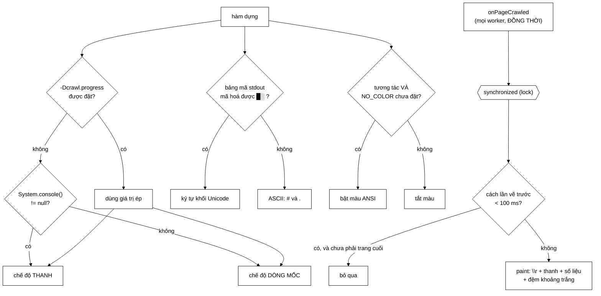

# ProgressBarCrawlListener — trả lời câu hỏi duy nhất người xem quan tâm

**File nguồn:** `search-engine/src/main/java/com/vnsearch/crawler/ProgressBarCrawlListener.java` (245 dòng)
**Gói:** `com.vnsearch.crawler` · **Loại:** `final class implements CrawlListener`
**Ghi đè:** 4/5 sự kiện (bỏ `onForeignLanguage`)
**Đọc kèm:** [`CrawlListener.md`](./CrawlListener.md) · [`ConsoleCrawlListener.md`](./ConsoleCrawlListener.md) · [`CrawlerService.md`](./CrawlerService.md)

---

## 📌 Hiểu trong 30 giây

[`ConsoleCrawlListener`](./ConsoleCrawlListener.md) ghi log: mỗi trang một dòng,
giữ lại được, phân tích sau được. Nhưng với 2.000 trang thì đó là 80 dòng cuộn
qua màn hình, và người ngồi nhìn **không trả lời được câu hỏi duy nhất họ quan
tâm**:

> **"Còn bao lâu nữa?"**

Lớp này trả lời đúng câu đó: một dòng duy nhất, cập nhật **tại chỗ**, có phần
trăm, tốc độ và thời gian còn lại ước tính.

Javadoc dòng 19–22 chỉ ra ý nghĩa kiến trúc: *"Đây chính là lợi ích mà Observer
pattern hứa hẹn — thêm một cách quan sát mới mà **không sửa một dòng nào** trong
`CrawlerService`."*



```
   BA CHẾ ĐỘ, TỰ DÒ — KHÔNG BẮT NGƯỜI DÙNG CẤU HÌNH

   ① THANH TIẾN TRÌNH   khi stdout là terminal thật
      [████████████░░░░░░░░░░░░░░░░]  43%  1290/3000  4.2 trang/s  còn ~06:47 …

   ② TỪNG DÒNG MỐC      khi output vào file / pipe (CI, > log.txt)
      ký tự \r trong file log chỉ tạo ra RÁC KHÔNG ĐỌC ĐƯỢC

   ③ ASCII THAY UNICODE khi bảng mã stdout không mã hoá nổi ký tự khối
      không kiểm tra → thanh hiện ra thành MỘT HÀNG DẤU HỎI
```

---

## 1. Ba chế độ tự dò — mỗi chế độ chặn một lỗi thật

### 1.1 Chế độ tương tác: `System.console()`

```java
private static boolean detectInteractive() {
    String forced = System.getProperty("crawl.progress");
    if (forced != null) return forced.equalsIgnoreCase("bar");
    return System.console() != null;
}
```

```
   Nếu LUÔN dùng \r:
        chạy trong CI  →  mvn test > build.log
        → build.log chứa hàng nghìn ký tự \r
        → mở bằng trình soạn thảo: một đống rác chồng lên nhau
        → grep không dùng được, cuộn không dùng được
```

Javadoc dòng 91–93 nêu lý do phải có **lối thoát thủ công**:

> `System.console()` trả về `null` trong nhiều môi trường **thật sự có terminal**
> (một số IDE, một số trình bao bọc tiến trình).

```powershell
# Ép chế độ khi việc tự dò đoán sai
java -Dcrawl.progress=bar   -jar app.jar
java -Dcrawl.progress=lines -jar app.jar
```

Nguyên tắc: **tự dò cho trường hợp thường, để lối thoát cho trường hợp lạ.** Chỉ
tự dò thì người dùng bị kẹt; chỉ cấu hình thì 99% người dùng phải làm việc thừa.

### 1.2 Bảng mã: `stdout.encoding`, không phải `file.encoding`

Đây là chi tiết đúng nhất và ít ai biết nhất trong cả file:

```java
private static Charset stdoutCharset() {
    for (String key : new String[] {"stdout.encoding", "native.encoding", "file.encoding"}) {
        String name = System.getProperty(key);
        if (name == null) continue;
        try { return Charset.forName(name); } catch (RuntimeException ignored) { }
    }
    return StandardCharsets.UTF_8;
}
```

Javadoc dòng 103–107:

> Bảng mã **thật sự** của `System.out`, **không phải** bảng mã mặc định của JVM:
> trên Windows hai thứ này **khác nhau**, và đoán sai thì thanh tiến trình hiện
> ra thành dấu hỏi.

```
   Trên Windows tiếng Việt:
        file.encoding   = UTF-8      (mặc định JVM từ Java 18)
        stdout.encoding = windows-1258  hoặc  IBM866
                          ↑ console dùng bảng mã KHÁC

   Dùng file.encoding để quyết định:
        "UTF-8 mã hoá được █░"  → dùng ký tự khối
        nhưng console thật thì KHÔNG hiển thị được
        → [????????????????????????????]  ← một hàng dấu hỏi

   Dùng stdout.encoding:
        "windows-1258 KHÔNG mã hoá được █░" → dùng # và .
        → [############................]  ← đọc được
```

Thứ tự thử ba khoá là **thứ tự độ chính xác giảm dần**, và vòng `for` với
`try/catch` xử lý cả trường hợp JVM cũ không có `stdout.encoding` lẫn trường hợp
tên bảng mã không hợp lệ. Dự phòng cuối là UTF-8 — lựa chọn an toàn nhất.

Cách kiểm tra cũng đúng: `canEncode("█░")` hỏi **chính bảng mã đó** thay vì đoán
theo tên. Không có danh sách cứng "UTF-8 thì được, còn lại thì không".

### 1.3 Màu: tôn trọng `NO_COLOR`

```java
this.color = interactive && System.getenv("NO_COLOR") == null;
```

Hai điều kiện, hai lý do:

```
   !interactive → tắt màu
        mã ANSI "\033[32m" lọt vào file log biến thành rác:
        ESC[32m[####...]ESC[0m  ← đọc không nổi

   NO_COLOR có đặt → tắt màu
        quy ước chung của cộng đồng (no-color.org)
        dành cho người dùng terminal không hỗ trợ màu,
        hoặc người dùng trình đọc màn hình
```

Tôn trọng một quy ước liên công cụ là chi tiết nhỏ nhưng cho thấy tác giả biết
hệ sinh thái mình đang viết cho.

### 1.4 Escape bát phân thay ký tự ESC thô — dòng 52–54

```java
private static final String ESC_RESET = "\033[0m";
```

> Một ký tự điều khiển **vô hình** nằm trong mã nguồn là thứ dễ mất khi sao chép
> và **không ai nhìn thấy để sửa**.

Nếu viết ký tự ESC thật (mã 27) vào chuỗi, nó không hiển thị trong trình soạn
thảo, `git diff` cũng không cho thấy — và một lần dán qua trình soạn thảo khác
là mất, để lại `[0m` in ra màn hình.

---

## 2. Vẽ tại chỗ bằng `\r` — ba chi tiết dễ sai

### 2.1 Đệm khoảng trắng để xoá đuôi dòng cũ

```java
int padding = Math.max(0, lastLineLength - plain.length());
System.out.print("\r" + shown + " ".repeat(padding));
```

```
   Lần vẽ 1:  [████░░░░] 15%  1290/3000  hàng đợi 12847  8 host  0 lỗi
                                          ─────────────
   Lần vẽ 2:  [██████░░] 45%  2100/3000  hàng đợi 340  3 host  2 lỗi
                                          ───────────

   KHÔNG đệm:
   [██████░░] 45%  2100/3000  hàng đợi 340  3 host  2 lỗi  0 lỗi
                                                           ↑↑↑↑↑
                                            ĐUÔI CỦA DÒNG CŨ còn lại
```

### 2.2 Đo độ dài theo `plain`, không theo `shown`

```java
// Đo theo `plain` vì mã màu ANSI chiếm ký tự nhưng không chiếm cột nào.
int padding = Math.max(0, lastLineLength - plain.length());
```

```
   shown = "\033[32m[████░░]\033[0m \033[1m45% …\033[0m"
            ───────         ──────  ───────      ───────
            5 ký tự         4 ký tự  4 ký tự      4 ký tự
            → 17 ký tự KHÔNG chiếm cột nào trên màn hình

   Đo theo shown → đệm THỪA 17 khoảng trắng → dòng bị đẩy xuống hàng
```

### 2.3 Trang cuối **luôn** được vẽ

```java
if (now - lastRepaintMs < MIN_REPAINT_MS && e.pageNumber() != e.maxPages()) {
    return;
}
```

Comment dòng 133–134:

> Nếu bỏ, thanh tiến trình đứng mãi ở **99%** rồi biến mất — trông như crawl
> **chết giữa chừng**.

Cùng loại chi tiết với `|| e.pageNumber() != e.maxPages()` của
[`ConsoleCrawlListener`](./ConsoleCrawlListener.md) mục 1.1 — hai lớp, hai cách
cài, cùng một quan tâm: **kết thúc phải nhìn thấy được**.

### 2.4 Tiết lưu 10 khung/giây

```java
private static final long MIN_REPAINT_MS = 100;
```

> Mắt người không phân biệt được nhanh hơn thế, còn terminal thì **phải trả giá
> cho từng lần vẽ**.

```
   Không tiết lưu, crawl 30 trang/giây:
        30 lần vẽ/giây × ~100 byte = 3 KB/s vào terminal
        → terminal chậm (đặc biệt qua SSH) thành nút thắt
        → và mắt không thấy khác gì so với 10 khung/giây
```

Tiết lưu theo **thời gian** chứ không theo số trang — đúng, vì tốc độ crawl thay
đổi trong phiên. Tiết lưu theo `everyN` sẽ vẽ quá dày lúc nhanh và quá thưa lúc
chậm.

---

## 3. `onError` chỉ **đếm**, không in

```java
@Override
public void onError(String url, Exception error) {
    errors.incrementAndGet();
}
```

Javadoc dòng 143–147:

> In một dòng lỗi giữa lúc thanh tiến trình đang chiếm dòng hiện tại sẽ **cắt
> đôi nó thành hai mẩu rác**. Tổng số lỗi vẫn hiện ngay trên thanh, còn URL cụ
> thể thì đăng ký kèm `ConsoleCrawlListener` — nó ghi ra log, **nơi dành cho chi
> tiết**.

```
   Nếu in trực tiếp:
   [██████░░░░] 45%  2100/3000  4.2 trWARN Khong the fetch https://a.vn/x
   ang/s  còn ~03:12  hàng đợi 340
   ↑ thanh bị CẮT ĐÔI, cả hai phần đều vô nghĩa

   Cách đang dùng:
   [██████░░░░] 45%  2100/3000  4.2 trang/s  còn ~03:12  …  12 lỗi  84 trùng
                                                             ──────  ────────
                                                             số tổng hiện tại chỗ
   chi tiết → log của ConsoleCrawlListener
```

Đây là **phân công trách nhiệm giữa hai listener**, và nó chỉ khả thi vì mẫu
Observer cho phép chạy nhiều listener song song:

| | `ProgressBarCrawlListener` | `ConsoleCrawlListener` |
|---|---|---|
| Trả lời | "Còn bao lâu nữa?" | "Chuyện gì đã xảy ra?" |
| Hình thức | Một dòng, ghi đè tại chỗ | Nhiều dòng, giữ lại |
| Lỗi | Chỉ đếm | In URL cụ thể |
| Dùng khi | Ngồi nhìn crawl chạy | Phân tích sau, hoặc chạy CI |

> ⚠️ **Xung đột còn lại:** nếu đăng ký **cả hai** ở chế độ tương tác, các dòng
> log của `ConsoleCrawlListener` vẫn sẽ cắt ngang thanh tiến trình — vì chúng đi
> qua SLF4J chứ không qua khối `synchronized` của lớp này. Javadoc dòng 21–22 có
> nhắc *"xem ghi chú về xung đột ở `onError`"*, nhưng ghi chú đó chỉ giải quyết
> phần lỗi **của chính lớp này**. Xem đề xuất 2.

---

## 4. `startMs` lấy ở hàm dựng, không phải trang đầu

```java
this.startMs = System.currentTimeMillis();
```

Comment dòng 84–86:

> Giai đoạn phân giải DNS và tải `robots.txt` **trước trang đầu tiên** cũng là
> thời gian người dùng phải chờ, tính sót đi thì **tốc độ báo ra cao hơn thực
> tế**.

```
   Lấy mốc ở trang đầu:
        t=0     bắt đầu — phân giải DNS 50 host, tải 50 robots.txt (~12 giây)
        t=12s   trang đầu tiên xong  ← mốc bắt đầu bị tính TỪ ĐÂY
        t=72s   1.000 trang
        → báo 1000/60 = 16,7 trang/s     ← SAI
        → ETA quá lạc quan → người dùng tưởng sắp xong rồi lại chờ mãi

   Lấy mốc ở hàm dựng:
        → báo 1000/72 = 13,9 trang/s     ← đúng với trải nghiệm thật
```

Nguyên tắc: **ETA phải đo cái người dùng cảm nhận, không phải cái hệ thống muốn
tính.**

### 4.1 ETA dùng tốc độ **trung bình**, không phải tức thời

Comment dòng 215–218:

```
   Tốc độ TỨC THỜI:   phản ứng nhanh hơn nhưng NHẢY LOẠN
        "còn ~02:11" → "còn ~18:43" → "còn ~03:05"
        → người xem mất niềm tin vào con số

   Tốc độ TRUNG BÌNH: ổn định
        và tốc độ crawl bị CHẶN TRÊN bởi politeness delay
        → nó vốn khá ổn định → trung bình là lựa chọn đúng ở đây
```

Và Javadoc thừa nhận giới hạn: *"Con số này vẫn chỉ là ước lượng: frontier cạn
sớm thì phiên crawl kết thúc trước ETA."* — ETA giả định crawl sẽ chạy đủ
`maxPages`, điều không phải lúc nào cũng đúng.

---

## 5. Hướng dẫn về code

### 5.1 An toàn luồng: khối đồng bộ bao toàn bộ phần vẽ

```java
public void onPageCrawled(CrawlEvent e) {
    synchronized (lock) {
        ...
    }
}
```

Javadoc dòng 38–42:

> Hai luồng cùng ghi vào một dòng terminal sẽ **trộn lẫn thành ký tự vô nghĩa**.
> Khối đồng bộ này **không phải nút thắt cổ chai** — nó chỉ giữ trong vài chục
> micro giây, còn mỗi trang crawl mất hàng trăm mili giây vì politeness delay.

Lập luận này giống hệt [`UrlSeenFilter`](./UrlSeenFilter.md) mục 4.2: **so sánh
thời gian giữ khoá với thời gian của thao tác chậm nhất.** Ở đây tỉ lệ là
~50 µs / ~200.000 µs ≈ 0,025%.

`errors` và `duplicates` dùng `AtomicInteger` vì chúng được **tăng ngoài** khối
đồng bộ (trong `onError`, `onDuplicateContent`) nhưng **đọc trong** khối đó.

### 5.2 Chống chia cho 0 ở ba chỗ

```java
double ratio = e.maxPages() <= 0 ? 0 : Math.min(1.0, (double) e.pageNumber() / e.maxPages());
double rate  = elapsedMs > 0 ? e.pageNumber() * 1000.0 / elapsedMs : 0.0;
String eta   = rate > 0 ? formatDuration(...) : "--:--";
```

`Math.min(1.0, …)` cũng đáng chú ý: nếu `pageNumber` vượt `maxPages` (có thể xảy
ra khi nhiều worker cùng hoàn tất ở ranh giới), thanh sẽ không tràn ra ngoài
`BAR_WIDTH`.

`"--:--"` thay vì `"00:00"` khi chưa tính được ETA — nói rõ "chưa biết" thay vì
"sắp xong".

### 5.3 `compact()` — giữ dòng trong 80 cột

```java
private static String compact(int value) {
    if (value < 10_000) return Integer.toString(value);
    return String.format(Locale.US, "%.1fk", value / 1000.0);
}
```

`frontierSize` có thể lên tới hàng chục nghìn (xem
[`CrawlListener.md`](./CrawlListener.md) mục 2.1). `"12847"` → `"12.8k"` tiết
kiệm 2 cột — nhỏ, nhưng dòng đã sát 80 cột và tràn dòng phá hỏng hiệu ứng vẽ đè.

`BAR_WIDTH = 28` cũng được chọn theo cùng ràng buộc: *"rộng vừa đủ để thấy tiến
triển từng phần trăm mà vẫn lọt terminal 80 cột."*

### 5.4 `Locale.US` trong mọi `String.format`

```java
String.format(Locale.US, " %3.0f%%", ratio * 100)
```

Bắt buộc, vì locale mặc định quyết định dấu thập phân:

```
   Locale mặc định = vi-VN (hoặc de-DE, fr-FR):
        "%.1f" cho 4.2  →  "4,2"    ← dấu PHẨY

   Trong một dòng có nhiều số cách nhau bằng khoảng trắng, dấu phẩy làm
   người đọc (và mọi script phân tích) hiểu nhầm ranh giới trường.
```

Cùng họ với `Locale.ROOT` đã gặp năm lần trong dự án — nhưng ở đây là `Locale.US`
vì mục đích là **định dạng số để hiển thị**, không phải chuẩn hoá chuỗi.

### 5.5 Cạm bẫy khi sửa lớp này

| Cạm bẫy | Hậu quả | Cách đúng |
|---|---|---|
| Luôn dùng `\r` | File log CI thành rác không đọc được | Giữ `detectInteractive` |
| Dùng `file.encoding` thay `stdout.encoding` | Thanh hiện thành hàng dấu hỏi trên Windows | Giữ thứ tự ba khoá |
| Đo `padding` theo chuỗi **có màu** | Đệm thừa → tràn dòng | Đo theo `plain` |
| Bỏ điều kiện vẽ trang cuối | Thanh đứng ở 99% rồi biến mất | Giữ |
| In lỗi trực tiếp trong `onError` | Cắt đôi thanh tiến trình | Chỉ đếm |
| Bỏ `synchronized` | Ký tự trộn lẫn từ nhiều worker | Giữ |
| Lấy `startMs` ở trang đầu | Tốc độ và ETA lạc quan hơn thực tế | Giữ ở hàm dựng |
| Ký tự ESC thô trong mã nguồn | Mất khi sao chép, không ai thấy để sửa | Giữ `\033` |
| Bỏ `Locale.US` | Dấu phẩy thập phân làm nhiễu dòng | Giữ |
| Bỏ tiết lưu 100 ms | Terminal chậm (qua SSH) thành nút thắt | Giữ |

---

## 6. Độ phức tạp & chi phí

| Thao tác | Chi phí | Luồng |
|---|---|---|
| `onPageCrawled` — bị tiết lưu | $O(1)$, ~50 ns (khoá + so sánh) | worker |
| `onPageCrawled` — có vẽ | $O(W)$ ≈ 30–80 µs ($W$ = bề rộng dòng) | worker |
| `onError` / `onDuplicateContent` | $O(1)$, ~5 ns | worker |
| `onFinished` | $O(1)$ | worker |

```
   Phiên 31.030 trang, ~4 trang/giây (tức ~2 giờ):
        số lần vẽ tối đa = 2 giờ × 10 khung/giây = 72.000
        nhưng chỉ có 31.030 sự kiện → vẽ tối đa 31.030 lần
        thực tế: ~4 sự kiện/giây < 10 khung/giây → gần như MỌI sự kiện đều vẽ

        31.030 × 50 µs ≈ 1,55 giây trên cả phiên  ≈ 0,02%
```

Tiết lưu 100 ms **không có tác dụng** ở tốc độ 4 trang/giây — nó chỉ có ý nghĩa
khi crawl nhanh (corpus nhỏ, cache nóng, hoặc máy chủ giả trong test). Đó là
thiết kế đúng: chi phí bằng không khi không cần, có tác dụng khi cần.

An toàn luồng: giữ khoá ~50 µs so với ~200.000 µs mỗi trang ⇒ **0,025%** tranh
chấp.

---

## 7. Kiểm thử liên quan

Lớp này **không có test riêng**, và đó là lựa chọn hợp lý một phần: phần lớn nội
dung là hiệu ứng trên terminal, khó khẳng định bằng assert.

Nhưng **bốn hàm thuần** thì test được trực tiếp, và chúng chứa logic thật:

```java
// 1. formatDuration — ranh giới giờ/phút
assertEquals("00:45",   formatDuration(45_000));
assertEquals("02:30",   formatDuration(150_000));
assertEquals("1:00:00", formatDuration(3_600_000));   // ← đổi định dạng ở 60 phút
assertEquals("00:00",   formatDuration(-5));          // ← số âm không gây rác

// 2. compact — ngưỡng 10.000
assertEquals("9999",  compact(9_999));
assertEquals("10.0k", compact(10_000));               // ← ngay tại ngưỡng
assertEquals("12.8k", compact(12_847));

// 3. bar — tỷ lệ tràn bị kẹp
// pageNumber > maxPages → không được vượt BAR_WIDTH ô
// maxPages = 0          → không chia cho 0

// 4. stdoutCharset — dự phòng khi mọi khoá đều thiếu
```

Bốn hàm này hiện đều `private` (trừ `compact` và `formatDuration` là `static
private`), nên muốn test phải nới lên package-private — đúng cách
[`CheckpointCrawlListener.isDueForCheckpoint`](./CheckpointCrawlListener.md) đã
làm, và có lý do được ghi rõ ở đó.

Kiểm tra bằng tay ba chế độ:

```powershell
cd search-engine
# ① Thanh tiến trình
.\mvnw.cmd -q compile exec:java "-Dexec.mainClass=com.vnsearch.crawler.MultiDomainCrawlRunner" "-Dcrawl.progress=bar"

# ② Dòng mốc (ép, dù đang ở terminal)
.\mvnw.cmd -q compile exec:java "-Dexec.mainClass=com.vnsearch.crawler.MultiDomainCrawlRunner" "-Dcrawl.progress=lines"

# ③ Kiểm tra file log KHÔNG có \r — đây là ca dễ hỏng nhất
.\mvnw.cmd -q compile exec:java "-Dexec.mainClass=com.vnsearch.crawler.MultiDomainCrawlRunner" > log.txt
Select-String -Path log.txt -Pattern "`r" -Encoding utf8   # không có kết quả = đúng
```

---

## 8. Liên kết

- Interface: [`CrawlListener.md`](./CrawlListener.md)
- Listener bổ trợ (chi tiết vào log): [`ConsoleCrawlListener.md`](./ConsoleCrawlListener.md)
- Listener anh em: [`CheckpointCrawlListener.md`](./CheckpointCrawlListener.md)
- Nơi đăng ký listener: [`CrawlerService.md`](./CrawlerService.md)
- Nguồn `frontierSize`/`domainCount` hiển thị trên thanh: [`frontier/UrlFrontier.md`](./frontier/UrlFrontier.md)
- Chương trình chạy thử có thanh tiến độ: [`MultiDomainCrawlRunner.md`](./MultiDomainCrawlRunner.md)
- Tổng quan: `docs/ARCHITECTURE.md`, `docs/CONFIGURATION.md`
