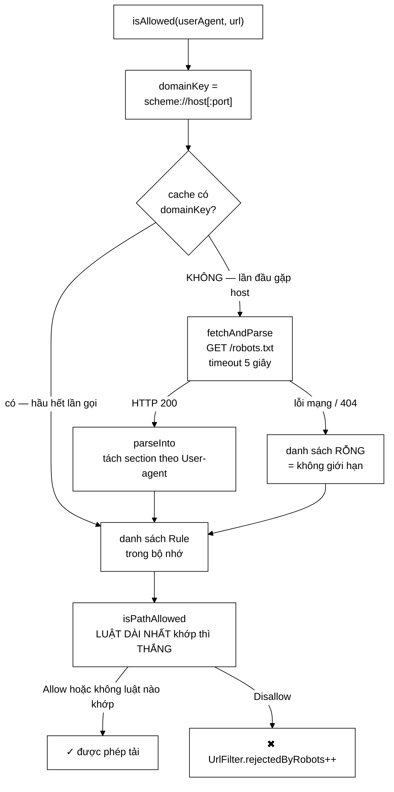

# RobotsTxtParser — lịch sự với máy chủ, và vì sao lỗi mạng thì *cho phép*

**File nguồn:** `search-engine/src/main/java/com/vnsearch/crawler/RobotsTxtParser.java` (170 dòng)
**Gói:** `com.vnsearch.crawler` · **Loại:** `class` có cache, tự viết (không dùng `crawler-commons`)
**Người dùng:** [`UrlFilter.isAllowedByRobots`](./UrlFilter.md) — tầng lọc **đắt**
**Đọc kèm:** [`UrlFilter.md`](./UrlFilter.md) · [`HtmlDownloader.md`](./HtmlDownloader.md) · [`SeedUrlValidator.md`](./SeedUrlValidator.md)

---

## 📌 Hiểu trong 30 giây

`robots.txt` là **giao ước xã hội của web**: chủ trang tuyên bố đường nào crawler
được vào, đường nào không. Không có cơ chế kỹ thuật nào ép tuân thủ — nó hoàn
toàn dựa vào sự tự giác.

Lớp này tải, phân tích và ghi nhớ tệp đó cho từng miền. Ba quyết định đáng chú ý:

1. **Tự viết**, không dùng thư viện — để giải thích được từng dòng.
2. **Cache theo miền** — tải qua mạng là thao tác chậm, không thể lặp lại cho
   mỗi URL của cùng một miền.
3. **Lỗi thì cho phép**, không chặn — nghe ngược, nhưng đúng chuẩn.



```
   VÌ SAO PHẢI CACHE — CON SỐ CỤ THỂ

   Phiên crawl 31.030 trang trên ~50 host phân biệt:

   ── Không cache ──────────────────────────────────────────────────
   31.030 lần tải robots.txt × ~200 ms = 6.206 GIÂY (1 giờ 43 phút)
        chỉ để hỏi đi hỏi lại CÙNG MỘT CÂU HỎI
        và 31.030 request thừa gửi tới máy chủ người ta
        ↑ chính là hành vi BẤT LỊCH SỰ mà robots.txt sinh ra để ngăn

   ── Có cache (đang dùng) ─────────────────────────────────────────
   ~50 lần tải × 200 ms = 10 GIÂY, một lần cho mỗi host
```

---

## 1. Vấn đề: giao ước không có cơ chế cưỡng chế

```
   robots.txt KHÔNG phải là bảo mật.
        Nó không chặn được ai. Không có mật khẩu, không có tường lửa.
        Một crawler bỏ qua nó thì vẫn tải được mọi trang.

   Nó là một TUYÊN BỐ Ý ĐỊNH:
        "phần này của trang tôi không muốn bị crawler đụng vào"

   Tôn trọng nó là điều kiện để crawler được coi là hợp lệ:
        ├─ không bị chặn IP
        ├─ không gây tải lên phần nặng của máy chủ (tìm kiếm nội bộ, giỏ hàng)
        └─ và với một đồ án: cho thấy tác giả hiểu trách nhiệm của công cụ mình viết
```

Với một đồ án tốt nghiệp, việc **có** lớp này quan trọng hơn việc nó hoàn hảo:
một crawler bỏ qua `robots.txt` là một crawler không thể đem ra dùng thật.

---

## 2. Bản đồ lớp

```
RobotsTxtParser
├── record Rule(String path, boolean isAllow)   ── package-private
│
├── cache      : ConcurrentHashMap<String domainKey, List<Rule>>
├── httpClient : HttpClient (connectTimeout 5 giây)
│
├── isAllowed(userAgent, url)   public   ── điểm vào duy nhất
├── isPathAllowed(rules, path)  package  ── luật dài nhất thắng
├── parseForTest(content, ua)   package  ── phân tích KHÔNG cần mạng
├── fetchAndParse(key, ua)      private  ── tải + phân tích
├── parseInto(content, ua, out) private  ── máy trạng thái theo section
└── main(String[])                       ── demo cho báo cáo
```

### 2.1 `domainKey` gồm cả scheme và port — dòng 46

```java
String domainKey = uri.getScheme() + "://" + uri.getHost()
        + (uri.getPort() > 0 ? ":" + uri.getPort() : "");
```

Không phải chỉ `host`. Lý do: `robots.txt` được định nghĩa theo **origin**, và
mỗi origin có tệp riêng:

```
   http://a.vn/robots.txt        ┐
   https://a.vn/robots.txt       ├─ BA tệp khác nhau, có thể có nội dung khác nhau
   https://a.vn:8443/robots.txt  ┘

   Nếu khoá cache chỉ là "a.vn":
        luật của bản http bị áp cho bản https (hoặc ngược lại)
        → có thể crawl vào đường bị cấm, hoặc bỏ qua đường được phép
```

Khoá này cũng chính là tiền tố để dựng URL tải: `domainKey + "/robots.txt"`
(dòng 83) — một biến dùng cho hai việc, không có chỗ để lệch nhau.

### 2.2 `computeIfAbsent` — vì sao đúng và một điểm cần lưu ý

```java
List<Rule> rules = cache.computeIfAbsent(domainKey, key -> fetchAndParse(key, userAgent));
```

`computeIfAbsent` của `ConcurrentHashMap` bảo đảm hàm tính toán chạy **đúng một
lần** cho mỗi khoá, kể cả khi nhiều worker cùng gặp một host mới:

```
   8 worker cùng lúc gặp host mới "cand.com.vn":
        ── Nếu dùng if (!cache.containsKey) { fetch } ──
           8 lần tải robots.txt song song → 8 request thừa

        ── Với computeIfAbsent ──
           1 worker tải, 7 worker CHỜ rồi dùng chung kết quả
```

> ⚠️ **Điểm cần lưu ý:** `computeIfAbsent` giữ khoá trên **bucket** của bảng
> băm trong suốt thời gian hàm chạy — ở đây là một lời gọi mạng tới 5 giây.
> Các worker gặp **host khác** không bị chặn (khác bucket), nhưng đây là một
> thao tác vào/ra nằm trong vùng khoá của cấu trúc dữ liệu, điều mà tài liệu
> của `ConcurrentHashMap` khuyến cáo tránh. Ở quy mô này (một lần mỗi host) thì
> chấp nhận được; xem đề xuất 3.

Một điểm tinh tế khác: `userAgent` được dùng bên **trong** hàm tính toán, nhưng
**không** nằm trong khoá cache. Nếu ai đó gọi `isAllowed` với hai user-agent
khác nhau trên cùng một host, lần gọi thứ hai sẽ nhận luật đã phân tích cho
user-agent thứ nhất. Trong dự án này chỉ có một user-agent
([`HtmlDownloader.USER_AGENT`](./HtmlDownloader.md)) nên không xảy ra — nhưng nó
là một cái bẫy chờ sẵn. Xem đề xuất 2.

---

## 3. Ba luật của `robots.txt` được cài đặt

### 3.1 "Luật cụ thể nhất thắng" — dòng 59–70

```java
boolean isPathAllowed(List<Rule> rules, String path) {
    Rule best = null;
    for (Rule rule : rules) {
        if (path.startsWith(rule.path())) {
            if (best == null || rule.path().length() > best.path().length()) {
                best = rule;                      // ← ĐƯỜNG DẪN DÀI HƠN thì thắng
            }
        }
    }
    return best == null || best.isAllow();        // ← không luật nào khớp → CHO PHÉP
}
```

Đây là quy tắc chuẩn của `robots.txt`, và nó cần thiết vì các luật **chồng lấn**:

```
   robots.txt:
        Disallow: /tin/
        Allow:    /tin/cong-khai/

   URL: https://a.vn/tin/cong-khai/bai-1
        ├─ khớp "/tin/"            (5 ký tự)  → Disallow
        └─ khớp "/tin/cong-khai/" (16 ký tự)  → Allow      ← DÀI HƠN, THẮNG
        ⇒ CHO PHÉP ✓

   URL: https://a.vn/tin/noi-bo/bai-2
        └─ chỉ khớp "/tin/"                    → Disallow
        ⇒ CẤM ✓
```

Không có quy tắc "dài nhất thắng", thứ tự trong tệp sẽ quyết định kết quả — và
`robots.txt` không định nghĩa thứ tự nào là chuẩn, nên hai crawler sẽ hiểu khác
nhau.

**`best == null` → cho phép** (dòng 69): mặc định của web là mở. Chỉ những gì bị
cấm rõ ràng mới bị cấm.

### 3.2 Section riêng **thay thế hoàn toàn** section `*` — dòng 153–154

```java
out.addAll(specificRules.isEmpty() ? wildcardRules : specificRules);
```

Đây là quy tắc dễ cài sai nhất, và code làm đúng:

```
   robots.txt:
        User-agent: *
        Disallow: /admin/
        Disallow: /search/

        User-agent: VnSearchBot
        Disallow: /rieng-tu/

   ── SAI: gộp cả hai (union) ──────────────────────────────────────
        VnSearchBot bị cấm: /admin/, /search/, /rieng-tu/

   ── ĐÚNG: section riêng THAY THẾ hoàn toàn ───────────────────────
        VnSearchBot bị cấm: CHỈ /rieng-tu/
        → được vào /admin/ và /search/
        → vì chủ trang đã viết một section RIÊNG cho bot này,
          nghĩa là họ có ý định khác với luật chung
```

Chuẩn Robots Exclusion Protocol quy định đúng như vậy: crawler chọn **một** nhóm
áp dụng cho mình, không cộng dồn nhiều nhóm.

Máy trạng thái để làm việc đó (dòng 109–128) rất gọn:

```java
boolean inWildcardSection = false;
boolean inSpecificSection = false;
...
case "user-agent" -> {
    inWildcardSection = value.equals("*");
    inSpecificSection = value.equalsIgnoreCase(userAgent);
}
```

Hai cờ độc lập, cập nhật ở mỗi dòng `User-agent:`. Luật sau đó được nạp vào
đúng danh sách tương ứng, và chỉ tới cuối mới quyết định dùng danh sách nào.

`equalsIgnoreCase` cho tên bot là đúng — chuẩn nói tên user-agent không phân biệt
hoa thường. Còn `value.equals("*")` thì dùng `equals` chính xác, cũng đúng vì
`*` không có biến thể hoa thường.

### 3.3 Bỏ chú thích và dòng không hợp lệ — dòng 113–120

```java
String line = rawLine.split("#", 2)[0].trim();       // ① cắt chú thích
if (line.isEmpty()) continue;
int colon = line.indexOf(':');
if (colon < 0) continue;                              // ② không có dấu hai chấm → bỏ
```

`split("#", 2)` với giới hạn 2 phần tử: cắt ở dấu `#` **đầu tiên**, phần còn lại
giữ nguyên dù có thêm `#`. Hiệu quả hơn `split("#")` không giới hạn vì không
phải tách hết chuỗi.

`continue` thay vì ném lỗi cho dòng méo: `robots.txt` là tệp do người viết tay,
lỗi cú pháp là chuyện thường. Một dòng hỏng không được làm mất cả tệp — cùng
triết lý với `load()` của [`JsonUserStore`](../auth/JsonUserStore.md).

### 3.4 Những gì **không** cài — và vì sao

Javadoc dòng 18–22 tuyên bố rõ phạm vi:

| Không hỗ trợ | Ví dụ | Hậu quả thực tế |
|---|---|---|
| Wildcard `*` trong đường dẫn | `Disallow: /*.pdf$` | Luật đó **không khớp** với URL nào → coi như không có |
| Neo cuối `$` | `Disallow: /tin$` | Khớp theo tiền tố thay vì khớp chính xác → **cấm nhiều hơn** dự định |
| `Crawl-delay` | `Crawl-delay: 10` | Bỏ qua — nhưng crawler có cơ chế lịch sự riêng ở [`frontier/BackQueues`](./frontier/BackQueues.md) |
| `Sitemap` | `Sitemap: https://a.vn/sitemap.xml` | Bỏ qua — mất một nguồn hạt giống tốt |

Hai dòng đầu của bảng đáng chú ý vì chúng sai **theo hai chiều ngược nhau**:

```
   Disallow: /*.pdf$
        path.startsWith("/*.pdf$")  → không URL nào bắt đầu bằng "/*"
        → luật BỊ BỎ QUA → crawler vào những chỗ chủ trang muốn cấm  ✗ QUÁ LỎNG

   Disallow: /tin$
        path.startsWith("/tin$")    → cũng không khớp gì
        → BỎ QUA luôn
   Nhưng nếu tệp ghi:  Disallow: /tin
        → khớp cả /tin-tuc, /tinh-hinh…  ✗ QUÁ CHẶT (cấm nhầm)
```

Ca "quá lỏng" là ca đáng lo hơn về mặt đạo đức crawler, và nó **thường gặp**:
`Disallow: /*?` (chặn mọi URL có query) là mẫu rất phổ biến trong `robots.txt`
thật. Đây là giới hạn nên nêu rõ khi bảo vệ — xem đề xuất 1.

`Crawl-delay` bị bỏ qua nhưng **không** có nghĩa crawler thô lỗ: cơ chế giãn
cách nằm ở [`frontier/BackQueues`](./frontier/BackQueues.md), áp dụng một khoảng
chờ cố định cho mọi host. Chỉ là nó không đọc con số mà chủ trang đề nghị.

---

## 4. Quyết định quan trọng nhất: lỗi thì **cho phép**

```java
} catch (Exception e) {
    // Nếu không fetch/parse được robots.txt (lỗi mạng, domain không tồn tại...),
    // mặc định CHO PHÉP để không chặn crawl vì lỗi hạ tầng, đúng như hành vi
    // khuyến nghị trong đặc tả Robots Exclusion Protocol khi không có robots.txt.
    return true;
}
```

Nghe ngược với bản năng "an toàn thì chặn". Nhưng ở đây **chặn mới là hành vi
sai**:

```
   ── Nếu lỗi thì CHẶN ─────────────────────────────────────────────
   mạng chập chờn 30 giây
        → robots.txt của 10 host không tải được
        → cache ghi nhớ "cấm tất cả" cho 10 host đó
        → 10 host bị loại khỏi phiên crawl HOÀN TOÀN
          (vì cache không hết hạn — xem mục 5)
        → một sự cố mạng thoáng qua làm hỏng cả phiên crawl

   ── Nếu lỗi thì CHO PHÉP (đang dùng) ─────────────────────────────
   crawl tiếp tục bình thường
        → và điều này ĐÚNG CHUẨN: không có robots.txt nghĩa là
          không có giới hạn nào được tuyên bố
```

Chuẩn Robots Exclusion Protocol quy định: **404 = không có luật = được phép
tất cả.** Code làm đúng — `fetchAndParse` chỉ phân tích khi `statusCode() == 200`
(dòng 88), mọi mã khác cho danh sách rỗng.

> ⚠️ Nhưng có một khoảng xám mà chuẩn (RFC 9309) nói khác: mã **5xx** nên được
> hiểu là "cấm tạm thời", vì máy chủ đang hỏng chứ không phải đang tuyên bố mở
> cửa. Code hiện gộp 5xx chung với 404. Xem đề xuất 4.

Và `catch (Exception e)` ở dòng 51 rộng một cách có chủ ý: `URI.create` ném
`IllegalArgumentException` với URL méo, `fetchAndParse` có thể ném bất cứ gì.
Một URL rác không được phép giết luồng worker — cùng triết lý với
[`UrlCanonicalizer`](./UrlCanonicalizer.md) mục 3.1.

`Thread.currentThread().interrupt()` ở dòng 92–94 là chi tiết đúng và hay bị
quên: bắt `InterruptedException` mà không đặt lại cờ ngắt sẽ khiến lệnh dừng
crawler bị nuốt mất, và luồng chạy tiếp như chưa có gì.

---

## 5. Hướng dẫn về code

### 5.1 `parseForTest` — package-private để test không cần mạng

```java
/** Package-private: phân tích nội dung robots.txt trực tiếp, không cần fetch mạng (dùng để unit test). */
List<Rule> parseForTest(String content, String userAgent) { ... }
```

Đây là cách xử lý đúng cho một lớp có phụ thuộc mạng:

```
   Không có parseForTest:
        muốn test luật "section riêng thay thế section *"
        → phải dựng một máy chủ HTTP giả
        → hoặc mock HttpClient (mà HttpClient là final class, khó mock)
        → test chậm, mong manh, phụ thuộc cổng mạng

   Có parseForTest:
        parser.parseForTest(NOI_DUNG_MAU, "VnSearchBot")
        → test chạy trong micro giây, xác định, không phụ thuộc gì
```

Mức truy cập **package-private** (không phải `public`) là lựa chọn cân bằng
đúng: test cùng gói dùng được, mà API công khai vẫn chỉ có một hàm `isAllowed`.
`Rule` cũng package-private với cùng lý do.

### 5.2 Cache **không bao giờ hết hạn** — giới hạn đã biết

```java
private final Map<String, List<Rule>> cache = new ConcurrentHashMap<>();
// không có TTL, không có eviction, không có refresh
```

| Hệ quả | Mức nghiêm trọng |
|---|---|
| Chủ trang sửa `robots.txt` giữa phiên crawl → không được nhận ra | Thấp — phiên crawl vài giờ, `robots.txt` hiếm khi đổi |
| Lỗi mạng thoáng qua ở lần đầu → "không luật" bị ghi nhớ mãi | **Trung bình** — nhưng vì mặc định là *cho phép* nên nó nghiêng về phía crawl nhiều hơn, không phải bỏ sót |
| Bộ nhớ tăng theo số host | Không đáng kể (~50 host × vài chục luật) |

Với một tiến trình sống vài giờ thì cache vĩnh viễn là lựa chọn hợp lý. Nếu
crawler chạy như dịch vụ thường trực thì cần TTL — xem đề xuất 3.

### 5.3 Cạm bẫy khi sửa lớp này

| Cạm bẫy | Hậu quả | Cách đúng |
|---|---|---|
| Đổi mặc định lỗi thành "chặn" | Sự cố mạng thoáng qua giết cả phiên crawl | Giữ `return true` |
| Bỏ cache | 31.030 lần tải thay vì 50 — chính là hành vi bất lịch sự | Giữ `computeIfAbsent` |
| Khoá cache chỉ bằng `host` | Luật của http áp cho https | Giữ cả scheme + port |
| Gộp section `*` và section riêng | Cấm nhiều hơn chủ trang muốn | Giữ `isEmpty() ? wildcard : specific` |
| Bỏ quy tắc "dài nhất thắng" | `Allow` không ghi đè được `Disallow` | Giữ nguyên |
| Dùng `equals` cho tên user-agent | Chủ trang viết `vnsearchbot` thì không khớp | Giữ `equalsIgnoreCase` |
| Bỏ `Thread.currentThread().interrupt()` | Lệnh dừng crawler bị nuốt | Giữ |
| Gọi `isAllowed` cho **mọi** liên kết bóc được | Xoá bỏ toàn bộ lợi ích của việc tách hai tầng | Chỉ gọi ngay trước khi tải — xem [`UrlFilter`](./UrlFilter.md) |

### 5.4 `main()` — demo cho báo cáo

```powershell
cd search-engine
.\mvnw.cmd -q compile exec:java "-Dexec.mainClass=com.vnsearch.crawler.RobotsTxtParser"
```

Demo tải `robots.txt` **thật** của `vnexpress.net` và thử ba đường dẫn, trong đó
`/wp-admin/` là đường thường bị cấm. Cần mạng để chạy — khác với demo của
[`UrlFilter`](./UrlFilter.md) và [`ContentSeenFilter`](./ContentSeenFilter.md)
vốn chạy ngoại tuyến.

---

## 6. Độ phức tạp & chi phí

Gọi $H$ = số host phân biệt (~50), $R$ = số luật của một host (thường < 50),
$F$ = kích thước tệp `robots.txt`.

| Thao tác | Thời gian | Tần suất |
|---|---|---|
| `isAllowed` — cache trúng | $O(R \cdot L)$ ≈ 2 µs | **Hầu hết lần gọi** |
| `isAllowed` — cache trượt | **~200 ms** (mạng) + $O(F)$ | $H$ lần trong cả phiên |
| `parseInto` | $O(F)$ | Một lần mỗi host |
| Bộ nhớ | $O(H \cdot R)$ ≈ vài chục KB | |

```
   Tổng chi phí trong phiên crawl 31.030 trang:
        cache trượt:  50 × 200 ms      = 10 giây
        cache trúng:  31.030 × 2 µs    = 0,06 giây
        ─────────────────────────────────────────
        TỔNG ≈ 10 giây trên tổng 1 giờ 43 phút  ≈ 0,16%
```

`isPathAllowed` duyệt **tuyến tính** toàn bộ luật (không dừng sớm) vì phải tìm
luật *dài nhất*, không phải luật *đầu tiên khớp*. Với $R < 50$ thì không sao;
một `robots.txt` có hàng nghìn luật (có thật, ở một số trang thương mại điện tử)
sẽ khiến hàm này chạy ~50 µs mỗi lần — vẫn nhỏ so với tải trang.

---

## 7. Kiểm thử liên quan

| Test | Bảo vệ điều gì |
|---|---|
| `test/java/com/vnsearch/crawler/RobotsTxtParserTest.java` | Phân tích qua `parseForTest`; quy tắc dài nhất thắng; section riêng thay thế `*` |
| `test/java/com/vnsearch/crawler/UrlFilterTest.java` | Tích hợp với tầng lọc |
| `test/java/com/vnsearch/crawler/SsrfProtectionTest.java` | Đường tải mạng nói chung |

```powershell
cd search-engine
.\mvnw.cmd -q -Dtest='RobotsTxtParserTest' test
```

Bảng ca kiểm thử cốt lõi (dùng `parseForTest`, không cần mạng):

```
   robots.txt:                          Kiểm tra với ua = "VnSearchBot"
   ─────────────────────────────        ──────────────────────────────────
   User-agent: *                        /                    → cho phép
   Disallow: /admin/                    /admin/x             → CẤM
   Disallow: /tin/                      /tin/bai-1           → CẤM
   Allow:    /tin/cong-khai/            /tin/cong-khai/bai-2 → cho phép (dài nhất thắng)
                                        /tin-tuc/bai-3       → cho phép (không khớp "/tin/")

   ── Có section riêng ────────────────────────────────────────────────
   User-agent: *                        /admin/x             → cho phép!
   Disallow: /admin/                        (section riêng THAY THẾ hoàn toàn)
                                        /rieng-tu/y          → CẤM
   User-agent: VnSearchBot
   Disallow: /rieng-tu/

   ── Tên bot khác hoa thường ─────────────────────────────────────────
   User-agent: vnsearchbot              phải khớp với "VnSearchBot"

   ── Dòng méo ────────────────────────────────────────────────────────
   "# chỉ là chú thích"                 bỏ qua
   "khong-co-dau-hai-cham"              bỏ qua, KHÔNG ném
   "Disallow:"      (giá trị rỗng)      bỏ qua (dòng 130)
   "Crawl-delay: 10"                    bỏ qua
```

Ca "`Disallow:` giá trị rỗng" đáng chú ý: theo chuẩn nó có nghĩa **"cho phép
tất cả"**, và code bỏ qua nó — dẫn tới cùng kết quả (danh sách rỗng → cho phép),
nên đúng dù bằng đường vòng.

Hai kịch bản chưa có test và nên có:

```java
// 1. Đa luồng: 8 luồng cùng gặp host mới → fetchAndParse chạy ĐÚNG MỘT LẦN
//    (đếm bằng một AtomicInteger trong lớp con ghi đè fetchAndParse)

// 2. Lỗi mạng → cho phép, không ném
assertTrue(parser.isAllowed("VnSearchBot", "https://host-khong-ton-tai-abc.vn/tin"));
```

---

## 8. Liên kết

- Người gọi duy nhất (và vì sao tách hai tầng lọc): [`UrlFilter.md`](./UrlFilter.md)
- Nguồn `USER_AGENT`: [`HtmlDownloader.md`](./HtmlDownloader.md)
- Nơi cài giãn cách giữa các lần tải cùng host: [`frontier/BackQueues.md`](./frontier/BackQueues.md)
- Kiểm tra hạt giống trước khi crawl: [`SeedUrlValidator.md`](./SeedUrlValidator.md)
- Nơi lắp ráp: [`CrawlerService.md`](./CrawlerService.md)
- Tổng quan: `docs/ARCHITECTURE.md`, `docs/SECURITY.md`
