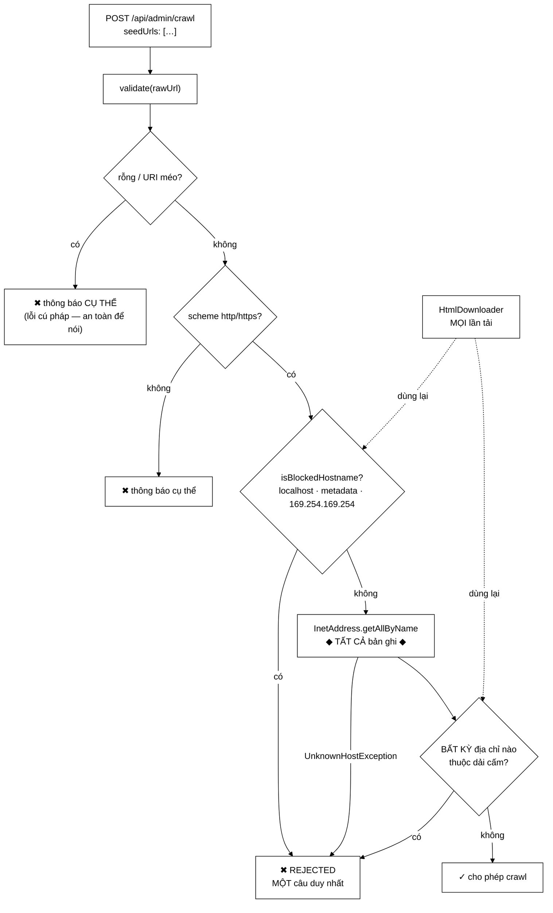

# SeedUrlValidator — lỗ hổng đã từng tồn tại, và đã được kiểm chứng

**File nguồn:** `search-engine/src/main/java/com/vnsearch/crawler/SeedUrlValidator.java` (191 dòng)
**Gói:** `com.vnsearch.crawler` · **Loại:** lớp tiện ích `final`, hàm dựng riêng tư, chỉ hàm tĩnh
**Người dùng:** `AdminController` (hạt giống từ API) · [`HtmlDownloader`](./HtmlDownloader.md) (mọi lần tải)
**Đọc kèm:** [`HtmlDownloader.md`](./HtmlDownloader.md) · [`DnsResolver.md`](./DnsResolver.md) · `docs/SECURITY.md`

---

## 📌 Hiểu trong 30 giây

Lớp này chặn **SSRF** (Server-Side Request Forgery): kẻ tấn công đưa vào một URL
để khiến máy chủ tự gửi request vào **mạng nội bộ của chính nó**.

Javadoc dòng 16 không nói "có thể xảy ra" mà nói: *"Lỗ hổng này **đã từng tồn
tại và đã được kiểm chứng**."* — kèm lệnh `curl` tái hiện và phản hồi thật.



```
   CHUỖI KHAI THÁC KHÉP KÍN — vì sao lỗ hổng này nghiêm trọng

   $ curl -X POST .../api/admin/crawl \
          -d '{"seedUrls":["http://169.254.169.254/latest/meta-data/"]}'
     {"jobId":"0fa63240-…","status":"STARTED"}
              │
              ├─ Trên máy ảo đám mây, địa chỉ đó trả về KHOÁ IAM TẠM THỜI
              │
              ├─ Nội dung tải về được đưa vào CHỈ MỤC
              │
              └─ Đọc lại qua  GET /api/search?q=AccessKeyId
                   ⇒ MỘT KÊNH RÚT DỮ LIỆU HOÀN CHỈNH

   Kẻ tấn công KHÔNG cần nhìn thấy phản hồi của request ban đầu.
   Chính máy tìm kiếm trở thành công cụ đọc bí mật hạ tầng.
```

---

## 1. Vì sao lọc trên chuỗi URL là **vô dụng**

Đây là điểm quan trọng nhất của cả file, Javadoc dòng 30–35:

```
   ── Cách SAI: chặn theo chuỗi ────────────────────────────────────
   if (url.contains("127.0.0.1") || url.contains("localhost")) reject();

   Kẻ tấn công:
        ① đăng ký evil.example.com          (tên miền công khai, hợp lệ)
        ② trỏ bản ghi A về 127.0.0.1
        ③ gửi "http://evil.example.com/"

   Chuỗi này KHÔNG có gì đáng ngờ. Không chứa "127", không chứa "localhost".
   Nhưng KẾT NỐI thì đi thẳng vào mạng nội bộ.

   ── Cách ĐÚNG: kiểm tra SAU khi phân giải DNS ────────────────────
   InetAddress[] addresses = InetAddress.getAllByName(host);
   for (addr : addresses) if (isBlockedAddress(addr)) reject();
        → xét ĐỊA CHỈ THẬT mà kết nối sẽ đi tới
```

Nguyên tắc rút ra: **kiểm tra thứ mà hệ thống sẽ thực sự dùng, không phải thứ
người dùng gõ vào.** Chuỗi URL chỉ là ý định; địa chỉ IP mới là hành động.

### 1.1 "Bất kỳ" chứ không phải "tất cả" — dòng 37–39

```java
for (InetAddress address : addresses) {
    if (isBlockedAddress(address)) { ... throw ... }   // MỘT địa chỉ xấu là đủ
}
```

```
   evil.example.com  có HAI bản ghi A:
        93.184.216.34   (công khai, vô hại)
        127.0.0.1       (nội bộ)

   ── Logic "nếu TẤT CẢ đều xấu thì chặn" ──────────────────────────
        có một địa chỉ công khai → CHO QUA
        nhưng lúc kết nối, hệ điều hành có thể chọn 127.0.0.1  → LỌT

   ── Logic "nếu BẤT KỲ địa chỉ nào xấu thì chặn" (đang dùng) ──────
        chặn ngay ✓
```

Và đây cũng là chỗ `getAllByName` khác `getByName`: hàm sau chỉ trả **bản ghi
đầu tiên**. Dùng nó là bỏ sót đúng kịch bản trên.

> ⚠️ [`DnsResolver`](./DnsResolver.md) — dùng ở đường
> [`HtmlDownloader`](./HtmlDownloader.md) — hiện gọi `getByName`, tức chỉ soi
> một địa chỉ. Hai đường vào đang **không đồng đều** ở đúng chi tiết này. Xem
> đề xuất 1.

---

## 2. `isBlockedAddress` — bảy dải địa chỉ

```java
public static boolean isBlockedAddress(InetAddress address) {
    return address.isLoopbackAddress()      // 127.0.0.0/8, ::1
            || address.isLinkLocalAddress() // 169.254.0.0/16, fe80::/10
            || address.isSiteLocalAddress() // 10/8, 172.16/12, 192.168/16
            || address.isAnyLocalAddress()  // 0.0.0.0, ::
            || address.isMulticastAddress()
            || isUniqueLocalIpv6(address)   // fc00::/7
            || isCarrierGradeNat(address);  // 100.64.0.0/10
}
```

| Dải | Nguy cơ cụ thể |
|---|---|
| `127.0.0.0/8`, `::1` | Chính máy chủ — cổng quản trị, CSDL, Redis, actuator |
| **`169.254.0.0/16`** | **Metadata đám mây** — AWS/GCP/Azure đều dùng `169.254.169.254`, trả về khoá IAM |
| `10/8`, `172.16/12`, `192.168/16` | Mạng nội bộ — router, NAS, máy chủ nội bộ khác |
| `0.0.0.0`, `::` | Mọi giao diện — hành vi phụ thuộc hệ điều hành, khó đoán |
| Multicast | Có thể dùng để dò dịch vụ trong mạng |
| `fc00::/7` | Dải riêng của IPv6 — tương đương `10/8` |
| `100.64.0.0/10` | CGNAT (RFC 6598) — hạ tầng nhà mạng / đám mây |

### 2.1 Dùng API có sẵn thay vì tự so dải bit — dòng 157–161

Javadoc nêu lý do rất cụ thể:

> Dùng các phép kiểm tra sẵn có của `InetAddress` thay vì tự so sánh dải bit:
> chúng đã xử lý đúng cả IPv4 lẫn IPv6, kể cả dạng **IPv4 nhưng trong vỏ IPv6**
> (`::ffff:127.0.0.1`) — một biến thể mà phép so sánh chuỗi tự viết gần như
> chắc chắn bỏ sót.

```
   ::ffff:127.0.0.1      ← IPv4-mapped IPv6
        Nhìn như địa chỉ IPv6, thật ra là 127.0.0.1
        Tự viết so sánh chuỗi "127." → BỎ SÓT
        address.isLoopbackAddress()  → true ✓

   Các biến thể khác cũng bị bỏ sót nếu tự viết:
        2130706433        ← 127.0.0.1 dạng số nguyên thập phân
        0x7f.0x0.0x0.0x1  ← dạng hex
        0177.0.0.1        ← dạng bát phân
        127.1             ← dạng rút gọn (hợp lệ!)
   ⇒ Tất cả đều được InetAddress phân giải đúng rồi mới kiểm tra.
```

Đây là ví dụ mẫu mực của nguyên tắc **"chuẩn hoá trước khi kiểm tra"** trong bảo
mật: đừng so sánh chuỗi đầu vào, hãy chuyển nó về dạng chuẩn (ở đây là 4 hoặc 16
byte địa chỉ) rồi mới xét.

### 2.2 Hai dải phải tự viết

`InetAddress` không có sẵn phép kiểm tra cho hai dải, nên chúng được viết tay
bằng thao tác bit:

```java
/** fc00::/7 — dải địa chỉ riêng của IPv6, không có sẵn phép kiểm tra. */
private static boolean isUniqueLocalIpv6(InetAddress address) {
    byte[] bytes = address.getAddress();
    return bytes.length == 16 && (bytes[0] & 0xFE) == 0xFC;
}
```

```
   fc00::/7 nghĩa là: 7 bit đầu phải khớp
        fc = 1111 1100
        fd = 1111 1101
             └───┬──┘└┘
              7 bit  bit tự do

   Mặt nạ 0xFE = 1111 1110  → xoá bit cuối
        (0xFC & 0xFE) == 0xFC ✓
        (0xFD & 0xFE) == 0xFC ✓
   ⇒ Bắt được cả fc00::/8 lẫn fd00::/8 bằng một phép so sánh.
```

```java
/** 100.64.0.0/10 — dải dùng chung của nhà mạng (RFC 6598). */
private static boolean isCarrierGradeNat(InetAddress address) {
    byte[] bytes = address.getAddress();
    return bytes.length == 4
            && (bytes[0] & 0xFF) == 100
            && (bytes[1] & 0xFF) >= 64 && (bytes[1] & 0xFF) <= 127;
}
```

`& 0xFF` là bắt buộc: `byte` trong Java có **dấu**, nên `100` lưu bình thường
nhưng `200` thành `-56`. Không có mặt nạ thì so sánh sai với mọi giá trị > 127.

Javadoc dòng 179–183 giải thích vì sao dải CGNAT đáng chặn dù
`isSiteLocalAddress()` không tính nó là nội bộ: *"trong một mạng đám mây nó vẫn
trỏ tới hạ tầng không công khai."* Đây là kiến thức vận hành thật, không có
trong sách giáo khoa.

### 2.3 `isBlockedHostname` — chặn theo **tên**, bổ sung cho chặn theo địa chỉ

```java
private static final Set<String> BLOCKED_HOSTNAMES = Set.of(
        "localhost", "metadata", "metadata.google.internal",
        "instance-data", "169.254.169.254");

public static boolean isBlockedHostname(String host) {
    if (host == null || host.isBlank()) return true;      // ← null = CHẶN
    String lowerHost = host.toLowerCase(Locale.ROOT);
    return BLOCKED_HOSTNAMES.contains(lowerHost) || lowerHost.endsWith(".localhost");
}
```

Javadoc dòng 57–59 nêu vì sao cần lớp này **ngoài** việc chặn theo địa chỉ:

> Tên miền nội bộ của trình điều phối container, **không phân giải được thành IP
> công khai** nhưng vẫn trỏ tới dịch vụ nội bộ.

```
   Trong một cụm Kubernetes / Docker:
        "metadata"          → phân giải qua DNS nội bộ của cụm
        "instance-data"     → tên riêng của Azure
        → phép kiểm tra ĐỊA CHỈ vẫn bắt được (chúng trỏ vào dải nội bộ)
        → nhưng chặn theo TÊN thì nhanh hơn và không cần truy vấn DNS

   ".localhost" — chuẩn RFC 6761 dành riêng, MỌI subdomain đều là localhost
        "abc.localhost", "app.localhost" → chặn hết bằng endsWith
```

**`host == null` → `true` (chặn)** là mặc định đúng cho một hàm kiểm tra bảo
mật: không biết thì từ chối. Ngược với `hostOf` của
[`DnsResolver`](./DnsResolver.md), nơi `null` chỉ là "không phân tích được".

`Locale.ROOT` lại xuất hiện — lần thứ năm trong dự án. Ở đây bỏ nó sẽ khiến
`"LOCALHOST"` trên máy locale Thổ thành `"localhost"`… vẫn đúng, nhưng
`"METADATA"` thì không có chữ `I` nên cũng an toàn. Dù vậy, thói quen nhất quán
quan trọng hơn việc phân tích từng ca.

---

## 3. Thông báo lỗi giống hệt nhau — chống *oracle*

Đây là phần tinh tế nhất của lớp, và Javadoc dòng 64–75 kể lại quá trình sửa:

```java
static final String REJECTED =
        "Seed URL khong duoc phep crawl. Kiem tra lai dia chi.";
```

> **Trước đây** lớp này trả về **ba câu khác nhau**:
> `"tro toi dia chi noi bo (10.0.3.17)"`, `"Khong phan giai duoc ten may"`, và
> không lỗi gì cả. Ba câu đó là một *oracle* hoàn chỉnh — kẻ gọi đoán được host
> nào tồn tại, host nào nằm trong mạng nội bộ, và còn đọc được cả địa chỉ IP
> thật. **Lớp chặn vẫn hoạt động đúng, nó chỉ nói quá nhiều: chặn được kết nối
> nhưng vẫn biến hệ thống thành một máy quét mạng.**

```
   BA CÂU KHÁC NHAU = MỘT MÁY QUÉT MẠNG NỘI BỘ

   kẻ tấn công thử "db.noi-bo.cong-ty.vn":
        "trỏ tới địa chỉ nội bộ (10.0.3.17)"
             ⇒ host TỒN TẠI, nằm trong mạng, IP là 10.0.3.17   ← ba thông tin!

   thử "khong-ton-tai.cong-ty.vn":
        "Không phân giải được tên máy"
             ⇒ host KHÔNG tồn tại

   thử "trang-that.com":
        không lỗi
             ⇒ host tồn tại và công khai

   ⇒ Lặp lại với một danh sách tên → VẼ ĐƯỢC SƠ ĐỒ MẠNG NỘI BỘ
     bằng chính công cụ sinh ra để bảo vệ nó.
```

Cách sửa: **hai ca khác nhau về nguyên nhân, giống hệt nhau về phản hồi.**

| Ca | Log phía máy chủ | Trả về cho kẻ gọi |
|---|---|---|
| Host trong danh sách chặn | `"tên máy nằm trong danh sách chặn (metadata)"` | `REJECTED` |
| Không phân giải được | `"không phân giải được tên máy (abc.vn)"` | `REJECTED` |
| Trỏ tới địa chỉ nội bộ | `"trỏ tới địa chỉ nội bộ: abc.vn -> 10.0.3.17"` | `REJECTED` |

Comment dòng 121–127 giải thích rõ ca khó nhất — vì sao **lỗi DNS** cũng phải
trả về đúng câu đó:

> Nếu hai ca này trả về hai câu khác nhau, kẻ gọi phân biệt được "host này không
> tồn tại" với "host này tồn tại và ở trong mạng" — tức một phép quét mạng nội
> bộ, dùng đúng chính lớp chặn SSRF làm công cụ.

### 3.1 Ba thông báo **vẫn** cụ thể — và vì sao đúng

```java
throw new IllegalArgumentException("Seed URL rong");
throw new IllegalArgumentException("Seed URL khong hop le: " + rawUrl);
throw new IllegalArgumentException("Chi chap nhan http/https, nhan duoc: " + rawUrl);
throw new IllegalArgumentException("Seed URL khong co ten may: " + rawUrl);
```

Bốn ca này nói thẳng, và đó là đúng: chúng là **lỗi cú pháp**, quyết định được
mà **không cần chạm mạng**. Chúng không tiết lộ gì về cấu trúc mạng nội bộ —
người gọi tự biết mình gõ gì.

Ranh giới rất rõ:

```
   Quyết định được KHÔNG cần chạm mạng   →  nói cụ thể (giúp người dùng sửa)
   Cần phân giải DNS mới biết            →  nói chung chung (REJECTED)
```

Cùng nguyên tắc với [`UserService`](../auth/UserService.md) mục 3.3: **chỉ tiết
lộ khi người nhận đã có quyền biết, hoặc khi việc giấu gây hại nhiều hơn lợi.**

### 3.2 Ngoại lệ là `IllegalArgumentException` — có chủ ý

Javadoc dòng 85–86: *"kèm lý do đọc được, để tầng REST trả về **400** thay vì
500."*

```
   IllegalArgumentException  → GlobalExceptionHandler → HTTP 400 Bad Request
        ⇒ "yêu cầu của bạn sai"        ← đúng
   RuntimeException khác     → HTTP 500 Internal Server Error
        ⇒ "máy chủ của tôi hỏng"       ← sai, và làm nhiễu cảnh báo vận hành
```

---

## 4. Phạm vi áp dụng — dòng 48–50

```java
/**
 * Lớp này KHÔNG áp dụng cho hạt giống trong mã nguồn
 * (MultiDomainCrawlRunner) — những URL đó do lập trình viên viết ra,
 * không phải đầu vào người dùng. Chỉ đầu vào bên ngoài mới cần lọc.
 */
```

Ranh giới đúng và đáng nêu:

```
   URL trong mã nguồn (MultiDomainCrawlRunner):
        đã qua review code, nằm trong git, không ai ngoài sửa được
        → kiểm tra ở đây chỉ thêm chi phí, không thêm an toàn

   URL từ POST /api/admin/crawl:
        do người dùng gửi lên → PHẢI kiểm tra
```

Nguyên tắc: **ranh giới tin cậy nằm ở nơi dữ liệu đi vào hệ thống, không phải ở
mọi hàm.**

> Nhưng lưu ý: kể cả hạt giống trong mã nguồn thì **mọi lần tải** vẫn đi qua
> `assertTargetAllowed` của [`HtmlDownloader`](./HtmlDownloader.md), vốn gọi lại
> `isBlockedHostname`/`isBlockedAddress`. Nên phòng thủ vẫn có ở tầng dưới —
> chỉ là kiểm tra sớm ở tầng API cho phản hồi nhanh và thông báo rõ hơn.

---

## 5. Hướng dẫn về code

### 5.1 Vì sao hai hàm là `public static`

```java
public static boolean isBlockedHostname(String host)     // dòng 147
public static boolean isBlockedAddress(InetAddress addr) // dòng 163
```

Javadoc dòng 144–145 nói rõ: *"Công khai để `HtmlDownloader` dùng lại: phép kiểm
tra này phải chạy ở **mọi** lần tải trang, không chỉ riêng hạt giống."*

Đây là **một nguồn sự thật duy nhất** cho quy tắc bảo mật. Chi tiết về vì sao
điều này quan trọng nằm ở [`HtmlDownloader.md`](./HtmlDownloader.md) mục 2.3:
hai bản cài đặt song song thì sớm muộn cũng lệch nhau.

Còn `validate()` thì gọi cả hai **cộng thêm** kiểm tra cú pháp và
`getAllByName` — nó là phiên bản "đầy đủ" cho ranh giới API.

### 5.2 Cạm bẫy khi sửa lớp này

| Cạm bẫy | Hậu quả | Cách đúng |
|---|---|---|
| Lọc theo chuỗi URL thay vì địa chỉ | Vô dụng — tên miền công khai trỏ vào nội bộ | Luôn phân giải trước |
| Dùng `getByName` thay `getAllByName` | Bỏ sót host có nhiều bản ghi A | Giữ `getAllByName` |
| Đổi thành "chặn nếu **tất cả** địa chỉ xấu" | Một địa chỉ công khai là đủ để lọt | Giữ "bất kỳ" |
| Tự so sánh dải bit thay vì dùng `InetAddress` | Bỏ sót `::ffff:127.0.0.1`, `2130706433`, `127.1` | Giữ API có sẵn |
| Đưa IP hoặc host vào thông báo trả về | Biến hệ thống thành máy quét mạng | Chi tiết chỉ vào log |
| Phân biệt "không phân giải được" và "địa chỉ nội bộ" | Oracle hoàn chỉnh — mục 3 | Cùng một `REJECTED` |
| Quên `& 0xFF` khi so byte | `byte` có dấu → so sai với giá trị > 127 | Giữ mặt nạ |
| Ném `RuntimeException` thay `IllegalArgumentException` | REST trả 500 thay vì 400 | Giữ |
| Bỏ `.localhost` khỏi `endsWith` | `abc.localhost` lọt | Giữ |

### 5.3 Những gì lớp này **không** chặn

| Không chặn | Vì sao / rủi ro còn lại |
|---|---|
| DNS rebinding | TOCTOU — xem mục 6 |
| Cổng lạ (`http://a.vn:22/`) | Có thể dò cổng của máy chủ **công khai**; ít nguy hiểm hơn nhưng vẫn là dò |
| Chuyển hướng (ở lớp này) | Đã được [`HtmlDownloader`](./HtmlDownloader.md) xử lý ở từng chặng |
| URL rất dài / rất nhiều seed | Không có trần số lượng hạt giống |

---

## 6. Hạn chế đã biết: TOCTOU / DNS rebinding

Javadoc dòng 41–46 trình bày đầy đủ:

```
   t0  validate("http://evil.com/")
            InetAddress.getAllByName → 93.184.216.34  (công khai)  ✓ QUA

   t1  crawler bắt đầu tải
            Jsoup phân giải LẦN NỮA → 127.0.0.1  (bản ghi đã đổi, TTL = 0)
                                        ↑ LỌT

   Chặn triệt để đòi:
        ghim địa chỉ IP đã kiểm tra + kết nối thẳng tới IP đó
        + tự đặt lại header Host
        → tức phải sửa cả tầng tải trang, và PHÁ SNI của HTTPS

   Kết luận của Javadoc:
        "Ở quy mô này, phép kiểm tra sau phân giải đã chặn được toàn bộ các ca
         khai thác trực tiếp; ca rebinding được ghi nhận là RỦI RO CÒN LẠI,
         không phải bị bỏ sót."
```

Cách trình bày này là điểm mạnh khi bảo vệ đồ án: **nêu rủi ro, nêu cách đóng,
nêu cái giá, rồi kết luận có ý thức.** Nó khác hẳn với việc im lặng — và cũng
khác với việc cài một giải pháp nửa vời rồi tưởng đã an toàn.

Trên thực tế, [`DnsResolver`](./DnsResolver.md) có cache nên phần lớn lần tải
dùng lại đúng địa chỉ vừa kiểm tra, thu hẹp cửa sổ này đáng kể — dù không đóng
hẳn.

---

## 7. Độ phức tạp & chi phí

| Bước | Chi phí |
|---|---|
| Kiểm tra cú pháp (`URI.create`, scheme, host) | ~1 µs |
| `isBlockedHostname` | ~0,2 µs — tra `Set` |
| **`InetAddress.getAllByName`** | **~5–50 ms** (mạng) — chi phối |
| `isBlockedAddress` × số địa chỉ | ~0,1 µs mỗi địa chỉ |
| **Tổng `validate`** | **≈ 20 ms**, gần như toàn bộ là DNS |

```
   validate chạy MỘT LẦN cho mỗi hạt giống (thường 3–10 URL)
        → tổng ~200 ms cho cả yêu cầu POST /api/admin/crawl
        → không đáng kể so với thời gian crawl hàng giờ

   isBlockedHostname / isBlockedAddress chạy ở MỌI lần tải
        → 31.030 × 0,3 µs ≈ 0,01 giây
        → miễn phí
```

Lưu ý: `validate` **không** dùng cache DNS (gọi thẳng `getAllByName`), khác với
đường qua [`DnsResolver`](./DnsResolver.md). Đúng cho một phép kiểm tra bảo mật
ở ranh giới — cache có thể chứa kết quả cũ.

---

## 8. Kiểm thử liên quan

| Test | Bảo vệ điều gì |
|---|---|
| `test/java/com/vnsearch/crawler/SsrfProtectionTest.java` | Cả hai đường vào; các dải địa chỉ; thông báo đồng nhất |

```powershell
cd search-engine
.\mvnw.cmd -q -Dtest='SsrfProtectionTest' test
```

Bảng ca kiểm thử — nhóm ① và ② chạy **không cần mạng**:

```
   ① CHẶN THEO TÊN
      localhost                    → chặn
      LOCALHOST                    → chặn (hoa/thường)
      abc.localhost                → chặn (endsWith)
      metadata                     → chặn
      metadata.google.internal     → chặn
      instance-data                → chặn
      169.254.169.254              → chặn
      null / ""                    → chặn (mặc định từ chối)
      vnexpress.net                → KHÔNG chặn

   ② CHẶN THEO ĐỊA CHỈ  (InetAddress.getByName trên literal — không truy vấn DNS)
      127.0.0.1                    → chặn (loopback)
      ::1                          → chặn
      ::ffff:127.0.0.1             → chặn  ← ca IPv4-mapped, DỄ BỎ SÓT NHẤT
      10.0.3.17                    → chặn (site-local)
      172.16.0.1                   → chặn
      192.168.1.1                  → chặn
      169.254.169.254              → chặn (link-local)
      0.0.0.0                      → chặn (any-local)
      224.0.0.1                    → chặn (multicast)
      fc00::1  /  fd12::1          → chặn (ULA IPv6)
      100.64.0.1  /  100.127.255.1 → chặn (CGNAT, hai đầu dải)
      100.63.255.255               → KHÔNG chặn (ngay TRƯỚC dải)
      100.128.0.1                  → KHÔNG chặn (ngay SAU dải)
      8.8.8.8                      → KHÔNG chặn

   ③ THÔNG BÁO ĐỒNG NHẤT
      host không tồn tại  → thông điệp == REJECTED
      host trỏ nội bộ     → thông điệp == REJECTED
      hai thông điệp PHẢI BẰNG NHAU  ← chính là test chống oracle
```

Nhóm ③ là test **quan trọng nhất và dễ bị bỏ quên nhất**: nó bảo vệ một quyết
định bảo mật mà nhìn qua trông như "thông báo lỗi kém thân thiện", và rất dễ bị
ai đó "cải thiện" thành ba câu cụ thể trở lại.

```java
@Test
void hostKhongTonTaiVaHostNoiBoTraCungMotThongBao() {
    var e1 = assertThrows(IllegalArgumentException.class,
            () -> SeedUrlValidator.validate("http://khong-ton-tai-abc-xyz.vn/"));
    var e2 = assertThrows(IllegalArgumentException.class,
            () -> SeedUrlValidator.validate("http://localhost/"));
    assertEquals(e1.getMessage(), e2.getMessage());   // ← chống oracle
}
```

Hai ca biên của dải CGNAT (`100.63.255.255` và `100.128.0.1`) cũng đáng có: thao
tác bit ở `isCarrierGradeNat` là chỗ dễ lệch một đơn vị nhất trong cả file.

---

## 9. Liên kết

- Nơi hai hàm `isBlocked*` được dùng lại ở **mọi** lần tải: [`HtmlDownloader.md`](./HtmlDownloader.md)
- Nguồn `InetAddress` ở đường tải (và sự lệch nhau ở đề xuất 1): [`DnsResolver.md`](./DnsResolver.md)
- Đường thứ hai không qua `AdminController`: [`LinkExtractor.md`](./LinkExtractor.md)
- Hạt giống trong mã nguồn — không cần kiểm tra: [`MultiDomainCrawlRunner.md`](./MultiDomainCrawlRunner.md)
- Nơi `IllegalArgumentException` thành HTTP 400: [`../config/GlobalExceptionHandler.md`](../config/GlobalExceptionHandler.md)
- Endpoint nhận hạt giống: [`../controller/AdminController.md`](../controller/AdminController.md)
- Tổng quan: `docs/SECURITY.md`
