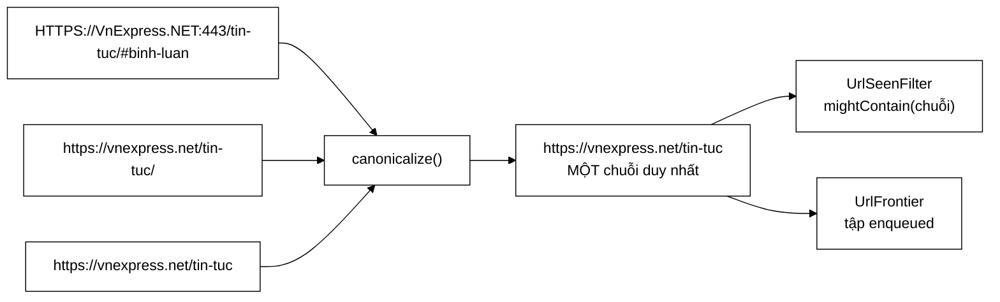

# UrlCanonicalizer — 23 cặp trang trùng nhau chỉ vì một dấu gạch chéo

**File nguồn:** `search-engine/src/main/java/com/vnsearch/crawler/UrlCanonicalizer.java` (95 dòng)
**Gói:** `com.vnsearch.crawler` · **Loại:** lớp tiện ích `final`, hàm dựng riêng tư, chỉ hàm tĩnh
**Vị trí trong luồng crawl:** chạy **trước** [`UrlSeenFilter`](./UrlSeenFilter.md) và trước khi vào frontier
**Đọc kèm:** [`UrlSeenFilter.md`](./UrlSeenFilter.md) · [`UrlFilter.md`](./UrlFilter.md) · [`LinkExtractor.md`](./LinkExtractor.md)

---

## 📌 Hiểu trong 30 giây

Cùng **một** trang web có thể xuất hiện dưới **nhiều** chuỗi URL khác nhau. Bộ
lọc Bloom và tập `enqueued` của frontier so sánh URL bằng **chuỗi**, nên chúng
coi các biến thể đó là những trang khác nhau và tải lại cùng một nội dung.

Lớp này ép mọi biến thể về một dạng biểu diễn duy nhất, và chỉ áp dụng những
phép biến đổi **an toàn theo RFC 3986** — tức là không làm thay đổi tài nguyên
được trỏ tới.



```
   HẬU QUẢ THẬT ĐO ĐƯỢC — Javadoc dòng 15–16

   Phiên crawl 5.011 trang đầu tiên, KHÔNG chuẩn hoá:
        23 CẶP trang trùng nhau, chỉ khác dấu "/" ở cuối

   Thiệt hại KHÔNG chỉ là băng thông:
        ├─ 23 trang tải thừa           → lãng phí, nhưng chịu được
        ├─ 23 bản sao vào chỉ mục      → phình chỉ mục
        └─ 23 bản sao trong KẾT QUẢ    → người dùng thấy hai dòng giống hệt
                                          ↑ ĐÂY mới là thiệt hại thật
```

---

## 1. Vấn đề: một trang, nhiều tên

Có bốn nhóm biến thể thường gặp, và tất cả đều **trỏ tới cùng một tài nguyên**:

```
   ① Fragment — chỉ có ý nghĩa trong TRÌNH DUYỆT
      https://a.vn/bai-viet#phan-2      ┐
      https://a.vn/bai-viet#binh-luan   ├─ máy chủ nhận CÙNG một request
      https://a.vn/bai-viet             ┘  (fragment KHÔNG được gửi đi)

   ② Hoa/thường ở scheme và host — RFC 3986 nói không phân biệt
      HTTPS://VnExpress.NET/tin   ┐
      https://vnexpress.net/tin   ┘

   ③ Cổng mặc định
      https://a.vn:443/tin   ┐
      https://a.vn/tin       ┘

   ④ Dấu gạch chéo cuối
      https://a.vn/tin/   ┐
      https://a.vn/tin    ┘   ← thủ phạm của 23 cặp trùng
```

Mỗi biến thể là một chuỗi khác nhau, nên với một bộ lọc dựa trên chuỗi, chúng
là bốn URL khác nhau. Nhân lên qua hàng chục nghìn trang, con số trùng lặp
không còn nhỏ.

---

## 2. Bản đồ lớp

```
UrlCanonicalizer  (final, hàm dựng private → không tạo thể hiện được)
├── canonicalize(String) : String    ── phép chuẩn hoá đầy đủ
└── stripFragment(String) : String   ── public: dùng riêng ở nơi khác
```

### 2.1 Vì sao là lớp tiện ích tĩnh

```java
public final class UrlCanonicalizer {
    private UrlCanonicalizer() { }
```

`final` + hàm dựng riêng tư = **không kế thừa được, không tạo thể hiện được**.
Đúng cho lớp này vì:

- Nó là một **hàm thuần** — cùng đầu vào luôn cho cùng đầu ra, không trạng thái.
- Nó được gọi từ **nhiều luồng worker** cùng lúc; không có trạng thái nghĩa là
  không cần đồng bộ hoá gì.
- Không có gì để cấu hình, nên không có lý do để tiêm nó vào như một phụ thuộc.

So sánh với [`UrlFilter`](./UrlFilter.md) — cũng xử lý URL nhưng **có** cấu
hình (danh sách miền cho phép), nên nó là đối tượng có trạng thái, không phải
lớp tĩnh. Hai lựa chọn khác nhau vì hai bản chất khác nhau.

### 2.2 Bốn phép biến đổi — và vì sao chỉ bốn

| Phép | Dòng | Có an toàn không | Lý do |
|---|---|---|---|
| Bỏ fragment `#...` | 50, 91–94 | ✓ Tuyệt đối | Fragment **không được gửi lên máy chủ**; nó thuần tuý là chỉ dẫn cuộn trang cho trình duyệt |
| Hạ chữ thường scheme + host | 58–59 | ✓ Theo RFC 3986 | Hai thành phần này không phân biệt hoa thường **theo chuẩn** |
| Bỏ cổng mặc định | 63–68 | ✓ | `:80` với http và `:443` với https là mặc định — có hay không đều tới cùng một nơi |
| Bỏ `/` cuối | 73–78 | ✓ *trên thực tế* | Xem cảnh báo bên dưới |

**Đường dẫn thì KHÔNG hạ chữ thường** — và đây là chi tiết quan trọng nhất:

```
   RFC 3986: scheme và host KHÔNG phân biệt hoa thường
             đường dẫn thì CÓ

   https://a.vn/Tin-Tuc   và   https://a.vn/tin-tuc
        └─ trên máy chủ Linux: HAI TỆP KHÁC NHAU
        └─ hạ chữ thường đường dẫn ⇒ 404 hàng loạt

   Javadoc dòng 23–25 ghi rõ điều này. Nó cũng giải thích vì sao code
   dùng getRawPath() chứ không phải getPath().
```

### 2.3 `getRawPath()` chứ không phải `getPath()` — dòng 70

```java
String path = uri.getRawPath();     // GIỮ NGUYÊN %20, %C3%A9…
// KHÔNG phải uri.getPath()          → GIẢI MÃ thành khoảng trắng, é…
```

```
   URL gốc:  https://a.vn/tin%20tuc/b%C3%A0i
   getPath():     /tin tuc/bài        ← đã giải mã
   getRawPath():  /tin%20tuc/b%C3%A0i ← nguyên văn

   Dùng getPath() rồi ghép lại thành chuỗi:
        → URL sinh ra có khoảng trắng và dấu tiếng Việt THÔ
        → không hợp lệ, HttpClient từ chối hoặc mã hoá lại KHÁC đi
        → URL chuẩn hoá không fetch được — lỗi tệ nhất có thể xảy ra ở lớp này
```

Cùng lý do cho `getRawQuery()` ở dòng 81. Đây là loại chi tiết mà một triển khai
vội vàng sẽ làm sai, và lỗi chỉ lộ ra khi gặp URL tiếng Việt có dấu — tức là
**rất thường xuyên** trong dự án này.

### 2.4 Cố ý *không* đụng vào query string — dòng 32–34

Đây là phần **hạn chế có chủ ý**, và lập luận của nó là điểm mạnh nhất của cả
file:

```
   ── Cám dỗ: sắp xếp tham số cho "chuẩn hơn" ───────────────────────
   ?b=2&a=1  →  ?a=1&b=2
        Với hầu hết máy chủ thì tương đương. Nhưng KHÔNG PHẢI TẤT CẢ:
        một số API ký (signature) theo đúng thứ tự tham số
        → đảo thứ tự = chữ ký sai = 403

   ── Cám dỗ: bỏ tham số theo dõi utm_* ─────────────────────────────
   ?id=5&utm_source=fb  →  ?id=5
        Thường vô hại. Nhưng một số trang dùng chính utm_* để chọn giao diện,
        hoặc để phân trang A/B → trang trả về KHÁC đi

   ⇒ Cả hai đều là chuẩn hoá KHÔNG AN TOÀN.
     Nguyên tắc: thà bỏ sót vài trang trùng còn hơn tạo ra URL không fetch được.
```

Ranh giới ở đây rất rõ ràng: **chỉ áp dụng phép biến đổi mà chuẩn bảo đảm là
tương đương, không áp dụng phép biến đổi chỉ "thường thường là đúng".**

> ⚠️ **Ngoại lệ nhỏ trong chính bảng trên:** bỏ dấu `/` cuối *về mặt chuẩn* thì
> không hoàn toàn an toàn — `/tin` và `/tin/` có thể là hai tài nguyên khác
> nhau trên một máy chủ cấu hình lạ. Trên thực tế gần như mọi máy chủ đều
> chuyển hướng cái này sang cái kia. Đây là chỗ duy nhất trong lớp chấp nhận
> rủi ro nhỏ để đổi lấy lợi ích lớn (23 cặp trùng), và nó xứng đáng.

---

## 3. Hướng dẫn về code

### 3.1 Đọc `canonicalize` theo từng bước

```java
public static String canonicalize(String rawUrl) {
    if (rawUrl == null || rawUrl.isBlank()) return rawUrl;      // ① trả nguyên, kể cả null

    String withoutFragment = stripFragment(rawUrl.trim());      // ② bỏ # TRƯỚC khi phân tích
    try {
        URI uri = URI.create(withoutFragment);
        String scheme = uri.getScheme();
        String host = uri.getHost();
        if (scheme == null || host == null) return withoutFragment;   // ③ URL tương đối

        scheme = scheme.toLowerCase(Locale.ROOT);               // ④ Locale.ROOT!
        host = host.toLowerCase(Locale.ROOT);
        ...
    } catch (Exception e) {
        return withoutFragment;                                  // ⑤ thà giữ nguyên
    }
}
```

| # | Chi tiết | Vì sao |
|---|---|---|
| ① | `null` vào → `null` ra, không ném | Người gọi là vòng lặp worker; ném ở đây làm chết cả luồng vì một URL rác |
| ② | Bỏ fragment **trước** `URI.create` | `#` trong một URL méo có thể làm `URI.create` ném; bỏ trước thì phần còn lại vẫn cứu được |
| ③ | Không có scheme/host → trả nguyên | Đây là URL **tương đối** (`/tin-tuc`). Chuẩn hoá nó không có nghĩa; việc ghép thành URL tuyệt đối thuộc về [`LinkExtractor`](./LinkExtractor.md) |
| ④ | `Locale.ROOT` | Cùng bẫy "Turkish i" như ở [`JsonUserStore`](../auth/JsonUserStore.md): `"HTTP".toLowerCase()` ở locale `tr-TR` cho `"http"` nhưng `"I"` thành `"ı"` — một host có chữ `I` sẽ bị hỏng |
| ⑤ | Bắt `Exception` rộng, trả nguyên văn | Javadoc dòng 43–44: *"thà giữ nguyên còn hơn làm hỏng một URL vốn có thể fetch được"* |

Điểm ⑤ là một quyết định quan trọng, ngược với trực giác "fail fast":

```
   URL méo mà vẫn fetch được (rất thường gặp trên web thật):
        https://a.vn/tin?q=a|b     ← ký tự | không hợp lệ theo RFC
                                     nhưng máy chủ vẫn phục vụ bình thường

   ── Ném exception  → mất trang, và có thể giết luồng worker
   ── Trả nguyên văn → URL đi tiếp, có thể tải được
                        tệ nhất là nó không được chuẩn hoá ⇒ có thể trùng lặp
                        (một lỗi NHẸ HƠN nhiều so với mất trang)
```

### 3.2 Vì sao xây lại chuỗi bằng `StringBuilder`, không dùng `URI.toString()`

`java.net.URI` **không có** API để "bỏ cổng mặc định" hay "bỏ gạch chéo cuối".
Dựng lại bằng tay là cách duy nhất. Thứ tự ghép cố định:

```
   scheme  ://  host  [:port]  [path]  [?query]
      ↑          ↑       ↑        ↑        ↑
    hạ thường  hạ thường  bỏ nếu   bỏ "/"   giữ NGUYÊN VĂN
                        mặc định   cuối     (raw, không sắp xếp)
```

Ba thành phần **bị bỏ hẳn** và không bao giờ xuất hiện trong kết quả:

| Thành phần | Vì sao bỏ |
|---|---|
| `#fragment` | Không gửi lên máy chủ |
| `userinfo` (`user:pass@host`) | `URI.getHost()` không bao gồm nó; bỏ đi là đúng — thông tin đăng nhập không nên nằm trong khoá của bộ lọc, và cũng không nên ghi vào kho URL |
| Cổng mặc định | Tương đương với không ghi |

### 3.3 `stripFragment` là `public` — có chủ ý

```java
public static String stripFragment(String url) {
    int hashIndex = url.indexOf('#');
    return hashIndex >= 0 ? url.substring(0, hashIndex) : url;
}
```

Nó `public` vì có nơi cần **chỉ** bỏ fragment mà **không** muốn chuẩn hoá đầy
đủ — ví dụ khi hiển thị URL cho người đọc, hoặc khi so sánh hai URL tương đối.
Tách ra cũng làm nó test được độc lập.

Chú ý nó **không** kiểm tra `null` (khác với `canonicalize`). Đó là chấp nhận
được vì `canonicalize` đã chặn `null` trước khi gọi, nhưng nếu ai gọi trực tiếp
từ nơi khác thì sẽ nhận `NullPointerException`. Xem đề xuất 3 ở mục 6.

### 3.4 Cạm bẫy khi sửa lớp này

| Cạm bẫy | Hậu quả | Cách đúng |
|---|---|---|
| Hạ chữ thường **đường dẫn** | 404 hàng loạt trên máy chủ Linux | Chỉ scheme + host |
| Đổi `getRawPath()` thành `getPath()` | URL tiếng Việt có dấu bị giải mã → không fetch được | Giữ `raw` |
| Sắp xếp tham số query | Hỏng URL có chữ ký | Không đụng query |
| Bỏ `utm_*` | Có trang đổi nội dung theo tham số đó | Không đụng query |
| Ném exception thay vì trả nguyên văn | Mất trang, có thể giết worker | Giữ `catch (Exception)` |
| Bỏ `Locale.ROOT` | Lỗi Turkish i | Luôn ghi rõ |
| Thêm chuẩn hoá "gỡ `../`" | `URI.normalize()` có sẵn nhưng đổi ngữ nghĩa nếu máy chủ dùng đường dẫn ảo | Cân nhắc kỹ; hiện không làm là an toàn |

### 3.5 Thêm một phép chuẩn hoá mới — danh sách kiểm tra

Trước khi thêm bất kỳ phép nào, trả lời ba câu:

1. **Chuẩn có bảo đảm tương đương không?** Nếu chỉ "thường thường đúng" → không thêm.
2. **Nếu sai thì hỏng thế nào?** URL không fetch được là lỗi nặng; trùng lặp là lỗi nhẹ.
3. **Có đo được lợi ích không?** Con số "23 cặp trùng" là cách đúng để biện minh
   cho phép bỏ gạch chéo cuối. Không có số thì không có lý do.

---

## 4. Độ phức tạp & chi phí

Gọi $L$ = độ dài URL (thực tế 50–200 ký tự).

| Bước | Chi phí |
|---|---|
| `stripFragment` | $O(L)$ — một lần quét tìm `#` |
| `URI.create` | $O(L)$ — phân tích cú pháp |
| `toLowerCase` × 2 | $O(L)$ — trên phần scheme + host, ngắn |
| Vòng bỏ `/` cuối | $O(k)$ với $k$ = số gạch chéo thừa, gần như luôn ≤ 1 |
| Ghép `StringBuilder` | $O(L)$ |
| **Tổng** | **$O(L)$ ≈ 1–2 µs** |

Đặt vào bối cảnh crawl:

```
   canonicalize        ~     1,5 µs
   Tải một trang HTTP  ~ 200.000 µs      ← chậm hơn 130.000 LẦN
   Phân tích HTML      ~   5.000 µs

   Mỗi trang sinh ~78,8 liên kết (số đo ở UrlSeenFilter)
        → 78,8 × 1,5 µs ≈ 118 µs cho toàn bộ liên kết của một trang
        → vẫn nhỏ hơn 0,06% thời gian tải trang đó.

   ⇒ Chuẩn hoá là MIỄN PHÍ so với lợi ích. Không có lý do để bỏ qua nó
     vì "sợ chậm".
```

Cấp phát: mỗi lần gọi tạo ~3 chuỗi tạm + 1 `URI` + 1 `StringBuilder`. Với 78,8
liên kết/trang × 31.030 trang ≈ 2,4 triệu lần gọi trong một phiên crawl đầy
đủ — vẫn không đáng kể so với chi phí phân tích HTML, nhưng đủ để **không** nên
gọi lặp lại nhiều lần trên cùng một URL.

---

## 5. Kiểm thử liên quan

| Test | Bảo vệ điều gì |
|---|---|
| `test/java/com/vnsearch/crawler/UrlCanonicalizerTest.java` | Bốn phép biến đổi; URL méo trả nguyên văn; URL tương đối không bị đụng |
| `test/java/com/vnsearch/crawler/UrlSeenFilterTest.java` | Hiệu quả thật: các biến thể được gộp thành một |
| `test/java/com/vnsearch/crawler/LinkExtractorTest.java` | Đường đi trước đó |

```powershell
cd search-engine
.\mvnw.cmd -q -Dtest='UrlCanonicalizerTest' test
```

Bảng ca kiểm thử tối thiểu mà lớp này cần:

```
   ĐẦU VÀO                                    KẾT QUẢ MONG ĐỢI
   ─────────────────────────────────────      ──────────────────────────
   https://a.vn/tin/                          https://a.vn/tin
   https://a.vn/tin                           https://a.vn/tin       (bất biến)
   HTTPS://A.VN/Tin                           https://a.vn/Tin       (path GIỮ hoa)
   https://a.vn:443/tin                       https://a.vn/tin
   https://a.vn:8080/tin                      https://a.vn:8080/tin  (không phải mặc định)
   https://a.vn/tin#phan-2                    https://a.vn/tin
   https://a.vn/                              https://a.vn           (gốc → rỗng)
   https://a.vn                               https://a.vn
   https://a.vn/tin?b=2&a=1                   https://a.vn/tin?b=2&a=1  (KHÔNG sắp xếp)
   https://a.vn/tin%20tuc                     https://a.vn/tin%20tuc    (raw giữ nguyên)
   /tin-tuc                                   /tin-tuc               (tương đối, trả nguyên)
   "khong-phai-url"                           "khong-phai-url"
   null                                       null
```

Đặc biệt nên có test **tính lũy đẳng** — chuẩn hoá hai lần phải ra cùng kết quả:

```java
@Test
void chuanHoaHaiLanChoKetQuaGiongNhau() {
    String mot = UrlCanonicalizer.canonicalize(url);
    assertEquals(mot, UrlCanonicalizer.canonicalize(mot));
}
```

Tính chất này quan trọng vì URL đi qua lớp này ở nhiều điểm trong luồng crawl;
không lũy đẳng thì cùng một trang vẫn có thể sinh hai chuỗi khác nhau — đúng lỗi
mà lớp sinh ra để chặn.

---

## 6. Liên kết

- Bước tiếp theo trong luồng: [`UrlSeenFilter.md`](./UrlSeenFilter.md) — nơi chuỗi chuẩn hoá thành khoá của Bloom Filter
- Nơi lọc theo miền và đuôi tệp: [`UrlFilter.md`](./UrlFilter.md)
- Nơi URL tương đối được ghép thành tuyệt đối: [`LinkExtractor.md`](./LinkExtractor.md)
- Nơi URL được xếp hàng: [`frontier/UrlFrontier.md`](./frontier/UrlFrontier.md)
- Bẫy `Locale.ROOT` tương tự: [`../auth/JsonUserStore.md`](../auth/JsonUserStore.md) mục 2.3
- Tổng quan luồng crawl: `docs/ARCHITECTURE.md`
