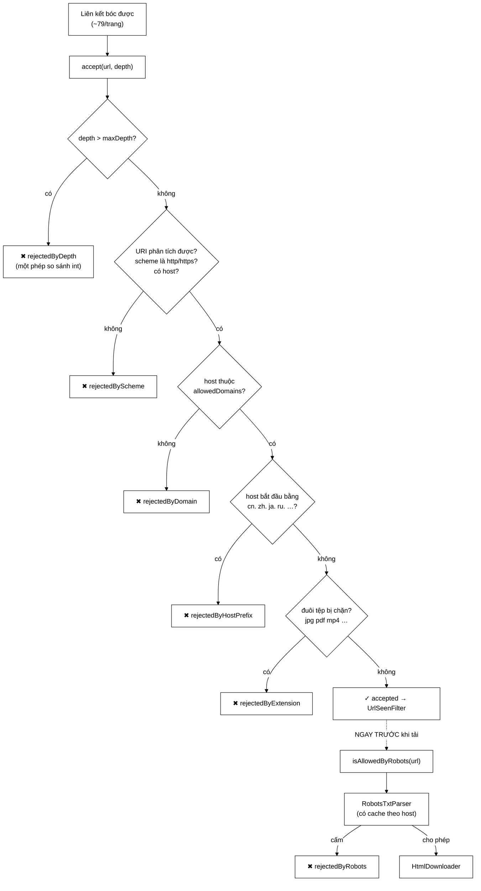

# UrlFilter — 2.533 trang tiếng Trung lọt vào chỉ mục, và cách chặn chúng trước khi tải

**File nguồn:** `search-engine/src/main/java/com/vnsearch/crawler/UrlFilter.java` (326 dòng)
**Gói:** `com.vnsearch.crawler` · **Loại:** `class` có cấu hình bất biến + bộ đếm nguyên tử
**Vị trí trong sơ đồ:** khối **"URL Filter"**, chạy sau [`UrlCanonicalizer`](./UrlCanonicalizer.md), trước [`UrlSeenFilter`](./UrlSeenFilter.md)
**Đọc kèm:** [`RobotsTxtParser.md`](./RobotsTxtParser.md) · [`LanguageFilter.md`](./LanguageFilter.md) · [`frontier/BackQueues.md`](./frontier/BackQueues.md)

---

## 📌 Hiểu trong 30 giây

Lớp này quyết định **URL nào xứng đáng được tải**. Nó có hai tầng, tách riêng
vì chi phí chênh nhau hàng nghìn lần:

| Tầng | Hàm | Chi phí | Tần suất gọi |
|---|---|---|---|
| **Rẻ** | `accept(url, depth)` | ~2 µs, không chạm mạng | ~79 lần / trang tải về |
| **Đắt** | `isAllowedByRobots(url)` | Có thể tải `robots.txt` qua mạng | 1 lần ngay trước khi tải |

Điều đáng đọc nhất trong file không phải cơ chế lọc mà là **một con số**: trong
phiên crawl 30.001 trang, **2.533 trang (8,4%)** là bản tiếng Trung của báo Việt
Nam — và chúng lọt vào chỉ mục nhưng **vĩnh viễn không thể được tìm thấy**.



```
   VÌ SAO TÁCH HAI TẦNG

   ── Gộp làm một ──────────────────────────────────────────────────
   mỗi liên kết bóc được → một lần tra robots
        31.030 trang × 79 liên kết = 2.451.370 lần tra robots
        trong đó ~90% liên kết bị loại NGAY bởi luật rẻ nhất
        → tra robots cho những URL sẽ bị vứt đi ngay sau đó

   ── Tách hai tầng (đang dùng) ────────────────────────────────────
   accept() lọc trước → chỉ ~10% sống sót → mới hỏi robots
        và robots có cache theo host → thực tế chỉ vài chục lần tải thật
```

---

## 1. Vì sao gom thành một lớp

Javadoc dòng 11–15: trước đây các phép lọc này là **một biểu thức `if` ba vế**
nằm trong vòng lặp worker của `CrawlerService`. Gom lại đem về ba lợi ích, và
lợi ích thứ ba là cái đáng giá nhất:

| Lợi ích | Cụ thể |
|---|---|
| Mỗi khối trong sơ đồ = một lớp | Sơ đồ kiến trúc và mã nguồn khớp nhau, đọc được đối chiếu |
| Kiểm thử được không cần crawl thật | `UrlFilterTest` chạy trong mili giây |
| **Đếm được từng nguyên nhân loại bỏ** | Bảy bộ đếm → số liệu đưa thẳng vào báo cáo |

Lợi ích thứ ba biến một khối logic thành một **nguồn số liệu**:

```
   Không có bộ đếm:
        "crawler chạy chậm, không biết vì sao"
        → phải thêm log tạm, chạy lại 4 tiếng, đọc log

   Có bộ đếm:
        accepted              :  247.031
        rejectedByExtension   : 1.402.887   ← ảnh chiếm phần lớn liên kết
        rejectedByDomain      :  689.220
        rejectedByHostPrefix  :   61.003    ← các bản ngoại ngữ
        rejectedByDepth       :   44.110
        rejectedByScheme      :    7.119
        → biết ngay luật nào đang làm việc, luật nào thừa
```

Đây là ví dụ của nguyên tắc: **cấu trúc code tốt không chỉ dễ đọc, nó còn tạo
ra chỗ để đo.**

---

## 2. Bản đồ lớp

```
UrlFilter
├── BLOCKED_EXTENSIONS        static, 48 đuôi tệp
├── NON_VI_EN_HOST_PREFIXES   static, 13 tiền tố ngôn ngữ
│
├── allowedDomains        : Set<String>   bất biến (Set.copyOf)
├── excludedHostPrefixes  : Set<String>   bất biến
├── maxDepth              : int
├── robotsTxtParser       : RobotsTxtParser
├── userAgent             : String
│
├── 7 × AtomicLong        ── bộ đếm, thứ DUY NHẤT thay đổi
│
├── accept(String, int)          → boolean   TẦNG RẺ
├── isAllowedByRobots(String)    → boolean   TẦNG ĐẮT
├── isAllowedDomain    private   ── endsWith
├── hasExcludedHostPrefix private ── startsWith, có dấu chấm
├── hasBlockedExtension private  ── đoạn cuối đường dẫn
├── 8 hàm getter đếm
└── main(String[])               ── demo chụp màn hình cho báo cáo
```

**An toàn đa luồng miễn phí:** cấu hình bất biến (`Set.copyOf` trong hàm dựng)
+ bộ đếm `AtomicLong`. Không có khoá nào, vì không có gì để tranh chấp. So sánh
với [`UrlSeenFilter`](./UrlSeenFilter.md) — nơi phải `synchronized` vì
`BloomFilter` có trạng thái chia sẻ thật.

---

## 3. Thứ tự kiểm tra đi theo chi phí tăng dần

Javadoc dòng 29–32 nêu nguyên tắc, và code tuân thủ nghiêm ngặt:

```
   ① depth > maxDepth        ── một phép so sánh int          ~1 ns
   ② url null / rỗng          ── một phép kiểm tra             ~1 ns
   ③ URI.create               ── PHÂN TÍCH CÚ PHÁP            ~800 ns  ← đắt nhất trong nhóm rẻ
   ④ scheme http/https        ── so sánh chuỗi ngắn            ~20 ns
   ⑤ host != null             ──                              ~1 ns
   ⑥ isAllowedDomain          ── endsWith trên vài domain      ~100 ns
   ⑦ hasExcludedHostPrefix    ── startsWith trên 13 tiền tố    ~150 ns
   ⑧ hasBlockedExtension      ── cắt chuỗi + tra Set           ~120 ns
   ─────────────────────────────────────────────────────────────────
   ⑨ isAllowedByRobots        ── CÓ THỂ TẢI QUA MẠNG      ~200.000.000 ns
                                 (tầng riêng, gọi ở nơi khác)
```

Java **đánh giá ngắn mạch**: mỗi phép chỉ chạy khi các phép trước không loại
được. Với phân bố thực tế (phần lớn liên kết bị loại ở ⑥ hoặc ⑧), chi phí trung
bình thấp hơn nhiều so với việc chạy hết cả tám phép.

> Một điểm có thể tối ưu thêm: `hasBlockedExtension` (⑧) là phép loại **nhiều
> URL nhất** (1,4 triệu trong ví dụ ở mục 1) nhưng lại đứng **cuối cùng**. Đưa
> nó lên trước `isAllowedDomain` sẽ tiết kiệm hơn — nhưng nó cần `uri.getRawPath()`
> nên vẫn phải sau `URI.create`. Xem đề xuất 4.

---

## 4. `NON_VI_EN_HOST_PREFIXES` — phần quan trọng nhất của file

Đây là 60 dòng Javadoc (dòng 58–106) cho **một tập 13 chuỗi**. Tỉ lệ đó có lý
do: nó là nơi giao nhau của bốn hệ thống khác nhau trong dự án.

### 4.1 Vì sao các bản ngoại ngữ lọt vào

```
   Hạt giống:  nhandan.vn

   isAllowedDomain dùng  host.endsWith(domain)
        └─ "cn.nhandan.vn".endsWith("nhandan.vn")  →  TRUE
        └─ subdomain tiếng Trung ĐƯỢC CHẤP NHẬN

   Rồi BackQueues chia lượt CÔNG BẰNG THEO HOST (mỗi host một hàng đợi):
        nhandan.vn        ─┐
        cn.nhandan.vn     ─┼─ mỗi host nhận ĐÚNG BẰNG phần của nhau
        en.nhandan.vn     ─┘

   ⇒ Bản tiếng Trung nhận đúng bằng lượt của bản tiếng Việt.
     Đo trên phiên 30.001 trang: 2.533 trang (8,4%) từ ba host
     cn.nhandan.vn, zh.vietnamplus.vn, cn.baochinhphu.vn
     ── và đó MỚI CHỈ LÀ BA BẢN TIẾNG TRUNG.
```

Điểm hay của phân tích này: nguyên nhân **không phải một bug**, mà là **hai
quyết định thiết kế đúng đắn tương tác với nhau**. `endsWith` đúng (nó cho phép
crawl subdomain của báo). Chia lượt công bằng theo host đúng (đó là lịch sự với
máy chủ). Kết hợp lại thì sinh ra hậu quả không ai lường trước.

### 4.2 Vì sao tiếng Trung/Nhật là ca **tệ nhất**

Javadoc dòng 77–96 đo bằng chính `VietnameseTokenizer` trên tiêu đề thật:

```
   Việt   "Văn hóa là động lực và nguồn lực phát triển quan trọng"
          →  5 token / 43 ký tự   [văn_hóa][động_lực][nguồn_lực]…      TỐT
   Anh    "Viet Nam records best-ever result at International Physics…"
          → 11 token / 63 ký tự   [viet][nam][records][best]…          TỐT
   Nga    "Высокие цены на личи: Бакнинь получил более 2,6 трлн…"
          → 12 token / 56 ký tự                                        TÁCH ĐƯỢC
   Trung  "越南国会常务委员会会议：提交国会审议通过设立广宁市和北宁市决议"
          →  2 token / 31 ký tự   [越南国会常务委员会会议][提交国会审议…]  HỎNG
```

Cơ chế của "HỎNG":

```
   Chữ Trung/Nhật KHÔNG đặt dấu cách giữa các từ.
   splitIntoSyllables tách theo khoảng trắng
        → trả về nguyên một MỆNH ĐỀ làm một token 19 ký tự

   Hậu quả trong chỉ mục:
        ┌─────────────────────────────────────────────────────────┐
        │ Token "越南国会常务委员会会议" nằm trong TermDictionary   │
        │   └─ không người dùng nào gõ ĐÚNG cả mệnh đề 19 ký tự    │
        │   └─ tài liệu VĨNH VIỄN không thể được tìm thấy          │
        │                                                          │
        │ NHƯNG nó vẫn làm tăng N trong công thức IDF:             │
        │   IDF(t) = log((N - df + 0,5) / (df + 0,5))              │
        │            ↑ N tăng 8,4% cho MỌI term khác               │
        │   → điểm BM25 của MỌI tài liệu tiếng Việt bị lệch        │
        └─────────────────────────────────────────────────────────┘
```

Đây là loại lỗi tệ nhất: **tài liệu rác không chỉ vô dụng, nó còn làm hỏng điểm
số của tài liệu tốt.** 8,4% corpus là rác chủ động gây hại.

Và Javadoc phân biệt rất chính xác hai lý do loại bỏ khác nhau:

| Ngôn ngữ | Tokenizer xử lý được? | Lý do loại |
|---|---|---|
| Trung, Nhật | **Không** — một mệnh đề = một token | Kỹ thuật: làm hỏng chỉ mục |
| Nga, Hàn, Pháp, Đức… | Có — tách token bình thường | Chính sách: corpus chỉ nhắm vi/en |

Phân biệt này quan trọng vì nó chỉ ra **điều gì sẽ thay đổi nếu tokenizer được
nâng cấp**: hỗ trợ phân đoạn tiếng Trung thì `cn.` không còn là vấn đề kỹ thuật
nữa, nhưng vẫn nằm ngoài chính sách corpus.

### 4.3 Hai tuyến phòng thủ — và vì sao cần cả hai

```
   TUYẾN 1: UrlFilter.hasExcludedHostPrefix       (lớp này)
        khi nào:  TRƯỚC khi tải
        chi phí:  ~150 ns, vài phép so sánh chuỗi
        bắt được: các host theo đúng quy ước cn./zh./ja./…
        bỏ sót:   bản ngoại ngữ nằm ở /en/, /cn/ trong ĐƯỜNG DẪN
                  hoặc subdomain đặt tên lạ

   TUYẾN 2: LanguageFilter                        (nhìn NỘI DUNG thật)
        khi nào:  SAU khi tải
        chi phí:  một lượt tải trang (~200 ms + băng thông)
        bắt được: MỌI thứ tuyến 1 bỏ sót
```

Nguyên tắc: **tuyến rẻ chặn phần lớn, tuyến đắt dọn phần còn lại.** Bỏ tuyến 1
thì phải tải 2.533 trang rồi mới vứt; bỏ tuyến 2 thì các ca lạ lọt hết.

### 4.4 Danh sách **cố ý ngắn và bảo thủ** — dòng 98–105

```
   KHÔNG có trong danh sách, có chủ ý:

   "it."  → dễ là subdomain phòng Công nghệ thông tin, không phải tiếng Ý
   "id."  → có thể là subdomain định danh, không phải tiếng Indonesia
   "my."  → "my.example.vn" = trang cá nhân, không phải tiếng Mã Lai

   Lập luận: loại NHẦM thì mất trang tiếng Việt THẬT.
             Bỏ sót thì LanguageFilter dọn được (chỉ tốn một lượt tải).
             ⇒ Hai loại sai KHÔNG cân xứng → nghiêng về phía bảo thủ.

   KHÔNG chặn "en." và "e."  → đó CHÍNH LÀ các bản tiếng Anh corpus muốn có.
```

Cùng nguyên tắc "hai loại sai không cân xứng" đã gặp ở
[`UrlStorage`](./UrlStorage.md) mục 3.1 và [`Role`](../auth/Role.md). Đây là
một **triết lý nhất quán xuyên suốt dự án**, không phải ba quyết định rời rạc —
điểm rất đáng nêu khi bảo vệ.

### 4.5 Khớp tiền tố **có dấu chấm** — dòng 242–244

```java
// Tập chứa "cn." (CÓ dấu chấm), không phải "cn"
lower.startsWith(prefix)
```

```
   Nếu dùng "cn" không có dấu chấm:
        "cnn.example.vn"        → bị loại oan
        "cntt.truongdaihoc.vn"  → bị loại oan (CNTT = Công nghệ thông tin!)

   Với "cn.":
        "cn.nhandan.vn"  → loại ✓
        "cnn.example.vn" → giữ ✓
```

Một ký tự, và nó là khác biệt giữa "lọc đúng" và "mất trang tiếng Việt".

---

## 5. Hướng dẫn về code

### 5.1 `BLOCKED_EXTENSIONS` — phép lọc tiết kiệm băng thông nhiều nhất

Javadoc dòng 41–44: không lọc thì crawler tải ảnh, video, tệp nén rồi giao cho
[`ContentParser`](./ContentParser.md) — thứ chỉ biết đọc HTML — và nhận về tài
liệu rỗng.

```
   Một trang báo điện tử điển hình:
        ~79 liên kết bóc được
             ├─ ~45 là ảnh (.jpg, .png, .webp)     ← 57%
             ├─ ~8  là tài nguyên tĩnh (.css, .js)
             ├─ ~3  là tài liệu (.pdf)
             └─ ~23 là trang HTML thật

   Không lọc: tải 56 tệp vô ích. Một ảnh ~200 KB, một video ~10 MB.
        → băng thông đội lên HÀNG CHỤC LẦN
        → và ContentParser trả về tài liệu rỗng cho tất cả
```

48 đuôi được nhóm theo mục đích trong code (ảnh / tài nguyên tĩnh / tài liệu /
nén / đa phương tiện) — cách trình bày này khiến việc thêm đuôi mới rõ ràng
thuộc nhóm nào.

**Chú ý:** ảnh bị chặn ở đây **không** mâu thuẫn với việc dự án có tìm kiếm ảnh.
Ảnh được thu thập qua đường riêng —
[`modular/ImageDownloadService`](./modular/ImageDownloadService.md) đọc thẻ
`` từ HTML — chứ không qua frontier. Hai luồng tách biệt, mỗi luồng có luật
riêng.

### 5.2 `hasBlockedExtension` — ba lớp bảo vệ khỏi dương tính giả

```java
private boolean hasBlockedExtension(String path) {
    if (path == null || path.isEmpty()) return false;         // ① không có đường dẫn → cho qua

    int lastSlash = path.lastIndexOf('/');
    String lastSegment = lastSlash >= 0 ? path.substring(lastSlash + 1) : path;   // ② CHỈ đoạn cuối

    int dot = lastSegment.lastIndexOf('.');
    if (dot < 0 || dot == lastSegment.length() - 1) return false;                 // ③ không có đuôi

    String extension = lastSegment.substring(dot + 1).toLowerCase(Locale.ROOT);
    return BLOCKED_EXTENSIONS.contains(extension);
}
```

| # | Bảo vệ khỏi | Ví dụ |
|---|---|---|
| ① | Đường dẫn rỗng (`https://a.vn`) | Trang chủ không bị loại |
| ② | Dấu chấm ở **thư mục cha** | `/anh.jpg/bai-viet` → xét `bai-viet`, không xét `anh.jpg` ✓ |
| ③ | Dấu chấm cuối chuỗi | `/bai-viet.` → không có đuôi, cho qua |

Điểm ② là chi tiết dễ làm sai nhất. Một triển khai dùng `path.endsWith(".jpg")`
sẽ đúng ở đây nhưng sai ở `/tin/anh.jpg/chi-tiet` — và một triển khai dùng
`path.contains(".jpg")` thì sai ở cả hai.

`Locale.ROOT` ở dòng 270 — cùng bẫy Turkish i đã gặp ở
[`UrlCanonicalizer`](./UrlCanonicalizer.md) và
[`JsonUserStore`](../auth/JsonUserStore.md).

### 5.3 Bốn hàm dựng — chuỗi uỷ quyền về một

```java
UrlFilter(domains, maxDepth)
UrlFilter(domains, maxDepth, excludedPrefixes)
UrlFilter(domains, maxDepth, robotsParser, userAgent)
UrlFilter(domains, maxDepth, excludedPrefixes, robotsParser, userAgent)   ← hàm dựng THẬT
```

Ba hàm đầu chỉ điền giá trị mặc định rồi gọi hàm cuối. Mọi kiểm tra và sao chép
phòng thủ nằm ở **một chỗ duy nhất**:

```java
if (maxDepth < 0) throw new IllegalArgumentException("maxDepth phải >= 0, nhận được: " + maxDepth);
this.allowedDomains = allowedDomains == null ? Set.of() : Set.copyOf(allowedDomains);
```

Ba điểm đúng:

- **`Set.copyOf`** — sao chép phòng thủ. Người gọi sửa `Set` của mình sau đó
  cũng không đổi được hành vi của filter. Đây là điều kiện để lớp an toàn đa
  luồng mà không cần khoá.
- **`null` → `Set.of()`** thay vì ném. Tập rỗng có nghĩa rõ ràng: "không giới
  hạn domain" (dòng 225–229).
- **`maxDepth < 0` thì ném**, kèm giá trị nhận được. Khác với `null` domain,
  `maxDepth` âm không có nghĩa hợp lệ nào — nó chắc chắn là lỗi cấu hình, và
  im lặng chấp nhận sẽ khiến crawler không tải trang nào mà không báo gì.

Hai cách xử lý đầu vào xấu khác nhau trong cùng một hàm dựng, mỗi cách đúng với
bản chất của tham số đó.

### 5.4 Tập rỗng = **không giới hạn**, không phải "chặn tất cả"

```java
private boolean isAllowedDomain(String host) {
    if (allowedDomains.isEmpty()) return true;    // ← rỗng nghĩa là CHO PHÉP TẤT CẢ
    ...
}
```

Quy ước này ngược với trực giác "danh sách trắng rỗng = không ai được vào", nên
nó **phải** được tài liệu hoá — và nó có (dòng 225). Đây là lựa chọn đúng cho
một crawler: chạy thử không cấu hình gì thì crawl được, thay vì im lặng không
làm gì.

> ⚠️ Nhưng đó cũng là một cấu hình **nguy hiểm** nếu vô tình dùng ở sản phẩm:
> crawler sẽ đi ra toàn bộ Internet. Nên có cảnh báo lúc khởi động — xem đề xuất 2.

### 5.5 `main()` — demo cho báo cáo

```java
public static void main(String[] args) {
    UrlFilter filter = new UrlFilter(Set.of("vnexpress.net"), 3);
    System.out.println("Bài viết hợp lệ      : " + filter.accept("https://vnexpress.net/bai-1.html", 1));
    ...
}
```

Javadoc gọi thẳng nó là *"demo minh hoạ nhỏ để chụp màn hình làm báo cáo"* —
trung thực và hữu ích. Chạy:

```powershell
cd search-engine
.\mvnw.cmd -q compile exec:java "-Dexec.mainClass=com.vnsearch.crawler.UrlFilter"
```

Nó phủ đúng năm nhánh loại bỏ chính, nên cũng là cách nhanh nhất để kiểm tra
lớp còn hoạt động sau khi sửa.

### 5.6 Cạm bẫy khi sửa lớp này

| Cạm bẫy | Hậu quả | Cách đúng |
|---|---|---|
| Bỏ dấu chấm trong tiền tố (`"cn"` thay vì `"cn."`) | Loại oan `cnn.`, `cntt.` | Giữ dấu chấm |
| Thêm `"it."`, `"id."`, `"my."` | Mất trang tiếng Việt thật | Giữ danh sách bảo thủ; để `LanguageFilter` dọn |
| Chặn `"en."` | Mất bản tiếng Anh mà corpus **muốn** có | Không chặn |
| Gọi `isAllowedByRobots` cho mọi liên kết | Hàng triệu lần tra thay vì vài chục | Chỉ gọi ngay trước khi tải |
| Đổi `endsWith` thành `equals` trong `isAllowedDomain` | Mất toàn bộ subdomain hợp lệ | Giữ `endsWith` |
| Dùng `path.endsWith(".jpg")` cho đuôi tệp | Sai với `/anh.jpg/chi-tiet` | Giữ cách cắt đoạn cuối |
| Bỏ `Set.copyOf` | Người gọi sửa tập sau đó → hành vi đổi giữa chừng, không an toàn đa luồng | Giữ sao chép phòng thủ |
| Đưa URL **chưa chuẩn hoá** vào | Host viết hoa vẫn khớp (có `toLowerCase`), nhưng bộ đếm lệch | Chuẩn hoá trước |
| Dùng bộ đếm để quyết định logic | `AtomicLong` chỉ để quan sát | Giữ chúng thuần thống kê |

---

## 6. Độ phức tạp & chi phí

Gọi $D$ = số domain cho phép (thực tế 3–10), $P$ = số tiền tố loại (13), $L$ =
độ dài URL.

| Thao tác | Thời gian | Ghi chú |
|---|---|---|
| `accept` — loại ở độ sâu | $O(1)$ ≈ 1 ns | Rẻ nhất, đứng đầu |
| `accept` — `URI.create` | $O(L)$ ≈ 800 ns | Đắt nhất trong nhóm rẻ |
| `isAllowedDomain` | $O(D \cdot L)$ ≈ 100 ns | Vòng lặp tuyến tính trên `Set` |
| `hasExcludedHostPrefix` | $O(P)$ ≈ 150 ns | Vòng lặp trên 13 tiền tố |
| `hasBlockedExtension` | $O(L)$ + tra `Set` $O(1)$ ≈ 120 ns | |
| **`accept` toàn phần** | **≈ 1,2 µs** | |
| `isAllowedByRobots` (cache trúng) | $O(R)$ với $R$ = số luật | Xem [`RobotsTxtParser`](./RobotsTxtParser.md) |
| `isAllowedByRobots` (cache trượt) | **~200 ms** — tải qua mạng | Một lần mỗi host |

Tổng chi phí trong một phiên crawl 31.030 trang:

```
   accept:  31.030 trang × 79 liên kết = 2.451.370 lần × 1,2 µs ≈ 2,9 GIÂY
   robots:  ~50 host phân biệt × 200 ms                          ≈ 10 GIÂY
   tải trang: 31.030 × 200 ms                                    ≈ 6.206 GIÂY (1h43')

   ⇒ Toàn bộ chi phí lọc ≈ 0,2% thời gian crawl.
     Nhưng nó TIẾT KIỆM ~56/79 lượt tải mỗi trang → giảm băng thông hàng chục lần.
```

Điểm đáng chú ý về `isAllowedDomain`: nó **duyệt tuyến tính** `Set` thay vì tra
băm, vì `endsWith` không phải phép so sánh bằng. Với $D \le 10$ thì không sao;
nếu danh sách domain lên tới hàng nghìn thì cần cấu trúc khác (cây hậu tố hoặc
đảo ngược chuỗi rồi dùng [`Trie`](../datastructure/Trie.md)).

---

## 7. Kiểm thử liên quan

| Test | Bảo vệ điều gì |
|---|---|
| `test/java/com/vnsearch/crawler/UrlFilterTest.java` | Từng luật lọc; bộ đếm tăng đúng nguyên nhân |
| `test/java/com/vnsearch/crawler/RobotsTxtParserTest.java` | Tầng đắt |
| `test/java/com/vnsearch/crawler/LanguageFilterTest.java` | Tuyến phòng thủ thứ hai |

```powershell
cd search-engine
.\mvnw.cmd -q -Dtest='UrlFilterTest' test
```

Bảng ca kiểm thử cốt lõi:

```
   ĐẦU VÀO (allowedDomains = {"nhandan.vn"}, maxDepth = 3)      KẾT QUẢ
   ──────────────────────────────────────────────────────      ────────
   https://nhandan.vn/bai-1.html            depth 1            ✓ accepted
   https://nhandan.vn/bai-1.html            depth 9            ✖ depth
   https://en.nhandan.vn/tin                depth 1            ✓ accepted  (tiếng Anh GIỮ)
   https://cn.nhandan.vn/tin                depth 1            ✖ hostPrefix
   https://cnn.example.vn/tin               depth 1            ✖ domain    (không phải hostPrefix!)
   https://facebook.com/x                   depth 1            ✖ domain
   https://nhandan.vn/anh.jpg               depth 1            ✖ extension
   https://nhandan.vn/anh.jpg/chi-tiet      depth 1            ✓ accepted  (đuôi ở THƯ MỤC)
   https://nhandan.vn/bai.                  depth 1            ✓ accepted  (chấm cuối)
   mailto:toasoan@nhandan.vn                depth 1            ✖ scheme
   ftp://nhandan.vn/tep                     depth 1            ✖ scheme
   null                                     depth 1            ✖ scheme
```

Ca `cnn.example.vn` đáng chú ý: nó bị loại vì **domain**, không phải vì tiền tố
— và một test khẳng định đúng bộ đếm nào tăng sẽ bắt được lỗi "quên dấu chấm".

Kịch bản chưa có test và nên có:

```java
@Test
void demDungNguyenNhanChoTungLoaiUrl() {
    // Sau 12 ca ở bảng trên:
    assertEquals(5, filter.getAcceptedCount());
    assertEquals(1, filter.getRejectedByDepthCount());
    assertEquals(1, filter.getRejectedByHostPrefixCount());
    assertEquals(2, filter.getRejectedByDomainCount());
    assertEquals(1, filter.getRejectedByExtensionCount());
    assertEquals(3, filter.getRejectedBySchemeCount());
    // Bất biến: tổng phải khớp
    assertEquals(12, filter.getAcceptedCount() + filter.getTotalRejectedCount());
}
```

Dòng cuối là một **bất biến kiểm tra được**: mỗi lần gọi `accept` phải tăng đúng
một bộ đếm. Nếu ai đó thêm nhánh `return false` mà quên tăng bộ đếm, test này
bắt được ngay.

---

## 8. Liên kết

- Bước trước: [`UrlCanonicalizer.md`](./UrlCanonicalizer.md) · [`LinkExtractor.md`](./LinkExtractor.md)
- Bước sau: [`UrlSeenFilter.md`](./UrlSeenFilter.md) → [`frontier/UrlFrontier.md`](./frontier/UrlFrontier.md)
- Tầng đắt: [`RobotsTxtParser.md`](./RobotsTxtParser.md)
- Tuyến phòng thủ ngôn ngữ thứ hai: [`LanguageFilter.md`](./LanguageFilter.md)
- Vì sao mỗi host nhận lượt bằng nhau: [`frontier/BackQueues.md`](./frontier/BackQueues.md)
- Tokenizer sinh ra vấn đề ở mục 4.2: [`../index/VietnameseTokenizer.md`](../index/VietnameseTokenizer.md)
- Công thức IDF bị ảnh hưởng: [`../ranking/BM25Scorer.md`](../ranking/BM25Scorer.md)
- Ảnh được thu thập theo đường riêng: [`modular/ImageDownloadService.md`](./modular/ImageDownloadService.md)
- Tổng quan: `docs/ARCHITECTURE.md`, `docs/EVALUATION.md`
