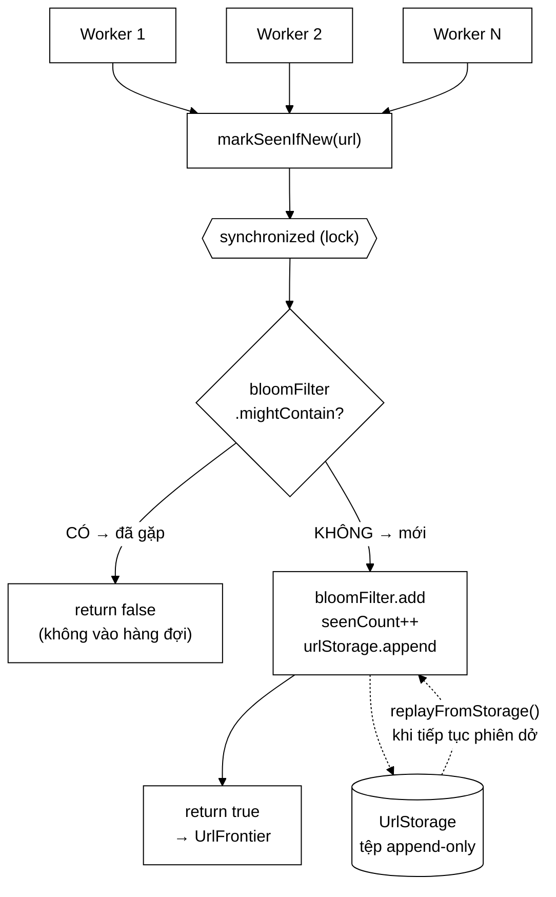

# UrlSeenFilter — nơi một lỗi tương tranh làm crawler tải lại trang cũ

**File nguồn:** `search-engine/src/main/java/com/vnsearch/crawler/UrlSeenFilter.java` (158 dòng)
**Gói:** `com.vnsearch.crawler` · **Loại:** `class` bọc [`BloomFilter`](../datastructure/BloomFilter.md) + [`UrlStorage`](./UrlStorage.md)
**Vị trí trong sơ đồ:** khối **"URL Seen?"** và mũi tên nối nó với **"URL Storage"**
**Đọc kèm:** [`UrlCanonicalizer.md`](./UrlCanonicalizer.md) · [`UrlStorage.md`](./UrlStorage.md) · [`../datastructure/BloomFilter.md`](../datastructure/BloomFilter.md)

---

## 📌 Hiểu trong 30 giây

Lớp này trả lời một câu hỏi duy nhất: **"URL này đã gặp chưa?"** — với hàng
triệu URL, trong bộ nhớ, ở tốc độ $O(1)$.

Nhưng lý do nó tồn tại **như một lớp riêng** thì thú vị hơn nhiều. Trước đây
phần này chỉ là một trường `BloomFilter visited` trần trụi trong
`CrawlerService`. Việc bọc nó lại đã sửa **một lỗi tương tranh thật**, và lỗi
đó có một tính chất rất khó chịu: nó phá vỡ đúng bảo đảm mà Bloom Filter được
cho là luôn giữ.



```
   HAI LOẠI SAI CỦA BLOOM FILTER — KHÔNG CÂN XỨNG CHÚT NÀO

   FALSE POSITIVE  "đã gặp" nhưng thật ra chưa
        └─ ĐÚNG THIẾT KẾ, tỉ lệ 1% có kiểm soát
        └─ hậu quả: bỏ sót ~1% trang.  Chịu được.

   FALSE NEGATIVE  "chưa gặp" nhưng thật ra rồi
        └─ KHÔNG BAO GIỜ được phép xảy ra (khi dùng một luồng)
        └─ hậu quả: crawler tải LẠI trang cũ → vòng lặp vô tận tiềm ẩn
        └─ ĐÂY chính là thứ mà lỗi tương tranh tạo ra
```

---

## 1. Lỗi tương tranh: `bits[i] |= mask` không nguyên tử

Javadoc dòng 18–27 mô tả lỗi rất chính xác. Đây là phần đáng giá nhất của cả
file, nên trình bày chi tiết.

`BloomFilter.add` bên trong làm việc này:

```java
bits[index] |= mask;     // ← nhìn như MỘT lệnh, thật ra là BA
```

Trên JVM, `|=` trên một phần tử mảng `long[]` là ba bước riêng biệt:

```
   ① đọc   bits[5]  →  thanh ghi
   ② tính  thanh ghi | mask
   ③ ghi   thanh ghi  →  bits[5]

   Không có gì bảo đảm ba bước này chạy liền mạch.
```

Hai worker cùng bật hai bit **khác nhau** nhưng nằm trong **cùng một phần tử
mảng** (`long` = 64 bit, nên 64 bit khác nhau dùng chung một ô):

```
   Trạng thái ban đầu:  bits[5] = 0000...0000

   Worker A muốn bật bit 3        Worker B muốn bật bit 40
   ─────────────────────────      ──────────────────────────
   ① đọc bits[5] = 0
                                  ① đọc bits[5] = 0      ← vẫn là 0!
   ② tính 0 | (1<<3)  = 8
                                  ② tính 0 | (1<<40)
   ③ ghi bits[5] = 8
                                  ③ ghi bits[5] = 2^40   ← GHI ĐÈ, bit 3 BIẾN MẤT

   Kết quả: bits[5] = 2^40.  Bit 3 của Worker A đã mất.
```

Hệ quả dây chuyền:

```
   Bit bị mất
        └─ URL của Worker A: một trong k bit băm không được bật
             └─ lần sau mightContain(url) → thấy bit đó = 0 → trả FALSE
                  └─ "URL này chưa gặp"  ← SAI, đã gặp rồi
                       └─ crawler xếp lại vào hàng đợi
                            └─ TẢI LẠI trang cũ
```

Javadoc dòng 24–26 nói đúng chỗ đau: đó là *"đúng thứ mà chính Javadoc của
`BloomFilter` khẳng định không bao giờ xảy ra — **khi dùng một luồng**"*. Vế
điều kiện đó là toàn bộ vấn đề: `BloomFilter` không hứa gì cả khi có nhiều
luồng, mà `CrawlerService` thì chạy nhiều worker.

### 1.1 Vì sao lỗi này cực khó phát hiện

| Đặc điểm | Hệ quả |
|---|---|
| Không ném exception | Không có stack trace, không có dòng log |
| Không hỏng dữ liệu rõ ràng | Chỉ số lượng trang tải nhiều hơn cần thiết |
| Phụ thuộc thời điểm | Chạy 100 lần có thể không tái hiện lần nào |
| Chỉ lộ ra khi nhiều luồng + nhiều URL | Test một luồng luôn xanh |
| Triệu chứng trông giống "web có nhiều trang trùng" | Dễ đổ lỗi nhầm cho [`UrlCanonicalizer`](./UrlCanonicalizer.md) |

Đây là lý do vì sao **bọc cấu trúc dữ liệu không thread-safe vào một lớp có
kiểm soát truy cập** là một mẫu thiết kế đáng làm, chứ không phải thêm tầng cho
đẹp.

---

## 2. Vì sao kiểm tra và ghi nhận phải nguyên tử

Javadoc dòng 29–32 nêu lỗi thứ hai, độc lập với lỗi trên:

```java
public boolean markSeenIfNew(String url) {
    synchronized (lock) {
        if (bloomFilter.mightContain(url)) return false;   // hỏi
        bloomFilter.add(url);                              // ghi nhận
        seenCount++;
        urlStorage.append(url);
        return true;
    }
}
```

Nếu tách "hỏi" và "ghi nhận" thành hai lời gọi riêng:

```
   Hai worker cùng bóc được liên kết tới https://a.vn/tin  (rất thường gặp:
   cùng một liên kết xuất hiện trên nhiều trang khác nhau)

   Worker A                       Worker B
   ─────────────────              ─────────────────
   seenBefore(url) → false
                                  seenBefore(url) → false   ← vẫn chưa ai add!
   markSeen(url)
                                  markSeen(url)
   xếp vào hàng đợi
                                  xếp vào hàng đợi          ← TRÙNG

   → cùng một URL vào frontier HAI lần → tải hai lần
```

Đây là lỗi **check-then-act** kinh điển. Cách sửa không phải là "cẩn thận hơn"
mà là **không cung cấp API cho phép làm sai**: `markSeenIfNew` gộp hai bước vào
một thao tác nguyên tử, và đó là hàm mà worker gọi.

`seenBefore()` vẫn tồn tại (dòng 113) cho những nơi chỉ muốn hỏi — nhưng nó
**không** được dùng để quyết định có xếp hàng hay không.

> ⚠️ **Chú ý khi đọc `seenBefore`:** `url == null` trả về `true` ("đã gặp"),
> không phải `false`. Nghe ngược, nhưng đúng: giá trị trả về được dùng theo
> nghĩa "có nên bỏ qua URL này không", và một URL `null` thì **nên** bỏ qua.

---

## 3. Ba hằng số — và một phép nhân suýt tràn số

Đây là phần thể hiện rõ nhất chất lượng kỹ thuật của lớp: cả ba hằng số đều có
lý do định lượng, không có con số nào là "chọn đại".

### 3.1 `URLS_SEEN_PER_PAGE = 200` — sai chỗ này thì crawler **dừng sau vài trang**

Javadoc dòng 40–48 mô tả một lỗi rất tinh vi:

```
   SAI LẦM: cấp phát Bloom Filter theo maxPages
        maxPages = 10.000  →  bộ lọc thiết kế cho n = 10.000 phần tử

   THỰC TẾ: bộ lọc không chỉ chứa trang ĐÃ LƯU,
            nó chứa MỌI URL ĐÃ KIỂM TRA
        Đo thực tế: mỗi trang tin tức sinh ~78,8 liên kết ra
        → n thật ≈ 10.000 × 78,8 = 788.000   (gấp ~80 lần thiết kế)

   HẬU QUẢ:
        n/m vọt lên → tỉ lệ bit bật tiến gần 100%
        → mightContain trả TRUE cho MỌI URL
        → markSeenIfNew luôn trả false
        → KHÔNG URL NÀO vào được hàng đợi
        → crawler dừng sau vài trang, KHÔNG BÁO LỖI GÌ
```

Triệu chứng ("crawl được 12 trang rồi dừng") hoàn toàn không gợi tới nguyên
nhân ("bộ lọc Bloom bão hoà"). Chọn 200 thay vì 78,8 là **biên an toàn ~2,5
lần** — đúng tinh thần: thà cấp phát thừa bộ nhớ còn hơn để bộ lọc bão hoà.

### 3.2 `MAX_EXPECTED_URLS = 50_000_000` — chặn tràn số nguyên

```java
long expected = Math.max(MIN_EXPECTED_URLS, (long) maxPages * URLS_SEEN_PER_PAGE);
//                                          ↑ ép long TRƯỚC khi nhân
return new UrlSeenFilter((int) Math.min(expected, MAX_EXPECTED_URLS), urlStorage);
//                             ↑ kẹp trần RỒI mới hạ về int
```

Comment dòng 80–81 chỉ rõ ngưỡng: phép nhân tràn từ `maxPages ≈ 10,7 triệu`
($2^{31} / 200$).

```
   KHÔNG ép (long):
        maxPages = 20.000.000
        20.000.000 * 200 = 4.000.000.000  →  TRÀN int  →  -294.967.296
        → BloomFilter nhận kích thước ÂM
        → NegativeArraySizeException hoặc IllegalArgumentException
        → lỗi nổ ra ở BloomFilter, MỘT NƠI HOÀN TOÀN KHÔNG LIÊN QUAN
          tới nguyên nhân (một tham số cấu hình quá lớn)
```

Javadoc dòng 57–61 nói thêm một ý quan trọng hơn cả kỹ thuật: vượt quy mô này
thì *"bộ lọc trong bộ nhớ không còn là lời giải đúng nữa, phải chuyển sang bộ
lọc phân tán"*. Trần không chỉ chống tràn số — nó **đánh dấu ranh giới hợp lệ
của cả thiết kế**.

### 3.3 `MIN_EXPECTED_URLS = 200_000` — sàn cho phiên nhỏ

Phiên thử nghiệm 100 trang sẽ tính ra `100 × 200 = 20.000`. Bộ lọc 20.000 phần
tử vẫn hoạt động, nhưng chỉ tốn thêm vài trăm KB để có một bộ lọc thưa hơn hẳn.
Sàn này mua sự an toàn bằng bộ nhớ gần như miễn phí.

### 3.4 Bảng kích thước thực tế

Với `FALSE_POSITIVE_RATE = 0.01` (1%), công thức Bloom Filter cho
$m = -n\ln p / (\ln 2)^2 \approx 9{,}58n$ bit và $k = 7$ hàm băm:

| `maxPages` | $n$ = expected | $m$ (bit) | Bộ nhớ | Ghi chú |
|---|---|---|---|---|
| 100 | 200.000 (sàn) | ~1,92 M | **240 KB** | Sàn có tác dụng |
| 5.000 | 1.000.000 | ~9,58 M | **1,2 MB** | |
| 31.030 | 6.206.000 | ~59,5 M | **7,4 MB** | Quy mô thật của dự án |
| 250.000 | 50.000.000 (trần) | ~479 M | **60 MB** | Chạm trần |
| 10.000.000 | 50.000.000 (trần) | ~479 M | **60 MB** | Trần giữ nguyên |

So sánh với cách làm ngây thơ — một `HashSet<String>`:

```
   6.206.000 URL trong HashSet<String>
        mỗi URL ~80 ký tự → String ~200 byte + HashMap.Node ~48 byte
        ≈ 6.206.000 × 250 byte ≈ 1,55 GB

   Bloom Filter: 7,4 MB
   ────────────────────────────────────────
   Tiết kiệm ~210 LẦN, đổi lấy 1% false positive.
```

Đây là lý lẽ hoàn chỉnh cho việc chọn Bloom Filter, và là chỗ nên nhấn mạnh khi
bảo vệ đồ án: cấu trúc dữ liệu xác suất không phải để "cho ngầu" mà vì
`HashSet` **không vừa bộ nhớ** ở quy mô này.

---

## 4. Hướng dẫn về code

### 4.1 `replayFromStorage` — tiếp tục phiên crawl dang dở

```java
public long replayFromStorage() {
    return urlStorage.replay(url -> {
        synchronized (lock) {
            if (!bloomFilter.mightContain(url)) {
                bloomFilter.add(url);
                seenCount++;      // ← chỉ tăng khi THẬT SỰ thêm
            }
        }
    });
}
```

Đây là điểm nối giữa "bộ lọc trong RAM" và "kho bền trên đĩa":

```
   Phiên 1:  crawl 12.000 trang → mất điện
             urls.txt có 950.000 dòng (mọi URL đã kiểm tra)

   Phiên 2:  replayFromStorage()
                  └─ nạp 950.000 URL vào bộ lọc mới
             → crawler KHÔNG tải lại 12.000 trang cũ
             → đi thẳng vào phần chưa làm
```

Hai chi tiết đáng chú ý:

- **`synchronized` bên trong lambda, không bọc cả vòng lặp.** Nạp 950.000 URL
  mà giữ khoá suốt sẽ chặn mọi worker. Ở đây khoá được nhả giữa các URL, nên
  replay chạy song song được với crawl (dù thực tế nó chạy trước khi khởi động
  worker).
- **`if (!mightContain)` trước khi `add`** giữ `seenCount` đúng nghĩa "số URL
  phân biệt". Không có nó, chạy replay hai lần sẽ đếm gấp đôi.

Vì sao lưu **URL** chứ không lưu **mảng bit** — Javadoc của
[`UrlStorage`](./UrlStorage.md) dòng 25–29 trả lời: kích thước mảng bit phụ
thuộc `maxPages` của phiên tạo ra nó, nên phiên sau đổi `maxPages` là dùng lại
không được. Văn bản thì dựng lại ở kích thước nào cũng được, **và đọc được bằng
mắt khi gỡ lỗi**.

### 4.2 Chi phí của khoá — vì sao `synchronized` ở đây không phải nút thắt

Javadoc dòng 34–36 lập luận, và lập luận này đúng:

```java
synchronized (lock) {
    if (bloomFilter.mightContain(url)) return false;   // O(k) = 7 phép băm
    bloomFilter.add(url);                              // O(k) = 7 phép băm
    seenCount++;                                       // O(1)
    urlStorage.append(url);                            // ← CÓ ĐỆM, không chờ đĩa
}
```

**Không có thao tác vào/ra nào chờ bên trong khoá.** `UrlStorage.append` ghi vào
`BufferedWriter` — chỉ chạm đĩa khi đệm đầy (8 KB mặc định), tức khoảng **100
URL một lần**, và ngay cả khi đó cũng chỉ là một lần `write` hệ thống.

```
   Thời gian giữ khoá  ≈ 14 phép băm + một lần copy vào đệm  ≈ 0,5 µs
   Thời gian tải một trang                                    ≈ 200.000 µs

   Với 8 worker, mỗi worker gọi ~79 lần/trang:
        tranh chấp khoá ≈ 8 × 79 × 0,5 µs / 200.000 µs ≈ 0,16% thời gian
   ⇒ Khoá KHÔNG phải nút thắt. Nút thắt là mạng.
```

> ⚠️ **Nhưng đây là một bất biến mong manh.** Nếu ai đó thêm một thao tác chậm
> vào bên trong khối `synchronized` (ghi CSDL, gọi HTTP, `flush()` mỗi dòng),
> toàn bộ lập luận trên sụp đổ và lớp này thành nút thắt của cả crawler. Xem
> cạm bẫy ở mục 4.4.

### 4.3 Hai hàm dựng tĩnh — mặc định an toàn

```java
public static UrlSeenFilter forMaxPages(int maxPages) {
    return forMaxPages(maxPages, UrlStorage.disabled());   // ← mặc định TẮT lưu bền
}
public static UrlSeenFilter forMaxPages(int maxPages, UrlStorage urlStorage) { ... }
```

Và trong hàm dựng chính:

```java
this.urlStorage = urlStorage == null ? UrlStorage.disabled() : urlStorage;
```

`null` được biến thành **đối tượng rỗng (Null Object)** thay vì để `null` lan
xuống. Nhờ vậy `urlStorage.append(url)` ở dòng 107 **không cần kiểm tra `null`**
— nó luôn gọi được, chỉ là ở chế độ tắt thì không làm gì.

Đây là mẫu Null Object dùng đúng chỗ: nó xoá bỏ một nhánh `if` khỏi **đường
nóng** chạy hàng triệu lần.

### 4.4 Cạm bẫy khi sửa lớp này

| Cạm bẫy | Hậu quả | Cách đúng |
|---|---|---|
| Bỏ `synchronized` để "nhanh hơn" | False negative → tải lại trang cũ (mục 1) | Giữ; chi phí chỉ 0,16% |
| Tách `markSeenIfNew` thành `seenBefore` + `markSeen` | Hai worker cùng xếp một URL (mục 2) | Giữ nguyên tử |
| Thêm thao tác vào/ra chậm trong khối khoá | Biến lớp này thành nút thắt (mục 4.2) | Mọi việc chậm phải nằm ngoài khoá |
| Cấp phát bộ lọc theo `maxPages` thay vì `× 200` | Bộ lọc bão hoà, crawler dừng im lặng (mục 3.1) | Giữ `URLS_SEEN_PER_PAGE` |
| Bỏ `(long)` trong phép nhân | Tràn số → kích thước âm | Giữ ép kiểu |
| Đưa URL **chưa chuẩn hoá** vào | Các biến thể tính là URL khác nhau | Luôn qua [`UrlCanonicalizer`](./UrlCanonicalizer.md) trước |
| Hạ `FALSE_POSITIVE_RATE` xuống 0,0001 | Bộ nhớ tăng ~2,5 lần cho lợi ích rất nhỏ | 1% là cân bằng đúng |
| Dùng `seenBefore` để quyết định xếp hàng | Quay lại lỗi check-then-act | Luôn dùng `markSeenIfNew` |

**Cạm bẫy nghiêm trọng nhất là hàng cuối cùng của mục 4.4 trên và hàng "chưa
chuẩn hoá"** — vì cả hai không gây lỗi ngay, chỉ làm crawler kém hiệu quả một
cách âm thầm.

---

## 5. Độ phức tạp & chi phí

Gọi $n$ = số URL đã ghi nhận, $k = 7$ = số hàm băm, $m$ = số bit.

| Thao tác | Thời gian | Ghi chú |
|---|---|---|
| `markSeenIfNew` | $O(k)$ = $O(1)$ | **Đường nóng: ~79 lần/trang** |
| `seenBefore` | $O(k)$ = $O(1)$ | |
| `replayFromStorage` | $O(N \cdot k)$ | $N$ = số dòng trong tệp; chạy một lần lúc khởi động |
| `getSeenCount` | $O(1)$ | Có khoá — đừng gọi trong vòng lặp nóng |
| Bộ nhớ | $O(m)$ = $9{,}58n$ bit | Bảng ở mục 3.4 |

**Điểm quan trọng: chi phí không phụ thuộc độ dài URL** (khác `HashSet`, nơi
`equals` phải so từng ký tự khi băm trùng). Bloom Filter băm URL thành $k$ chỉ
số rồi chỉ đọc bit — độ dài URL chỉ ảnh hưởng bước băm đầu tiên.

Tỉ lệ false positive thực tế theo mức lấp đầy:

```
   n / n_thiết_kế     tỉ lệ false positive thực tế
   ────────────       ────────────────────────────
        0,5×                  ~0,1%
        1,0×                   1,0%     ← điểm thiết kế
        2,0×                   ~6%
        5,0×                  ~35%
       10,0×                  ~70%      ← gần như mọi URL bị coi là "đã gặp"
       80,0×                  ~100%     ← kịch bản ở mục 3.1
```

Bảng này cho thấy vì sao `URLS_SEEN_PER_PAGE` quan trọng đến vậy: sai lầm ở đó
không làm giảm chất lượng từ từ mà **đẩy hệ thống qua một vách đá**.

---

## 6. Kiểm thử liên quan

| Test | Bảo vệ điều gì |
|---|---|
| `test/java/com/vnsearch/crawler/UrlSeenFilterTest.java` | `markSeenIfNew` trả `true` đúng một lần cho mỗi URL; `null`/rỗng bị từ chối; `replayFromStorage` nạp đúng |
| `test/java/com/vnsearch/datastructure/BloomFilterTest.java` | Tầng dưới: không false negative khi một luồng |
| `test/java/com/vnsearch/crawler/UrlCanonicalizerTest.java` | Tầng trước |

```powershell
cd search-engine
.\mvnw.cmd -q -Dtest='UrlSeenFilterTest,BloomFilterTest' test
```

Kịch bản **quan trọng nhất** lại chưa có test tự động — chính lỗi tương tranh
mà lớp này sinh ra để sửa:

```java
@Test
void nhieuLuongCungGhiNhanMotUrlChiCoMotLuongThang() throws Exception {
    UrlSeenFilter loc = UrlSeenFilter.forMaxPages(1000);
    int soLuong = 16;
    var batDau = new CountDownLatch(1);
    var demThang = new AtomicInteger();
    var pool = Executors.newFixedThreadPool(soLuong);

    for (int i = 0; i < soLuong; i++) {
        pool.submit(() -> {
            batDau.await();
            if (loc.markSeenIfNew("https://a.vn/tin")) demThang.incrementAndGet();
            return null;
        });
    }
    batDau.countDown();
    pool.shutdown();
    pool.awaitTermination(5, TimeUnit.SECONDS);

    assertEquals(1, demThang.get());   // ĐÚNG MỘT worker được phép xếp hàng
}
```

Và một test cho tính chất "không false negative" dưới nhiều luồng:

```java
@Test
void ghiNhanTuNhieuLuongRoiHoiLaiDeuBaoDaGap() throws Exception {
    // 8 luồng × 10.000 URL phân biệt, sau đó kiểm tra TẤT CẢ đều seenBefore()
    // Nếu bỏ synchronized, test này sẽ thất bại một cách ngẫu nhiên.
}
```

Test thứ hai là loại test **chập chờn theo thiết kế** — nó không phải lúc nào
cũng bắt được lỗi, nhưng chạy nhiều lần trong CI thì sẽ bắt. Đó vẫn tốt hơn
không có gì.

---

## 7. Chấm theo chuẩn doanh nghiệp

| Tiêu chí | Điểm | Nhận xét |
|---|---|---|
| Đúng đắn về tương tranh | 10/10 | Nhận diện và sửa một lỗi thật; API nguyên tử không cho phép dùng sai |
| Chọn cấu trúc dữ liệu | 10/10 | Bloom Filter tiết kiệm ~210 lần so với `HashSet`; đánh đổi đúng chiều |
| Định lượng tham số | 10/10 | Cả ba hằng số có lý do bằng số đo thật (78,8 liên kết/trang) |
| Chống lỗi biên | 9/10 | Chặn tràn số nguyên, có sàn và trần, `null` → Null Object |
| Tài liệu trong mã | 10/10 | Giải thích cơ chế lỗi tương tranh ở mức bit — hiếm thấy |
| Khả năng kiểm thử | 5/10 | Thiếu đúng test cho tính chất quan trọng nhất (đa luồng) |
| Khả năng mở rộng | 6/10 | Trần 50 triệu URL được tài liệu hoá là ranh giới thiết kế, nhưng chưa có đường đi tiếp |
| Quan sát được | 6/10 | Có `getSeenCount`/`getNumBits`, nhưng không đo được **mức lấp đầy** hiện tại |

**Bốn đề xuất nâng lên mức sản phẩm:**

1. **Test đa luồng** (mục 6). Lớp này tồn tại **để** sửa một lỗi tương tranh mà
   lại không có test tương tranh nào — nếu ai đó bỏ `synchronized` vì tưởng
   `ConcurrentHashMap`-style là đủ, sẽ không có gì báo động.
2. **Cảnh báo khi bộ lọc sắp bão hoà.** Thêm `double fillRatio()` (tỉ lệ bit
   đã bật) và ghi `log.warn` khi vượt ~50%. Kịch bản ở mục 3.1 — crawler dừng
   im lặng — sẽ trở nên **nhìn thấy được** thay vì phải suy đoán.
3. **`LongAdder` cho `seenCount`.** Hiện `getSeenCount()` phải lấy khoá, nên
   gọi nó từ vòng lặp thống kê sẽ tranh chấp với các worker. Một `LongAdder`
   đọc không khoá giải quyết triệt để.
4. **Bloom Filter có thể mở rộng (scalable/counting).** Khi chạm trần, thay vì
   dừng ở một thiết kế cố định, một chuỗi bộ lọc nối tiếp nhau (scalable Bloom
   filter) cho phép $n$ tăng mà vẫn giữ tỉ lệ false positive — đường đi tiếp mà
   Javadoc hiện chỉ mới nêu tên ("bộ lọc phân tán") chứ chưa mở.

---

## 8. Liên kết

- Bước trước: [`UrlCanonicalizer.md`](./UrlCanonicalizer.md) — URL phải chuẩn hoá **trước** khi vào đây
- Kho bền đứng sau: [`UrlStorage.md`](./UrlStorage.md)
- Cấu trúc dữ liệu bên dưới: [`../datastructure/BloomFilter.md`](../datastructure/BloomFilter.md)
- Bước sau: [`frontier/UrlFrontier.md`](./frontier/UrlFrontier.md) — nơi URL "mới" được xếp hàng
- Bộ lọc anh em cho **nội dung** (không phải URL): [`ContentSeenFilter.md`](./ContentSeenFilter.md)
- Nơi lắp ráp tất cả: [`CrawlerService.md`](./CrawlerService.md)
- Tổng quan: `docs/ARCHITECTURE.md`, `docs/DSA-REPORT.md`
