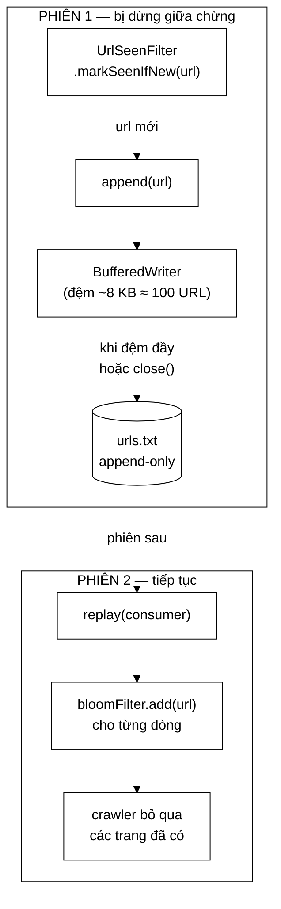

# UrlStorage — vì sao lưu URL dạng văn bản chứ không lưu mảng bit

**File nguồn:** `search-engine/src/main/java/com/vnsearch/crawler/UrlStorage.java` (156 dòng)
**Gói:** `com.vnsearch.crawler` · **Loại:** `final class implements Closeable`, hàm dựng riêng tư + hai hàm tạo tĩnh
**Vị trí trong sơ đồ:** khối **"URL Storage"**, đứng sau [`UrlSeenFilter`](./UrlSeenFilter.md)
**Đọc kèm:** [`UrlSeenFilter.md`](./UrlSeenFilter.md) · [`ContentStorage.md`](./ContentStorage.md) · [`CheckpointCrawlListener.md`](./CheckpointCrawlListener.md)

---

## 📌 Hiểu trong 30 giây

[`UrlSeenFilter`](./UrlSeenFilter.md) trả lời được "URL này đã gặp chưa" —
nhưng **chỉ trong bộ nhớ**. Tắt chương trình là mất sạch.

Một phiên crawl vài chục nghìn trang **gần như chắc chắn** phải dừng giữa chừng
(hết giờ, mất mạng, máy khởi động lại). Không có lớp này, lần chạy sau tải lại
từ đầu toàn bộ những trang đã có.

Lớp này là một tệp văn bản **chỉ ghi thêm**, mỗi dòng một URL. Đơn giản một
cách có chủ ý — và ba quyết định đơn giản đó mới là phần đáng đọc.



```
   VÌ SAO KHÔNG LƯU THẲNG MẢNG BIT CỦA BLOOM FILTER

   ── Lưu mảng bit ─────────────────────────────────────────────────
   Kích thước mảng được TÍNH TỪ maxPages của phiên tạo ra nó.
        phiên 1: maxPages = 5.000   → m = 9.580.000 bit
        phiên 2: maxPages = 50.000  → m = 95.800.000 bit
                 └─ mảng cũ KHÔNG dùng lại được. Khác kích thước,
                    khác cả chỉ số băm → nạp vào là dữ liệu rác.
        Ngoài ra: mở tệp ra chỉ thấy một biển bit. Gỡ lỗi bằng gì?

   ── Lưu URL dạng văn bản (đang dùng) ─────────────────────────────
   Dựng lại được bộ lọc ở BẤT KỲ kích thước nào.
   Mở bằng Notepad là đọc được. grep được. đếm được. so sánh được.
        └─ giá phải trả: tệp lớn hơn (~80 byte/URL thay vì ~1,2 bit)
```

---

## 1. Vấn đề lớp này giải quyết

```
   Không có lưu bền:
        phiên 1  ── crawl 12.000 trang trong 4 giờ ── ✖ mất điện
        phiên 2  ── crawl LẠI 12.000 trang đó ── rồi mới đi tiếp
                     └─ 4 giờ băng thông và thời gian ném đi
                     └─ 12.000 request THỪA gửi tới máy chủ người ta
                        (vấn đề lịch sự, không chỉ vấn đề hiệu năng)

   Có lưu bền:
        phiên 2  ── replay 950.000 URL từ tệp (~2 giây) ── đi thẳng vào phần mới
```

Con số 950.000 không phải là 12.000: tệp chứa **mọi URL đã kiểm tra**, không
chỉ những trang đã tải. Xem [`UrlSeenFilter`](./UrlSeenFilter.md) mục 3.1 — mỗi
trang sinh ~78,8 liên kết ra.

---

## 2. Bản đồ lớp

```
UrlStorage  (final, implements Closeable)
├── path    : Path        ── null = CHẾ ĐỘ TẮT
├── lock    : Object
├── writer  : BufferedWriter  ── tạo LƯỜI, ở lần append đầu tiên
├── written : long
│
├── disabled()          static → thể hiện không làm gì
├── file(Path)          static → thể hiện có ghi
├── isEnabled()
├── getPath() / getWrittenCount()
├── append(String)      ── nuốt IOException, chỉ ghi log
├── replay(Consumer)    ── đọc lại toàn bộ, trả về số dòng
└── close()             ── flush + đóng
```

### 2.1 Ba quyết định thiết kế

| Quyết định | Dòng | Đánh đổi |
|---|---|---|
| **Chỉ ghi thêm** (append-only) | 31–32 | Không sửa, không xoá ⇒ hai tiến trình cùng ghi cũng không hỏng **cấu trúc** tệp |
| **Có đệm, không flush mỗi dòng** | 34–39 | Nhanh hơn hàng trăm lần; đổi lấy việc mất phần đuôi khi bị giết đột ngột |
| **Mặc định tắt** | 41–43 | Phiên thử vài trăm trang không phải chạm đĩa |

### 2.2 Vì sao append-only là lựa chọn đúng ở đây

```
   Tệp có SỬA/XOÁ (ví dụ lưu JSON một mảng URL):
        ghi = đọc cả tệp → sửa → ghi lại cả tệp
        → O(n) mỗi lần thêm một URL → O(n²) cho cả phiên
        → 950.000 URL × ghi lại tệp 76 MB mỗi lần = không dùng được
        → và bị giết giữa chừng thì tệp CỤT, mất toàn bộ

   Append-only:
        ghi = nối một dòng vào cuối → O(1)
        → bị giết giữa chừng thì mất DÒNG CUỐI, phần trước còn nguyên
        → không cần ghi tệp tạm + đổi tên như JsonUserStore
```

Đây là điểm khác biệt thú vị so với [`JsonUserStore`](../auth/JsonUserStore.md):
cùng là "ghi tệp bền", nhưng ở đó phải dùng tệp tạm + `ATOMIC_MOVE`, còn ở đây
không cần. Lý do: **định dạng append-only tự nó đã bền vững một phần**. Dòng
cuối cùng có thể cụt, nhưng `replay` chỉ mất đúng dòng đó — trong khi một tệp
JSON cụt thì mất **tất cả**.

Bảng so sánh hai chiến lược lưu bền trong cùng dự án:

| | `JsonUserStore` | `UrlStorage` |
|---|---|---|
| Định dạng | JSON một mảng | Văn bản, mỗi dòng một mục |
| Ghi | Ghi lại **cả** tệp | Nối thêm |
| Chống hỏng | Tệp tạm + `ATOMIC_MOVE` | Bản chất định dạng |
| Mất khi bị giết | Không mất gì (nguyên tử) | Mất phần đuôi trong đệm |
| Mất mát có nghiêm trọng không | **Có** — mất tài khoản | **Không** — crawl lại vài trang |
| Số bản ghi | Hàng chục | Hàng triệu |

Hai chiến lược ngược nhau, và **cả hai đều đúng** — vì mức độ nghiêm trọng của
mất mát khác nhau hoàn toàn. Đây là loại phân biệt đáng nêu khi bảo vệ.

---

## 3. Hướng dẫn về code

### 3.1 Đánh đổi về đệm — Javadoc dòng 34–39

Đây là lập luận hoàn chỉnh nhất trong file:

> Ở tốc độ crawl thực tế, mỗi trang sinh hơn 100 URL nên đây là đường đi nóng;
> flush từng dòng sẽ biến ghi đĩa thành nút thắt cổ chai. Cái giá là nếu tiến
> trình bị giết đột ngột thì phần đuôi trong bộ đệm mất. Hậu quả chỉ là crawl
> lại vài trang ở phiên sau — **chấp nhận được, vì crawl lại một trang đã có
> thì vô hại, còn bỏ sót một trang chưa có mới là mất mát thật.**

Câu cuối là nguyên tắc, và nó xác định **chiều** của mọi đánh đổi trong lớp:

```
   Hai loại sai, KHÔNG cân xứng:

   Ghi thừa / crawl lại  →  tốn thời gian.  Tự khắc phục.
   Bỏ sót                →  trang đó KHÔNG BAO GIỜ vào chỉ mục. Vĩnh viễn.

   ⇒ Mọi khi lưỡng lự, nghiêng về phía GHI THỪA.
```

Định lượng cái giá:

```
   Đệm mặc định BufferedWriter ≈ 8.192 ký tự ≈ 100 URL (80 ký tự/URL)

   Bị giết đột ngột → mất tối đa ~100 URL cuối
        → trong đó chỉ MỘT PHẦN là trang đã tải (phần lớn là liên kết chưa xử lý)
        → phiên sau tải lại ~1–2 trang

   So với: flush mỗi dòng
        → 950.000 lần gọi hệ thống thay vì ~9.500
        → mỗi lần ~10–50 µs → tổng ~10–48 GIÂY chỉ để flush
        → và toàn bộ thời gian đó nằm TRONG khoá của UrlSeenFilter
           (xem UrlSeenFilter.md mục 4.2 — sẽ phá vỡ lập luận "khoá rẻ")
```

Vế cuối là điểm nối quan trọng giữa hai lớp: **nếu `append` chậm, `UrlSeenFilter`
trở thành nút thắt của cả crawler.** Việc `append` có đệm không chỉ là tối ưu
cục bộ — nó là điều kiện để thiết kế khoá ở lớp trên còn đúng.

### 3.2 `append` nuốt `IOException` — và ở đây là **đúng**

```java
public void append(String url) {
    if (path == null || url == null || url.isBlank()) return;    // ① chế độ tắt
    synchronized (lock) {
        try {
            if (writer == null) { ... }                           // ② tạo lười
            writer.write(url);
            writer.newLine();
            written++;
        } catch (IOException e) {
            log.warn("Không ghi được URL vào {}: {}", path, e.getMessage());   // ③ NUỐT
        }
    }
}
```

**③ là quyết định quan trọng nhất**, và Javadoc dòng 90–92 nêu rõ lý lẽ:

> Lưu bền chỉ là **tiện ích cho lần chạy sau**, không phải điều kiện để crawl
> chạy được.

```
   Ổ đĩa đầy giữa phiên crawl:

   ── Ném exception ────────────────────────────────────────────────
        UrlSeenFilter.markSeenIfNew ném
             └─ worker chết
                  └─ CẢ PHIÊN CRAWL DỪNG vì không ghi được một tệp phụ trợ
                     (mà crawl thì vẫn chạy hoàn toàn bình thường được!)

   ── Ghi log rồi đi tiếp (đang dùng) ──────────────────────────────
        crawl tiếp tục, chỉ mất khả năng tiếp tục ở phiên sau
        người vận hành thấy cảnh báo và dọn đĩa
```

Đối chiếu với [`UserStore`](../auth/UserStore.md) mục 2.1, nơi nuốt
`IOException` bị coi là **sai**: khác biệt nằm ở chỗ dữ liệu bị mất là *cốt lõi*
(tài khoản) hay *phụ trợ* (khả năng tiếp tục). Cùng kỹ thuật, hai kết luận ngược
nhau, cả hai đều đúng trong ngữ cảnh của mình — cùng một phân biệt đã gặp ở
[`UserService`](../auth/UserService.md) mục 5.2.

**② Tạo `writer` lười** (chỉ ở lần `append` đầu tiên) có hai lợi ích:

- Chế độ tắt không bao giờ chạm hệ thống tệp.
- `UrlStorage.file(path)` gọi được ở nơi cấu hình mà **không** tạo tệp rỗng khi
  phiên crawl không tìm được URL nào.

Chú ý: `Files.createDirectories(parent)` nằm **bên trong** `try` và cũng ở trong
khoá — nó chỉ chạy một lần nên chi phí không đáng kể.

### 3.3 `replay` — dung thứ với dữ liệu bẩn

```java
public long replay(Consumer<String> consumer) {
    if (path == null || !Files.exists(path)) return 0;      // ① chưa có tệp = bình thường
    long count = 0;
    try {
        for (String line : Files.readAllLines(path, StandardCharsets.UTF_8)) {
            if (!line.isBlank()) {                           // ② bỏ qua dòng trống
                consumer.accept(line.trim());                // ③ trim
                count++;
            }
        }
    } catch (IOException e) {
        log.warn("Không đọc lại được {}: {}", path, e.getMessage());   // ④ nuốt
    }
    return count;
}
```

| # | Chi tiết | Vì sao |
|---|---|---|
| ① | Tệp chưa tồn tại → `0`, không ném | Phiên crawl **đầu tiên** là trường hợp thường, không phải lỗi |
| ② | Bỏ dòng trống | Dòng cuối cùng có thể cụt do bị giết giữa chừng |
| ③ | `.trim()` | Ký tự `\r` sót lại nếu tệp từng đi qua Windows/Git |
| ④ | Nuốt `IOException` | Cùng lý do với `append`: không đọc lại được thì crawl từ đầu, vẫn chạy |

> ⚠️ **`Files.readAllLines` nạp toàn bộ tệp vào RAM.** Với 950.000 URL × ~80
> ký tự ≈ **76 MB chuỗi**, cộng chi phí đối tượng `String` (~40 byte/chuỗi) →
> khoảng **150 MB đỉnh** trong lúc replay. Chấp nhận được ở quy mô hiện tại,
> nhưng nó là **giới hạn cứng đầu tiên** của lớp này. Xem đề xuất 1 ở mục 5.

### 3.4 Mẫu Null Object — `disabled()`

```java
public static UrlStorage disabled() { return new UrlStorage(null); }
public static UrlStorage file(Path path) {
    if (path == null) {
        throw new IllegalArgumentException("path không được null; dùng disabled() nếu muốn tắt");
    }
    return new UrlStorage(path);
}
```

Hai điểm đáng khen:

1. **`disabled()` là một đối tượng thật**, không phải `null`. Nhờ vậy
   `UrlSeenFilter` gọi `urlStorage.append(url)` mà **không cần kiểm tra `null`**
   trên đường nóng chạy hàng triệu lần.
2. **`file(null)` ném ngay, kèm thông điệp chỉ đúng cách sửa.** Đây là điều đúng
   để làm: `null` truyền vào `file()` gần như chắc chắn là lỗi cấu hình, và nếu
   âm thầm biến nó thành chế độ tắt thì người dùng sẽ tưởng đang lưu bền trong
   khi thật ra không.

Đối chiếu: hàm dựng của `UrlSeenFilter` thì **lại** biến `null` thành
`disabled()` (dòng 88). Hai cách xử lý `null` khác nhau, và cả hai đều đúng —
`file()` là điểm người dùng **tuyên bố ý định lưu**, còn hàm dựng `UrlSeenFilter`
chỉ nhận lại một phụ thuộc đã được quyết định ở nơi khác.

### 3.5 `close()` — bắt buộc, và ai gọi nó

```java
@Override
public void close() {
    synchronized (lock) {
        if (writer != null) {
            try { writer.flush(); writer.close(); }
            catch (IOException e) { log.warn(...); }
            finally { writer = null; }      // ← đặt lại để append() sau này mở lại được
        }
    }
}
```

`writer = null` trong `finally` khiến lớp này **tái sử dụng được**: gọi
`append` sau `close` sẽ mở lại tệp ở chế độ APPEND, không mất dữ liệu. Đó là
hành vi hợp lý cho một tệp chỉ ghi thêm (khác với một `Closeable` thông thường,
nơi dùng sau khi đóng là lỗi).

**Không gọi `close()` = mất tối đa 100 URL cuối.** Trách nhiệm này nằm ở
[`CrawlerService`](./CrawlerService.md); nếu ở đó thiếu `try-with-resources`
hoặc thiếu shutdown hook, mọi phiên crawl kết thúc bình thường vẫn mất phần
đuôi. Xem đề xuất 3.

### 3.6 Cạm bẫy khi sửa lớp này

| Cạm bẫy | Hậu quả | Cách đúng |
|---|---|---|
| Thêm `writer.flush()` vào cuối `append` | Phá lập luận "khoá rẻ" của `UrlSeenFilter`; chậm hàng chục giây | Giữ đệm; flush ở `close()` |
| Ném `IOException` từ `append` | Ổ đĩa đầy làm chết cả phiên crawl | Giữ nuốt + log |
| Đổi sang định dạng có cấu trúc (JSON/CSV có header) | Mất tính bền của append-only | Giữ mỗi dòng một URL |
| Dùng `Files.write(..., APPEND)` mỗi lần | Mở/đóng tệp 950.000 lần | Giữ `BufferedWriter` sống |
| Quên `close()` ở nơi gọi | Mất ~100 URL cuối mỗi phiên | `try-with-resources` + shutdown hook |
| Bỏ `synchronized` | `BufferedWriter` không thread-safe → dòng bị trộn lẫn vào nhau | Giữ khoá |
| Ghi URL **chưa chuẩn hoá** | Tệp phình, replay nạp các biến thể trùng | Chuẩn hoá ở tầng trên |

Hàng "dòng bị trộn lẫn" đáng nói thêm: không có khoá, hai worker ghi đồng thời
có thể tạo ra `https://a.vnhttps://b.vn/tin` trên một dòng — một URL **không
tồn tại** được nạp vào bộ lọc ở phiên sau, chiếm chỗ và khiến hai URL thật bị
coi là chưa gặp. Lỗi âm thầm, chỉ lộ ra qua số liệu.

---

## 4. Độ phức tạp & chi phí

Gọi $N$ = số URL trong tệp.

| Thao tác | Thời gian | Ghi chú |
|---|---|---|
| `append` (đệm chưa đầy) | $O(L)$ ≈ 0,1 µs | Chỉ copy vào mảng ký tự |
| `append` (đệm đầy) | $O(1)$ ghi hệ thống ≈ 10–50 µs | Xảy ra ~1 lần / 100 URL |
| `append` trung bình | **≈ 0,6 µs** | Đủ rẻ để nằm trong khoá |
| `replay` | $O(N \cdot L)$ thời gian, $O(N \cdot L)$ **bộ nhớ** | Một lần lúc khởi động |
| `close` | $O(1)$ | |
| `getWrittenCount` | $O(1)$ có khoá | Đừng gọi trong vòng lặp nóng |

Dung lượng tệp:

| Số trang crawl | Số URL trong tệp (~×79) | Kích thước tệp (~80 B/URL) |
|---|---|---|
| 5.000 | ~395.000 | ~32 MB |
| 31.030 | ~2.450.000 | ~196 MB |
| 100.000 | ~7.900.000 | ~632 MB |

```
   ĐỐI CHIẾU: nếu lưu mảng bit của Bloom Filter thay vì URL
        31.030 trang → m ≈ 59,5 triệu bit ≈ 7,4 MB
        so với 196 MB văn bản → nhỏ hơn 26 LẦN

   Nhưng đổi lại:
        ✗ không dùng lại được khi maxPages đổi
        ✗ không đọc/gỡ lỗi được bằng mắt
        ✗ không grep được, không đếm được, không so sánh hai phiên được
   ⇒ 196 MB đĩa là cái giá RẺ cho những thứ đó. Đĩa rẻ; thời gian gỡ lỗi thì không.
```

Tệp phình tuyến tính và **không bao giờ được dọn** — đó là giới hạn thật, xem
đề xuất 2.

---

## 5. Kiểm thử liên quan

| Test | Bảo vệ điều gì |
|---|---|
| `test/java/com/vnsearch/crawler/UrlSeenFilterTest.java` | `replayFromStorage` nạp đúng số URL |
| `test/java/com/vnsearch/crawler/CheckpointCrawlListenerTest.java` | Cơ chế tiếp tục phiên dở nói chung |

```powershell
cd search-engine
.\mvnw.cmd -q -Dtest='UrlSeenFilterTest,CheckpointCrawlListenerTest' test
```

Kiểm tra bằng tay — đây là lớp dễ kiểm chứng nhất trong cả gói `crawler`, vì
đầu ra là văn bản thuần:

```powershell
# Số URL đã lưu
(Get-Content search-engine\data\urls.txt | Measure-Object -Line).Lines

# Có URL nào bị trùng không? (nếu có nhiều → chuẩn hoá đang có vấn đề)
Get-Content search-engine\data\urls.txt | Group-Object | Where-Object Count -gt 1 |
    Measure-Object | Select-Object Count

# Có dòng nào méo không? (dấu hiệu ghi đồng thời không khoá)
Select-String -Path search-engine\data\urls.txt -Pattern 'https?://.*https?://'
```

Lệnh thứ ba là một **bài kiểm tra tính đúng đắn về tương tranh** làm được bằng
một dòng — nếu có kết quả, khoá đã bị phá ở đâu đó.

Ba kịch bản chưa có test tự động:

```java
// 1. append rồi close rồi append lại → không mất dữ liệu (writer mở lại)
// 2. replay bỏ qua dòng trống và dòng chỉ có khoảng trắng
// 3. append từ 8 luồng × 1000 URL → tệp có đúng 8000 dòng, không dòng nào méo
```

Kịch bản 3 quan trọng nhất, cùng lý do với `UrlSeenFilter`.

---

## 6. Chấm theo chuẩn doanh nghiệp

| Tiêu chí | Điểm | Nhận xét |
|---|---|---|
| Chọn định dạng | 10/10 | Append-only văn bản: bền một phần theo bản chất, gỡ lỗi được bằng mắt |
| Lập luận đánh đổi | 10/10 | Nguyên tắc "ghi thừa vô hại, bỏ sót là vĩnh viễn" định hướng mọi quyết định |
| Xử lý lỗi | 10/10 | Phân biệt đúng dữ liệu cốt lõi và phụ trợ; lỗi đĩa không giết phiên crawl |
| Hiệu năng đường nóng | 9/10 | Đệm giữ `append` ở ~0,6 µs — điều kiện để khoá ở tầng trên còn rẻ |
| An toàn đa luồng | 9/10 | Khoá đúng chỗ, thời gian giữ ngắn |
| Thiết kế API | 9/10 | Null Object cho chế độ tắt; `file(null)` ném kèm hướng dẫn sửa |
| Khả năng mở rộng | 5/10 | `readAllLines` nạp cả tệp vào RAM; tệp không bao giờ được dọn |
| Khả năng kiểm thử | 6/10 | Đường chính có test gián tiếp; thiếu test đa luồng và test vòng đời |

**Ba đề xuất nâng lên mức sản phẩm:**

1. **`Files.lines(path)` thay `readAllLines` trong `replay`.** Đây là sửa đổi
   một dòng, đổi bộ nhớ từ $O(N)$ xuống $O(1)$:

   ```java
   try (Stream<String> lines = Files.lines(path, StandardCharsets.UTF_8)) {
       return lines.filter(l -> !l.isBlank()).peek(l -> consumer.accept(l.trim())).count();
   }
   ```

   Ở 950.000 URL thì 150 MB đỉnh còn chịu được; ở 8 triệu URL thì không. Đây là
   giới hạn cứng đầu tiên và rẻ nhất để gỡ bỏ.

2. **Xoay vòng / nén tệp.** Tệp chỉ lớn lên, không bao giờ nhỏ đi. Một cơ chế
   đơn giản: khi vượt ngưỡng, đọc toàn bộ → khử trùng lặp → ghi lại tệp mới →
   đổi tên (dùng đúng khuôn `ATOMIC_MOVE` của
   [`JsonUserStore`](../auth/JsonUserStore.md)). Hoặc rẻ hơn: ghi thẳng bằng
   `GZIPOutputStream` — URL nén rất tốt (tiền tố miền lặp lại nhiều), dự kiến
   giảm 5–8 lần.

3. **Flush định kỳ theo thời gian** (ví dụ mỗi 30 giây, từ một luồng nền hoặc
   ghép vào `CheckpointCrawlListener`). Hiện tại phiên crawl chạy 4 giờ rồi bị
   giết vẫn mất tối đa 100 URL cuối — không nhiều, nhưng flush theo thời gian
   biến con số đó thành **0** với chi phí gần như bằng không (~480 lần flush
   trong 4 giờ thay vì 9.500 lần). Kèm theo đó là bảo đảm rằng dù nơi gọi quên
   `close()` thì dữ liệu vẫn xuống đĩa.

---

## 7. Liên kết

- Người dùng duy nhất: [`UrlSeenFilter.md`](./UrlSeenFilter.md) — xem mục 4.1 (`replayFromStorage`) và 4.2 (vì sao `append` phải rẻ)
- Lớp anh em lưu **nội dung** trang: [`ContentStorage.md`](./ContentStorage.md)
- Cơ chế tiếp tục phiên crawl dở: [`CheckpointCrawlListener.md`](./CheckpointCrawlListener.md)
- Chiến lược lưu bền ngược lại (nguyên tử, không append): [`../auth/JsonUserStore.md`](../auth/JsonUserStore.md)
- Nơi cấu hình bật/tắt: [`CrawlConfig.md`](./CrawlConfig.md) (`urlStoragePath`)
- Nơi lắp ráp và đóng tài nguyên: [`CrawlerService.md`](./CrawlerService.md)
- Tổng quan: `docs/ARCHITECTURE.md`, `docs/CONFIGURATION.md`
