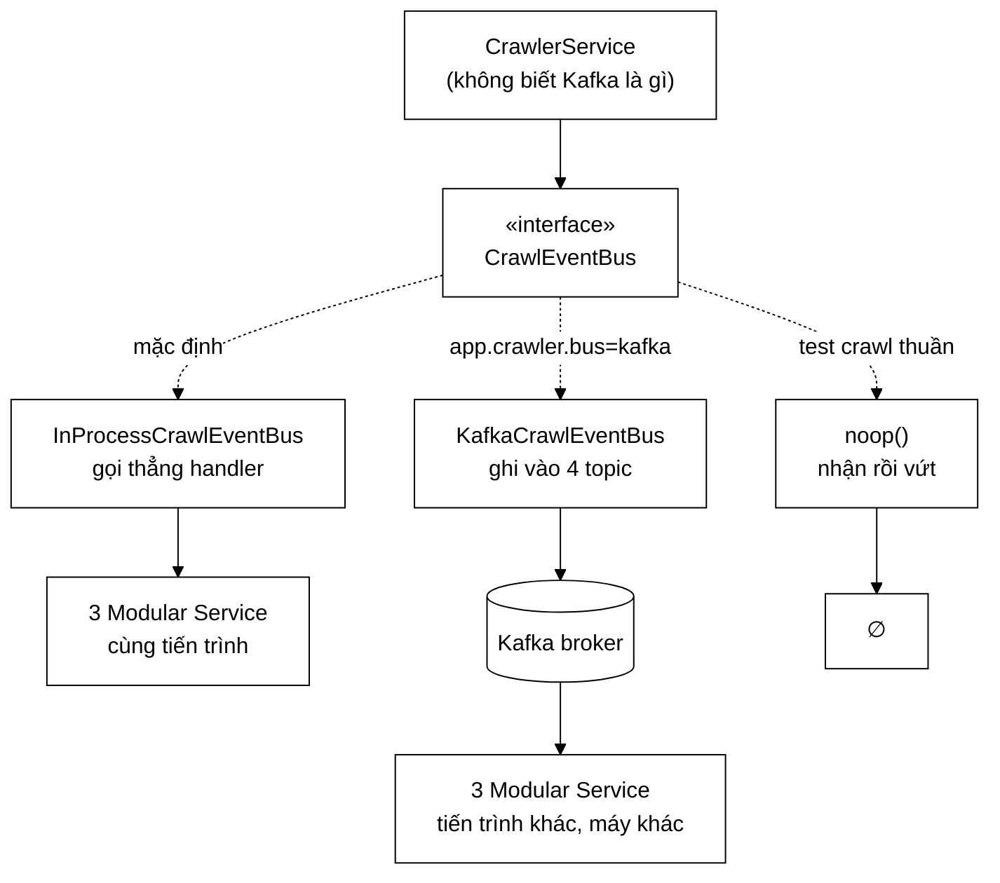
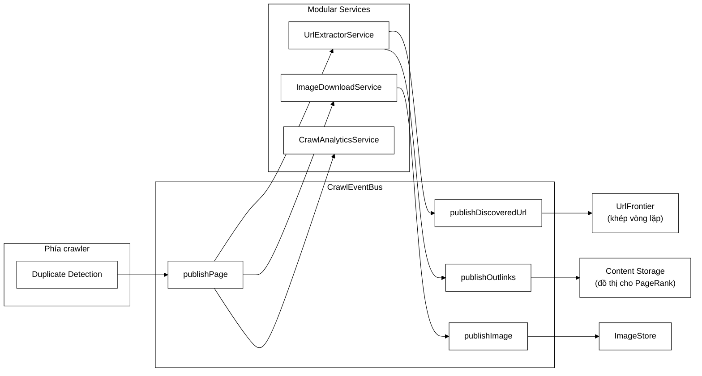

# CrawlEventBus — một interface bốn phương thức, hai thế giới triển khai

**File nguồn:** `search-engine/src/main/java/com/vnsearch/crawler/bus/CrawlEventBus.java` (113 dòng)
**Gói:** `com.vnsearch.crawler.bus` · **Loại:** `interface`, có một `static` factory
**Vị trí trong sơ đồ:** chính là ô **`Kafka`** — nhưng nhìn từ phía mã nguồn, nơi Kafka còn chưa chắc tồn tại
**Đọc kèm:** [`InProcessCrawlEventBus.md`](./InProcessCrawlEventBus.md) · [`KafkaCrawlEventBus.md`](./KafkaCrawlEventBus.md) · [`PageEvent.md`](./PageEvent.md)

---

## 📌 Hiểu trong 30 giây

Sơ đồ kiến trúc vẽ một ô tên `Kafka` nằm giữa crawler và cụm **Modular
Services**. Nhưng nếu `CrawlerService` gọi thẳng `KafkaTemplate` thì cả dự án
sẽ **không chạy được nếu không có broker** — không chạy test, không chạy
`run-crawl.bat`, không demo được trên một máy.

Interface này là chỗ ô `Kafka` bị **hạ cấp xuống thành một chi tiết triển
khai**. Bốn phương thức `publishXxx`, một bộ đếm lỗi, và một bus rỗng. Ai gọi
cũng không biết phía sau là một lời gọi hàm hay một vòng mạng.



```
   ĐIỀU CẦN THẤY: BA CỘT DƯỚI ĐÂY DÙNG CHUNG MỘT MÃ NGUỒN SERVICE

   ┌──────────────┬──────────────────┬──────────────────┬──────────────┐
   │              │  in-process      │  kafka           │  noop        │
   ├──────────────┼──────────────────┼──────────────────┼──────────────┤
   │ Broker       │  không           │  có              │  không       │
   │ Serialize    │  không           │  JSON + lz4      │  không       │
   │ Mạng         │  không           │  có              │  không       │
   │ Độ trễ/trang │  ~micro-giây     │  ~mili-giây      │  ~0          │
   │ Dựng test    │  0 giây          │  ~15 giây        │  0 giây      │
   │ Co giãn      │  1 tiến trình    │  N tiến trình    │  —           │
   ├──────────────┼──────────────────┴──────────────────┴──────────────┤
   │ Mã của       │                                                    │
   │ UrlExtractor │   K H Ô N G   Đ Ổ I   M Ộ T   D Ò N G              │
   │ Service      │                                                    │
   └──────────────┴────────────────────────────────────────────────────┘
```

---

## 1. Vấn đề mà interface này giải

### 1.1 Nếu không có nó

Giả sử `CrawlerService` gọi thẳng Kafka. Đoạn mã sẽ trông như sau:

```java
// GIẢ ĐỊNH — KHÔNG phải mã thật của dự án
kafkaTemplate.send("crawl.pages", host, event);
```

Một dòng, trông vô hại. Nhưng nó kéo theo dây chuyền hậu quả:

```
   ① CrawlerService PHỤ THUỘC spring-kafka
        → mọi bài test crawler phải có KafkaTemplate
        → hoặc mock nó (mock một API bất đồng bộ trả CompletableFuture: đau)
        → hoặc dựng Testcontainers (~15 giây/lớp test)

   ② run-crawl.bat trên máy người chấm
        → "Connection to node -1 could not be established"
        → thử lại 30 giây → treo → người chấm đóng cửa sổ

   ③ UrlExtractorService phải nhận ConsumerRecord<String, PageEvent>
        → nó KHÔNG CÒN gọi được từ mã Java thuần
        → nó KHÔNG CÒN chạy được ở chế độ một tiến trình
        → tức là "tách service" chỉ còn trên giấy

   ④ Muốn thêm service thứ tư → phải hiểu Kafka trước khi viết logic
```

Hậu quả ③ là hậu quả nặng nhất và cũng khó thấy nhất, vì nó **không gây lỗi
biên dịch** — nó chỉ âm thầm biến kiến trúc mô-đun thành kiến trúc dính chặt
hạ tầng.

### 1.2 Javadoc dòng 26–41 nói thẳng ba lý do — và lý do thứ ba là lý do thật

| # | Lý do | Loại lợi ích |
|---|---|---|
| 1 | Test chạy được mà không cần broker | **Vận hành** — bộ test chậm là bộ test không ai chạy |
| 2 | Đồ án vẫn chạy trên một máy | **Trình bày** — người chấm gõ `run-crawl.bat` phải thấy nó chạy |
| 3 | **Nó ép kiến trúc phải đúng** | **Thiết kế** — đây mới là lý do thật |

Lý do 3 đáng được diễn giải kỹ, vì nó là một kỹ thuật thiết kế có thể mượn lại
ở dự án khác:

```
   RÀNG BUỘC TỰ ÁP:  "cùng một object service phải chạy được ở CẢ HAI chế độ"

   Ràng buộc đó SUY RA:
        → service không được nhận ConsumerRecord
        → service không được gọi Acknowledgment.acknowledge()
        → service không được mang chú giải @KafkaListener
        → service chỉ được nhận một record thuần: PageEvent

   Mà một lớp chỉ nhận PageEvent thuần thì:
        → test được bằng JUnit trần, 3 dòng, 0 giây khởi động
        → tái dùng được ở batch job, ở CLI, ở bài đánh giá
        → phần dính broker bị ĐẨY HẾT ra rìa: KafkaCrawlEventBus (156 dòng)
          và CrawlKafkaListeners (mấy lớp chuyển tiếp mỏng)

   ⇒ Một ràng buộc về khả năng chạy, đổi lấy một kiến trúc sạch.
```

Javadoc dòng 43–44 chốt lại rất đúng trọng tâm:

> Bản in-process **không phải** là "bản rút gọn cho người nghèo". Nó là công cụ
> giữ cho phần lõi sạch khỏi hạ tầng.

Đây là điểm nên nói khi bảo vệ đồ án, vì phản xạ thông thường của người nghe là
*"in-process chỉ là bản tạm, bản Kafka mới là bản thật"* — và điều đó sai.

---

## 2. Bốn phương thức, bốn luồng dữ liệu



| Phương thức | Ai gọi | Ai nhận | Thông điệp |
|---|---|---|---|
| `publishPage` | Crawler, sau Duplicate Detection | **Cả ba** service | [`PageEvent`](./PageEvent.md) |
| `publishDiscoveredUrl` | `UrlExtractorService` | `UrlFrontier` | [`DiscoveredUrl`](./DiscoveredUrl.md) |
| `publishOutlinks` | `UrlExtractorService` | `ContentStorage` | [`OutlinksExtracted`](./OutlinksExtracted.md) |
| `publishImage` | `ImageDownloadService` | `ImageStore` | [`ImageFound`](./ImageFound.md) |

Hai điều đáng chú ý trong bảng này:

**① Mũi tên đi hai chiều.** Ô `Kafka` trong sơ đồ kiến trúc nối với cụm Modular
Services bằng mũi tên hai đầu, và ba phương thức cuối chính là chiều về.
Service không chỉ **tiêu thụ** — nó còn **sản xuất**, và sản phẩm của nó quay
lại nuôi crawler. Đó là lý do vòng lặp crawl khép kín được dù crawler không hề
biết `UrlExtractorService` tồn tại.

**② `publishPage` là điểm phát tán một-tới-nhiều.** Javadoc dòng 64–65:

> Đây là điểm phát tán một-tới-nhiều: một lời gọi, ba service nhận. Thêm
> service thứ tư không cần sửa dòng nào ở đây.

```
   TRƯỚC (gọi trực tiếp):                SAU (qua bus):

   processPage(doc) {                    processPage(doc) {
       analytics.record(doc);                bus.publishPage(event);
       images.scan(doc);                 }
       urls.extract(doc);
       // thêm service thứ 4:           // thêm service thứ 4:
       // → SỬA FILE NÀY                // → bus.subscribePages(sv4)
   }                                    //   ở chỗ lắp ráp, KHÔNG đụng crawler
```

Đây là **Observer pattern** ở mức kiến trúc, và lợi ích của nó không phải là
"ít gõ hơn" mà là: **chỗ phải sửa khi thêm tính năng nằm ở chỗ lắp ráp, không
nằm trong đường nóng của crawler.**

---

## 3. Ngữ nghĩa giao hàng — phần dễ bỏ sót nhất

Javadoc dòng 46–57 định nghĩa một hợp đồng **bất đối xứng**, và sự bất đối xứng
đó là có chủ ý:

```
   ┌─────────────────────────────────────────────────────────────────┐
   │  LỖI KHI GỬI (phía producer)                                    │
   │  ─────────────────────────────                                  │
   │  → KHÔNG ném ngoại lệ.                                          │
   │  → Bản cài tự ghi log, tự tăng getPublishFailureCount().        │
   │                                                                 │
   │  Vì sao: một trang không đẩy được lên bus = một trang mất khỏi   │
   │  các service phái sinh. Đáng cảnh báo. KHÔNG đáng làm chết một   │
   │  phiên crawl đã chạy 4 tiếng và đã lưu 20.000 trang.             │
   └─────────────────────────────────────────────────────────────────┘

   ┌─────────────────────────────────────────────────────────────────┐
   │  LỖI KHI XỬ LÝ (phía consumer)                                  │
   │  ────────────────────────────                                   │
   │  → CÓ ném ngoại lệ, và đó là hành vi ĐÚNG.                      │
   │  → Kafka: kích hoạt retry → dead-letter topic.                  │
   │  → In-process: InProcessCrawlEventBus bắt và cô lập.            │
   │                                                                 │
   │  Vì sao: thông điệp KHÔNG MẤT, chỉ chuyển sang chỗ chờ người xem.│
   │  Nuốt lặng lẽ ở đây = mất dữ liệu không dấu vết.                 │
   └─────────────────────────────────────────────────────────────────┘
```

Cách nhớ ngắn gọn:

> **Gửi hỏng thì đếm. Xử lý hỏng thì ném.**
> Vì gửi hỏng là mất một trang; xử lý hỏng là một thông điệp cần người xem.

Sai lầm kinh điển là làm ngược lại: ném khi gửi hỏng (giết cả phiên crawl vì
broker nấc một giây) và nuốt khi xử lý hỏng (mất dữ liệu, không ai biết).

### 3.1 `getPublishFailureCount()` nằm trong **interface**, không chỉ ở bản Kafka

Dòng 86–93. Quyết định nhỏ, lợi ích lớn:

```java
long getPublishFailureCount();
```

```
   NẾU chỉ có ở KafkaCrawlEventBus:

       if (bus instanceof KafkaCrawlEventBus k) {         ← kiểm tra kiểu thật
           meter.gauge("publish_failures", k.getPublishFailureCount());
       }
       // còn chế độ in-process thì... không có số?

   → mã đo lường phải BIẾT các bản cài  → đúng thứ interface sinh ra để tránh
   → dashboard có lỗ hổng đúng ở chế độ đang chạy test

   CÓ trong interface:

       meter.gauge("publish_failures", bus::getPublishFailureCount);   ← xong

   → một con số LUÔN đọc được, bất kể chế độ nào
   → dựng thang đo và cảnh báo mà không cần instanceof
```

Thang đo tương ứng là `vnsearch_crawl_bus_publish_failures_total` — xem
[`MetricsConfig.md`](../../config/MetricsConfig.md).

---

## 4. `noop()` — Null Object pattern, dòng 95–112

```java
static CrawlEventBus noop() {
    return new CrawlEventBus() {
        @Override public void publishPage(PageEvent event) { /* vứt */ }
        @Override public void publishDiscoveredUrl(DiscoveredUrl url) { /* vứt */ }
        @Override public void publishOutlinks(OutlinksExtracted outlinks) { /* vứt */ }
        @Override public void publishImage(ImageFound image) { /* vứt */ }
        @Override public long getPublishFailureCount() { return 0L; }
    };
}
```

### 4.1 Nó thay thế cái gì

```
   PHƯƠNG ÁN A — cho phép bus == null
   ─────────────────────────────────────────────────────────
   trong CrawlerService, RẢI KHẮP NƠI:

       if (bus != null) bus.publishPage(event);
       ...
       if (bus != null) bus.publishDiscoveredUrl(url);
       ...
       if (bus != null) bus.publishImage(img);

   → 4 chỗ kiểm tra, và chỉ cần QUÊN MỘT chỗ là NullPointerException
   → NPE đó xảy ra ở đường nóng, giữa phiên crawl, chỉ khi chạy test
   → và mỗi lần thêm một lời gọi publish mới là thêm một cơ hội quên


   PHƯƠNG ÁN B — Null Object (đang dùng)
   ─────────────────────────────────────────────────────────
       CrawlEventBus bus = CrawlEventBus.noop();
       bus.publishPage(event);      ← luôn hợp lệ, không cần kiểm tra

   → 0 chỗ kiểm tra
   → KHÔNG BAO GIỜ ném NPE
   → thêm phương thức mới vào interface: trình biên dịch BẮT BUỘC
     bổ sung bản rỗng, nên không thể quên
```

### 4.2 Dùng ở đâu

- Bài test chỉ quan tâm tới phần crawl (frontier, downloader, parser) và không
  muốn dựng handler nào — xem
  [`CrawlerServiceBusWiringTest.md`](../../../../../test/java/com/vnsearch/crawler/CrawlerServiceBusWiringTest.md).
- `MultiDomainCrawlRunner` khi chạy ở chế độ chỉ đo, không cần service phái
  sinh.
- Là **giá trị mặc định an toàn**: một `CrawlerService` mới tạo mà chưa được
  gắn bus vẫn chạy đúng, chỉ là không phát tán gì.

### 4.3 Vì sao `getPublishFailureCount()` trả `0L` chứ không ném

Vì hợp đồng nói đây là "số lần gửi thất bại". Bus rỗng không gửi đi đâu, nên
không thất bại lần nào. `0L` là câu trả lời **đúng về mặt ngữ nghĩa**, không
phải một giá trị giả cho có. Ném `UnsupportedOperationException` ở đây sẽ phá
đúng cái mà Null Object hứa: gọi được mọi lúc, không cần biết mình đang cầm bản
cài nào.

---

## 5. Hướng dẫn về code

### 5.1 Vì sao là `interface` chứ không phải lớp trừu tượng

```
   Lớp trừu tượng sẽ cho phép chia sẻ mã (bộ đếm lỗi, log...).
   Nhưng nó ăn mất "suất kế thừa" duy nhất của Java.

   KafkaCrawlEventBus có thể sau này muốn kế thừa một lớp hạ tầng khác.
   InProcessCrawlEventBus thì không có gì chung với nó về mặt cài đặt:
        - một bên đếm bằng AtomicLong sau callback bất đồng bộ
        - một bên đếm ngay trong catch đồng bộ
   → phần "chung" hoá ra chỉ là hai dòng khai báo AtomicLong.

   ⇒ Không đáng đánh đổi. Interface + `static noop()` là đủ.
```

### 5.2 Vì sao `noop()` là `static` **trong interface**, không phải một lớp riêng

Java 8 trở đi cho phép `static` method trong interface. Đặt ở đây thì:

- **Tìm được ngay**: gõ `CrawlEventBus.` là IDE gợi ý `noop()`. Một lớp
  `NoopCrawlEventBus` riêng đòi người đọc phải biết trước nó tồn tại.
- **Không có lớp public thừa** trong gói — bản rỗng là chi tiết triển khai của
  chính hợp đồng, không phải một khái niệm ngang hàng với hai bản cài thật.
- Đây cùng khuôn với `Comparator.naturalOrder()`, `List.of()` trong thư viện
  chuẩn: factory cho bản cài tầm thường sống trong interface.

### 5.3 Vì sao **không** có `close()` / `flush()`

Một câu hỏi hợp lý: producer Kafka có bộ đệm, vậy ai gọi `flush()` lúc kết thúc
phiên crawl?

Câu trả lời là **Spring**. `KafkaTemplate` được quản lý bởi container, và
`DefaultKafkaProducerFactory` đóng producer (kèm flush) trong vòng đời bean.
Thêm `close()` vào interface này sẽ:

- ép `InProcessCrawlEventBus` cài một phương thức rỗng vô nghĩa;
- ép `CrawlerService` phải quản lý vòng đời của một thứ nó không sở hữu;
- và tạo ra khả năng gọi `close()` hai lần từ hai chỗ.

Nguyên tắc: **ai tạo thì người đó đóng**. Crawler chỉ mượn bus.

### 5.4 Cạm bẫy khi sửa lớp này

| Ý định | Hậu quả |
|---|---|
| Thêm `publishXxx` mới | `noop()` là lớp ẩn danh → trình biên dịch báo lỗi ngay, tốt. Nhưng **nhớ thêm cả topic** ở `KafkaCrawlEventBus` và `KafkaCrawlConfig` |
| Cho một phương thức `throws` | Phá hợp đồng "gửi hỏng thì đếm" → mọi chỗ gọi phải bọc try/catch → quay lại đúng vấn đề ban đầu |
| Đưa `ConsumerRecord` vào chữ ký | Phá lý do 3 ở mục 1.2 — kéo Kafka vào lõi, không đảo lại được |
| Trả `CompletableFuture` thay vì `void` | Ép mọi chỗ gọi phải quyết định chờ hay không → đường nóng của crawler đầy `.whenComplete` |
| Bỏ `getPublishFailureCount()` khỏi interface | Mã đo lường phải `instanceof` — xem mục 3.1 |

### 5.5 Thêm một Modular Service thứ tư — quy trình đầy đủ

Đây là bài kiểm tra thực tế cho chất lượng của interface này. Giả sử cần thêm
`SentimentService` đọc luồng trang:

```java
// 1. Viết service — KHÔNG import gì của Kafka
public class SentimentService implements PageEventHandler {
    @Override public void onPage(PageEvent event) {
        // đọc event.bodyText(), tính điểm, ghi vào kho
    }
    @Override public String handlerName() { return "SentimentService"; }
}
```

```
   2. Chế độ in-process — thêm MỘT dòng ở chỗ lắp ráp:
        bus.subscribePages(new SentimentService());

   3. Chế độ Kafka — thêm một @KafkaListener mỏng ở CrawlKafkaListeners,
      trỏ vào topic crawl.pages với một group.id MỚI:
        (group mới ⇒ nó đọc lại từ đầu topic, không tranh phần với 3 service kia)

   4. CrawlEventBus.java:        KHÔNG SỬA
      CrawlerService.java:       KHÔNG SỬA
      3 service cũ:              KHÔNG SỬA
```

Nếu bước 4 mà phải sửa, interface đã thiết kế sai. Ở đây thì không.

---

## 6. Độ phức tạp & chi phí

Interface tự nó không có chi phí; bảng dưới so hai bản cài, đo trên corpus
31.030 trang:

| Đại lượng | in-process | Kafka |
|---|---|---|
| Độ trễ một lời `publishPage` | ~2 µs (gọi hàm + try/catch) | ~0,3 ms (serialize + ghi bộ đệm) |
| Chi phí CPU serialize | 0 | JSON hoá ~80 KB/trang |
| Băng thông | 0 | ~11 KB/trang sau nén lz4 (6–8×) |
| Bộ nhớ thêm | 4 `CopyOnWriteArrayList` | bộ đệm producer (mặc định 32 MB) |
| Thời gian dựng cho test | 0 s | ~15 s (Testcontainers) |
| Số tiến trình chạy được | 1 | N |

```
   TỔNG CHI PHÍ TRÊN CẢ PHIÊN CRAWL 31.030 TRANG

   in-process:  31.030 × 2 µs      ≈ 0,06 giây      (nhiễu, không đo được)
   Kafka:       31.030 × 0,3 ms    ≈ 9,3 giây       trên tổng ~8,6 giờ crawl
                                                     ⇒ ~0,03% thời gian

   ⇒ Chi phí của bus KHÔNG BAO GIỜ là nút thắt.
     Nút thắt là chính sách lịch sự 1 trang/giây/host — và nó nằm ở
     UrlFrontier, cách đây rất xa.
```

Đây là lý do việc bọc thêm một tầng gián tiếp ở đây là quyết định **rẻ**: nó
mua khả năng đổi chế độ triển khai bằng một chi phí không đo được.

---

## 7. Kiểm thử liên quan

| Bộ test | Kiểm gì |
|---|---|
| [`InProcessCrawlEventBusTest`](../../../../../test/java/com/vnsearch/crawler/bus/InProcessCrawlEventBusTest.md) | Phát tán tới nhiều handler; cô lập lỗi; bộ đếm |
| [`CrawlEventTest`](../../../../../test/java/com/vnsearch/crawler/bus/CrawlEventTest.md) | Bất biến của bốn record thông điệp |
| [`KafkaCrawlBusIT`](../../../../../test/java/com/vnsearch/crawler/bus/KafkaCrawlBusIT.md) | Vòng đi–về thật qua broker — bắt được lỗi serialize mà in-process không lộ |
| [`CrawlerServiceBusWiringTest`](../../../../../test/java/com/vnsearch/crawler/CrawlerServiceBusWiringTest.md) | Crawler gọi đúng phương thức, đúng thời điểm |

Một bài test còn thiếu, và nó kiểm đúng hợp đồng của interface này:

```java
// Bus rỗng phải nuốt được MỌI thứ, kể cả null, không ném gì
@Test
void busRongKhongBaoGioNem() {
    var bus = CrawlEventBus.noop();
    assertDoesNotThrow(() -> {
        bus.publishPage(null);
        bus.publishDiscoveredUrl(null);
        bus.publishOutlinks(null);
        bus.publishImage(null);
    });
    assertEquals(0L, bus.getPublishFailureCount());
}

// Hai bản cài phải hành xử GIỐNG NHAU trước cùng một chuỗi lời gọi
// (contract test — chạy chung một bộ khẳng định cho cả hai)
@ParameterizedTest
@MethodSource("moiBanCai")
void moiBanCaiDeuKhongNemKhiGuiHong(CrawlEventBus bus) {
    // ép lỗi gửi, khẳng định: không ném + getPublishFailureCount() tăng
}
```

Kiểu test cuối (**contract test** cho interface) là thứ đáng đầu tư nhất ở đây:
nó là cách duy nhất chứng minh bằng máy rằng hai chế độ hành xử như nhau — lời
hứa trung tâm của cả thiết kế này.

---

## 8. Liên kết

- Bản cài mặc định, và cơ chế cô lập lỗi: [`InProcessCrawlEventBus.md`](./InProcessCrawlEventBus.md)
- Bản cài phân tán, và chuyện khoá phân hoạch: [`KafkaCrawlEventBus.md`](./KafkaCrawlEventBus.md)
- Hợp đồng của bên nhận: [`PageEventHandler.md`](./PageEventHandler.md)
- Bốn thông điệp: [`PageEvent.md`](./PageEvent.md) · [`DiscoveredUrl.md`](./DiscoveredUrl.md) · [`OutlinksExtracted.md`](./OutlinksExtracted.md) · [`ImageFound.md`](./ImageFound.md)
- Nơi chọn bản cài theo cấu hình: [`../../config/KafkaCrawlConfig.md`](../../config/KafkaCrawlConfig.md)
- Các lớp chuyển tiếp mỏng phía consumer: [`../../config/CrawlKafkaListeners.md`](../../config/CrawlKafkaListeners.md)
- Nơi gọi `publishPage`: [`../CrawlerService.md`](../CrawlerService.md)
- Tổng quan: `docs/ARCHITECTURE.md`
