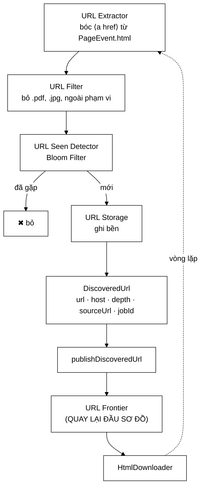

# DiscoveredUrl — một trường `host` giải hai bài toán phân tán

**File nguồn:** `search-engine/src/main/java/com/vnsearch/crawler/bus/DiscoveredUrl.java` (86 dòng)
**Gói:** `com.vnsearch.crawler.bus` · **Loại:** `record` (bất biến), 5 thành phần
**Vị trí trong sơ đồ:** mũi tên khép vòng **URL Seen Detector → Kafka → URL Frontier**
**Đọc kèm:** [`OutlinksExtracted.md`](./OutlinksExtracted.md) · [`KafkaCrawlEventBus.md`](./KafkaCrawlEventBus.md) · [`../UrlSeenFilter.md`](../UrlSeenFilter.md)

---

## 📌 Hiểu trong 30 giây

Record chỉ có 5 trường, không có phương thức nào ngoài compact constructor. Nhìn
qua thì tầm thường. Nhưng nó chứa **quyết định phân tán quan trọng nhất của cả
dự án**, giấu trong một trường tưởng như thừa:

> `host` được lưu **riêng** thay vì suy ra từ `url` — vì nó là **khoá phân
> hoạch Kafka**, và chính khoá đó làm cho phép chống trùng bằng Bloom Filter
> trong bộ nhớ tiếp tục đúng khi có N tiến trình crawler.

Đây là thông điệp **khép lại vòng lặp** của sơ đồ kiến trúc: URL do
`UrlExtractorService` bóc ra đi qua bus rồi quay về `UrlFrontier` — điểm bắt đầu.



```
   NĂM TRƯỜNG, VÀ VÌ SAO CÓ TỪNG TRƯỜNG

   url        địa chỉ đã chuẩn hoá, ĐÃ qua URL Filter + URL Seen
   host       ⭐ KHOÁ PHÂN HOẠCH — lý do tồn tại của tài liệu này
   depth      độ sâu BFS mà URL này sẽ mang khi vào frontier
   sourceUrl  trang sinh ra liên kết — để lần vết và dựng đồ thị
   jobId      phiên crawl nào sở hữu URL này (xem PageEvent mục 4)
```

---

## 1. Bài toán: Bloom Filter trong bộ nhớ không sống nổi khi nhân bản

Javadoc dòng 22–26 đặt vấn đề rất gọn.

```
   MỘT TIẾN TRÌNH — mọi thứ đúng
   ─────────────────────────────────────────────────────────────
        ┌──────────────────────────────────┐
        │  Crawler                         │
        │    UrlSeenFilter                 │
        │      └─ BloomFilter (RAM)        │  ← nguồn sự thật DUY NHẤT
        └──────────────────────────────────┘
        Mọi URL đều đi qua đúng bộ lọc này. Chống trùng: ĐÚNG.


   N TIẾN TRÌNH — sập hoàn toàn
   ─────────────────────────────────────────────────────────────
        ┌──────────────┐  ┌──────────────┐  ┌──────────────┐
        │  Crawler A   │  │  Crawler B   │  │  Crawler C   │
        │  Bloom(A)    │  │  Bloom(B)    │  │  Bloom(C)    │
        └──────────────┘  └──────────────┘  └──────────────┘
              ↑                  ↑                  ↑
        BA bộ lọc RIÊNG BIỆT, không ai biết ai.

        A đã crawl /bai-x  → Bloom(A) ghi nhận
        B nhận /bai-x      → Bloom(B) nói "mới!"  → TẢI LẠI
        C nhận /bai-x      → Bloom(C) nói "mới!"  → TẢI LẠI

        ⇒ Chống trùng KHÔNG SẬP MỘT PHẦN — nó sập HOÀN TOÀN.
        ⇒ Và tệ hơn: mỗi trang bị tải N lần ⇒ chính sách lịch sự
          cũng vỡ theo (xem mục 3).
```

Điểm cần hiểu: đây **không phải** lỗi của `UrlSeenFilter`. Bloom Filter trong
bộ nhớ là lựa chọn đúng cho một tiến trình. Vấn đề là **trạng thái cục bộ gặp
kiến trúc phân tán** — một tình huống kinh điển, và có đúng ba cách chữa.

---

## 2. Ba cách chữa, và vì sao chọn cách thứ ba

Javadoc dòng 28–51.

| Cách | Đánh giá |
|---|---|
| Bloom Filter dùng chung trên Redis | Đúng, nhưng thêm một hệ thống phải vận hành, và mỗi lần tra là một vòng mạng — trên đường nóng crawler đó là chi phí thật |
| Chấp nhận trùng, lọc lại lúc lập chỉ mục | **Bác bỏ** — lãng phí nằm ở *băng thông tải trang*, mà lọc muộn thì trang đã tải rồi |
| **Phân hoạch theo host** | **Đang dùng** — không thêm hệ thống nào, không thêm vòng mạng nào |

### 2.1 Vì sao Redis không sai nhưng vẫn không chọn

```
   Redis Bloom Filter dùng chung — nó ĐÚNG về mặt logic:

        Crawler A ──┐
        Crawler B ──┼──▶ Redis (một Bloom Filter chung)
        Crawler C ──┘

   Chi phí thật:
        ① Thêm một hệ thống phải cài, cấu hình, giám sát, sao lưu,
          và phải xử lý khi nó chết (Redis chết ⇒ crawler chết?)
        ② Mỗi URL = một vòng mạng (~0,5-2 ms trong cùng mạng LAN)
          Với ~40 liên kết/trang × 31.030 trang ≈ 1,24 triệu lượt tra
          ⇒ 1,24M × 1 ms ≈ 20 phút CPU-chờ thuần
        ③ Và nó KHÔNG giải được bài toán chính sách lịch sự (mục 3)

   ⇒ Đúng, nhưng đắt về vận hành và vẫn phải giải bài toán thứ hai riêng.
```

### 2.2 Vì sao "lọc muộn" là hiểu sai vấn đề

```
   Ý tưởng: cứ để trùng, lúc lập chỉ mục thì khử.

   SAI Ở CHỖ NÀO?  Nó nhầm chỗ tốn kém.

        Tốn kém THẬT nằm ở:  TẢI TRANG
             - băng thông ra ngoài
             - thời gian (bị chặn ở 1 trang/giây/host)
             - và quan trọng nhất: LÀM PHIỀN TRANG ĐÍCH

        Lọc lúc lập chỉ mục xảy ra SAU khi đã tải.
        ⇒ Đã trả toàn bộ cái giá rồi mới vứt kết quả đi.

   Nói cách khác: đây là tối ưu ở sai tầng.
   Việc khử trùng NỘI DUNG lúc muộn thì có (ContentSeenFilter),
   nhưng nó giải bài toán KHÁC — hai URL khác nhau, cùng nội dung.
```

### 2.3 Cách được chọn: để Kafka làm việc điều phối

```
   BA TÍNH CHẤT CỦA KAFKA, GHÉP LẠI THÀNH LỜI GIẢI

   ① Mọi thông điệp CÙNG KHOÁ  →  CÙNG một phân hoạch
        partition = murmur2(key) % numPartitions

   ② Một phân hoạch  →  giao cho ĐÚNG MỘT consumer trong một group

   ③ Suy ra: mọi URL của "vnexpress.net"  →  luôn về ĐÚNG MỘT tiến trình


   ┌─────────────────────────────────────────────────────────────────┐
   │                    topic  crawl.urls   (12 phân hoạch)          │
   │                                                                 │
   │  P0  P1  P2  P3  P4  P5  P6  P7  P8  P9  P10  P11               │
   │   │       │           │                                         │
   │   │       │           └── tuoitre.vn                            │
   │   │       └────────────── thanhnien.vn                          │
   │   └────────────────────── vnexpress.net                         │
   │                                                                 │
   │   └──┬──┘  └──┬──┘  └──┬──┘  └──┬──┘                            │
   │  Crawler A  Crawler B  Crawler C  Crawler D                     │
   └─────────────────────────────────────────────────────────────────┘

        MỌI url của vnexpress.net  →  P0  →  Crawler A
        ⇒ Bloom(A) thấy TOÀN BỘ lịch sử của vnexpress.net
        ⇒ Bloom(A) là nguồn sự thật ĐẦY ĐỦ cho host đó
        ⇒ Chống trùng lại ĐÚNG, mà KHÔNG thêm hệ thống nào
```

Đây là kỹ thuật **partition-affinity**: thay vì chia sẻ trạng thái, ta *định
tuyến* để trạng thái không cần chia sẻ. Nó rẻ hơn nhiều so với mọi giải pháp
đồng bộ hoá phân tán, và đáng nhớ như một khuôn mẫu chung.

---

## 3. Phần thưởng kèm theo: chính sách lịch sự cũng đúng theo

Javadoc dòng 53–57. Đây là chỗ quyết định này trở nên **đặc biệt tốt** chứ
không chỉ đủ dùng.

```
   QUAN SÁT:  chính sách lịch sự CŨNG là thuộc tính theo host.

        "Không quá 1 request/giây tới vnexpress.net"

   UrlFrontier cài bộ hoãn này bằng một cấu trúc TRONG BỘ NHỚ:
        Map<host, thời điểm được phép gọi tiếp>

   ┌───────────────────────────────────────────────────────────────┐
   │ NẾU KHÔNG phân hoạch theo host:                               │
   │                                                               │
   │   Crawler A: "vnexpress.net — lần cuối 10:00:00, chờ 1s"      │
   │   Crawler B: "vnexpress.net — lần cuối 10:00:00, chờ 1s"      │
   │   Crawler C: "vnexpress.net — lần cuối 10:00:00, chờ 1s"      │
   │                                                               │
   │   → thực tế vnexpress.net nhận 3 request/giây                 │
   │   → cam kết 1 req/s bị PHÁ, mà không ai trong hệ thống biết   │
   │   → và bên bị hại chỉ thấy: crawler này không tôn trọng ai     │
   │                                                               │
   │   Chữa thế nào? Một bộ điều phối rate-limit PHÂN TÁN.          │
   │   → thêm Redis + thuật toán token bucket phân tán              │
   │   → thêm một bài toán đồng thuận nữa                           │
   └───────────────────────────────────────────────────────────────┘

   ┌───────────────────────────────────────────────────────────────┐
   │ CÓ phân hoạch theo host:                                      │
   │                                                               │
   │   Chỉ Crawler A từng chạm vnexpress.net.                      │
   │   Map trong bộ nhớ của A là nguồn sự thật ĐẦY ĐỦ.             │
   │   → 1 req/s CHÍNH XÁC, không cần điều phối gì cả.             │
   └───────────────────────────────────────────────────────────────┘
```

> **Một quyết định, hai bài toán được giải.**
> Đây là dấu hiệu của một quyết định kiến trúc tốt: nó không chỉ chữa triệu
> chứng mà tìm đúng *chiều phân rã tự nhiên* của bài toán. Cả chống trùng lẫn
> lịch sự đều **theo host** — nên chia hệ thống theo host thì cả hai đều tự
> đúng.

Cách kiểm tra một quyết định phân hoạch có tốt không: liệt kê mọi trạng thái
cục bộ trong hệ thống và hỏi *"trạng thái này khoá theo cái gì?"*. Nếu tất cả
cùng khoá theo một thứ, đó chính là khoá phân hoạch đúng.

---

## 4. Giới hạn đã biết — và vì sao chấp nhận

Javadoc dòng 59–63 tự nêu điểm yếu, đây là phần trung thực đáng ghi nhận:

```
   PHÂN HOẠCH THEO HOST ⇒ TẢI PHÂN BỐ KHÔNG ĐỀU

        vnexpress.net    120.000 URL  ──▶ P0  ──▶ Crawler A  (bận nhất)
        tuoitre.vn        80.000 URL  ──▶ P3  ──▶ Crawler B
        blog-nho.vn           50 URL  ──▶ P7  ──▶ Crawler D  (gần như rảnh)

   Một host khổng lồ VẪN nằm gọn trên một tiến trình.
   Thêm máy KHÔNG giúp gì cho host đó.
```

Vì sao vẫn chấp nhận — hai lý do, và lý do thứ hai mới là lý do quyết định:

**① Tính đúng quan trọng hơn cân tải.** Chống trùng sai là mất băng thông và
làm bẩn corpus; tải lệch chỉ là dùng máy chưa hết công suất.

**② Trần thông lượng của một host vốn đã bị chặn ở 1 trang/giây.**

```
   Đây mới là lập luận mạnh nhất:

        Dù có 10 tiến trình cùng phục vụ vnexpress.net,
        chính sách lịch sự vẫn chỉ cho phép 1 trang/giây.

   ⇒ Việc "san đều" host đó ra nhiều máy KHÔNG mang lại thông lượng
     nào thêm cả. Nó chỉ làm bài toán rate-limit khó hơn.

   ⇒ Giới hạn thực tế không nằm ở CPU hay số máy — nó nằm ở
     phép lịch sự mà ta TỰ ÁP. Nên phân hoạch không đều là
     giới hạn VÔ HẠI.
```

Đây là ví dụ tốt cho cách phân tích đánh đổi: một nhược điểm chỉ là nhược điểm
khi nó chặn thứ ta thực sự muốn. Ở đây nó không chặn gì.

**Ca duy nhất nhược điểm này thành thật:** nếu sau này chính sách lịch sự được
nới theo `robots.txt` `Crawl-delay` (một số site cho phép nhanh hơn nhiều), một
host lớn có thể trở thành nút thắt thật. Lúc đó phương án là phân hoạch theo
`host + shard` với một hàm băm phụ, kèm bộ rate-limit theo host được chia sẻ
giữa các shard của cùng host.

---

## 5. Hướng dẫn về code

### 5.1 Vì sao `host` là trường riêng, không phải phương thức dẫn xuất

Câu hỏi tự nhiên: sao không viết

```java
// KHÔNG dùng
public String host() {
    return URI.create(url).getHost();
}
```

Bốn lý do, xếp theo mức nghiêm trọng:

```
   ① CÓ THỂ NÉM. URI.create() ném IllegalArgumentException với URL dị dạng.
      Mà nơi cần host là lúc GỬI — tức đường nóng, và một ngoại lệ ở đó
      biến "một URL xấu" thành "mất cả lô thông điệp".

   ② CÓ THỂ TRẢ null. URI.getHost() trả null cho vài dạng URL hợp lệ về
      cú pháp. Khoá phân hoạch null ⇒ Kafka chuyển sang phân hoạch
      round-robin ⇒ BẤT BIẾN Ở MỤC 2 BỊ PHÁ LẶNG LẼ.
      Đây là ca đáng sợ nhất: không lỗi, không log, chỉ là chống trùng
      từ từ hỏng khi số tiến trình > 1.

   ③ KHÔNG NHẤT QUÁN với cách phần còn lại tính host. UrlCanonicalizer đã
      chuẩn hoá host (bỏ "www.", hạ chữ thường). Tính lại bằng URI.getHost()
      có thể ra "WWW.VnExpress.net" ≠ "vnexpress.net"
      ⇒ HAI phân hoạch cho CÙNG một site ⇒ hai Bloom Filter ⇒ trùng lặp.

   ④ TÍNH LẠI NHIỀU LẦN. Mỗi lần gửi là một lần parse URL.
      Nhỏ, nhưng thừa — host đã được biết từ lúc lọc URL rồi.
```

Lý do ② và ③ là lý do thật: chúng biến một tiện ích nhỏ thành một lỗ hổng phá
đúng bất biến trung tâm. **Khi một giá trị là khoá định tuyến, nó phải được
tính một lần, ở nơi đã biết chắc, rồi mang theo.**

### 5.2 Compact constructor — dòng 75–85

```java
public DiscoveredUrl {
    if (url == null || url.isBlank()) {
        throw new IllegalArgumentException("DiscoveredUrl.url không được rỗng");
    }
    if (host == null || host.isBlank()) {
        throw new IllegalArgumentException("DiscoveredUrl.host không được rỗng, url=" + url);
    }
    if (depth < 0) {
        throw new IllegalArgumentException("DiscoveredUrl.depth phải >= 0, nhận được: " + depth);
    }
}
```

Cùng ba phép kiểm với [`PageEvent`](./PageEvent.md), và cùng lý do — nhưng ở
đây phép kiểm `host` mang trọng lượng lớn hơn hẳn:

```
   host rỗng ⇒ Kafka không có khoá ⇒ round-robin
             ⇒ URL của vnexpress.net rơi vào phân hoạch NGẪU NHIÊN
             ⇒ về một crawler CHƯA TỪNG thấy host đó
             ⇒ Bloom Filter của nó nói "mới!" cho một URL đã crawl
             ⇒ tải lại
             ⇒ và chính sách lịch sự cho host đó cũng sai theo

   MỘT trường rỗng ⇒ HAI bất biến vỡ.
   Nên ném ngay tại chỗ tạo là hoàn toàn xứng đáng.
```

Thông báo lỗi kèm `url=` (dòng 80) là chi tiết nhỏ nhưng quan trọng khi dò lỗi:
biết `host` rỗng thì vô dụng, biết **URL nào** có host rỗng thì sửa được ngay.

`sourceUrl` và `jobId` **không** bị kiểm — đúng nguyên tắc ở
[`PageEvent`](./PageEvent.md) mục 5.1: chỉ ném khi thiếu trường đó làm hỏng
định tuyến hoặc xử lý. Một URL không rõ nguồn vẫn crawl được.

### 5.3 `depth` — vì sao mang theo chứ không tính lại

```
   depth là độ sâu BFS mà URL này sẽ mang KHI VÀO FRONTIER.
   Nó bằng depth của trang nguồn + 1.

   Vì sao phải mang theo thông điệp:

        Ở chế độ in-process, UrlExtractor còn "nhìn thấy" trang nguồn.
        Ở chế độ Kafka, nó chỉ có PageEvent — mà PageEvent CŨNG mang depth.
        Nhưng thông điệp DiscoveredUrl thì đi tới một tiến trình KHÁC,
        nơi không có gì để suy ra độ sâu.

   ⇒ Cùng một lý do với jobId: khi lời gọi hàm thành thông điệp,
     ngữ cảnh ngầm phải được đóng gói tường minh.

   Và depth quyết định:
        - URL có bị cắt bởi maxDepth không
        - DefaultPrioritizer chấm điểm ưu tiên thế nào (nông hơn = ưu tiên hơn)
```

### 5.4 `sourceUrl` — hai công dụng

| Công dụng | Chi tiết |
|---|---|
| **Lần vết** | Khi một URL lạ xuất hiện trong corpus, biết ngay trang nào đã dẫn tới nó |
| **Đồ thị liên kết** | Cạnh `sourceUrl → url` là dữ liệu thô cho PageRank |

Lưu ý quan trọng: **đồ thị PageRank không được dựng từ luồng này.** Vì
`DiscoveredUrl` đã qua `URL Seen Detector`, nên nó **thiếu** mọi cạnh trỏ tới
trang đã gặp — tức là hầu hết cạnh nội bộ. Đó chính là lý do
[`OutlinksExtracted`](./OutlinksExtracted.md) tồn tại như một luồng riêng. Xem
lớp đó để hiểu vì sao gộp hai luồng lại chắc chắn làm hỏng một trong hai.

`sourceUrl` ở đây chỉ để **lần vết**, không phải để dựng đồ thị.

### 5.5 Cạm bẫy khi sửa lớp này

| Ý định | Hậu quả |
|---|---|
| Bỏ `host`, tính từ `url` | Xem 5.1 — phá bất biến phân hoạch một cách lặng lẽ |
| Đổi khoá phân hoạch sang `url` | Mỗi URL vào một phân hoạch ngẫu nhiên ⇒ chống trùng **và** lịch sự cùng vỡ |
| Đổi `app.crawler.kafka.partitions` khi đang chạy | `murmur2(key) % N` — đổi `N` là đổi chỗ của **mọi** host ⇒ Bloom Filter cũ vô dụng |
| Dùng `DiscoveredUrl` để dựng đồ thị PageRank | Mất gần hết cạnh nội bộ ⇒ PageRank thành cột số vô nghĩa, **không có gì báo lỗi** |
| Thêm phương thức `isXxx()` mà quên `@JsonIgnore` | Consumer ném `UnrecognizedPropertyException` — xem [`ImageFound`](./ImageFound.md) |

---

## 6. Độ phức tạp & chi phí

| Đại lượng | Giá trị |
|---|---|
| Kích thước thông điệp | ~250–400 byte (nhỏ hơn `PageEvent` khoảng **200 lần**) |
| Số thông điệp/trang | ~10–40 (số liên kết còn lại **sau** URL Filter + URL Seen) |
| Chi phí tạo | O(1) |
| Chi phí phân hoạch | O(độ dài host) — một lần `murmur2` |
| Bộ nhớ thêm cho `host` | ~20 byte/thông điệp, tức ~6% |

```
   TỔNG LƯU LƯỢNG TRÊN CORPUS 31.030 TRANG

   Ước tính ~15 URL mới/trang sau lọc:
        31.030 × 15 ≈ 465.000 thông điệp × ~300 byte ≈ 140 MB

   So với luồng PageEvent (~2,48 GB chưa nén): chỉ ~5,6%.
   ⇒ Luồng URL RẺ. Đừng tối ưu nó; nút thắt nằm ở luồng trang.

   Chi phí của trường `host` trên cả phiên: 465.000 × 20 B ≈ 9 MB.
   Cái giá để giữ đúng bất biến trung tâm của hệ phân tán: 9 MB.
```

---

## 7. Kiểm thử liên quan

| Bộ test | Kiểm gì |
|---|---|
| [`CrawlEventTest`](../../../../../test/java/com/vnsearch/crawler/bus/CrawlEventTest.md) | Compact constructor ném đúng ca; bất biến của record |
| [`KafkaCrawlBusIT`](../../../../../test/java/com/vnsearch/crawler/bus/KafkaCrawlBusIT.md) | Vòng đi–về thật; **và** khoá phân hoạch thực sự là `host` |
| [`UrlSeenFilterTest`](../../../../../test/java/com/vnsearch/crawler/UrlSeenFilterTest.md) | Bộ lọc mà cả thiết kế phân hoạch này phục vụ |
| [`UrlFrontierTest`](../../../../../test/java/com/vnsearch/crawler/frontier/UrlFrontierTest.md) | Bên nhận cuối cùng của luồng này |

```
   ĐẦU VÀO                                    KẾT QUẢ MONG ĐỢI
   ──────────────────────────────────────     ────────────────────────────
   url=null                                   IllegalArgumentException
   url="  "                                   IllegalArgumentException
   host=null                                  IllegalArgumentException (kèm url)
   host=""                                    IllegalArgumentException (kèm url)
   depth=-1                                   IllegalArgumentException
   depth=0                                    HỢP LỆ (URL hạt giống)
   sourceUrl=null                             HỢP LỆ — không phải lỗi
   jobId=null                                 HỢP LỆ ở chế độ in-process
```

Bài test quan trọng nhất còn thiếu — nó kiểm đúng bất biến trung tâm:

```java
// Mọi URL cùng host PHẢI vào cùng một phân hoạch
@Test
void moiUrlCungHostVaoCungPhanHoach() {
    var partitioner = new DefaultPartitioner();
    var cacUrl = List.of(
            "https://vnexpress.net/bai-1",
            "https://vnexpress.net/the-thao/bai-2",
            "https://vnexpress.net/kinh-doanh/bai-3?utm_source=fb");

    var phanHoach = cacUrl.stream()
            .map(u -> new DiscoveredUrl(u, "vnexpress.net", 1, null, "job-1"))
            .map(d -> partition(d.host(), 12))     // murmur2(key) % 12
            .collect(Collectors.toSet());

    assertEquals(1, phanHoach.size(),
            "URL cùng host phải về cùng một phân hoạch — nếu không, "
          + "chống trùng và chính sách lịch sự cùng vỡ");
}
```

---

## 8. Liên kết

- Luồng anh em, và vì sao **không** gộp: [`OutlinksExtracted.md`](./OutlinksExtracted.md)
- Bộ lọc mà cả thiết kế này phục vụ: [`../UrlSeenFilter.md`](../UrlSeenFilter.md)
- Nơi `host` được chuẩn hoá: [`../UrlCanonicalizer.md`](../UrlCanonicalizer.md)
- Bên nhận cuối cùng, và chính sách lịch sự: [`../frontier/UrlFrontier.md`](../frontier/UrlFrontier.md)
- Nơi khoá phân hoạch được dùng thật: [`KafkaCrawlEventBus.md`](./KafkaCrawlEventBus.md)
- Số phân hoạch và cấu hình topic: [`../../config/KafkaCrawlConfig.md`](../../config/KafkaCrawlConfig.md)
- Vì sao có `jobId`: [`PageEvent.md`](./PageEvent.md) mục 4
- Bên sinh ra thông điệp này: [`../modular/UrlExtractorService.md`](../modular/UrlExtractorService.md)
- Tổng quan: `docs/ARCHITECTURE.md`
