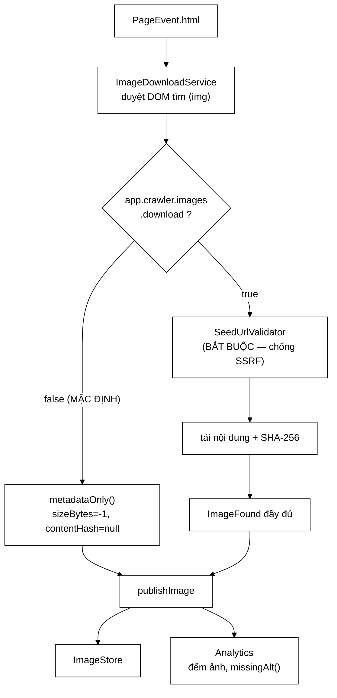

# ImageFound — một chú giải bị quên làm chết cả một luồng

**File nguồn:** `search-engine/src/main/java/com/vnsearch/crawler/bus/ImageFound.java` (108 dòng)
**Gói:** `com.vnsearch.crawler.bus` · **Loại:** `record` (bất biến), 8 thành phần + 1 factory
**Vị trí trong sơ đồ:** **đầu ra** của `Image Download Service` — Modular Service thứ hai
**Đọc kèm:** [`PageEvent.md`](./PageEvent.md) · [`../modular/ImageDownloadService.md`](../modular/ImageDownloadService.md)

---

## 📌 Hiểu trong 30 giây

Hai điều đáng nhớ ở lớp này, và cả hai đều không nằm ở dữ liệu nó chở:

**① Mặc định KHÔNG tải nội dung ảnh.** `contentHash` và `sizeBytes` thường là
`null`/`-1`. Đây là lựa chọn có chủ ý vì ba lý do — chi phí, bề mặt tấn công,
pháp lý — chứ không phải chưa làm xong.

**② Nó chứa bằng chứng của một lỗi thật.** Javadoc dòng 76–89 ghi lại một sự cố
đã xảy ra: thiếu một chú giải `@JsonIgnore` khiến **mọi** thông điệp ảnh chết ở
phía consumer và bị đẩy sang dead-letter topic — mà ở chế độ in-process thì
không có gì lộ ra. Đây là lý do cụ thể để bộ test tích hợp tồn tại.



```
   TÁM TRƯỜNG — TRƯỜNG NÀO CÓ KHI NÀO

   pageUrl          luôn có     trang chứa ảnh
   host             luôn có     KHOÁ PHÂN HOẠCH (host của TRANG, không phải của ảnh)
   imageUrl         luôn có     địa chỉ tuyệt đối, đã chuẩn hoá
   altText          luôn có     "" nếu trang không khai báo (KHÔNG null)
   declaredWidth    luôn có     -1 nếu HTML không ghi
   declaredHeight   luôn có     -1 nếu HTML không ghi
   sizeBytes        ─┬─ CHỈ khi app.crawler.images.download=true
   contentHash      ─┘  ngược lại: -1 và null
```

---

## 1. Vì sao tách `Image Download` thành service riêng

Javadoc dòng 8–12 gọi đây là *"ví dụ rõ nhất cho lập luận vì sao tách
service"*, và lập luận đó đáng nhắc lại:

```
   ĐẶC ĐIỂM CỦA VIỆC XỬ LÝ ẢNH:

        ① KHÔNG liên quan gì tới chỉ mục văn bản
           (xoá nó đi, /search vẫn chạy y nguyên)

        ② NHƯNG tốn băng thông NHẤT trong cả hệ thống
           (một trang tin: 20-40 ảnh × 100-500 KB
            vs  ~80 KB HTML)


   ĐỂ CHUNG TIẾN TRÌNH VỚI CRAWLER:
   ─────────────────────────────────────────────────────────
        một đợt tải ảnh chiếm hết băng thông
             → việc tải TRANG chậm lại
             → thông lượng crawl giảm
             → mà crawl trang mới là VIỆC CHÍNH

        và muốn tăng tốc tải ảnh thì phải nhân bản CẢ CRAWLER
             → kéo theo nhân bản cả frontier, cả Bloom Filter
             → tức là phải giải bài toán ở DiscoveredUrl mục 1
               chỉ để tải nhanh hơn vài tấm ảnh


   TÁCH RA:
   ─────────────────────────────────────────────────────────
        Crawler:  2 tiến trình  (bị chặn bởi chính sách lịch sự)
        Image:    8 tiến trình  (bị chặn bởi băng thông)

        HAI VIỆC CO GIÃN ĐỘC LẬP theo hai nút thắt KHÁC NHAU.
```

Đây là tiêu chí thực dụng để quyết định có nên tách một service hay không:
**hai phần việc có nút thắt khác nhau thì nên co giãn riêng.** Nếu chúng nghẽn
vì cùng một thứ, tách ra chỉ thêm phức tạp.

---

## 2. Vì sao mặc định **không** tải nội dung ảnh

Javadoc dòng 14–36. Ba lý do, và chúng thuộc ba loại hoàn toàn khác nhau — đó
là điều làm lập luận này mạnh.

### 2.1 Chi phí

```
   Trang tin trung bình:  20-40 ảnh × 100-500 KB

   Ước tính thận trọng (25 ảnh × 200 KB = 5 MB/trang):

        31.030 trang × 5 MB  ≈  155 GB

   So với phần VĂN BẢN của cùng corpus:
        HTML thô:      ~2,48 GB
        bodyText:      ~248 MB
        chỉ mục:       vài trăm MB

        ┌──────────────────────────────────────────────────┐
        │  ẢNH      ████████████████████████████████  98%  │
        │  văn bản  ▌                                  2%  │
        └──────────────────────────────────────────────────┘

   ⇒ 98% dung lượng, cho một hệ thống TÌM KIẾM VĂN BẢN.
     Tỷ lệ chi phí/lợi ích không thể biện minh được.
```

### 2.2 Bề mặt tấn công — lý do nghiêm trọng nhất

```
   Mỗi lần tải ảnh = một lần MỞ KẾT NỐI tới địa chỉ do TRANG ĐÍCH chỉ định.

   Đó CHÍNH LÀ đường SSRF mà HtmlDownloader đã phải vá cho HTML.

   ┌──────────────────────────────────────────────────────────────┐
   │  Trang độc đặt:                                              │
   │          │
   │              │
   │                             │
   │                                                              │
   │  Nếu Image Service tự mở kết nối mà KHÔNG kiểm:               │
   │     → crawler trở thành proxy vào mạng NỘI BỘ                │
   │     → và nó chạy TỪ BÊN TRONG hạ tầng của ta                 │
   │                                                              │
   │  Tệ hơn HTML ở chỗ: không ai NGỜ tới thẻ .               │
   │  Người ta vá SSRF cho phần "tải trang" rồi yên tâm,          │
   │  quên mất khối tải ảnh cũng mở kết nối ra ngoài.             │
   └──────────────────────────────────────────────────────────────┘

   VÌ THẾ: khi bật tải ảnh, service BẮT BUỘC dùng lại SeedUrlValidator,
   KHÔNG được tự mở kết nối.
```

Đây là điểm đáng nhấn khi bảo vệ đồ án: một lỗ hổng đã vá ở một khối có thể
**mở lại ở khối khác** nếu khối đó cũng mở kết nối ra ngoài. Cách phòng: tập
trung mọi phép kiểm vào **một** lớp dùng chung
([`SeedUrlValidator`](../SeedUrlValidator.md)) và cấm mọi khối khác tự gọi mạng.

### 2.3 Pháp lý

```
   Siêu dữ liệu ảnh  =  dữ liệu VỀ trang        → thu thập được
   Bản sao ảnh       =  bản sao TÁC PHẨM        → có bản quyền

   Ranh giới này rõ ràng hơn nhiều so với ranh giới về văn bản
   (nơi "trích dẫn hợp lý" cho phép lưu đoạn snippet).
```

### 2.4 Chế độ mặc định vẫn làm đủ việc có ích

Điểm quan trọng: tắt tải ảnh **không** biến service này thành vô dụng.

| Việc | Cần tải ảnh? |
|---|---|
| Đếm số ảnh/trang | ✘ |
| Phân bố ảnh theo host | ✘ |
| Phát hiện ảnh thiếu `alt` — tín hiệu chất lượng trang | ✘ |
| Ghi lại địa chỉ để một lần chạy sau tải nếu cần | ✘ |
| Khử trùng ảnh theo nội dung | ✔ |
| Đo kích thước thật | ✔ |

Bốn việc đầu đủ để service có ý nghĩa, và chúng là những việc `Analytics`
thực sự dùng. Việc tải nội dung được để lại như một **công tắc**, kèm địa chỉ đã
lưu sẵn để chạy bù sau — thiết kế này cho phép đổi ý mà không phải crawl lại.

---

## 3. `@JsonIgnore` trên `isDownloaded()` — sự cố thật

Javadoc dòng 73–89. Đây là phần có giá trị giáo dục cao nhất của cả gói `bus`.

### 3.1 Cơ chế lỗi

```java
@JsonIgnore
public boolean isDownloaded() {
    return contentHash != null;
}
```

```
   BƯỚC 1 — Jackson nhìn thấy isDownloaded()
        Quy ước JavaBean: mọi phương thức isXxx() / getXxx() là một
        THUỘC TÍNH ĐỌC ĐƯỢC. Jackson KHÔNG cần chú giải để phát hiện —
        nó tự suy ra.

   BƯỚC 2 — JSON sinh ra có thêm một trường
        {
          "pageUrl": "...",
          "host": "...",
          ...
          "downloaded": false      ← KHÔNG ứng với component nào của record
        }

   BƯỚC 3 — Consumer đọc lại
        Record ImageFound có 8 component. Không có cái nào tên "downloaded".
        → UnrecognizedPropertyException: Unrecognized field "downloaded"

   BƯỚC 4 — Hậu quả
        MỌI thông điệp ảnh ném ở phía consumer
        → cơ chế thử lại chạy 3 lần
        → rồi đẩy sang dead-letter topic
        → luồng ảnh chết HOÀN TOÀN, 100%, không sót thông điệp nào
```

### 3.2 Vì sao lỗi này **không** lộ ra ở chế độ in-process

Đây là điểm cốt lõi:

```
   IN-PROCESS:
        bus.publishImage(img)  →  handler.accept(img)

        Đối tượng đi THẲNG từ tay này sang tay kia.
        KHÔNG AI SERIALIZE CẢ.
        → @JsonIgnore hoàn toàn không được dùng tới
        → test đơn vị XANH
        → chạy run-crawl.bat: XANH
        → demo trên máy cá nhân: XANH

   KAFKA:
        bus.publishImage(img) → JSON → broker → JSON → handler

        → CHẾT NGAY thông điệp đầu tiên


   ┌──────────────────────────────────────────────────────────────┐
   │  ĐÂY LÀ MỘT LỚP LỖI, KHÔNG PHẢI MỘT LỖI ĐƠN LẺ               │
   │                                                              │
   │  Mọi khác biệt giữa "truyền tham chiếu" và "truyền qua dây"   │
   │  đều có thể tạo ra lỗi kiểu này:                              │
   │     - trường dẫn xuất lọt vào JSON                            │
   │     - kiểu không serialize được (Instant, Optional, enum lạ)   │
   │     - vòng tham chiếu (A trỏ B, B trỏ A → tràn ngăn xếp)      │
   │     - null vs chuỗi rỗng bị Jackson chuẩn hoá khác nhau        │
   │     - thứ tự trường / tương thích lược đồ                      │
   │                                                              │
   │  Và TOÀN BỘ lớp lỗi này VÔ HÌNH với test đơn vị.              │
   └──────────────────────────────────────────────────────────────┘
```

### 3.3 Vì sao bộ test tích hợp tồn tại

Javadoc dòng 88–89 nói thẳng:

> Lỗi này đã xảy ra thật và bị `KafkaCrawlBusIT` bắt. Nó là lý do cụ thể để bộ
> test tích hợp tồn tại.

Đây là câu đáng nói nhất khi bảo vệ đồ án, vì nó trả lời một câu hỏi thường
gặp: *"Test tích hợp chậm 15 giây, có đáng không?"*

```
   Đáng — vì nó bắt được ĐÚNG lớp lỗi mà test đơn vị KHÔNG THỂ bắt.

   Không phải "test tích hợp tốt hơn test đơn vị".
   Mà là: hai loại test soi hai loại rủi ro KHÁC NHAU.

        Test đơn vị      → logic có đúng không
        Test tích hợp    → nó có sống sót qua DÂY không

   Bỏ loại thứ hai thì luồng ảnh chết 100% mà bộ test vẫn xanh 100%.
```

### 3.4 `missingAlt()` — cùng lý do, phòng ngừa chủ động

```java
@JsonIgnore
public boolean missingAlt() {
    return altText.isBlank();
}
```

Phương thức này **chưa** từng gây sự cố, nhưng nó mang `@JsonIgnore` vì cùng lý
do. Đó là dấu hiệu tốt: sau khi bị một lần, quy tắc được áp dụng **nhất quán**
cho mọi phương thức dẫn xuất, không chỉ cho cái đã gây lỗi.

Cũng cùng khuôn với [`PageEvent.htmlSizeBytes()`](./PageEvent.md) và
[`OutlinksExtracted.size()`](./OutlinksExtracted.md) — cả gói `bus` giờ tuân
một quy tắc chung:

> **Mọi phương thức dẫn xuất trong record thông điệp đều phải có `@JsonIgnore`.**

---

## 4. Hướng dẫn về code

### 4.1 `altText = altText == null ? "" : altText` — dòng 64

```java
public ImageFound {
    if (pageUrl == null || pageUrl.isBlank()) { ... }
    if (imageUrl == null || imageUrl.isBlank()) { ... }
    altText = altText == null ? "" : altText;      // ← chuẩn hoá, KHÔNG ném
}
```

Ba cách xử lý `altText` thiếu, và vì sao chọn cách thứ ba:

| Cách | Đánh giá |
|---|---|
| Ném ngoại lệ | **Sai** — ảnh không có `alt` là chuyện cực kỳ phổ biến, và đó là dữ liệu ta muốn *ghi nhận*, không phải lỗi cần chặn |
| Để `null` | **Rủi ro** — `missingAlt()` sẽ ném NPE ở `altText.isBlank()`, và mọi chỗ dùng phải kiểm `null` |
| **Chuẩn hoá thành `""`** | **Đang dùng** — `missingAlt()` luôn chạy được, và `""` mang đúng ngữ nghĩa "không có" |

Đây là kỹ thuật **thu hẹp miền giá trị tại biên**: sau constructor, `altText`
chắc chắn không `null`, nên mọi mã phía sau không cần kiểm nữa. Chi phí: một
dòng. Lợi ích: xoá một lớp NPE khỏi toàn bộ hệ thống phía sau.

### 4.2 `metadataOnly()` — factory nói rõ ý định, dòng 67–71

```java
public static ImageFound metadataOnly(String pageUrl, String host, String imageUrl,
                                       String altText, int width, int height) {
    return new ImageFound(pageUrl, host, imageUrl, altText, width, height, -1L, null);
}
```

```
   KHÔNG có factory này, chỗ gọi phải viết:

        new ImageFound(pageUrl, host, imageUrl, alt, w, h, -1L, null)
                                                          ↑↑↑  ↑↑↑↑
                                          hai hằng số ma thuật ở cuối
                                          — người đọc phải TRA CỨU mới hiểu

   CÓ factory:

        ImageFound.metadataOnly(pageUrl, host, imageUrl, alt, w, h)
                   ↑↑↑↑↑↑↑↑↑↑↑↑
                   TÊN nói rõ ý định

   Lợi ích thêm: nếu sau này quy ước "chưa tải" đổi (ví dụ 0 thay vì -1),
   chỉ sửa MỘT chỗ. Không có factory thì phải tìm mọi chỗ gọi.
```

### 4.3 `-1` là "không biết", **không phải** "bằng không"

Đây là quy ước xuyên suốt lớp này và rất dễ dùng sai:

```
   declaredWidth  = -1   →  HTML KHÔNG khai báo width
   declaredWidth  =  0   →  HTML khai báo width="0"  (ảnh tracking pixel!)
   sizeBytes      = -1   →  CHƯA TẢI, không biết kích thước
   sizeBytes      =  0   →  đã tải, và file RỖNG (ảnh hỏng)

   ┌──────────────────────────────────────────────────────────────┐
   │  Nếu dùng 0 cho cả hai nghĩa:                                 │
   │                                                              │
   │    "trung bình ảnh nặng bao nhiêu?"                           │
   │       sum(sizeBytes) / count                                  │
   │       → cộng cả những ảnh CHƯA TẢI như thể chúng nặng 0 byte  │
   │       → trung bình bị kéo xuống gần 0                         │
   │       → và không ai biết con số đó sai                        │
   │                                                              │
   │  Với -1, phép tính đó sẽ ra SỐ ÂM → sai lè, ai cũng thấy.     │
   └──────────────────────────────────────────────────────────────┘
```

> Chọn giá trị sentinel sao cho **dùng sai thì lộ ngay**, thay vì trộn lẫn
> được với dữ liệu thật.

Đây là lý do `-1` tốt hơn `0` ở đây. Phương án sạch nhất về mặt kiểu là
`OptionalInt` / `Optional<String>`, nhưng Jackson serialize `Optional` cần thêm
module và nó không phải kiểu nên dùng trong record thông điệp — xem đề xuất ở
mục 7.

### 4.4 `host` là host của **trang**, không phải của ảnh

Chi tiết dễ nhầm và có hậu quả thật:

```
   Trang:  https://vnexpress.net/the-thao/bai-x
   Ảnh:    https://i1-sport.vnecdn.net/2024/.../anh.jpg
                  ↑↑↑↑↑↑↑↑↑↑↑↑↑↑↑↑↑↑↑ host KHÁC (CDN)

   host trong ImageFound = "vnexpress.net"   ← host của TRANG

   Vì sao:
        ① Bất biến phân hoạch: mọi thông điệp VỀ một trang phải về
          cùng một tiến trình (xem DiscoveredUrl mục 2)
        ② Ảnh của một site thường nằm trên 1-2 CDN
          → khoá theo host CDN sẽ dồn TẤT CẢ ảnh của mọi site
            vào một phân hoạch  ⇒ lệch tải cực nặng
        ③ Analytics thống kê "ảnh theo site", không phải "ảnh theo CDN"
```

### 4.5 Cạm bẫy khi sửa lớp này

| Ý định | Hậu quả |
|---|---|
| Thêm `isXxx()`/`getXxx()` quên `@JsonIgnore` | **Toàn bộ** luồng ảnh vào dead-letter — và test đơn vị vẫn xanh |
| Bật `images.download=true` mà không qua `SeedUrlValidator` | Mở lại lỗ SSRF đã vá — xem 2.2 |
| Đổi `-1` thành `0` cho "chưa biết" | Thống kê sai lặng lẽ — xem 4.3 |
| Đổi `host` sang host của ảnh | Lệch tải phân hoạch nặng; phá bất biến gom theo trang |
| Ném khi `altText == null` | Vứt nhầm ảnh thật — ảnh thiếu `alt` là dữ liệu ta muốn ghi nhận |
| Thêm `byte[] content` vào record | Mất bất biến nông; và base64 làm phình 33% |

---

## 5. Độ phức tạp & chi phí

| Đại lượng | Chế độ mặc định | Bật tải ảnh |
|---|---|---|
| Kích thước thông điệp | ~300 byte | ~350 byte (thêm hash) |
| Số thông điệp/trang | 20–40 | 20–40 |
| Băng thông thêm | **0** | ~5 MB/trang |
| Lưu trữ trên cả corpus | ~350 MB thông điệp | ~155 GB nội dung |
| Bề mặt SSRF | không mở kết nối | **có** — bắt buộc qua `SeedUrlValidator` |
| Thời gian xử lý/trang | ~1 ms (duyệt DOM) | ~5–20 s (tải 25 ảnh) |

```
   TỔNG SỐ THÔNG ĐIỆP ẢNH TRÊN CORPUS 31.030 TRANG

        31.030 × ~25 ảnh  ≈  775.000 thông điệp × 300 B  ≈  233 MB

   Nhiều hơn luồng DiscoveredUrl (140 MB) và OutlinksExtracted (78 MB) —
   ảnh là luồng ĐÔNG THỨ HAI về số lượng, sau PageEvent về dung lượng.

   ⇒ Đây là luồng đáng cân nhắc gộp lô nhất: hiện mỗi ảnh là một
     thông điệp, trong khi CẢ 25 ảnh của một trang đến cùng lúc.
     Xem đề xuất ở mục 7.
```

Chênh lệch thời gian xử lý (1 ms vs 5–20 s) là lập luận định lượng cho việc
tách service ở mục 1: hai chế độ này khác nhau **bốn bậc độ lớn**, nên không thể
để chung một hàng đợi.

---

## 6. Kiểm thử liên quan

| Bộ test | Kiểm gì |
|---|---|
| [`KafkaCrawlBusIT`](../../../../../test/java/com/vnsearch/crawler/bus/KafkaCrawlBusIT.md) | **Bắt được sự cố `@JsonIgnore`** — lý do tồn tại của nó |
| [`CrawlEventTest`](../../../../../test/java/com/vnsearch/crawler/bus/CrawlEventTest.md) | Compact constructor; chuẩn hoá `altText`; `metadataOnly()` |
| [`ImageDownloadServiceTest`](../../../../../test/java/com/vnsearch/crawler/modular/ImageDownloadServiceTest.md) | Bên sinh ra thông điệp |
| [`SsrfProtectionTest`](../../../../../test/java/com/vnsearch/crawler/SsrfProtectionTest.md) | Phép kiểm bắt buộc khi bật tải ảnh |

```
   ĐẦU VÀO                                    KẾT QUẢ MONG ĐỢI
   ──────────────────────────────────────     ────────────────────────────
   pageUrl=null                               IllegalArgumentException
   imageUrl=""                                IllegalArgumentException
   altText=null                                → "" (KHÔNG ném)
   altText=""                                  missingAlt()==true
   altText="Đội tuyển ăn mừng"                 missingAlt()==false
   metadataOnly(...)                           sizeBytes==-1, contentHash==null
                                               isDownloaded()==false
   contentHash="abc..."                        isDownloaded()==true
   serialize → deserialize                     equals() với bản gốc
```

Bài test chống hồi quy quan trọng nhất — nó bắt được đúng sự cố ở mục 3, mà
**không** cần dựng broker 15 giây:

```java
// Vòng đi-về JSON THUẦN — rẻ, nhanh, và bắt đúng lớp lỗi
@Test
void vongDiVeJsonKhongMatVaKhongThuaTruong() throws Exception {
    var mapper = new ObjectMapper();
    var goc = ImageFound.metadataOnly(
            "https://vnexpress.net/bai-x", "vnexpress.net",
            "https://i1.vnecdn.net/anh.jpg", "Đội tuyển ăn mừng", 800, 600);

    var json = mapper.writeValueAsString(goc);

    assertFalse(json.contains("downloaded"),
            "trường dẫn xuất lọt vào JSON → mọi thông điệp ảnh sẽ vào dead-letter");
    assertFalse(json.contains("missingAlt"));

    var docLai = mapper.readValue(json, ImageFound.class);
    assertEquals(goc, docLai);
}
```

**Đây là bài test đáng thêm nhất trong cả gói `bus`**: nó bảo vệ một sự cố đã
xảy ra thật, chạy trong vài mili-giây, và không cần Docker.

---

## 7. Chấm theo chuẩn doanh nghiệp

| Tiêu chí | Điểm | Nhận xét |
|---|---|---|
| Ghi chép sự cố | 10/10 | Javadoc ghi lại **nguyên nhân, cơ chế, hậu quả và cách bắt** của một lỗi thật — cực hiếm |
| Lập luận mặc định an toàn | 10/10 | Ba lý do thuộc ba loại khác nhau (chi phí, an ninh, pháp lý), không phải ba cách nói một lý do |
| Nhận thức an ninh | 10/10 | Nhận ra SSRF **quay lại ở một khối khác**, và ràng buộc dùng lại `SeedUrlValidator` |
| Xử lý biên | 10/10 | `altText` chuẩn hoá tại biên; `-1` chọn để dùng sai thì lộ ngay |
| Nhất quán quy tắc | 10/10 | `@JsonIgnore` áp cho **mọi** phương thức dẫn xuất, không chỉ cái đã gây lỗi |
| Chất lượng API | 9/10 | `metadataOnly()` xoá hằng số ma thuật; nhưng không có factory tương ứng cho ca đã tải |
| Khả năng kiểm thử | 7/10 | Có IT bắt được lỗi; **thiếu test JSON thuần** — rẻ hơn IT 3000 lần mà bắt cùng lỗi |
| Hiệu năng luồng | 7/10 | 775.000 thông điệp lẻ trong khi 25 ảnh của một trang đến cùng lúc — cơ hội gộp lô rõ ràng |

**Năm đề xuất nâng lên mức sản phẩm:**

1. **Test JSON vòng đi–về cho cả bốn record** (mã ở mục 6). Đề xuất số một: nó
   bắt đúng lớp lỗi đã gây sự cố, chạy vài mili-giây, không cần Docker, và có
   thể chạy trong mọi lần build. Hiện lớp lỗi này chỉ được canh bởi một bài IT
   nặng mà người ta hay bỏ qua khi vội.

2. **Cân nhắc `ImagesFound` dạng lô.** 25 ảnh của một trang được bóc cùng lúc từ
   cùng một `PageEvent`, nhưng phát ra thành 25 thông điệp — mỗi cái mang ~80
   byte header Kafka và lặp lại `pageUrl` + `host`. Gộp thành một thông điệp
   `(pageUrl, host, List<Image>)` sẽ giảm ~40% dung lượng luồng và giữ được
   tính nguyên tử "cả trang hoặc không". Đây đúng khuôn mà
   [`OutlinksExtracted`](./OutlinksExtracted.md) đã dùng — nên áp dụng nhất quán.

3. **Thêm factory `downloaded(...)`** đối xứng với `metadataOnly(...)`. Hiện ca
   đã tải vẫn phải gọi canonical constructor 8 tham số. Một cặp factory đối
   xứng làm rõ rằng có đúng **hai** trạng thái hợp lệ, và ngăn việc tạo ra
   trạng thái lai (`sizeBytes` có nhưng `contentHash` null).

4. **Ràng buộc bất biến giữa `sizeBytes` và `contentHash`.** Hiện compact
   constructor không kiểm; có thể tạo `sizeBytes=1000, contentHash=null` — một
   trạng thái vô nghĩa. Thêm phép kiểm: hai trường phải **cùng** có hoặc **cùng**
   không.

5. **Ghi rõ trong Javadoc rằng `host` là host của trang.** Mục 4.4 là chi tiết
   dễ nhầm với hậu quả thật (lệch tải phân hoạch), và hiện `@param host` chỉ ghi
   *"host của trang — khoá phân hoạch"* mà không nói vì sao **không** dùng host
   của ảnh. Một câu là đủ.

---

## 8. Liên kết

- Bên sinh ra thông điệp này: [`../modular/ImageDownloadService.md`](../modular/ImageDownloadService.md)
- Nơi lưu bản ghi ảnh: [`../modular/ImageStore.md`](../modular/ImageStore.md) · [`../modular/ImageStorage.md`](../modular/ImageStorage.md)
- Phép kiểm bắt buộc khi bật tải ảnh: [`../SeedUrlValidator.md`](../SeedUrlValidator.md)
- Nguồn HTML để bóc thẻ ``: [`PageEvent.md`](./PageEvent.md)
- Cùng quy tắc `@JsonIgnore`: [`OutlinksExtracted.md`](./OutlinksExtracted.md)
- Bất biến khoá phân hoạch: [`DiscoveredUrl.md`](./DiscoveredUrl.md) mục 2
- Bên tiêu thụ siêu dữ liệu: [`../modular/CrawlAnalyticsService.md`](../modular/CrawlAnalyticsService.md)
- API tìm ảnh: [`../../controller/ImageSearchController.md`](../../controller/ImageSearchController.md)
- Tổng quan: `docs/ARCHITECTURE.md`
