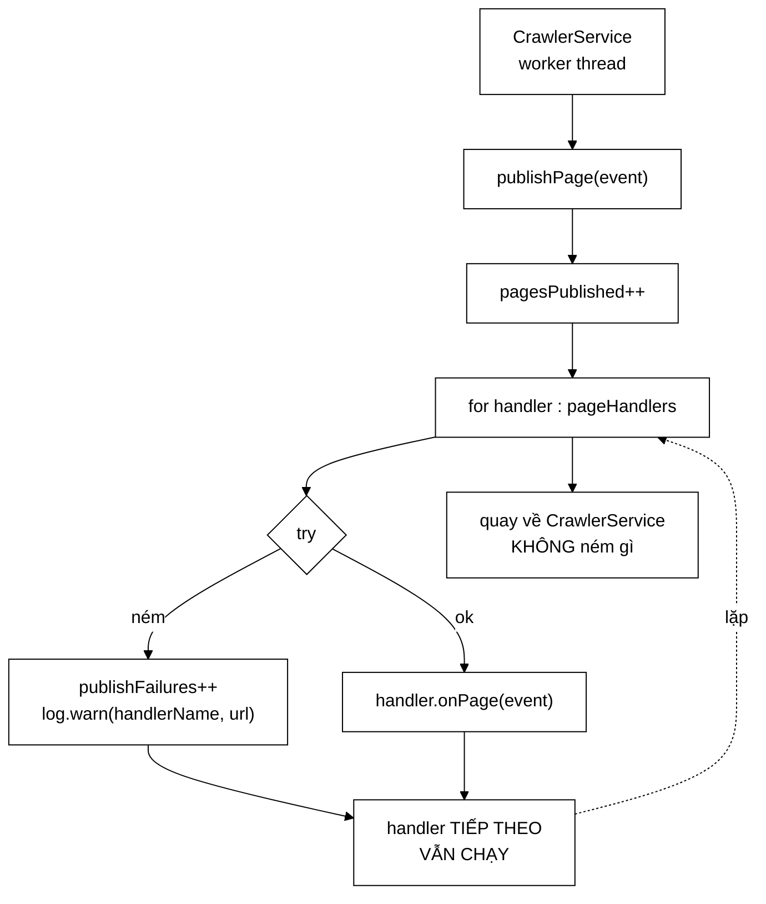

# InProcessCrawlEventBus — mô phỏng lại đúng mức cô lập của Kafka, trong một tiến trình

**File nguồn:** `search-engine/src/main/java/com/vnsearch/crawler/bus/InProcessCrawlEventBus.java` (177 dòng)
**Gói:** `com.vnsearch.crawler.bus` · **Loại:** `class`, cài [`CrawlEventBus`](./CrawlEventBus.md)
**Vị trí trong sơ đồ:** ô **`Kafka`** ở chế độ **mặc định** — không broker, không mạng
**Đọc kèm:** [`CrawlEventBus.md`](./CrawlEventBus.md) · [`KafkaCrawlEventBus.md`](./KafkaCrawlEventBus.md) · [`PageEventHandler.md`](./PageEventHandler.md)

---

## 📌 Hiểu trong 30 giây

Bản cài mặc định. `publishPage()` gọi thẳng từng handler đã đăng ký — không
serialize, không mạng, không broker. Về hiệu năng nó **tương đương gọi hàm trực
tiếp** như mã cũ; cái thêm vào chỉ là một tầng gián tiếp và một khối
`try/catch`.

Câu hỏi đúng phải hỏi: *tầng gián tiếp đó mua được gì?*

> Nó mua khả năng **đổi sang Kafka mà không sửa `CrawlerService` lẫn ba
> service**. Cùng một mã, hai kiểu triển khai. Đó là toàn bộ lý do tồn tại của
> lớp này.

Và một điều tinh tế hơn, ở mục 2: khối `try/catch` không phải để "cho an toàn"
— nó **mô phỏng lại đúng mức cô lập** mà Kafka cho không, để hai chế độ hành xử
giống nhau.



```
   BỐN DANH SÁCH ĐĂNG KÝ, BỐN LUỒNG

   pageHandlers      List<PageEventHandler>          ← 3 Modular Service
   urlHandlers       List<Consumer<DiscoveredUrl>>   ← CrawlerService (nạp frontier)
   outlinkHandlers   List<Consumer<OutlinksExtracted>> ← ContentStorage
   imageHandlers     List<Consumer<ImageFound>>      ← ImageStore

   Tất cả đều là CopyOnWriteArrayList — xem mục 4.
```

---

## 1. Tầng gián tiếp này mua được gì

Javadoc dòng 20–22 trả lời gọn, nhưng đáng khai triển bằng con số:

```
   MÃ CŨ (gọi trực tiếp):

        void processPage(WebDocument doc) {
            contentStorage.save(doc);
            analytics.record(doc);          ┐
            imageService.scan(doc);         ├ ba lời gọi CỨNG
            urlExtractor.extract(doc);      ┘
        }

   Muốn chạy phân tán?
        → phải sửa processPage
        → phải sửa cả ba service (nhận ConsumerRecord)
        → phải sửa mọi bài test của cả bốn lớp


   MÃ MỚI (qua bus):

        void processPage(WebDocument doc) {
            contentStorage.save(doc);       ← vẫn đồng bộ, vẫn là nghĩa vụ lõi
            bus.publishPage(event);         ← một dòng
        }

   Muốn chạy phân tán?
        → đổi MỘT dòng cấu hình: app.crawler.bus=kafka
        → CrawlerService:  KHÔNG SỬA
        → ba service:      KHÔNG SỬA
        → mọi bài test:    KHÔNG SỬA
```

Chi phí trả cho việc đó: **một tầng gián tiếp + một try/catch**, tức khoảng 2
micro-giây mỗi trang. Trên cả phiên crawl 31.030 trang là ~0,06 giây, trong khi
phiên crawl kéo dài ~8,6 giờ. Tỷ lệ: **0,0002%**.

```
   ┌──────────────────────────────────────────────────────────────┐
   │  ĐÂY LÀ MẪU ĐÁNH ĐỔI ĐÁNG NHỚ                                │
   │                                                              │
   │  Chi phí:  đo được, cố định, nhỏ đến mức không đo nổi         │
   │  Lợi ích:  một khả năng kiến trúc (đổi chế độ triển khai)     │
   │                                                              │
   │  Khi chi phí ở dạng "hằng số nhỏ" và lợi ích ở dạng "khả      │
   │  năng thay đổi", gần như luôn nên trả.                       │
   │                                                              │
   │  Ngược lại, nếu chi phí là O(n) hoặc nằm trong vòng lặp       │
   │  nóng thật (ví dụ mỗi lần tra posting list), thì phải đo      │
   │  trước khi bọc.                                              │
   └──────────────────────────────────────────────────────────────┘
```

---

## 2. Cô lập lỗi — phần quan trọng nhất của lớp

Javadoc dòng 24–42. Mỗi handler được gọi trong một `try/catch` **riêng**.

### 2.1 Nếu không có nó

```
   Ba service chạy NỐI ĐUÔI trên CÙNG MỘT LUỒNG:

        publishPage(event)
             │
             ├─▶ CrawlAnalyticsService.onPage()      ✓
             ├─▶ ImageDownloadService.onPage()       ✖ NÉM
             └─▶ UrlExtractorService.onPage()        ← KHÔNG BAO GIỜ CHẠY

   HAI hậu quả xảy ra CÙNG LÚC:

   ① UrlExtractorService không chạy
        → không bóc được liên kết
        → frontier NGỪNG ĐƯỢC NẠP
        → hàng đợi cạn dần
        → CẢ PHIÊN CRAWL CHẾT ĐỨNG
        → và triệu chứng là "crawler dừng, không rõ lý do"

   ② Ngoại lệ bay ngược lên CrawlerService.processPage
        → trang đó bị tính là LỖI TẢI
        → dù nó đã tải xong từ lâu và đã lưu vào Content Storage
        → thống kê sai: tỷ lệ lỗi tải tăng vọt mà mạng vẫn tốt
```

Javadoc dòng 38–39 chốt: *"Một service phụ làm chết cả crawler là kiểu phụ
thuộc mà việc tách service sinh ra để phá bỏ."*

Nói cách khác: nếu không có `try/catch` này, việc "tách service" chỉ là tách về
mặt **tổ chức mã**, chứ không tách về mặt **khả năng chịu lỗi** — mà cái sau
mới là lợi ích thật.

### 2.2 Vì sao đây là **mô phỏng**, không phải phòng thủ tuỳ tiện

Đây là điểm tinh tế nhất của lớp, ở Javadoc dòng 39–42:

```
   Ở CHẾ ĐỘ KAFKA, các service vốn đã cô lập THẬT SỰ:

        ┌─────────────┐  ┌─────────────┐  ┌─────────────┐
        │ tiến trình A│  │ tiến trình B│  │ tiến trình C│
        │  Analytics  │  │   Image     │  │ UrlExtractor│
        │  group-1    │  │  group-2    │  │  group-3    │
        └─────────────┘  └─────────────┘  └─────────────┘
              ↑                ↑                ↑
              └────────────────┴────────────────┘
                        topic crawl.pages

        B chết → A và C không hề biết. Cô lập là MIỄN PHÍ,
        do ranh giới tiến trình và consumer group mang lại.


   Ở CHẾ ĐỘ IN-PROCESS, không có ranh giới nào cả.
   → try/catch là cách DỰNG LẠI ranh giới đó bằng mã.

   ┌──────────────────────────────────────────────────────────────┐
   │  MỤC TIÊU KHÔNG PHẢI "cho an toàn"                           │
   │  MỤC TIÊU LÀ:  hai chế độ HÀNH XỬ GIỐNG NHAU                 │
   │                                                              │
   │  Vì nếu chúng khác nhau, sẽ có một lớp lỗi CHỈ lộ ra ở        │
   │  môi trường thật — đúng loại lỗi mà cả kiến trúc này sinh     │
   │  ra để tránh (xem ImageFound mục 3.2 cho một ca đã xảy ra).   │
   └──────────────────────────────────────────────────────────────┘
```

Đây là nguyên tắc nên nhớ: **khi có hai chế độ triển khai, chế độ đơn giản phải
mô phỏng ngữ nghĩa của chế độ phức tạp — không phải ngược lại.** Nếu làm ngược
(để in-process "dễ dãi hơn"), mọi lỗi sẽ dồn về lúc triển khai thật.

### 2.3 Điểm khác biệt còn sót lại giữa hai chế độ

Cô lập được mô phỏng, nhưng có ba thứ **không** mô phỏng được — và cần biết:

| Tính chất | Kafka | In-process |
|---|---|---|
| Cô lập lỗi | ✔ ranh giới tiến trình | ✔ mô phỏng bằng try/catch |
| Thử lại + dead-letter | ✔ | ✘ **thông điệp mất luôn** |
| Song song thật giữa các service | ✔ 3 tiến trình | ✘ nối đuôi trên một luồng |
| Serialize (và lỗi kèm theo) | ✔ | ✘ — xem [`ImageFound`](./ImageFound.md) mục 3.2 |
| Áp lực ngược khi service chậm | ✔ (lag consumer) | ✘ kéo chậm cả crawler |

Ba dấu ✘ ở cột phải là **những khoảng trống có ý thức**. Cái quan trọng nhất là
dòng 2: ở chế độ in-process, một handler ném nghĩa là thông điệp đó **mất
vĩnh viễn**, chỉ còn lại một dòng WARN và một số đếm. Xem đề xuất ở mục 9.

---

## 3. Hướng dẫn về code

### 3.1 `publishPage` — dòng 97–116

```java
@Override
public void publishPage(PageEvent event) {
    if (event == null) {
        return;
    }
    pagesPublished.incrementAndGet();
    for (PageEventHandler handler : pageHandlers) {
        try {
            handler.onPage(event);
        } catch (Exception e) {
            publishFailures.incrementAndGet();
            log.warn("Modular Service {} ném ngoại lệ khi xử lý {} — bỏ qua trang này, "
                            + "các service khác vẫn chạy",
                    handler.handlerName(), event.url(), e);
        }
    }
}
```

Sáu chi tiết đáng chú ý:

**① `event == null` → `return` lặng lẽ, không ném.** Nhất quán với hợp đồng
"gửi hỏng thì không ném" ở [`CrawlEventBus`](./CrawlEventBus.md) mục 3. Nhưng
lưu ý: hành vi này **không** được ghi trong hợp đồng của interface — xem đề
xuất 3 ở mục 9.

**② `pagesPublished++` đặt TRƯỚC vòng lặp.** Nó đếm "số trang đã phát", không
phải "số trang xử lý thành công". Hai con số khác nhau, và tách bạch là đúng:
`pagesPublished` cho biết crawler làm được bao nhiêu, `publishFailures` cho
biết bao nhiêu lượt xử lý hỏng. Tỷ số giữa chúng là chỉ số sức khoẻ thật.

**③ `catch (Exception)` chứ không `catch (Throwable)`.**

```
   Exception  → bắt mọi lỗi nghiệp vụ và lỗi lập trình (NPE, ClassCast...)
   Throwable  → bắt CẢ Error: OutOfMemoryError, StackOverflowError

   Vì sao KHÔNG bắt Error:
        OOM nghĩa là JVM đã hết bộ nhớ. Nuốt nó rồi chạy tiếp
        chỉ dẫn tới trạng thái hỏng khó đoán, và lỗi thật sẽ lộ ra
        ở một chỗ hoàn toàn khác.
        ⇒ Error PHẢI được bay lên và giết tiến trình. Đó là hành vi đúng.
```

**④ Ghi `event.url()` chứ không ghi cả `event`.** Chú thích dòng 108–110 giải
thích: `toString()` của `PageEvent` đã cố tình bỏ HTML, nhưng ghi rõ `url` vẫn
dễ đọc hơn khi dò log, **và không có đường nào để 80 KB lọt vào tệp log**. Đây
là lớp phòng vệ thứ ba chống việc đổ 2,4 GB log — xem
[`PageEvent`](./PageEvent.md) mục 5.3.

**⑤ Ghi `handler.handlerName()` chứ không `handler.getClass()`.** Với handler
viết bằng lambda, `getClass().getSimpleName()` trả chuỗi rỗng. Xem
[`PageEventHandler`](./PageEventHandler.md) mục 4.

**⑥ Truyền `e` làm tham số cuối cho SLF4J.** Không có placeholder `{}` tương
ứng — đó là quy ước SLF4J: tham số cuối kiểu `Throwable` được in kèm **cả stack
trace**. Viết `log.warn("... {}", e)` thay vì `log.warn("...", e)` sẽ chỉ in
`e.toString()` và **mất stack trace** — lỗi rất thường gặp.

### 3.2 `dispatch` — gộp ba luồng còn lại, dòng 144–154

```java
private <T> void dispatch(List<Consumer<T>> handlers, T payload, String kind, String subject) {
    for (Consumer<T> handler : handlers) {
        try {
            handler.accept(payload);
        } catch (Exception e) {
            publishFailures.incrementAndGet();
            log.warn("Bên nhận {} ném ngoại lệ khi xử lý {} — bỏ qua", kind, subject, e);
        }
    }
}
```

```
   BA luồng (url, outlinks, image) dùng CHUNG hàm generic này.
   publishPage KHÔNG dùng — vì nó cần handler.handlerName(),
   mà Consumer<T> không có phương thức đó.

   Đánh đổi ở đây:
        ✔ ba luồng chia sẻ một cài đặt ⇒ sửa chính sách lỗi một chỗ
        ✘ luồng trang phải viết riêng ⇒ hai chỗ có thể lệch nhau

   Có đáng gộp cả bốn không?
        Muốn vậy phải bọc PageEventHandler thành Consumer<PageEvent>
        và mất handlerName(). Không đáng — tên handler là thứ hữu
        ích nhất trong dòng log đó.
```

Tham số `kind` và `subject` tồn tại vì `Consumer<T>` là generic thuần: hàm
không biết mình đang xử lý loại thông điệp nào, cũng không biết trường nào là
định danh. Truyền vào từ chỗ gọi là cách rẻ nhất để dòng log vẫn đọc được.

### 3.3 Bốn phương thức `subscribeXxx` trả `this` — dòng 65–95

```java
public InProcessCrawlEventBus subscribePages(PageEventHandler handler) {
    if (handler != null) {
        pageHandlers.add(handler);
    }
    return this;
}
```

```
   TRẢ this  ⇒  gọi dây chuyền (fluent):

        var bus = new InProcessCrawlEventBus()
                .subscribePages(analytics)
                .subscribePages(imageService)
                .subscribePages(urlExtractor)
                .subscribeDiscoveredUrls(frontier::enqueue)
                .subscribeOutlinks(contentStorage::saveOutlinks)
                .subscribeImages(imageStore::save);

   Chỗ lắp ráp đọc như một BẢN KHAI BÁO cấu trúc hệ thống —
   nhìn 6 dòng là thấy toàn bộ sơ đồ luồng dữ liệu.

   So với:
        var bus = new InProcessCrawlEventBus();
        bus.subscribePages(analytics);
        bus.subscribePages(imageService);
        ...
   → cùng thông tin, nhưng lặp "bus." và dễ chèn nhầm mã vào giữa.
```

`if (handler != null)` bỏ qua lặng lẽ thay vì ném: nhất quán với triết lý của
cả lớp. Nhưng đây cũng là điểm yếu — đăng ký nhầm `null` sẽ **không có bất kỳ
tín hiệu nào**, và service đó im lặng không bao giờ chạy. Xem đề xuất 2 ở mục 9.

Ba luồng sau nhận `Consumer<T>` thay vì một interface riêng, vì chúng chỉ có
**một** bên nhận mỗi loại và bên nhận đó thường là một method reference
(`frontier::enqueue`). Định nghĩa ba interface riêng chỉ để đặt tên cho một
lambda là mã thừa.

### 3.4 Cạm bẫy khi sửa lớp này

| Ý định | Hậu quả |
|---|---|
| Bỏ `try/catch` "vì handler nên tự lo" | Một service hỏng giết cả phiên crawl — xem 2.1 |
| Đổi sang `catch (Throwable)` | Nuốt cả `OutOfMemoryError` ⇒ trạng thái hỏng khó đoán |
| Đổi sang `ArrayList` | `ConcurrentModificationException` nếu có ai đăng ký lúc đang crawl — xem mục 4 |
| Ném lại ngoại lệ sau khi log | Phá hợp đồng, và mất luôn cô lập |
| `log.warn("...{}", e)` thay vì `log.warn("...", e)` | Mất stack trace — chỉ còn dòng `e.toString()` |
| Gọi handler song song bằng `parallelStream` | Ba service tranh nhau CPU với worker crawl; và thứ tự log rối. Nếu cần song song, dùng executor riêng có giới hạn |
| Đếm `pagesPublished` sau vòng lặp | Con số sẽ thành "số trang xử lý xong", lệch ý nghĩa với bản Kafka |

---

## 4. Vì sao `CopyOnWriteArrayList`

Javadoc dòng 44–49.

```
   MẪU TRUY CẬP THỰC TẾ:

        ĐỌC:  từ MỌI worker thread, cho TỪNG trang
              31.030 trang × 3 handler ≈ 93.000 lượt duyệt danh sách

        GHI:  vài lần lúc KHỞI ĐỘNG
              6 lần (3 page + 3 luồng khác), rồi thôi

        Tỷ lệ đọc/ghi ≈ 15.000 : 1
```

```
   ┌────────────────────┬──────────────────┬─────────────────────────┐
   │                    │ Đọc              │ Ghi                     │
   ├────────────────────┼──────────────────┼─────────────────────────┤
   │ ArrayList          │ nhanh nhất       │ nhanh                   │
   │                    │ ✘ KHÔNG an toàn — ConcurrentModification-  │
   │                    │   Exception nếu ghi trong lúc đang duyệt   │
   ├────────────────────┼──────────────────┼─────────────────────────┤
   │ synchronizedList   │ ✘ phải khoá mỗi  │ khoá                    │
   │                    │   lần duyệt      │                         │
   │                    │ → 93.000 lần tranh khoá giữa các worker    │
   ├────────────────────┼──────────────────┼─────────────────────────┤
   │ CopyOnWriteArray-  │ ✔ KHÔNG KHOÁ     │ ✘ sao chép CẢ MẢNG      │
   │ List  (đang dùng)  │   duyệt trên      │   mỗi lần add           │
   │                    │   ảnh chụp bất    │   → 6 lần × mảng 3 phần │
   │                    │   biến            │     tử = không đáng kể  │
   └────────────────────┴──────────────────┴─────────────────────────┘

   ⇒ Đọc nhiều / ghi hiếm là ĐÚNG ca sử dụng mà cấu trúc này
     được thiết kế cho. Chi phí ghi đắt trở nên vô nghĩa khi
     chỉ ghi 6 lần trong cả vòng đời chương trình.
```

Cùng lý do mà `CrawlerService` dùng nó cho danh sách listener — xem
[`CrawlListener.md`](../CrawlListener.md).

**Lợi ích phụ ít người để ý:** vòng `for` duyệt trên một **ảnh chụp bất biến**
của mảng. Nên nếu một handler tự gọi `bus.subscribePages(...)` trong lúc đang
xử lý (kịch bản lạ nhưng có thể), vòng lặp hiện tại vẫn chạy trên danh sách cũ
và không hề rối — thay vì ném `ConcurrentModificationException`.

---

## 5. Bốn bộ đếm

```java
private final AtomicLong publishFailures  = new AtomicLong();
private final AtomicLong pagesPublished   = new AtomicLong();
private final AtomicLong urlsPublished    = new AtomicLong();
private final AtomicLong imagesPublished  = new AtomicLong();
```

| Bộ đếm | Ý nghĩa | Có trong interface? |
|---|---|---|
| `publishFailures` | Số **lượt handler** ném ngoại lệ | ✔ |
| `pagesPublished` | Số trang đã phát | ✘ chỉ ở lớp này |
| `urlsPublished` | Số URL đã phát | ✘ |
| `imagesPublished` | Số ảnh đã phát | ✘ |

Ba bộ đếm cuối **không** có trong interface, nên mã đo lường muốn dùng chúng
phải `instanceof` — đúng vấn đề mà `getPublishFailureCount()` đã giải cho bộ
đếm lỗi, nhưng giải chưa hết. Xem đề xuất 4 ở mục 9.

### 5.1 Đọc `publishFailures` cho đúng

```
   CẠM BẪY: publishFailures đếm theo LƯỢT HANDLER, không theo TRANG.

        Một trang, ba handler, cả ba ném
             → pagesPublished  += 1
             → publishFailures += 3

   ⇒ Tỷ lệ "publishFailures / pagesPublished" CÓ THỂ VƯỢT 1.
   ⇒ Công thức đúng cho tỷ lệ lỗi:
             publishFailures / (pagesPublished × pageHandlerCount())

   Đây là lý do pageHandlerCount() (dòng 173-176) tồn tại như một
   phương thức public — nó là MẪU SỐ mà dashboard cần.
```

`outlinksPublished` **không** có, trong khi ba luồng kia đều có. Đây là một
điểm thiếu nhất quán nhỏ nhưng thật: không đo được luồng nuôi PageRank. Xem đề
xuất 5.

### 5.2 `AtomicLong` vs `LongAdder`

```
   AtomicLong:   một ô nhớ, mọi luồng CAS vào cùng ô
                 → tranh chấp cache line khi nhiều luồng ghi
   LongAdder:    nhiều ô, mỗi luồng ghi vào ô riêng, cộng lại khi đọc
                 → ghi nhanh hơn nhiều khi tranh chấp cao

   Ở đây: ghi ~31.000 lần trên 8,6 giờ ≈ 1 lần/giây.
   Tranh chấp gần bằng 0.
   ⇒ AtomicLong là lựa chọn đúng — đơn giản hơn, đọc chính xác tức thì.
     (LongAdder.sum() chỉ chính xác khi không có ghi đồng thời.)
```

---

## 6. Độ phức tạp & chi phí

| Thao tác | Độ phức tạp | Chi phí thực tế |
|---|---|---|
| `publishPage` | O(số handler) = O(3) | ~2 µs |
| `subscribeXxx` | O(n) — sao chép mảng | ~6 lần cả vòng đời |
| Duyệt `CopyOnWriteArrayList` | O(n), **không khoá** | — |
| Bộ nhớ | 4 danh sách × ~3 phần tử + 4 `AtomicLong` | < 1 KB |

```
   TỔNG CHI PHÍ TRÊN PHIÊN CRAWL 31.030 TRANG

        31.030 lượt publishPage × 2 µs   ≈  0,06 giây
        trên tổng ~8,6 giờ crawl          =  0,0002%

   → Không đo được. Nằm hoàn toàn trong nhiễu.

   NÚT THẮT THẬT nằm ở đâu?
        Chính sách lịch sự 1 trang/giây/host, tại UrlFrontier.
        Cách bus này 3 tầng, và chậm hơn 500.000 lần.
```

Một chi phí **ẩn** cần biết: ba service chạy **nối đuôi trên luồng của worker
crawl**. Nếu `ImageDownloadService` bật tải ảnh (5–20 giây/trang), nó sẽ chặn
worker đó suốt thời gian ấy — thông lượng crawl sụp. Đây chính là lý do
`app.crawler.images.download` mặc định `false`, và là lý do chế độ Kafka tồn
tại. Xem [`ImageFound`](./ImageFound.md) mục 1.

---

## 7. Kiểm thử liên quan

| Bộ test | Kiểm gì |
|---|---|
| [`InProcessCrawlEventBusTest`](../../../../../test/java/com/vnsearch/crawler/bus/InProcessCrawlEventBusTest.md) | Phát tán tới nhiều handler; **cô lập lỗi**; bốn bộ đếm |
| [`CrawlerServiceBusWiringTest`](../../../../../test/java/com/vnsearch/crawler/CrawlerServiceBusWiringTest.md) | Crawler gọi đúng phương thức, đúng thời điểm |
| [`CrawlEventTest`](../../../../../test/java/com/vnsearch/crawler/bus/CrawlEventTest.md) | Bốn record thông điệp |

```
   ĐẦU VÀO                                       KẾT QUẢ MONG ĐỢI
   ────────────────────────────────────────      ──────────────────────────
   publishPage(null)                             không ném, không đếm gì
   3 handler, không ai ném                       cả 3 nhận, failures==0
   handler thứ 2 ném                             handler 1 VÀ 3 vẫn nhận
                                                 failures==1
                                                 publishPage KHÔNG ném
   cả 3 handler ném                              failures==3, pagesPublished==1
   subscribePages(null)                          bỏ qua, pageHandlerCount không tăng
   chưa đăng ký handler nào                      publishPage chạy trơn, không lỗi
   subscribePages trả về                         chính bus (cho phép nối chuỗi)
```

Hai bài test còn thiếu, và cả hai kiểm đúng tính chất then chốt:

```java
// 1. An toàn đa luồng — mô phỏng N worker của crawler
@Test
void phatTanAnToanTuNhieuLuong() throws Exception {
    var bus = new InProcessCrawlEventBus();
    var dem = new LongAdder();
    bus.subscribePages(e -> dem.increment());

    var pool = Executors.newFixedThreadPool(16);
    var latch = new CountDownLatch(1600);
    for (int i = 0; i < 1600; i++) {
        pool.submit(() -> { bus.publishPage(mauPageEvent()); latch.countDown(); });
    }
    latch.await(10, TimeUnit.SECONDS);

    assertEquals(1600, dem.sum());
    assertEquals(1600, bus.getPagesPublishedCount());
}

// 2. Đăng ký handler TRONG LÚC đang phát — CopyOnWriteArrayList phải chịu được
@Test
void dangKyTrongLucDangPhatKhongNem() {
    var bus = new InProcessCrawlEventBus();
    bus.subscribePages(e -> bus.subscribePages(x -> { }));   // tự thêm handler
    assertDoesNotThrow(() -> bus.publishPage(mauPageEvent()));
}
```

---

## 8. So sánh trực tiếp với bản Kafka

| | `InProcessCrawlEventBus` | [`KafkaCrawlEventBus`](./KafkaCrawlEventBus.md) |
|---|---|---|
| Số dòng | 177 | 156 |
| Phụ thuộc ngoài | chỉ SLF4J | `spring-kafka` |
| Độ trễ `publishPage` | ~2 µs | ~0,3 ms |
| Cô lập lỗi | mô phỏng bằng `try/catch` | thật, do ranh giới tiến trình |
| Bắt lỗi gửi | trong `catch` đồng bộ | trong callback **và** `catch` đồng bộ |
| Thử lại | ✘ | ✔ → dead-letter |
| Song song service | ✘ nối đuôi | ✔ ba tiến trình |
| Serialize | ✘ | ✔ JSON + lz4 |
| Đăng ký handler | `subscribeXxx()` | `@KafkaListener` ở lớp khác |
| Cần broker | ✘ | ✔ |

Dòng cuối cùng của bảng là lý do lớp này tồn tại; ba dòng có ✘ ở cột trái là
cái giá phải trả.

---

## 9. Liên kết

- Hợp đồng mà lớp này cài: [`CrawlEventBus.md`](./CrawlEventBus.md)
- Bản cài song song, và những gì lớp này mô phỏng: [`KafkaCrawlEventBus.md`](./KafkaCrawlEventBus.md)
- Hợp đồng của handler, và `handlerName()`: [`PageEventHandler.md`](./PageEventHandler.md)
- Vì sao log không được chứa cả `PageEvent`: [`PageEvent.md`](./PageEvent.md) mục 5.3
- Ca lỗi chỉ lộ ở chế độ Kafka: [`ImageFound.md`](./ImageFound.md) mục 3.2
- Cùng lý do chọn `CopyOnWriteArrayList`: [`../CrawlListener.md`](../CrawlListener.md)
- Nơi bus được lắp ráp: [`../CrawlerService.md`](../CrawlerService.md) · [`../../config/KafkaCrawlConfig.md`](../../config/KafkaCrawlConfig.md)
- Thang đo `publish_failures`: [`../../config/MetricsConfig.md`](../../config/MetricsConfig.md)
- Tổng quan: `docs/ARCHITECTURE.md`
