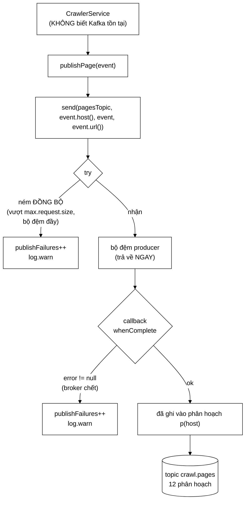

# KafkaCrawlEventBus — 156 dòng chứa toàn bộ phần dính broker của cả hệ thống

**File nguồn:** `search-engine/src/main/java/com/vnsearch/crawler/bus/KafkaCrawlEventBus.java` (156 dòng)
**Gói:** `com.vnsearch.crawler.bus` · **Loại:** `class`, cài [`CrawlEventBus`](./CrawlEventBus.md)
**Vị trí trong sơ đồ:** ô **`Kafka`** ở dạng thật — bật bằng `app.crawler.bus=kafka`
**Đọc kèm:** [`InProcessCrawlEventBus.md`](./InProcessCrawlEventBus.md) · [`DiscoveredUrl.md`](./DiscoveredUrl.md) · [`../../config/KafkaCrawlConfig.md`](../../config/KafkaCrawlConfig.md)

---

## 📌 Hiểu trong 30 giây

Javadoc dòng 13–16 mở đầu bằng một câu đáng nhớ:

> Khác biệt duy nhất so với `InProcessCrawlEventBus`, nhìn từ phía
> `CrawlerService`: **không có.**

Cùng bốn phương thức, cùng ngữ nghĩa "không ném khi gửi hỏng". Toàn bộ phần
Kafka của cả hệ thống nằm gọn trong lớp này (156 dòng) và trong mấy lớp listener
chuyển tiếp. Ba Modular Service, `CrawlerService`, bốn record thông điệp — không
lớp nào import một dòng nào của Kafka.

Hai điểm kỹ thuật cốt lõi:

**① Khoá phân hoạch LUÔN là `host`** — bất biến trung tâm của cả thiết kế phân
tán (mục 1).
**② Gửi bất đồng bộ, nhưng đếm lỗi ở cả hai đường** — callback *và* `try/catch`
đồng bộ (mục 2).



```
   BỐN TOPIC, MỘT QUY TẮC KHOÁ

   publishPage           → pagesTopic      khoá = event.host()
   publishDiscoveredUrl  → urlsTopic       khoá = url.host()
   publishOutlinks       → outlinksTopic   khoá = outlinks.host()
   publishImage          → imagesTopic     khoá = image.host()

                                                    ↑
                        KHÔNG BAO GIỜ là url, không bao giờ là null.
```

---

## 1. Khoá phân hoạch: luôn là `host`

Javadoc dòng 18–37. Đây **không** phải chi tiết tuỳ tiện mà là bất biến trung
tâm.

### 1.1 Ba tính chất ghép lại

```
   ① Kafka bảo đảm thông điệp CÙNG KHOÁ luôn vào CÙNG một phân hoạch
   ② Một phân hoạch chỉ được giao cho MỘT consumer trong một group
   ─────────────────────────────────────────────────────────────────
   ⇒ ③ Mọi trang và mọi URL của một host luôn về ĐÚNG MỘT tiến trình
```

Từ ③ suy ra **hai** tính chất mà nếu không có thì phải xây cả một hệ thống điều
phối phân tán mới có được:

| Tính chất | Vì sao có được |
|---|---|
| Bloom Filter chống trùng theo host là **đầy đủ** | Tiến trình đó thấy toàn bộ lịch sử của host ấy |
| Chính sách lịch sự 1 giây/host là **chính xác** | Chỉ một tiến trình từng chạm host ấy |

Phân tích đầy đủ ba phương án đã cân nhắc (Redis dùng chung / lọc muộn / phân
hoạch theo host) nằm ở [`DiscoveredUrl.md`](./DiscoveredUrl.md) mục 2 — không
lặp lại ở đây.

### 1.2 Hệ quả phải nhớ: đừng đổi số phân hoạch

Javadoc dòng 34–37 cảnh báo, và đây là loại lỗi vận hành kinh điển:

```
   Kafka chọn phân hoạch bằng:

        partition = murmur2(key) % numPartitions
                                    ↑↑↑↑↑↑↑↑↑↑↑↑↑
                                    MẪU SỐ

   ĐỔI MẪU SỐ = ĐỔI CHỖ CỦA MỌI HOST.

   ┌──────────────────────────────────────────────────────────────┐
   │  Trước (12 phân hoạch):                                      │
   │     vnexpress.net → murmur2 % 12 = 0  → Crawler A            │
   │                                                              │
   │  Sau khi nâng lên 24 phân hoạch:                             │
   │     vnexpress.net → murmur2 % 24 = 12 → Crawler C            │
   │                                                              │
   │  Crawler C CHƯA TỪNG thấy vnexpress.net.                     │
   │  Bloom Filter của nó RỖNG cho host đó.                       │
   │     → nói "mới!" cho HÀNG CHỤC NGHÌN URL đã crawl            │
   │     → crawl lại từ đầu                                       │
   │  Và bộ hoãn lịch sự của nó cũng rỗng                          │
   │     → cả A lẫn C cùng gõ cửa vnexpress.net một thời gian      │
   └──────────────────────────────────────────────────────────────┘

   ⇒ Đó là lý do app.crawler.kafka.partitions đặt sẵn 12 thay vì 3.
```

Lập luận đằng sau con số 12:

```
   Số phân hoạch = TRẦN CỨNG cho số consumer trong một group.
        3 phân hoạch  → không bao giờ chạy quá 3 crawler
        12 phân hoạch → chạy được tới 12

   Chi phí của phân hoạch thừa: một ít metadata trên broker,
   một ít file trên đĩa. Rẻ.

   Chi phí của phân hoạch thiếu: phải đổi số → phá bất biến →
   crawl lại từ đầu. Đắt.

   ⇒ Đặt DƯ ngay từ đầu. Đây là quyết định KHÔNG ĐỐI XỨNG:
     đặt thừa thì lãng phí chút ít, đặt thiếu thì phải làm lại.
```

Cùng nguyên tắc "hai loại sai không cân xứng" xuất hiện ở
[`ContentSeenFilter`](../ContentSeenFilter.md) mục 2.3 và
[`UrlSeenFilter`](../UrlSeenFilter.md).

---

## 2. Gửi bất đồng bộ, nhưng đếm lỗi ở **cả hai** đường

Javadoc dòng 39–49 và phương thức `send()` dòng 118–142.

### 2.1 Vì sao không chờ kết quả

```java
template.send(topic, key, payload)      // trả về NGAY
```

```
   KafkaTemplate.send() ghi vào BỘ ĐỆM của producer rồi trả về.
   Lỗi thật chỉ lộ ra ở callback.

   NẾU chờ bằng .get():
        mỗi trang = một vòng chờ mạng (~2-10 ms)
        31.030 trang × 5 ms ≈ 2,6 phút CPU-chờ THUẦN
        và tệ hơn: worker thread bị chặn ⇒ không tải trang tiếp được
        ⇒ giết thông lượng crawler

   NÊN: gửi rồi gắn callback đếm lỗi.
```

### 2.2 Vì sao phải có **cả** `try/catch` đồng bộ

Đây là chi tiết dễ bỏ sót nhất, và Javadoc dòng 121–124 nói rõ:

```java
private void send(String topic, String key, Object payload, String subject) {
    try {
        template.send(topic, key, payload).whenComplete((result, error) -> {
            if (error != null) {
                publishFailures.incrementAndGet();
                log.warn("Không gửi được lên topic {} (khoá {}), đối tượng {}: {}",
                        topic, key, subject, error.toString());
            }
        });
    } catch (Exception e) {                      // ← KHỐI NÀY KHÔNG THỪA
        publishFailures.incrementAndGet();
        log.warn("Không gửi được lên topic {} (khoá {}), đối tượng {}: {}",
                topic, key, subject, e.toString());
    }
}
```

```
   send() VẪN NÉM ĐỒNG BỘ trong vài ca:

   ① Thông điệp vượt max.request.size (4 MB)
        → RecordTooLargeException, ném NGAY tại lời gọi
        → một trang HTML dị thường
        → xem PageEvent mục 2.5

   ② Bộ đệm producer đầy và hết thời gian chờ
        → TimeoutException ("Failed to allocate memory within max.block.ms")
        → xảy ra khi broker chậm hơn crawler trong thời gian dài

   ③ Producer đã đóng
        → IllegalStateException

   ┌──────────────────────────────────────────────────────────────┐
   │  CHỈ dựa vào callback ⇒ BỎ SÓT ĐÚNG BA CA NÀY.               │
   │                                                              │
   │  Và hậu quả không chỉ là "thiếu số đếm":                     │
   │  ngoại lệ sẽ BAY LÊN CrawlerService.processPage              │
   │  → phá hợp đồng "gửi hỏng thì không ném"                     │
   │  → trang bị tính là lỗi tải                                  │
   │  → và nếu là ca ②, nó xảy ra LIÊN TỤC ⇒ crawler chết         │
   └──────────────────────────────────────────────────────────────┘
```

Đây là bài học tổng quát về API bất đồng bộ:

> **Một API "bất đồng bộ" hiếm khi bất đồng bộ 100%.** Phần đăng ký/cấp phát
> vẫn chạy đồng bộ và vẫn ném được. Xử lý lỗi phải phủ **cả hai** đường, nếu
> không sẽ có một lớp lỗi lọt qua.

### 2.3 Hai đường lỗi, cùng một chính sách

| | Đường đồng bộ (`catch`) | Đường bất đồng bộ (callback) |
|---|---|---|
| Bắt gì | Vượt trần, bộ đệm đầy, producer đóng | Broker chết, mất mạng, hết retry |
| Khi nào | Ngay tại lời gọi | Vài ms → vài giây sau |
| Chạy trên luồng nào | Luồng worker của crawler | Luồng I/O của producer |
| Xử lý | `publishFailures++` + WARN | `publishFailures++` + WARN |
| Có ném lên không | **Không** | **Không** (callback không có ai để ném lên) |

Chú ý: hai nhánh dùng **cùng một dòng log** với cùng bốn tham số. Đó là chủ đích
— khi dò log, không cần phân biệt lỗi đến từ đường nào; điều quan trọng là
*topic nào, khoá nào, đối tượng nào*.

### 2.4 Ghi `subject` chứ không ghi cả thông điệp

Tham số `subject` (dòng 126) là URL, không phải `payload`. Cùng lý do với
[`InProcessCrawlEventBus`](./InProcessCrawlEventBus.md) mục 3.1 điểm ④: ghi cả
`PageEvent` vào log sẽ đổ 80 KB HTML mỗi dòng.

Đây là **lớp phòng vệ thứ tư** trong chuỗi bảo vệ tệp log:

```
   ① PageEvent.toString() ghi đè, bỏ html
   ② PageEvent.withoutHtml() cho consumer chỉ cần siêu dữ liệu
   ③ InProcessCrawlEventBus ghi event.url(), không ghi event
   ④ KafkaCrawlEventBus nhận subject riêng, không ghi payload

   Bốn lớp cho MỘT rủi ro. Có thừa không?
   Không — vì mỗi lớp bảo vệ một chỗ gọi khác nhau, và chỉ cần
   MỘT chỗ sơ hở là 2,4 GB log.
```

### 2.5 Cảnh báo vận hành

Javadoc dòng 48–49: cảnh báo được dựng trên
`vnsearch_crawl_bus_publish_failures_total`.

```
   NGƯỠNG CẢNH BÁO NÊN ĐẶT THẾ NÀO?

   Không nên là "failures > 0" — một lỗi lẻ khi broker nấc là bình thường.

   Nên là tỷ lệ trên cửa sổ thời gian:
        rate(publish_failures_total[5m]) / rate(pages_published_total[5m]) > 0.01

   Nghĩa: quá 1% số lần gửi hỏng trong 5 phút → có vấn đề thật.

   VÀ một cảnh báo thứ hai, khác loại:
        increase(publish_failures_total[1m]) > 100
   → bắt được ca "broker chết hẳn", nơi tỷ lệ nhảy lên 100% tức thì.
```

---

## 3. Hướng dẫn về code

### 3.1 Constructor kiểm đủ — dòng 65–82

```java
public KafkaCrawlEventBus(KafkaTemplate<String, Object> template, String pagesTopic,
                           String urlsTopic, String outlinksTopic, String imagesTopic) {
    if (template == null) {
        throw new IllegalArgumentException("KafkaCrawlEventBus cần một KafkaTemplate");
    }
    this.template = template;
    this.pagesTopic = require(pagesTopic, "pagesTopic");
    ...
}

private static String require(String value, String name) {
    if (value == null || value.isBlank()) {
        throw new IllegalArgumentException("Thiếu tên topic: " + name);
    }
    return value;
}
```

```
   VÌ SAO NÉM Ở ĐÂY, trong khi mọi chỗ khác của lớp KHÔNG BAO GIỜ ném?

   Vì đây là LÚC KHỞI ĐỘNG, không phải lúc chạy.

        Lỗi lúc khởi động  →  ứng dụng KHÔNG lên  →  ai cũng thấy ngay
                              → sửa cấu hình, khởi động lại. 2 phút.

        Lỗi lúc chạy       →  đang giữa phiên crawl 4 tiếng
                              → giết nó là mất công sức đã bỏ ra

   ⇒ NGUYÊN TẮC: fail-fast lúc khởi động, fail-soft lúc chạy.

   Nếu tên topic rỗng mà KHÔNG kiểm:
        template.send("", key, payload)
        → Kafka tạo topic tên "" hoặc ném ở tầng sâu
        → thông báo lỗi khó hiểu, xuất hiện sau khi crawl đã chạy
```

Hàm `require` trả về giá trị đã kiểm cho phép gán trực tiếp trong constructor —
gọn hơn bốn khối `if` liên tiếp, và tên tham số `name` làm thông báo lỗi chỉ
đúng trường thiếu.

### 3.2 Bốn phương thức `publishXxx` — khuôn giống hệt nhau

```java
@Override
public void publishPage(PageEvent event) {
    if (event == null) {
        return;
    }
    pagesPublished.incrementAndGet();
    send(pagesTopic, event.host(), event, event.url());
}
```

Cả bốn theo đúng một khuôn: kiểm `null` → đếm → `send`. Sự lặp lại này là **cố
ý và tốt**:

```
   CÓ THỂ gộp bằng generic:
        <T> void publish(String topic, T msg, Function<T,String> key, ...)

   NHƯNG:
        ✘ chỗ gọi trở thành publish(pagesTopic, e, PageEvent::host, PageEvent::url)
          → khó đọc hơn hẳn
        ✘ bốn phương thức public phải tồn tại dù sao (interface bắt buộc)
        ✘ tiết kiệm được ~12 dòng, đổi lấy một tầng trừu tượng nữa

   ⇒ Bốn khối 6 dòng giống nhau, MỖI khối đọc thẳng được,
     tốt hơn một hàm generic thông minh.
```

Chi tiết đáng chú ý: `publishOutlinks` **không** tăng bộ đếm nào. Đây là điểm
thiếu nhất quán thật, giống hệt ở bản in-process — xem đề xuất 4 ở mục 6.

### 3.3 `KafkaTemplate<String, Object>` — vì sao `Object`

```
   Bốn topic chở BỐN kiểu khác nhau:
        PageEvent, DiscoveredUrl, OutlinksExtracted, ImageFound

   Một KafkaTemplate<String, Object> phục vụ cả bốn,
   với JsonSerializer làm việc serialize.

   Đánh đổi:
        ✘ mất kiểm tra kiểu lúc biên dịch — gửi nhầm kiểu vào topic
          sai sẽ KHÔNG có lỗi biên dịch
        ✔ một bean thay vì bốn; một cấu hình producer thay vì bốn

   Phòng hộ: bốn phương thức public có kiểu CỤ THỂ (PageEvent,
   DiscoveredUrl...). Chỉ có phương thức PRIVATE send() nhận Object.
   ⇒ Người dùng lớp này KHÔNG BAO GIỜ chạm tới Object.
     Vùng mất an toàn kiểu bị giới hạn trong 15 dòng private.
```

Đây là kỹ thuật đáng học: khi buộc phải hy sinh an toàn kiểu vì hạ tầng, hãy
**thu hẹp vùng hy sinh** xuống mức nhỏ nhất và bọc nó bằng API có kiểu chặt.

### 3.4 Cạm bẫy khi sửa lớp này

| Ý định | Hậu quả |
|---|---|
| Đổi khoá từ `host` sang `url` | Phá bất biến trung tâm — chống trùng **và** lịch sự cùng vỡ, im lặng |
| Bỏ `try/catch` "vì đã có callback" | Bỏ sót ba ca ném đồng bộ; ngoại lệ bay lên `CrawlerService` |
| Chờ kết quả bằng `.get()` | Chặn worker thread ⇒ thông lượng crawl sụp |
| Ném lại lỗi trong callback | Callback chạy trên luồng I/O của producer — ném ở đó **không ai bắt** |
| Đổi `app.crawler.kafka.partitions` khi đang chạy | Xem mục 1.2 — crawl lại từ đầu |
| Ghi `payload` vào log thay vì `subject` | 80 KB/dòng log |
| Ném khi tên topic rỗng **lúc chạy** thay vì lúc khởi tạo | Giết phiên crawl vì một lỗi cấu hình |

---

## 4. Độ phức tạp & chi phí

| Đại lượng | Giá trị |
|---|---|
| Độ trễ `publishPage` (nhìn từ crawler) | ~0,3 ms — chỉ là ghi vào bộ đệm |
| Độ trễ tới broker (thực tế) | ~2–10 ms, **không chặn** worker |
| CPU serialize | JSON hoá ~80 KB/trang |
| Băng thông sau nén | ~11 KB/trang (lz4, tỷ lệ 6–8×) |
| Bộ nhớ | bộ đệm producer, mặc định 32 MB |
| Số dòng dính Kafka trong cả dự án | **156** (lớp này) + mấy lớp listener |

```
   CHI PHÍ TRÊN PHIÊN CRAWL 31.030 TRANG

        31.030 × 0,3 ms  ≈  9,3 giây  trên tổng ~8,6 giờ  =  0,03%

   So với bản in-process (0,0002%): chậm hơn 150 lần.
   Nhưng cả hai đều nằm sâu dưới nhiễu.

   NÚT THẮT vẫn là chính sách lịch sự 1 trang/giây/host.
```

Con số **156 dòng** đáng nhấn khi bảo vệ đồ án: đó là toàn bộ diện tích tiếp
xúc với Kafka của một hệ thống có 143 lớp. Tỷ lệ ~1%. Đó là thước đo cụ thể cho
chất lượng của việc tách trừu tượng ở [`CrawlEventBus`](./CrawlEventBus.md).

---

## 5. Kiểm thử liên quan

| Bộ test | Kiểm gì |
|---|---|
| [`KafkaCrawlBusIT`](../../../../../test/java/com/vnsearch/crawler/bus/KafkaCrawlBusIT.md) | Vòng đi–về thật qua broker (Testcontainers); **đã bắt được sự cố `@JsonIgnore`** |
| [`CrawlEventTest`](../../../../../test/java/com/vnsearch/crawler/bus/CrawlEventTest.md) | Bốn record thông điệp |
| [`InProcessCrawlEventBusTest`](../../../../../test/java/com/vnsearch/crawler/bus/InProcessCrawlEventBusTest.md) | Bản cài song song — nên hành xử giống lớp này |

```
   ĐẦU VÀO                                    KẾT QUẢ MONG ĐỢI
   ──────────────────────────────────────     ─────────────────────────────
   template=null                              IllegalArgumentException (khởi tạo)
   pagesTopic=""                              IllegalArgumentException: "Thiếu tên topic: pagesTopic"
   publishPage(null)                          không ném, không đếm
   publishPage(event) bình thường             gửi tới pagesTopic, khoá=event.host()
   broker chết                                KHÔNG ném; publishFailures++ (callback)
   thông điệp > 4 MB                          KHÔNG ném; publishFailures++ (try/catch)
   vòng đi-về                                 deserialize equals bản gốc
```

Ba bài test còn thiếu, và bài đầu kiểm đúng bất biến trung tâm:

```java
// 1. Khoá phân hoạch PHẢI là host — bất biến quan trọng nhất của lớp
@Test
void khoaPhanHoachLuonLaHost() {
    var template = mock(KafkaTemplate.class);
    when(template.send(any(), any(), any())).thenReturn(new CompletableFuture<>());
    var bus = new KafkaCrawlEventBus(template, "p", "u", "o", "i");

    bus.publishPage(mauPageEvent("https://vnexpress.net/bai-x", "vnexpress.net"));

    verify(template).send(eq("p"), eq("vnexpress.net"), any());
    //                            ↑ KHÔNG được là url
}

// 2. Ném đồng bộ phải được đếm, KHÔNG được bay lên
@Test
void nemDongBoDuocDemChuKhongBayLen() {
    var template = mock(KafkaTemplate.class);
    when(template.send(any(), any(), any()))
            .thenThrow(new RecordTooLargeException("quá 4 MB"));
    var bus = new KafkaCrawlEventBus(template, "p", "u", "o", "i");

    assertDoesNotThrow(() -> bus.publishPage(mauPageEvent()));
    assertEquals(1L, bus.getPublishFailureCount());
}

// 3. Lỗi ở callback cũng phải được đếm
@Test
void loiCallbackDuocDem() {
    var future = new CompletableFuture<SendResult<String,Object>>();
    // ... trả future này, rồi future.completeExceptionally(new TimeoutException())
    // assertEquals(1L, bus.getPublishFailureCount());
}
```

Bài test 2 đáng giá nhất: nó bảo vệ khối `try/catch` ở mục 2.2, mà khối đó rất
dễ bị ai đó xoá đi vì tưởng thừa.

---

## 6. Chấm theo chuẩn doanh nghiệp

| Tiêu chí | Điểm | Nhận xét |
|---|---|---|
| Cô lập hạ tầng | 10/10 | 156 dòng chứa **toàn bộ** phần dính Kafka của một hệ thống 143 lớp |
| Xử lý lỗi bất đồng bộ | 10/10 | Phủ **cả hai** đường (callback + ném đồng bộ), kèm giải thích ba ca cụ thể |
| Bất biến phân hoạch | 10/10 | Khoá `host` nhất quán ở cả bốn topic; hệ quả `murmur2 % N` được ghi rõ |
| Fail-fast vs fail-soft | 10/10 | Ném lúc khởi tạo, không ném lúc chạy — ranh giới đúng và có lập luận |
| An toàn kiểu | 9/10 | `Object` bị giới hạn trong 15 dòng private; API public có kiểu chặt |
| Chất lượng log | 10/10 | `subject` thay vì payload; hai nhánh lỗi dùng chung định dạng |
| Quan sát được | 8/10 | Có `publishFailures`; **thiếu `outlinksPublished`**; ba bộ đếm không có trong interface |
| Khả năng kiểm thử | 7/10 | Có IT thật; **thiếu test mock cho khoá phân hoạch và cho hai đường lỗi** |

**Năm đề xuất nâng lên mức sản phẩm:**

1. **Test khoá phân hoạch bằng mock** (mã ở mục 5). Đề xuất số một: bất biến
   quan trọng nhất của cả hệ phân tán hiện chỉ được bảo vệ bằng quy ước. Một
   người đổi `event.host()` thành `event.url()` sẽ không làm đỏ test nào, và
   triệu chứng chỉ xuất hiện sau nhiều giờ crawl với nhiều tiến trình.

2. **Test cho khối `try/catch` đồng bộ.** Khối này trông thừa với người chưa đọc
   Javadoc, nên nó là ứng viên số một cho việc "dọn dẹp" nhầm. Một bài test mock
   ném `RecordTooLargeException` sẽ khoá nó lại vĩnh viễn.

3. **Cảnh báo trên tỷ lệ, không trên số tuyệt đối.** Xem công thức ở mục 2.5.
   Hiện thang đo đã có nhưng ngưỡng cảnh báo chưa được định nghĩa ở đâu — mà
   một thang đo không có ngưỡng thì không ai nhìn.

4. **Thêm `outlinksPublished`.** Ba trong bốn luồng có bộ đếm; luồng nuôi
   PageRank thì không. Nếu nó ngừng chảy, triệu chứng duy nhất là PageRank ra
   kết quả lạ **sau khi** crawl xong. Cùng đề xuất với bản in-process — nên sửa
   cả hai để hai chế độ vẫn đối xứng.

5. **Ghi `contentHash` vào header Kafka.** Cho phép consumer khử trùng **mà
   không phải deserialize** cả 80 KB thân thông điệp. Tối ưu thật ở phía nhận,
   nhất là khi một consumer mới đọc lại topic từ đầu. Header cũng là chỗ đúng
   cho `schemaVersion` (xem [`PageEvent`](./PageEvent.md) đề xuất 1) và cho
   `traceId`.

---

## 7. Liên kết

- Hợp đồng mà lớp này cài: [`CrawlEventBus.md`](./CrawlEventBus.md)
- Bản cài song song, và những gì nó mô phỏng: [`InProcessCrawlEventBus.md`](./InProcessCrawlEventBus.md)
- Ba phương án chống trùng phân tán: [`DiscoveredUrl.md`](./DiscoveredUrl.md) mục 2
- Nén, trần kích thước, cấu hình producer: [`../../config/KafkaCrawlConfig.md`](../../config/KafkaCrawlConfig.md)
- Phía nhận — lớp chuyển tiếp mỏng: [`../../config/CrawlKafkaListeners.md`](../../config/CrawlKafkaListeners.md)
- Vì sao thông điệp không được ghi vào log: [`PageEvent.md`](./PageEvent.md) mục 5.3
- Lỗi chỉ lộ ra khi có serialize: [`ImageFound.md`](./ImageFound.md) mục 3.2
- Thang đo và cảnh báo: [`../../config/MetricsConfig.md`](../../config/MetricsConfig.md)
- Bộ lọc mà bất biến phân hoạch phục vụ: [`../UrlSeenFilter.md`](../UrlSeenFilter.md)
- Tổng quan: `docs/ARCHITECTURE.md`
