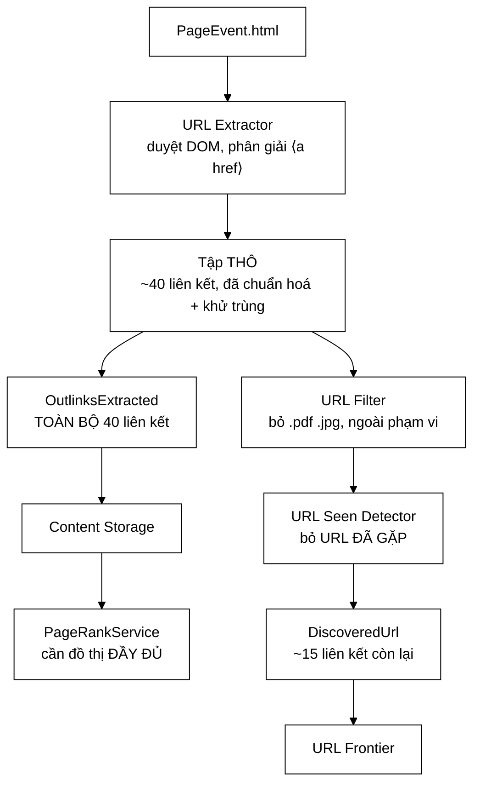

# OutlinksExtracted — hai thông điệp giống hệt nhau, và vì sao gộp lại là hỏng

**File nguồn:** `search-engine/src/main/java/com/vnsearch/crawler/bus/OutlinksExtracted.java` (70 dòng)
**Gói:** `com.vnsearch.crawler.bus` · **Loại:** `record` (bất biến), 4 thành phần
**Vị trí trong sơ đồ:** chiều **về** của mũi tên hai đầu Kafka ↔ Modular Services
**Đọc kèm:** [`DiscoveredUrl.md`](./DiscoveredUrl.md) · [`../../ranking/PageRankService.md`](../../ranking/PageRankService.md)

---

## 📌 Hiểu trong 30 giây

`UrlExtractorService` bóc liên kết ra từ một trang. Kết quả đó được gửi đi
**hai lần, tới hai nơi, ở hai trạng thái lọc khác nhau**:

| | [`DiscoveredUrl`](./DiscoveredUrl.md) | `OutlinksExtracted` |
|---|---|---|
| Đi tới | URL Frontier | Content Storage |
| Trả lời câu hỏi | *"Nên crawl gì tiếp?"* | *"Trang này trỏ đi đâu?"* |
| Đã lọc chưa | **Rồi** — qua URL Filter + URL Seen | **Chưa** — nguyên vẹn |
| Dùng cho | Vòng lặp crawl | PageRank |

Nhìn qua thì thừa: hai thông điệp cùng chở URL, sao không dùng một? Vì hai mục
đích **loại trừ nhau** — cái này cần tập đã lọc, cái kia cần tập chưa lọc, và
gộp lại thì **một trong hai chắc chắn sai**.



```
   MỘT TRANG, HAI TẬP KHÁC NHAU

   Trang /the-thao/bai-x có 40 liên kết ra:

        ┌─ 25 liên kết trỏ tới trang ĐÃ CRAWL RỒI (menu, bài liên quan,
        │                                          chuyên mục, trang chủ)
        ├─  3 liên kết .pdf / .jpg
        └─ 12 liên kết tới trang MỚI

   OutlinksExtracted  →  40  (tất cả)      →  PageRank
   DiscoveredUrl      →  12  (còn lại)     →  Frontier

   25 liên kết bị URL Seen loại chính là 25 CẠNH mà PageRank CẦN NHẤT —
   chúng nối tới các trang ĐÃ NẰM TRONG CORPUS.
```

---

## 1. Vì sao PageRank cần tập **chưa** lọc

Javadoc dòng 29–38. Đây là toàn bộ lý do lớp này tồn tại.

### 1.1 Cơ chế hỏng

```
   URL Seen Detector làm ĐÚNG việc của nó:
        "URL này đã gặp rồi → đừng crawl lại."

   Nhưng "đã gặp rồi" nghĩa là gì?
        → nghĩa là trang đó ĐÃ NẰM TRONG CORPUS.

   Mà đồ thị PageRank được dựng từ các trang trong corpus.
        → những cạnh trỏ tới trang đã có corpus chính là
          CẠNH NỘI BỘ — loại cạnh quan trọng nhất.

   ⇒ Lọc bằng URL Seen rồi mới dựng đồ thị = XOÁ ĐÚNG PHẦN CẦN GIỮ.
```

### 1.2 Hình dung bằng số

```
   ĐỒ THỊ ĐÚNG (dùng OutlinksExtracted — tập chưa lọc)
   ─────────────────────────────────────────────────────────────────
        trang-chu ◀── 8.500 cạnh vào    → PageRank RẤT CAO  ✓ đúng
        chuyen-muc-the-thao ◀── 2.100   → PageRank cao      ✓ đúng
        bai-viet-thuong ◀── 3 cạnh      → PageRank thấp     ✓ đúng

        Phân bố điểm: TRẢI RỘNG, phản ánh đúng cấu trúc site.


   ĐỒ THỊ SAI (dùng DiscoveredUrl — tập đã lọc)
   ─────────────────────────────────────────────────────────────────
        trang-chu là trang crawl ĐẦU TIÊN.
        → sau đó MỌI liên kết trỏ tới nó đều bị URL Seen loại.
        → trang-chu có 0 cạnh vào trong đồ thị.

        chuyen-muc-the-thao: bị loại từ trang thứ 2 trở đi
        → chỉ còn 1 cạnh vào.

        bai-viet-thuong: cũng ~1 cạnh vào.

        Phân bố điểm: GẦN NHƯ PHẲNG — mọi trang ≈ 1/N.
```

### 1.3 Vì sao đây là loại hỏng tệ nhất

Javadoc dòng 36–38 nói thẳng:

> Đó là loại hỏng tệ nhất: **kết quả sai nhưng hệ thống vẫn xanh.**

```
   ┌──────────────────────────────────────────────────────────────┐
   │  TRIỆU CHỨNG NẾU GỘP HAI LUỒNG                               │
   │                                                              │
   │  ✔ PageRank vẫn chạy                                         │
   │  ✔ Thuật toán vẫn hội tụ (thậm chí NHANH HƠN — đồ thị thưa)  │
   │  ✔ Không exception, không log lỗi                            │
   │  ✔ Test đơn vị của PageRankService vẫn xanh (nó test thuật    │
   │    toán trên đồ thị cho sẵn, không test đồ thị được dựng ra) │
   │  ✔ API /search vẫn trả kết quả                               │
   │                                                              │
   │  ✖ Nhưng PageRankBoostScorer cộng vào một cột số VÔ NGHĨA     │
   │  ✖ Xếp hạng tệ đi một cách KHÔNG GIẢI THÍCH ĐƯỢC             │
   │  ✖ Và cách duy nhất phát hiện là NHÌN vào phân bố điểm       │
   │    hoặc chạy bộ đánh giá NDCG và thấy nó không cải thiện     │
   └──────────────────────────────────────────────────────────────┘
```

Đây là lý do hai tập được giữ riêng **ngay từ tầng thông điệp**, chứ không phải
"lọc một lần rồi dùng lại cho cả hai việc". Tách ở tầng kiểu dữ liệu nghĩa là
người viết mã sau này **không thể** nhầm — họ phải chọn giữa hai record có tên
khác nhau, tài liệu khác nhau.

```
   NGUYÊN TẮC RÚT RA

   Khi hai bên tiêu thụ cần cùng một dữ liệu ở HAI MỨC XỬ LÝ khác nhau,
   đừng chia sẻ một luồng và "để bên kia tự lọc thêm".
   Hãy phát hai luồng.

   Vì:  - luồng đã lọc KHÔNG khôi phục lại được thành luồng thô
        - và bên cần luồng thô sẽ im lặng dùng luồng đã lọc
```

---

## 2. So sánh chi tiết hai thông điệp

| | `DiscoveredUrl` | `OutlinksExtracted` |
|---|---|---|
| Số thông điệp/trang | ~15 (một URL = một thông điệp) | **1** (cả danh sách trong một thông điệp) |
| Trường định danh | `url` (đích) | `sourceUrl` (nguồn) |
| Chở gì | Một URL | `List<String>` toàn bộ liên kết |
| Đã qua URL Filter | ✔ | ✘ |
| Đã qua URL Seen | ✔ | ✘ |
| Mang `depth` | ✔ (cần cho BFS) | ✘ (đồ thị không cần độ sâu) |
| Mang `sourceUrl` | ✔ (để lần vết) | — chính nó là `sourceUrl` |
| Topic | `crawl.urls` | `crawl.outlinks` |
| Bên nhận | `UrlFrontier` | `ContentStorage` → `PageRankService` |

Hai khác biệt đáng chú ý về mặt thiết kế:

**① Một thông điệp chở cả danh sách, không phải mỗi cạnh một thông điệp.**

```
   Vì sao gom lại:
        - đồ thị được dùng theo LÔ (PageRank chạy sau khi crawl xong),
          không cần từng cạnh đến ngay
        - 1 thông điệp × 40 URL rẻ hơn 40 thông điệp × 1 URL
          (mỗi thông điệp Kafka có ~60-80 byte chi phí header)
        - và quan trọng: nó giữ được TÍNH NGUYÊN TỬ —
          hoặc cả danh sách outlink của một trang tới nơi, hoặc không.
          Đồ thị thiếu MỘT NỬA cạnh của một trang còn tệ hơn thiếu cả trang.

   Ngược lại, DiscoveredUrl phải tách từng URL vì:
        - frontier tiêu thụ từng URL một
        - mỗi URL có depth và ưu tiên riêng
        - và cần vào frontier NGAY, không chờ lô
```

**② `OutlinksExtracted` không mang `depth`.** Đồ thị liên kết là quan hệ giữa
các trang; độ sâu BFS là thuộc tính của **quá trình crawl**, không phải của đồ
thị. Đưa vào sẽ là dữ liệu thừa mà một ngày nào đó có người dùng nhầm.

---

## 3. Sao chép phòng thủ — dòng 50–63

```java
public OutlinksExtracted {
    if (sourceUrl == null || sourceUrl.isBlank()) {
        throw new IllegalArgumentException("OutlinksExtracted.sourceUrl không được rỗng");
    }
    outlinks = outlinks == null ? List.of() : List.copyOf(outlinks);
}
```

Đây là điểm kỹ thuật quan trọng nhất về mặt cài đặt, và là chỗ `record` **không
tự lo được**.

### 3.1 Vì sao `record` chưa đủ

```
   record cho tính bất biến NÔNG (shallow immutability):
        trường là final → KHÔNG gán lại được tham chiếu
        NHƯNG → đối tượng mà tham chiếu trỏ tới vẫn sửa được!

   ┌──────────────────────────────────────────────────────────────┐
   │  KHÔNG có List.copyOf:                                       │
   │                                                              │
   │    var ds = new ArrayList<String>();                         │
   │    ds.add("https://a.vn/1");                                 │
   │    var msg = new OutlinksExtracted("https://x.vn", "x.vn",   │
   │                                     ds, "job-1");            │
   │    bus.publishOutlinks(msg);                                 │
   │                                                              │
   │    ds.clear();          ← NGƯỜI GỬI vẫn giữ tham chiếu!      │
   │                                                              │
   │    → msg.outlinks() giờ RỖNG                                 │
   │    → ở chế độ in-process, consumer nhận danh sách rỗng       │
   │    → ở chế độ Kafka, tuỳ thời điểm serialize: có thể rỗng,   │
   │      có thể không → LỖI KHÔNG TÁI HIỆN ĐƯỢC                  │
   └──────────────────────────────────────────────────────────────┘
```

`UrlExtractorService` thường dựng danh sách bằng một `ArrayList` rồi tái dùng
biến đó cho trang tiếp theo — chính là kịch bản trên. Không có dòng `copyOf`,
lỗi này gần như chắc chắn xảy ra.

### 3.2 Vì sao `List.copyOf` chứ không phải `new ArrayList<>(...)`

```
   new ArrayList<>(outlinks)
        ✔ chặn NGƯỜI GỬI sửa
        ✘ nhưng CONSUMER vẫn sửa được danh sách nhận về
          → mà ở chế độ in-process, BA consumer nhận CÙNG một tham chiếu
          → consumer 1 sort lại danh sách → consumer 2 thấy thứ tự khác
          → lỗi phụ thuộc thứ tự đăng ký handler (xem PageEvent mục 3)

   List.copyOf(outlinks)
        ✔ sao chép  → chặn người gửi
        ✔ trả về danh sách KHÔNG SỬA ĐƯỢC → consumer sửa thì ném
          UnsupportedOperationException NGAY, tại chỗ sai
        ✔ tối ưu: nếu đầu vào đã là immutable list, nó trả về chính nó
          (không sao chép thừa)

   ⇒ Một lời gọi, hai lớp phòng vệ, và bắt lỗi ở đúng chỗ gây lỗi.
```

Một lưu ý thật: `List.copyOf` **ném NPE nếu danh sách chứa phần tử `null`**.
Đây là hành vi mong muốn — một URL `null` trong đồ thị sẽ làm hỏng `PageRank`
ở một chỗ xa hơn nhiều. Nhưng người viết `UrlExtractorService` cần biết để lọc
`null` trước, chứ không để ngoại lệ này bay lên giữa đường nóng.

### 3.3 `null` → `List.of()` chứ không ném

```
   sourceUrl rỗng  →  NÉM
   outlinks null   →  thành danh sách rỗng

   Vì sao khác nhau?

        sourceUrl rỗng ⇒ không biết cạnh XUẤT PHÁT từ đâu
                       ⇒ thông điệp VÔ NGHĨA, không cứu được

        outlinks rỗng  ⇒ "trang này không trỏ đi đâu cả"
                       ⇒ DỮ LIỆU HỢP LỆ và có ý nghĩa thật:
                         PageRank cần biết trang nào là "ngõ cụt"
                         (dangling node) để phân phối lại điểm của nó
```

Trang ngõ cụt là một khái niệm thật trong PageRank: nếu không xử lý, tổng điểm
sẽ rò rỉ dần qua mỗi vòng lặp. Nên `outlinks` rỗng là thông tin **cần** truyền
đi, không phải lỗi cần chặn. Xem
[`PageRankService.md`](../../ranking/PageRankService.md).

---

## 4. Hướng dẫn về code

### 4.1 `size()` và `@JsonIgnore` — dòng 65–69

```java
@JsonIgnore
public int size() {
    return outlinks.size();
}
```

Cùng lý do với [`PageEvent.htmlSizeBytes()`](./PageEvent.md) mục 5.2: giá trị
**dẫn xuất**. Nếu để Jackson ghi nó vào JSON thì:

- thừa (đếm lại được từ `outlinks`);
- và tạo ra một trường có thể **lệch** với nguồn của nó;
- và quan trọng nhất: consumer đọc lại sẽ gặp trường `size` không ứng với
  component nào của record ⇒ `UnrecognizedPropertyException` ⇒ **mọi** thông
  điệp outlink vào dead-letter topic.

Hậu quả cụ thể của việc quên chú giải này đã xảy ra thật ở
[`ImageFound`](./ImageFound.md) — đọc lớp đó để thấy nó im lặng đến mức nào ở
chế độ in-process.

### 4.2 `host` — cùng quy ước với hai thông điệp kia

```
   host ở đây là host của sourceUrl, KHÔNG phải của các outlink.

   Vì sao: nó là KHOÁ PHÂN HOẠCH, và bất biến ở DiscoveredUrl mục 2
   đòi hỏi mọi thông điệp về MỘT TRANG phải về CÙNG một tiến trình:

        PageEvent(url=X, host=H)             ──▶ phân hoạch p(H)
        OutlinksExtracted(sourceUrl=X, host=H) ──▶ phân hoạch p(H)
        DiscoveredUrl(url=Y, host=H')        ──▶ phân hoạch p(H')
                                                  ↑ host của ĐÍCH,
                                                    vì frontier cần
                                                    gom theo host đích

   Chú ý sự khác biệt tinh tế ở dòng cuối: DiscoveredUrl khoá theo host
   của URL ĐÍCH (nơi sắp crawl), còn hai thông điệp kia khoá theo host
   của trang NGUỒN. Cả hai đều đúng, vì chúng phục vụ hai bất biến khác nhau:
        - PageEvent/Outlinks: gom dữ liệu VỀ một trang
        - DiscoveredUrl: gom việc SẼ LÀM với một host
```

### 4.3 Cạm bẫy khi sửa lớp này

| Ý định | Hậu quả |
|---|---|
| Gộp với `DiscoveredUrl` "cho gọn" | Một trong hai bên tiêu thụ nhận sai tập ⇒ PageRank vô nghĩa **hoặc** frontier crawl lại trang cũ. Cả hai đều im lặng |
| Lọc `outlinks` bằng `UrlFilter` trước khi gửi | Mất cạnh tới file/trang ngoài phạm vi — mà đó vẫn là cạnh thật của đồ thị |
| Bỏ `List.copyOf` | Xem 3.1 — lỗi không tái hiện được |
| Đổi sang `new ArrayList<>()` | Consumer sửa được ⇒ lỗi phụ thuộc thứ tự handler |
| Thêm `getXxx()`/`isXxx()` quên `@JsonIgnore` | Mọi thông điệp outlink vào dead-letter |
| Ném khi `outlinks` rỗng | Mất thông tin về trang ngõ cụt ⇒ PageRank rò rỉ điểm |
| Đổi `host` sang host của outlink đầu tiên | Phá bất biến phân hoạch — thông điệp về một trang tản ra nhiều tiến trình |

### 4.4 Vì sao khử trùng **trước** khi tạo thông điệp

Javadoc dòng 43 nói `outlinks` là *"toàn bộ liên kết ra đã chuẩn hoá và khử
trùng, chưa lọc"*. Ba chữ này quan trọng và dễ hiểu nhầm:

```
   ĐÃ CHUẨN HOÁ  →  qua UrlCanonicalizer: hạ chữ thường host, bỏ "www.",
                    bỏ fragment #..., chuẩn hoá đường dẫn
                    ⇒ CẦN, vì nếu không, "/bai-x" và "/bai-x#comment"
                      thành HAI đỉnh khác nhau trong đồ thị

   ĐÃ KHỬ TRÙNG  →  một trang trỏ tới trang chủ 5 lần (logo, menu, breadcrumb,
                    footer, "về đầu trang") vẫn chỉ là MỘT cạnh
                    ⇒ CẦN, vì PageRank tính theo cạnh; đếm 5 lần sẽ
                      thổi phồng điểm trang chủ một cách giả tạo

   CHƯA LỌC      →  KHÔNG qua UrlFilter, KHÔNG qua UrlSeen
                    ⇒ đây mới là phần phân biệt với DiscoveredUrl
```

Tóm lại: **chuẩn hoá và khử trùng là phép làm sạch đồ thị; lọc là phép quyết
định crawl gì.** Cái đầu áp dụng cho cả hai luồng, cái sau chỉ cho một.

---

## 5. Độ phức tạp & chi phí

| Đại lượng | Giá trị |
|---|---|
| Số thông điệp/trang | **1** (so với ~15 của `DiscoveredUrl`) |
| Kích thước trung bình | ~40 URL × ~60 byte ≈ **2,5 KB** |
| Chi phí `List.copyOf` | O(n), n ≈ 40 — không đáng kể |
| Bộ nhớ giữ đồ thị | ~40 cạnh × 31.030 trang ≈ 1,24 triệu cạnh |

```
   TỔNG LƯU LƯỢNG TRÊN CORPUS 31.030 TRANG

   OutlinksExtracted:  31.030 × 2,5 KB   ≈  78 MB
   DiscoveredUrl:      465.000 × 300 B   ≈  140 MB
   PageEvent:          31.030 × 80 KB    ≈  2.480 MB

        ┌────────────────────────────────────────────┐
        │  PageEvent          ████████████████  94%  │
        │  DiscoveredUrl      █                 5,3% │
        │  OutlinksExtracted  ▌                 3,0% │
        └────────────────────────────────────────────┘

   ⇒ Luồng này gần như MIỄN PHÍ so với luồng trang.
     Việc phát thêm một luồng riêng cho PageRank tốn 3% lưu lượng —
     đổi lấy một đồ thị ĐÚNG. Không có gì phải cân nhắc.
```

Con số 1,24 triệu cạnh cũng là đầu vào cho
[`SparseMatrix`](../../datastructure/SparseMatrix.md) — cấu trúc mà
`PageRankService` dùng để nhân ma trận thưa. Với 31.030 đỉnh, ma trận đầy đủ sẽ
là 31.030² ≈ 963 triệu ô; ma trận thưa chỉ giữ 1,24 triệu ô, tức **0,13%**.

---

## 6. Kiểm thử liên quan

| Bộ test | Kiểm gì |
|---|---|
| [`CrawlEventTest`](../../../../../test/java/com/vnsearch/crawler/bus/CrawlEventTest.md) | Compact constructor; sao chép phòng thủ; `null` → rỗng |
| [`UrlExtractorServiceTest`](../../../../../test/java/com/vnsearch/crawler/modular/UrlExtractorServiceTest.md) | Bên sinh ra thông điệp — phát **cả hai** luồng, đúng nội dung |
| [`PageRankServiceTest`](../../../../../test/java/com/vnsearch/ranking/PageRankServiceTest.md) | Bên tiêu thụ cuối; xử lý trang ngõ cụt |
| [`KafkaCrawlBusIT`](../../../../../test/java/com/vnsearch/crawler/bus/KafkaCrawlBusIT.md) | Vòng đi–về thật; `List` được serialize/deserialize đúng |

```
   ĐẦU VÀO                                    KẾT QUẢ MONG ĐỢI
   ──────────────────────────────────────     ────────────────────────────
   sourceUrl=null                             IllegalArgumentException
   sourceUrl="  "                             IllegalArgumentException
   outlinks=null                               → List.of(), size()==0
   outlinks=[] (rỗng)                          HỢP LỆ — trang ngõ cụt
   outlinks chứa null                          NPE từ List.copyOf (có chủ ý)
   sửa danh sách gốc SAU khi tạo               thông điệp KHÔNG đổi
   gọi msg.outlinks().add(...)                 UnsupportedOperationException
   msg.size()                                  == outlinks.size()
```

Ba bài test còn thiếu, và bài đầu là bài quan trọng nhất của cả gói:

```java
// 1. HAI luồng phải mang HAI tập khác nhau — bất biến trung tâm của lớp này
@Test
void haiLuongPhatRaHaiTapKhacNhau() {
    // trang có 5 liên kết: 3 đã gặp, 1 là .pdf, 1 mới
    var bus = new GhiLaiBus();
    urlExtractor.onPage(trangCo5LienKet());

    assertEquals(5, bus.outlinks().get(0).size(),
            "OutlinksExtracted phải giữ TOÀN BỘ — thiếu cạnh nào là PageRank sai");
    assertEquals(1, bus.discoveredUrls().size(),
            "DiscoveredUrl chỉ được chứa URL mới, hợp lệ");
}

// 2. Sao chép phòng thủ thật sự chặn được người gửi
@Test
void suaDanhSachGocKhongAnhHuongThongDiep() {
    var goc = new ArrayList<>(List.of("https://a.vn/1", "https://a.vn/2"));
    var msg = new OutlinksExtracted("https://x.vn", "x.vn", goc, "job-1");
    goc.clear();
    assertEquals(2, msg.size());
}

// 3. Chống hồi quy @JsonIgnore
@Test
void jsonKhongChuaTruongSize() throws Exception {
    var json = new ObjectMapper().writeValueAsString(mauOutlinks());
    assertFalse(json.contains("\"size\""));
    assertDoesNotThrow(() -> new ObjectMapper().readValue(json, OutlinksExtracted.class));
}
```

---

## 7. Liên kết

- Luồng anh em, và bất biến phân hoạch: [`DiscoveredUrl.md`](./DiscoveredUrl.md)
- Bên sinh ra cả hai luồng: [`../modular/UrlExtractorService.md`](../modular/UrlExtractorService.md)
- Bên tiêu thụ cuối cùng: [`../../ranking/PageRankService.md`](../../ranking/PageRankService.md)
- Cấu trúc lưu đồ thị: [`../../datastructure/SparseMatrix.md`](../../datastructure/SparseMatrix.md)
- Nơi chuẩn hoá URL trước khi vào danh sách: [`../UrlCanonicalizer.md`](../UrlCanonicalizer.md)
- Bộ lọc mà luồng này **cố tình không** đi qua: [`../UrlFilter.md`](../UrlFilter.md) · [`../UrlSeenFilter.md`](../UrlSeenFilter.md)
- Nơi lưu đồ thị: [`../ContentStorage.md`](../ContentStorage.md)
- Ca `@JsonIgnore` bị quên và hậu quả: [`ImageFound.md`](./ImageFound.md)
- Tổng quan: `docs/ARCHITECTURE.md`
