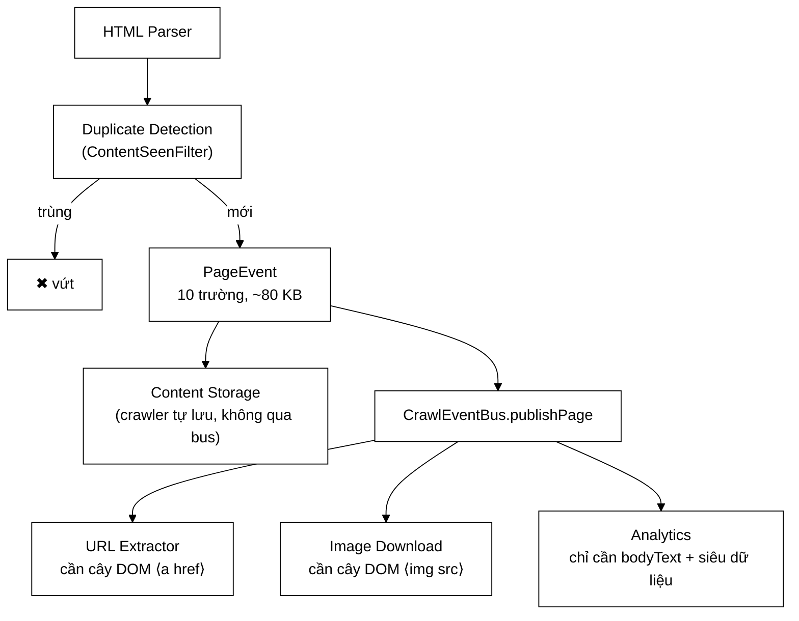

# PageEvent — thông điệp 80 KB và ba phương án đã bị bác bỏ

**File nguồn:** `search-engine/src/main/java/com/vnsearch/crawler/bus/PageEvent.java` (161 dòng)
**Gói:** `com.vnsearch.crawler.bus` · **Loại:** `record` (bất biến), 10 thành phần
**Vị trí trong sơ đồ:** mũi tên **Duplicate Detection → Kafka → Modular Services**
**Đọc kèm:** [`CrawlEventBus.md`](./CrawlEventBus.md) · [`PageEventHandler.md`](./PageEventHandler.md) · [`../ContentSeenFilter.md`](../ContentSeenFilter.md)

---

## 📌 Hiểu trong 30 giây

Đây là **đơn vị dữ liệu duy nhất** mà crawler đẩy lên bus, và là chỗ nối giữa
hai nửa của sơ đồ kiến trúc. Một trang chỉ trở thành `PageEvent` sau khi đã:
tải xong → phân tích xong → qua lọc ngôn ngữ → **vượt khối Duplicate
Detection**.

Điểm gây tranh cãi nhất của nó: nó **mang theo cả HTML thô**, trung bình 80 KB.
Ba phương án nhẹ hơn đã được cân nhắc và bác bỏ, mỗi phương án vì một lý do
khác nhau — mục 2 phân tích từng cái.



```
   MƯỜI TRƯỜNG — AI DÙNG TRƯỜNG NÀO

   url          ─┬─ mọi service (gốc để phân giải liên kết tương đối)
   host         ─┴─ KHOÁ PHÂN HOẠCH Kafka  ← trường quan trọng nhất về vận hành
   depth         ── URL Extractor (tính depth cho URL con = depth + 1)
   title         ── Analytics
   bodyText      ── Analytics (đo mà KHÔNG phải phân tích lại DOM)
   language      ── Analytics
   html          ── URL Extractor + Image Download   ← 99% kích thước nằm ở đây
   contentHash   ── truy vết, đối chiếu với ContentSeenFilter
   crawledAt     ── Analytics, và để biết dữ liệu cũ bao lâu
   jobId         ── ĐỊNH TUYẾN: URL quay về phải vào đúng frontier  ← xem mục 4
```

---

## 1. Vị trí chính xác trong luồng

Javadoc dòng 13–19 vẽ sẵn, và chi tiết đáng chú ý là **Content Storage không đi
qua bus**:

```
   HTML Parser -> Duplicate Detection ──┬──> Content Storage   (crawler tự lưu)
                                        │
                                        └──> [ Kafka ] ──┬──> URL Extractor
                                                         ├──> Image Download
                                                         └──> Analytics Service
```

Vì sao lưu trữ nằm ngoài bus? Vì lưu trang là **việc lõi của crawler**, không
phải một dịch vụ phái sinh:

```
   NẾU lưu trữ cũng qua bus:
        → broker chết  ⇒  KHÔNG CÒN TRANG NÀO ĐƯỢC LƯU
        → cả phiên crawl 4 tiếng thành công cốc
        → mà hợp đồng của bus lại là "gửi hỏng thì đếm, không ném"
          ⇒ mất dữ liệu ÂM THẦM, chỉ thấy một con số đếm tăng

   VÌ THẾ:
        lưu trữ  = đường đồng bộ, lỗi thì biết ngay, là nghĩa vụ
        bus      = đường bất đồng bộ, lỗi thì đếm, là phái sinh

   ⇒ Broker chết: crawl vẫn chạy, corpus vẫn đầy, chỉ mất
     phần phân tích phụ — và có thể chạy lại sau từ corpus đã lưu.
```

Đây là một quyết định về **phân tầng độ quan trọng**, và nó lặp lại khắp dự án:
thứ gì không có thì hệ thống mất ý nghĩa thì đi đường đồng bộ; thứ gì làm hệ
thống tốt hơn thì đi đường bất đồng bộ.

---

## 2. Ba phương án đưa gì vào thông điệp

Javadoc dòng 21–50. Đây là phần đáng đọc kỹ nhất của lớp.

### 2.1 Bảng so sánh

| Phương án | Kích thước | Vì sao chọn / bác bỏ |
|---|---|---|
| Chỉ gửi URL, service tự tải lại | ~200 byte | **Bác bỏ** — 3 service = 3 lần tải thêm |
| Crawler bóc sẵn link + ảnh rồi gửi danh sách | ~5 KB | **Bác bỏ** — phần việc thật nằm lại trong crawler |
| **Gửi HTML thô** | ~80 KB | **Đang dùng** — tải một lần, mọi service thấy cùng một bản |

### 2.2 Vì sao "service tự tải lại" tệ hơn vẻ ngoài

Nghe rất hợp lý: thông điệp bé tí, service nào cần thì tự lấy. Nhưng:

```
   ① PHÁ CHÍNH SÁCH LỊCH SỰ
        UrlFrontier dựng cả một cơ chế để giữ ≤1 request/giây/host.
        3 service tự tải  ⇒  thực tế thành 4 request cho MỘT trang
        ⇒ mọi công sức của khối politeness bị vô hiệu từ bên ngoài
        ⇒ và bên bị hại (vnexpress.net) không phân biệt được — họ chỉ thấy
          crawler của ta gõ cửa gấp 4 lần cam kết

   ② HAI SERVICE NHÌN THẤY HAI TRANG KHÁC NHAU
        t=0     crawler tải     → "Đội tuyển thắng 2-0"
        t=+30s  UrlExtractor tải → trang đã cập nhật, thêm 4 liên kết mới
        t=+31s  ImageDownload tải → trang đã đổi ảnh đại diện

        ⇒ contentHash trong thông điệp KHÔNG khớp thứ service đang xử lý
        ⇒ đồ thị liên kết cho PageRank lệch với corpus đã lưu
        ⇒ lỗi này KHÔNG BAO GIỜ tái hiện được trong test — nó phụ thuộc
          vào việc trang đích có đổi giữa hai lần tải hay không

   ③ NHÂN BA MỌI RỦI RO MẠNG
        timeout, 503, DNS hỏng, SSRF — mỗi service phải tự xử lý lại
        và mỗi service phải tự dùng SeedUrlValidator... hoặc quên dùng
```

Lý do ② là lý do quyết định: nó tạo ra **sự không nhất quán không thể phát
hiện**. Toàn bộ dự án có một nguyên tắc lặp đi lặp lại — sợ nhất là lỗi khiến
kết quả sai nhưng hệ thống vẫn báo xanh.

### 2.3 Vì sao "crawler bóc sẵn" cũng tệ, dù nhìn có vẻ tối ưu

```
   Crawler bóc sẵn <a href> và , gửi hai danh sách.
   Thông điệp còn ~5 KB. Nghe tuyệt vời.

   NHƯNG:
   ┌────────────────────────────────────────────────────────────┐
   │ Lúc đó UrlExtractorService làm gì?                         │
   │   → nhận một List<String> và... chuyển tiếp nó.            │
   │   → PHẦN VIỆC THẬT (duyệt DOM, phân giải URL tương đối,    │
   │     xử lý <base href>, bỏ rel=nofollow) đã nằm trong       │
   │     crawler rồi.                                           │
   │                                                            │
   │ ⇒ "Modular Service" không còn là service.                  │
   │ ⇒ Muốn thêm service thứ tư cần dữ liệu khác (ví dụ: bóc    │
   │   microdata schema.org) → PHẢI SỬA CRAWLER.                │
   │ ⇒ Đúng thứ mà cả kiến trúc này sinh ra để tránh.           │
   └────────────────────────────────────────────────────────────┘
```

Cách phân biệt: hỏi *"nếu tôi xoá service này đi, crawler có mất chức năng
không?"* Với phương án bóc sẵn, câu trả lời là **không** — chứng tỏ service
rỗng ruột.

### 2.4 Cái giá được trả bằng nén — dòng 52–57

```
   HTML thô là văn bản LẶP RẤT NHIỀU:
        <div class="article-content">, </p>, <a href="https://vnexpress.net/...
        cùng một menu, cùng một footer, cùng một khối script trên MỌI trang

   ⇒ tỷ lệ nén lz4 đo được: 6–8 lần

        80 KB  ──lz4──▶  ~11 KB   trên đường truyền VÀ trên đĩa
```

**Vì sao nén ở tầng producer, không phải tầng ứng dụng.** Đây là chi tiết kỹ
thuật đáng nói:

```
   Nén từng thông điệp (tầng ứng dụng):
        mỗi trang nén riêng → từ điển nén chỉ thấy 80 KB
        → không tận dụng được việc 50 trang cùng site chia nhau
          cùng một menu 6 KB

   Nén cả lô (Kafka, compression.type=lz4):
        producer gom nhiều trang thành một batch rồi nén CẢ BATCH
        → từ điển nén thấy hàng trăm KB có cấu trúc lặp
        → menu 6 KB xuất hiện 50 lần chỉ tốn ~6 KB + 50 con trỏ

   ⇒ Nén cả lô ăn đứt nén từng thông điệp, và ta được nó MIỄN PHÍ
     chỉ bằng một dòng cấu hình.
```

Xem [`KafkaCrawlConfig.md`](../../config/KafkaCrawlConfig.md) cho cấu hình
producer đầy đủ.

### 2.5 Trần kích thước — dòng 59–62

```
   max.request.size = 4 MB   (mặc định Kafka là 1 MB)

   Vì sao nâng: một số trang tin có HTML > 1 MB (bài dài + comment inline
   + dữ liệu JSON nhúng). Với trần mặc định thì producer ném, và những
   trang đó bị mất khỏi mọi service phái sinh.

   Vì sao KHÔNG nâng vô hạn: trần tồn tại để một trang dị thường
   (ví dụ một trang bị lỗi sinh ra 200 MB thẻ lồng nhau) không làm
   nổ bộ nhớ broker.

   Trang vượt trần:
        producer ném ĐỒNG BỘ ngay tại lời gọi send()
        → KafkaCrawlEventBus bắt trong try/catch (xem lớp đó, dòng 137)
        → publishFailures++ và một dòng WARN
        → phiên crawl CHẠY TIẾP
```

Đây chính là lý do `KafkaCrawlEventBus.send()` bọc `try/catch` quanh cả lời gọi
`send` chứ không chỉ dựa vào callback — callback không bắt được ca ném đồng bộ
này.

---

## 3. Vì sao là `record`, không phải lớp thường

Javadoc dòng 64–69.

```
   THÔNG ĐIỆP ĐI QUA MẠNG PHẢI BẤT BIẾN.

   Ở chế độ in-process, ba service nhận CÙNG MỘT tham chiếu object:

        handler1.onPage(event);    ← nếu nó sửa event.html = null
        handler2.onPage(event);    ← thì service này nhận HTML rỗng
        handler3.onPage(event);       và không hiểu vì sao

   → lỗi phụ thuộc THỨ TỰ ĐĂNG KÝ handler
   → đảo thứ tự subscribePages() là đổi triệu chứng
   → không tái hiện được ở chế độ Kafka (mỗi consumer có bản sao riêng)

   ⇒ Loại lỗi tệ nhất: chỉ xảy ra ở MỘT chế độ, phụ thuộc thứ tự,
     không có exception.
```

`record` chặn việc này ngay ở mức ngôn ngữ: mọi trường là `final`, không có
setter, không thể sửa. Kèm theo hai món miễn phí:

- `equals`/`hashCode` sinh sẵn → test so sánh thông điệp bằng một dòng
  `assertEquals(expected, actual)`;
- cú pháp compact constructor để đặt bất biến (mục 4.1).

Lưu ý một giới hạn thật: `record` chỉ bất biến **nông**. Ở đây tất cả trường là
`String`/`int`/`Instant` (đều bất biến sẵn) nên không có lỗ hổng. Nhưng
[`OutlinksExtracted`](./OutlinksExtracted.md) có một `List` và **phải** sao chép
phòng thủ — xem lớp đó.

---

## 4. `jobId` — trường tồn tại vì một lỗi chỉ xuất hiện khi chạy thật

Khối chú thích dòng 82–95 là phần có giá trị nhất của file, vì nó ghi lại một
lỗi **chỉ lộ ra dưới tải, với nhiều job, ở chế độ Kafka**.

### 4.1 Vấn đề

```
   CHẾ ĐỘ IN-PROCESS
   ─────────────────────────────────────────────────────────
   "URL này thuộc phiên crawl nào?"  ← câu hỏi VÔ NGHĨA
   Chỉ có một CrawlerService, và nó đang gọi chính nó.
   URL bóc ra → nạp thẳng vào frontier của chính nó. Xong.


   CHẾ ĐỘ KAFKA
   ─────────────────────────────────────────────────────────
   URL đi VÒNG QUA BROKER rồi mới quay lại:

     Phiên A (vnexpress.net)  ──┐
                                ├──▶ topic crawl.urls ──▶ ??? ──▶ frontier nào?
     Phiên B (tuoitre.vn)     ──┘

   CrawlJobManager cho phép MAX_CONCURRENT_JOBS = 2.
   Không có jobId ⇒ bên nhận phải ĐOÁN.
```

### 4.2 Hậu quả nếu đoán sai

```
   URL của phiên A rơi vào frontier của phiên B
        ⇒ phiên B đi crawl vnexpress.net
        ⇒ nhưng người dùng chỉ định phiên B là tuoitre.vn
        ⇒ corpus của B nhiễm dữ liệu ngoài phạm vi
        ⇒ thống kê theo job sai
        ⇒ nếu B có giới hạn maxPages, quota bị tiêu bởi trang của A

   Và triệu chứng:
        - KHÔNG có exception
        - KHÔNG có dòng log lỗi
        - chỉ xảy ra khi CÓ ĐÚNG ≥2 job chạy chồng thời gian
        - chỉ ở chế độ Kafka
        - và tỷ lệ nhiễm phụ thuộc thời điểm — không lặp lại được
```

Javadoc gọi đúng tên: *"đúng loại khó truy nhất"*. Cách chữa là một trường
`String` — chi phí ~40 byte trên một thông điệp 80 KB, tức **0,05%**.

```
   ┌───────────────────────────────────────────────────────────┐
   │  BÀI HỌC TỔNG QUÁT                                        │
   │                                                           │
   │  Khi một lời gọi hàm được thay bằng một thông điệp qua     │
   │  mạng, NGỮ CẢNH NGẦM biến mất:                            │
   │      - "tôi đang ở trong job nào"                          │
   │      - "ai gọi tôi"                                        │
   │      - "phiên/giao dịch/tenant nào"                        │
   │                                                           │
   │  Ngữ cảnh đó phải được ĐÓNG GÓI TƯỜNG MINH vào thông điệp, │
   │  nếu không bên nhận sẽ đoán — và đoán sai lặng lẽ.         │
   │                                                           │
   │  Đây cũng chính là lý do hệ thống thật cần traceId,        │
   │  tenantId, correlationId trong mọi thông điệp.             │
   └───────────────────────────────────────────────────────────┘
```

Cùng lý do đó, `jobId` cũng có mặt ở [`DiscoveredUrl`](./DiscoveredUrl.md) và
[`OutlinksExtracted`](./OutlinksExtracted.md).

---

## 5. Hướng dẫn về code

### 5.1 Compact constructor — bắt lỗi tại chỗ sinh, dòng 117–127

```java
public PageEvent {
    if (url == null || url.isBlank()) {
        throw new IllegalArgumentException("PageEvent.url không được rỗng");
    }
    if (host == null || host.isBlank()) {
        throw new IllegalArgumentException("PageEvent.host không được rỗng, url=" + url);
    }
    if (depth < 0) {
        throw new IllegalArgumentException("PageEvent.depth phải >= 0, nhận được: " + depth);
    }
}
```

Vì sao đúng **ba** trường này chứ không phải cả mười:

| Trường | Kiểm? | Lý do |
|---|---|---|
| `url` | ✔ | Mọi service dùng làm **gốc** để phân giải liên kết tương đối. Rỗng ⇒ URL con sai hết |
| `host` | ✔ | **Khoá phân hoạch Kafka**. Rỗng ⇒ thông điệp không định tuyến được ⇒ phá bất biến chống trùng |
| `depth` | ✔ | Âm là vô nghĩa; và `depth + 1` cho URL con sẽ lan lỗi tiếp |
| `title`, `bodyText` | ✘ | Trang thật **có thể** không có tiêu đề hoặc thân bài rỗng — đó là dữ liệu hợp lệ, không phải lỗi |
| `html` | ✘ | `withoutHtml()` cố tình tạo bản `html == null` |
| `language` | ✘ | `LanguageFilter` có thể không kết luận được |
| `contentHash` | ✘ | `ContentSeenFilter` cho qua thân bài rỗng mà không băm |
| `crawledAt`, `jobId` | ✘ | Hữu ích nhưng không phá được luồng nếu thiếu |

Nguyên tắc rút ra: **chỉ ném khi thiếu trường đó làm hỏng việc định tuyến hoặc
việc xử lý của bên nhận.** Kiểm quá tay sẽ khiến những trang thật nhưng dị
thường (không tiêu đề, thân rỗng) bị vứt — mà đó là mất dữ liệu.

Javadoc dòng 109–116 nói rõ vì sao kiểm **ở đây** chứ không ở consumer:

> Để nó lọt lên bus thì lỗi chỉ lộ ra ở phía consumer — xa chỗ sinh lỗi, và
> thường là lúc 3 giờ sáng.

```
   KIỂM Ở CHỖ TẠO:        stack trace chỉ thẳng vào CrawlerService dòng N
                          → sửa trong 2 phút

   KIỂM Ở CONSUMER:       thông điệp đã qua serialize, qua mạng, qua broker
                          → stack trace chỉ vào Jackson
                          → phải dò ngược qua log của broker để tìm trang nào
                          → và thông điệp đã nằm ở dead-letter topic
```

### 5.2 `htmlSizeBytes()` và `@JsonIgnore` — dòng 129–141

```java
@JsonIgnore
public int htmlSizeBytes() {
    return html == null ? 0 : html.getBytes(StandardCharsets.UTF_8).length;
}
```

Ba điểm:

**① Vì sao `@JsonIgnore`.** Đây là giá trị **dẫn xuất** từ `html`. Ghi nó vào
JSON thì vừa thừa (tính lại được) vừa nguy hiểm: nếu ai đó tạo `PageEvent` bằng
`withoutHtml()` rồi gửi đi, trường `htmlSizeBytes` đã ghi sẽ **lệch** với
`html == null`. Một trường tự mâu thuẫn với nguồn của nó là mầm lỗi.

**② Vì sao `getBytes(UTF_8).length` chứ không phải `html.length()`.**

```
   "Đội tuyển"  →  html.length()               = 9   (ký tự)
                →  getBytes(UTF_8).length      = 13  (byte)

   Chênh ~40% với văn bản tiếng Việt có dấu!

   Mà thứ ta cần biết là:
        - Kafka đo max.request.size bằng BYTE
        - đĩa và băng thông tính bằng BYTE
   ⇒ dùng length() sẽ báo dưới trần trong khi thực tế đã vượt trần.
```

Đây là cạm bẫy thường gặp với dữ liệu tiếng Việt và rất đáng nêu khi bảo vệ.

**③ Chi phí.** `getBytes()` **cấp phát một mảng byte mới** cỡ bằng cả HTML rồi
vứt đi. Gọi nó trong vòng lặp nóng là tạo rác 80 KB mỗi lần. Hiện chỉ gọi từ
`toString()` và từ Analytics nên không thành vấn đề, nhưng đây là điểm cần biết
— xem đề xuất ở mục 8.

Javadoc còn trỏ sang [`ImageFound#isDownloaded()`](./ImageFound.md) — nơi việc
**quên** chú giải này đã làm chết cả một luồng thật. Đó là ví dụ cho thấy
`@JsonIgnore` ở đây không phải "cho gọn".

### 5.3 `withoutHtml()` — chống một lỗi rẻ tiền nhưng đắt hậu quả, dòng 143–154

```java
public PageEvent withoutHtml() {
    return new PageEvent(url, host, depth, title, bodyText, language, null,
            contentHash, crawledAt, jobId);
}
```

```
   KỊCH BẢN KHÔNG CÓ HÀM NÀY:

        log.info("Xử lý xong {}", event);       ← trông vô hại

   Nếu toString() mặc định của record được dùng:
        → in ra TOÀN BỘ 10 trường, kể cả html
        → 80 KB một dòng log
        → × 31.030 trang = 2,4 GB tệp log cho MỘT phiên crawl
        → ổ đĩa máy chạy log đầy → dịch vụ log chết →
          và thường kéo theo cả ứng dụng nếu ghi log đồng bộ

   HAI LỚP PHÒNG VỆ trong file này:
        ① toString() được GHI ĐÈ (dòng 156-160) — chỉ in url, host,
          depth, htmlBytes, language. HTML không có đường lọt ra.
        ② withoutHtml() cho consumer nào chỉ cần siêu dữ liệu.
```

`toString()` ghi đè (dòng 156–160) là lớp phòng vệ quan trọng hơn, vì nó bảo vệ
cả những chỗ gọi mà tác giả chưa nghĩ tới. `withoutHtml()` phục vụ một mục đích
khác: chuyển tiếp thông điệp cho consumer chỉ cần siêu dữ liệu, tiết kiệm băng
thông thật chứ không chỉ tiết kiệm log.

Lưu ý: đây là kiểu **wither** — chuẩn mực cho record. Nó trả về **đối tượng
mới**, không sửa đối tượng cũ, nên vẫn giữ nguyên tính bất biến ở mục 3.

### 5.4 Cạm bẫy khi sửa lớp này

| Ý định | Hậu quả |
|---|---|
| Thêm một `isXxx()`/`getXxx()` dẫn xuất | Jackson tự coi là thuộc tính ⇒ ghi vào JSON ⇒ consumer ném `UnrecognizedPropertyException` ⇒ **mọi** thông điệp vào dead-letter. **Luôn** kèm `@JsonIgnore` |
| Bỏ ghi đè `toString()` | 2,4 GB log/phiên — xem 5.3 |
| Thêm trường vào giữa record | Đổi thứ tự tham số canonical constructor ⇒ mọi chỗ tạo phải sửa. Thêm vào **cuối** |
| Đổi `String html` thành `byte[]` | Mất bất biến nông (mảng sửa được); và Jackson mã hoá base64 ⇒ **phình 33%** |
| Bỏ `jobId` "vì in-process không cần" | Xem mục 4 — lỗi định tuyến im lặng ở chế độ Kafka |
| Kiểm `title`/`bodyText` không rỗng | Vứt nhầm trang thật — xem bảng 5.1 |

---

## 6. Độ phức tạp & chi phí

| Đại lượng | Giá trị | Ghi chú |
|---|---|---|
| Kích thước trung bình | ~80 KB | Đuôi phân bố tới vài trăm KB |
| Sau nén lz4 theo lô | ~11 KB | Tỷ lệ 6–8× đo thực tế |
| Trần cứng | 4 MB | `max.request.size`; vượt thì bỏ trang + WARN |
| Chi phí tạo | O(1) | Chỉ gán tham chiếu; không sao chép chuỗi |
| `htmlSizeBytes()` | O(n) + cấp phát n byte | Đừng gọi trong vòng lặp nóng |
| `withoutHtml()` | O(1) | Tạo record mới, chia sẻ mọi tham chiếu chuỗi |
| Chi phí `jobId` | ~40 byte = **0,05%** | Cái giá để loại một lớp lỗi |

```
   TỔNG DUNG LƯỢNG TRÊN CORPUS 31.030 TRANG

   Chưa nén:   31.030 × 80 KB   ≈  2,48 GB   đi qua bus
   Sau lz4:    31.030 × 11 KB   ≈  341 MB

   So sánh: phần văn bản đã bóc (bodyText) chỉ ~8 KB/trang ≈ 248 MB
   ⇒ HTML thô chiếm ~90% lưu lượng bus.

   ĐÁNG KHÔNG?  Đáng — vì phương án thay thế là tải lại 3 lần,
   tức ~7,4 GB băng thông RA NGOÀI (đắt hơn nhiều so với trong cụm)
   cộng với sự không nhất quán ở mục 2.2.
```

---

## 7. Kiểm thử liên quan

| Bộ test | Kiểm gì |
|---|---|
| [`CrawlEventTest`](../../../../../test/java/com/vnsearch/crawler/bus/CrawlEventTest.md) | Compact constructor ném đúng ca; `withoutHtml()`; `toString()` không lộ HTML |
| [`KafkaCrawlBusIT`](../../../../../test/java/com/vnsearch/crawler/bus/KafkaCrawlBusIT.md) | Vòng đi–về thật: serialize → broker → deserialize, `equals` phải khớp |
| [`CrawlerServiceBusWiringTest`](../../../../../test/java/com/vnsearch/crawler/CrawlerServiceBusWiringTest.md) | Crawler dựng `PageEvent` với đủ trường, đúng thời điểm (sau Duplicate Detection) |

```
   ĐẦU VÀO                                        KẾT QUẢ MONG ĐỢI
   ────────────────────────────────────────       ────────────────────────
   url=null                                       IllegalArgumentException
   url="   "                                      IllegalArgumentException
   host=""                                        IllegalArgumentException (kèm url trong thông báo)
   depth=-1                                       IllegalArgumentException
   title=null, bodyText=null                      TẠO ĐƯỢC — dữ liệu hợp lệ
   html=null                                      TẠO ĐƯỢC, htmlSizeBytes()==0
   html="Đội tuyển"                               htmlSizeBytes()==13, KHÔNG phải 9
   e.withoutHtml().html()                         null, mọi trường khác giữ nguyên
   e.toString()                                   KHÔNG chứa chuỗi html
```

Hai bài test còn thiếu, và cả hai kiểm đúng những rủi ro đã nêu:

```java
// 1. Chống hồi quy @JsonIgnore — bài test đáng giá nhất của cả gói này
@Test
void jsonKhongChuaTruongDanXuat() throws Exception {
    var json = new ObjectMapper().writeValueAsString(mauPageEvent());
    assertFalse(json.contains("htmlSizeBytes"),
            "trường dẫn xuất lọt vào JSON → consumer sẽ ném UnrecognizedPropertyException");
    // và quan trọng hơn: đọc ngược lại phải thành công
    assertDoesNotThrow(() -> new ObjectMapper().readValue(json, PageEvent.class));
}

// 2. Kích thước byte đúng với tiếng Việt có dấu
@Test
void kichThuocTinhBangByteKhongPhaiKyTu() {
    var e = mauPageEvent("Đội tuyển Việt Nam");
    assertEquals(25, e.htmlSizeBytes());   // KHÔNG phải 18
}
```

---

## 8. Liên kết

- Nơi thông điệp được đẩy đi: [`CrawlEventBus.md`](./CrawlEventBus.md)
- Hợp đồng của bên nhận: [`PageEventHandler.md`](./PageEventHandler.md)
- Khối quyết định trang nào trở thành `PageEvent`: [`../ContentSeenFilter.md`](../ContentSeenFilter.md)
- Nguồn của `title`/`bodyText`: [`../ContentParser.md`](../ContentParser.md)
- Nguồn của `language`: [`../LanguageFilter.md`](../LanguageFilter.md)
- Vì sao `host` là khoá phân hoạch: [`DiscoveredUrl.md`](./DiscoveredUrl.md) mục về phân hoạch
- Ca `@JsonIgnore` bị quên và hậu quả: [`ImageFound.md`](./ImageFound.md)
- Cấu hình nén và trần kích thước: [`../../config/KafkaCrawlConfig.md`](../../config/KafkaCrawlConfig.md)
- Nơi `jobId` được sinh ra: [`../../service/CrawlJobManager.md`](../../service/CrawlJobManager.md)
- Tổng quan: `docs/ARCHITECTURE.md`
