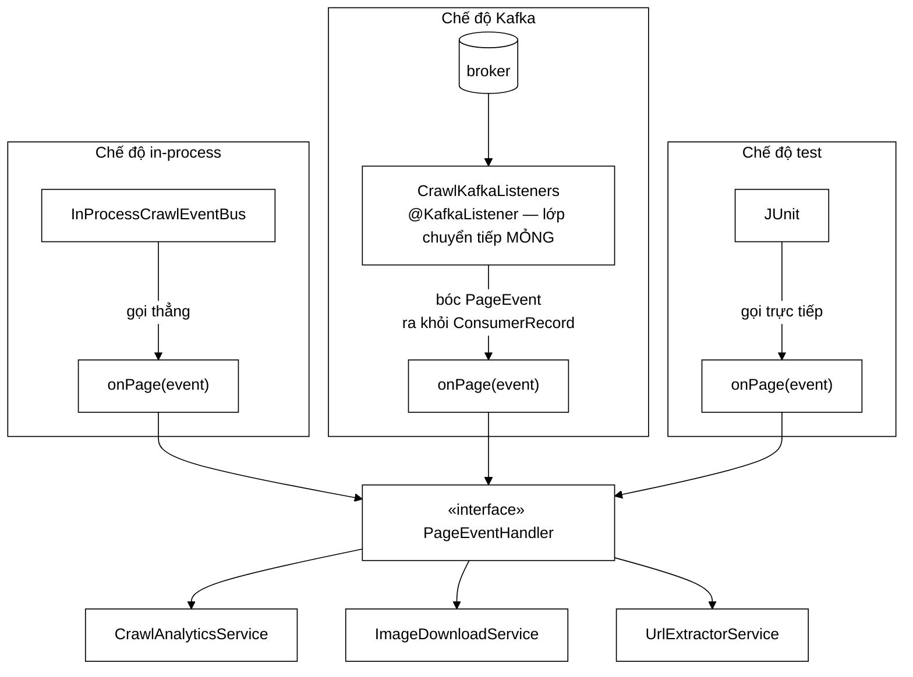

# PageEventHandler — interface một phương thức, và những gì cố ý KHÔNG có trong nó

**File nguồn:** `search-engine/src/main/java/com/vnsearch/crawler/bus/PageEventHandler.java` (54 dòng)
**Gói:** `com.vnsearch.crawler.bus` · **Loại:** `@FunctionalInterface`, 1 phương thức trừu tượng + 1 mặc định
**Vị trí trong sơ đồ:** hợp đồng của **cả ba ô** trong cụm `Modular Services`
**Đọc kèm:** [`CrawlEventBus.md`](./CrawlEventBus.md) · [`PageEvent.md`](./PageEvent.md) · [`InProcessCrawlEventBus.md`](./InProcessCrawlEventBus.md)

---

## 📌 Hiểu trong 30 giây

Interface ngắn nhất của cả gói, và giá trị của nó nằm ở **những gì không có**:

```java
void onPage(PageEvent event);
```

Không `ConsumerRecord`. Không `Acknowledgment`. Không `@KafkaListener`. Không
`headers`, không `offset`, không `partition`.

Đó là chủ đích. Nhờ chữ ký này mà **cùng một đối tượng service** chạy được ở cả
hai chế độ triển khai, và test gọi thẳng `onPage()` như một phương thức Java
bình thường — không mock, không container, không 15 giây khởi động.



```
   BA BẢN CÀI = BA Ô TRONG SƠ ĐỒ

                    ┌──────────────────────────┐
   [ Kafka ] ──────▶│ CrawlAnalyticsService    │  đo
      │             ├──────────────────────────┤
      ├────────────▶│ ImageDownloadService     │  ảnh
      │             ├──────────────────────────┤
      └────────────▶│ UrlExtractorService      │  liên kết ──▶ Frontier
                    └──────────────────────────┘

   Ba service, một phương thức, không service nào biết Kafka tồn tại.
```

---

## 1. Vì sao chữ ký này quan trọng hơn nó trông

Javadoc dòng 19–23 nói thẳng: *"Không có gì của Kafka trong chữ ký này."*

### 1.1 Nếu chữ ký dính Kafka

```java
// GIẢ ĐỊNH — KHÔNG phải mã thật
public interface PageEventHandler {
    void onPage(ConsumerRecord<String, PageEvent> record, Acknowledgment ack);
}
```

```
   HẬU QUẢ DÂY CHUYỀN:

   ① Service PHẢI import org.apache.kafka.*
        → module lõi phụ thuộc spring-kafka
        → không tách ra thư viện riêng được

   ② Test phải DỰNG một ConsumerRecord
        new ConsumerRecord<>("topic", 0, 0L, "key", event)
        → 5 tham số vô nghĩa với bài test
        → và phải mock Acknowledgment
        → mỗi bài test dài thêm 10 dòng KHÔNG liên quan tới thứ đang kiểm

   ③ Chế độ in-process phải GIẢ MẠO một ConsumerRecord
        → offset giả, partition giả, timestamp giả
        → và ack.acknowledge() gọi vào... đâu?
        → hoặc truyền null → NPE nếu service lỡ gọi

   ④ Service tự quản lý ack
        → mỗi service phải TỰ ĐÚNG về ngữ nghĩa at-least-once
        → 3 service = 3 cơ hội làm sai
        → và làm sai thì mất thông điệp, im lặng

   ⑤ Không tái dùng được
        → muốn chạy Analytics trên corpus đã lưu (batch job)?
          phải bịa ra ConsumerRecord từ dữ liệu trên đĩa
```

### 1.2 Chữ ký sạch mua được gì

```
   ┌──────────────────────────────────────────────────────────────┐
   │  MỘT ĐỐI TƯỢNG SERVICE, BỐN NGỮ CẢNH CHẠY                    │
   │                                                              │
   │   ① in-process    bus.subscribePages(service)                │
   │   ② Kafka         listener bóc record rồi gọi service         │
   │   ③ test JUnit    service.onPage(mauPageEvent())              │
   │   ④ batch/CLI     for (doc : corpusDaLuu) service.onPage(...) │
   │                                                              │
   │  Ngữ cảnh ④ là món quà không ai lên kế hoạch: chạy lại        │
   │  Analytics trên corpus cũ mà KHÔNG crawl lại, KHÔNG cần      │
   │  broker. Nó có được chỉ vì chữ ký không dính hạ tầng.        │
   └──────────────────────────────────────────────────────────────┘
```

Điểm cần nhấn: **ràng buộc tạo ra tự do.** Việc tự áp ràng buộc "phải chạy được
ở cả hai chế độ" đẩy mọi thứ dính broker ra rìa, và phần lõi trở nên dùng được
ở những nơi chưa ai nghĩ tới. Xem
[`CrawlEventBus.md`](./CrawlEventBus.md) mục 1.2 cho cùng lập luận nhìn từ phía
bus.

### 1.3 Phần dính Kafka đi đâu

Nó không biến mất — nó **bị dồn** vào hai chỗ nhỏ và cô lập:

| Chỗ | Trách nhiệm | Số dòng |
|---|---|---|
| [`KafkaCrawlEventBus`](./KafkaCrawlEventBus.md) | Phía gửi: chọn topic, chọn khoá, đếm lỗi | 156 |
| [`CrawlKafkaListeners`](../../config/CrawlKafkaListeners.md) | Phía nhận: bóc `PageEvent` ra khỏi `ConsumerRecord`, gọi service | vài lớp mỏng |

```
   TỔNG MÃ DÍNH KAFKA:  ~250 dòng, nằm ở 2 chỗ, ai cũng tìm thấy

   Nếu để rải rác trong service:
        3 service × phần ack/record  ≈  cùng chừng đó dòng
        nhưng NẰM RẢI RÁC, trộn lẫn với logic nghiệp vụ
        và mỗi service phải tự đúng

   ⇒ Cùng lượng mã, nhưng một bên tập trung được, một bên thì không.
```

---

## 2. `@FunctionalInterface` — không phải chú giải trang trí

Dòng 35. Nó có ba tác dụng thật:

```
   ① TRÌNH BIÊN DỊCH CANH GIỮ
        Thêm một phương thức trừu tượng thứ hai vào interface này
        → LỖI BIÊN DỊCH ngay, kèm thông báo rõ ràng

        Không có chú giải → thêm được, và mọi lambda hiện có
        đột nhiên không biên dịch nữa, với thông báo khó hiểu hơn.

   ② CHO PHÉP VIẾT BẰNG LAMBDA
        bus.subscribePages(e -> log.info("Đã xử lý {}", e.url()));
        bus.subscribePages(e -> demTrang.incrementAndGet());

        Rất tiện cho test và cho các handler dùng một lần.

   ③ TUYÊN BỐ Ý ĐỊNH
        "Đây là một HÀNH VI, không phải một đối tượng có trạng thái."
        Người đọc biết ngay đây là điểm mở rộng, không phải một
        lớp cơ sở để kế thừa.
```

Lưu ý: `default String handlerName()` **không** phá `@FunctionalInterface` —
phương thức `default` đã có cài đặt nên không tính vào số phương thức trừu
tượng. Đó chính là lý do `handlerName()` được thiết kế là `default` chứ không
phải trừu tượng (mục 4).

---

## 3. Ném ngoại lệ là **hợp lệ** — dòng 25–29

Đây là điểm dễ làm sai nhất khi viết một handler.

```
   HỢP ĐỒNG:  onPage() ĐƯỢC PHÉP ném.
              Ném = "thông điệp NÀY hỏng", KHÔNG phải "hệ thống hỏng".

   ┌─────────────────────────────────────────────────────────────┐
   │  CHẾ ĐỘ IN-PROCESS                                          │
   │     InProcessCrawlEventBus bọc từng handler trong try/catch │
   │     → service A ném  ⇒  service B, C VẪN CHẠY               │
   │     → publishFailures++ và một dòng WARN                    │
   │     → crawler không hề biết                                 │
   ├─────────────────────────────────────────────────────────────┤
   │  CHẾ ĐỘ KAFKA                                               │
   │     Ngoại lệ ⇒ không ack ⇒ thử lại (3 lần)                  │
   │     → vẫn hỏng ⇒ đẩy sang dead-letter topic                 │
   │     → THÔNG ĐIỆP KHÔNG MẤT, chỉ chuyển sang chỗ chờ người xem│
   └─────────────────────────────────────────────────────────────┘

   CẢ HAI chế độ đều coi ngoại lệ là chuyện của MỘT thông điệp.
```

### 3.1 Vì sao **không** nên tự nuốt ngoại lệ trong service

Phản xạ thông thường là bọc `try/catch` quanh toàn bộ thân `onPage` cho "an
toàn". Đó là sai:

```
   TỰ NUỐT:
        public void onPage(PageEvent e) {
            try { ... } catch (Exception ex) { log.warn("lỗi", ex); }
        }

   Hậu quả ở chế độ Kafka:
        → không ném ⇒ Kafka coi là XỬ LÝ THÀNH CÔNG ⇒ ack
        → thông điệp bị đánh dấu đã xử lý xong
        → KHÔNG vào dead-letter
        → KHÔNG thử lại
        → dữ liệu MẤT VĨNH VIỄN, chỉ còn một dòng log giữa hàng triệu dòng

   Hậu quả ở chế độ in-process:
        → publishFailures KHÔNG tăng
        → thang đo vnsearch_crawl_bus_publish_failures_total vẫn 0
        → dashboard xanh trong khi dữ liệu đang mất
```

> **Nuốt ngoại lệ ở tầng service = biến lỗi tạm thời thành mất dữ liệu vĩnh
> viễn.** Hãy để nó bay lên; tầng bus đã có sẵn cơ chế đúng cho cả hai chế độ.

Ngoại lệ duy nhất cho quy tắc này: lỗi **thực sự** không cứu được và cũng không
đáng thử lại (ví dụ HTML dị dạng không parse nổi). Lúc đó nuốt là đúng — nhưng
phải **đếm** nó bằng một thang đo riêng, không chỉ ghi log.

### 3.2 Đối chiếu với hợp đồng phía gửi

Ở [`CrawlEventBus`](./CrawlEventBus.md) mục 3, hợp đồng phía **gửi** là ngược
lại: không ném, chỉ đếm. Bảng đối chiếu:

| | Phía gửi (`publishXxx`) | Phía nhận (`onPage`) |
|---|---|---|
| Ném khi lỗi? | **Không** | **Có** |
| Vì sao | Một trang không đẩy được ≠ lý do giết cả phiên crawl 4 tiếng | Thông điệp phải được giữ lại để xem, không được mất |
| Cơ chế bù | `publishFailures++` + WARN | Thử lại → dead-letter |

Cách nhớ: **gửi hỏng thì đếm, xử lý hỏng thì ném.**

---

## 4. `handlerName()` — phương thức `default` giải một vấn đề rất cụ thể

Dòng 44–53.

```java
default String handlerName() {
    return getClass().getSimpleName();
}
```

### 4.1 Vấn đề

```
   Mặc định getClass().getSimpleName() cho ra tên đẹp:

        UrlExtractorService
        ImageDownloadService
        CrawlAnalyticsService

   NHƯNG với handler viết bằng lambda:

        bus.subscribePages(e -> demTrang.incrementAndGet());

        getClass().getSimpleName()  →  ""          (chuỗi RỖNG!)
        getClass().getName()        →  "com.vnsearch.Xxx$$Lambda$14/0x00000008000c9440"

   Và dòng log ở InProcessCrawlEventBus:

        log.warn("Modular Service {} ném ngoại lệ khi xử lý {}", handler.handlerName(), ...)

        →  "Modular Service  ném ngoại lệ khi xử lý https://..."
                            ↑↑ trống rỗng — VÔ DỤNG khi dò lỗi
```

Tệ hơn: số `$$Lambda$14` **đổi giữa các lần chạy** vì nó phụ thuộc thứ tự nạp
lớp. Nên không thể dùng để tìm kiếm trong log, không thể đặt cảnh báo theo tên,
và hai lần chạy khác nhau cho hai tên khác nhau cho cùng một handler.

### 4.2 Lời giải

```java
bus.subscribePages(new PageEventHandler() {
    @Override public void onPage(PageEvent e) { demTrang.incrementAndGet(); }
    @Override public String handlerName() { return "DemTrangTest"; }
});
```

### 4.3 Vì sao là `default` chứ không phải trừu tượng

```
   NẾU trừu tượng:
        ✘ phá @FunctionalInterface (2 phương thức trừu tượng)
        ✘ mất khả năng viết lambda HOÀN TOÀN
        ✘ ba service thật phải viết thêm một phương thức chỉ để
          trả về đúng cái getSimpleName() đã cho sẵn — mã rác

   LÀ default:
        ✔ giữ @FunctionalInterface
        ✔ ba service thật: KHÔNG viết gì, tên đã đúng
        ✔ lambda: dùng được, chỉ mất tên
        ✔ ai cần tên đẹp cho lambda: đổi sang lớp ẩn danh, ghi đè một dòng

   ⇒ Chi phí bằng 0 cho ca thường, có đường thoát cho ca đặc biệt.
     Đây đúng là thứ default method sinh ra để làm.
```

### 4.4 `handlerName()` được dùng ở đâu

| Nơi dùng | Mục đích |
|---|---|
| [`InProcessCrawlEventBus`](./InProcessCrawlEventBus.md) dòng 111–113 | Ghi rõ service nào ném ngoại lệ |
| [`MetricsConfig`](../../config/MetricsConfig.md) | Nhãn cho thang đo theo từng service |
| Log khởi động | Liệt kê các service đã đăng ký |

Chi tiết đáng chú ý ở chỗ dùng thứ nhất: bus ghi **tên handler + URL**, chứ
không ghi cả `PageEvent`. Xem chú thích dòng 108–110 của
`InProcessCrawlEventBus` — đó là lớp phòng vệ thứ ba chống việc đổ 80 KB HTML
vào tệp log (hai lớp kia ở [`PageEvent`](./PageEvent.md) mục 5.3).

---

## 5. Bắt buộc thread-safe — dòng 31–33

Javadoc nêu rõ, và đây là ràng buộc dễ vi phạm nhất:

```
   ┌──────────────────────────────────────────────────────────────┐
   │  CHẾ ĐỘ IN-PROCESS                                           │
   │     CrawlerService chạy N worker thread song song.           │
   │     Mỗi worker xử lý xong một trang thì gọi publishPage().   │
   │     → onPage() bị gọi TỪ N LUỒNG CÙNG LÚC                    │
   ├──────────────────────────────────────────────────────────────┤
   │  CHẾ ĐỘ KAFKA                                                │
   │     Một consumer group có nhiều luồng consumer.              │
   │     → onPage() cũng bị gọi từ nhiều luồng                    │
   └──────────────────────────────────────────────────────────────┘

   BẢN CÀI PHẢI TỰ LO ĐỒNG BỘ. Bus KHÔNG tuần tự hoá giúp.
```

### 5.1 Vì sao bus không tự tuần tự hoá

```
   Bus CÓ THỂ bọc mọi lời gọi trong một synchronized.
   Vì sao KHÔNG làm:

        → biến N worker thành hàng đợi MỘT luồng
        → thông lượng crawl giảm xuống bằng service CHẬM NHẤT
        → mà ImageDownloadService (nếu bật tải) mất 5-20 GIÂY/trang
        → ⇒ cả crawler bị kéo xuống 1 trang/20 giây

   ⇒ Đánh đổi: đẩy trách nhiệm đồng bộ cho service,
     đổi lấy việc ba service chạy song song thật.
```

### 5.2 Cạm bẫy điển hình

```java
// SAI — HashMap không thread-safe
public class ThongKeService implements PageEventHandler {
    private final Map<String, Integer> demTheoHost = new HashMap<>();
    private int tongSoTrang = 0;

    @Override public void onPage(PageEvent e) {
        demTheoHost.merge(e.host(), 1, Integer::sum);   // đua dữ liệu
        tongSoTrang++;                                   // mất số đếm
    }
}
```

```
   Triệu chứng:
        - tongSoTrang nhỏ hơn số trang thật (mất cập nhật)
        - HashMap có thể rơi vào vòng lặp vô hạn khi rehash song song
          (lỗi kinh điển của Java 7; Java 8+ thì "chỉ" mất dữ liệu)
        - và nó CHỈ xảy ra dưới tải, không tái hiện được trong test

   ĐÚNG:
        private final Map<String, LongAdder> demTheoHost = new ConcurrentHashMap<>();
        private final LongAdder tongSoTrang = new LongAdder();
```

Ba service thật trong dự án đều dùng `ConcurrentHashMap` + `AtomicLong`/
`LongAdder` — xem
[`CrawlAnalyticsService.md`](../modular/CrawlAnalyticsService.md).

---

## 6. Hướng dẫn về code

### 6.1 Viết một handler mới — mẫu đầy đủ

```java
public class SentimentService implements PageEventHandler {

    // ① Trạng thái PHẢI thread-safe
    private final ConcurrentHashMap<String, LongAdder> diemTheoHost = new ConcurrentHashMap<>();

    @Override
    public void onPage(PageEvent event) {
        // ② Kiểm biên: bodyText CÓ THỂ rỗng (xem PageEvent mục 5.1)
        if (event.bodyText() == null || event.bodyText().isBlank()) {
            return;                       // không phải lỗi — trang thật có thể rỗng
        }

        // ③ Logic. KHÔNG bọc try/catch tổng — để ngoại lệ bay lên (mục 3.1)
        int diem = tinhDiem(event.bodyText());
        diemTheoHost.computeIfAbsent(event.host(), k -> new LongAdder()).add(diem);
    }

    // ④ Chỉ cần ghi đè nếu tạo bằng lambda; ở đây getSimpleName() đã đúng
}
```

Bốn điểm đánh số là bốn quy tắc rút ra từ toàn bộ tài liệu này.

### 6.2 Cạm bẫy khi sửa interface này

| Ý định | Hậu quả |
|---|---|
| Thêm phương thức trừu tượng thứ hai | Lỗi biên dịch nhờ `@FunctionalInterface` — **tốt**, nhưng nếu bỏ chú giải thì mọi lambda hiện có gãy |
| Đưa `ConsumerRecord` vào chữ ký | Xem mục 1.1 — kéo Kafka vào lõi, không đảo lại được |
| Thêm `throws Exception` tường minh | Không cần: hợp đồng đã cho phép ném `RuntimeException`. Thêm checked exception buộc mọi chỗ gọi phải bọc |
| Cho `onPage` trả `boolean` "thành công" | Hai cơ chế báo lỗi song song (giá trị trả về + ngoại lệ) ⇒ chắc chắn có chỗ dùng sai |
| Bỏ `handlerName()` | Log lambda thành `""` hoặc `$$Lambda$14` — vô dụng khi dò lỗi |
| Thêm `onBatch(List<PageEvent>)` | Đáng cân nhắc, nhưng phải là `default` gọi lặp `onPage` để không phá bản cài cũ |

### 6.3 Vì sao **không** có `onPageBatch()`

Một câu hỏi hợp lý: Kafka vốn giao thông điệp theo lô, sao không cho service xử
lý cả lô?

```
   LỢI:  ① Analytics gộp được nhiều cập nhật thành một lần khoá
         ② ImageDownload gom được nhiều ảnh cùng host vào một kết nối

   HẠI:  ① Chế độ in-process KHÔNG CÓ lô tự nhiên — crawler xử lý
            từng trang xong là phát ngay. Phải bịa ra bộ đệm + timer
            ⇒ hai chế độ hành xử KHÁC NHAU  ⇒ đúng thứ cả kiến trúc
              này sinh ra để tránh
         ② Ngữ nghĩa lỗi rối: một trang trong lô hỏng thì cả lô vào
            dead-letter, hay chỉ trang đó? Kafka không có cách trả lời
            gọn cho ca này.
         ③ Độ trễ: chờ đủ lô nghĩa là trang đầu tiên phải đợi

   ⇒ KHÔNG làm. Nhưng nếu sau này đo được Analytics là nút thắt,
     đường đúng là thêm `default void onPages(List<PageEvent>)` gọi
     lặp `onPage` — bản cài nào cần thì ghi đè, bản cũ không phải sửa.
```

---

## 7. Độ phức tạp & chi phí

| Đại lượng | Giá trị |
|---|---|
| Chi phí một lời gọi `onPage` | Chi phí gọi hàm ảo (~vài ns) |
| Chi phí `handlerName()` | `getSimpleName()` — có nội bộ cache trong JVM, nhưng vẫn nên gọi **chỉ khi có lỗi** |
| Số bản cài | 3 (đúng ba ô trong sơ đồ) |
| Số dòng interface | 54, trong đó ~40 là Javadoc |

```
   TỶ LỆ JAVADOC / MÃ:  ~40 / 14  ≈  3:1

   Với một interface hai phương thức, tỷ lệ này là ĐÚNG.
   Mã ở đây tự nói hết ("nhận một PageEvent, trả về void").
   Thứ KHÔNG tự nói được là:
        - vì sao không có ConsumerRecord
        - vì sao ném là hợp lệ
        - vì sao phải thread-safe
        - vì sao handlerName() là default

   ⇒ Với interface, Javadoc CHÍNH LÀ sản phẩm. Mã chỉ là chữ ký.
```

---

## 8. Kiểm thử liên quan

| Bộ test | Kiểm gì |
|---|---|
| [`InProcessCrawlEventBusTest`](../../../../../test/java/com/vnsearch/crawler/bus/InProcessCrawlEventBusTest.md) | Cô lập lỗi khi handler ném; `handlerName()` xuất hiện trong log |
| [`CrawlAnalyticsServiceTest`](../../../../../test/java/com/vnsearch/crawler/modular/CrawlAnalyticsServiceTest.md) | Bản cài thứ nhất — gọi `onPage` trực tiếp, không cần bus |
| [`ImageDownloadServiceTest`](../../../../../test/java/com/vnsearch/crawler/modular/ImageDownloadServiceTest.md) | Bản cài thứ hai |
| [`UrlExtractorServiceTest`](../../../../../test/java/com/vnsearch/crawler/modular/UrlExtractorServiceTest.md) | Bản cài thứ ba |

Chú ý điều mà bảng trên chứng minh: **ba bài test service không hề nhắc tới
bus.** Chúng gọi `service.onPage(mauPageEvent())` trực tiếp. Đó chính là lợi
ích ở mục 1.2 được hiện thực hoá — và là bằng chứng cụ thể nhất rằng chữ ký sạch
đã trả công.

Bài test còn thiếu, kiểm đúng ràng buộc khó nhất:

```java
// Handler phải sống sót khi bị gọi từ nhiều luồng cùng lúc
@Test
void handlerAnToanKhiGoiSongSong() throws Exception {
    var service = new CrawlAnalyticsService();
    var pool = Executors.newFixedThreadPool(16);
    var latch = new CountDownLatch(16 * 100);

    for (int i = 0; i < 16 * 100; i++) {
        pool.submit(() -> { service.onPage(mauPageEvent()); latch.countDown(); });
    }
    latch.await(10, TimeUnit.SECONDS);

    assertEquals(1600, service.getTongSoTrang(),
            "mất số đếm ⇒ trạng thái service không thread-safe");
}
```

---

## 9. Chấm theo chuẩn doanh nghiệp

| Tiêu chí | Điểm | Nhận xét |
|---|---|---|
| Tách trừu tượng khỏi hạ tầng | 10/10 | Chữ ký sạch tuyệt đối; Javadoc **nói rõ đó là chủ đích**, không phải tình cờ |
| Định nghĩa hợp đồng | 10/10 | Ba điều khoản (ném hợp lệ, thread-safe, không dính Kafka) đều được ghi tường minh |
| Thiết kế API | 10/10 | `default handlerName()` giữ được `@FunctionalInterface` mà vẫn giải được bài toán tên lambda |
| Nhận thức đa luồng | 9/10 | Ràng buộc được ghi rõ; nhưng **không có cơ chế nào ép tuân thủ** — chỉ là lời hứa trong tài liệu |
| Khả năng tái dùng | 10/10 | Chạy được ở 4 ngữ cảnh, trong đó ngữ cảnh batch là lợi ích không lên kế hoạch |
| Khả năng kiểm thử | 10/10 | Ba bài test service không nhắc tới bus — bằng chứng thiết kế đã đúng |
| Tài liệu trong mã | 10/10 | Tỷ lệ Javadoc 3:1 là hợp lý cho một interface; giải thích *vì sao*, không mô tả *cái gì* |
| Ép tuân thủ | 6/10 | Không có test đa luồng cho bất kỳ bản cài nào — ràng buộc quan trọng nhất không được máy canh |

**Bốn đề xuất nâng lên mức sản phẩm:**

1. **Test đa luồng cho cả ba bản cài** (mã ở mục 8). Ràng buộc thread-safe là
   điều khoản **khó tuân thủ nhất** và **dễ vi phạm im lặng nhất** trong hợp
   đồng này, nhưng hiện không bản cài nào bị kiểm. Một `@RepeatedTest` với
   `ExecutorService` là đủ, và nó sẽ bắt được đúng loại lỗi ở mục 5.2.

2. **Bọc handler bằng một decorator đo thời gian.** Hiện không biết service nào
   chậm. Một lớp `TimedPageEventHandler implements PageEventHandler` bọc quanh
   bản thật, ghi vào `Timer` của Micrometer với nhãn `handlerName()`, sẽ trả lời
   được câu hỏi *"service nào đang kéo chậm crawler"* mà không sửa dòng nào
   trong ba service. Đây là ứng dụng trực tiếp của việc interface sạch.

3. **Ghi rõ ngữ nghĩa `null` trong Javadoc.** Cả hai bus đều bỏ qua `event`
   `null` trước khi gọi handler, nên `onPage` **không bao giờ** nhận `null`.
   Điều đó nên được hứa tường minh — hiện bản cài nào cẩn thận vẫn kiểm `null`
   thừa, còn bản cài nào không kiểm thì đang dựa vào một hành vi không được ghi.

4. **Cân nhắc `default void onPages(List<PageEvent>)`** — nhưng chỉ khi đo được
   nút thắt, và phải theo đúng khuôn ở mục 6.3 (mặc định gọi lặp `onPage`) để
   không phá bản cài cũ và không làm hai chế độ hành xử khác nhau.

---

## 10. Liên kết

- Nơi handler được đăng ký và gọi: [`InProcessCrawlEventBus.md`](./InProcessCrawlEventBus.md)
- Lớp chuyển tiếp mỏng ở chế độ Kafka: [`../../config/CrawlKafkaListeners.md`](../../config/CrawlKafkaListeners.md)
- Thông điệp mà handler nhận: [`PageEvent.md`](./PageEvent.md)
- Hợp đồng phía gửi (ngược lại về ngữ nghĩa lỗi): [`CrawlEventBus.md`](./CrawlEventBus.md) mục 3
- Ba bản cài: [`../modular/CrawlAnalyticsService.md`](../modular/CrawlAnalyticsService.md) · [`../modular/ImageDownloadService.md`](../modular/ImageDownloadService.md) · [`../modular/UrlExtractorService.md`](../modular/UrlExtractorService.md)
- Nơi gọi `publishPage`: [`../CrawlerService.md`](../CrawlerService.md)
- Thang đo theo `handlerName()`: [`../../config/MetricsConfig.md`](../../config/MetricsConfig.md)
- Tổng quan: `docs/ARCHITECTURE.md`
