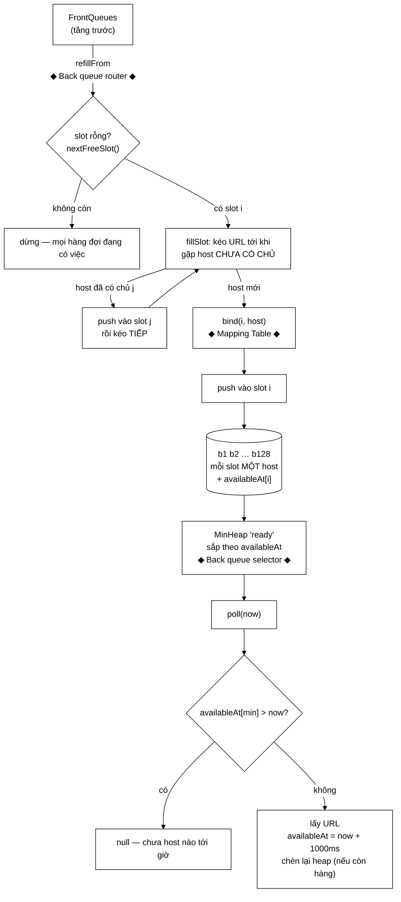

# BackQueues — mỗi hàng đợi đúng một host, và vì sao điều đó giải quyết tất cả

**File nguồn:** `search-engine/src/main/java/com/vnsearch/crawler/frontier/BackQueues.java` (277 dòng)
**Gói:** `com.vnsearch.crawler.frontier` · **Loại:** `final class` — **không** thread-safe, được [`UrlFrontier`](./UrlFrontier.md) bọc khoá
**Vị trí trong sơ đồ:** **bốn** khối — Back queue router, Mapping Table, `b1..bn`, Back queue selector
**Đọc kèm:** [`UrlFrontier.md`](./UrlFrontier.md) · [`FrontQueues.md`](./FrontQueues.md) · [`../../datastructure/MinHeap.md`](../../datastructure/MinHeap.md)

---

## 📌 Hiểu trong 30 giây

Toàn bộ cơ chế **lịch sự** (politeness) của crawler nằm ở đây. Nó dựa trên đúng
một bất biến:

> **Mỗi hàng đợi sau chỉ chứa URL của ĐÚNG MỘT host.**

Nhờ vậy yêu cầu *"chờ đủ 1 giây giữa hai lần chạm cùng một máy chủ"* biến thành
*"chờ đủ 1 giây giữa hai lần lấy từ cùng một hàng đợi"* — một điều kiện **kiểm
tra được tại chỗ**, không cần tra cứu gì thêm.



```
   BẤT BIẾN CỐT LÕI VÀ HỆ QUẢ

   "mỗi hàng đợi = ĐÚNG MỘT host"
        │
        ├─→ politeness = so sánh MỘT con số  (availableAt[slot] > now?)
        ├─→ không cần Map<host, thời điểm> lớn dần
        ├─→ MinHeap sắp theo availableAt cho ra O(log n) thay vì O(D)
        └─→ hai host khác nhau KHÔNG phải chờ nhau
```

---

## 1. Vì sao **nạp theo yêu cầu** chứ không định tuyến ngay lúc thêm

Javadoc dòng 25–37 nêu vấn đề và lời giải:

```
   Số hàng đợi sau là CỐ ĐỊNH (128), còn số host thì KHÔNG.
        một phiên crawl 6 tờ báo chạm tới HƠN 40 HOST vì các subdomain

   ── Nếu định tuyến NGAY khi URL được thêm ────────────────────────
   host thứ 129 xuất hiện → KHÔNG CÓ CHỖ để đi
        → phải bỏ URL đó?  hoặc mở rộng mảng vô hạn?
        → cả hai đều sai

   ── Lời giải của Mercator (đang dùng) ────────────────────────────
   hàng đợi sau được NẠP LẠI KHI CẠN, kéo từ tầng trước
   cho tới khi gặp một host chưa có chủ.
        → host thừa cứ NẰM YÊN ở tầng trước
        → TẦNG TRƯỚC CHÍNH LÀ VÙNG ĐỆM
```

Kết luận quan trọng nhất:

> Số hàng đợi sau chặn được số host **đang hoạt động cùng lúc** mà **không** chặn
> số host **từng gặp**.

```
   Phiên crawl chạm 200 host, chỉ có 128 slot:

   t=0     128 host đầu tiên chiếm slot, 72 host còn lại nằm ở tầng trước
   t=30s   host #17 cạn URL → slot 17 rỗng → nạp lại
                → kéo từ tầng trước, gặp host mới → gán vào slot 17
   ⇒ 200 host đều được phục vụ, chỉ là không cùng lúc.
```

---

## 2. Bốn khối của sơ đồ, bốn phần của lớp

| Khối trong sơ đồ | Trong lớp này |
|---|---|
| Mapping Table | `hostToQueue : Map<String, Integer>` |
| Back queue router | `refillFrom(FrontQueues)` |
| `b1..bn` | `queues` + `boundHost[]` |
| Back queue selector | `poll(long)` + `ready : MinHeap<Integer>` |

```
BackQueues
├── queues       : List<Deque<CrawlTask>>   ── b1..bn
├── boundHost[]  : String[]                 ── host đang chiếm mỗi slot
├── availableAt[]: long[]                   ── thời điểm slot khả dụng lại
├── hostToQueue  : Map<String,Integer>      ── Mapping Table, ≤ queueCount mục
├── ready        : MinHeap<Integer>         ── slot CÒN HÀNG, sắp theo availableAt
├── inReady[]    : boolean[]                ── slot đang ở trong heap?
├── freeSlots    : Deque<Integer>           ── slot rỗng chờ nạp (có mục cũ)
├── empty[]      : boolean[]                ── slot có đang rỗng thật không?
│
├── refillFrom(FrontQueues)     ── router
├── poll(long now)              ── selector
├── earliestAvailableAt()       ── cho UrlFrontier tính thời gian ngủ
├── pendingCount / boundHostCount / queueCount / hostOfQueue
└── nextFreeSlot / fillSlot / bind / push / markEmpty   (nội bộ)
```

---

## 3. Min-heap thay cho quét tuyến tính — cải thiện $O(D) \to O(\log n)$

Javadoc dòng 39–46:

```
   ── Bản trước ────────────────────────────────────────────────────
   quét qua MỌI domain ở mỗi lần lấy URL để tìm domain đã hết hoãn
        → O(D), và quét TRONG LÚC ĐANG GIỮ KHOÁ

   ── Bản này ──────────────────────────────────────────────────────
   các hàng đợi CÒN HÀNG nằm trong MinHeap sắp theo availableAt
        → chỉ cần nhìn phần tử NHỎ NHẤT:
          nếu nó chưa tới giờ thì CHẮC CHẮN không hàng đợi nào tới giờ
        → O(log n)
```

```java
public CrawlTask poll(long now) {
    if (ready.isEmpty()) return null;
    int slot = ready.peek();
    if (availableAt[slot] > now) {
        return null;   // ← phần tử nhỏ nhất chưa tới giờ ⇒ không có phần tử nào tới giờ
    }
    ...
}
```

Suy luận trong comment dòng 220 là chìa khoá: vì heap sắp theo `availableAt`,
`peek()` cho phần tử **khả dụng sớm nhất**. Nếu nó chưa tới giờ, mọi phần tử
khác cũng chưa. **Một phép so sánh thay cho một vòng quét.**

`MinHeap` là [cấu trúc dữ liệu tự cài](../../datastructure/MinHeap.md) — lần thứ
hai nó được dùng trong dự án (lần đầu ở tầng xếp hạng top-k).

### 3.1 Bất biến giữ cho heap không hỏng — dòng 47–50

> `availableAt[i]` **chỉ được sửa khi `i` đang ở ngoài heap** (vừa bị
> `extractMin` lấy ra, chưa được chèn lại). Nếu sửa khoá của một phần tử đang
> nằm trong heap, thứ tự heap sẽ **sai một cách âm thầm**.

```java
ready.extractMin();
inReady[slot] = false;      // ← từ đây tới lúc chèn lại, availableAt mới được phép đổi

CrawlTask task = queues.get(slot).pollFirst();
pending--;
availableAt[slot] = now + politenessDelayMs;    // ← SỬA KHOÁ, slot đang ở NGOÀI heap

if (queues.get(slot).isEmpty()) {
    markEmpty(slot);
} else {
    ready.insert(slot);     // ← chèn lại với khoá MỚI
    inReady[slot] = true;
}
```

```
   Nếu sửa availableAt của một slot ĐANG TRONG heap:

   heap:  [slot3 @ t=100]  [slot7 @ t=200]  [slot1 @ t=300]
                                              │
                              sửa availableAt[1] = 50
                                              ▼
   heap:  [slot3 @ t=100]  [slot7 @ t=200]  [slot1 @ t=50]
          ↑ peek() trả slot3, nhưng slot1 mới là sớm nhất
          → HEAP KHÔNG CÒN LÀ HEAP
          → không có exception, chỉ là thứ tự sai
          → politeness bị vi phạm một cách ngẫu nhiên, không tái hiện được
```

Đây là loại bất biến mà **trình biên dịch không kiểm tra được** — chỉ có kỷ luật
và tài liệu. Việc Javadoc nêu nó ra thành một mục riêng là đúng mức độ nghiêm
trọng.

`inReady[]` là mảng phụ để biết một slot đang ở trong heap hay không — cần thiết
vì `MinHeap` không có hàm `contains` $O(1)$.

### 3.2 Khoá phụ trong bộ so sánh — bảo đảm tái hiện được

```java
this.ready = new MinHeap<>((a, b) -> {
    int byTime = Long.compare(availableAt[a], availableAt[b]);
    return byTime != 0 ? byTime : Integer.compare(a, b);   // ← KHOÁ PHỤ
});
```

Comment dòng 173–177 giải thích:

> Không có nó, hai hàng đợi **cùng thời điểm khả dụng** sẽ được heap sắp theo
> thứ tự tuỳ ý — phiên crawl vẫn chạy đúng nhưng **thứ tự URL đổi theo cách
> chèn, nên không lặp lại được**. Vì slot được gán theo đúng thứ tự phát hiện
> host, so theo chỉ số cũng chính là **so theo thứ tự phát hiện**.

```
   Hai slot cùng availableAt = 0 (cả hai vừa được gán, chưa lấy lần nào):
        không có khoá phụ → heap trả cái nào tuỳ vào lịch sử chèn/xoá
        → hai lần chạy cùng dữ liệu cho hai thứ tự crawl khác nhau
        → mọi con số đo đạc trong báo cáo không so sánh được

   Có khoá phụ (chỉ số slot):
        luôn trả slot có chỉ số nhỏ hơn
        = host được phát hiện TRƯỚC
        → tất định
```

Đây là lần thứ ba tính **tái hiện được** xuất hiện như một yêu cầu thiết kế
trong dự án, sau `LinkedHashSet` của [`LinkExtractor`](../LinkExtractor.md) mục
2.2 và hạt giống cố định của
[`WeightedRandomSelector`](./WeightedRandomSelector.md).

---

## 4. Vì sao **không huỷ liên kết host** khi hàng đợi cạn

Javadoc dòng 52–58 — đây là chi tiết tinh vi nhất của lớp:

```java
private void markEmpty(int slot) {
    if (!empty[slot]) {
        empty[slot] = true;
        freeSlots.addLast(slot);
    }
    // KHÔNG đụng tới boundHost[slot] và availableAt[slot]
}
```

> Hàng đợi cạn vẫn **giữ nguyên** host và `availableAt` của nó, chỉ rời khỏi
> heap và vào danh sách chờ nạp. Nếu huỷ liên kết ngay, **đồng hồ lịch sự của
> host đó mất theo**, và một URL mới của chính host ấy có thể được tải lại **tức
> thì** — vi phạm đúng thứ tầng này sinh ra để bảo vệ.

```
   t=0     slot 5 giữ host "vnexpress.net", lấy URL cuối cùng
           availableAt[5] = 1000
           hàng đợi cạn

   ── Nếu huỷ liên kết ngay ────────────────────────────────────────
   t=10    URL mới của vnexpress.net chảy về
           → không tìm thấy chủ → gán vào một slot khác, availableAt = 0
           → TẢI NGAY, chỉ 10 ms sau lần trước
           ⇒ vi phạm politeness

   ── Giữ liên kết (đang dùng) ─────────────────────────────────────
   t=10    URL mới của vnexpress.net chảy về
           → hostToQueue vẫn trỏ về slot 5
           → push vào slot 5, availableAt[5] vẫn là 1000
           → phải chờ tới t=1000 mới tải
           ⇒ đúng
```

### 4.1 Và đây cũng là cách `hostToQueue` được chặn kích thước

```java
private void bind(int slot, String host) {
    String previous = boundHost[slot];
    if (previous != null && !previous.equals(host)) {
        hostToQueue.remove(previous);   // ← giữ Mapping Table không phình
    }
    boundHost[slot] = host;
    hostToQueue.put(host, slot);
}
```

> `hostToQueue` có **tối đa đúng `queueCount` mục**, vì mỗi lần một slot đổi host
> thì host cũ bị gỡ khỏi bảng. **Bản trước dùng một `Map<domain, thời điểm truy
> cập>` lớn dần theo mọi host từng gặp và không bao giờ co lại.**

```
   Bản cũ:  Map lớn theo MỌI host từng gặp
            phiên chạm 5.000 host → 5.000 mục, không bao giờ xoá
            → rò bộ nhớ chậm

   Bản này: ≤ 128 mục, luôn luôn
```

Hai lợi ích từ **một** quyết định: giữ đồng hồ lịch sự **và** chặn kích thước
bảng. Đây là dấu hiệu của một thiết kế đúng — các tính chất tốt xuất hiện cùng
nhau chứ không phải phải thêm từng cái.

**Cái mất:** khi slot 5 bị gán host mới, đồng hồ lịch sự của `vnexpress.net` mất
thật. Nhưng lúc đó host này đã không có URL nào chờ trong một thời gian, nên xác
suất vi phạm là thấp.

---

## 5. Xoá lười trong `freeSlots`

```java
/**
 * Có thể chứa mục cũ: khi một hàng đợi rỗng được nạp lại gián tiếp
 * (URL của host nó đang giữ chảy về), ta không đi tìm để xoá khỏi hàng
 * này — tốn O(n) — mà để lại và LỌC BẰNG empty[] lúc lấy ra.
 */
private final Deque<Integer> freeSlots = new ArrayDeque<>();
private final boolean[] empty;
```

```java
private int nextFreeSlot() {
    while (!freeSlots.isEmpty()) {
        int slot = freeSlots.peekFirst();
        if (empty[slot]) return slot;     // ← còn rỗng thật
        freeSlots.pollFirst();            // ← mục cũ, bỏ đi
    }
    return -1;
}
```

```
   Tình huống sinh ra mục cũ:
        slot 5 cạn → empty[5] = true, freeSlots = [5]
        URL mới của host slot 5 chảy về → push(5, task)
             → empty[5] = false
             → nhưng freeSlots VẪN chứa 5

   Hai cách xử lý:
        ── Đi tìm và xoá khỏi freeSlots   → O(n) mỗi lần push
        ── Để lại, lọc lúc lấy ra          → O(1) khấu hao   ← đang dùng
```

Đây là kỹ thuật **xoá lười (lazy deletion)** mà các hàng đợi ưu tiên hay dùng —
Javadoc nói đúng tên nó. Mỗi slot vào `freeSlots` tối đa một lần cho mỗi lần nó
rỗng, nên tổng chi phí lọc là khấu hao $O(1)$.

`empty[]` là **nguồn sự thật**; `freeSlots` chỉ là một gợi ý về thứ tự.

---

## 6. `refillFrom` — URL không bao giờ bị trả ngược

```java
public void refillFrom(FrontQueues front) {
    while (!front.isEmpty()) {
        int slot = nextFreeSlot();
        if (slot < 0) return;                 // mọi hàng đợi đều đang có việc
        if (!fillSlot(slot, front)) return;   // tầng trước cạn trước khi gán được host mới
    }
}

private boolean fillSlot(int slot, FrontQueues front) {
    while (true) {
        CrawlTask task = front.poll();
        if (task == null) return false;
        Integer owner = hostToQueue.get(task.host());
        if (owner != null && owner != slot) {
            push(owner, task);      // ← host đã có chủ → đẩy vào ĐÚNG hàng đợi của nó
            continue;               //    rồi KÉO TIẾP
        }
        bind(slot, task.host());
        push(slot, task);
        return true;
    }
}
```

Javadoc dòng 194–196:

> URL kéo lên mà host của nó **đã có chủ** thì được đẩy thẳng vào hàng đợi của
> chủ đó rồi kéo tiếp — **không bị trả ngược về tầng trước**, nên **không có URL
> nào bị lặp vòng**.

```
   Nếu trả ngược về tầng trước:
        kéo URL của host A (đã có chủ) → trả về tầng trước
        → lần refill sau lại kéo đúng URL đó lên → lại trả về
        → VÒNG LẶP VÔ HẠN, hoặc ít nhất là công việc lặp lại vô ích

   Đẩy thẳng vào hàng đợi của chủ:
        URL đi ĐÚNG chỗ nó thuộc về
        vòng lặp tiếp tục kéo cho tới khi gặp host chưa có chủ
```

Một hệ quả phụ có lợi: `fillSlot` **cũng nạp thêm cho các slot khác** trên đường
đi tìm host mới. Nên `refillFrom` không chỉ lấp một slot mà thường lấp nhiều.

> ⚠️ **Trường hợp xấu nhất:** nếu tầng trước chứa toàn URL của các host **đã có
> chủ**, `fillSlot` sẽ kéo **toàn bộ** tầng trước (có thể 500.000 URL) mà không
> gán được host mới nào, rồi trả `false`. Tất cả URL đó đi vào tầng sau — đúng
> chỗ, nhưng trong **một** lời gọi `nextUrl`, tức **trong khi đang giữ khoá**.
> Xem đề xuất 2.

---

## 7. Hướng dẫn về code

### 7.1 `push` — ba việc trong một

```java
private void push(int slot, CrawlTask task) {
    queues.get(slot).addLast(task);
    pending++;
    empty[slot] = false;              // ① đánh dấu không còn rỗng
    if (!inReady[slot]) {             // ② chỉ chèn vào heap nếu chưa có
        ready.insert(slot);
        inReady[slot] = true;
    }
}
```

`if (!inReady[slot])` là bắt buộc: chèn một slot vào heap hai lần sẽ khiến
`poll` lấy nó hai lần, và lần thứ hai `pollFirst()` có thể trả `null` (hàng đợi
đã cạn) → `pending--` sai và `task` trả về là `null`.

### 7.2 `earliestAvailableAt` — để `UrlFrontier` ngủ đúng khoảng

```java
public long earliestAvailableAt() {
    return ready.isEmpty() ? Long.MAX_VALUE : availableAt[ready.peek()];
}
```

`Long.MAX_VALUE` khi không slot nào còn hàng — [`UrlFrontier`](./UrlFrontier.md)
hiểu đó là "không có gì để chờ, chỉ chờ URL mới" và dùng `MAX_SLEEP_MS`.

Đây là ví dụ tốt về việc một lớp **cung cấp thông tin để lớp trên ra quyết định**,
thay vì tự quyết định. `BackQueues` không biết gì về `Thread.sleep`.

### 7.3 Cạm bẫy khi sửa lớp này

| Cạm bẫy | Hậu quả | Cách đúng |
|---|---|---|
| Sửa `availableAt[i]` khi `i` đang **trong** heap | Heap hỏng âm thầm, politeness vi phạm ngẫu nhiên | Chỉ sửa khi `inReady[i] == false` |
| Huỷ `boundHost` khi hàng đợi cạn | Mất đồng hồ lịch sự → tải lại tức thì | Giữ nguyên |
| Bỏ khoá phụ trong bộ so sánh | Phiên crawl không tái hiện được | Giữ `Integer.compare(a, b)` |
| Trả URL ngược về tầng trước trong `fillSlot` | Vòng lặp vô hạn | Đẩy vào hàng đợi của chủ |
| Bỏ `if (!inReady[slot])` trong `push` | Slot vào heap hai lần → `poll` trả `null` | Giữ |
| Đi tìm và xoá mục cũ khỏi `freeSlots` | $O(n)$ mỗi lần push | Giữ xoá lười |
| Bỏ `hostToQueue.remove(previous)` trong `bind` | Bảng phình theo mọi host từng gặp | Giữ |
| Thêm `synchronized` vào lớp này | Khoá lồng nhau với `UrlFrontier` | Giữ không thread-safe, để tầng trên bọc |
| Quét tuyến tính thay MinHeap "cho đơn giản" | $O(D)$ trong lúc giữ khoá — bản cũ | Giữ heap |

### 7.4 Vì sao lớp này **không** thread-safe — và đó là đúng

```java
/** Không thread-safe. UrlFrontier bọc mọi lời gọi trong khối synchronized. */
```

Quy ước nhất quán với [`FrontQueues`](./FrontQueues.md) và
[`MinHeap`](../../datastructure/MinHeap.md): **cấu trúc dữ liệu không tự đồng bộ,
lớp Facade lo việc đó**.

Lý do (nêu ở [`UrlFrontier`](./UrlFrontier.md) mục 5.1): hai tầng phải đổi trạng
thái **cùng nhau** trong `nextUrl`. Nếu mỗi tầng tự khoá, ta vẫn cần một khoá
bao ngoài — tức khoá lồng nhau, chậm hơn và có nguy cơ deadlock.

---

## 8. Độ phức tạp & chi phí

Gọi $n$ = số hàng đợi sau (128), $k$ = số URL kéo lên trong một lần refill.

| Thao tác | Chi phí | Ghi chú |
|---|---|---|
| `poll` — chưa tới giờ | $O(1)$ | Chỉ `peek` + so sánh |
| `poll` — lấy được | $O(\log n)$ = 7 phép | `extractMin` + `insert` |
| `push` | $O(\log n)$ nếu phải chèn heap, $O(1)$ nếu không | |
| `nextFreeSlot` | $O(1)$ khấu hao | Xoá lười |
| `fillSlot` | $O(k \log n)$ | $k$ = số URL kéo tới khi gặp host mới |
| `refillFrom` | $O(k \log n)$ | Thường $k$ nhỏ |
| `earliestAvailableAt` | $O(1)$ | |
| Bộ nhớ | $O(n + P)$ | $P$ = số URL trong tầng sau |

So sánh với bản cũ:

```
   Số host D    Bản cũ: O(D)       Bản này: O(log 128) = 7
   ─────────    ────────────       ──────────────────────────
        10           10                    7
        50           50                    7
       200          200                    7
      1000        1.000                    7    ← KHÔNG ĐỔI

   Trên 31.030 lần poll:
        bản cũ với D=200:  6.206.000 phép so sánh
        bản này:             217.210 phép
        ⇒ giảm ~29 LẦN
```

Bộ nhớ cố định: 128 slot × (một `ArrayDeque` rỗng ~40 byte + `String` host +
`long` + 2 `boolean`) ≈ **~15 KB** — không đáng kể, và **không phụ thuộc số host
từng gặp**.

---

## 9. Kiểm thử liên quan

| Test | Bảo vệ điều gì |
|---|---|
| `test/java/com/vnsearch/crawler/frontier/BackQueuesTest.java` | Politeness; định tuyến; nạp lại |
| `test/java/com/vnsearch/crawler/frontier/UrlFrontierTest.java` | Tích hợp hai tầng |
| `test/java/com/vnsearch/datastructure/MinHeapTest.java` | Cấu trúc bên dưới |

```powershell
cd search-engine
.\mvnw.cmd -q -Dtest='BackQueuesTest,UrlFrontierTest' test
```

Bảng ca kiểm thử cốt lõi:

```
   ① MỖI HÀNG ĐỢI MỘT HOST
      nạp 3 URL của host A + 2 URL của host B
      → hostOfQueue(i) phân biệt; boundHostCount() == 2

   ② POLITENESS TRONG CÙNG HOST
      poll(t=0)    → URL của A
      poll(t=500)  → null   (A chưa hết hoãn)
      poll(t=1000) → URL của A

   ③ HAI HOST KHÔNG PHẢI CHỜ NHAU   ← lý do tồn tại của lớp
      poll(t=0) → A
      poll(t=1) → B   (KHÔNG null)

   ④ GIỮ ĐỒNG HỒ KHI HÀNG ĐỢI CẠN   ← chi tiết tinh vi nhất
      host A chỉ có 1 URL → poll(t=0) lấy hết, slot cạn
      thêm URL mới của A, refill
      poll(t=500) → null           ← đồng hồ VẪN giữ
      poll(t=1000) → URL của A

   ⑤ HOST VƯỢT SỐ SLOT
      BackQueues(2, 1000); nạp URL của 3 host
      → boundHostCount() == 2, host thứ 3 nằm lại tầng trước
      → sau khi một slot cạn và refill, host thứ 3 mới vào

   ⑥ MAPPING TABLE KHÔNG PHÌNH
      BackQueues(2, …); cho đi qua 50 host khác nhau
      → boundHostCount() luôn ≤ 2

   ⑦ TÁI HIỆN ĐƯỢC
      chạy cùng một chuỗi thao tác hai lần → cùng thứ tự URL
```

Ca ④ là ca **quan trọng nhất và dễ bị phá nhất**: nếu ai đó "dọn dẹp" bằng cách
gán `boundHost[slot] = null` trong `markEmpty`, mọi ca khác vẫn xanh nhưng
politeness bị vi phạm trong một tình huống rất thường gặp.

---

## 10. Chấm theo chuẩn doanh nghiệp

| Tiêu chí | Điểm | Nhận xét |
|---|---|---|
| Thiết kế thuật toán | 10/10 | Bất biến "một hàng đợi một host" làm politeness thành một phép so sánh |
| Cải thiện độ phức tạp | 10/10 | $O(D) \to O(\log n)$, không còn phụ thuộc số host |
| Chặn tài nguyên | 10/10 | Mapping Table ≤ `queueCount` — sửa đúng lỗi rò bộ nhớ của bản cũ |
| Chi tiết tinh vi | 10/10 | Giữ đồng hồ khi cạn; khoá phụ để tái hiện; xoá lười — cả ba đều có lý do viết rõ |
| Bám sát tài liệu tham chiếu | 10/10 | Bảng ánh xạ bốn khối Mercator sang bốn phần của lớp |
| Bất biến được tài liệu hoá | 9/10 | Bất biến heap nêu rõ — nhưng chỉ Javadoc canh giữ |
| Xử lý trường hợp xấu | 6/10 | `fillSlot` có thể kéo cả tầng trước trong một lời gọi, khi đang giữ khoá |
| Khả năng kiểm thử | 8/10 | Test được không cần mạng; ca ④ cần có nếu chưa có |

**Ba đề xuất nâng lên mức sản phẩm:**

1. **Chặn số URL kéo lên trong một `refillFrom`.** Trường hợp xấu nhất (mục 6)
   có thể kéo toàn bộ 500.000 URL từ tầng trước trong **một** lời gọi `nextUrl`,
   trong khi đang giữ khoá của [`UrlFrontier`](./UrlFrontier.md) — đóng băng mọi
   worker trong khoảng đó. Một trần (ví dụ `10 × queueCount` URL mỗi lần refill)
   biến chi phí xấu nhất thành hằng số mà không đổi hành vi ở ca thường.

2. **Biến bất biến heap thành thứ kiểm tra được.** `availableAt[i]` chỉ được sửa
   khi `inReady[i] == false` — hiện chỉ có Javadoc canh giữ. Một hàm
   `setAvailableAt(int slot, long when)` với `assert !inReady[slot]` bên trong,
   và mọi phép gán đi qua nó, biến một quy ước thành một ràng buộc bắt được
   trong test (`-ea`).

3. **Politeness theo từng host.** `politenessDelayMs` hiện là một giá trị chung.
   Đổi `availableAt[slot] = now + politenessDelayMs` thành
   `now + delayFor(boundHost[slot])` cho phép tôn trọng `Crawl-delay:` mà
   [`RobotsTxtParser`](../RobotsTxtParser.md) đã đọc được nhưng đang bỏ qua.
   Thay đổi khu trú trong đúng một dòng — cấu trúc hiện tại đã sẵn sàng cho nó,
   vì mỗi slot đã biết host của mình.

---

## 11. Liên kết

- Lớp Facade bọc khoá và ghép hai tầng: [`UrlFrontier.md`](./UrlFrontier.md)
- Tầng trước (nguồn của `refillFrom`): [`FrontQueues.md`](./FrontQueues.md)
- Kiểu dữ liệu mang sẵn `host`: [`CrawlTask.md`](./CrawlTask.md)
- Cấu trúc dữ liệu tự cài: [`../../datastructure/MinHeap.md`](../../datastructure/MinHeap.md)
- Nguồn `Crawl-delay:` chưa được dùng: [`../RobotsTxtParser.md`](../RobotsTxtParser.md)
- Vì sao mỗi host nhận lượt bằng nhau (và hệ quả với bản ngoại ngữ): [`../UrlFilter.md`](../UrlFilter.md) mục 4.1
- Tổng quan: `docs/ARCHITECTURE.md`, `docs/DSA-REPORT.md`
