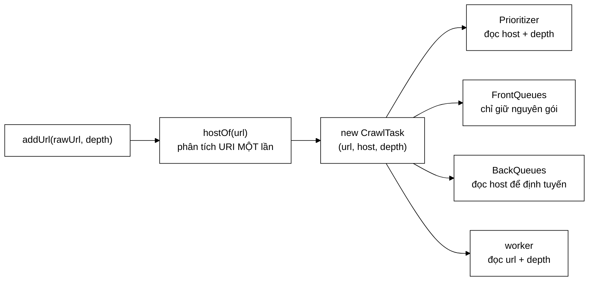

# CrawlTask — ba dòng dữ liệu, nhưng mỗi trường đều phải giành chỗ

**File nguồn:** `search-engine/src/main/java/com/vnsearch/crawler/frontier/CrawlTask.java` (39 dòng)
**Gói:** `com.vnsearch.crawler.frontier` · **Loại:** `record` (Java 16+), bất biến, có kiểm tra ở hàm dựng rút gọn
**Vị trí trong luồng crawl:** đơn vị dữ liệu chảy qua **toàn bộ** frontier — sinh ra ở [`UrlFrontier.addUrl`](./UrlFrontier.md), đi qua [`FrontQueues`](./FrontQueues.md), rồi [`BackQueues`](./BackQueues.md), rồi ra tay worker
**Đọc kèm:** [`UrlFrontier.md`](./UrlFrontier.md) · [`Prioritizer.md`](./Prioritizer.md) · [`BackQueues.md`](./BackQueues.md)

---

## 📌 Hiểu trong 30 giây

`CrawlTask` là **gói hành lý** của một URL trong lúc nó nằm chờ. Nó chỉ có ba
trường — `url`, `host`, `depth` — nhưng cả ba đều được chọn vì có ít nhất hai
nơi khác nhau cần đến, và việc mang sẵn rẻ hơn nhiều so với tính lại.



```
   Ý CHÍNH: PHÂN TÍCH URI MỘT LẦN, DÙNG BỐN LẦN

   Không có CrawlTask (mỗi nơi tự phân tích):
        Prioritizer   URI.create(url).getHost()   ~1,5 µs
        BackQueues    URI.create(url).getHost()   ~1,5 µs
        UrlFrontier   URI.create(url).getHost()   ~1,5 µs
        ───────────────────────────────────────────────
                                        3 lần thừa

   Có CrawlTask:
        addUrl        URI.create(url).getHost()   ~1,5 µs   ← một lần
        ba nơi kia    task.host()                 ~0,001 µs ← đọc trường
```

---

## 1. Vì sao không truyền thẳng chuỗi URL

Một cách làm ngây thơ là để frontier lưu `String url` và mỗi tầng tự lấy phần
mình cần. Nó hỏng theo ba cách khác nhau:

```
   ① CHI PHÍ — URI.create không rẻ
      Nó phân tích cú pháp toàn bộ chuỗi theo RFC 3986, cấp phát
      một đối tượng URI và vài chuỗi con. ~1,5 µs mỗi lần.
      Với 2,4 triệu URL của một phiên crawl đầy đủ, ba lần thừa
      = 7,2 triệu lần gọi ≈ 11 giây CPU thuần tuý vứt đi.

   ② KHÔNG NHẤT QUÁN — mỗi nơi xử lý lỗi một kiểu
      URL méo → URI.create ném. Nếu Prioritizer bắt và trả "unknown",
      còn BackQueues bắt và trả null, thì CÙNG một URL bị hai tầng
      coi là thuộc hai host khác nhau. Lỗi cực khó lần ra.

   ③ MẤT THÔNG TIN — depth không nằm trong chuỗi URL
      Độ sâu BFS không thể suy ra từ URL. Nó BẮT BUỘC phải đi kèm.
      Đã phải mang theo một trường rồi, thì mang thêm host không
      làm thiết kế xấu đi chút nào.
```

Điểm ③ là lập luận quyết định: **cấu trúc gói đã cần tồn tại vì `depth`**, nên
câu hỏi không còn là "có nên tạo record không" mà chỉ là "trong đó nên có gì".

---

## 2. Bản đồ lớp

```
CrawlTask  (record — bất biến, tự có equals/hashCode/toString)
├── url()   : String   ── URL ĐÃ CHUẨN HOÁ (không phải chuỗi thô)
├── host()  : String   ── không bao giờ null; xem mục 2.2
├── depth() : int      ── độ sâu BFS tính từ seed, >= 0
├── hàm dựng rút gọn   ── ba phép kiểm tra bất biến
└── toString()         ── ghi đè: bỏ host cho ngắn log
```

### 2.1 Vì sao là `record` chứ không phải `class`

```java
public record CrawlTask(String url, String host, int depth) { }
```

| Thứ `record` cho miễn phí | Vì sao lớp này cần |
|---|---|
| Mọi trường `final` | Task nằm trong hàng đợi dùng chung giữa nhiều worker; bất biến ⇒ không cần đồng bộ hoá khi đọc |
| `equals`/`hashCode` theo giá trị | Dùng được trực tiếp trong `Set`/`Map` khi viết kiểm thử, không phải tự viết |
| Hàm truy cập ngắn gọn | `task.host()` thay vì `task.getHost()` — đọc trôi hơn ở chỗ gọi dày đặc |
| Không có setter | Không ai lỡ tay đổi `host` sau khi task đã được định tuyến vào hàng đợi của host đó |

Điểm cuối không nhỏ. Nếu `host` đổi được sau khi task đã nằm trong hàng đợi
`b7` của `vnexpress.net`, thì bản đồ host → hàng đợi của [`BackQueues`](./BackQueues.md)
lập tức nói dối, và chính sách lịch sự sụp đổ mà không có lỗi nào được ném.
`record` khiến lỗi đó **không viết ra được**.

### 2.2 `host` không bao giờ `null` — và fallback thông minh

Đây là chi tiết tinh tế nhất của cả file. Ở [`UrlFrontier.addUrl`](./UrlFrontier.md):

```java
String host = hostOf(url);
CrawlTask task = new CrawlTask(url, host != null ? host : url, depth);
//                                  └──────────┬──────────┘
//                        URL không phân tích được → LẤY CHÍNH URL LÀM HOST
```

Có ba phương án cho URL méo, và phương án được chọn là phương án duy nhất đúng:

```
   ── Phương án A: ném exception ────────────────────────────────
      Một URL rác giết cả luồng worker. Web thật đầy URL méo.
      → LOẠI

   ── Phương án B: host = null hoặc host = "unknown" ────────────
      MỌI URL méo dồn vào CÙNG MỘT hàng đợi sau.
      Chúng thuộc hàng trăm host thật khác nhau, nhưng giờ chia
      nhau một khe 1 giây/lượt → nghẽn cổ chai giả tạo.
      Tệ hơn: chính sách lịch sự với host thật bị vi phạm, vì
      hai URL của cùng một host thật nằm ở "unknown" chung với
      URL của host khác, thứ tự phục vụ không còn kiểm soát được.
      → LOẠI

   ── Phương án C: host = chính chuỗi URL ───────────────────────
      Mỗi URL méo thành một "host" riêng ⇒ một hàng đợi riêng.
      An toàn quá mức (một URL một khe) nhưng KHÔNG BAO GIỜ SAI:
      không thể chạm cùng một máy chủ hai lần trong 1 giây, vì
      mỗi URL chỉ được lấy đúng một lần.
      → CHỌN
```

Nguyên tắc rút ra: **khi không biết một URL thuộc host nào, hãy giả định nó
thuộc một host của riêng nó** — đó là giả định bảo thủ nhất, và bảo thủ là
đúng khi hậu quả của sai lầm là bị máy chủ chặn IP.

### 2.3 Hàm dựng rút gọn — ba phép kiểm tra, không phép nào thừa

```java
public CrawlTask {
    if (url == null || url.isBlank())   throw new IllegalArgumentException("url không được rỗng");
    if (host == null || host.isBlank()) throw new IllegalArgumentException("host không được rỗng");
    if (depth < 0)                      throw new IllegalArgumentException("depth phải >= 0, nhận được: " + depth);
}
```

| Phép kiểm | Nếu bỏ đi thì hỏng ở đâu |
|---|---|
| `url` rỗng | Worker gọi `HttpClient.send` với chuỗi rỗng → `IllegalArgumentException` ở sâu trong tầng mạng, stack trace không chỉ ra nguồn gốc |
| `host` rỗng | `BackQueues` băm chuỗi rỗng → mọi task hỏng dồn vào một hàng đợi (chính là phương án B ở trên, quay lại bằng cửa sau) |
| `depth < 0` | `DefaultPrioritizer` nhận `level = -3`, bị `Math.max(0, …)` kẹp về 0 ⇒ **URL rác được xếp ưu tiên CAO NHẤT**. Lỗi im lặng, hậu quả lớn |

Điểm thứ ba minh hoạ một mẫu chung: **phép kẹp (`clamp`) ở tầng dưới che mất
dữ liệu sai của tầng trên**. Kiểm tra tại cửa vào là chỗ duy nhất còn phân biệt
được "âm vì tính sai" với "0 vì đúng là seed".

> 💡 **Vì sao ném chứ không trả `Optional`.** Cả ba điều kiện này là **lỗi lập
> trình**, không phải dữ liệu xấu từ web. URL rỗng không đến từ trang web; nó
> đến từ một chỗ nào đó trong mã gọi sai. Lỗi lập trình thì phải nổ to và sớm.
> Dữ liệu xấu từ web đã bị chặn trước đó bởi [`UrlCanonicalizer`](../UrlCanonicalizer.md)
> và [`UrlFilter`](../UrlFilter.md), vốn đều chọn "trả nguyên văn" thay vì ném.

### 2.4 `toString()` ghi đè — bỏ bớt cho log đọc được

```java
@Override
public String toString() {
    return "CrawlTask{" + url + ", depth=" + depth + "}";
}
```

```
   Mặc định của record:
   CrawlTask[url=https://vnexpress.net/thoi-su/ha-noi-mua-lon-4712345,
             host=vnexpress.net, depth=2]

   Bản ghi đè:
   CrawlTask{https://vnexpress.net/thoi-su/ha-noi-mua-lon-4712345, depth=2}
```

`host` bị bỏ vì nó **luôn là tiền tố của `url`** trong trường hợp bình thường —
in ra là lặp lại. Với 31.030 dòng log của một phiên crawl, chênh lệch này là
thật. Đánh đổi: khi task rơi vào nhánh fallback ở mục 2.2, `host` khác `url` và
log **không** cho biết điều đó. Xem đề xuất 1 ở mục 6.

---

## 3. Hướng dẫn thực hành

### 3.1 Muốn thêm một trường mới — trả lời hai câu trước

Cám dỗ rất lớn: thêm `discoveredAt`, `parentUrl`, `retryCount`, `contentType`…
Mỗi trường thêm vào nhân với **số URL đang chờ**, mà trần là 500.000
(`UrlFrontier.DEFAULT_MAX_SIZE`).

```
   CHI PHÍ BỘ NHỚ CỦA MỘT TRƯỜNG, Ở QUY MÔ TRẦN

   long   (8 byte)   × 500.000 =   4 MB
   String (~48 byte tham chiếu + nội dung)
          giả sử URL cha ~80 ký tự ≈ 200 byte
                            × 500.000 = 100 MB   ← ĐÁNG KỂ
   int    (4 byte)   × 500.000 =   2 MB
```

Hai câu phải trả lời:

1. **Có ít nhất hai nơi cần nó không?** Một nơi cần thì truyền tham số ở chỗ đó,
   đừng nhét vào task. Đây chính là tiêu chí đã cho `host` được vào (ba nơi cần).
2. **Có suy ra được từ trường đã có không?** `depth` không suy ra được từ `url`
   nên nó phải nằm đây; `scheme` thì suy ra được nên không.

Ví dụ đúng — thêm `retryCount` cho cơ chế thử lại:

```java
public record CrawlTask(String url, String host, int depth, int retryCount) {

    public CrawlTask(String url, String host, int depth) {   // hàm dựng gọn cho đường đi thường
        this(url, host, depth, 0);
    }

    public CrawlTask {
        // … ba phép kiểm tra cũ …
        if (retryCount < 0) {
            throw new IllegalArgumentException("retryCount phải >= 0, nhận được: " + retryCount);
        }
    }

    /** Bất biến: trả về BẢN SAO mới, không sửa tại chỗ. */
    public CrawlTask withRetry() {
        return new CrawlTask(url, host, depth, retryCount + 1);
    }
}
```

Chú ý `withRetry()` **tạo đối tượng mới**. Đó là cách duy nhất đúng với một
record, và cũng là cách duy nhất an toàn khi task có thể đang được luồng khác
đọc.

### 3.2 Muốn ưu tiên theo tín hiệu mới — đừng thêm trường

Ví dụ: muốn ưu tiên URL có chứa `/tin-tuc/`. Cám dỗ là thêm `boolean isNews`
vào task. Nhưng [`Prioritizer.levelOf`](./Prioritizer.md) **đã nhận `url`**:

```java
@Override
public int levelOf(String url, String host, int depth, int knownBacklinks) {
    int level = depth;
    if (host != null && host.endsWith(".vn"))        level--;
    if (url.contains("/tin-tuc/"))                   level--;   // ← không cần trường mới
    if (knownBacklinks >= BACKLINK_BOOST_THRESHOLD)  level--;
    return Math.max(0, Math.min(level, levels - 1));
}
```

Nguyên tắc: **tín hiệu tính được từ `url` thì tính ở nơi dùng, đừng lưu.**
Ngoại lệ duy nhất là khi phép tính đắt và lặp lại nhiều lần — đúng trường hợp
của `host`.

### 3.3 Cạm bẫy khi sửa lớp này

| Cạm bẫy | Hậu quả | Cách đúng |
|---|---|---|
| Đổi `record` thành `class` có setter | Đổi `host` sau khi định tuyến ⇒ bản đồ của `BackQueues` sai, chính sách lịch sự vỡ mà không báo lỗi | Giữ bất biến |
| Cho phép `host = null` | Mọi URL méo dồn một hàng đợi ⇒ nghẽn giả tạo | Giữ fallback "host = url" |
| Bỏ kiểm tra `depth >= 0` | Depth âm bị `clamp` về 0 ⇒ URL rác lên ưu tiên cao nhất, im lặng | Giữ kiểm tra |
| Lưu URL **thô** thay vì đã chuẩn hoá | Hai biến thể của cùng một trang thành hai task; tập `enqueued` không chặn được | Chuẩn hoá ở `addUrl` **trước** khi dựng task |
| Thêm trường `String` nặng | 100 MB ở quy mô trần | Trả lời hai câu ở mục 3.1 |
| Ghi đè `equals` để "chỉ so `url`" | `record` dùng `equals` ở nhiều nơi ngầm; so lệch giữa các trường sinh lỗi rất khó tái hiện | Đừng đụng vào `equals` sinh sẵn |

---

## 4. Độ phức tạp & chi phí

| Thao tác | Chi phí |
|---|---|
| Dựng task (3 phép kiểm tra) | $O(1)$ — vài phép so sánh, ~10 ns |
| `url()`, `host()`, `depth()` | $O(1)$ — đọc trường, gần như miễn phí |
| `equals`/`hashCode` sinh sẵn | $O(L)$ với $L$ = độ dài URL (do so chuỗi) |
| `toString()` | $O(L)$ — chỉ gọi khi ghi log |

Bộ nhớ mỗi task trên JVM 64-bit có nén con trỏ:

```
   header đối tượng            16 byte
   tham chiếu url               4 byte
   tham chiếu host              4 byte
   int depth                    4 byte
   đệm căn hàng                 4 byte
   ────────────────────────────────────
   BẢN THÂN task               32 byte

   Chuỗi url (~80 ký tự, Latin1)  ~96 byte   ← chiếm phần lớn
   Chuỗi host                       0 byte   ← DÙNG CHUNG, xem dưới
```

**Chuỗi `host` gần như miễn phí.** `URI.getHost()` trả về một `String` mới,
nhưng các task cùng host trỏ tới **các đối tượng khác nhau có cùng nội dung**.
Với 500.000 task trên ~2.000 host, đó là ~498.000 chuỗi trùng lặp ≈ 20 MB có
thể tiết kiệm bằng `String.intern()` hoặc một bảng `HashMap<String,String>`
tự quản. Xem đề xuất 2 ở mục 6.

```
   Ở QUY MÔ TRẦN 500.000 URL ĐANG CHỜ
   task           500.000 × 32 byte  =  16 MB
   chuỗi url      500.000 × 96 byte  =  48 MB
   chuỗi host     500.000 ×  ~40 byte = 20 MB   ← gần như toàn bộ là trùng lặp
   ──────────────────────────────────────────
   TỔNG                              ≈  84 MB

   Cộng thêm tập `enqueued` (HashSet<String>) tham chiếu CÙNG các
   chuỗi url đó — nó không nhân đôi nội dung, chỉ thêm ~32 byte/mục
   cho cấu trúc bảng băm ⇒ +16 MB.
```

Con số ~100 MB này là lý do `DEFAULT_MAX_SIZE` tồn tại và là lý do nó bằng
500.000 chứ không phải vô hạn.

---

## 5. Kiểm thử liên quan

| Test | Bảo vệ điều gì |
|---|---|
| `test/java/com/vnsearch/crawler/frontier/UrlFrontierTest.java` | Task được dựng đúng ở `addUrl`, kể cả với URL méo (nhánh fallback host) |
| `test/java/com/vnsearch/crawler/frontier/FrontQueuesTest.java` | Task giữ nguyên thứ tự FIFO trong một mức |
| `test/java/com/vnsearch/crawler/frontier/BackQueuesTest.java` | Task được định tuyến theo `host()` |

Không có `CrawlTaskTest.java` riêng. Với 39 dòng thì có thể chấp nhận, nhưng ba
phép kiểm tra bất biến hiện **không có test nào canh giữ trực tiếp**:

```java
@Test
void tuChoiDuLieuKhongHopLe() {
    assertThrows(IllegalArgumentException.class, () -> new CrawlTask(null, "a.vn", 0));
    assertThrows(IllegalArgumentException.class, () -> new CrawlTask("", "a.vn", 0));
    assertThrows(IllegalArgumentException.class, () -> new CrawlTask("  ", "a.vn", 0));
    assertThrows(IllegalArgumentException.class, () -> new CrawlTask("https://a.vn", null, 0));
    assertThrows(IllegalArgumentException.class, () -> new CrawlTask("https://a.vn", "", 0));
    assertThrows(IllegalArgumentException.class, () -> new CrawlTask("https://a.vn", "a.vn", -1));
}

@Test
void haiTaskCungNoiDungThiBangNhau() {
    CrawlTask a = new CrawlTask("https://a.vn/x", "a.vn", 2);
    CrawlTask b = new CrawlTask("https://a.vn/x", "a.vn", 2);
    assertEquals(a, b);
    assertEquals(a.hashCode(), b.hashCode());
}
```

```powershell
cd search-engine
.\mvnw.cmd -q -Dtest='UrlFrontierTest' test
```

---

## 6. Chấm theo chuẩn doanh nghiệp

| Tiêu chí | Điểm | Nhận xét |
|---|---|---|
| Chọn đúng cấu trúc ngôn ngữ | 10/10 | `record` cho một giá trị bất biến là lựa chọn chính xác; bất biến được ép ở mức ngôn ngữ chứ không bằng kỷ luật |
| Kỷ luật về phạm vi | 10/10 | Đúng ba trường, mỗi trường có ≥ 2 nơi dùng; không có trường "để đó phòng khi" |
| Bất biến & kiểm tra đầu vào | 9/10 | Ba phép kiểm tra bao đủ; thông điệp lỗi có kèm giá trị nhận được |
| An toàn đa luồng | 10/10 | Bất biến ⇒ chia sẻ tự do giữa worker, không cần đồng bộ hoá |
| Hiệu quả bộ nhớ | 7/10 | 32 byte/task là tốt, nhưng ~20 MB chuỗi `host` trùng lặp chưa được thu hồi |
| Khả năng quan sát | 7/10 | `toString` gọn nhưng giấu `host`, nên nhánh fallback vô hình trong log |
| Khả năng kiểm thử | 6/10 | Không có test riêng; ba phép kiểm tra bất biến không được canh giữ trực tiếp |

**Ba đề xuất nâng lên mức sản phẩm:**

1. **Cho `toString` hiện `host` khi nó khác tiền tố của `url`.** Nhánh fallback
   ở mục 2.2 hiện hoàn toàn vô hình trong log — mà đó chính là nhánh cần nhìn
   thấy nhất khi đi tìm nguyên nhân một phiên crawl chậm bất thường:
   ```java
   @Override
   public String toString() {
       boolean hostBatThuong = !url.contains(host);
       return "CrawlTask{" + url + ", depth=" + depth
               + (hostBatThuong ? ", host=" + host : "") + "}";
   }
   ```
2. **Dùng chung chuỗi `host`.** ~2.000 host thật nhưng 500.000 chuỗi — một
   `ConcurrentHashMap<String,String>` làm bảng nội trú trong `UrlFrontier.hostOf`
   thu hồi ~20 MB với một dòng. Không dùng `String.intern()` của JVM vì nó nằm
   trong vùng nhớ khó thu hồi và có chi phí khoá toàn cục.
3. **Thêm `CrawlTaskTest.java`.** Ba phép kiểm tra bất biến là hàng rào bảo vệ
   cho ba lỗi im lặng ở mục 2.3; hàng rào không có test là hàng rào có thể bị
   ai đó gỡ đi trong một lần refactor mà CI không kêu.

---

## 7. Liên kết

- Nơi task được sinh ra: [`UrlFrontier.md`](./UrlFrontier.md) mục `addUrl`
- Nơi `depth` + `host` được đọc để xếp mức: [`Prioritizer.md`](./Prioritizer.md) · [`DefaultPrioritizer.md`](./DefaultPrioritizer.md)
- Nơi task nằm chờ theo mức: [`FrontQueues.md`](./FrontQueues.md)
- Nơi `host` quyết định hàng đợi: [`BackQueues.md`](./BackQueues.md)
- Nơi `url` được chuẩn hoá trước khi vào task: [`../UrlCanonicalizer.md`](../UrlCanonicalizer.md)
- Tổng quan luồng crawl: `docs/ARCHITECTURE.md`
