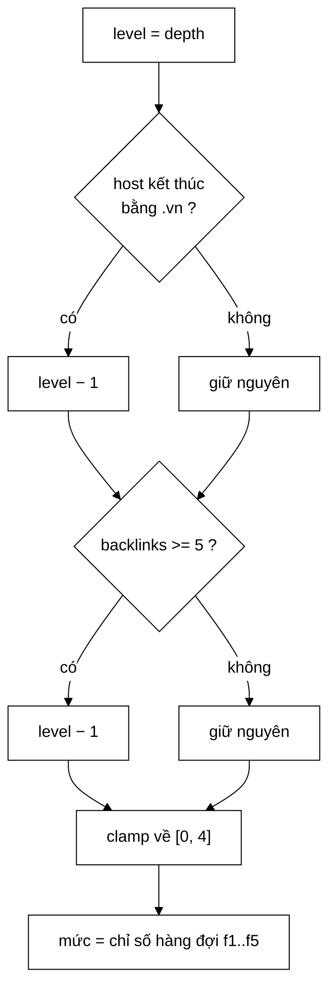

# DefaultPrioritizer — vì sao "mỗi tín hiệu đúng một bậc" đánh bại điểm số có trọng số

**File nguồn:** `search-engine/src/main/java/com/vnsearch/crawler/frontier/DefaultPrioritizer.java` (79 dòng)
**Gói:** `com.vnsearch.crawler.frontier` · **Loại:** lớp `final`, bất biến, không trạng thái — cài đặt [`Prioritizer`](./Prioritizer.md)
**Vị trí trong luồng crawl:** chính sách mặc định của [`UrlFrontier`](./UrlFrontier.md), chạy một lần cho mỗi URL tại cửa vào
**Đọc kèm:** [`Prioritizer.md`](./Prioritizer.md) · [`FrontQueues.md`](./FrontQueues.md) · [`WeightedRandomSelector.md`](./WeightedRandomSelector.md)

---

## 📌 Hiểu trong 30 giây

Toàn bộ chính sách gói trong bốn dòng:

```java
int level = depth;                                        // ① gốc là độ sâu BFS
if (host != null && host.endsWith(".vn"))      level--;   // ② nâng MỘT bậc
if (knownBacklinks >= BACKLINK_BOOST_THRESHOLD) level--;  // ③ nâng MỘT bậc
return Math.max(0, Math.min(level, levels - 1));          // ④ kẹp vào [0, levels)
```

Điều đáng nói không phải là nó làm gì, mà là **nó từ chối làm gì**: mỗi tín
hiệu phụ chỉ đáng đúng một bậc, nên chúng không bao giờ lật ngược được trật tự
theo bề rộng.



```
   BẢNG TRA NHANH — 5 mức, ngưỡng backlink = 5

   depth  host    backlinks   →  MỨC     hàng đợi
   ─────  ──────  ─────────      ────    ────────
     0    .com        0          0        f1     ← seed
     0    .vn        50          0        f1     ← đã cao nhất, không lên nữa
     1    .vn         0          0        f1
     1    .com        0          1        f2
     1    .com       40          0        f1
     2    .vn        50          0        f1     ← cả hai tín hiệu cộng dồn
     4    .vn        50          2        f3
     4    .com        0          4        f5     ← CHÊNH ĐÚNG 2 BẬC
     9    .com        0          4        f5     ← kẹp
    99    .com        0          4        f5     ← kẹp
```

---

## 1. Vấn đề: bản trước dùng điểm số, và nó hỏng

Javadoc dòng 22–27 mô tả cách làm cũ và lý do bỏ:

```java
// BẢN CŨ — cộng trọng số double
score = -2 * depth + 0,5 * backlinks + 5
```

```
   BA VẤN ĐỀ CỦA CÔNG THỨC ĐIỂM SỐ

   ① BA HẰNG SỐ MA THUẬT
      Vì sao −2 mà không phải −3? Vì sao 0,5? Vì sao +5?
      Không ai trả lời được, kể cả người viết ra nó sáu tháng sau.
      Chúng không đến từ một phép đo nào — chúng đến từ việc
      chỉnh tay tới khi kết quả "trông có vẻ hợp lý".

   ② BACKLINK LẤN ÁT HOÀN TOÀN ĐỘ SÂU
      Trang sâu 12 lớp, 50 backlink:  −2(12) + 0,5(50) + 5 = 6
      Seed (sâu 0, 0 backlink):       −2(0)  + 0,5(0)  + 5 = 5
                                                        ────
      ⇒ TRANG SÂU 12 LỚP XẾP TRÊN SEED.
        Crawler không còn là BFS nữa, nó là thứ gì đó không tên.

   ③ ĐIỂM SỐ BẮT BUỘC PHẢI CÓ HEAP
      double thì phải so sánh → min-heap → O(log n) mỗi thao tác,
      và thứ tự trong cùng một điểm số phụ thuộc cách heap xoay
      ⇒ phiên crawl KHÔNG lặp lại được.
```

Vấn đề ② là vấn đề chết người, vì nó **không lộ ra trong test nhỏ**. Với 100
URL thì backlink chưa đủ lớn để lấn át; với 31.030 trang thật thì trang chủ của
một báo lớn có hàng nghìn backlink và chiếm hết mọi khe ưu tiên.

### 1.1 Vì sao "phép cộng bậc" chữa được cả ba

| Vấn đề cũ | Cách bậc chữa |
|---|---|
| ① Ba hằng số ma thuật | Còn đúng **một** hằng số cần giải thích: ngưỡng backlink = 5. Trọng số của mỗi tín hiệu bị cố định ở "một bậc" — không có gì để chỉnh tay |
| ② Lấn át | **Giới hạn nằm trong định nghĩa**: hai tín hiệu ⇒ tối đa 2 bậc, không bao giờ hơn. Không phụ thuộc dữ liệu |
| ③ Cần heap | Số nguyên nhỏ ⇒ dùng làm chỉ mục mảng ⇒ $O(1)$ thêm, FIFO thuần trong mỗi mức, lặp lại được |

Ràng buộc ② được test canh giữ trực tiếp — đây là test hay nhất trong file test:

```java
@Test
void sideSignalsCannotOverturnDepthByMoreThanTwoLevels() {
    int best  = prioritizer.levelOf("https://a.vn/x",  "a.vn",  4, 50);   // mọi tín hiệu tốt
    int plain = prioritizer.levelOf("https://a.com/x", "a.com", 4,  0);   // không tín hiệu nào
    assertEquals(2, plain - best);          // ĐÚNG 2, không hơn không kém
}
```

Nó biến một **quyết định thiết kế** thành một **ràng buộc do CI canh giữ**. Ai
thêm một tín hiệu nâng hai bậc sẽ làm test này đỏ ngay.

---

## 2. Bản đồ lớp

```
DefaultPrioritizer  (final, implements Prioritizer)
├── DEFAULT_LEVELS = 5              ── hằng số công khai
├── BACKLINK_BOOST_THRESHOLD = 5    ── hằng số công khai
├── levels : int (final)            ── trạng thái DUY NHẤT, đặt ở hàm dựng
├── DefaultPrioritizer()            ── dùng 5 mức
├── DefaultPrioritizer(int levels)  ── tuỳ chỉnh, kiểm tra > 0
├── levels()                        ── trả về hằng số ⇒ giữ ràng buộc của giao diện
├── levelOf(...)                    ── bốn dòng ở đầu tài liệu
└── main(String[])                  ── demo in bảng minh hoạ cho báo cáo
```

### 2.1 Vì sao `depth` làm gốc chứ không phải một tín hiệu ngang hàng

```
   ĐỘ SÂU BFS LÀ THƯỚC ĐO SẴN CÓ VỀ TẦM QUAN TRỌNG

   depth 0  →  trang chủ báo               ← quan trọng nhất
   depth 1  →  trang chuyên mục (/thoi-su/)
   depth 2  →  bài viết trong chuyên mục
   depth 3  →  bài liên quan, tag
   depth 4+ →  lưu trữ, phân trang sâu, tag của tag
                                            ← hầu như vô giá trị

   Tương quan này KHÔNG hoàn hảo, nhưng nó MIỄN PHÍ (crawler đã
   biết depth) và nó ĐÚNG PHẦN LỚN thời gian. Hai tín hiệu còn
   lại chỉ để sửa những trường hợp nó sai.
```

Đặt `depth` làm gốc còn có một hệ quả quan trọng: **crawler vẫn là BFS**. Điều
đó bảo toàn tính chất "mẫu web thu được không thiên lệch theo một domain cụ
thể" — tính chất cần thiết khi dùng dữ liệu để đo thống kê trong báo cáo.

### 2.2 Hai tín hiệu phụ — mỗi cái một dòng, mỗi cái một bậc

```java
if (host != null && host.endsWith(".vn"))       level--;
if (knownBacklinks >= BACKLINK_BOOST_THRESHOLD) level--;
```

| Tín hiệu | Lý do | Điểm yếu đã biết |
|---|---|---|
| Đuôi `.vn` | Yêu cầu đề bài: máy tìm kiếm cho web tiếng Việt | **Bỏ sót rất nhiều**: `vnexpress.net`, `tuoitre.vn` ✓ nhưng `thanhnien.vn` ✓ còn `zingnews.vn` ✓ — vấn đề là các báo lớn dùng `.com`/`.net` cũng nhiều. Xem đề xuất 1 |
| `backlinks >= 5` | Nhiều nơi trỏ tới ⇒ nhiều khả năng là trang trung tâm | **Ngưỡng cứng**: 5 và 5.000 backlink được đối xử y hệt. Đó là chủ ý (chống lấn át) nhưng làm mất thông tin |

Kiểm tra `host != null` ở dòng đầu là **phòng thủ thừa** so với hợp đồng hiện
tại: [`CrawlTask`](./CrawlTask.md) đã bảo đảm `host` không bao giờ `null`. Nhưng
giao diện [`Prioritizer`](./Prioritizer.md) không ép được điều đó với người gọi
khác, nên giữ lại là hợp lý — chi phí một phép so sánh con trỏ.

### 2.3 Phép kẹp hai đầu — mỗi đầu chặn một lỗi khác nhau

```java
return Math.max(0, Math.min(level, levels - 1));
//        └─┬─┘        └─┬─┘
//     cận DƯỚI       cận TRÊN
```

```
   CẬN TRÊN  (Math.min)
   depth 99  →  level 99  →  queues.get(99) trên mảng 5 phần tử
                             ⇒ IndexOutOfBounds / IllegalArgumentException
   Xảy ra thường xuyên: web có bẫy vòng lặp (calendar, phân trang vô hạn)
   sinh URL sâu hàng chục lớp.

   CẬN DƯỚI  (Math.max)
   depth 0, host .vn, 50 backlink  →  0 − 1 − 1 = −2
                                      ⇒ queues.get(−2) ⇒ nổ
   Xảy ra với MỌI seed .vn có backlink — tức là gần như mọi seed.
```

Cả hai đều không phải trường hợp hiếm. Test `everyLevelIsWithinRange` quét
20 × 4 × 2 = 160 tổ hợp để canh giữ chính xác điều này.

### 2.4 `DEFAULT_LEVELS = 5` — và vì sao thêm mức không giúp gì

Javadoc dòng 33 ghi *"Năm mức là đủ: crawl thực tế hiếm khi vượt quá độ sâu
3–4."* Nhưng lý do sâu hơn nằm ở [`WeightedRandomSelector`](./WeightedRandomSelector.md):
trọng số giảm theo luỹ thừa 2.

| Số mức | P(mức 0) | P(mức cuối) | Kết luận |
|---|---|---|---|
| 3 | 57,1% | 14,3% | Phân biệt quá thô |
| **5** | **51,6%** | **3,2%** | **1 trên 31 lượt cho mức thấp nhất — vẫn sống** |
| 8 | 50,2% | 0,39% | Mức cuối gần như bị bỏ đói |
| 12 | 50,0% | 0,024% | Mức cuối thực tế chết |

```
   NGHỊCH LÝ: thêm mức KHÔNG làm mức cao được ưu ái hơn
              (nó đã ~50% từ 3 mức trở đi rồi)

              thêm mức CHỈ làm đuôi phân bố chết nhanh hơn

   ⇒ 5 mức không phải là "đủ tạm bợ". Nó là điểm cân bằng thật
     giữa độ phân giải và việc không bỏ đói.
```

### 2.5 `BACKLINK_BOOST_THRESHOLD = 5` — hằng số duy nhất còn phải biện minh

Đây là chỗ yếu nhất về mặt số liệu của cả lớp. So sánh với các hằng số khác
trong dự án:

```
   CÓ SỐ LIỆU HẬU THUẪN:
   UrlCanonicalizer  "23 cặp trùng trên 5.011 trang"      ← đo được
   UrlSeenFilter     "78,8 liên kết/trang"                ← đo được
   UrlFrontier       "128 hàng đợi = 128 trang/giây"      ← suy ra được

   CHƯA CÓ SỐ LIỆU:
   BACKLINK_BOOST_THRESHOLD = 5                           ← từ đâu ra?
```

Nó có thể đúng, nhưng hiện chưa có gì chứng minh. Xem đề xuất 2 ở mục 6.

### 2.6 Hàm `main` — demo cho báo cáo

```java
public static void main(String[] args) {
    DefaultPrioritizer prioritizer = new DefaultPrioritizer();
    System.out.println("Số mức ưu tiên: " + prioritizer.levels() + " (0 = cao nhất)");
    System.out.println("seed .vn        : " + prioritizer.levelOf("https://a.vn", "a.vn", 0, 10));
    ...
}
```

Chạy nó:

```powershell
cd search-engine
.\mvnw.cmd -q compile
java -cp target/classes com.vnsearch.crawler.frontier.DefaultPrioritizer
```

```
Số mức ưu tiên: 5 (0 = cao nhất)
seed .vn        : 0
sâu 1, .vn      : 0
sâu 1, .com     : 1
sâu 1, backlink : 0
sâu 9           : 4
```

Đây là mẫu lặp lại trong dự án (xem cả [`WeightedRandomSelector`](./WeightedRandomSelector.md)):
một `main` nhỏ để **chụp màn hình đưa vào báo cáo**. Nó không thay thế test —
nó phục vụ một mục đích khác: cho người đọc báo cáo thấy hành vi mà không cần
biết đọc mã.

---

## 3. Hướng dẫn thực hành

### 3.1 Muốn thêm một tín hiệu ưu tiên — một dòng, và một quy tắc

Quy tắc: **`level--`, không bao giờ `level -= 2`.**

```java
@Override
public int levelOf(String url, String host, int depth, int knownBacklinks) {
    int level = depth;
    if (host != null && host.endsWith(".vn"))       level--;
    if (knownBacklinks >= BACKLINK_BOOST_THRESHOLD) level--;
    if (url.contains("/tin-tuc/"))                  level--;   // ← tín hiệu MỚI
    return Math.max(0, Math.min(level, levels - 1));
}
```

Nhưng phải sửa test ràng buộc theo, vì "tối đa 2 bậc" thành "tối đa 3 bậc":

```java
@Test
void sideSignalsCannotOverturnDepthByMoreThanThreeLevels() {
    int best  = prioritizer.levelOf("https://a.vn/tin-tuc/x", "a.vn",  4, 50);
    int plain = prioritizer.levelOf("https://a.com/x",        "a.com", 4,  0);
    assertEquals(3, plain - best);
}
```

Việc phải sửa test là **tính năng, không phải phiền toái**: nó buộc người sửa
phải nhìn thẳng vào câu hỏi *"tôi có chấp nhận cho tín hiệu phụ lật 3 bậc
không?"*. Với 5 mức, 3 bậc là **quá nhiều** — một trang sâu 3 lớp sẽ ngang hàng
với seed.

```
   SỐ TÍN HIỆU AN TOÀN THEO SỐ MỨC

   levels = 5  →  tối đa 2 tín hiệu   (lật 2/4 = 50% dải)
   levels = 8  →  tối đa 3 tín hiệu   nhưng mức cuối đã bị bỏ đói
   ⇒ Muốn nhiều tín hiệu hơn thì KHÔNG phải thêm mức,
     mà phải nhóm tín hiệu lại thành một bậc chung:

   int tinHieuTot = 0;
   if (host.endsWith(".vn"))        tinHieuTot++;
   if (url.contains("/tin-tuc/"))   tinHieuTot++;
   if (url.contains("/thoi-su/"))   tinHieuTot++;
   if (tinHieuTot >= 2) level--;    // ba tín hiệu, VẪN chỉ một bậc
```

### 3.2 Muốn chạy A/B hai chính sách ưu tiên

```java
// Phiên A — chính sách hiện tại
UrlFrontier frontierA = new UrlFrontier(
        500_000, new DefaultPrioritizer(), new StrictPrioritySelector(), 128);

// Phiên B — ngưỡng backlink chặt hơn (giả sử đã thêm hàm dựng nhận ngưỡng)
UrlFrontier frontierB = new UrlFrontier(
        500_000, new DefaultPrioritizer(), new StrictPrioritySelector(), 128);
```

Chú ý dùng [`StrictPrioritySelector`](./StrictPrioritySelector.md) chứ không
phải `WeightedRandomSelector`: so sánh hai chính sách **ưu tiên** thì phải khử
biến ngẫu nhiên ở tầng **chọn**, nếu không chênh lệch đo được có thể chỉ là
nhiễu của bộ sinh số ngẫu nhiên.

### 3.3 Cạm bẫy khi sửa lớp này

| Cạm bẫy | Hậu quả | Cách đúng |
|---|---|---|
| `level -= 2` cho một tín hiệu "quan trọng hơn" | Quay lại đúng vấn đề ② của bản điểm số, chỉ chậm hơn | Một tín hiệu một bậc; muốn mạnh hơn thì nhóm lại (mục 3.1) |
| Bỏ `Math.max(0, …)` | Seed `.vn` có backlink → mức −2 → nổ | Giữ cả hai đầu kẹp |
| Bỏ `Math.min(…, levels-1)` | Bẫy vòng lặp trên web sinh depth 50 → nổ | Giữ cả hai đầu kẹp |
| Tăng `DEFAULT_LEVELS` để "phân biệt tinh hơn" | Mức cuối bị bỏ đói theo luỹ thừa 2 (mục 2.4) | Đổi công thức trọng số của bộ chọn trước, rồi mới tăng mức |
| Thêm trạng thái (bộ đếm, cache) | `levelOf` chạy **ngoài** khối khoá của `UrlFrontier` ⇒ hỏng im lặng, phiên không lặp lại được | Giữ thuần và bất biến |
| Tra cứu ngoài (DB, HTTP) trong `levelOf` | 2,4 triệu lần gọi × 1 ms = 40 phút | Nạp sẵn vào `Map` ở hàm dựng |
| Dùng `host.contains(".vn")` thay `endsWith` | `a.vn.evil.com` được nâng bậc | Giữ `endsWith` |

Dòng cuối là một lỗ hổng thật: `contains` cho phép bất kỳ ai đăng ký
`vnexpress.vn.spam.com` để được ưu tiên. `endsWith` chặn đứng.

---

## 4. Độ phức tạp & chi phí

| Bước | Chi phí |
|---|---|
| Gán `level = depth` | ~1 ns |
| `host.endsWith(".vn")` | ~20 ns — chỉ so 3 ký tự cuối, không quét cả chuỗi |
| So sánh `knownBacklinks >= 5` | ~1 ns |
| `Math.max` + `Math.min` | ~2 ns, thường được JIT gộp thành lệnh `cmov` |
| **Tổng** | **$O(1)$ ≈ 25 ns, không cấp phát** |

```
   ĐẶT VÀO BỐI CẢNH MỘT PHIÊN CRAWL ĐẦY ĐỦ

   2,4 triệu lần gọi × 25 ns  =  0,06 giây
   Thời gian phiên crawl      ≈  8.600 giây (31.030 trang, 128 trang/giây trần)
   ─────────────────────────────────────────
   Tỉ lệ                      =  0,0007%

   ⇒ Chính sách ưu tiên MIỄN PHÍ. Không có lý do gì để đơn giản
     hoá nó vì lo hiệu năng — mọi lo lắng nên dồn vào việc nó
     xếp ĐÚNG hay không.
```

**Không cấp phát gì cả** là điểm đáng chú ý: `endsWith` không tạo chuỗi con,
`Math.max/min` là lệnh nguyên thuỷ. Với 2,4 triệu lần gọi, một `substring` vô ý
sẽ tạo 2,4 triệu đối tượng rác — đủ để làm bộ thu gom rác chạy thêm vài lượt.

---

## 5. Kiểm thử liên quan

`test/java/com/vnsearch/crawler/frontier/DefaultPrioritizerTest.java` (78 dòng,
8 ca) — đây là một trong những file test tốt nhất của dự án:

| Ca kiểm thử | Bảo vệ điều gì |
|---|---|
| `rejectsNonPositiveLevels` | Hàm dựng từ chối `0` và `-1` |
| `depthIsTheStartingPoint` | Không có tín hiệu nào ⇒ mức = độ sâu |
| `vnDomainMovesUpOneLevel` | Tín hiệu `.vn` nâng **đúng một** bậc |
| `manyBacklinksMoveUpOneLevel` | Kiểm tra **cả hai phía ngưỡng**: `threshold-1` và `threshold` |
| `bothSignalsStackButAreClampedAtZero` | Hai tín hiệu cộng dồn; kẹp cận dưới |
| `deepUrlsAreClampedToTheLowestLevel` | Kẹp cận trên với `depth = 99` |
| `sideSignalsCannotOverturnDepthByMoreThanTwoLevels` | **Ràng buộc thiết kế cốt lõi** — xem mục 1.1 |
| `everyLevelIsWithinRange` | Quét 160 tổ hợp, khẳng định miền giá trị |

```powershell
cd search-engine
.\mvnw.cmd -q -Dtest='DefaultPrioritizerTest' test
```

Hai điểm mạnh đáng học từ file test này:

```
   ① TEST CẢ HAI PHÍA NGƯỠNG
      threshold - 1  →  KHÔNG nâng
      threshold      →  CÓ nâng
      Đây là cách duy nhất phát hiện lỗi ">" vs ">=" — lỗi lệch
      một đơn vị kinh điển, và cũng là lỗi khó thấy nhất khi đọc.

   ② TEST BẢO VỆ MỘT QUYẾT ĐỊNH THIẾT KẾ, KHÔNG CHỈ MỘT HÀNH VI
      sideSignalsCannotOverturnDepthByMoreThanTwoLevels có Javadoc
      giải thích VÌ SAO. Nó biến một đoạn văn trong tài liệu thiết
      kế thành một hàng rào mà CI canh giữ.
```

Ca còn thiếu: **`host == null`**. Nhánh `host != null` ở dòng 60 hiện không có
test nào đi qua với `host` là `null`.

```java
@Test
void hostNullKhongLamNo() {
    assertEquals(2, prioritizer.levelOf("https://a.vn/x", null, 2, 0));
}
```

---

## 6. Chấm theo chuẩn doanh nghiệp

| Tiêu chí | Điểm | Nhận xét |
|---|---|---|
| Chất lượng quyết định thiết kế | 10/10 | Bỏ điểm số có trọng số để lấy phép cộng bậc là quyết định đúng, và **lý do được ghi lại đầy đủ** trong Javadoc |
| Kỷ luật chống hằng số ma thuật | 9/10 | Từ ba hằng số xuống một; hằng số còn lại được đặt tên và `public` |
| Xử lý biên | 10/10 | Kẹp hai đầu, mỗi đầu chặn một lỗi có thật và thường gặp |
| Đơn giản | 10/10 | Bốn dòng logic; đọc một lần là hiểu hết |
| Hiệu năng | 10/10 | $O(1)$, ~25 ns, không cấp phát, thuần ⇒ an toàn đa luồng miễn phí |
| Khả năng kiểm thử | 9/10 | 8 ca bao gần đủ; thiếu ca `host == null` |
| Chứng minh bằng số liệu | 5/10 | `BACKLINK_BOOST_THRESHOLD = 5` chưa có phép đo nào hậu thuẫn |
| Chất lượng tín hiệu | 6/10 | Chỉ hai tín hiệu, cả hai đều thô; `.vn` bỏ sót các báo lớn dùng `.com`/`.net` |

**Ba đề xuất nâng lên mức sản phẩm:**

1. **Thay tín hiệu `.vn` bằng một danh sách miền tiếng Việt đã biết.**
   `vnexpress.net`, `dantri.com.vn`, `tuoitre.vn`, `24h.com.vn` — chỉ một nửa
   khớp `.endsWith(".vn")`. Với một máy tìm kiếm nhắm vào web tiếng Việt, đây
   là thiếu sót ảnh hưởng trực tiếp đến chất lượng kho dữ liệu:
   ```java
   private static final Set<String> MIEN_VIET = Set.of(
           "vnexpress.net", "dantri.com.vn", "tuoitre.vn", "thanhnien.vn", "24h.com.vn");

   boolean laMienViet = host != null
           && (host.endsWith(".vn") || MIEN_VIET.contains(host));
   ```
   Danh sách nên nạp từ tệp cấu hình, dùng chung với [`UrlFilter`](../UrlFilter.md)
   để tránh hai nguồn sự thật.
2. **Đo và ghi lại lý do cho `BACKLINK_BOOST_THRESHOLD = 5`.** Chạy một phiên
   crawl, vẽ histogram số backlink, chọn ngưỡng ở một phân vị có ý nghĩa (ví dụ
   phân vị 90), rồi ghi con số đo được vào Javadoc — đúng cách mà
   [`UrlCanonicalizer`](../UrlCanonicalizer.md) đã làm với "23 cặp trùng". Đây
   là hằng số cuối cùng của lớp chưa được biện minh bằng số.
3. **Thêm ca test `host == null`** (mục 5). Nhánh phòng thủ ở dòng 60 hiện là
   mã chết theo góc nhìn của bộ test — không ai biết nó còn chạy đúng hay không.

---

## 7. Liên kết

- Hợp đồng mà lớp này cài đặt: [`Prioritizer.md`](./Prioritizer.md)
- Nơi mức trả về thành chỉ mục hàng đợi: [`FrontQueues.md`](./FrontQueues.md)
- Vì sao 5 mức chứ không phải 12: [`WeightedRandomSelector.md`](./WeightedRandomSelector.md)
- Bộ chọn tất định dùng khi so sánh hai chính sách: [`StrictPrioritySelector.md`](./StrictPrioritySelector.md)
- Nơi `levelOf` được gọi (ngoài khối khoá): [`UrlFrontier.md`](./UrlFrontier.md)
- Nguồn dữ liệu `host` và `depth`: [`CrawlTask.md`](./CrawlTask.md)
- Nơi nên đặt danh sách miền tiếng Việt dùng chung: [`../UrlFilter.md`](../UrlFilter.md)
