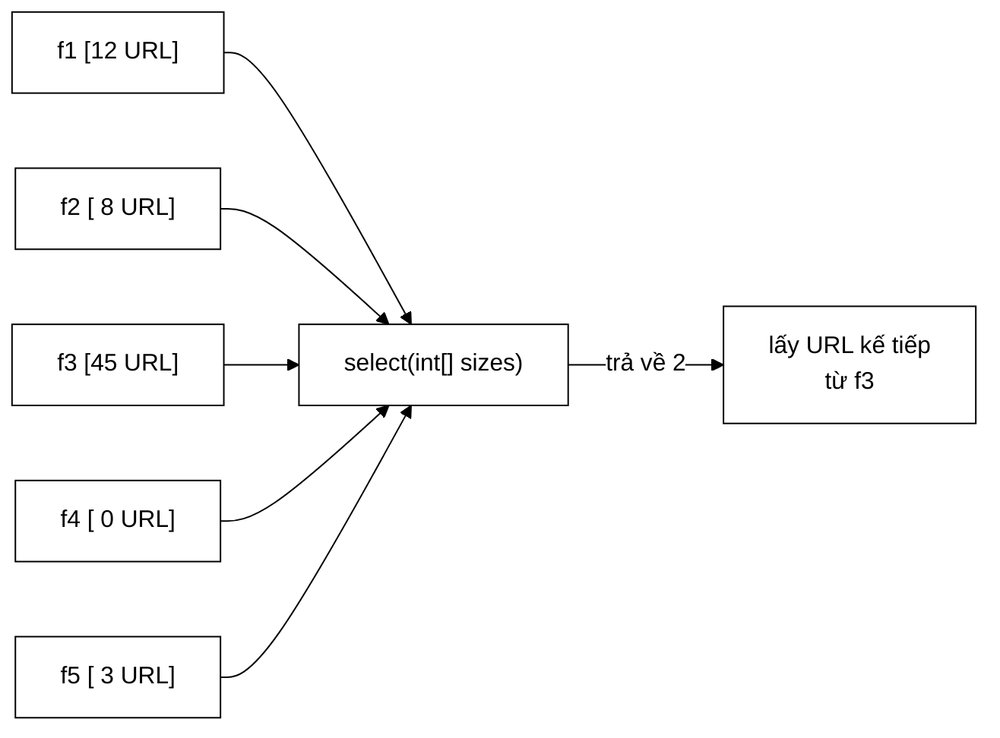

# FrontQueueSelector — trục xoay giữa "tôn trọng ưu tiên" và "không bỏ đói"

**File nguồn:** `search-engine/src/main/java/com/vnsearch/crawler/frontier/FrontQueueSelector.java` (30 dòng)
**Gói:** `com.vnsearch.crawler.frontier` · **Loại:** `@FunctionalInterface` — một phương thức duy nhất, Strategy pattern
**Vị trí trong luồng crawl:** khối **"Front queue selector"** trong sơ đồ URL Frontier — đứng ở **đầu ra** của tầng trước, ngay trước [`BackQueues`](./BackQueues.md)
**Cài đặt hiện có:** [`WeightedRandomSelector`](./WeightedRandomSelector.md) (mặc định) · [`StrictPrioritySelector`](./StrictPrioritySelector.md)
**Đọc kèm:** [`FrontQueues.md`](./FrontQueues.md) · [`Prioritizer.md`](./Prioritizer.md)

---

## 📌 Hiểu trong 30 giây

[`Prioritizer`](./Prioritizer.md) quyết định URL **vào** hàng đợi nào.
`FrontQueueSelector` quyết định lấy URL **ra** từ hàng đợi nào. Hai câu hỏi
khác nhau, và câu thứ hai khó hơn nhiều.



```
   HỢP ĐỒNG — TOÀN BỘ GIAO DIỆN LÀ MỘT DÒNG

   int select(int[] queueSizes)

   VÀO:  mảng số phần tử từng hàng đợi, chỉ số 0 = ưu tiên cao nhất
         KHÔNG ĐƯỢC SỬA mảng này
   RA:   chỉ số hàng đợi được chọn — hàng đợi đó PHẢI còn phần tử
         hoặc −1 nếu mọi hàng đợi đều rỗng
```

---

## 1. Vấn đề: bỏ đói

Cách chọn hiển nhiên nhất — *"luôn lấy mức cao nhất còn URL"* — hỏng trên web
thật, và hỏng theo cách mà một phiên crawl thử nghiệm nhỏ không bao giờ lộ ra.

```
   VÌ SAO MỨC CAO KHÔNG BAO GIỜ CẠN

   Mỗi trang crawl được sinh ~78,8 liên kết ra (số đo ở UrlSeenFilter).
   Phần lớn liên kết trên một trang tin trỏ tới:
        ├─ trang chủ            → depth thấp
        ├─ các chuyên mục       → depth thấp
        └─ bài liên quan        → depth thấp

   ⇒ Lấy 1 URL từ mức 0  ⟶  đẩy VÀO mức 0 hàng chục URL mới

   Mức 0 là một cái giếng KHÔNG BAO GIỜ CẠN.
   ⇒ Với chính sách "luôn lấy mức cao nhất", mức 4 KHÔNG BAO GIỜ
     được phục vụ. Không phải "hiếm khi" — là KHÔNG BAO GIỜ.
```

Hậu quả không chỉ là "vài URL bị bỏ". Nó là:

| Hậu quả | Vì sao nghiêm trọng |
|---|---|
| Frontier phình tới trần 500.000 rồi bắt đầu **bỏ URL mới** | `droppedDueToCapacity` tăng đều; các URL bị bỏ là URL vừa phát hiện, kể cả URL tốt |
| Kho dữ liệu **thiên lệch** về trang nông | Mọi thống kê tính trên kho đều lệch theo; báo cáo dùng số liệu đó là dùng số liệu sai |
| Không bao giờ chạm tới nội dung sâu | Bài viết chi tiết thường nằm ở depth 2–3; nếu mức 2–3 bị chèn ép thì kho toàn trang chuyên mục |

Vì thế giao diện này tồn tại: **sự đánh đổi giữa ưu tiên và công bằng là thứ
duy nhất đáng để thay thế được**, nên nó được tách thành một trục riêng.

---

## 2. Bản đồ giao diện

```
FrontQueueSelector  (@FunctionalInterface)
└── select(int[] queueSizes) : int

    Hai cài đặt:
    ├── WeightedRandomSelector  ── mặc định; trọng số 2^(n−1−i); mức thấp vẫn có phần
    └── StrictPrioritySelector  ── tất định; luôn mức cao nhất; CÓ bỏ đói (cố ý)
```

### 2.1 Vì sao tham số là `int[]` chứ không phải danh sách hàng đợi

```java
int select(int[] queueSizes);          // ✓ chọn hiện tại
// int select(List<Deque<CrawlTask>> queues);   ✗ phương án bị loại
```

| Lý do | Giải thích |
|---|---|
| **Bộ chọn không cần biết nội dung** | Nó chỉ quyết định *hàng đợi nào*, không quyết định *task nào*. Cho nó thấy task là mời gọi vi phạm ranh giới |
| **Không thể lỡ tay lấy task** | Với `List<Deque<...>>`, một cài đặt có thể gọi `pollFirst()` — khi đó `sizes[]` và `total` của [`FrontQueues`](./FrontQueues.md) lệch nhau, và `poll()` ném `IllegalStateException` ở một chỗ hoàn toàn khác |
| **Không cấp phát** | `FrontQueues` **duy trì sẵn** mảng `sizes` song song với hàng đợi, nên mỗi lần `poll()` chỉ truyền một tham chiếu — không dựng mảng mới |
| **Kiểm thử dễ** | Test bộ chọn chỉ cần `new int[]{10, 0, 5}` — không phải dựng cả `CrawlTask` |

Điểm thứ ba đáng nhìn kỹ trong mã của `FrontQueues`:

```java
private final int[] sizes;     // duy trì song song, cập nhật ở add() và poll()

public CrawlTask poll() {
    if (total == 0) return null;
    int level = selector.select(sizes);      // TRUYỀN THẲNG, không sao chép
    ...
}
```

Không sao chép nghĩa là **không cấp phát ở đường đi nóng** — quan trọng vì
`poll()` chạy mỗi lần một worker cần URL. Nhưng nó cũng chính là lý do Javadoc
in đậm *"**Không được sửa mảng này.**"*: bộ chọn cầm mảng thật của `FrontQueues`.

> ⚠️ **Hợp đồng này không được ép buộc.** Một cài đặt sửa `queueSizes[i]` sẽ
> làm hỏng trạng thái của `FrontQueues` mà không có lỗi nào được ném ngay lúc
> đó. Xem đề xuất 1 ở mục 6.

### 2.2 Vì sao trả về `-1` chứ không phải `Optional<Integer>`

```java
return -1;      // mọi hàng đợi đều rỗng
```

`Optional<Integer>` sẽ **cấp phát hai đối tượng** mỗi lần gọi (một `Optional`,
một `Integer` đóng hộp nếu ngoài dải cache). Trên đường đi nóng chạy hàng triệu
lần, đó là hàng triệu đối tượng rác cho một thông tin có thể mã hoá bằng một
giá trị nguyên không hợp lệ.

`-1` an toàn vì miền giá trị hợp lệ là `[0, levels)` — không có mức âm. Và
`FrontQueues.poll()` xử lý nó rõ ràng:

```java
int level = selector.select(sizes);
if (level < 0) {
    return null;
}
CrawlTask task = queues.get(level).pollFirst();
if (task == null) {
    // Bộ chọn trả về một hàng đợi rỗng: sizes[] và hàng đợi đã lệch nhau.
    throw new IllegalStateException("Bộ chọn trả về hàng đợi rỗng: mức " + level);
}
```

Khối `if (task == null)` là một **phép kiểm tra hợp đồng**: nó bắt cài đặt vi
phạm điều kiện *"hàng đợi trả về phải còn phần tử"*, và thông điệp lỗi chỉ
thẳng vào bộ chọn. Đây là cách xử lý đúng cho một hợp đồng không ép buộc được
bằng kiểu dữ liệu — không ngăn được lỗi, nhưng làm nó lộ ra **ngay tại chỗ** với
thông điệp chỉ đúng thủ phạm.

### 2.3 `@FunctionalInterface` — có ý nghĩa gì

```java
@FunctionalInterface
public interface FrontQueueSelector {
    int select(int[] queueSizes);
}
```

Chú thích này làm hai việc:

1. **Trình biên dịch canh giữ**: thêm phương thức trừu tượng thứ hai ⇒ lỗi biên
   dịch ngay tại giao diện, không phải ở nơi dùng lambda.
2. **Cho phép viết bộ chọn bằng lambda** — rất tiện trong kiểm thử:

```java
// Bộ chọn giả: luôn chọn hàng đợi ĐÔNG NHẤT
FrontQueueSelector dongNhat = sizes -> {
    int best = -1, max = 0;
    for (int i = 0; i < sizes.length; i++) {
        if (sizes[i] > max) { max = sizes[i]; best = i; }
    }
    return best;
};

FrontQueues q = new FrontQueues(5, dongNhat);
```

```java
// Bộ chọn giả tất định cho test: luôn chọn mức 3, dù nó rỗng
FrontQueueSelector luonBa = sizes -> 3;
// dùng để kiểm tra rằng FrontQueues NÉM IllegalStateException đúng như hợp đồng
```

---

## 3. Hai cài đặt — chọn cái nào khi nào

| | [`WeightedRandomSelector`](./WeightedRandomSelector.md) | [`StrictPrioritySelector`](./StrictPrioritySelector.md) |
|---|---|---|
| Chính sách | Ngẫu nhiên có trọng số $2^{n-1-i}$ | Quét từ 0, lấy hàng đợi đầu tiên còn URL |
| Mức 0 được chọn | 51,6% (khi cả 5 mức còn URL) | 100% (khi mức 0 còn URL) |
| Mức 4 được chọn | 3,2% | **0%** |
| Bỏ đói | Không thể xảy ra | **Có, cố ý** |
| Tất định | Có (hạt giống cố định) | Có (không có ngẫu nhiên) |
| Chi phí | $O(n)$ hai lượt qua mảng | $O(n)$ một lượt, thoát sớm |
| Dùng khi | **Phiên crawl thật** | Kiểm thử; so sánh hai chính sách ưu tiên |

```
   VÌ SAO MẶC ĐỊNH LÀ WEIGHTED, KHÔNG PHẢI STRICT

   Strict cho kết quả "đúng lý thuyết" hơn: URL tốt nhất luôn ra trước.
   Nhưng nó chỉ đúng nếu tập URL là HỮU HẠN và ĐỨNG YÊN.

   Trên web, tập URL TỰ SINH THÊM khi ta crawl nó. Trong hệ thống
   như vậy, "luôn lấy tốt nhất" tương đương với "chỉ crawl một
   phần nhỏ của web, mãi mãi".

   ⇒ Công bằng KHÔNG phải là sự nhân nhượng về chất lượng.
     Nó là điều kiện để crawler còn tiến được về phía trước.
```

### 3.1 Cả hai đều tất định — và đó là có chủ ý

Điều dễ hiểu nhầm: `WeightedRandomSelector` có chữ "Random" nhưng vẫn **lặp lại
được**, vì nó dùng `new Random(DEFAULT_SEED)` với hạt giống cố định `20240801L`.

```
   TẤT ĐỊNH ≠ KHÔNG NGẪU NHIÊN

   Weighted: ngẫu nhiên, nhưng CÙNG một dãy ngẫu nhiên mỗi lần chạy
             ⇒ hai phiên crawl cùng seed cho ra cùng thứ tự URL
             ⇒ so sánh được hai lần thí nghiệm trong báo cáo

   Strict:   không có yếu tố ngẫu nhiên nào cả

   ⇒ Chọn Strict cho kiểm thử KHÔNG phải vì Weighted không lặp lại
     được, mà vì Strict cho một thứ tự DỄ VIẾT KỲ VỌNG hơn:
     "mức 0 trước, rồi mức 1" thay vì "mức nào đó theo dãy Random".
```

---

## 4. Hướng dẫn thực hành

### 4.1 Viết một bộ chọn mới — mẫu round-robin có trọng số

Một phương án thứ ba nằm giữa hai cài đặt hiện có: **tất định** như Strict
nhưng **không bỏ đói** như Weighted.

```java
package com.vnsearch.crawler.frontier;

/**
 * Round-robin có trọng số, tất định: trong mỗi chu kỳ 2^n − 1 lượt, mức i
 * được phục vụ đúng 2^(n−1−i) lượt — cùng tỉ lệ với WeightedRandomSelector
 * nhưng không có yếu tố ngẫu nhiên nào.
 *
 * <p>KHÔNG thread-safe (có bộ đếm); UrlFrontier gọi trong khối synchronized.
 */
public final class WeightedRoundRobinSelector implements FrontQueueSelector {

    private long tick;

    @Override
    public int select(int[] queueSizes) {
        int levels = queueSizes.length;
        long chuKy = (1L << levels) - 1;              // 5 mức → 31
        long viTri = Math.floorMod(tick++, chuKy);

        long moc = 0;
        for (int i = 0; i < levels; i++) {
            moc += 1L << (levels - 1 - i);
            if (viTri < moc && queueSizes[i] > 0) {
                return i;
            }
        }
        // Khe của chu kỳ rơi vào hàng đợi rỗng: lùi về mức cao nhất còn URL.
        for (int i = 0; i < levels; i++) {
            if (queueSizes[i] > 0) return i;
        }
        return -1;
    }
}
```

Chú ý ba điểm bắt buộc của mọi cài đặt:

```
   ① KHÔNG SỬA queueSizes          ← chỉ đọc
   ② Trả về hàng đợi CÒN PHẦN TỬ   ← nhánh lùi ở cuối
   ③ Trả về −1 khi mọi hàng đợi rỗng
```

Nhánh lùi ở ② là chỗ mà một cài đặt vội vàng sẽ quên: khe của chu kỳ có thể rơi
đúng vào một hàng đợi rỗng, và trả về chỉ số đó sẽ kích hoạt
`IllegalStateException` ở `FrontQueues.poll()`.

### 4.2 Cắm bộ chọn vào frontier

```java
UrlFrontier frontier = new UrlFrontier(
        UrlFrontier.DEFAULT_MAX_SIZE,
        new DefaultPrioritizer(),
        new WeightedRoundRobinSelector(),          // ← bộ chọn mới
        UrlFrontier.DEFAULT_BACK_QUEUE_COUNT);
```

Hoặc trực tiếp ở tầng dưới, khi chỉ muốn test riêng tầng trước:

```java
FrontQueues q = new FrontQueues(5, new WeightedRoundRobinSelector());
```

### 4.3 Đo phân bố thực tế của một bộ chọn

Mẫu này lấy từ hàm `main` của [`WeightedRandomSelector`](./WeightedRandomSelector.md)
và dùng được cho **mọi** cài đặt:

```java
public static void main(String[] args) {
    FrontQueueSelector selector = new WeightedRoundRobinSelector();
    int[] sizes = {10, 10, 10, 10, 10};        // cả 5 mức đều còn URL
    int[] hits = new int[sizes.length];
    for (int i = 0; i < 100_000; i++) {
        hits[selector.select(sizes)]++;
    }
    for (int i = 0; i < hits.length; i++) {
        System.out.printf("  mức %d: %5.2f%%%n", i, hits[i] / 1000.0);
    }
}
```

```
   ĐỌC KẾT QUẢ THẾ NÀO

   Mức 0 quanh 50%      → bình thường với công thức luỹ thừa 2
   Mức cuối = 0,00%     → BỎ ĐÓI, kiểm tra lại cài đặt
   Tổng ≠ 100%          → có lượt trả về −1 hoặc chỉ số ngoài biên
   Chạy 2 lần khác nhau → KHÔNG tất định, phiên crawl không lặp lại được
```

### 4.4 Cạm bẫy khi cài đặt giao diện này

| Cạm bẫy | Hậu quả | Cách đúng |
|---|---|---|
| Sửa `queueSizes[i]` | Trạng thái `FrontQueues` hỏng im lặng, `poll()` ném ở chỗ khác | Chỉ đọc; muốn biến đổi thì sao chép ra mảng riêng |
| Trả về chỉ số của hàng đợi **rỗng** | `IllegalStateException` ở `FrontQueues.poll()` | Luôn kiểm `queueSizes[i] > 0` trước khi trả về |
| Quên trả `-1` khi mọi hàng đợi rỗng | Trả về `0` cho hàng đợi rỗng ⇒ ném | Kiểm tra tổng trước khi bốc |
| Bỏ đói mức thấp (mà không cố ý) | Kho dữ liệu thiên lệch, frontier phình tới trần | Đo phân bố bằng mục 4.3 |
| Dùng `Math.random()` không hạt giống | Phiên crawl **không lặp lại được** | Truyền hạt giống cố định như `WeightedRandomSelector` |
| Cấp phát mảng/danh sách mỗi lần gọi | Chạy mỗi lần `poll()`, tức hàng triệu lần | Giữ mảng làm việc thành trường, hoặc không cấp phát |
| Giả định bộ chọn được gọi từ một luồng | Đúng **hiện tại** (trong khối `synchronized` của `UrlFrontier`) nhưng không có gì ghi trong giao diện | Ghi rõ yêu cầu đồng thời trong Javadoc của cài đặt |

Dòng cuối đáng chú ý: `WeightedRandomSelector` **không** thread-safe (dùng chung
một `Random`), và điều đó chỉ an toàn vì `UrlFrontier` bọc `poll()` trong khối
khoá. Ràng buộc này nằm trong Javadoc của *cài đặt*, không nằm trong *giao diện*
— nên một người dùng `FrontQueues` trực tiếp từ nhiều luồng sẽ không được cảnh
báo. Xem đề xuất 2 ở mục 6.

---

## 5. Độ phức tạp & chi phí

Giao diện không quy định, nhưng vị trí đặt ra ngân sách:

```
   select() được gọi 1 lần / URL LẤY RA

   31.030 trang crawl được ⇒ ~31.030 lần gọi trong một phiên
   (ít hơn levelOf 77 lần, vì levelOf chạy cho mọi URL PHÁT HIỆN
    còn select chỉ chạy cho URL thực sự được LẤY RA)

   ⇒ Ngân sách rất rộng: cả µs cũng không sao.
     Nhưng cả hai cài đặt hiện tại đều O(số mức) = O(5) ≈ vài ns.
```

| Cài đặt | Chi phí | Cấp phát |
|---|---|---|
| `StrictPrioritySelector` | $O(n)$, thoát sớm — thường dừng ở $i=0$ | Không |
| `WeightedRandomSelector` | $O(n)$ hai lượt (cộng trọng số, rồi đi tới) | Không |
| Round-robin ở mục 4.1 | $O(n)$, tệ nhất $O(2n)$ khi phải lùi | Không |

Với $n = 5$, cả ba đều nằm gọn trong một dòng cache và JIT thường mở vòng lặp
hoàn toàn. **Không có cài đặt nào cần tối ưu.**

---

## 6. Kiểm thử liên quan

| Test | Bảo vệ điều gì |
|---|---|
| `test/java/com/vnsearch/crawler/frontier/FrontQueuesTest.java` (144 dòng) | Bộ chọn được gọi đúng; chỉ số trả về dùng đúng làm chỉ mục; nhánh hàng đợi rỗng |
| `test/java/com/vnsearch/crawler/frontier/UrlFrontierTest.java` (247 dòng) | Tích hợp: thứ tự URL ra khỏi frontier |

Không có test riêng cho chính giao diện — đúng, vì giao diện không có hành vi.
Nhưng **hợp đồng của nó thì có**, và một bộ test hợp đồng dùng chung sẽ chặn
được cả ba lỗi phổ biến ở mục 4.4:

```java
abstract class FrontQueueSelectorContractTest {

    abstract FrontQueueSelector taoDoiTuong();

    @Test
    void moiHangDoiRongThiTraVeAmMot() {
        assertEquals(-1, taoDoiTuong().select(new int[]{0, 0, 0, 0, 0}));
    }

    @Test
    void luonTraVeHangDoiConPhanTu() {
        FrontQueueSelector s = taoDoiTuong();
        int[][] cacTruongHop = {
                {0, 0, 7, 0, 0},        // chỉ một mức còn hàng
                {5, 0, 0, 0, 5},        // hai đầu
                {0, 0, 0, 0, 1},        // chỉ mức thấp nhất
                {1, 0, 0, 0, 0},        // chỉ mức cao nhất
        };
        for (int[] sizes : cacTruongHop) {
            for (int lan = 0; lan < 200; lan++) {
                int i = s.select(sizes);
                assertTrue(i >= 0 && i < sizes.length, "chỉ số ngoài biên: " + i);
                assertTrue(sizes[i] > 0, "chọn phải hàng đợi rỗng: mức " + i);
            }
        }
    }

    @Test
    void khongSuaMangDauVao() {
        FrontQueueSelector s = taoDoiTuong();
        int[] sizes = {3, 4, 5, 6, 7};
        int[] banSao = sizes.clone();
        for (int lan = 0; lan < 200; lan++) {
            s.select(sizes);
        }
        assertArrayEquals(banSao, sizes);
    }
}

class WeightedRandomSelectorContractTest extends FrontQueueSelectorContractTest {
    @Override FrontQueueSelector taoDoiTuong() { return new WeightedRandomSelector(); }
}

class StrictPrioritySelectorContractTest extends FrontQueueSelectorContractTest {
    @Override FrontQueueSelector taoDoiTuong() { return new StrictPrioritySelector(); }
}
```

Ca `luonTraVeHangDoiConPhanTu` chạy 200 lần mỗi trường hợp — cần thiết vì
`WeightedRandomSelector` có yếu tố ngẫu nhiên, và một lần gọi may mắn không
chứng minh được gì.

```powershell
cd search-engine
.\mvnw.cmd -q -Dtest='FrontQueuesTest' test
```

---

## 7. Chấm theo chuẩn doanh nghiệp

| Tiêu chí | Điểm | Nhận xét |
|---|---|---|
| Đúng mẫu thiết kế | 10/10 | Tách đúng thứ đáng tách: đánh đổi ưu tiên ↔ công bằng là trục thay đổi thật, và đã có hai cài đặt dùng thật |
| Bề mặt API | 10/10 | Một phương thức, một tham số; không thể nhỏ hơn mà vẫn đủ |
| Chọn kiểu dữ liệu | 9/10 | `int[]` thay vì danh sách hàng đợi ngăn được cả một lớp lỗi; `-1` thay `Optional` tránh cấp phát trên đường nóng |
| Hợp đồng được ghi rõ | 9/10 | Javadoc nói đủ ba điều kiện, kể cả "không được sửa mảng" (in đậm) |
| Ép buộc hợp đồng | 6/10 | "Không sửa mảng" hoàn toàn không ép được; "hàng đợi phải còn phần tử" chỉ bị bắt ở `FrontQueues.poll()` — đúng chỗ nhưng là hậu kiểm |
| Yêu cầu đồng thời | 5/10 | Không ghi trong giao diện; chỉ suy ra được từ Javadoc của cài đặt và từ mã `UrlFrontier` |
| Khả năng kiểm thử | 7/10 | Lambda hoá được nhờ `@FunctionalInterface` — rất tiện; nhưng chưa có bộ test hợp đồng dùng chung |
| Tài liệu hoá lựa chọn | 10/10 | Javadoc liệt kê cả hai cài đặt kèm **khi nào dùng cái nào** — đúng thứ người đọc cần |

**Ba đề xuất nâng lên mức sản phẩm:**

1. **Chặn việc sửa mảng đầu vào ở chế độ kiểm thử.** Không thể làm `int[]` bất
   biến trong Java, nhưng có thể bắt được vi phạm mà không tốn gì ở đường đi
   nóng — cho `FrontQueues` bọc bộ chọn khi chạy test:
   ```java
   /** Bọc một bộ chọn, khẳng định nó không sửa mảng. Chỉ dùng trong test. */
   static FrontQueueSelector kiemTraKhongSua(FrontQueueSelector goc) {
       return sizes -> {
           int[] truoc = sizes.clone();
           int ketQua = goc.select(sizes);
           if (!Arrays.equals(truoc, sizes)) {
               throw new IllegalStateException("Bộ chọn đã sửa mảng queueSizes");
           }
           return ketQua;
       };
   }
   ```
   Vi phạm lộ ra **ngay tại bộ chọn** thay vì thành trạng thái hỏng lặng lẽ.
2. **Ghi yêu cầu đồng thời vào Javadoc của giao diện**, không chỉ của cài đặt:
   *"Cài đặt không bắt buộc phải thread-safe; `FrontQueues` không tự đồng bộ và
   `UrlFrontier` gọi `poll()` trong khối `synchronized`. Ai dùng `FrontQueues`
   trực tiếp từ nhiều luồng phải tự đồng bộ hoá."* Hiện thông tin này nằm rải ở
   ba file khác nhau.
3. **Thêm bộ test hợp đồng** (mục 6) và cho cả hai cài đặt hiện có kế thừa. Chi
   phí ~50 dòng; nó biến ba điều kiện trong Javadoc thành ba hàng rào CI, và
   mọi cài đặt tương lai được kiểm tra miễn phí.

---

## 8. Liên kết

- Cài đặt mặc định, và bảng xác suất theo số mức: [`WeightedRandomSelector.md`](./WeightedRandomSelector.md)
- Cài đặt tất định dùng cho kiểm thử: [`StrictPrioritySelector.md`](./StrictPrioritySelector.md)
- Nơi bộ chọn được gọi, và mảng `sizes` được duy trì: [`FrontQueues.md`](./FrontQueues.md)
- Nửa còn lại của tầng trước — quyết định URL **vào** đâu: [`Prioritizer.md`](./Prioritizer.md)
- Nơi khối `synchronized` bao quanh lời gọi: [`UrlFrontier.md`](./UrlFrontier.md)
- Tầng sau, nơi URL đi tiếp sau khi được chọn: [`BackQueues.md`](./BackQueues.md)
