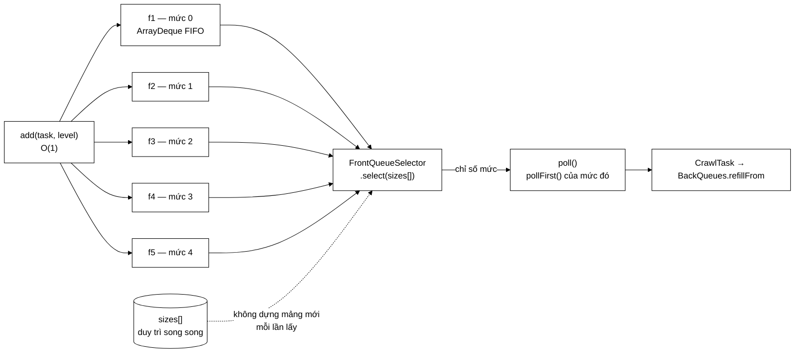

# FrontQueues — khi ưu tiên là *chỉ số hàng đợi* thay vì *khoá so sánh*

**File nguồn:** `search-engine/src/main/java/com/vnsearch/crawler/frontier/FrontQueues.java` (113 dòng)
**Gói:** `com.vnsearch.crawler.frontier` · **Loại:** `final class` — **không** thread-safe
**Vị trí trong sơ đồ:** tầng **`f1..fn`** + đầu ra qua [`FrontQueueSelector`](./FrontQueueSelector.md)
**Đọc kèm:** [`UrlFrontier.md`](./UrlFrontier.md) · [`BackQueues.md`](./BackQueues.md) · [`Prioritizer.md`](./Prioritizer.md)

---

## 📌 Hiểu trong 30 giây

$n$ hàng đợi, mỗi hàng đợi ứng với **đúng một mức ưu tiên**, và trong một mức
thì thứ tự là **FIFO thuần**.

Đây là điểm khác căn bản so với bản trước, vốn dùng **một min-heap so sánh điểm
số**. Và ý quan trọng nhất không nằm ở tốc độ:

> Khi ưu tiên là **chỉ số hàng đợi** chứ không phải **khoá so sánh**, chính sách
> phục vụ **tách hẳn khỏi cấu trúc lưu trữ** và trở thành một tham số thay được.



```
   HEAP THEO ĐIỂM  so với  n HÀNG ĐỢI FIFO

                        heap theo điểm        n hàng đợi FIFO
   ──────────────────   ──────────────────    ────────────────────────
   Thêm                 O(log n)              O(1)
   Lấy                  O(log n)              O(số mức) — hằng số nhỏ
   Trong cùng một mức   thứ tự tuỳ heap       ĐÚNG thứ tự phát hiện
   Chống bỏ đói         KHÔNG LÀM ĐƯỢC        đổi bộ chọn là xong
                                              ↑ đây mới là điểm quan trọng nhất
```

---

## 1. Vì sao dòng cuối của bảng mới là điểm mấu chốt

```
   ── Với một heap theo điểm ───────────────────────────────────────
   heap LUÔN trả phần tử có điểm tốt nhất. Đó là định nghĩa của heap.
        muốn "thỉnh thoảng phục vụ mức thấp để chống bỏ đói"?
             → phải sửa hàm so sánh
             → hoặc thêm một hệ số lão hoá vào điểm
             → tức là NHÚNG chính sách phục vụ VÀO cấu trúc dữ liệu
             → và mỗi lần đổi chính sách là đổi cả cấu trúc

   ── Với n hàng đợi FIFO ──────────────────────────────────────────
   cấu trúc chỉ biết "có bao nhiêu phần tử ở mỗi mức"
        chính sách nằm ở FrontQueueSelector — MỘT interface
             → WeightedRandomSelector: chống bỏ đói
             → StrictPrioritySelector: tất định, cho kiểm thử
             → muốn round-robin? viết thêm một lớp, không đụng gì khác
```

Đây là ví dụ sạch của nguyên tắc **tách cơ chế khỏi chính sách** (mechanism vs
policy): `FrontQueues` là cơ chế (lưu trữ), `FrontQueueSelector` là chính sách
(phục vụ ai trước).

---

## 2. Bản đồ lớp

```
FrontQueues (final, KHÔNG thread-safe)
├── queues   : List<Deque<CrawlTask>>   ── mỗi mức một ArrayDeque
├── selector : FrontQueueSelector       ── chính sách phục vụ
├── sizes    : int[]                    ── kích thước từng mức, DUY TRÌ SONG SONG
├── total    : int
│
├── add(CrawlTask, int level)   O(1)
├── poll()                      O(số mức)
├── isEmpty / size / levels
└── sizeOfLevel(int)            ── thống kê + kiểm thử
```

### 2.1 `sizes[]` duy trì song song — vì sao đáng

```java
/**
 * Kích thước từng hàng đợi, duy trì song song để đưa cho bộ chọn mà không
 * phải dựng mảng mới ở mỗi lần lấy.
 */
private final int[] sizes;
```

```
   Không có sizes[]:
        mỗi lần poll() phải dựng một mảng mới:
             int[] s = new int[levels];
             for (i) s[i] = queues.get(i).size();
        → một lần cấp phát + một vòng lặp MỖI LẦN LẤY URL
        → 31.030 lần crawl × ~79 lần poll = 2,4 TRIỆU mảng rác

   Có sizes[]:
        add() tăng, poll() giảm — O(1)
        truyền thẳng mảng có sẵn cho selector
```

Cái giá: **hai nguồn sự thật** phải luôn khớp nhau. Lớp xử lý rủi ro đó bằng một
phép kiểm tra tường minh:

```java
CrawlTask task = queues.get(level).pollFirst();
if (task == null) {
    // Bộ chọn trả về một hàng đợi rỗng: sizes[] và hàng đợi đã lệch nhau.
    throw new IllegalStateException("Bộ chọn trả về hàng đợi rỗng: mức " + level);
}
```

Đây là **fail-fast cho một bất biến nội bộ**. Nếu `sizes[]` lệch với `queues`,
lỗi nổ ra **ngay tại chỗ** kèm thông điệp chỉ đúng nguyên nhân — thay vì để
`task = null` chảy xuống [`BackQueues`](./BackQueues.md) và gây
`NullPointerException` ở một nơi hoàn toàn không liên quan.

Ngoại lệ này cũng bắt được một **bộ chọn viết sai** (trả về chỉ số của hàng đợi
rỗng) — hợp đồng mà [`FrontQueueSelector`](./FrontQueueSelector.md) yêu cầu
nhưng không ép được.

### 2.2 `ArrayDeque` chứ không phải `LinkedList`

```java
queues.add(new ArrayDeque<>());
```

| | `ArrayDeque` | `LinkedList` |
|---|---|---|
| `addLast` / `pollFirst` | $O(1)$ | $O(1)$ |
| Bộ nhớ mỗi phần tử | **8 byte** (một ô mảng) | **~40 byte** (Node: 3 tham chiếu + header) |
| Cục bộ bộ nhớ đệm | Tốt — mảng liên tục | Kém — nút rải rác |

```
   500.000 URL trong frontier:
        ArrayDeque : ~4 MB cho phần khung
        LinkedList : ~20 MB
        → chênh 16 MB, và ArrayDeque còn nhanh hơn nhờ cache
```

`ArrayDeque` được [`BackQueues`](./BackQueues.md) dùng cho cùng lý do.

---

## 3. FIFO trong mỗi mức — điều kiện để phiên crawl **lặp lại được**

Javadoc dòng 30–31:

> Giữ thứ tự phát hiện trong mỗi mức cũng là điều kiện để một phiên crawl **lặp
> lại được**: cùng tập seed cho ra cùng thứ tự URL.

```
   ── Heap theo điểm ───────────────────────────────────────────────
   ba URL cùng điểm 2,0 (cùng độ sâu, cùng đặc điểm)
        heap trả cái nào? → phụ thuộc thứ tự chèn và hình dạng cây
        → hai lần chạy cùng dữ liệu có thể cho hai thứ tự khác nhau

   ── FIFO trong mỗi mức ───────────────────────────────────────────
   ba URL cùng mức 2 → ra theo ĐÚNG thứ tự chúng được phát hiện
        → tất định
```

Đây là mắt xích thứ ba trong chuỗi bảo đảm tính tái hiện của cả hệ thống:

| Lớp | Cơ chế | Nếu thiếu |
|---|---|---|
| [`LinkExtractor`](../LinkExtractor.md) | `LinkedHashSet` giữ thứ tự trong HTML | Thứ tự liên kết đổi giữa các lần chạy |
| **`FrontQueues`** | **FIFO trong mỗi mức** | Thứ tự trong cùng mức đổi |
| [`WeightedRandomSelector`](./WeightedRandomSelector.md) | Hạt giống `Random` cố định | Chính sách chọn đổi |
| [`BackQueues`](./BackQueues.md) | Khoá phụ trong bộ so sánh heap | Thứ tự slot cùng `availableAt` đổi |

**Bốn** lớp, bốn cơ chế khác nhau, cùng một mục tiêu. Chỉ cần **một** lớp phá vỡ
là mọi con số đo đạc trong báo cáo mất khả năng so sánh giữa hai lần chạy. Đây
là điểm rất đáng nêu khi bảo vệ: tính tái hiện không phải tự nhiên có, nó phải
được thiết kế ở **mọi** điểm có sự tuỳ ý.

---

## 4. Hướng dẫn về code

### 4.1 `add` — kiểm tra biên tường minh

```java
public void add(CrawlTask task, int level) {
    if (level < 0 || level >= queues.size()) {
        throw new IllegalArgumentException(
                "level phải trong [0, " + queues.size() + "), nhận được: " + level);
    }
    queues.get(level).addLast(task);
    sizes[level]++;
    total++;
}
```

Không thể xảy ra khi gọi qua [`UrlFrontier`](./UrlFrontier.md) (vì
[`DefaultPrioritizer`](./DefaultPrioritizer.md) đã kẹp giá trị), nhưng kiểm tra
ở đây vẫn đúng:

```
   Không kiểm tra:
        level = 7 với 5 mức
        → queues.get(7) ném IndexOutOfBoundsException
        → thông điệp: "Index 7 out of bounds for length 5"
        → KHÔNG nói gì về "level", về Prioritizer, về nguyên nhân

   Có kiểm tra:
        "level phải trong [0, 5), nhận được: 7"
        → chỉ thẳng vào một Prioritizer đang trả sai
```

Cùng phong cách thông điệp lỗi kèm giá trị nhận được với
[`CrawlConfig`](../CrawlConfig.md), [`UrlFilter`](../UrlFilter.md),
[`HtmlDownloader`](../HtmlDownloader.md) — nhất quán trong cả dự án.

### 4.2 `poll` — hai lớp kiểm tra

```java
public CrawlTask poll() {
    if (total == 0) return null;             // ① nhanh, tránh gọi selector vô ích
    int level = selector.select(sizes);
    if (level < 0) return null;              // ② selector báo mọi hàng đợi rỗng
    CrawlTask task = queues.get(level).pollFirst();
    if (task == null) throw new IllegalStateException(...);   // ③ bất biến vỡ
    sizes[level]--;
    total--;
    return task;
}
```

① và ② **trùng nhau về mặt logic** (nếu `total == 0` thì `select` cũng trả `-1`),
nhưng ① tránh một lời gọi hàm và một vòng lặp trên `sizes[]` — đáng, vì `poll`
chạy hàng triệu lần.

③ thì khác hẳn: nó là **fail-fast**, không phải xử lý ca bình thường.

### 4.3 `sizeOfLevel` — cho thống kê và kiểm thử

```java
public int sizeOfLevel(int level) { return sizes[level]; }
```

Cho phép test khẳng định "URL này đã vào đúng mức 2" mà không phải lấy ra rồi
kiểm tra — tức test được [`Prioritizer`](./Prioritizer.md) **qua** `FrontQueues`
mà không phá trạng thái.

Chú ý nó **không** kiểm tra biên (khác `add`) — sẽ ném
`ArrayIndexOutOfBoundsException` với chỉ số sai. Không nhất quán nhỏ, nhưng hàm
này chỉ dùng cho chẩn đoán nên hậu quả thấp.

### 4.4 Cạm bẫy khi sửa lớp này

| Cạm bẫy | Hậu quả | Cách đúng |
|---|---|---|
| Quay lại một heap theo điểm | Mất khả năng chống bỏ đói, mất tính tái hiện trong cùng mức | Giữ $n$ hàng đợi |
| Dựng mảng `sizes` mới mỗi lần `poll` | 2,4 triệu mảng rác mỗi phiên | Giữ duy trì song song |
| Quên cập nhật `sizes[]` ở một đường ghi mới | Lệch với `queues` → `IllegalStateException` | Mọi đường ghi phải qua `add`/`poll` |
| Bỏ phép kiểm tra `task == null` | Lỗi chảy xuống `BackQueues`, nổ ở nơi không liên quan | Giữ fail-fast |
| Đổi `pollFirst` thành `pollLast` | Mất FIFO → mất tính tái hiện | Giữ |
| `LinkedList` thay `ArrayDeque` | +16 MB, chậm hơn do cache | Giữ |
| Thêm `synchronized` | Khoá lồng nhau với `UrlFrontier` | Giữ không thread-safe |
| Cho `selector` trả về mức rỗng | Vỡ hợp đồng — `IllegalStateException` | Bộ chọn phải bỏ qua mức có `size == 0` |

---

## 5. Độ phức tạp & chi phí

Gọi $L$ = số mức (5), $N$ = số URL đang chờ.

| Thao tác | Chi phí |
|---|---|
| `add` | $O(1)$ — `addLast` + hai phép tăng |
| `poll` | $O(L)$ = 5 phép (do `selector` duyệt `sizes[]`) |
| `isEmpty` / `size` / `levels` / `sizeOfLevel` | $O(1)$ |
| Bộ nhớ | $O(N)$ — ~8 byte/phần tử cho khung `ArrayDeque` |

```
   So với heap (bản cũ), N = 500.000:

   add:   O(log 500.000) = 19 phép   →  O(1) = 1 phép      ↓ 19 lần
   poll:  O(log 500.000) = 19 phép   →  O(5) = 5 phép      ↓ ~4 lần

   Trên 2,4 triệu lời gọi add trong một phiên:
        heap:  45,6 triệu phép so sánh
        đây:    2,4 triệu phép
```

$O(L)$ của `poll` là **hằng số theo cấu hình**, không phụ thuộc số URL — đó mới
là điểm quan trọng. Với $L = 5$, nó rẻ hơn $O(\log N)$ ở mọi $N > 32$.

---

## 6. Kiểm thử liên quan

| Test | Bảo vệ điều gì |
|---|---|
| `test/java/com/vnsearch/crawler/frontier/FrontQueuesTest.java` | FIFO trong mức; `sizes[]` khớp; kiểm tra biên |
| `test/java/com/vnsearch/crawler/frontier/UrlFrontierTest.java` | Tích hợp |

```powershell
cd search-engine
.\mvnw.cmd -q -Dtest='FrontQueuesTest' test
```

Bảng ca kiểm thử cốt lõi (dùng
[`StrictPrioritySelector`](./StrictPrioritySelector.md) để tất định):

```
   ① FIFO TRONG MỘT MỨC
      add(A, 2); add(B, 2); add(C, 2)
      → poll() trả A, rồi B, rồi C   ← ĐÚNG thứ tự phát hiện

   ② ƯU TIÊN GIỮA CÁC MỨC
      add(X, 3); add(Y, 0); add(Z, 1)
      → với StrictPrioritySelector: Y (mức 0), Z (mức 1), X (mức 3)

   ③ sizes[] KHỚP
      add 5 URL vào mức 2 → sizeOfLevel(2) == 5, size() == 5
      poll 2 lần          → sizeOfLevel(2) == 3, size() == 3

   ④ RỖNG
      poll() trên hàng đợi rỗng → null, KHÔNG ném

   ⑤ KIỂM TRA BIÊN
      add(task, -1)  → IllegalArgumentException
      add(task, 5)   → IllegalArgumentException  (với 5 mức)
      new FrontQueues(0, selector)    → IllegalArgumentException
      new FrontQueues(5, null)        → IllegalArgumentException

   ⑥ BỘ CHỌN VIẾT SAI  ← ca bảo vệ fail-fast
      selector giả luôn trả về 0, kể cả khi mức 0 rỗng
      add(task, 3); poll()
      → IllegalStateException với thông điệp "mức 0"
```

Ca ⑥ đáng có: nó khẳng định phép kiểm tra `task == null` thật sự bảo vệ được, và
tài liệu hoá hợp đồng mà [`FrontQueueSelector`](./FrontQueueSelector.md) phải
tuân thủ.

---

## 7. Chấm theo chuẩn doanh nghiệp

| Tiêu chí | Điểm | Nhận xét |
|---|---|---|
| Tách cơ chế khỏi chính sách | 10/10 | Ưu tiên là **chỉ số**, không phải khoá so sánh — chính sách thành tham số |
| Cải thiện độ phức tạp | 10/10 | `add` từ $O(\log n)$ xuống $O(1)$; bảng so sánh trong Javadoc rất rõ |
| Tính tái hiện | 10/10 | FIFO trong mức là một trong bốn mắt xích của chuỗi bảo đảm |
| Fail-fast | 10/10 | Phát hiện `sizes[]` lệch **và** bộ chọn viết sai bằng một phép kiểm tra |
| Chọn cấu trúc dữ liệu | 10/10 | `ArrayDeque` + `sizes[]` song song — cả hai đều có lý do đo được |
| Thông điệp lỗi | 10/10 | Kèm khoảng hợp lệ và giá trị nhận được |
| Đơn giản | 10/10 | 113 dòng, không có gì thừa |
| Đầy đủ | 7/10 | Không có cách bỏ phần tử khi frontier đầy (xem đề xuất) |

**Ba đề xuất nâng lên mức sản phẩm:**

1. **Thêm `CrawlTask pollLast(int level)` để hỗ trợ đuổi có chọn lọc.** Hiện khi
   [`UrlFrontier`](./UrlFrontier.md) đầy, URL mới bị **từ chối** — kể cả URL mức
   0 của một host mới. Có hàm này thì frontier đuổi được phần tử **cũ nhất của
   mức thấp nhất** để nhường chỗ, biến trần dung lượng từ "chặn mù" thành "chặn
   có chọn lọc". Đây là điều kiện kỹ thuật cho đề xuất 2 ở
   [`UrlFrontier.md`](./UrlFrontier.md).

2. **Trần theo từng mức.** Hiện một mức có thể chiếm toàn bộ `maxSize` của
   frontier. Trên web thì mức 3–4 (độ sâu lớn) sinh ra nhiều URL nhất, nên chúng
   có thể chiếm hết chỗ và đẩy mức 0–1 vào trạng thái bị từ chối — đúng ngược
   với ý định của việc phân mức. Một trần mềm theo mức (ví dụ mức $i$ không quá
   $2^{L-i}$ phần của tổng) sẽ giữ đúng tinh thần phân bố trọng số của
   [`WeightedRandomSelector`](./WeightedRandomSelector.md).

3. **Kiểm tra biên cho `sizeOfLevel`.** Không nghiêm trọng (chỉ dùng cho chẩn
   đoán) nhưng nó là hàm `public` duy nhất trong lớp không kiểm tra tham số —
   một điểm không nhất quán nhỏ với `add` ở ngay trên.

---

## 8. Liên kết

- Lớp Facade bọc khoá: [`UrlFrontier.md`](./UrlFrontier.md)
- Chính sách phục vụ: [`FrontQueueSelector.md`](./FrontQueueSelector.md) → [`WeightedRandomSelector.md`](./WeightedRandomSelector.md) · [`StrictPrioritySelector.md`](./StrictPrioritySelector.md)
- Nguồn của chỉ số mức: [`Prioritizer.md`](./Prioritizer.md) → [`DefaultPrioritizer.md`](./DefaultPrioritizer.md)
- Tầng sau (đích của `poll`): [`BackQueues.md`](./BackQueues.md)
- Kiểu dữ liệu: [`CrawlTask.md`](./CrawlTask.md)
- Mắt xích khác của chuỗi tái hiện: [`../LinkExtractor.md`](../LinkExtractor.md) mục 2.2
- Tổng quan: `docs/ARCHITECTURE.md`, `docs/DSA-REPORT.md`
