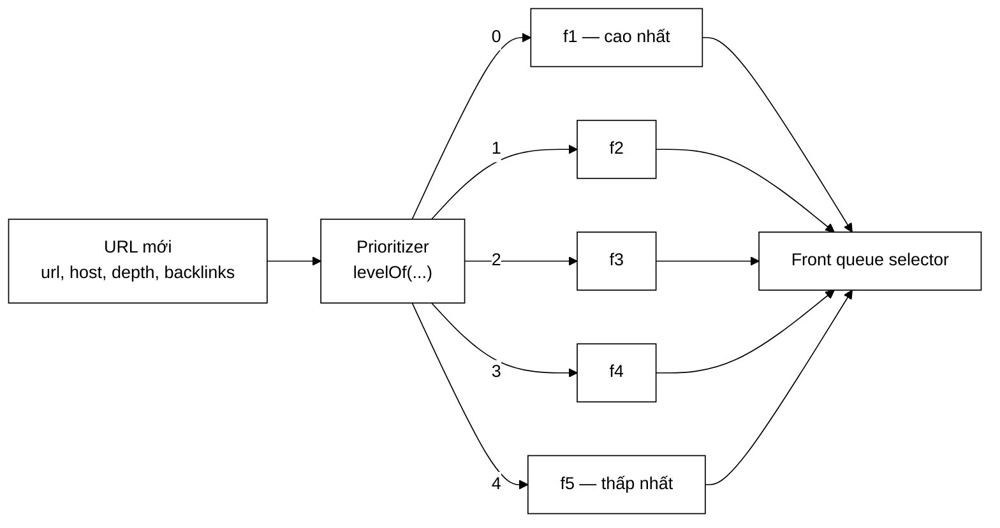

# Prioritizer — vì sao trả về MỨC chứ không phải ĐIỂM

**File nguồn:** `search-engine/src/main/java/com/vnsearch/crawler/frontier/Prioritizer.java` (35 dòng)
**Gói:** `com.vnsearch.crawler.frontier` · **Loại:** giao diện (2 phương thức) — Strategy pattern
**Vị trí trong luồng crawl:** khối **"Prioritizer"** trong sơ đồ URL Frontier — đứng ngay sau cửa vào `addUrl`, trước [`FrontQueues`](./FrontQueues.md)
**Cài đặt hiện có:** [`DefaultPrioritizer`](./DefaultPrioritizer.md)
**Đọc kèm:** [`FrontQueues.md`](./FrontQueues.md) · [`FrontQueueSelector.md`](./FrontQueueSelector.md) · [`UrlFrontier.md`](./UrlFrontier.md)

---

## 📌 Hiểu trong 30 giây

Giao diện này trả lời đúng một câu hỏi: **URL này quan trọng đến mức nào?** Và
nó trả lời bằng một **số nguyên chỉ mục hàng đợi**, không phải một điểm số thực.

Sự khác biệt đó nghe nhỏ nhưng nó quyết định toàn bộ kiến trúc của tầng trước:
điểm số thì bắt buộc phải có heap để so sánh; chỉ mục thì chỉ cần một mảng
hàng đợi FIFO.



```
   ĐIỂM SỐ            vs            MỨC (chỉ mục hàng đợi)

   double 7,25                      int 1
   ├─ cần heap để so sánh           ├─ cần một mảng
   ├─ thêm: O(log n)                ├─ thêm: O(1)
   ├─ lấy:  O(log n)                ├─ lấy:  O(số mức) = hằng số
   ├─ thứ tự trong cùng "điểm"      ├─ FIFO thuần trong mỗi mức
   │  phụ thuộc cách heap xoay      │  ⇒ đúng thứ tự phát hiện
   └─ KHÔNG chống bỏ đói được       └─ đổi bộ chọn là xong
```

---

## 1. Hai phương thức, và vì sao cần cả hai

```java
public interface Prioritizer {
    int levels();
    int levelOf(String url, String host, int depth, int knownBacklinks);
}
```

| Phương thức | Ai gọi | Khi nào |
|---|---|---|
| `levels()` | [`UrlFrontier`](./UrlFrontier.md) hàm dựng | **Một lần**, để biết cần cấp phát bao nhiêu hàng đợi |
| `levelOf(...)` | `UrlFrontier.addUrl` | **Mỗi URL** — hàng triệu lần trong một phiên |

`levels()` tồn tại vì `FrontQueues` phải cấp phát mảng hàng đợi **trước khi**
thấy URL đầu tiên:

```java
this.frontQueues = new FrontQueues(prioritizer.levels(), selector);
//                                 └────────┬────────┘
//                    số hàng đợi do CHÍNH SÁCH quyết định, không cứng hoá
```

Đây là chỗ mà Strategy pattern lộ ra giá trị: đổi sang một chính sách 10 mức
thì `FrontQueues` tự cấp 10 hàng đợi, `WeightedRandomSelector` tự tính lại
trọng số cho 10 mức, và **không dòng nào của `UrlFrontier` phải sửa**.

> ⚠️ **Ràng buộc ngầm chưa được ghi rõ:** `levels()` phải trả về **cùng một giá
> trị suốt vòng đời**. Nếu một cài đặt trả về số thay đổi, mảng hàng đợi đã cấp
> phát không co giãn theo, và `levelOf` có thể trả về chỉ mục vượt biên. Xem đề
> xuất 1 ở mục 6.

---

## 2. Hợp đồng: 0 là CAO NHẤT

```
   MỨC       0      1      2      3      4
   HÀNG ĐỢI  f1     f2     f3     f4     f5
             ↑                           ↑
        cao nhất                    thấp nhất
        (khớp với f1 trong sơ đồ kiến trúc)
```

Quy ước "số nhỏ = ưu tiên cao" ngược với trực giác thường ngày ("điểm cao là
tốt"), nhưng nó là quy ước **duy nhất** cho phép mức trở thành chỉ mục mảng:

```java
queues.get(level)     // level 0 → queues.get(0) → f1
```

Nếu đảo lại (số lớn = ưu tiên cao), mọi chỗ dùng đều phải viết
`queues.get(levels - 1 - level)` — một phép trừ nhỏ nhưng lặp lại ở bốn nơi và
sai một lần là lệch toàn bộ thứ tự crawl. Quy ước hiện tại làm phép chuyển đổi
đó biến mất hoàn toàn.

### 2.1 Bốn tham số của `levelOf` — và vì sao đúng bốn

| Tham số | Vì sao có mặt | Ai đang dùng |
|---|---|---|
| `url` | Cho phép chính sách xét đường dẫn (`/tin-tuc/`, `/tag/`, đuôi tệp) | `DefaultPrioritizer` **chưa dùng** — nhưng đây là trục mở rộng rõ ràng nhất |
| `host` | Tín hiệu miền quốc gia `.vn` — yêu cầu đề bài | ✓ dùng |
| `depth` | Thước đo "gần seed tới đâu"; trang gần seed thường là trang chủ/chuyên mục | ✓ dùng, làm **gốc** |
| `knownBacklinks` | Tín hiệu chất lượng: nhiều nơi trỏ tới ⇒ nhiều khả năng quan trọng | ✓ dùng |

`url` chưa được cài đặt hiện tại dùng đến. Đó **không** phải thiết kế thừa: nó
là tham số mà mọi chính sách thay thế đều cần, và bỏ nó đi thì việc thêm sau
này sẽ phá vỡ giao diện đối với mọi cài đặt bên ngoài. Đây là ranh giới đúng
giữa "chuẩn bị hợp lý" và "thừa".

### 2.2 Ba ràng buộc mà mọi cài đặt phải giữ

```
   ① MIỀN GIÁ TRỊ:  0 <= levelOf(...) < levels()
      Vi phạm ⇒ FrontQueues.add ném IllegalArgumentException,
                URL bị mất và luồng gọi có thể chết.

   ② THUẦN (không trạng thái):  cùng đầu vào ⇒ cùng đầu ra
      Vi phạm ⇒ phiên crawl không lặp lại được, và mọi phép đo
                so sánh hai lần chạy trở nên vô nghĩa.

   ③ AN TOÀN ĐA LUỒNG
      addUrl gọi levelOf NGOÀI khối synchronized của UrlFrontier
      (cố ý — để giảm thời gian giữ khoá). Nhiều worker gọi
      cùng lúc trên cùng một thể hiện.
```

Ràng buộc ③ là chi tiết dễ bỏ sót nhất. Nhìn lại `UrlFrontier.addUrl`:

```java
int level = prioritizer.levelOf(url, task.host(), depth, knownBacklinks);   // NGOÀI khoá

synchronized (lock) {
    ...
    frontQueues.add(task, level);
}
```

Một cài đặt giữ bộ đếm bên trong (ví dụ "cứ 100 URL thì hạ một bậc") sẽ **hỏng
im lặng** ở đây. Cả ba ràng buộc hiện chỉ nằm trong Javadoc chứ không có gì ép
buộc. Xem đề xuất 2 ở mục 6.

---

## 3. Hướng dẫn thực hành

### 3.1 Viết một chính sách ưu tiên mới — mẫu đầy đủ

Ví dụ: một chính sách ưu tiên trang tin tức mới đăng, dùng cho crawl thời sự.

```java
package com.vnsearch.crawler.frontier;

/** Ưu tiên URL trông giống bài báo có ngày tháng gần đây. */
public final class NewsFirstPrioritizer implements Prioritizer {

    private static final int LEVELS = 4;

    @Override
    public int levels() {
        return LEVELS;                       // HẰNG SỐ — ràng buộc ở mục 1
    }

    @Override
    public int levelOf(String url, String host, int depth, int knownBacklinks) {
        int level = depth;
        if (host != null && host.endsWith(".vn"))  level--;
        if (url.contains("/tin-tuc/")
                || url.contains("/thoi-su/"))      level--;     // dùng tham số url
        if (url.matches(".*/20\\d{2}/.*"))         level--;     // có năm trong đường dẫn
        return Math.max(0, Math.min(level, LEVELS - 1));        // ← ràng buộc ①
    }
}
```

Cắm vào frontier:

```java
UrlFrontier frontier = new UrlFrontier(
        UrlFrontier.DEFAULT_MAX_SIZE,
        new NewsFirstPrioritizer(),                       // ← chính sách mới
        new WeightedRandomSelector(),
        UrlFrontier.DEFAULT_BACK_QUEUE_COUNT);
```

Không đụng một dòng nào của `UrlFrontier`, `FrontQueues`, hay `BackQueues`.
Đó là toàn bộ lý do giao diện này tồn tại.

### 3.2 Ba mẫu chính sách thường gặp

```
   ── Chỉ theo bề rộng (BFS thuần) ───────────────────────────────
   levelOf = clamp(depth, 0, levels-1)
        Dùng khi muốn một mẫu web không thiên lệch, ví dụ để đo
        thống kê ngôn ngữ. Mọi tín hiệu chất lượng đều bị bỏ.

   ── Chỉ theo miền (focused crawl) ──────────────────────────────
   levelOf = host.endsWith(".vn") ? 0 : levels-1
        Dùng khi chỉ quan tâm một tập miền. Cực đoan: mọi trang .vn
        đều ngang nhau, kể cả trang sâu 12 lớp.

   ── Lai (bản hiện tại) ─────────────────────────────────────────
   gốc = depth, mỗi tín hiệu nâng ĐÚNG MỘT bậc
        Giữ được trật tự bề rộng, tín hiệu chỉ tinh chỉnh trong
        phạm vi hẹp. Xem DefaultPrioritizer.md mục 2 để hiểu vì sao
        "một bậc" là con số đúng.
```

### 3.3 Đổi số mức — hậu quả lan tới đâu

Số mức không chỉ là số hàng đợi. Nó **đổi luôn phân bố xác suất** của
[`WeightedRandomSelector`](./WeightedRandomSelector.md), vì trọng số là $2^{n-1-i}$:

| Số mức | Xác suất mức 0 | Xác suất mức cuối | Ý nghĩa thực tế |
|---|---|---|---|
| 3 | 57,1% | 14,3% | Mức thấp vẫn được phục vụ khá thường xuyên |
| 5 (mặc định) | 51,6% | 3,2% | Cân bằng — 1 trên 31 lượt cho mức cuối |
| 8 | 50,2% | 0,39% | Mức cuối gần như bị bỏ đói: 1 trên 255 lượt |
| 12 | 50,0% | 0,024% | Mức cuối **thực tế là bỏ đói**: 1 trên 4.095 lượt |

```
   QUY LUẬT: mức 0 luôn ~50%, còn mức cuối giảm theo LUỸ THỪA 2.

   ⇒ Thêm mức KHÔNG làm mức cao được ưu ái hơn (nó đã ~50% rồi),
     mà chỉ làm mức thấp bị bỏ đói nhanh hơn.

   ⇒ Nhiều mức hơn KHÔNG có nghĩa là phân biệt tinh tế hơn.
     Nó có nghĩa là đuôi phân bố chết dần.
```

Đây là lý do `DEFAULT_LEVELS = 5` và Javadoc ghi *"crawl thực tế hiếm khi vượt
quá độ sâu 3–4"*. Muốn nhiều hơn 8 mức thì phải đổi luôn công thức trọng số
(ví dụ sang tuyến tính $n-i$) chứ không chỉ đổi con số.

### 3.4 Cạm bẫy khi cài đặt giao diện này

| Cạm bẫy | Hậu quả | Cách đúng |
|---|---|---|
| Quên `clamp` về `[0, levels)` | `FrontQueues.add` ném → URL mất, có thể giết worker | Luôn kết bằng `Math.max(0, Math.min(level, levels-1))` |
| `levels()` trả về giá trị thay đổi | Mảng hàng đợi đã cấp phát cố định ⇒ vượt biên | Trả về `final` field hoặc hằng số |
| Giữ trạng thái bên trong (bộ đếm, cache) | Gọi ngoài khoá, đa luồng ⇒ hỏng im lặng; phiên crawl không lặp lại được | Giữ thuần; muốn có trạng thái thì phải tự đồng bộ hoá |
| Cho một tín hiệu nâng nhiều bậc | Tín hiệu đó lấn át `depth`, crawl mất tính bề rộng | Mỗi tín hiệu một bậc — xem [`DefaultPrioritizer`](./DefaultPrioritizer.md) mục 2 |
| Trả về mức cao cho URL rác | URL rác chiếm 50% lượt phục vụ | Lọc rác ở [`UrlFilter`](../UrlFilter.md), không phải ở đây |
| Gọi mạng/đọc đĩa trong `levelOf` | Chạy hàng triệu lần trên đường đi nóng | Chỉ dùng bốn tham số có sẵn |

Dòng cuối đáng nhấn mạnh: `levelOf` được gọi **mỗi URL**. Với 2,4 triệu URL,
một phép truy vấn cơ sở dữ liệu 1 ms mỗi lần = **40 phút** cộng thêm vào phiên
crawl. Mọi tín hiệu cần tra cứu (PageRank thật, lịch sử domain) phải được **nạp
sẵn vào bộ nhớ** ở hàm dựng, không tra trong `levelOf`.

---

## 4. Độ phức tạp & chi phí

Giao diện không quy định chi phí, nhưng vị trí của nó trên đường đi nóng đặt
ra một ngân sách rất chặt:

```
   levelOf được gọi 1 lần / URL

   Phiên crawl 31.030 trang × 78,8 liên kết/trang ≈ 2,4 TRIỆU lần gọi

   NGÂN SÁCH HỢP LÝ: < 1 µs / lần
        2,4 triệu × 1 µs = 2,4 giây  ← không đáng kể
        2,4 triệu × 1 ms = 40 phút   ← không chấp nhận được

   DefaultPrioritizer hiện tại:
        endsWith(".vn")  ~20 ns
        hai phép so sánh ~2 ns
        ────────────────────────
        ~25 ns  ⇒ tổng 0,06 giây cho cả phiên. Miễn phí.
```

| Cài đặt | `levelOf` | Ghi chú |
|---|---|---|
| [`DefaultPrioritizer`](./DefaultPrioritizer.md) | $O(1)$, ~25 ns | Chỉ `endsWith` + so sánh |
| Chính sách có `contains(...)` | $O(L)$, ~100 ns | $L$ = độ dài URL; vẫn miễn phí |
| Chính sách có `matches(regex)` | $O(L)$ nhưng hằng số lớn, ~1–3 µs | Chấp nhận được, nhưng nên biên dịch sẵn `Pattern` thành `static final` |
| Chính sách tra cơ sở dữ liệu | ~1 ms | **Không chấp nhận được** — nạp sẵn vào `Map` ở hàm dựng |

---

## 5. Kiểm thử liên quan

| Test | Bảo vệ điều gì |
|---|---|
| `test/java/com/vnsearch/crawler/frontier/DefaultPrioritizerTest.java` (78 dòng) | Cài đặt mặc định: gốc theo `depth`, hai tín hiệu nâng bậc, phép kẹp hai đầu |
| `test/java/com/vnsearch/crawler/frontier/UrlFrontierTest.java` | Tích hợp: URL ưu tiên cao thực sự ra trước |
| `test/java/com/vnsearch/crawler/frontier/FrontQueuesTest.java` | Mức trả về được dùng đúng làm chỉ mục hàng đợi |

```powershell
cd search-engine
.\mvnw.cmd -q -Dtest='DefaultPrioritizerTest' test
```

**Bộ test dùng chung cho mọi cài đặt** — đây là thứ một giao diện Strategy nên
có, để mọi cài đặt mới đều được kiểm tra ba ràng buộc ở mục 2.2:

```java
abstract class PrioritizerContractTest {

    abstract Prioritizer taoDoiTuong();

    @Test
    void mucLuonNamTrongMienHopLe() {
        Prioritizer p = taoDoiTuong();
        for (int depth = 0; depth < 50; depth++) {
            for (int backlinks : new int[]{0, 1, 5, 1000}) {
                for (String host : new String[]{"a.vn", "a.com", "a.co.uk"}) {
                    int level = p.levelOf("https://" + host + "/x", host, depth, backlinks);
                    assertTrue(level >= 0 && level < p.levels(),
                            "mức " + level + " ngoài [0, " + p.levels() + ")");
                }
            }
        }
    }

    @Test
    void soMucKhongDoi() {
        Prioritizer p = taoDoiTuong();
        int lanDau = p.levels();
        for (int i = 0; i < 1000; i++) {
            p.levelOf("https://a.vn/" + i, "a.vn", i % 10, i);
        }
        assertEquals(lanDau, p.levels());
    }

    @Test
    void hamThuan() {
        Prioritizer p = taoDoiTuong();
        int lanDau = p.levelOf("https://a.vn/x", "a.vn", 3, 7);
        for (int i = 0; i < 100; i++) {
            assertEquals(lanDau, p.levelOf("https://a.vn/x", "a.vn", 3, 7));
        }
    }
}

class DefaultPrioritizerContractTest extends PrioritizerContractTest {
    @Override Prioritizer taoDoiTuong() { return new DefaultPrioritizer(); }
}
```

Test `mucLuonNamTrongMienHopLe` quét 50 × 4 × 3 = 600 tổ hợp và bắt được lỗi
`clamp` phổ biến nhất: quên kẹp cận trên khi `depth` lớn hơn `levels`.

---

## 6. Liên kết

- Cài đặt mặc định và lập luận về "mỗi tín hiệu một bậc": [`DefaultPrioritizer.md`](./DefaultPrioritizer.md)
- Nơi mức trở thành chỉ mục hàng đợi: [`FrontQueues.md`](./FrontQueues.md)
- Đầu ra của tầng trước, và vì sao số mức đổi phân bố xác suất: [`FrontQueueSelector.md`](./FrontQueueSelector.md) · [`WeightedRandomSelector.md`](./WeightedRandomSelector.md)
- Dữ liệu đầu vào của `levelOf`: [`CrawlTask.md`](./CrawlTask.md)
- Nơi ghép tất cả lại: [`UrlFrontier.md`](./UrlFrontier.md)
- Tổng quan luồng crawl: `docs/ARCHITECTURE.md`
