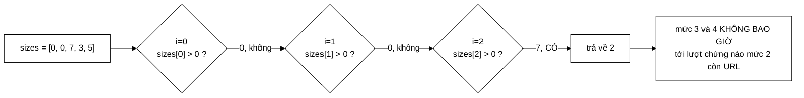

# StrictPrioritySelector — bộ chọn "sai" mà dự án vẫn giữ, và vì sao đó là đúng

**File nguồn:** `search-engine/src/main/java/com/vnsearch/crawler/frontier/StrictPrioritySelector.java` (28 dòng)
**Gói:** `com.vnsearch.crawler.frontier` · **Loại:** lớp `final`, không trạng thái — cài đặt [`FrontQueueSelector`](./FrontQueueSelector.md)
**Vị trí trong luồng crawl:** cài đặt **thay thế** cho khối "Front queue selector"; **không** phải mặc định
**Đọc kèm:** [`FrontQueueSelector.md`](./FrontQueueSelector.md) · [`WeightedRandomSelector.md`](./WeightedRandomSelector.md) · [`FrontQueues.md`](./FrontQueues.md)

---

## 📌 Hiểu trong 30 giây

Toàn bộ thuật toán là bảy dòng:

```java
@Override
public int select(int[] queueSizes) {
    for (int i = 0; i < queueSizes.length; i++) {
        if (queueSizes[i] > 0) {
            return i;                  // hàng đợi ưu tiên cao nhất còn URL
        }
    }
    return -1;                          // mọi hàng đợi đều rỗng
}
```

Lớp này **bỏ đói** các mức ưu tiên thấp — và Javadoc nói thẳng điều đó. Nó tồn
tại không phải vì nó là chính sách tốt cho crawl thật, mà vì nó là chính sách
**tất định**, và tất định là thứ mà kiểm thử với đo đạc bắt buộc phải có.



---

## 1. Vì sao một lớp "biết là sai" vẫn được viết ra

Javadoc dòng 9–13 tự tố cáo mình:

> *"**Đánh đổi:** chính sách này **bỏ đói** các mức thấp. Chừng nào mức 0 còn
> URL mới chảy vào thì mức 4 không bao giờ tới lượt — và trên web thì mỗi trang
> crawl được lại sinh thêm hàng chục URL nông, nên mức 0 gần như không bao giờ
> cạn. Đó là lý do mặc định của `UrlFrontier` là `WeightedRandomSelector` chứ
> không phải lớp này."*

```
   BA VAI TRÒ CỦA MỘT LỚP "SAI" ĐƯỢC GIỮ LẠI CÓ CHỦ Ý

   ① CÔNG CỤ KIỂM THỬ
      Test cần kỳ vọng viết ra được. Với Weighted, thứ tự phụ thuộc
      dãy số ngẫu nhiên — viết được nhưng khó đọc. Với Strict:
           "mức 0 hết đã, rồi mới tới mức 1"
      Một câu, ai đọc cũng hiểu.

   ② ĐƯỜNG CƠ SỞ ĐỂ ĐO
      Muốn chứng minh "chống bỏ đói có ích", phải có số của phiên
      KHÔNG chống bỏ đói để so. Lớp này CHÍNH LÀ đường cơ sở đó.
      Không có nó thì câu "Weighted tốt hơn" là khẳng định suông.

   ③ TÀI LIỆU SỐNG
      Nó cho thấy giao diện FrontQueueSelector thật sự có hai cách
      cài đặt khác nhau về bản chất. Một Strategy chỉ có MỘT cài
      đặt thì không ai biết trục trừu tượng đặt đúng chỗ hay chưa.
   ```

Vai trò ② đáng nhấn mạnh trong bối cảnh một đồ án: phần "đánh giá" của báo cáo
cần **số liệu so sánh**, và số liệu so sánh cần một đối chứng. Viết một lớp 28
dòng để có đối chứng là cái giá rẻ nhất có thể.

---

## 2. Bản đồ lớp

```
StrictPrioritySelector  (final, implements FrontQueueSelector)
└── select(int[] queueSizes) : int    ── quét từ 0, trả chỉ số đầu tiên có phần tử

    KHÔNG có trường nào.
    KHÔNG có hàm dựng (dùng mặc định).
    KHÔNG có trạng thái ⇒ thread-safe miễn phí.
```

### 2.1 Ba tính chất, đều đến từ việc không có trạng thái

| Tính chất | Vì sao |
|---|---|
| **Thuần** | Cùng `queueSizes` ⇒ cùng kết quả, luôn luôn |
| **Thread-safe** | Không có gì để tranh chấp; khác hẳn [`WeightedRandomSelector`](./WeightedRandomSelector.md) vốn dùng chung một `Random` |
| **Không cấp phát** | Không tạo đối tượng nào; một thể hiện dùng được cho toàn bộ vòng đời chương trình |

Đây là lớp duy nhất trong gói `frontier` an toàn khi gọi từ nhiều luồng **mà
không cần khoá**. Nếu sau này `FrontQueues` được viết lại thành lock-free, đây
là bộ chọn duy nhất dùng ngay được.

### 2.2 Vì sao quét tuyến tính là đúng, không phải "chưa tối ưu"

Cám dỗ: dùng một cấu trúc chỉ số để tìm hàng đợi không rỗng đầu tiên trong
$O(\log n)$, hoặc một bitmask với `Integer.numberOfTrailingZeros`.

```
   n = queueSizes.length = SỐ MỨC = 5

   Quét tuyến tính:  tệ nhất 5 phép so sánh  ≈ 5 ns
                     thường dừng ở i = 0     ≈ 1 ns
                     (mức 0 gần như luôn còn URL — chính là
                      nguyên nhân bỏ đói, và cũng khiến vòng
                      lặp thoát ngay lượt đầu)

   Bitmask:          ~2 ns, nhưng cần DUY TRÌ bitmask ở mỗi
                     add() và poll() của FrontQueues
                     ⇒ đẩy chi phí sang chỗ chạy NHIỀU HƠN

   ⇒ Tối ưu ở đây làm hệ thống CHẬM đi, không nhanh lên.
```

Với $n = 5$, cả mảng nằm gọn trong một dòng cache 64 byte và JIT thường mở vòng
lặp hoàn toàn. Đây là ví dụ sạch về việc **độ phức tạp tiệm cận không nói gì
khi $n$ là hằng số nhỏ**.

### 2.3 Đọc kỹ: hai điều kiện của hợp đồng đều được giữ

Nhắc lại hợp đồng ở [`FrontQueueSelector`](./FrontQueueSelector.md):

| Điều kiện | Lớp này giữ thế nào |
|---|---|
| Không sửa `queueSizes` | Chỉ đọc `queueSizes[i]`, không có phép gán nào |
| Hàng đợi trả về phải còn phần tử | `return i` nằm **bên trong** `if (queueSizes[i] > 0)` — không có đường nào khác thoát ra với chỉ số hợp lệ |
| Trả `-1` khi mọi hàng đợi rỗng | Vòng lặp chạy hết ⇒ rơi xuống `return -1` |

Cấu trúc "return bên trong `if`" là chi tiết nhỏ nhưng quan trọng: nó khiến điều
kiện thứ hai **không thể vi phạm** mà không viết lại hẳn vòng lặp. So sánh với
một cách viết dễ sai:

```java
// ✗ CÁCH VIẾT DỄ HỎNG — tách việc tìm và việc trả về
int best = -1;
for (int i = 0; i < queueSizes.length; i++) {
    if (queueSizes[i] > 0) { best = i; break; }
}
return best;        // ai đó sau này thêm nhánh gán `best` ở chỗ khác là hỏng
```

---

## 3. Hướng dẫn thực hành

### 3.1 Khi nào dùng lớp này

```
   ✓ DÙNG
   ├─ Viết test cho FrontQueues / UrlFrontier
   ├─ So sánh hai chính sách Prioritizer (khử nhiễu ở tầng chọn)
   ├─ Đo đường cơ sở "không chống bỏ đói" cho báo cáo
   └─ Crawl một tập seed HỮU HẠN, không nhận URL mới
      (khi đó bỏ đói không xảy ra vì mức cao thật sự cạn)

   ✗ KHÔNG DÙNG
   └─ Bất kỳ phiên crawl web thật nào có nhận URL mới
      → mức thấp không bao giờ được phục vụ
      → frontier phình tới trần 500.000, bắt đầu bỏ URL mới
      → kho dữ liệu thiên lệch về trang nông
```

Trường hợp cuối của nhánh ✓ đáng chú ý: nếu crawl **một danh sách URL cố định**
(ví dụ crawl lại 5.000 trang đã biết để cập nhật), thì mọi mức đều hữu hạn và
sẽ cạn theo thứ tự. Khi đó Strict cho đúng thứ tự lý thuyết mà không có nhược
điểm nào.

### 3.2 Dùng trong test — mẫu đầy đủ

```java
@Test
void mucCaoDuocPhucVuTruoc() {
    FrontQueues q = new FrontQueues(3, new StrictPrioritySelector());

    q.add(new CrawlTask("https://a.vn/thap", "a.vn", 2), 2);    // mức 2
    q.add(new CrawlTask("https://a.vn/cao",  "a.vn", 0), 0);    // mức 0
    q.add(new CrawlTask("https://a.vn/giua", "a.vn", 1), 1);    // mức 1

    // Kỳ vọng viết được trong MỘT dòng — đây là toàn bộ giá trị của Strict
    assertEquals("https://a.vn/cao",  q.poll().url());
    assertEquals("https://a.vn/giua", q.poll().url());
    assertEquals("https://a.vn/thap", q.poll().url());
    assertNull(q.poll());
}

@Test
void trongCungMotMucLaFifo() {
    FrontQueues q = new FrontQueues(3, new StrictPrioritySelector());
    q.add(new CrawlTask("https://a.vn/1", "a.vn", 0), 0);
    q.add(new CrawlTask("https://a.vn/2", "a.vn", 0), 0);
    q.add(new CrawlTask("https://a.vn/3", "a.vn", 0), 0);

    assertEquals("https://a.vn/1", q.poll().url());
    assertEquals("https://a.vn/2", q.poll().url());
    assertEquals("https://a.vn/3", q.poll().url());
}
```

Thử viết ca thứ nhất với `WeightedRandomSelector` để thấy khác biệt: thứ tự phụ
thuộc dãy `Random(20240801L)`, nên kỳ vọng phải hoặc là hard-code một dãy khó
hiểu, hoặc chỉ khẳng định được tính chất thống kê trên nhiều lần chạy.

### 3.3 Dùng để đo đường cơ sở cho báo cáo

```java
// Phiên A — chống bỏ đói (mặc định)
UrlFrontier weighted = new UrlFrontier(
        500_000, new DefaultPrioritizer(), new WeightedRandomSelector(), 128);

// Phiên B — đường cơ sở, có bỏ đói
UrlFrontier strict = new UrlFrontier(
        500_000, new DefaultPrioritizer(), new StrictPrioritySelector(), 128);
```

Ba số liệu nên đo và đưa vào báo cáo:

| Số liệu | Kỳ vọng với Strict | Kỳ vọng với Weighted |
|---|---|---|
| Phân bố độ sâu của trang crawl được | Dồn về depth 0–1 | Trải đều hơn tới depth 3–4 |
| `droppedDueToCapacity` sau 30.000 trang | Cao — frontier phình vì mức thấp không thoát | Thấp hơn rõ rệt |
| Số host phân biệt trong kho | Ít hơn | Nhiều hơn |

```
   ĐÂY CHÍNH LÀ ĐOẠN "ĐÁNH GIÁ" MÀ MỘT BÁO CÁO CẦN

   Không có Strict:  "chúng tôi dùng ngẫu nhiên có trọng số để
                      chống bỏ đói"        ← khẳng định suông

   Có Strict:        "với bộ chọn tất định, 94% trang thu được nằm
                      ở độ sâu ≤ 1 và frontier bỏ 210.000 URL vì
                      đầy; với bộ chọn có trọng số, con số là 61%
                      và 12.000"           ← có chứng cứ
```

### 3.4 Cạm bẫy

| Cạm bẫy | Hậu quả | Cách đúng |
|---|---|---|
| Đặt làm mặc định cho crawl thật | Bỏ đói mức thấp, kho thiên lệch, frontier phình | Chỉ dùng cho test và đo đường cơ sở |
| Tưởng "tất định" nghĩa là "tốt hơn" | Tất định chỉ nói về **tính lặp lại**, không nói gì về chất lượng kho | `WeightedRandomSelector` **cũng** tất định (hạt giống cố định) |
| Thêm trạng thái để "chống bỏ đói một chút" | Mất tính thuần và thread-safe — hai điểm mạnh duy nhất của lớp | Viết một cài đặt mới, giữ lớp này nguyên bản |
| Xoá lớp vì "không dùng trong sản phẩm" | Mất đường cơ sở đo đạc và mất công cụ viết test | Giữ; 28 dòng là cái giá rất rẻ |
| Đảo vòng lặp thành quét ngược | Thành "ưu tiên thấp nhất trước" — sai hoàn toàn quy ước 0 = cao nhất | Giữ `i = 0; i++` |

---

## 4. Độ phức tạp & chi phí

| Trường hợp | Chi phí |
|---|---|
| Tốt nhất (mức 0 còn URL — gần như luôn luôn) | $O(1)$, 1 phép so sánh, ~1 ns |
| Tệ nhất (chỉ mức cuối còn URL) | $O(n)$ với $n$ = số mức = 5, ~5 ns |
| Mọi hàng đợi rỗng | $O(n)$, ~5 ns — nhưng `FrontQueues.poll()` đã chặn bằng `if (total == 0)` trước đó |
| Bộ nhớ | **0 byte** — không trường, không cấp phát |

```
   SO SÁNH VỚI CÀI ĐẶT MẶC ĐỊNH

                        Strict      Weighted
   Số lượt qua mảng       1          2 (cộng trọng số, rồi đi tới)
   Sinh số ngẫu nhiên     0          1 (nextLong + floorMod)
   Chi phí ước lượng    ~1 ns      ~15 ns
   Trạng thái             0          1 đối tượng Random
   Thread-safe            ✓          ✗

   ⇒ Strict nhanh hơn ~15 lần. Và điều đó KHÔNG QUAN TRỌNG:
     select() chạy ~31.030 lần trong một phiên 8.600 giây.
     Chênh lệch tổng cộng: 0,0004 giây.

   ⇒ Bài học: khi chênh lệch hiệu năng nằm dưới ngưỡng đo được,
     hãy chọn theo HÀNH VI, không theo tốc độ.
```

---

## 5. Kiểm thử liên quan

| Test | Bảo vệ điều gì |
|---|---|
| `test/java/com/vnsearch/crawler/frontier/FrontQueuesTest.java` (144 dòng) | Dùng lớp này làm bộ chọn để khẳng định thứ tự ưu tiên và FIFO trong mức |
| `test/java/com/vnsearch/crawler/frontier/UrlFrontierTest.java` (247 dòng) | Tích hợp toàn frontier với thứ tự lặp lại được |

Lớp này **không có test riêng** — nó được kiểm gián tiếp qua `FrontQueuesTest`.
Với 7 dòng logic thì chấp nhận được, nhưng ba ca sau chạy trong mili-giây và
khoá chặt hợp đồng:

```java
class StrictPrioritySelectorTest {

    private final StrictPrioritySelector selector = new StrictPrioritySelector();

    @Test
    void chonMucCaoNhatConPhanTu() {
        assertEquals(0, selector.select(new int[]{5, 5, 5}));
        assertEquals(1, selector.select(new int[]{0, 5, 5}));
        assertEquals(2, selector.select(new int[]{0, 0, 5}));
    }

    @Test
    void moiHangDoiRongThiTraVeAmMot() {
        assertEquals(-1, selector.select(new int[]{0, 0, 0}));
        assertEquals(-1, selector.select(new int[]{}));       // mảng rỗng
    }

    @Test
    void khongSuaMangDauVao() {
        int[] sizes = {0, 3, 7};
        selector.select(sizes);
        assertArrayEquals(new int[]{0, 3, 7}, sizes);
    }
}
```

Ca `new int[]{}` (mảng rỗng) đáng giữ: vòng lặp không chạy lần nào và rơi thẳng
xuống `return -1` — đúng, nhưng đó là hành vi tình cờ đúng chứ không phải được
thiết kế, nên nó xứng đáng có một test khoá lại.

```powershell
cd search-engine
.\mvnw.cmd -q -Dtest='FrontQueuesTest' test
```

---

## 6. Liên kết

- Hợp đồng mà lớp này cài đặt: [`FrontQueueSelector.md`](./FrontQueueSelector.md)
- Cài đặt mặc định, và cách nó chống bỏ đói: [`WeightedRandomSelector.md`](./WeightedRandomSelector.md)
- Nơi bộ chọn được gọi: [`FrontQueues.md`](./FrontQueues.md)
- Nửa còn lại của tầng trước: [`Prioritizer.md`](./Prioritizer.md) · [`DefaultPrioritizer.md`](./DefaultPrioritizer.md)
- Nơi cắm bộ chọn vào: [`UrlFrontier.md`](./UrlFrontier.md)
