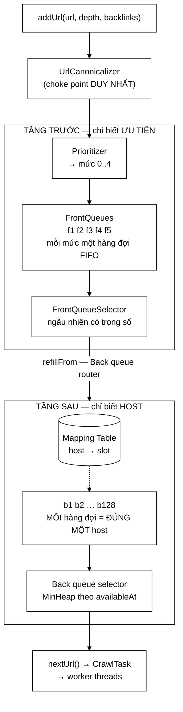

# UrlFrontier — hai tầng, vì ưu tiên và lịch sự là hai mục tiêu xung đột

**File nguồn:** `search-engine/src/main/java/com/vnsearch/crawler/frontier/UrlFrontier.java` (321 dòng)
**Gói:** `com.vnsearch.crawler.frontier` · **Loại:** `class` — **Facade** ghép bốn thành phần
**Vị trí trong sơ đồ:** toàn bộ khối **"URL Frontier"**
**Đọc kèm:** [`FrontQueues.md`](./FrontQueues.md) · [`BackQueues.md`](./BackQueues.md) · [`Prioritizer.md`](./Prioritizer.md) · [`../CrawlerService.md`](../CrawlerService.md)

---

## 📌 Hiểu trong 30 giây

Frontier là **hàng đợi quyết định crawler đi đâu tiếp theo**. Nó phải thoả mãn
hai yêu cầu **xung đột trực tiếp** với nhau:

| Yêu cầu | Muốn gì | Không quan tâm gì |
|---|---|---|
| **Ưu tiên** | Lấy URL tốt nhất trước | URL đó thuộc host nào |
| **Lịch sự** | Không chạm cùng một host hai lần trong 1 giây | URL đó tốt tới đâu |

Gộp vào một cấu trúc thì **một trong hai phải nhường**. Lời giải: **hai tầng** —
tầng trước xếp theo ưu tiên và *không biết gì về host*; tầng sau gom theo host
và *không biết gì về ưu tiên*.



```
   VÌ SAO KHÔNG THỂ GỘP MỘT TẦNG

   ── Một heap theo ưu tiên ────────────────────────────────────────
   lấy URL tốt nhất → là vnexpress.net/a
   lấy tiếp          → vnexpress.net/b   ← CÙNG host, chỉ sau 5 ms
        → vi phạm politeness
        → muốn tránh thì phải QUÉT heap tìm URL của host khác  → O(n)

   ── Một hàng đợi theo host ───────────────────────────────────────
   politeness OK, nhưng trong một host thì lấy URL nào trước?
        → mất hoàn toàn thông tin ưu tiên

   ── Hai tầng (đang dùng) ─────────────────────────────────────────
   tầng trước: "URL nào đáng crawl hơn"      — không biết host
   tầng sau  : "host nào đã hết thời gian chờ" — không biết ưu tiên
        → mỗi tầng làm ĐÚNG MỘT việc và làm TRỌN VẸN
```

---

## 1. Facade — lớp này không tự cài thuật toán nào

Javadoc dòng 32–34: *"Lớp này **không tự cài thuật toán nào**; nó ghép bốn thành
phần lại và cung cấp đúng hai thao tác mà crawler cần."*

| Khối trong sơ đồ | Lớp cài đặt |
|---|---|
| Prioritizer | [`Prioritizer`](./Prioritizer.md) → [`DefaultPrioritizer`](./DefaultPrioritizer.md) |
| `f1..fn` + Front queue selector | [`FrontQueues`](./FrontQueues.md) + [`FrontQueueSelector`](./FrontQueueSelector.md) |
| Back queue router + Mapping Table + `b1..bn` + Back queue selector | [`BackQueues`](./BackQueues.md) |

Bề mặt công khai cho crawler chỉ có **hai** hàm: `addUrl` và `nextUrl`. Toàn bộ
độ phức tạp của sơ đồ Mercator nằm sau hai chữ ký đó.

Đây là Facade dùng đúng nghĩa: không phải bọc cho có, mà để **một hệ thống phức
tạp có một bề mặt đơn giản** — và để các thành phần bên trong thay thế được độc
lập (hai trong bốn là interface).

---

## 2. Bản đồ lớp

```
UrlFrontier
├── POLITENESS_DELAY_MS      = 1.000   ── 1 giây giữa 2 lần chạm cùng host
├── DEFAULT_MAX_SIZE         = 500.000 ── trần số URL đang chờ
├── DEFAULT_BACK_QUEUE_COUNT = 128     ── số host hoạt động cùng lúc
├── MAX_SLEEP_MS             = 50      ── trần thời gian ngủ mỗi lượt
│
├── prioritizer  : Prioritizer
├── frontQueues  : FrontQueues
├── backQueues   : BackQueues
├── enqueued     : HashSet<String>          ── chống trùng CHÍNH XÁC
├── pendingPerHost : HashMap<String,Integer> ── host → số URL chờ
├── lock         : Object                    ── MỘT khoá cho CẢ HAI tầng
│
├── addUrl(url, depth, backlinks) → boolean   O(1)
├── nextUrl()                     → CrawlTask O(log n), CHẶN
├── size / isEmpty / domainCount
├── frontQueueSize / backQueueSize / activeHostCount
├── getDroppedDueToCapacity
└── main(String[])   ── demo cho báo cáo
```

### 2.1 Bốn hằng số

| Hằng số | Giá trị | Lý do |
|---|---|---|
| `POLITENESS_DELAY_MS` | 1.000 | Chuẩn mực crawler lịch sự |
| `DEFAULT_MAX_SIZE` | 500.000 | Chặn bộ nhớ — mục 3 |
| `DEFAULT_BACK_QUEUE_COUNT` | 128 | Trần thông lượng — mục 2.2 |
| `MAX_SLEEP_MS` | 50 | Thức dậy đủ sớm để thấy URL mới — mục 5.2 |

### 2.2 Vì sao 128 hàng đợi sau

Javadoc dòng 100–107 tính ra con số:

```
   Trần thông lượng = số hàng đợi / politeness delay
                    = 128 / 1 giây
                    = 128 trang/giây

   So với thực tế:
        8 worker × (1 trang / 200 ms) = 40 trang/giây      ← mạng chặn trước
   ⇒ 128 KHÔNG phải nút thắt.

   Host vượt quá 128 KHÔNG bị mất — nó nằm chờ ở TẦNG TRƯỚC.
        (đây là điểm mấu chốt, xem BackQueues.md mục "nạp theo yêu cầu")
```

Chọn một con số rồi **chứng minh nó không phải nút thắt** là cách đúng để biện
minh cho một hằng số cấu hình.

---

## 3. Chặn trên kích thước — một đánh đổi có chủ ý

```java
if (totalSize >= maxSize) {
    droppedDueToCapacity++;
    return false;
}
```

Javadoc dòng 59–65:

```
   Mỗi trang tin sinh hơn 90 liên kết ra
        → phiên crawl 10.000 trang có thể đẩy vào frontier HƠN MỘT TRIỆU URL

   Không có trần → bộ nhớ phình không kiểm soát
        1 triệu URL × (~80 byte chuỗi + ~48 byte HashSet.Node
                       + ~40 byte CrawlTask + ~40 byte Map)
        ≈ 200 MB — chỉ riêng frontier
        cộng với ContentStorage ~465 MB → vượt heap
```

Vì sao **bỏ URL mới** thay vì bỏ URL cũ, và vì sao điều đó chấp nhận được:

> Crawler ưu tiên theo bề rộng nên các URL bị bỏ **hầu hết là URL độ sâu lớn**,
> vốn nằm ở mức ưu tiên thấp nhất.

```
   Khi frontier đầy 500.000 URL:
        phần lớn URL mới đến từ các trang ở độ sâu 3–4
        → DefaultPrioritizer xếp chúng vào mức 3–4 (thấp nhất)
        → chúng là những URL SẼ ĐƯỢC LẤY CUỐI CÙNG dù có giữ lại
        ⇒ bỏ chúng đi mất rất ít giá trị
```

`droppedDueToCapacity` được đếm riêng — nếu con số này lớn, đó là tín hiệu cần
tăng `maxSize` hoặc siết `maxDepth`.

> ⚠️ Nhưng lập luận trên chỉ đúng **thống kê**, không đúng tuyệt đối: một URL độ
> sâu 1 của một host mới có thể bị bỏ nếu nó đến đúng lúc frontier đầy. Không
> có cơ chế nào ưu tiên giữ lại URL mức cao khi cạn chỗ. Xem đề xuất 2.

---

## 4. Chuẩn hoá tại **choke point** duy nhất

```java
public boolean addUrl(String rawUrl, int depth, int knownBacklinks) {
    String url = UrlCanonicalizer.canonicalize(rawUrl);   // ← ngay tại cửa vào
```

Javadoc dòng 168–170:

> Đây là **choke point duy nhất** mà mọi URL đều phải đi qua, nên chuẩn hoá ở
> đây bảo đảm tập `enqueued` **không bao giờ chứa hai biến thể của cùng một
> trang**.

```
   Nếu chuẩn hoá ở nơi gọi (CrawlerService):
        → phải nhớ gọi ở MỌI đường thêm URL (seed, outlink, redirect…)
        → quên một chỗ → https://a.vn và https://a.vn/ thành hai URL
        → và lỗi đó CHỈ lộ ra qua số liệu trùng lặp, không có exception

   Chuẩn hoá tại đây:
        → không có đường nào vào frontier mà không qua canonicalize
        → bất biến được bảo đảm bởi CẤU TRÚC, không bởi kỷ luật
```

### 4.1 `enqueued` là `HashSet` **chính xác**, khác Bloom Filter ở tầng trên

```java
/** Chống xếp hàng trùng: chính xác tuyệt đối, khác với Bloom Filter ở tầng crawler. */
private final Set<String> enqueued = new HashSet<>();
```

Đây là **lớp chống trùng thứ ba** trong hệ thống, và mỗi lớp có lý do riêng:

| Lớp | Cấu trúc | Phạm vi | Vì sao chọn vậy |
|---|---|---|---|
| [`UrlSeenFilter`](../UrlSeenFilter.md) | Bloom Filter | Mọi URL **đã từng gặp** (~2,4 triệu) | Quá lớn cho `HashSet` — tiết kiệm 210 lần |
| **`UrlFrontier.enqueued`** | **`HashSet`** | URL **đang chờ** (≤ 500.000) | Nhỏ hơn nhiều; false positive ở đây = mất URL |
| [`ContentStorage`](../ContentStorage.md) | `ConcurrentHashMap` | URL **đã lưu** | Chính xác tuyệt đối |

Điểm quan trọng: `enqueued` **co lại** — URL bị xoá khi được lấy ra (dòng 220).
Nên nó có trần thật (`maxSize`), khác với `UrlSeenFilter` chỉ lớn lên.

### 4.2 Phân tích URI **một lần**, ngoài khối khoá

```java
// Phân tích URL một lần duy nhất, ngoài khối khoá; host đi theo
// CrawlTask nên cả prioritizer lẫn tầng sau không phải phân tích lại.
String host = hostOf(url);
CrawlTask task = new CrawlTask(url, host != null ? host : url, depth);
int level = prioritizer.levelOf(url, task.host(), depth, knownBacklinks);

synchronized (lock) { ... }
```

Hai tối ưu trong ba dòng:

```
   ① Phân tích URI (~800 ns) và tính mức ưu tiên nằm NGOÀI khoá
        → thời gian giữ khoá giảm xuống chỉ còn các phép tra bảng
        → với N worker cùng addUrl, tranh chấp giảm rõ rệt

   ② host đi theo CrawlTask
        → Prioritizer, BackQueues, pendingPerHost đều dùng lại
        → không ai phải URI.create lần nữa
        (xem CrawlTask.md — đây là lý do tồn tại của trường host)
```

**`host != null ? host : url`** — URL không phân tích được thì lấy chính chuỗi
URL làm khoá host. Nhờ vậy nó vẫn được xếp vào một hàng đợi riêng thay vì bị gộp
nhầm với host khác.

---

## 5. Đồng thời — một khoá cho cả hai tầng

### 5.1 Vì sao **một** khoá, không phải hai

Javadoc dòng 67–74:

> [`FrontQueues`](./FrontQueues.md) và [`BackQueues`](./BackQueues.md) đều
> **không** tự đồng bộ; lớp này bọc mọi thao tác trong một khối `synchronized`
> duy nhất. Một khoá cho cả hai tầng là **cố ý** — chúng phải đổi trạng thái
> **cùng nhau** trong `nextUrl` (nạp lại tầng sau rồi mới lấy), nên hai khoá
> riêng chỉ tạo thêm cơ hội cho tình trạng đua mà không tăng thông lượng thực:
> **thân khoá không có thao tác vào/ra nào**.

```java
synchronized (lock) {
    if (totalSize == 0) return null;
    backQueues.refillFrom(frontQueues);   // ← ĐỌC tầng trước, GHI tầng sau
    CrawlTask task = backQueues.poll(now);
    ...
}
```

```
   Với HAI khoá riêng:
        refillFrom cần khoá TRƯỚC (để poll) và khoá SAU (để push)
        → giữ hai khoá cùng lúc → nguy cơ deadlock nếu thứ tự không nhất quán
        → hoặc nhả rồi lấy lại → trạng thái đổi giữa chừng
   ⇒ Phức tạp hơn, rủi ro hơn, và KHÔNG nhanh hơn.
```

Lập luận "thân khoá không có vào/ra" là chìa khoá — cùng lập luận đã dùng ở
[`UrlSeenFilter`](../UrlSeenFilter.md) mục 4.2 và
[`ProgressBarCrawlListener`](../ProgressBarCrawlListener.md) mục 5.1. **Ba lớp,
cùng một cách kiểm chứng: đo thời gian giữ khoá so với thao tác chậm nhất.**

### 5.2 Ngủ **ngoài** khối khoá, và ngủ đúng khoảng cần thiết

```java
public CrawlTask nextUrl() {
    while (true) {
        long sleepMs;
        synchronized (lock) {
            ...
            sleepMs = sleepUntilNextSlot(now);
        }
        // Ngủ NGOÀI khối khoá để không chặn các luồng đang muốn addUrl.
        Thread.sleep(sleepMs);
    }
}
```

Nếu ngủ **trong** khoá:

```
   worker A: giữ khoá, ngủ 800 ms chờ politeness
   worker B: muốn addUrl → CHẶN 800 ms
   worker C: muốn nextUrl → CHẶN 800 ms
   ⇒ một luồng đang CHỜ làm đứng cả crawler
```

Và ngủ **đúng khoảng cần**, không thăm dò theo chu kỳ cố định:

```java
private long sleepUntilNextSlot(long now) {
    long earliest = backQueues.earliestAvailableAt();
    if (earliest == Long.MAX_VALUE) return MAX_SLEEP_MS;
    return Math.min(MAX_SLEEP_MS, Math.max(1L, earliest - now));
}
```

```
   Thăm dò chu kỳ cố định 10 ms:
        cần chờ 800 ms → 80 lần thức dậy vô ích, 80 lần lấy khoá
        cần chờ 3 ms   → thức dậy sau 10 ms → CHẬM 7 ms mỗi lượt

   Ngủ đúng khoảng:
        cần chờ 800 ms → ngủ 50 ms (trần), thức, kiểm tra, ngủ tiếp
        cần chờ 3 ms   → ngủ đúng 3 ms
```

**`MAX_SLEEP_MS = 50` — vì sao cần trần** (Javadoc dòng 110–116):

> Ngủ đúng tới thời điểm khả dụng kế tiếp là tối ưu **khi frontier đứng yên**,
> nhưng một worker khác có thể **thêm URL mới** ngay sau đó. Trần này bảo đảm
> luồng thức dậy đủ sớm để thấy URL mới.

```
   Không có trần:
        worker A tính "hàng đợi sớm nhất khả dụng sau 900 ms" → ngủ 900 ms
        worker B thêm URL của một host MỚI ngay sau đó (khả dụng NGAY)
        → worker A vẫn ngủ 900 ms, bỏ lỡ
   ⇒ Trần 50 ms là một dạng "thăm dò nhẹ" cho tình huống có thay đổi.
```

Đây là giải pháp đơn giản thay cho `wait()`/`notifyAll()` — đánh đổi một chút
CPU lấy sự đơn giản. Xem đề xuất 1.

**`Math.max(1L, …)`** chặn `Thread.sleep(0)` (sẽ thành vòng lặp bận) và
`sleep` số âm (ném `IllegalArgumentException`) khi `earliest` đã qua.

**`Thread.currentThread().interrupt()` rồi `return null`** — khôi phục cờ ngắt
và trả về tín hiệu dừng. Cùng chi tiết đúng đã gặp ở
[`RobotsTxtParser`](../RobotsTxtParser.md) và
[`CheckpointCrawlListener`](../CheckpointCrawlListener.md).

---

## 6. Độ phức tạp — điểm cải thiện lớn nhất so với bản cũ

Javadoc dòng 80–90 so sánh trực tiếp:

| Thao tác | Bản cũ (heap theo host) | Bản này |
|---|---|---|
| `addUrl` | $O(\log n_d)$ | **$O(1)$** |
| `nextUrl` | $O(D + \log n_d)$ — **quét mọi host** | **$O(\log n)$**, $n$ = số hàng đợi sau |

> Điểm đáng chú ý: chi phí lấy URL **không còn phụ thuộc vào số host đã gặp**
> nữa, mà chỉ phụ thuộc số hàng đợi sau — một hằng số cấu hình.

```
   Bản cũ, nextUrl phải QUÉT mọi host để tìm host đã hết thời gian hoãn:

   số host D    chi phí nextUrl     tổng cho 31.030 trang
   ─────────    ───────────────     ─────────────────────
        10           O(10)                310.300 phép
        50           O(50)              1.551.500
       200           O(200)             6.206.000
      1000           O(1000)           31.030.000     ← tăng TUYẾN TÍNH theo D

   Bản này:  O(log 128) = 7 phép, KHÔNG ĐỔI dù có bao nhiêu host
             31.030 × 7 = 217.210 phép — HẰNG SỐ
```

Bảng chi tiết cho bản hiện tại:

| Thao tác | Chi phí | Thành phần |
|---|---|---|
| `addUrl` — chuẩn hoá + phân tích URI | $O(L)$ ≈ 2,3 µs | **ngoài khoá** |
| `addUrl` — phần trong khoá | $O(1)$ ≈ 100 ns | `HashSet` + `ArrayDeque` + `HashMap` |
| `nextUrl` — `refillFrom` | $O(k \log n)$ khấu hao | $k$ = số URL kéo lên |
| `nextUrl` — `poll` | $O(\log n)$ ≈ 7 phép | `MinHeap` |
| `size` / `domainCount` / … | $O(1)$ có khoá | Đừng gọi trong vòng lặp nóng |

Bộ nhớ ở trần `maxSize = 500.000`:

```
   enqueued (HashSet)      500.000 × (80 + 48)  ≈  64 MB
   CrawlTask               500.000 × ~40        ≈  20 MB
   pendingPerHost          ~200 host            ≈   0,02 MB
   ArrayDeque nội bộ       ~                    ≈  10 MB
   ─────────────────────────────────────────────────────
   ≈ 95 MB ở trần
```

---

## 7. Hướng dẫn về code

### 7.1 `nextUrl` trả `null` — tín hiệu, không phải lỗi

```java
if (totalSize == 0) return null;
```

Javadoc dòng 204–206: *"Trả về `null` khi hàng đợi **thật sự** rỗng — tín hiệu
để crawler **cân nhắc** dừng."*

Chữ "cân nhắc" quan trọng: frontier rỗng **tại thời điểm này** không có nghĩa là
crawl xong. Một worker khác đang xử lý một trang và sắp thêm 79 URL mới. Quyết
định dừng thuộc về [`CrawlerService`](../CrawlerService.md), lớp duy nhất biết
có worker nào còn đang chạy hay không.

### 7.2 `pendingPerHost` — mục bị xoá khi về 0

```java
private void releaseHost(String host) {
    pendingPerHost.computeIfPresent(host, (key, count) -> count == 1 ? null : count - 1);
}
```

Trả `null` từ `computeIfPresent` sẽ **xoá mục** khỏi map. Nhờ vậy
`pendingPerHost.size()` luôn là "số host **đang** có URL chờ", và map không
phình theo mọi host từng gặp.

So sánh: [`BackQueues.hostToQueue`](./BackQueues.md) chặn kích thước bằng cách
khác (tối đa `queueCount` mục). Hai cấu trúc, hai cách chặn, cùng một mối lo
"map lớn dần mãi" — Javadoc của `BackQueues` nói rõ bản cũ mắc đúng lỗi đó.

### 7.3 Ba hàm đọc để chẩn đoán

```java
frontQueueSize()   // URL chưa được định tuyến về host
backQueueSize()    // URL đã gán host, chờ tới lượt
activeHostCount()  // host đang chiếm một slot — trần là 128
```

Ba con số này cho biết tầng nào đang tắc:

```
   front = 480.000, back = 300, activeHost = 128
        → tầng sau ĐẦY (128/128 slot), tầng trước ứ lại
        → crawler đang bị chặn bởi politeness, không phải bởi mạng
        → tăng DEFAULT_BACK_QUEUE_COUNT sẽ giúp

   front = 200, back = 8.000, activeHost = 12
        → chỉ 12 host, tầng sau ôm hết
        → crawler đang kẹt vào ít site — allowedDomains quá hẹp?
```

### 7.4 Cạm bẫy khi sửa lớp này

| Cạm bẫy | Hậu quả | Cách đúng |
|---|---|---|
| Ngủ **trong** khối khoá | Một luồng chờ làm đứng cả crawler | Giữ ngủ ngoài |
| Tách thành hai khoá riêng | Nguy cơ deadlock, không nhanh hơn | Giữ một khoá |
| Bỏ `MAX_SLEEP_MS` | Không thấy URL mới do worker khác thêm | Giữ trần |
| Bỏ `Math.max(1L, …)` | `sleep(0)` thành vòng lặp bận | Giữ |
| Chuẩn hoá ở nơi gọi thay vì trong `addUrl` | Quên một đường → biến thể trùng lọt vào | Giữ tại choke point |
| Đổi `enqueued` sang Bloom Filter | False positive = **mất URL vĩnh viễn** | Giữ `HashSet` |
| Phân tích URI **trong** khoá | Tăng thời gian giữ khoá gấp ~20 lần | Giữ ngoài |
| Bỏ `releaseHost` | `pendingPerHost` phình theo mọi host từng gặp | Giữ |
| Không đếm `droppedDueToCapacity` | Frontier đầy trở thành sự kiện câm | Giữ |

### 7.5 `main()` — demo cho báo cáo

```powershell
cd search-engine
.\mvnw.cmd -q compile exec:java "-Dexec.mainClass=com.vnsearch.crawler.frontier.UrlFrontier"
```

Demo dùng [`StrictPrioritySelector`](./StrictPrioritySelector.md) thay vì bộ
chọn mặc định — comment dòng 307 nói rõ: *"Bộ chọn tất định để đầu ra của demo
**lặp lại được**."* Chi tiết đúng: một demo dùng ngẫu nhiên sẽ cho kết quả khác
nhau giữa các lần chụp màn hình.

Nó minh hoạ đúng ba quy tắc ưu tiên: domain `.vn` nâng một bậc, độ sâu lớn hơn
thì mức thấp hơn.

---

## 8. Kiểm thử liên quan

| Test | Bảo vệ điều gì |
|---|---|
| `test/java/com/vnsearch/crawler/frontier/UrlFrontierTest.java` | Ghép nối; chống trùng; trần dung lượng |
| `test/java/com/vnsearch/crawler/frontier/BackQueuesTest.java` | Tầng sau |
| `test/java/com/vnsearch/crawler/frontier/FrontQueuesTest.java` | Tầng trước |
| `test/java/com/vnsearch/crawler/frontier/DefaultPrioritizerTest.java` | Chính sách ưu tiên |

```powershell
cd search-engine
.\mvnw.cmd -q -Dtest='UrlFrontier*,BackQueues*,FrontQueues*,DefaultPrioritizer*' test
```

Bảng ca kiểm thử cốt lõi:

```
   ① CHỐNG TRÙNG
      addUrl("https://a.vn/x", 1, 0)   → true
      addUrl("https://a.vn/x", 1, 0)   → false  (đã có)
      addUrl("https://a.vn/x/", 1, 0)  → false  ← CHUẨN HOÁ: cùng một URL
      addUrl("https://a.vn/x#m", 1, 0) → false  ← fragment bị bỏ

   ② TRẦN DUNG LƯỢNG
      new UrlFrontier(2); thêm 3 URL → URL thứ 3 trả false
      getDroppedDueToCapacity() == 1

   ③ POLITENESS  (đây là ca quan trọng nhất)
      thêm 2 URL CÙNG host
      t1 = nextUrl();  t2 = nextUrl();
      → khoảng cách thời gian giữa hai lời gọi ≥ POLITENESS_DELAY_MS

   ④ HAI HOST KHÁC NHAU KHÔNG PHẢI CHỜ NHAU
      thêm 1 URL host A + 1 URL host B
      → hai lời gọi nextUrl liên tiếp KHÔNG bị hoãn
      ← đây chính là lý do tồn tại của tầng sau

   ⑤ RỖNG
      nextUrl() trên frontier rỗng → null NGAY, không chặn

   ⑥ URL không phân tích được host
      addUrl("khong-phai-url", 1, 0) → vẫn vào được, host = chính chuỗi đó
```

Ca ④ đáng nhấn mạnh nhất: nó phân biệt thiết kế hai tầng với một thiết kế "chờ
1 giây giữa mọi lần lấy" — cái sau cũng vượt qua ca ③ nhưng làm crawler chậm đi
128 lần.

Kịch bản chưa có và nên có:

```java
// Đa luồng: N worker cùng addUrl và nextUrl → không mất URL, không trùng
@Test
void nhieuLuongKhongLamMatHoacTrungUrl() throws Exception {
    // 8 luồng × 1000 URL phân biệt vào; 8 luồng lấy ra
    // → tổng số URL lấy ra == tổng số addUrl trả true
    // → không URL nào xuất hiện hai lần
}
```

---

## 9. Liên kết

- Tầng trước: [`FrontQueues.md`](./FrontQueues.md) + [`FrontQueueSelector.md`](./FrontQueueSelector.md) → [`WeightedRandomSelector.md`](./WeightedRandomSelector.md) · [`StrictPrioritySelector.md`](./StrictPrioritySelector.md)
- Tầng sau: [`BackQueues.md`](./BackQueues.md)
- Chính sách ưu tiên: [`Prioritizer.md`](./Prioritizer.md) → [`DefaultPrioritizer.md`](./DefaultPrioritizer.md)
- Kiểu dữ liệu: [`CrawlTask.md`](./CrawlTask.md)
- Chuẩn hoá tại cửa vào: [`../UrlCanonicalizer.md`](../UrlCanonicalizer.md)
- Cấu trúc dữ liệu tự cài dùng ở tầng sau: [`../../datastructure/MinHeap.md`](../../datastructure/MinHeap.md)
- Người dùng duy nhất: [`../CrawlerService.md`](../CrawlerService.md)
- Nơi `frontierSize`/`domainCount` hiện ra: [`../CrawlListener.md`](../CrawlListener.md) · [`../ProgressBarCrawlListener.md`](../ProgressBarCrawlListener.md)
- Tổng quan: `docs/ARCHITECTURE.md`, `docs/DSA-REPORT.md`
