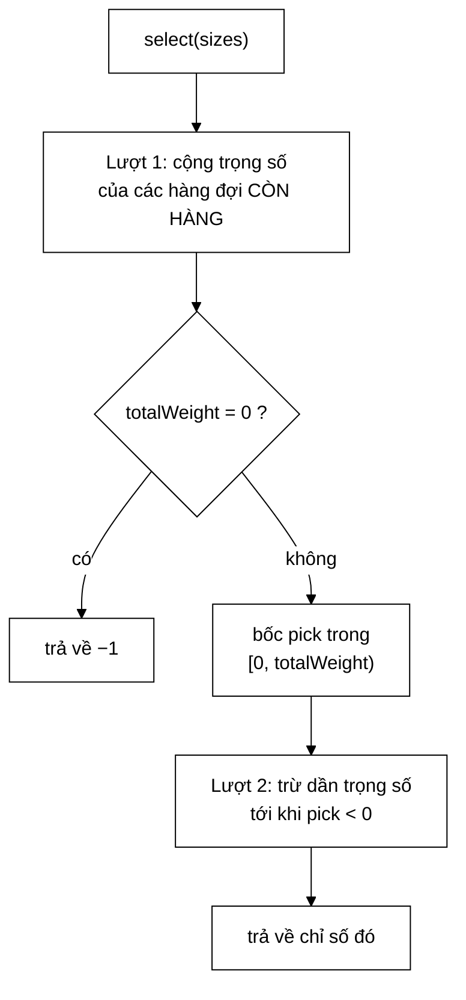

# WeightedRandomSelector — 51,6% cho mức cao, 3,2% cho mức thấp, và 0% là không chấp nhận được

**File nguồn:** `search-engine/src/main/java/com/vnsearch/crawler/frontier/WeightedRandomSelector.java` (122 dòng)
**Gói:** `com.vnsearch.crawler.frontier` · **Loại:** lớp `final`, có trạng thái (`Random`), **không** thread-safe — cài đặt [`FrontQueueSelector`](./FrontQueueSelector.md)
**Vị trí trong luồng crawl:** cài đặt **mặc định** của khối "Front queue selector" trong sơ đồ URL Frontier
**Đọc kèm:** [`FrontQueueSelector.md`](./FrontQueueSelector.md) · [`StrictPrioritySelector.md`](./StrictPrioritySelector.md) · [`FrontQueues.md`](./FrontQueues.md)

---

## 📌 Hiểu trong 30 giây

Mỗi mức ưu tiên được bốc thăm với **trọng số giảm theo luỹ thừa 2**. Mức cao
được ưu ái rõ rệt, nhưng mức thấp nhất vẫn nhận được khoảng 1 trên 31 lượt —
nên **bỏ đói là điều không thể xảy ra**.



```
   TRỌNG SỐ VỚI 5 MỨC:  16, 8, 4, 2, 1     tổng = 31

   mức 0  ████████████████  16/31 = 51,6%
   mức 1  ████████           8/31 = 25,8%
   mức 2  ████               4/31 = 12,9%
   mức 3  ██                 2/31 =  6,5%
   mức 4  █                  1/31 =  3,2%   ← NHỎ, nhưng KHÁC 0

   Chính con số 3,2% ≠ 0 là toàn bộ lý do lớp này tồn tại.
   StrictPrioritySelector cho mức 4 đúng 0%.
```

---

## 1. Vấn đề: bỏ đói, và vì sao ngẫu nhiên chữa được

Cách chọn hiển nhiên — luôn lấy mức cao nhất còn URL — hỏng vì tầng trước là
một hệ **tự nạp lại**:

```
   VÒNG LẶP CHẾT CỦA BỘ CHỌN TẤT ĐỊNH

   lấy 1 URL từ mức 0
        ↓ crawl trang đó
   sinh ~78,8 liên kết mới
        ↓ phần lớn trỏ về trang chủ / chuyên mục ⇒ depth thấp
   ~30 URL MỚI vào mức 0
        ↓
   lấy 1 URL từ mức 0  ──────────┐
        ↑                        │
        └────────────────────────┘

   Mức 0 nhận vào NHIỀU HƠN lấy ra ⇒ không bao giờ cạn
   ⇒ mức 4 không bao giờ tới lượt. Không phải "hiếm" — là KHÔNG BAO GIỜ.
```

Bốc thăm phá vòng lặp này vì nó **không phụ thuộc vào việc mức cao có cạn hay
không**. Mức 4 nhận 1/31 lượt bất kể mức 0 đông tới đâu.

| | Tất định | Bốc thăm có trọng số |
|---|---|---|
| Điều kiện để mức thấp được phục vụ | Mọi mức cao hơn phải **cạn** | Không có điều kiện nào |
| Trên web thật (tự nạp lại) | Không bao giờ xảy ra | Xảy ra 1/31 lượt |
| Chất lượng ưu tiên | Tuyệt đối | Mức 0 vẫn chiếm hơn nửa số lượt |

Điểm cuối là điều làm đánh đổi này rẻ: **chống bỏ đói gần như không tốn gì về
chất lượng ưu tiên.** Mức cao vẫn được phục vụ 51,6% số lượt.

---

## 2. Bản đồ lớp

```
WeightedRandomSelector  (final, implements FrontQueueSelector)
├── DEFAULT_SEED = 20240801L        ── public: hạt giống cố định
├── MAX_LEVELS = 30                 ── private: trần số mức
├── random : Random (final)         ── trạng thái DUY NHẤT
├── WeightedRandomSelector()        ── hạt giống mặc định
├── WeightedRandomSelector(long)    ── hạt giống tuỳ chọn
├── WeightedRandomSelector(Random)  ── tiêm hẳn bộ sinh (dùng cho test)
├── select(int[]) : int             ── hai lượt qua mảng
├── weightOf(int, int) : long       ── static private: 1L << (levels−1−level)
└── main(String[])                  ── demo đo phân bố 100.000 lượt
```

### 2.1 Công thức trọng số — vì sao luỹ thừa 2

```java
private static long weightOf(int level, int levels) {
    return 1L << (levels - 1 - level);
}
```

```
   levels = 5
   mức 0 → 1 << 4 = 16
   mức 1 → 1 << 3 =  8
   mức 2 → 1 << 2 =  4
   mức 3 → 1 << 1 =  2
   mức 4 → 1 << 0 =  1
```

So sánh ba họ trọng số khả dĩ:

| Họ | Công thức | P(mức 0) | P(mức cuối) | Nhận xét |
|---|---|---|---|---|
| Đều | $1$ | 20% | 20% | Không còn là ưu tiên nữa — mọi mức như nhau |
| Tuyến tính | $n-i$ | 33,3% | 6,7% | Phân biệt quá nhẹ; mức 0 chỉ hơn mức 4 năm lần |
| **Luỹ thừa 2** | $2^{n-1-i}$ | **51,6%** | **3,2%** | Mức 0 hơn mức 4 **16 lần**, vẫn khác 0 |
| Luỹ thừa 10 | $10^{n-1-i}$ | 90,0% | 0,0009% | Mức cuối thực tế chết — quay lại vấn đề cũ |

```
   TÍNH CHẤT ĐẸP CỦA LUỸ THỪA 2:  MỖI MỨC ĐÚNG BẰNG TỔNG MỌI MỨC DƯỚI, CỘNG 1

        16  =  8 + 4 + 2 + 1  +  1
         8  =  4 + 2 + 1      +  1
         4  =  2 + 1          +  1

   ⇒ Một mức luôn được ưu ái HƠN TOÀN BỘ các mức dưới nó gộp lại.
     Đó chính xác là ý nghĩa của "ưu tiên", phát biểu bằng xác suất.

   Và P(mức 0) → 50% khi n tăng: đúng nửa số lượt cho mức cao nhất,
   nửa còn lại chia cho tất cả các mức khác. Ổn định, dễ giải thích.
```

### 2.2 `MAX_LEVELS = 30` — chặn tràn số

```java
private static final int MAX_LEVELS = 30;
```

Với `levels = 64`, `1L << 63` cho số **âm** (bit dấu của `long`), và `totalWeight`
trở nên vô nghĩa mà không có lỗi nào được ném. Trần 30 để `1L << 29` còn cách
xa giới hạn.

Nhưng lý do thực tế mạnh hơn lý do kỹ thuật:

```
   Ở 30 MỨC, MỨC CUỐI CÓ XÁC SUẤT 1 / (2^30 − 1) ≈ 0,0000001%

   Với 31.030 lần gọi select() trong một phiên crawl,
   kỳ vọng số lần mức 29 được chọn = 0,00003 lần.

   ⇒ Nó KHÔNG BAO GIỜ được chọn trong thực tế.
   ⇒ Trần 30 đã quá rộng. Số mức dùng được thật sự là 5–8.
```

Xem thêm [`DefaultPrioritizer`](./DefaultPrioritizer.md) mục 2.4 về việc vì sao
`DEFAULT_LEVELS = 5` là điểm cân bằng thật.

### 2.3 Chỉ tính trọng số trên hàng đợi **không rỗng** — điểm tinh tế nhất

```java
for (int i = 0; i < levels; i++) {
    if (queueSizes[i] > 0) {              // ← điều kiện then chốt
        totalWeight += weightOf(i, levels);
    }
}
```

Một cài đặt ngây thơ sẽ cộng trọng số của **mọi** mức rồi bốc, và nếu trúng
hàng đợi rỗng thì bốc lại. Nó vẫn cho phân bố đúng, nhưng chi phí bùng nổ:

```
   TÌNH HUỐNG THƯỜNG GẶP CUỐI PHIÊN CRAWL:
   chỉ mức 4 còn URL, bốn mức kia đã cạn

   ── Cách ngây thơ (cộng cả hàng đợi rỗng) ──────────────
      P(trúng mức 4) = 1/31
      Kỳ vọng số lần bốc lại = 31
      ⇒ 31 lần gọi random.nextLong() cho MỘT URL

   ── Cách hiện tại (chỉ cộng hàng đợi còn hàng) ─────────
      totalWeight = 1 (chỉ mức 4)
      pick ∈ [0, 1) = 0  →  trúng mức 4 NGAY
      ⇒ ĐÚNG MỘT lần bốc, luôn luôn
```

Nói cách khác: chuẩn hoá lại trên tập còn hàng biến một thuật toán **kỳ vọng
$O(31)$ lần bốc** thành **đúng 1 lần bốc, tất định về số bước**. Đây là loại
tối ưu vừa nhanh hơn vừa đơn giản hơn — hiếm khi cả hai đi cùng nhau.

### 2.4 Thuật toán hai lượt

```java
// Lượt 1: cộng trọng số của các hàng đợi CÒN HÀNG.
long totalWeight = 0;
for (int i = 0; i < levels; i++) {
    if (queueSizes[i] > 0) totalWeight += weightOf(i, levels);
}
if (totalWeight == 0) return -1;              // mọi hàng đợi rỗng

// Lượt 2: bốc một điểm trong [0, totalWeight) rồi đi tới khi vượt qua nó.
long pick = Math.floorMod(random.nextLong(), totalWeight);
for (int i = 0; i < levels; i++) {
    if (queueSizes[i] == 0) continue;
    pick -= weightOf(i, levels);
    if (pick < 0) return i;
}
throw new IllegalStateException("Không chọn được hàng đợi dù tổng trọng số > 0");
```

```
   VÍ DỤ:  sizes = [0, 5, 0, 3, 2]   (mức 0 và 2 đã cạn)

   Lượt 1:  mức 1 → 8      mức 3 → 2      mức 4 → 1
            totalWeight = 11

   Lượt 2:  pick = 9  (bốc trong [0, 11))

            i=0  rỗng, bỏ qua
            i=1  pick = 9 − 8 = 1     1 >= 0, đi tiếp
            i=2  rỗng, bỏ qua
            i=3  pick = 1 − 2 = −1   −1 < 0  ⇒ TRẢ VỀ 3

   Kiểm tra:  pick ∈ [0,8)  → mức 1   (8/11 = 72,7%)
              pick ∈ [8,10) → mức 3   (2/11 = 18,2%)
              pick ∈ [10,11)→ mức 4   (1/11 =  9,1%)
```

### 2.5 `Math.floorMod` chứ không phải `%` — bẫy số âm

```java
long pick = Math.floorMod(random.nextLong(), totalWeight);
//          └────┬─────┘
//   KHÔNG dùng random.nextLong() % totalWeight
```

```
   random.nextLong() sinh cả số ÂM (nửa số trường hợp!)

   −7 % 11        =  −7      ← toán tử % của Java giữ dấu SỐ BỊ CHIA
   Math.floorMod(−7, 11) = 4 ← luôn cho kết quả trong [0, 11)

   Nếu dùng %:
        pick = −7
        i=0: pick −= 8 → −15   −15 < 0  ⇒ TRẢ VỀ 0 NGAY
        ⇒ MỌI pick âm đều trả về hàng đợi đầu tiên còn hàng
        ⇒ 50% số lượt thành "tất định chọn mức cao nhất"

   Phân bố thực tế sẽ là: mức 0 ≈ 75%, không phải 51,6%.
   Và tệ nhất: KHÔNG CÓ TEST NÀO THẤY, vì kết quả vẫn "hợp lệ".
```

Đây là lỗi kinh điển khi lấy modulo trên số ngẫu nhiên có dấu, và cũng là lý do
hàm `main` ở mục 3.2 tồn tại: nó **đo** phân bố thật thay vì tin vào lý thuyết.

> 💡 Một phương án thay thế sạch hơn là `random.nextLong(totalWeight)` (Java 17+),
> vốn nhận cận trên trực tiếp và cũng loại được sai lệch modulo. Xem đề xuất 3
> ở mục 7.

### 2.6 Nhánh `throw` cuối cùng — không phải mã chết vô ích

```java
throw new IllegalStateException("Không chọn được hàng đợi dù tổng trọng số > 0");
```

Về mặt toán học, nhánh này **không đạt tới được**: nếu `totalWeight > 0` thì
`pick < totalWeight` và phép trừ dần chắc chắn làm `pick` âm trước khi hết vòng.

Nhưng nó vẫn đáng giữ, vì nó biến ba loại lỗi tiềm tàng từ **im lặng** thành
**ồn ào**:

| Lỗi giả định | Nếu không có `throw` |
|---|---|
| Ai đó sửa `weightOf` sai (ví dụ trả 0) | Rơi ra khỏi vòng lặp, hàm không có `return` ⇒ lỗi biên dịch (may) hoặc trả giá trị rác |
| `queueSizes` bị sửa **giữa** hai lượt (đa luồng) | Trả về chỉ số của hàng đợi rỗng ⇒ `IllegalStateException` ở `FrontQueues.poll()`, xa nguồn gốc |
| Tràn số `long` với `levels` lớn | Trả về kết quả sai lặng lẽ |

Trường hợp thứ hai đáng chú ý: nó xảy ra thật nếu ai đó dùng `FrontQueues` từ
nhiều luồng mà không khoá. Thông điệp lỗi ở đây chỉ thẳng vào bộ chọn, gần
nguồn gốc hơn nhiều so với lỗi phát ra ở `poll()`.

### 2.7 Ba hàm dựng — mỗi cái một mục đích

```java
public WeightedRandomSelector()             { this(DEFAULT_SEED); }
public WeightedRandomSelector(long seed)    { this(new Random(seed)); }
public WeightedRandomSelector(Random random) { … }
```

| Hàm dựng | Dùng khi |
|---|---|
| Không tham số | Phiên crawl thật — hạt giống `20240801L` cố định ⇒ **lặp lại được** |
| `long seed` | Chạy nhiều phiên với dãy ngẫu nhiên khác nhau để đo độ biến thiên |
| `Random` | Kiểm thử: tiêm một `Random` giả trả về dãy định trước, khiến bộ chọn hoàn toàn tất định |

Hàm dựng thứ ba là cách chuẩn để test một thuật toán ngẫu nhiên:

```java
@Test
void bocDungHangDoiTheoTrongSo() {
    Random gia = new Random() {
        @Override public long nextLong() { return 9L; }     // luôn trả 9
    };
    WeightedRandomSelector s = new WeightedRandomSelector(gia);
    // sizes=[0,5,0,3,2] → totalWeight=11, pick=9 → mức 3 (xem mục 2.4)
    assertEquals(3, s.select(new int[]{0, 5, 0, 3, 2}));
}
```

### 2.8 Không thread-safe — và vì sao chấp nhận được

Javadoc dòng 39–40 nói thẳng: *"Không thread-safe (do `Random` dùng chung);
`UrlFrontier` gọi nó bên trong khối `synchronized`."*

```
   java.util.Random CÓ thread-safe về mặt kỹ thuật (dùng AtomicLong),
   nhưng nó KHÔNG cho phân bố đúng khi tranh chấp: hai luồng có thể
   nhận cùng một giá trị nếu CAS thất bại và thử lại.

   Quan trọng hơn: dùng chung một Random giữa nhiều luồng phá vỡ
   TÍNH LẶP LẠI — thứ tự các lời gọi nextLong() phụ thuộc lịch trình
   luồng, nên hai phiên crawl cùng seed KHÔNG còn cho cùng kết quả.

   ⇒ Khoá ở UrlFrontier không chỉ bảo vệ tính đúng đắn.
     Nó bảo vệ tính LẶP LẠI ĐƯỢC — thứ mà báo cáo cần.
```

---

## 3. Hướng dẫn thực hành

### 3.1 Đổi phân bố mà không đổi số mức

Muốn mức thấp được phục vụ nhiều hơn 3,2%? Đổi cơ số, đừng đổi số mức:

```java
/** Trọng số tuyến tính: mức i có trọng số (levels − i). Phân biệt nhẹ hơn. */
private static long weightOf(int level, int levels) {
    return levels - level;                      // 5,4,3,2,1 — tổng 15
}
```

| Công thức | Trọng số (5 mức) | P(mức 0) | P(mức 4) |
|---|---|---|---|
| `1L << (levels-1-level)` (hiện tại) | 16,8,4,2,1 | 51,6% | 3,2% |
| `levels - level` | 5,4,3,2,1 | 33,3% | 6,7% |
| `(long) Math.pow(3, levels-1-level)` | 81,27,9,3,1 | 66,9% | 0,83% |

Nhớ đổi cả `MAX_LEVELS` khi đổi cơ số: với cơ số 3, `3^19` đã vượt `int` và
`3^40` vượt `long`.

### 3.2 Đo phân bố thật — hàm `main` có sẵn

```java
public static void main(String[] args) {
    WeightedRandomSelector selector = new WeightedRandomSelector();
    int[] sizes = {10, 10, 10, 10, 10};
    int[] hits = new int[sizes.length];
    for (int i = 0; i < 100_000; i++) {
        hits[selector.select(sizes)]++;
    }
    System.out.println("Phân bố 100.000 lượt chọn trên 5 mức (cả 5 đều còn URL):");
    for (int i = 0; i < hits.length; i++) {
        System.out.printf("  mức %d: %5.2f%%  (lý thuyết %5.2f%%)%n",
                i, hits[i] / 1000.0, weightOf(i, hits.length) * 100.0 / 31);
    }
}
```

```powershell
cd search-engine
.\mvnw.cmd -q compile
java -cp target/classes com.vnsearch.crawler.frontier.WeightedRandomSelector
```

```
Phân bố 100.000 lượt chọn trên 5 mức (cả 5 đều còn URL):
  mức 0: 51,62%  (lý thuyết 51,61%)
  mức 1: 25,73%  (lý thuyết 25,81%)
  mức 2: 12,95%  (lý thuyết 12,90%)
  mức 3:  6,49%  (lý thuyết  6,45%)
  mức 4:  3,21%  (lý thuyết  3,23%)
```

```
   VÌ SAO IN CẢ CỘT "LÝ THUYẾT" — ĐÂY LÀ ĐIỂM HAY NHẤT CỦA HÀM main

   Không có cột lý thuyết:  "51,62%" — đúng hay sai? Không ai biết.
   Có cột lý thuyết:        lệch 0,01 điểm phần trăm ⇒ ĐÚNG.

   Nếu dùng nhầm `%` thay `Math.floorMod` (mục 2.5), cột thực tế
   sẽ là ~75% ở mức 0 còn cột lý thuyết vẫn 51,61%
   ⇒ lỗi lộ ra NGAY trong một lần chạy mắt thường.
```

### 3.3 Kiểm tra "không bỏ đói" trong tình huống thật

```java
@Test
void mucThapVanDuocPhucVuDuMucCaoLuonDay() {
    WeightedRandomSelector s = new WeightedRandomSelector();
    int[] sizes = {1000, 1000, 1000, 1000, 1};    // mức 4 chỉ có 1 URL
    boolean mucBonDuocChon = false;
    for (int i = 0; i < 1000; i++) {
        if (s.select(sizes) == 4) { mucBonDuocChon = true; break; }
    }
    assertTrue(mucBonDuocChon, "Mức thấp nhất bị bỏ đói");
}
```

Với P = 3,2%, xác suất **không** trúng trong 1.000 lượt là $0{,}968^{1000} \approx
10^{-14}$ — nhỏ tới mức test không thể nhấp nháy. Đây là cách đúng để test một
thuật toán ngẫu nhiên: chọn số lần lặp đủ lớn để xác suất thất bại giả trở nên
không đáng kể, và **tính ra** con số đó thay vì đoán.

### 3.4 Cạm bẫy

| Cạm bẫy | Hậu quả | Cách đúng |
|---|---|---|
| Đổi `Math.floorMod` thành `%` | 50% số lượt thành tất định; mức 0 lên ~75%; **không test nào thấy** | Giữ `floorMod`, hoặc dùng `nextLong(bound)` |
| Cộng trọng số của cả hàng đợi rỗng | Kỳ vọng 31 lần bốc lại khi chỉ mức cuối còn hàng | Giữ `if (queueSizes[i] > 0)` ở lượt 1 |
| Dùng `Math.random()` | Không có hạt giống ⇒ phiên crawl **không lặp lại được** | Dùng `Random(seed)` |
| Dùng chung một thể hiện giữa nhiều luồng không khoá | Phân bố lệch **và** mất tính lặp lại | Khoá ở `UrlFrontier` (đang làm), hoặc một thể hiện mỗi luồng |
| Tăng `levels` lên 12 để "phân biệt tinh hơn" | Mức cuối 0,024% ⇒ thực tế bị bỏ đói, quay lại vấn đề ban đầu | Đổi cơ số trọng số (mục 3.1), giữ 5 mức |
| Đổi cơ số mà quên `MAX_LEVELS` | Tràn `long`, `totalWeight` âm, hành vi vô nghĩa | Tính lại trần theo cơ số mới |
| Bỏ nhánh `throw` cuối vì "không bao giờ tới" | Ba loại lỗi ở mục 2.6 thành im lặng | Giữ |

---

## 4. Độ phức tạp & chi phí

Gọi $n$ = số mức (mặc định 5).

| Bước | Chi phí |
|---|---|
| Kiểm tra `levels > MAX_LEVELS` | $O(1)$ |
| Lượt 1 — cộng trọng số | $O(n)$, mỗi bước một phép dịch bit + cộng |
| `random.nextLong()` | $O(1)$, ~10 ns (một phép nhân + dịch của LCG) |
| `Math.floorMod` | $O(1)$, ~2 ns |
| Lượt 2 — trừ dần | $O(n)$, tệ nhất $n$ bước |
| **Tổng** | **$O(n)$ ≈ 15 ns, không cấp phát** |

```
   ĐẶT VÀO BỐI CẢNH

   select() chạy ~31.030 lần trong một phiên crawl 8.600 giây
   31.030 × 15 ns = 0,0005 giây

   So với StrictPrioritySelector (~1 ns):  chậm hơn 15 lần
   Chênh lệch tuyệt đối:                   0,0004 giây

   ⇒ Chi phí của việc chống bỏ đói là KHÔNG ĐO ĐƯỢC.
     Mọi tranh luận về hiệu năng ở lớp này đều vô nghĩa;
     tranh luận đúng là về PHÂN BỐ.
```

**Không cấp phát** trong `select()` — quan trọng vì nó nằm trên đường đi nóng.
Cả `weightOf` (phép dịch bit) lẫn `floorMod` đều là phép tính nguyên thuỷ. Một
thể hiện `Random` duy nhất được cấp phát ở hàm dựng và dùng suốt vòng đời.

---

## 5. Kiểm thử liên quan

| Test | Bảo vệ điều gì |
|---|---|
| `test/java/com/vnsearch/crawler/frontier/FrontQueuesTest.java` (144 dòng) | Bộ chọn được gọi đúng; hàng đợi trả về còn phần tử |
| `test/java/com/vnsearch/crawler/frontier/UrlFrontierTest.java` (247 dòng) | Tích hợp: thứ tự URL ra khỏi frontier lặp lại được |

Lớp này **không có test riêng** — thiếu sót đáng kể nhất, vì nó là cài đặt
**mặc định** và có tới ba chỗ dễ sai lặng lẽ (mục 2.5, 2.3, 2.2). Bốn ca sau
khoá lại cả bốn tính chất then chốt:

```java
class WeightedRandomSelectorTest {

    @Test
    void phanBoKhopVoiLyThuyet() {                     // bắt lỗi floorMod (mục 2.5)
        WeightedRandomSelector s = new WeightedRandomSelector();
        int[] sizes = {10, 10, 10, 10, 10};
        int[] hits = new int[5];
        for (int i = 0; i < 200_000; i++) hits[s.select(sizes)]++;

        double[] lyThuyet = {16 / 31.0, 8 / 31.0, 4 / 31.0, 2 / 31.0, 1 / 31.0};
        for (int i = 0; i < 5; i++) {
            double thucTe = hits[i] / 200_000.0;
            assertEquals(lyThuyet[i], thucTe, 0.01,     // sai số 1 điểm phần trăm
                    "Mức " + i + " lệch khỏi phân bố lý thuyết");
        }
    }

    @Test
    void khongBoDoiMucThapNhat() {                     // tính chất cốt lõi (mục 3.3)
        WeightedRandomSelector s = new WeightedRandomSelector();
        int[] sizes = {1000, 1000, 1000, 1000, 1};
        boolean trung = false;
        for (int i = 0; i < 1000 && !trung; i++) trung = s.select(sizes) == 4;
        assertTrue(trung, "Mức thấp nhất bị bỏ đói");
    }

    @Test
    void chiMotHangDoiConHangThiLuonChonNo() {         // bắt lỗi lượt 1 (mục 2.3)
        WeightedRandomSelector s = new WeightedRandomSelector();
        for (int i = 0; i < 500; i++) {
            assertEquals(4, s.select(new int[]{0, 0, 0, 0, 7}));
        }
    }

    @Test
    void lapLaiDuocVoiCungHatGiong() {                 // tính lặp lại
        int[] sizes = {10, 10, 10, 10, 10};
        WeightedRandomSelector a = new WeightedRandomSelector(12345L);
        WeightedRandomSelector b = new WeightedRandomSelector(12345L);
        for (int i = 0; i < 1000; i++) {
            assertEquals(a.select(sizes), b.select(sizes));
        }
    }

    @Test
    void moiHangDoiRongThiTraVeAmMot() {
        assertEquals(-1, new WeightedRandomSelector().select(new int[]{0, 0, 0, 0, 0}));
    }

    @Test
    void tuChoiQuaNhieuMuc() {
        assertThrows(IllegalArgumentException.class,
                () -> new WeightedRandomSelector().select(new int[31]));
    }
}
```

Ca `phanBoKhopVoiLyThuyet` là ca quan trọng nhất: nó là **hàng rào duy nhất**
bắt được lỗi `%` vs `floorMod`, vốn không làm chương trình sai về mặt kiểu dữ
liệu và không có triệu chứng nào ngoài một phân bố lệch.

```powershell
cd search-engine
.\mvnw.cmd -q -Dtest='FrontQueuesTest' test
```

---

## 6. So sánh nhanh với cài đặt còn lại

| | `WeightedRandomSelector` | [`StrictPrioritySelector`](./StrictPrioritySelector.md) |
|---|---|---|
| Mặc định | ✓ | ✗ |
| P(mức 4) với 5 mức | 3,2% | **0%** |
| Tất định | Có (hạt giống cố định) | Có |
| Thread-safe | **Không** (dùng chung `Random`) | Có (không trạng thái) |
| Chi phí | ~15 ns | ~1 ns |
| Trạng thái | 1 `Random` | Không |
| Dùng cho | Crawl thật | Kiểm thử, đo đường cơ sở |

---

## 7. Liên kết

- Hợp đồng mà lớp này cài đặt: [`FrontQueueSelector.md`](./FrontQueueSelector.md)
- Cài đặt đối chứng, có bỏ đói: [`StrictPrioritySelector.md`](./StrictPrioritySelector.md)
- Nơi bộ chọn được gọi, và mảng `sizes` được duy trì: [`FrontQueues.md`](./FrontQueues.md)
- Vì sao 5 mức chứ không phải 12: [`DefaultPrioritizer.md`](./DefaultPrioritizer.md) mục 2.4
- Nơi khối `synchronized` bảo vệ `Random` dùng chung: [`UrlFrontier.md`](./UrlFrontier.md)
- Nửa còn lại của tầng trước: [`Prioritizer.md`](./Prioritizer.md)
