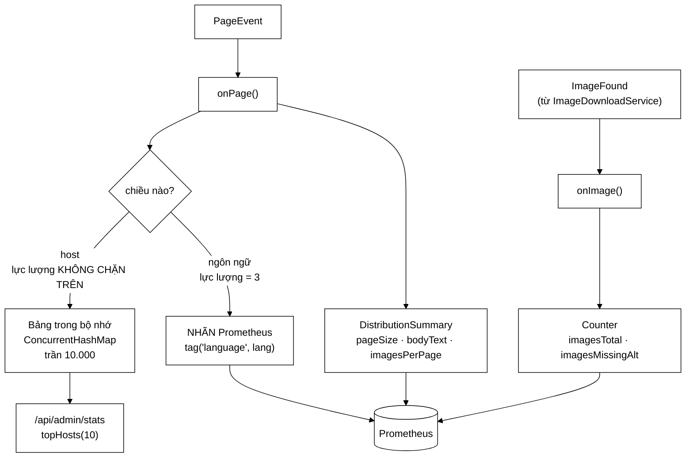

# CrawlAnalyticsService — vì sao `host` tuyệt đối không được làm nhãn Prometheus

**File nguồn:** `search-engine/src/main/java/com/vnsearch/crawler/modular/CrawlAnalyticsService.java` (286 dòng)
**Gói:** `com.vnsearch.crawler.modular` · **Loại:** `class`, cài [`PageEventHandler`](../bus/PageEventHandler.md)
**Vị trí trong sơ đồ:** **Modular Service 3 — "Analytics Service"**
**Đọc kèm:** [`../../config/MetricsConfig.md`](../../config/MetricsConfig.md) · [`../bus/ImageFound.md`](../bus/ImageFound.md)

---

## 📌 Hiểu trong 30 giây

Khối này **chưa từng tồn tại** trong dự án. Trước đây số liệu crawl nằm rải rác
trong bộ đếm của từng khối (`HtmlDownloader.downloaded`,
`ContentSeenFilter.duplicates`…) — chỉ đọc được bằng cách gọi getter **từ trong
cùng một JVM**, và **biến mất khi phiên crawl kết thúc**.

Service này biến chúng thành thang đo Prometheus: còn lại sau khi phiên kết
thúc, vẽ được theo thời gian, đặt cảnh báo được.

Và nó chứa quyết định quan trọng nhất về đo lường trong cả dự án:

> **`host` KHÔNG được làm nhãn Prometheus.** Đó là cái bẫy phổ biến nhất khi
> người ta lần đầu gắn thang đo, và là cách kinh điển để giết một máy chủ
> Prometheus.



```
   TRƯỚC / SAU

   TRƯỚC:  crawler.getDownloadedCount()     ← chỉ trong JVM
           filter.getDuplicateCount()        ← mất khi tắt
           → không vẽ được, không cảnh báo được, không so sánh
             được giữa hai phiên

   SAU:    vnsearch_crawl_pages_total
           vnsearch_crawl_page_size_bytes_bucket{le="..."}
           vnsearch_crawl_pages_by_language_total{language="vi"}
           → còn lại sau khi phiên kết thúc
           → vẽ theo thời gian, đặt cảnh báo
```

---

## 1. Bẫy lực lượng nhãn — quyết định trung tâm

Javadoc dòng 31–55.

### 1.1 Đoạn mã trông rất tự nhiên

```java
// SAI — KHÔNG có trong mã thật
Counter.builder("crawl.pages").tag("host", host).register(registry).increment();
```

```
   VÌ SAO SAI:

   Prometheus tạo MỘT CHUỖI THỜI GIAN RIÊNG cho MỖI tổ hợp nhãn.

        crawl_pages_total{host="vnexpress.net"}    ← chuỗi 1
        crawl_pages_total{host="tuoitre.vn"}       ← chuỗi 2
        crawl_pages_total{host="blog-abc.vn"}      ← chuỗi 3
        ...

   Mỗi chuỗi tốn ~1-3 KB bộ nhớ THƯỜNG TRÚ trên máy chủ Prometheus.

   Một phiên crawl chạm 30.000 host phân biệt:
        30.000 chuỗi × 2 KB  ≈  60 MB
        từ MỘT thang đo duy nhất.

   Và đó chỉ là một thang đo. Nếu gắn nhãn host cho cả pageSize,
   bodyText, images... thì nhân lên 5.
```

### 1.2 Điểm mấu chốt: lực lượng **không chặn trên được**

```
   ┌──────────────────────────────────────────────────────────────┐
   │  host là dữ liệu DO BÊN NGOÀI QUYẾT ĐỊNH.                     │
   │                                                              │
   │  Crawler KHÔNG kiểm soát được nó sẽ gặp bao nhiêu host.       │
   │     - một trang trỏ ra 50 site lạ                            │
   │     - một site dùng subdomain động: a1.cdn.x.vn, a2.cdn.x.vn │
   │     - một site bị lỗi sinh ra hàng nghìn subdomain rác        │
   │                                                              │
   │  ⇒ Đây là nhãn có lực lượng KHÔNG CHẶN TRÊN ĐƯỢC.            │
   │  ⇒ Không có con số nào để nói "tối đa sẽ là N chuỗi".        │
   └──────────────────────────────────────────────────────────────┘

   Đây là khác biệt then chốt so với một nhãn lớn nhưng CÓ TRẦN
   (ví dụ "mã lỗi HTTP": nhiều, nhưng tối đa ~60 giá trị).
```

Hậu quả cuối cùng của một nhãn không chặn trên: **cardinality explosion** — máy
chủ Prometheus tiêu hết RAM, OOM, và **mất luôn cả những thang đo đang hoạt động
tốt**. Một thang đo làm sập cả hệ thống giám sát là kịch bản tệ nhất, vì nó phá
đúng thứ đáng ra phải cảnh báo cho ta.

### 1.3 Cách làm ở đây

| Chiều | Lực lượng | Đi đâu |
|---|---|---|
| ngôn ngữ | 3 (`vi`, `en`, `und`) | **Nhãn Prometheus** |
| host | không chặn trên | Bảng trong bộ nhớ, có trần, phơi qua API quản trị |

```
   ┌──────────────────────────────────────────────────────────────┐
   │  NGUYÊN TẮC RÚT RA (Javadoc dòng 54-55)                       │
   │                                                              │
   │  Nhãn dành cho chiều có LỰC LƯỢNG NHỎ và BIẾT TRƯỚC;         │
   │  chiều lực lượng lớn thì TỔNG HỢP TRƯỚC KHI PHƠI.            │
   └──────────────────────────────────────────────────────────────┘

   Áp dụng thực tế — câu hỏi cần hỏi trước khi thêm một nhãn:

        "Tôi có thể viết ra con số N — số giá trị TỐI ĐA
         mà nhãn này sẽ nhận — không?"

        Viết được (HTTP status: 60, ngôn ngữ: 3)   → nhãn được
        Không viết được (host, url, user_id, ip)   → KHÔNG
```

Danh sách "tuyệt đối không làm nhãn" trong hệ thống thật: `url`, `host`,
`user_id`, `session_id`, `ip`, `email`, `trace_id`, timestamp, và bất kỳ thứ gì
do người dùng nhập.

### 1.4 Vì sao ngôn ngữ vẫn dùng `Map` dù chỉ có 3 giá trị

```java
private final Map<String, Counter> pagesByLanguage = new ConcurrentHashMap<>();
```

Javadoc dòng 85–87 giải thích: *"Vẫn dùng map để không phải sửa mã khi
`LanguageFilter` nhận thêm một mã ngôn ngữ."*

```
   Ba Counter khai báo cứng:
        ✔ đơn giản nhất
        ✘ thêm "zh" vào LanguageFilter → PHẢI sửa lớp này
        ✘ và nếu quên, trang tiếng Trung không được đếm ở đâu cả

   Map + computeIfAbsent:
        ✔ tự sinh Counter khi gặp mã mới
        ✔ hai lớp tiến hoá độc lập
        ✘ về lý thuyết là nhãn không chặn trên...

   ...NHƯNG lực lượng bị chặn bởi LanguageFilter — nó chỉ trả về
   những mã trong danh sách của nó. Đây là chặn trên GIÁN TIẾP
   nhưng THẬT.

   ⇒ Khác hẳn host: host bị chặn bởi... không gì cả.
```

Đây là điểm tinh tế đáng nêu: cái quyết định an toàn không phải là "dùng map hay
không", mà là **nguồn của giá trị có bị chặn hay không**.

---

## 2. Trần cho bảng host

Javadoc dòng 57–63.

```java
public static final int MAX_TRACKED_HOSTS = 10_000;
```

```
   NẾU KHÔNG CÓ TRẦN:
        ta chỉ CHUYỂN bài toán nổ bộ nhớ từ Prometheus sang JVM của mình.

        30.000 host × (String ~40 B + LongAdder ~100 B + chi phí map ~50 B)
             ≈ 5,7 MB      ← chưa chết, nhưng không chặn được
        300.000 host        ← có thể, nếu gặp site sinh subdomain động
             ≈ 57 MB       ← bắt đầu đau
```

### 2.1 Chính sách khi đầy: giữ host **xuất hiện sớm**

```java
if (pagesByHost.size() >= MAX_TRACKED_HOSTS) {
    hostsDropped.incrementAndGet();
    return;                    // host mới KHÔNG được thêm
}
```

```
   VÌ SAO GIỮ HOST SỚM chứ không phải host NHIỀU TRANG NHẤT?

   Vì crawler đi theo BỀ RỘNG (BFS):
        depth 0:  các URL hạt giống          ← các site lớn, được chọn
        depth 1:  liên kết từ trang chủ      ← chuyên mục, site đối tác lớn
        depth 2:  bài viết
        depth 3+: liên kết ra ngoài, blog nhỏ, quảng cáo...

   ⇒ Host xuất hiện SỚM gần như LUÔN là host ĐÁNG QUAN TÂM.
   ⇒ Host xuất hiện muộn thường là rác ở rìa đồ thị.

   Chính sách "giữ cái đến trước" vừa ĐÚNG về mặt giá trị dữ liệu
   vừa RẺ nhất về cài đặt (không cần LRU, không cần so sánh).
```

Chi tiết quan trọng: **số trang của host bị bỏ vẫn vào tổng** (`pagesTotal` đã
tăng ở đầu `onPage`). Chỉ mất chi tiết theo host, không mất tổng. Đó là hành vi
đúng — nếu mất cả tổng thì con số tổng sẽ nói dối.

### 2.2 Cửa sổ đua được chấp nhận có ý thức

Chú thích dòng 217–221:

```
   Hai luồng cùng thấy size() == 9.999 và cùng thêm
        → bảng có 10.001 mục, VƯỢT TRẦN vài mục.

   CHẤP NHẬN ĐƯỢC. Vì sao:
        ① Đây là BẢNG THỐNG KÊ, không phải bất biến an toàn.
           Vượt trần 5 mục trên 10.000 = sai số 0,05%.
        ② Một khoá quanh đường nóng này ĐẮT HƠN NHIỀU:
           trackHost() được gọi 31.030 lần từ N worker thread.
           synchronized ở đây = tuần tự hoá mọi worker.

   ⇒ Đánh đổi ĐÚNG, và quan trọng là nó được GHI RA.

   ┌──────────────────────────────────────────────────────────────┐
   │  Một cuộc đua ĐƯỢC GHI CHÉP là một quyết định thiết kế.      │
   │  Một cuộc đua KHÔNG được ghi chép là một lỗi.                │
   │  Mã giống hệt nhau; khác nhau ở chỗ người sau có biết        │
   │  là nó cố ý hay không.                                       │
   └──────────────────────────────────────────────────────────────┘
```

### 2.3 Đường nhanh trước khi kiểm trần

```java
LongAdder counter = pagesByHost.get(host);
if (counter != null) {
    counter.increment();
    return;                    // ← ĐƯỜNG NHANH
}
// chỉ khi host MỚI mới kiểm trần
```

```
   Vì sao tách đường nhanh:

        Host đã có trong bảng: ~99,97% số lần gọi
             → chỉ một lần get() + increment(), KHÔNG kiểm size()

        Host mới: ~0,03%
             → mới phải gọi size() (trên ConcurrentHashMap, size() KHÔNG
               phải O(1) tuyệt đối — nó phải cộng các ô đếm)

   ⇒ Tránh gọi size() 31.030 lần khi chỉ cần gọi ~10.000 lần.
```

---

## 3. `LongAdder` vs `AtomicLong` — dùng đúng chỗ

Javadoc dòng 65–71.

```
   AtomicLong:  MỘT ô nhớ, mọi luồng CAS vào cùng ô
                → tranh chấp cache line
                → phần lớn thời gian trôi vào việc THỬ LẠI vòng CAS

   LongAdder:   NHIỀU ô (một Cell cho mỗi luồng khi có tranh chấp)
                → mỗi luồng ghi vào ô riêng, gần như không đụng nhau
                → cộng lại khi ĐỌC
```

Điểm hay của lớp này là nó dùng **cả hai**, đúng chỗ:

| Trường | Kiểu | Vì sao |
|---|---|---|
| `pagesByHost` values | `LongAdder` | Bị **mọi** worker ghi cho **mọi** trang — tranh chấp cao |
| `imagesOfPage` values | `LongAdder` | Ghi ~25 lần/trang từ nhiều luồng |
| `pagesTotal` | `AtomicLong` | Cũng ghi nhiều… nhưng cần đọc **chính xác tức thì** cho `Gauge` |
| `maxDepthSeen` | `AtomicLong` | Cần `updateAndGet` — `LongAdder` **không có** phép này |
| `hostsDropped` | `AtomicLong` | Ghi rất hiếm (chỉ khi đầy trần) |

```
   QUY TẮC CHỌN:

        Ghi rất nhiều + đọc hiếm + chỉ cần cộng     → LongAdder
        Cần đọc chính xác tức thì                    → AtomicLong
        Cần compare-and-set / updateAndGet          → AtomicLong (bắt buộc)
        Ghi hiếm                                     → AtomicLong (đơn giản hơn)
```

Lưu ý về `LongAdder.sum()`: nó **không** nguyên tử — nếu có luồng đang ghi trong
lúc đọc, kết quả có thể lệch. Với thống kê thì chấp nhận được; với một bất biến
thì không. Đó là lý do `pagesTotal` (con số được phơi làm `Gauge` chính) dùng
`AtomicLong`.

---

## 4. Hướng dẫn về code

### 4.1 `DistributionSummary` chứ không chỉ trung bình — chú thích dòng 114–118

```java
this.pageSizeBytes = DistributionSummary.builder("vnsearch.crawl.page.size.bytes")
        .baseUnit("bytes")
        .publishPercentileHistogram()      // ← quan trọng
        .register(registry);
```

```
   VÌ SAO KHÔNG DÙNG TRUNG BÌNH:

   Phân bố kích thước trang có ĐUÔI RẤT DÀI (vài KB → vài MB).

        Kích thước    Số trang
        2-20 KB       ████████████████████  85%
        20-100 KB     ██████                12%
        100 KB-1 MB   ▌                      2,9%
        > 1 MB        ▏                      0,1%   ← đuôi

   Trung bình = 80 KB.
   Nhưng KHÔNG CÓ TRANG NÀO nặng 80 KB một cách điển hình —
   con số đó là kết quả của 85% trang nhỏ bị vài trang khổng lồ kéo lên.

   ⇒ "Trung bình của một phân bố đuôi dài không mô tả được trang nào cả."

   Với histogram:
        p50 = 12 KB    ← trang điển hình THẬT
        p95 = 180 KB
        p99 = 900 KB   ← ngưỡng cần theo dõi cho max.request.size
```

**Vì sao `publishPercentileHistogram()` chứ không `publishPercentiles()`:**

```
   publishPercentiles(0.5, 0.95, 0.99)
        → tính phân vị TẠI CHỖ, đẩy sang 3 con số
        ✘ KHÔNG CỘNG DỒN ĐƯỢC: trung bình của p95 từ 3 bản sao
          KHÔNG PHẢI p95 của cả hệ thống

   publishPercentileHistogram()
        → đẩy CẢ HISTOGRAM (các bucket _bucket{le="..."})
        ✔ Prometheus dùng histogram_quantile() cộng dồn từ nhiều bản sao
        ✔ đúng khi chạy N tiến trình crawler

   Cùng lý do đã ghi trong application.properties cho độ trễ HTTP.
```

Đây là lỗi rất phổ biến khi gắn thang đo trong hệ phân tán, và việc nó được
giải thích ngay tại chỗ là dấu hiệu tốt.

### 4.2 `Gauge` nhận **hàm**, không nhận giá trị — chú thích dòng 141–143

```java
Gauge.builder("vnsearch.crawl.pages.total", pagesTotal, AtomicLong::get)
//                                          ↑↑↑↑↑↑↑↑↑↑  ↑↑↑↑↑↑↑↑↑↑↑↑↑
//                                          đối tượng    HÀM lấy giá trị
        .register(registry);
```

```
   SAI:  Gauge.builder("x", () -> pagesTotal.get())   // vẫn chạy nhưng...
   SAI HƠN: đẩy một CON SỐ vào lúc khởi tạo
             → thang đo ĐÓNG BĂNG ở giá trị lúc đó (thường là 0)
             → dashboard hiển thị 0 mãi mãi
             → và không có gì báo lỗi

   ĐÚNG: truyền (đối tượng, hàm trích giá trị)
             → Micrometer giữ WEAK REFERENCE tới đối tượng
             → gọi hàm mỗi lần scrape

   ⚠ HỆ QUẢ CỦA WEAK REFERENCE: nếu đối tượng bị GC thu hồi,
     gauge trả NaN. Ở đây pagesTotal là trường final của service
     (sống suốt vòng đời) nên an toàn. Nhưng đăng ký gauge trên
     một biến cục bộ là lỗi kinh điển.
```

Ba `Gauge` ở đây minh hoạ ba nguồn giá trị khác nhau:

```java
Gauge.builder("...pages.total",     pagesTotal,  AtomicLong::get)  // ô đếm
Gauge.builder("...hosts.distinct",  pagesByHost, Map::size)        // kích thước bảng
Gauge.builder("...depth.max",       maxDepthSeen, AtomicLong::get) // giá trị cực trị
```

Cái thứ hai đáng chú ý: nó phơi **`Map::size`** — nghĩa là số host phân biệt
được đo trực tiếp từ cấu trúc dữ liệu, không cần một bộ đếm song song có thể
lệch. Và mô tả của nó ghi rõ *"chặn trên 10.000"* để người xem dashboard biết
con số này có trần.

### 4.3 `updateAndGet` chứ không phải if-rồi-set — chú thích dòng 180–181

```java
maxDepthSeen.updateAndGet(current -> Math.max(current, event.depth()));
```

```
   SAI (đọc-kiểm-ghi, KHÔNG nguyên tử):

        if (event.depth() > maxDepthSeen.get()) {
            maxDepthSeen.set(event.depth());
        }

   KỊCH BẢN ĐUA:
        maxDepthSeen = 3

        Luồng A: depth=5, đọc thấy 3, quyết định ghi 5
        Luồng B: depth=7, đọc thấy 3, quyết định ghi 7
        Luồng B ghi 7        → maxDepthSeen = 7
        Luồng A ghi 5        → maxDepthSeen = 5   ✘ GIÁ TRỊ LỚN HƠN BỊ MẤT

   updateAndGet: vòng CAS, thử lại cho tới khi thành công.
        → không bao giờ mất giá trị lớn hơn
```

Đây là lỗi đua kinh điển ("check-then-act"), và nó đặc biệt khó phát hiện với
một chỉ số cực trị vì kết quả sai vẫn **trông hợp lý**.

### 4.4 `onImage` — hai service gặp nhau **qua bus**, dòng 191–205

Javadoc dòng 193–197:

```
   ImageDownloadService  ──publishImage──▶  [ bus ]  ──▶  Analytics.onImage()

   KHÔNG PHẢI:
   ImageDownloadService  ──gọi thẳng──▶  analytics.onImage()

   VÌ SAO QUAN TRỌNG:
        Tắt Image Download đi (app.crawler.images.download=false hoặc
        không đăng ký service đó) → Analytics VẪN CHẠY BÌNH THƯỜNG,
        chỉ thiếu mấy con số về ảnh.
        KHÔNG có lời gọi nào gãy, không có null nào phải kiểm.

   Nếu gọi thẳng:
        → Analytics phải giữ tham chiếu tới ImageDownloadService
        → hoặc ngược lại
        → hai service PHỤ THUỘC nhau
        → và "modular" chỉ còn trên tên gọi
```

Chú ý: `onImage` **không** phải là phương thức của `PageEventHandler` — nó được
đăng ký riêng qua `bus.subscribeImages(analytics::onImage)`. Đó là lý do
`InProcessCrawlEventBus` có bốn danh sách đăng ký thay vì một.

### 4.5 `imagesOfPage` — gom số ảnh của một trang

```java
private final Map<String, LongAdder> imagesOfPage = new ConcurrentHashMap<>();
```

```
   BÀI TOÁN:  muốn đo "số ảnh trên mỗi trang" (imagesPerPage).
              Nhưng ảnh đến qua onImage() TỪNG CÁI MỘT,
              còn trang đến qua onPage().

   CÁCH LÀM:
        onImage()  → imagesOfPage[pageUrl]++
        onPage()   → chốt số của trang TRƯỚC ĐÓ:
                     LongAdder counted = imagesOfPage.remove(event.url());
                     if (counted != null) imagesPerPage.record(counted.sum());
```

**Đây là chỗ yếu nhất của lớp**, và cần nói thẳng:

```
   ⚠ VẤN ĐỀ 1 — RÒ RỈ BỘ NHỚ
        Nếu một trang có ảnh nhưng onPage() KHÔNG BAO GIỜ được gọi lại
        cho đúng url đó (và nó không được gọi lại — mỗi url chỉ crawl
        một lần!), mục trong imagesOfPage KHÔNG BAO GIỜ bị xoá.

        → bảng phình theo số trang có ảnh
        → 31.030 mục × ~150 B ≈ 4,6 MB, không có trần

   ⚠ VẤN ĐỀ 2 — THỨ TỰ
        onPage(url) thường đến TRƯỚC onImage(url) — vì Image Service
        phải nhận PageEvent rồi mới bóc được ảnh.
        → lúc onPage chạy, imagesOfPage[url] còn RỖNG
        → remove() trả null
        → imagesPerPage KHÔNG BAO GIỜ được ghi

   ⇒ Thang đo vnsearch.crawl.page.images nhiều khả năng LUÔN RỖNG.
```

Xem đề xuất 1 ở mục 7 cho cách sửa.

### 4.6 `topHosts` — tối ưu cho phía ghi, dòng 253–269

```java
public Map<String, Long> topHosts(int n) {
    return pagesByHost.entrySet().stream()
            .sorted(...).limit(...).collect(...);
}
```

Javadoc dòng 257–259 nêu rõ đánh đổi:

```
   Sắp xếp TẠI THỜI ĐIỂM GỌI  —  O(H log H), H = số host ≤ 10.000
        gọi VÀI LẦN MỘT NGÀY từ API quản trị
        → 10.000 × log(10.000) ≈ 130.000 phép so ≈ vài ms. Không sao.

   Phương án khác: giữ một cấu trúc LUÔN có thứ tự (TreeMap/heap)
        → mỗi phép GHI phải duy trì thứ tự
        → mà ghi xảy ra HÀNG CHỤC NGHÌN LẦN MỘT PHÚT

   ⇒ "Tối ưu cho phía ghi là lựa chọn đúng."

   NGUYÊN TẮC: tối ưu cho thao tác XẢY RA NHIỀU HƠN,
   không phải cho thao tác NẶNG HƠN.
```

`LinkedHashMap` ở `collect` giữ **thứ tự đã sắp xếp** — dùng `HashMap` sẽ làm
mất công sắp xếp vừa rồi. Chi tiết nhỏ nhưng dễ sai.

### 4.7 Cạm bẫy khi sửa lớp này

| Ý định | Hậu quả |
|---|---|
| Thêm `.tag("host", host)` | **Nổ lực lượng** — giết máy chủ Prometheus, mất cả các thang đo tốt |
| Thêm `.tag("url", url)` | Tệ hơn nữa — lực lượng bằng số trang |
| Bỏ `MAX_TRACKED_HOSTS` | Chuyển bài toán nổ bộ nhớ sang JVM của mình |
| Thay `updateAndGet` bằng if-rồi-set | Mất giá trị cực đại, im lặng |
| Đẩy giá trị vào `Gauge` thay vì hàm | Thang đo đóng băng ở 0 vĩnh viễn |
| `publishPercentiles` thay `publishPercentileHistogram` | Phân vị không cộng dồn được khi chạy nhiều bản sao |
| `synchronized` quanh `trackHost` | Tuần tự hoá mọi worker — đắt hơn nhiều so với vài mục thừa |
| Gọi thẳng `analytics.onImage()` từ `ImageDownloadService` | Hai service phụ thuộc nhau; tắt một cái là cái kia gãy |

---

## 5. Độ phức tạp & chi phí

| Thao tác | Độ phức tạp | Ghi chú |
|---|---|---|
| `onPage` | O(1) trung bình | Vài lần tăng bộ đếm + một `computeIfAbsent` |
| `trackHost` (host đã có) | O(1) | Đường nhanh, không gọi `size()` |
| `trackHost` (host mới) | O(1) + `size()` | `size()` trên `ConcurrentHashMap` phải cộng các ô |
| `onImage` | O(1) | |
| `topHosts(n)` | O(H log H), H ≤ 10.000 | Gọi vài lần/ngày |
| `snapshot()` | O(H log H) | Gọi `topHosts(10)` |

```
   BỘ NHỚ

   pagesByHost:   ≤ 10.000 × (~40 B khoá + ~100 B LongAdder + ~50 B map)
                  ≈ 1,9 MB              ← CÓ TRẦN ✓

   imagesOfPage:  KHÔNG CÓ TRẦN
                  31.030 trang × ~150 B ≈ 4,6 MB   ← RÒ RỈ, xem 4.5 ⚠

   pagesByLanguage: 3 Counter            ≈ vài KB

   Thang đo Prometheus (phía server):
        pages_by_language_total × 3 chuỗi     ← an toàn
        page_size_bytes histogram ~30 bucket  ← an toàn
        3 gauge                                ← an toàn
        TỔNG: vài chục chuỗi.

   So với phương án gắn nhãn host: 30.000+ chuỗi.
   ⇒ Chênh ~1000 LẦN. Đó là giá trị của quyết định ở mục 1.
```

---

## 6. Kiểm thử liên quan

| Bộ test | Kiểm gì |
|---|---|
| [`CrawlAnalyticsServiceTest`](../../../../../test/java/com/vnsearch/crawler/modular/CrawlAnalyticsServiceTest.md) | Bộ đếm; trần host; nhãn ngôn ngữ |
| [`UsageAnalyticsServiceTest`](../../../../../test/java/com/vnsearch/analytics/UsageAnalyticsServiceTest.md) | Service anh em, đo phía tìm kiếm |

```
   ĐẦU VÀO                                     KẾT QUẢ MONG ĐỢI
   ─────────────────────────────────────────   ───────────────────────────
   language=null                               nhãn "und", KHÔNG phải nhãn rỗng
   language=""                                 nhãn "und"
   language="vi"                               nhãn "vi", counter tăng
   host=null / ""                              bỏ qua, KHÔNG ném
   10.001 host phân biệt                       distinctHosts ≈ 10.000
                                               hostsDropped ≥ 1
                                               pagesTotal == 10.001 (tổng KHÔNG mất)
   depth 3 rồi depth 7 rồi depth 5              maxDepthSeen == 7
   ảnh không có alt                            imagesMissingAlt tăng
   topHosts(3)                                 3 host nhiều trang nhất, ĐÚNG THỨ TỰ
```

Ba bài test còn thiếu, và bài đầu bắt được lỗi nghiêm trọng nhất:

```java
// 1. imagesPerPage có thực sự được ghi không? (nghi ngờ: KHÔNG — xem 4.5)
@Test
void soAnhMoiTrangDuocGhiNhan() {
    service.onPage(mauPageEvent("https://a.vn/bai-1"));
    service.onImage(mauAnh("https://a.vn/bai-1"));
    service.onImage(mauAnh("https://a.vn/bai-1"));
    service.onPage(mauPageEvent("https://a.vn/bai-2"));   // trang khác

    var summary = registry.find("vnsearch.crawl.page.images").summary();
    assertEquals(1, summary.count(), "imagesPerPage chưa bao giờ được ghi");
    assertEquals(2.0, summary.totalAmount());
}

// 2. imagesOfPage không được rò rỉ
@Test
void bangTamKhongPhinhVoHan() {
    for (int i = 0; i < 100_000; i++) {
        service.onImage(mauAnh("https://a.vn/bai-" + i));
    }
    assertThat(service.kichThuocBangTam()).isLessThan(10_000);
}

// 3. maxDepth an toàn khi ghi song song
@RepeatedTest(20)
void maxDepthKhongMatGiaTriLonNhat() throws Exception {
    var pool = Executors.newFixedThreadPool(16);
    for (int d = 0; d < 100; d++) {
        int depth = d;
        pool.submit(() -> service.onPage(mauPageEventDepth(depth)));
    }
    pool.shutdown();
    pool.awaitTermination(5, TimeUnit.SECONDS);
    assertEquals(99, service.getMaxDepthSeen());
}
```

---

## 7. Chấm theo chuẩn doanh nghiệp

| Tiêu chí | Điểm | Nhận xét |
|---|---|---|
| Nhận thức về lực lượng nhãn | 10/10 | Nhận ra và tránh cái bẫy giết Prometheus, kèm nguyên tắc tổng quát dùng lại được |
| Chặn tài nguyên | 9/10 | `MAX_TRACKED_HOSTS` chặn bảng host… nhưng `imagesOfPage` **không có trần** |
| Chọn kiểu nguyên tử | 10/10 | Dùng cả `LongAdder` và `AtomicLong`, mỗi cái đúng chỗ, có lập luận |
| Đúng đắn đa luồng | 10/10 | `updateAndGet` thay cho check-then-act; cuộc đua ở `trackHost` **được ghi chép** là cố ý |
| Thiết kế thang đo | 10/10 | Histogram thay trung bình; `publishPercentileHistogram` để cộng dồn được; `Gauge` nhận hàm |
| Tách rời service | 10/10 | Gặp `ImageDownloadService` qua bus, không gọi thẳng |
| Tối ưu đúng phía | 10/10 | `topHosts` sắp xếp lúc đọc vì đọc hiếm — lập luận rõ ràng |
| Tính đúng của luồng ảnh | 4/10 | `imagesPerPage` gần như chắc chắn **không bao giờ được ghi**, và `imagesOfPage` rò rỉ |

**Năm đề xuất nâng lên mức sản phẩm:**

1. **Sửa `imagesOfPage` — đây là lỗi thật, không phải cải tiến.** Hai vấn đề ở
   mục 4.5 (rò rỉ + thứ tự sai) khiến thang đo `vnsearch.crawl.page.images` gần
   như luôn rỗng và bảng tạm phình theo số trang. Cách sửa gọn nhất: bỏ hẳn
   `imagesOfPage`, và để `ImageDownloadService` gửi **một** thông điệp gộp cho
   cả trang (đúng đề xuất `ImagesFound` ở
   [`ImageFound.md`](../bus/ImageFound.md)) — lúc đó `imagesPerPage.record(n)`
   chỉ là một dòng, không cần trạng thái tạm nào. Nếu chưa gộp được, tối thiểu
   phải cho `imagesOfPage` một trần và một cơ chế hết hạn.

2. **Test cho `imagesPerPage`** (mã ở mục 6). Bài test này sẽ **đỏ ngay** với mã
   hiện tại — đó chính là giá trị của nó.

3. **Đưa `hostsDropped` thành `Gauge`.** Hiện nó chỉ đọc được qua getter và qua
   `snapshot()`. Nhưng đây là con số cho biết *"bảng thống kê của bạn đang thiếu
   dữ liệu"* — nếu nó lớn, mọi kết luận từ `topHosts` đều đáng ngờ. Nó xứng đáng
   nằm trên dashboard.

4. **Ghi nhận `bodyText == null` bằng một bộ đếm.** Hiện dòng 174–176 lặng lẽ bỏ
   qua trang không có `bodyText`. Nếu tỷ lệ đó cao thì
   [`ContentParser`](../ContentParser.md) đang hỏng — nhưng hiện không có cách
   nào biết. Cùng khuôn với `pagesWithoutHtml` ở
   [`UrlExtractorService`](./UrlExtractorService.md).

5. **Cân nhắc LRU thay cho "giữ cái đến trước".** Chính sách hiện tại đúng với
   crawl BFS một lần, nhưng nếu service sống qua **nhiều phiên crawl** (nó là
   bean dùng chung!), bảng sẽ đầy bởi host của phiên đầu tiên và mọi phiên sau
   không được ghi nhận host nào. Đây là cùng lớp vấn đề với `Supplier` ở
   [`UrlExtractorService`](./UrlExtractorService.md) mục 4 — trạng thái sống lâu
   hơn ngữ cảnh sinh ra nó.

---

## 8. Liên kết

- Hợp đồng service: [`../bus/PageEventHandler.md`](../bus/PageEventHandler.md)
- Thông điệp nhận vào: [`../bus/PageEvent.md`](../bus/PageEvent.md) · [`../bus/ImageFound.md`](../bus/ImageFound.md)
- Service phát ra `ImageFound`: [`./ImageDownloadService.md`](./ImageDownloadService.md)
- Cấu hình thang đo chung, và cùng bài học về `Gauge`: [`../../config/MetricsConfig.md`](../../config/MetricsConfig.md)
- Service anh em, đo phía tìm kiếm: [`../../analytics/UsageAnalyticsService.md`](../../analytics/UsageAnalyticsService.md)
- Nơi `snapshot()` được phơi ra: [`../../controller/AdminController.md`](../../controller/AdminController.md) · [`../../analytics/AdminDashboard.md`](../../analytics/AdminDashboard.md)
- Nguồn của `language`: [`../LanguageFilter.md`](../LanguageFilter.md)
- Tổng quan: `docs/ARCHITECTURE.md`
