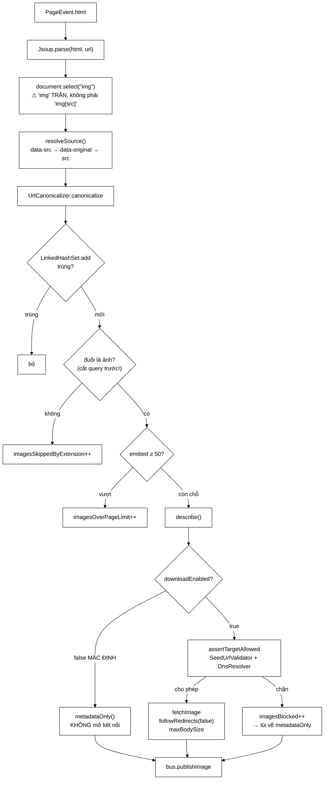

# ImageDownloadService — 22 trên 31 thẻ `` không có địa chỉ thật trong `src`

**File nguồn:** `search-engine/src/main/java/com/vnsearch/crawler/modular/ImageDownloadService.java` (453 dòng)
**Gói:** `com.vnsearch.crawler.modular` · **Loại:** `class`, cài [`PageEventHandler`](../bus/PageEventHandler.md)
**Vị trí trong sơ đồ:** **Modular Service 2 — "Image Download"**
**Đọc kèm:** [`../bus/ImageFound.md`](../bus/ImageFound.md) · [`../SeedUrlValidator.md`](../SeedUrlValidator.md) · [`../HtmlDownloader.md`](../HtmlDownloader.md)

---

## 📌 Hiểu trong 30 giây

Khối này **chưa từng tồn tại**: crawler cũ vứt bỏ hoàn toàn thẻ ``.

Ba điều đáng nhớ, và điều đầu tiên là một phát hiện thực nghiệm cụ thể:

**① Đọc `src` là sai.** Đo trên trang chủ vnexpress.net: **22 trong 31** thẻ
`` có địa chỉ thật nằm ở `data-src`, còn `src` chỉ chứa ảnh giữ chỗ. Chỉ
đọc `src` thì thứ duy nhất lọt vào kho là **logo và icon của site** — đúng
triệu chứng đã quan sát được.

**② Mặc định không mở kết nối nào.** Bật tải ảnh là mở lại đúng đường SSRF mà
[`HtmlDownloader`](../HtmlDownloader.md) đã phải vá, nên khi bật, lớp này dùng
lại **đúng** `SeedUrlValidator` chứ không viết bản kiểm tra thứ hai.

**③ Ba trần chặn**, mỗi trần chặn một kịch bản nổ khác nhau.



---

## 1. Vấn đề lazy loading — phát hiện quan trọng nhất

Javadoc dòng 199–228.

### 1.1 Cơ chế

```
   Báo điện tử nạp ảnh bằng JavaScript để trang hiện nhanh:

    ← ĐỊA CHỈ THẬT
                                                     chỉ gán vào src
                                                     KHI NGƯỜI DÙNG CUỘN TỚI

   Crawler này KHÔNG CHẠY JAVASCRIPT (Jsoup, không phải trình duyệt).
   ⇒ Nó thấy DOM ở trạng thái ban đầu.
   ⇒ src = ảnh giữ chỗ.
```

### 1.2 Số liệu đo được và triệu chứng

```
   ĐO TRÊN TRANG CHỦ vnexpress.net:

        Tổng thẻ :              31
        Có data-src:                 22        ← 71%
        Chỉ có src (thật):            9        ← logo, icon giao diện

   ┌────────────────────────────────────────────────────────────┐
   │  CHỈ ĐỌC src:                                              │
   │     → 22 bản ghi trỏ tới CÙNG MỘT ảnh giữ chỗ 1×1          │
   │       (hoặc bị loại vì đuôi không phải ảnh)                │
   │     → 9 bản ghi là logo + icon                             │
   │                                                            │
   │  TRIỆU CHỨNG ĐÃ QUAN SÁT ĐƯỢC:                             │
   │     "tab Hình ảnh đầy những ảnh không liên quan"           │
   │                                                            │
   │  Và đây là loại lỗi KHÔNG có exception, KHÔNG có log —      │
   │  nó chỉ là kết quả sai mà hệ thống vẫn báo xanh.           │
   └────────────────────────────────────────────────────────────┘
```

### 1.3 Thứ tự ưu tiên và vì sao nó quan trọng

```java
for (String attr : new String[] {"data-src", "data-original", "src"}) {
```

```
   data-src ĐỨNG TRƯỚC src — KHÔNG được đảo.

   Khi có CẢ HAI thì src chính là ảnh giữ chỗ.
   Lấy nhầm nó sẽ cho ra HÀNG LOẠT bản ghi trỏ tới cùng một ảnh mờ 1×1.

   data-original: quy ước của thư viện jQuery Lazy Load cũ,
                  vẫn còn gặp trên các site đời trước.
```

Và một chi tiết trong `onPage` phối hợp với điều này:

```java
for (Element img : document.select("img")) {
//                                  ↑↑↑ 'img' TRẦN, KHÔNG phải "img[src]"
```

```
   Nếu viết select("img[src]"):
        → bỏ qua MỌI ảnh lazy-load chỉ có data-src, KHÔNG có src
        → tức là bỏ qua đúng những ảnh mà mục 1.1 vừa cứu được

   Chú thích dòng 166-167 ghi rõ điều này — một dòng chú thích
   cứu được cả tính năng khi người sau "tối ưu" selector.
```

### 1.4 Cái giá của việc chọn Jsoup thay vì trình duyệt thật

Javadoc dòng 214–218 nói thẳng:

```
   ┌──────────────────┬────────────────────┬─────────────────────────┐
   │                  │ Jsoup (đang dùng)  │ Trình duyệt thật         │
   │                  │                    │ (Selenium/Playwright)    │
   ├──────────────────┼────────────────────┼─────────────────────────┤
   │ Chạy JS          │ ✘                  │ ✔                        │
   │ Thấy ảnh lazy    │ ✘ phải tự hiểu     │ ✔ tự nhiên               │
   │ RAM/trang        │ ~vài MB            │ ~200-400 MB              │
   │ Thời gian/trang  │ ~5 ms parse        │ ~2-5 GIÂY (chờ render)   │
   │ Số trang/giờ     │ hàng chục nghìn    │ vài nghìn                │
   └──────────────────┴────────────────────┴─────────────────────────┘

   "Rẻ hơn hàng chục lần về tài nguyên, đổi lại phải biết
    vài quy ước như thế này."

   ⇒ Đánh đổi ĐÚNG cho một crawler diện rộng.
     Nhưng nó có GIỚI HẠN THẬT: quy ước lazy loading không chuẩn hoá,
     nên danh sách 3 thuộc tính này sẽ phải bổ sung khi gặp site mới.
     Xem đề xuất 2 ở mục 8.
```

---

## 2. SSRF — vì sao **không** tự mở kết nối

Javadoc dòng 52–71. Đây là phần an ninh cốt lõi.

### 2.1 Đường tấn công

```
   
        ↑ crawler tự tải = tự gửi request vào hạ tầng NỘI BỘ

   Địa chỉ 169.254.169.254 là endpoint metadata của AWS/GCP —
   nó trả về thông tin định danh và (ở cấu hình lỏng) cả token truy cập.

   Các mục tiêu khác:
        http://localhost:8080/admin/shutdown
        http://10.0.0.5:5432/            (Postgres nội bộ)
        http://192.168.1.1/              (router)
```

Điểm đáng sợ: **đây là đúng đường đã vá cho HTML, quay lại ở một khối khác.**
Người ta vá SSRF cho phần "tải trang" rồi yên tâm, quên mất khối tải ảnh cũng
mở kết nối ra ngoài.

### 2.2 Dùng lại, không viết bản thứ hai

Javadoc dòng 63–67:

> Lớp này dùng lại **đúng** `SeedUrlValidator` và `DnsResolver` mà
> `HtmlDownloader` dùng, chứ không viết bản kiểm tra thứ hai. […] Hai cài đặt
> song song của cùng một quy tắc bảo mật thì sớm muộn cũng lệch nhau, và **bản
> bị quên cập nhật chính là lỗ hổng**.

```
   ┌──────────────────────────────────────────────────────────────┐
   │  KỊCH BẢN NẾU CÓ HAI BẢN KIỂM TRA                            │
   │                                                              │
   │  T0: cả hai bản chặn 127.0.0.0/8, 10.0.0.0/8, 169.254/16     │
   │  T1: phát hiện thiếu IPv6 loopback ::1                        │
   │      → sửa HtmlDownloader                                    │
   │      → QUÊN ImageDownloadService                             │
   │  T2: lỗ hổng tồn tại ở khối mà không ai nghĩ tới              │
   │                                                              │
   │  Và không có test nào đỏ, vì mỗi bên đều có test riêng        │
   │  cho bản kiểm tra riêng của mình.                            │
   └──────────────────────────────────────────────────────────────┘

   ⇒ QUY TẮC BẢO MẬT PHẢI CÓ ĐÚNG MỘT CÀI ĐẶT.
     Đây là ngoại lệ quan trọng cho nguyên tắc "tránh phụ thuộc":
     với quy tắc bảo mật, phụ thuộc chung là ĐÚNG.
```

### 2.3 Bốn tầng kiểm tra trong `assertTargetAllowed`

```java
private void assertTargetAllowed(String url) throws BlockedImageException {
    URI uri = URI.create(url);                              // ① cú pháp
    if (!scheme http/https) throw;                          // ② giao thức
    if (SeedUrlValidator.isBlockedHostname(host)) throw;    // ③ tên máy
    InetAddress address = dnsResolver.resolve(host);
    if (SeedUrlValidator.isBlockedAddress(address)) throw;  // ④ ĐỊA CHỈ THẬT
}
```

```
   VÌ SAO CẦN CẢ ③ VÀ ④:

   ③ chặn theo TÊN:  "localhost", "metadata.google.internal"
        → nhưng kẻ tấn công đăng ký evil.com trỏ về 127.0.0.1
        → tên không nằm trong danh sách chặn!

   ④ chặn theo ĐỊA CHỈ SAU KHI PHÂN GIẢI:
        evil.com → 127.0.0.1 → isBlockedAddress → CHẶN ✓

   ⇒ Chặn theo tên là lớp lọc rẻ; chặn theo địa chỉ là lớp lọc ĐÚNG.
     Thiếu ④ thì ③ gần như vô dụng.
```

Chi tiết quan trọng ở Javadoc dòng 277–279: phép kiểm tra **đứng trước** lời gọi
mạng, không phải sau. Nghe hiển nhiên, nhưng cách viết sai phổ biến là mở kết
nối rồi mới kiểm tra địa chỉ đã kết nối tới — lúc đó request đã được gửi và
thiệt hại đã xảy ra.

### 2.4 `followRedirects(false)` — chặn đường vòng

```
   HtmlDownloader PHẢI đi theo chuyển hướng: trang thật hay chuyển
   http → https, hoặc chuyển sang URL chuẩn.

   ImageDownloadService thì KHÔNG:

        
                        │
                        ▼  302 Location: http://169.254.169.254/...
                   ĐÍCH THẬT nằm trong mạng nội bộ

        Phép kiểm tra ở mục 2.3 chỉ soi CHẶNG ĐẦU (evil.com — hợp lệ).
        Đi theo chuyển hướng = vòng qua toàn bộ phép kiểm tra.

   ⇒ "Ảnh không đáng để mở thêm bề mặt tấn công."

   CÁI GIÁ: một số CDN dùng 302 để chuyển sang node gần nhất
            → những ảnh đó sẽ không tải được
            → chấp nhận được, vì bản ghi siêu dữ liệu vẫn giữ nguyên
```

Đây là ví dụ tốt cho việc **cùng một quyết định kỹ thuật đúng ở khối này, sai ở
khối kia** — tuỳ vào mức rủi ro và giá trị thu được.

### 2.5 `BlockedImageException` — vì sao là ngoại lệ riêng

```java
private static final class BlockedImageException extends Exception { ... }
```

```java
} catch (BlockedImageException e) {
    imagesBlocked.incrementAndGet();
    log.warn(...);              // ← WARN
} catch (Exception e) {
    downloadFailures.incrementAndGet();
    log.debug(...);             // ← DEBUG
}
```

```
   HAI LOẠI LỖI, HAI MỨC LOG, HAI BỘ ĐẾM:

   imagesBlocked     = "có ai đó ĐANG THỬ trỏ crawler vào mạng nội bộ"
                       → WARN, vì đây là TÍN HIỆU AN NINH
                       → nếu con số này tăng đột biến, có người đang dò

   downloadFailures  = "ảnh 404, timeout, CDN chết"
                       → DEBUG, vì đây là chuyện thường ngày
                       → hàng nghìn lần mỗi phiên crawl là bình thường

   NẾU GỘP LÀM MỘT:
        → tín hiệu an ninh chìm trong hàng nghìn lỗi mạng bình thường
        → và không đặt cảnh báo được
```

Đây là ứng dụng đúng của việc tạo exception riêng: **không phải để phân biệt
nguyên nhân kỹ thuật, mà để phân biệt mức độ cần chú ý.**

---

## 3. Ba trần chặn

Javadoc dòng 73–84. Mỗi trần chặn một kịch bản nổ khác nhau.

```
   ① maxImagesPerPage = 50
        CHẶN: một trang thư viện ảnh có HÀNG NGHÌN thẻ 
        NẾU KHÔNG: một trang duy nhất sinh ra hàng nghìn thông điệp
                   → nghẽn bus, phình topic, và làm lệch mọi thống kê
        LƯU Ý: ảnh vượt trần vẫn được ĐẾM (imagesOverPageLimit),
               nên biết được có bao nhiêu ảnh bị bỏ

   ② maxImageBytes = 5 MB
        CHẶN: một tệp 2 GB đội lốt ảnh
        CÁCH: .maxBodySize() của Jsoup — CẮT NGAY TRONG LÚC ĐỌC
              chứ không phải kiểm tra sau khi tải xong
        NẾU KHÔNG: nuốt hết heap trước khi kịp kiểm tra

   ③ Đuôi tệp trong IMAGE_EXTENSIONS
        CHẶN: src trỏ tới tài liệu hoặc mã (.php, .exe, .pdf)
        LÝ DO CHỌN ĐUÔI thay vì Content-Type — xem 3.1
```

### 3.1 Vì sao lọc theo **đuôi tệp** chứ không theo `Content-Type`

Javadoc dòng 95–97:

```
   Biết được Content-Type thì ĐÃ PHẢI MỞ KẾT NỐI RỒI.
   Mà mục đích của phép lọc này chính là để KHỎI mở kết nối.

   ┌────────────────────────────────────────────────────────────┐
   │  Content-Type:  đúng hơn về mặt kỹ thuật                    │
   │                 nhưng biết được thì đã trả giá rồi          │
   │                                                            │
   │  Đuôi tệp:      gần đúng, MIỄN PHÍ, và chạy TRƯỚC mọi       │
   │                 kết nối                                    │
   └────────────────────────────────────────────────────────────┘

   Ở chế độ mặc định (không tải), Content-Type thậm chí KHÔNG BAO GIỜ
   biết được — nên đuôi tệp là thông tin duy nhất có.
```

### 3.2 `hasImageExtension` — phải cắt query trước

Javadoc dòng 340–347. Đây là cạm bẫy làm hỏng gần hết tính năng nếu bỏ sót:

```java
static boolean hasImageExtension(String url) {
    String path = url.toLowerCase(Locale.ROOT);
    int query = path.indexOf('?');
    if (query >= 0) path = path.substring(0, query);      // ← BẮT BUỘC
    int fragment = path.indexOf('#');
    if (fragment >= 0) path = path.substring(0, fragment);
    ...
}
```

```
   /anh.jpg?w=800&v=2
                    ↑ kết thúc bằng "2", KHÔNG phải ".jpg"

   Trên báo điện tử, GẦN NHƯ MỌI ảnh đều có tham số đổi kích thước:
        https://i1.vnecdn.net/2024/anh.jpg?w=680&h=0&q=100&dpr=1&fit=crop

   BỎ BƯỚC NÀY  ⇒  service lọc mất GẦN HẾT ảnh thật
                ⇒  và imagesSkippedByExtension sẽ tăng vọt
                   (bộ đếm này là thứ phát hiện được lỗi đó)
```

`Locale.ROOT` xuất hiện lại, cùng lý do như ở
[`UrlCanonicalizer`](../UrlCanonicalizer.md) và
[`ContentSeenFilter`](../ContentSeenFilter.md): tránh phép hạ chữ thường phụ
thuộc locale (locale Thổ Nhĩ Kỳ biến `I` thành `ı`, làm `.JPG` không khớp
`.jpg`).

---

## 4. Hướng dẫn về code

### 4.1 `describe` — mọi lỗi lùi về siêu dữ liệu, dòng 244–272

```java
private ImageFound describe(...) {
    ImageFound metadata = ImageFound.metadataOnly(...);
    if (!downloadEnabled) {
        return metadata;
    }
    try {
        byte[] body = fetchImage(imageUrl);
        return new ImageFound(..., body.length, sha256Hex(body));
    } catch (BlockedImageException e) {
        imagesBlocked.incrementAndGet();
        return metadata;                    // ← LÙI VỀ, không mất bản ghi
    } catch (Exception e) {
        downloadFailures.incrementAndGet();
        return metadata;                    // ← LÙI VỀ
    }
}
```

Javadoc dòng 247–248 nêu nguyên tắc:

> Một ảnh hỏng không phải lý do để mất luôn **thông tin rằng trang đó có ảnh
> ấy**.

```
   PHÂN BIỆT HAI THỨ:

        "ảnh này tải được không"     ← có thể hỏng, không sao
        "trang này CÓ ảnh này"       ← là sự thật về trang, LUÔN đúng

   Thông tin thứ hai đủ cho:
        - đếm ảnh/trang
        - phát hiện thiếu alt
        - ghi lại địa chỉ để tải bù sau

   ⇒ Suy giảm êm (graceful degradation): mất tính năng phụ,
     giữ nguyên tính năng chính.
```

Đây là mẫu đáng học: khi một bước làm giàu dữ liệu thất bại, **trả về dữ liệu
chưa làm giàu** thay vì trả về `null` hay ném.

### 4.2 `LinkedHashSet` — khử trùng nhưng giữ thứ tự, dòng 160–163

```java
Set<String> seen = new LinkedHashSet<>();
```

```
   VÌ SAO CẦN KHỬ TRÙNG:
        Một trang thường lặp cùng một ảnh:
             - bản thường trong 
             - bản srcset cho màn hình retina
             - ảnh nền trong CSS inline
             - lại xuất hiện ở khối "bài liên quan"

   VÌ SAO GIỮ THỨ TỰ (LinkedHashSet, không phải HashSet):
        Kết quả ỔN ĐỊNH giữa các lần chạy.
        Với HashSet, thứ tự duyệt phụ thuộc hàm băm và kích thước bảng
        → hai lần chạy trên cùng một trang cho hai thứ tự khác nhau
        → và vì có TRẦN 50 ảnh/trang, thứ tự khác nhau nghĩa là
          BỘ ẢNH ĐƯỢC GIỮ LẠI cũng khác nhau!
        → test không tái hiện được, kết quả không so sánh được

   Cùng lý do mà LinkExtractor dùng cấu trúc này.
```

Điểm nối giữa "giữ thứ tự" và "có trần" là chi tiết dễ bỏ sót: **khi có trần,
thứ tự quyết định nội dung.**

### 4.3 `parseDimension` — cắt đuôi đơn vị, dòng 366–378

```java
String digits = value.trim().replaceAll("[^0-9].*$", "");
return digits.isEmpty() ? -1 : Integer.parseInt(digits);
```

```
   HTML cho phép:  width="800"  width="800px"  width="100%"

        "800"    → "800"  → 800
        "800px"  → "800"  → 800
        "100%"   → "100"  → 100      ← ⚠ SAI VỀ NGỮ NGHĨA
        ""       → -1
        "abc"    → ""     → -1

   Ca "100%" là điểm yếu thật: nó trả về 100 như thể ảnh rộng 100 px,
   trong khi thực tế nghĩa là "rộng bằng khung chứa".
   → làm bẩn thống kê kích thước.
   Xem đề xuất 4 ở mục 8.
```

`-1` nghĩa là "không biết", **không phải** "bằng không" — xem
[`ImageFound`](../bus/ImageFound.md) mục 4.3 cho lý do đầy đủ.

### 4.4 `sha256Hex` — vì sao ném `IllegalStateException`

```java
} catch (NoSuchAlgorithmException e) {
    throw new IllegalStateException("JVM khong ho tro SHA-256", e);
}
```

```
   SHA-256 là thuật toán BẮT BUỘC mọi JVM phải có theo đặc tả Java.

   ⇒ NoSuchAlgorithmException ở đây nghĩa là JVM hỏng hoặc bị sửa đổi.
   ⇒ Đó KHÔNG PHẢI lỗi có thể xử lý — không có phương án dự phòng nào.
   ⇒ Ném IllegalStateException (unchecked) là đúng: nó nói
     "trạng thái môi trường không hợp lệ", không phải "đầu vào xấu".

   Chuyển checked → unchecked ở đây là hợp lý vì mọi chỗ gọi
   đều không thể làm gì với ngoại lệ này.
```

### 4.5 Chín bộ đếm và bất biến

| Bộ đếm | Ý nghĩa |
|---|---|
| `pagesProcessed` | Trang có HTML đã xử lý |
| `imagesFound` | Ảnh đã phát thông điệp |
| `imagesSkippedByExtension` | Bị loại vì đuôi — **tăng vọt = lỗi cắt query** |
| `imagesOverPageLimit` | Vượt trần 50/trang |
| `imagesMissingAlt` | Thiếu `alt` — chỉ số tiếp cận |
| `imagesDownloaded` | Tải nội dung thành công |
| `imagesBlocked` | **Chặn vì an ninh** — tín hiệu cần cảnh báo |
| `downloadFailures` | Lỗi mạng thường |
| `bytesDownloaded` | Tổng byte |

```
   BẤT BIẾN (khi bật tải):
        imagesFound == imagesDownloaded + imagesBlocked + downloadFailures

   VÀ:  imagesMissingAlt ≤ imagesFound
        getMissingAltRate() ∈ [0, 1]
```

`getMissingAltRate()` là **chỉ số tiếp cận** (accessibility) — tỷ lệ ảnh không
có văn bản thay thế. Đây là số liệu có ý nghĩa thật về chất lượng của các trang
web Việt Nam, và là thứ đáng đưa vào báo cáo đồ án.

### 4.6 Cạm bẫy khi sửa lớp này

| Ý định | Hậu quả |
|---|---|
| `select("img[src]")` thay vì `select("img")` | Bỏ qua **71%** ảnh lazy-load — xem 1.3 |
| Đảo thứ tự `src` lên trước `data-src` | Hàng loạt bản ghi trỏ tới ảnh giữ chỗ 1×1 |
| Bỏ bước cắt query trong `hasImageExtension` | Lọc mất gần hết ảnh thật |
| Viết bản kiểm tra SSRF riêng | Hai bản sẽ lệch nhau; bản bị quên là lỗ hổng |
| `followRedirects(true)` | Vòng qua toàn bộ phép kiểm tra SSRF |
| Kiểm tra địa chỉ **sau** khi kết nối | Request đã gửi, thiệt hại đã xảy ra |
| Gộp `BlockedImageException` vào `Exception` | Tín hiệu an ninh chìm trong lỗi mạng thường |
| `HashSet` thay `LinkedHashSet` | Bộ ảnh giữ lại đổi giữa các lần chạy (vì có trần) |
| Ném khi tải ảnh lỗi | Mất luôn bản ghi siêu dữ liệu — xem 4.1 |
| Bỏ `maxBodySize` | Một tệp 2 GB đội lốt ảnh nuốt hết heap |

---

## 5. Độ phức tạp & chi phí

| Thao tác | Chi phí | Ghi chú |
|---|---|---|
| `Jsoup.parse` | 3–8 ms | Parse **lại** DOM — cùng cái giá với `UrlExtractorService` |
| `select("img")` | O(số nút) | ~1 ms |
| `resolveSource` | O(1) × 3 thuộc tính | |
| `hasImageExtension` | O(độ dài URL) × 8 đuôi | |
| `assertTargetAllowed` | **1 truy vấn DNS** | Chỉ khi bật tải |
| `fetchImage` | ~100–800 ms | Chỉ khi bật tải |
| `sha256Hex` | O(kích thước ảnh) | ~1 ms cho 200 KB |

```
   CHẾ ĐỘ MẶC ĐỊNH (không tải)
   ────────────────────────────────────────────────────────
        ~5 ms/trang (chủ yếu là parse lại DOM)
        31.030 trang × 5 ms ≈ 2,6 phút trên 8,6 giờ = 0,5%
        Băng thông thêm: 0

   CHẾ ĐỘ BẬT TẢI
   ────────────────────────────────────────────────────────
        25 ảnh × ~400 ms  ≈  10 GIÂY/trang
        + 25 truy vấn DNS
        31.030 trang × 10 s ≈ 86 GIỜ  ← GẤP 10 LẦN thời gian crawl!
        Băng thông: ~155 GB

   ┌──────────────────────────────────────────────────────────┐
   │  CHÊNH LỆCH: 5 ms  vs  10 s  =  2000 LẦN                 │
   │                                                          │
   │  Đây là lập luận ĐỊNH LƯỢNG cho:                         │
   │    ① vì sao mặc định tắt                                 │
   │    ② vì sao PHẢI tách tiến trình khi bật                 │
   │       (ở chế độ in-process, 10 s/trang sẽ CHẶN worker    │
   │        crawl suốt thời gian đó — thông lượng sụp)        │
   └──────────────────────────────────────────────────────────┘
```

---

## 6. Kiểm thử liên quan

| Bộ test | Kiểm gì |
|---|---|
| [`ImageDownloadServiceTest`](../../../../../test/java/com/vnsearch/crawler/modular/ImageDownloadServiceTest.md) | Lazy loading; trần; đuôi tệp; chế độ mặc định |
| [`SsrfProtectionTest`](../../../../../test/java/com/vnsearch/crawler/SsrfProtectionTest.md) | Phép kiểm tra dùng chung |
| [`ImageStoreTest`](../../../../../test/java/com/vnsearch/crawler/modular/ImageStoreTest.md) | Bên nhận `ImageFound` |

```
   ĐẦU VÀO                                       KẾT QUẢ MONG ĐỢI
   ───────────────────────────────────────────   ──────────────────────────
           chọn that.jpg
    (KHÔNG có src)         vẫn bắt được
                      vẫn bắt được
   /anh.jpg?w=800&v=2                            hasImageExtension == true
   /trang.php?x=.jpg                             hasImageExtension == false
   /ANH.JPG                                      true (Locale.ROOT)
   cùng một ảnh xuất hiện 3 lần                  1 thông điệp
   trang có 200 ảnh                              50 thông điệp, imagesOverPageLimit==150
   width="800px"                                 800
   width="" / width="abc"                        -1
   downloadEnabled=false                         KHÔNG mở kết nối nào
   src="http://127.0.0.1/x.jpg" (đã bật tải)     imagesBlocked++, vẫn có bản ghi
   ảnh 404 (đã bật tải)                          downloadFailures++, vẫn có bản ghi
```

Ba bài test còn thiếu:

```java
// 1. Chống hồi quy lazy loading — bảo vệ phát hiện quan trọng nhất
@Test
void uuTienDataSrcHonSrc() {
    var html = "";
    service.onPage(mauPageEvent("https://a.vn/bai", html));
    assertEquals("https://cdn.vn/that.jpg", bus.images().get(0).imageUrl());
}

// 2. Chế độ mặc định TUYỆT ĐỐI không mở kết nối
@Test
void cheDoMacDinhKhongMoKetNoi() {
    var dns = mock(DnsResolver.class);
    var service = new ImageDownloadService(bus, dns, false, 50, 5_000_000, 8000);
    service.onPage(mauPageEventCoAnh());
    verifyNoInteractions(dns);       // không phân giải DNS = không mở kết nối
    assertEquals(0, service.getImagesDownloadedCount());
}

// 3. Bất biến bộ đếm khi bật tải
@Test
void tongBoDemKhopKhiBatTai() {
    // imagesFound == imagesDownloaded + imagesBlocked + downloadFailures
}
```

---

## 7. Chấm theo chuẩn doanh nghiệp

| Tiêu chí | Điểm | Nhận xét |
|---|---|---|
| Nhận diện vấn đề thực tế | 10/10 | Phát hiện lazy loading kèm **số liệu đo được** (22/31) và triệu chứng quan sát được |
| Nhận thức an ninh | 10/10 | Nhận ra SSRF quay lại; **dùng lại** phép kiểm tra thay vì viết bản thứ hai; `followRedirects(false)` |
| Phân loại lỗi | 10/10 | `BlockedImageException` tách tín hiệu an ninh khỏi lỗi mạng, hai mức log, hai bộ đếm |
| Chặn tài nguyên | 10/10 | Ba trần, mỗi trần chặn một kịch bản nổ khác nhau; ảnh vượt trần vẫn được đếm |
| Suy giảm êm | 10/10 | Mọi lỗi tải lùi về bản ghi siêu dữ liệu — giữ tính năng chính |
| Xử lý biên | 9/10 | Query string, đơn vị `px`, chữ hoa; nhưng `width="100%"` cho kết quả sai ngữ nghĩa |
| Quan sát được | 10/10 | Chín bộ đếm có bất biến; `getMissingAltRate()` là chỉ số có ý nghĩa thật |
| Chi phí được ghi rõ | 10/10 | Chênh lệch 2000 lần giữa hai chế độ là lập luận định lượng cho mọi quyết định |
| Khả năng bảo trì | 7/10 | Danh sách 3 thuộc tính lazy là **hằng số cứng trong mã**; gặp quy ước mới phải sửa mã và triển khai lại |

**Năm đề xuất nâng lên mức sản phẩm:**

1. **Test chống hồi quy lazy loading** (mã ở mục 6). Đây là phát hiện có giá trị
   nhất của lớp, và hiện nó chỉ được bảo vệ bởi thứ tự các phần tử trong một
   mảng `String[]`. Một người "dọn dẹp" đảo thứ tự sẽ phá tính năng mà không có
   test nào đỏ — và triệu chứng (tab Hình ảnh đầy icon) chỉ thấy được bằng mắt.

2. **Đưa danh sách thuộc tính lazy vào cấu hình.** Hiện
   `{"data-src", "data-original", "src"}` là mảng cứng. Các quy ước khác đang
   dùng phổ biến: `data-lazy-src`, `data-echo`, `data-srcset`, và thuộc tính
   `srcset` chuẩn của HTML5 (mà lớp này **hoàn toàn bỏ qua**). Đưa vào
   `application.properties` cho phép bổ sung mà không phải triển khai lại — và
   quan trọng hơn, cho phép **đo** xem thuộc tính nào thực sự gặp.

3. **Đếm ảnh bị bỏ vì `resolveSource` trả `null`.** Hiện dòng 170–172 `continue`
   im lặng khi không tìm được địa chỉ nào trong ba thuộc tính. Nếu một site dùng
   quy ước lạ, **mọi** ảnh của nó biến mất mà không có số nào cho biết. Đây là
   cùng lớp vấn đề mà `imagesSkippedByExtension` đã giải cho ca kia — nên giải
   nốt ca này.

4. **Xử lý `width="100%"` cho đúng.** Trả `-1` (không biết) thay vì `100` sẽ
   đúng ngữ nghĩa hơn: `100%` không mang thông tin về kích thước pixel. Một phép
   kiểm `value.contains("%")` là đủ.

5. **Nhóm ảnh của một trang thành một thông điệp.** Hiện 25 ảnh = 25 thông điệp,
   mỗi cái lặp lại `pageUrl` + `host`. Gộp lại giảm ~40% dung lượng luồng, giữ
   tính nguyên tử, **và** sửa được lỗi `imagesOfPage` ở
   [`CrawlAnalyticsService`](./CrawlAnalyticsService.md) mục 4.5 — một thay đổi,
   hai vấn đề được giải. Đây là đề xuất có tỷ lệ lợi ích/chi phí cao nhất trong
   danh sách.

---

## 8. Liên kết

- Thông điệp phát ra: [`../bus/ImageFound.md`](../bus/ImageFound.md)
- Phép kiểm tra SSRF dùng chung: [`../SeedUrlValidator.md`](../SeedUrlValidator.md) · [`../DnsResolver.md`](../DnsResolver.md)
- Nơi bản vá SSRF được xác lập: [`../HtmlDownloader.md`](../HtmlDownloader.md)
- Chuẩn hoá địa chỉ ảnh: [`../UrlCanonicalizer.md`](../UrlCanonicalizer.md)
- Cùng lý do dùng `LinkedHashSet`: [`../LinkExtractor.md`](../LinkExtractor.md)
- Bên tiêu thụ: [`./ImageStore.md`](./ImageStore.md) · [`./ImageStorage.md`](./ImageStorage.md) · [`./CrawlAnalyticsService.md`](./CrawlAnalyticsService.md)
- Chấm điểm chất lượng ảnh: [`./ImageQuality.md`](./ImageQuality.md)
- API tìm ảnh: [`../../controller/ImageSearchController.md`](../../controller/ImageSearchController.md)
- Hợp đồng service: [`../bus/PageEventHandler.md`](../bus/PageEventHandler.md)
- Tổng quan: `docs/ARCHITECTURE.md`
