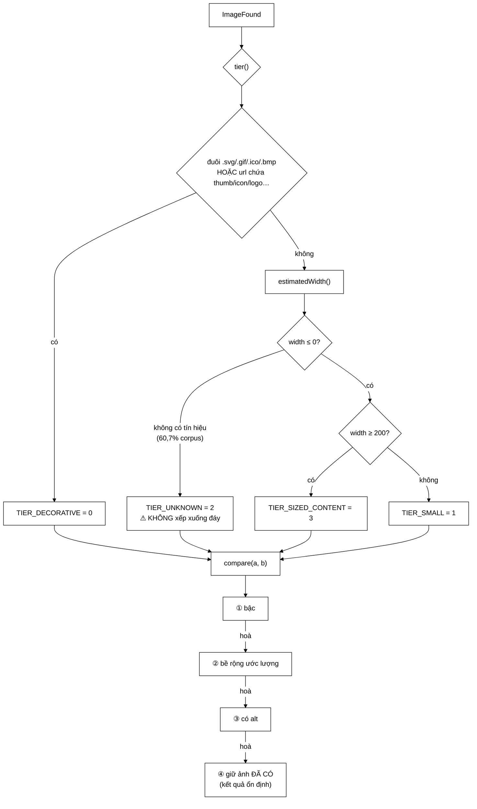

# ImageQuality — đo lại một giả định cũ, và thấy nó đúng 19%

**File nguồn:** `search-engine/src/main/java/com/vnsearch/crawler/modular/ImageQuality.java` (221 dòng)
**Gói:** `com.vnsearch.crawler.modular` · **Loại:** `final class`, toàn `static`, không trạng thái
**Vị trí trong sơ đồ:** phép chọn **ảnh đại diện** cho mỗi trang, dùng bởi [`ImageStore`](./ImageStore.md)
**Đọc kèm:** [`ImageStore.md`](./ImageStore.md) · [`../bus/ImageFound.md`](../bus/ImageFound.md)

---

## 📌 Hiểu trong 30 giây

`ImageStore` chỉ giữ **một** ảnh cho mỗi trang. Một trang tin có 20–50 ảnh,
trong đó đúng một tấm là ảnh chính của bài. Lớp này quyết định tấm nào được giữ.

Hai điều làm lớp này đáng đọc:

**① Nó bác bỏ một giả định đã ghi trong Javadoc của chính dự án.**
`ImageStore` từng ghi *"ảnh đầu tiên gần như luôn là ảnh chính"*. Đo lại trên
323 trang: ảnh đầu DOM cũng là ảnh lớn nhất chỉ trong **19%** số trang.

**② Nó tự nêu giới hạn ngay trong tên gọi.** Hệ thống không tải nội dung ảnh,
nên "chất lượng" không đo được. Lớp này ước lượng *khả năng một ảnh là ảnh chính
của bài* — và Javadoc dòng 23–25 ghi rõ đó là **hai việc khác nhau**.



```
   THANG BẬC — ĐỌC TỪ TRÊN XUỐNG

   3  TIER_SIZED_CONTENT   ảnh nội dung, BIẾT nó ≥ 200px
   2  TIER_UNKNOWN         ảnh nội dung, không có tín hiệu kích thước  ← 60,7%
   1  TIER_SMALL           có tín hiệu, nhưng < 200px  → gần như chắc là icon
   0  TIER_DECORATIVE      .svg/.gif, hoặc url tự khai là thumb/logo/icon

   Chú ý bậc 2 nằm TRÊN bậc 1 — đó là quyết định tinh tế nhất của lớp.
   Xem mục 4.
```

---

## 1. Ràng buộc: không có bức ảnh trong tay

Javadoc dòng 18–25.

```
   app.crawler.images.download = false  (mặc định)

   ⇒ KHÔNG có nội dung ảnh
   ⇒ mọi khái niệm "nét", "sắc sảo", "độ phân giải thật" KHÔNG ĐO ĐƯỢC

   Thứ CÓ trong tay:
        imageUrl        chuỗi
        altText         chuỗi
        declaredWidth   số trong HTML (có thể -1)
        declaredHeight  số trong HTML (có thể -1)
        pageUrl, host

   ⇒ Lớp này KHÔNG đo chất lượng ảnh.
     Nó ước lượng KHẢ NĂNG một ảnh là ảnh chính của bài.
```

Javadoc dòng 24–25 nói lý do ghi ra điều này:

> Ghi rõ ra đây để **không ai đọc tên lớp rồi tưởng nó làm nhiều hơn thực tế**.

```
   ┌──────────────────────────────────────────────────────────────┐
   │  ĐÂY LÀ MỘT THÓI QUEN TỐT ĐÁNG HỌC                           │
   │                                                              │
   │  Tên lớp là ImageQuality — nghe như nó đo chất lượng ảnh.     │
   │  Nó KHÔNG.                                                   │
   │                                                              │
   │  Hai cách xử lý:                                             │
   │    ① Đổi tên thành ImageRelevanceHeuristic — chính xác hơn    │
   │       nhưng dài và khó nhớ                                   │
   │    ② Giữ tên, GHI RÕ giới hạn ở dòng đầu Javadoc              │
   │                                                              │
   │  Dự án chọn ②. Chấp nhận được, MIỄN LÀ dòng ghi chú đó tồn    │
   │  tại. Nếu bị xoá, tên lớp sẽ nói dối.                        │
   └──────────────────────────────────────────────────────────────┘
```

---

## 2. Số liệu đo trên corpus thật

Javadoc dòng 27–40. Đo trên **25.707 ảnh của 1.013 trang** (phiên crawl 1.028
trang).

| Tín hiệu | Độ phủ | Vai trò |
|---|---|---|
| `declaredWidth/Height` trong HTML | 18,2% | kích thước, **tin cậy nhất** |
| Tham số `?w=` trong URL của CDN | 14,5% | kích thước |
| Dạng `/640x480/` trong đường dẫn | 6,6% | kích thước |
| **Có ít nhất một tín hiệu kích thước** | **39,3%** | — |
| URL chứa `thumb/icon/logo/avatar` | 24,3% | dấu hiệu **ÂM** |
| Đuôi `.svg` hoặc `.gif` | 12% | dấu hiệu **ÂM** |

```
   ĐIỀU QUAN TRỌNG NHẤT TRONG BẢNG NÀY:

        60,7% ảnh KHÔNG CÓ TÍN HIỆU KÍCH THƯỚC NÀO.

   ┌────────────────────────────────────────────────────────────┐
   │  có tín hiệu kích thước  ████████                    39,3% │
   │  KHÔNG có gì             ████████████████████████    60,7% │
   └────────────────────────────────────────────────────────────┘

   Đây là con số quyết định toàn bộ thiết kế thang bậc (mục 4):
   nếu coi "không biết" là "đáng ngờ", ta sẽ xử lý sai ĐA SỐ ảnh.
```

Việc **đo trước khi thiết kế** là điểm mạnh nhất của lớp này. Không có bảng số
liệu trên, mọi lựa chọn ngưỡng (200px) và mọi thứ tự ưu tiên đều chỉ là phỏng
đoán.

---

## 3. Bác bỏ giả định "ảnh đầu tiên là ảnh chính"

Javadoc dòng 42–56. Đây là phần có giá trị khoa học nhất.

### 3.1 Giả định cũ

```
   Cách hiển nhiên nhất: lấy ảnh ĐẦU TIÊN trong DOM.

   FeedController đang làm đúng vậy.
   ImageStore TỪNG GHI trong Javadoc: "ảnh đầu tiên gần như luôn là ảnh chính".

   Nghe rất hợp lý. Ai cũng sẽ tin.
```

### 3.2 Đo lại

```
   TRÊN 323 TRANG có ≥ 2 ảnh khai báo kích thước:

        Ảnh đầu DOM cũng là ảnh LỚN NHẤT:  19%
                                            ↑↑↑
   ┌────────────────────────────────────────────────────────────┐
   │  đúng    ████                                       19%    │
   │  SAI     ████████████████████████████████████       81%    │
   └────────────────────────────────────────────────────────────┘
```

### 3.3 Vì sao — nhìn HTML thật là thấy ngay

```
   <header>
               ← ảnh #1
               ← ảnh #2
              ← ảnh #3
   </header>

   <article>
     
   </article>

   ⇒ Logo toà soạn, icon tìm kiếm và ảnh đại diện tác giả
     nằm trong <header>, tức là ĐỨNG TRƯỚC ảnh chính của bài.
```

### 3.4 Bài học phương pháp

```
   ┌──────────────────────────────────────────────────────────────┐
   │  MỘT GIẢ ĐỊNH ĐƯỢC GHI TRONG JAVADOC VẪN CHỈ LÀ GIẢ ĐỊNH.    │
   │                                                              │
   │  Nó nghe hợp lý → không ai nghi ngờ                          │
   │  → nó được ghi vào tài liệu                                  │
   │  → tài liệu làm nó nghe CÀNG đáng tin                        │
   │  → và nó tồn tại nhiều năm mà không ai đo                    │
   │                                                              │
   │  Ở đây nó SAI 81% số ca.                                     │
   │                                                              │
   │  Cách phát hiện duy nhất: ĐO. Và phép đo chỉ mất một          │
   │  script duyệt corpus đã có sẵn.                              │
   └──────────────────────────────────────────────────────────────┘
```

Đây là nội dung đáng nói nhất khi bảo vệ đồ án: **một giả định được kiểm chứng
bằng số liệu, và bị bác bỏ**. Nó chứng minh quy trình làm việc, không chỉ chứng
minh kết quả.

### 3.5 Thứ tự DOM vẫn còn giá trị — nhưng chỉ là tiêu chí phá hoà

Javadoc dòng 54–56:

```
   Thứ tự DOM KHÔNG bị vứt bỏ hoàn toàn.
   Nó tụt xuống làm TIÊU CHÍ CUỐI CÙNG, dùng khi mọi tín hiệu khác bằng nhau.

   Vì sao vẫn có ích:
        "trong hai ảnh không phân biệt được thì ảnh xuất hiện sớm hơn
         vẫn nhỉnh hơn một chút"

   Cách cài đặt (dòng 133-135) rất tinh tế — xem mục 5.2.
```

Lưu ý: `FeedController` **vẫn** dùng ảnh đầu DOM. Đó là một điểm không nhất quán
thật trong dự án — xem đề xuất 3 ở mục 8.

---

## 4. Ba bậc, không phải một thang điểm phẳng

Javadoc dòng 58–63. Đây là quyết định thiết kế cốt lõi.

### 4.1 Vì sao không cộng điểm

```
   PHƯƠNG ÁN CỘNG DỒN (phổ biến, và SAI ở đây):

        điểm = width/10 + (có alt ? 20 : 0) - (là thumbnail ? 30 : 0)

   Ví dụ hỏng:
        icon-tim-kiem.png   width=300, có alt   → 30 + 20 = 50
        anh-bai.jpg         width=280, có alt   → 28 + 20 = 48

        ⇒ ICON THẮNG ẢNH BÀI.

   ┌────────────────────────────────────────────────────────────┐
   │  VÌ SAO CỘNG DỒN SAI:                                      │
   │                                                            │
   │  Các tín hiệu KHÔNG CÙNG ĐƠN VỊ.                           │
   │    - "bề rộng" đo bằng pixel                               │
   │    - "là icon hay không" là một PHÂN LOẠI                   │
   │                                                            │
   │  Cộng chúng lại nghĩa là chấp nhận một tỷ giá quy đổi:      │
   │  "bao nhiêu pixel thì bù được việc nó là icon?"             │
   │  Câu hỏi đó VÔ NGHĨA — không có câu trả lời đúng.           │
   └────────────────────────────────────────────────────────────┘
```

```
   PHƯƠNG ÁN BẬC (đang dùng):

        Bậc quyết định TRƯỚC. Chỉ khi cùng bậc mới so bề rộng.

        icon-tim-kiem.png   → TIER_DECORATIVE (0)   ← url chứa "icon"
        anh-bai.jpg         → TIER_SIZED_CONTENT (3)

        ⇒ 3 > 0, ảnh bài thắng, KHÔNG cần so bề rộng.

   "Một ảnh trang trí KHÔNG BAO GIỜ vượt được một ảnh nội dung,
    dù to đến đâu."
```

Nguyên tắc tổng quát:

> Khi các tín hiệu **không cùng đơn vị** hoặc có **quan hệ thứ bậc rõ ràng**,
> dùng **so sánh từ điển theo bậc** (lexicographic) thay vì tổng có trọng số.
> Tổng có trọng số chỉ đúng khi mọi tín hiệu thực sự đánh đổi được với nhau.

### 4.2 Bậc 2 (`TIER_UNKNOWN`) nằm **trên** bậc 1 (`TIER_SMALL`)

Đây là chi tiết dễ làm sai nhất, và chú thích dòng 175–178 giải thích:

```java
int width = estimatedWidth(image);
if (width <= 0) {
    return TIER_UNKNOWN;        // = 2, CAO HƠN TIER_SMALL = 1
}
return width >= MIN_CONTENT_WIDTH ? TIER_SIZED_CONTENT : TIER_SMALL;
```

```
   TRỰC GIÁC SAI:  "không biết gì" nghe tệ hơn "biết là nhỏ"
                   → xếp UNKNOWN xuống đáy

   THỰC TẾ:
        60,7% ảnh rơi vào UNKNOWN,
        và PHẦN LỚN trong số đó là ẢNH BÀI VIẾT BÌNH THƯỜNG
        trên những trang không khai báo kích thước.

   NẾU xếp UNKNOWN xuống dưới SMALL:
        icon.png (width=80, CÓ khai báo)     → SMALL = 1
        anh-bai.jpg (không khai báo gì)      → UNKNOWN = 0

        ⇒ ICON THẮNG ẢNH BÀI, trên 60,7% số ảnh.
        ⇒ Đây sẽ là lỗi TỆ NHẤT có thể mắc trong lớp này.
```

```
   ┌──────────────────────────────────────────────────────────────┐
   │  BÀI HỌC:  "THIẾU DỮ LIỆU" ≠ "DỮ LIỆU XẤU"                   │
   │                                                              │
   │  Xử lý giá trị thiếu như giá trị tệ nhất là phản xạ tự nhiên  │
   │  nhưng thường sai — nhất là khi giá trị thiếu chiếm ĐA SỐ.    │
   │                                                              │
   │  Cách quyết định đúng: hỏi "quần thể thiếu dữ liệu này        │
   │  TRUNG BÌNH trông giống nhóm nào?" Ở đây nó giống nhóm ảnh    │
   │  nội dung, nên nó được xếp gần nhóm đó.                       │
   └──────────────────────────────────────────────────────────────┘
```

### 4.3 `MIN_CONTENT_WIDTH = 200` — chọn từ số liệu

Javadoc dòng 96–102:

```
   Ảnh bài báo HẸP NHẤT gặp trên corpus:  ~300-400 px
   Logo đo được:                          100×42  và  236×61

        0        100    200    300    400
        ├─────────┼──────┼──────┼───────┼──▶ px
                  │      │      │
              logo 100  NGƯỠNG  ảnh bài hẹp nhất
                        200
                     ↑
              chừa BIÊN AN TOÀN cho ảnh chân dung hẹp

   Chú ý logo 236×61 NẰM TRÊN ngưỡng — nó sẽ không bị bắt bởi
   phép kiểm kích thước.

   ⇒ Đó chính là lý do cần TÍN HIỆU ÂM theo tên (DECORATIVE_PATH):
     url chứa "logo" bắt được nó, còn kích thước thì không.
     Hai tín hiệu bù cho nhau.
```

---

## 5. Hướng dẫn về code

### 5.1 Bốn biểu thức chính quy

```java
DECORATIVE_EXTENSION = "\\.(svg|gif|ico|bmp)(\\?|#|$)"
DECORATIVE_PATH      = "thumb|icon|logo|avatar|sprite|placeholder|blank|banner|
                        badge|button|favicon|watermark|1x1|pixel|spacer"
WIDTH_PARAM          = "[?&](?:w|width|rw|mw)=(\\d{2,4})"
SIZE_IN_PATH         = "[_\\-/](\\d{3,4})x(\\d{3,4})[_\\-./]"
```

Bốn chi tiết đáng chú ý:

**① `(\\?|#|$)` ở cuối `DECORATIVE_EXTENSION`.** Cùng vấn đề với
`hasImageExtension` ở [`ImageDownloadService`](./ImageDownloadService.md) mục
3.2: `/anh.svg?v=2` không kết thúc bằng `.svg`. Ở đây giải bằng regex thay vì
cắt chuỗi — cùng kết quả, và regex còn bắt được cả fragment `#`.

**② `\\d{2,4}` trong `WIDTH_PARAM` — chặn hai đầu.**
```
   Vì sao ≥ 2 chữ số:  ?w=8 gần như chắc chắn không phải bề rộng
   Vì sao ≤ 4 chữ số:  ?w=12345 cũng vậy — màn hình rộng nhất ~7680px
                       và số 5+ chữ số thường là ID chứ không phải kích thước
   ⇒ Ràng buộc độ dài là cách rẻ nhất để lọc dương tính giả.
```

**③ `SIZE_IN_PATH` yêu cầu 3–4 chữ số**, chặt hơn `WIDTH_PARAM`. Hợp lý: một
chuỗi như `/12x8/` trong đường dẫn nhiều khả năng là ngày tháng hoặc ID, không
phải kích thước.

**④ `DECORATIVE_PATH` khớp trên URL **đã hạ chữ thường** (dòng 167) — nên bản
thân mẫu không cần `CASE_INSENSITIVE`. Nhưng hai mẫu kia **có** cờ đó dù cũng
được gọi trên URL đã hạ chữ thường (`tier()`)… trừ `estimatedWidth()`, nơi URL
**chưa** hạ chữ thường (dòng 196). Đó là lý do `WIDTH_PARAM` cần cờ. Một chi
tiết dễ nhầm — xem đề xuất 4.

Cả bốn mẫu đều là `static final Pattern` — biên dịch **một lần**, không phải mỗi
lần gọi. Với 25.707 ảnh × 4 mẫu, dùng `String.matches()` sẽ biên dịch lại
102.828 lần. Đây là lỗi mà [`ContentSeenFilter`](../ContentSeenFilter.md) đã bị
nhắc ở phần đề xuất; ở đây thì làm đúng ngay từ đầu.

### 5.2 `compare` — tiêu chí thứ tư giấu trong phép trả về

Javadoc dòng 133–135 và cài đặt dòng 158:

```java
return Boolean.compare(!a.missingAlt(), !b.missingAlt());
```

```
   KHI MỌI TIÊU CHÍ HOÀ, hàm trả về 0.
   Và isBetter() dùng compare(...) > 0.

        return compare(candidate, current) > 0;

   ⇒ HOÀ ⇒ 0 ⇒ KHÔNG > 0 ⇒ GIỮ ẢNH ĐÃ CÓ.

   ┌──────────────────────────────────────────────────────────────┐
   │  VÌ SAO ĐIỀU NÀY QUAN TRỌNG                                  │
   │                                                              │
   │  Ở chế độ Kafka, THỨ TỰ THÔNG ĐIỆP ĐẾN KHÔNG XÁC ĐỊNH.       │
   │  Ảnh của cùng một trang có thể đến theo bất kỳ thứ tự nào.    │
   │                                                              │
   │  Nếu HOÀ ⇒ thay thế:                                         │
   │       ảnh giữ lại phụ thuộc ảnh nào đến SAU CÙNG              │
   │       → hai lần chạy cho hai kết quả khác nhau                │
   │       → test không tái hiện được                             │
   │       → và tab Hình ảnh đổi nội dung mỗi lần crawl lại        │
   │                                                              │
   │  Với HOÀ ⇒ giữ:                                              │
   │       ảnh giữ lại là ảnh ĐẾN TRƯỚC trong số các ảnh tốt nhất  │
   │       → và "đến trước" ở chế độ in-process = thứ tự DOM       │
   │       → tức là tiêu chí phá hoà ở mục 3.5, cài đặt MIỄN PHÍ   │
   └──────────────────────────────────────────────────────────────┘
```

Đây là ví dụ đẹp: một quy ước `> 0` thay vì `>= 0` vừa đảm bảo **tính xác định**
vừa cài đặt được tiêu chí phá hoà, mà không cần thêm dòng mã nào.

### 5.3 Tiêu chí `alt` — dựa trên chuẩn tiếp cận

Chú thích dòng 156–157:

```
   Chuẩn WCAG quy định:
        ảnh TRANG TRÍ  →  alt=""  (rỗng, để trình đọc màn hình bỏ qua)
        ảnh NỘI DUNG   →  alt="mô tả nội dung"

   ⇒ Sự có mặt của alt KHÔNG PHẢI một mẹo — nó là ngữ nghĩa CHUẨN
     cho đúng phép phân biệt mà lớp này cần.

   Điểm yếu: rất nhiều trang không tuân chuẩn (ảnh bài cũng để alt rỗng).
   Đó là lý do nó chỉ là tiêu chí THỨ BA, không phải thứ nhất.
```

Chỉ số `getMissingAltRate()` ở
[`ImageDownloadService`](./ImageDownloadService.md) chính là phép đo mức độ tuân
chuẩn này trên corpus — hai lớp bổ trợ nhau.

### 5.4 `estimatedWidth` — thứ tự ưu tiên nguồn

```java
if (image.declaredWidth() > 0) return image.declaredWidth();   // ① HTML
Matcher param = WIDTH_PARAM.matcher(url);   if (param.find())  // ② ?w=
Matcher inPath = SIZE_IN_PATH.matcher(url); if (inPath.find()) // ③ /640x480/
return 0;
```

```
   ① declaredWidth — "thứ trang TỰ NÓI về ảnh của mình"
        độ phủ 18,2%, tin cậy nhất

   ② ?w= của CDN — "CDN ảnh của báo Việt Nam gắn rất đều tay,
        và con số đó chính là bề rộng BẢN ĐÃ CẮT"
        độ phủ 14,5%

   ③ /640x480/ trong đường dẫn — độ phủ 6,6%, dễ nhầm nhất
        (có thể là ngày tháng, ID) nên xếp cuối

   ⇒ Thứ tự = giảm dần theo ĐỘ TIN CẬY, không phải theo độ phủ.
     Đó là thứ tự đúng: dùng nguồn tin cậy nhất CÓ SẴN.
```

Trả `0` chứ không `-1` khi không suy ra được — khác quy ước của
[`ImageFound`](../bus/ImageFound.md) (dùng `-1`). Ở đây `0` an toàn vì mọi phép
so sánh sau đó là `> 0` hoặc `<= 0`. Nhưng sự không nhất quán này là một điểm dễ
gây nhầm — xem đề xuất 5.

### 5.5 `parseOrZero` — nhánh phòng thủ có ghi chú

```java
} catch (NumberFormatException e) {
    // Mẫu regex đã chặn ở 2–4 chữ số nên nhánh này gần như không xảy ra;
    // giữ lại để một lần sửa mẫu về sau không biến thành ngoại lệ trên
    // đường chạy nóng của crawler.
    return 0;
}
```

```
   Một khối catch "không bao giờ chạy" thường là mã chết đáng xoá.
   Ở đây nó KHÔNG phải, và chú thích nói rõ vì sao:

        Nó bảo vệ chống một thay đổi TƯƠNG LAI, không phải hiện tại.
        Nếu ai đó nới \\d{2,4} thành \\d+, một URL với ?w=999999999999
        sẽ làm Integer.parseInt ném — GIỮA đường nóng của crawler.

   ⇒ Chú thích biến "mã chết" thành "mã phòng thủ có chủ đích".
     Không có chú thích, người sau sẽ xoá nó.
```

### 5.6 Cạm bẫy khi sửa lớp này

| Ý định | Hậu quả |
|---|---|
| Xếp `TIER_UNKNOWN` xuống đáy | Icon thắng ảnh bài trên **60,7%** số ảnh — lỗi tệ nhất có thể mắc |
| Đổi sang cộng điểm có trọng số | "Icon 300px thắng ảnh bài 280px" — xem 4.1 |
| Đổi `isBetter` thành `>= 0` | Kết quả phụ thuộc thứ tự thông điệp ⇒ không xác định ở chế độ Kafka |
| Dùng `String.matches()` thay `Pattern` tĩnh | Biên dịch lại regex 102.828 lần |
| Bỏ `(\\?\|#\|$)` khỏi `DECORATIVE_EXTENSION` | `/logo.svg?v=2` lọt qua |
| Nới `\\d{2,4}` thành `\\d+` | ID bị nhận nhầm là bề rộng; và `parseOrZero` mới thật sự cần thiết |
| Thêm từ khoá quá chung vào `DECORATIVE_PATH` | Ví dụ `"img"` hay `"photo"` sẽ khớp **mọi** URL ảnh ⇒ mọi ảnh xuống bậc 0 |
| Bỏ dòng ghi chú "không đo chất lượng ảnh" | Tên lớp sẽ nói dối |

---

## 6. Độ phức tạp & chi phí

| Thao tác | Chi phí |
|---|---|
| `tier(image)` | 2 lần khớp regex trên URL (~50 ký tự) |
| `estimatedWidth` | 0–2 lần khớp regex |
| `compare(a, b)` | ≤ 4 lần khớp regex (tier + width cho mỗi ảnh) |
| Bộ nhớ | **0** — lớp không trạng thái, chỉ 4 `Pattern` tĩnh |

```
   TRÊN CORPUS 25.707 ẢNH

   Mỗi ảnh được compare với ảnh hiện hành đúng MỘT lần
   (ImageStore gọi isBetter khi nhận ảnh mới):

        25.707 × ~4 lần khớp regex ≈ 103.000 phép khớp
        × ~1 µs                     ≈ 0,1 giây

   ⇒ KHÔNG ĐO ĐƯỢC. Nằm hoàn toàn trong nhiễu.

   ⚠ NHƯNG: tier() và estimatedWidth() được gọi LẶP LẠI cho
     cùng một ảnh trong mỗi lần compare. Với ảnh hiện hành
     (`current`), giá trị đó được tính lại MỖI LẦN có ảnh mới đến.

        Trang có 50 ảnh → tier(current) tính 50 lần cho cùng một ảnh.

     Vẫn không đáng kể ở quy mô này, nhưng xem đề xuất 2.
```

---

## 7. Kiểm thử liên quan

| Bộ test | Kiểm gì |
|---|---|
| [`ImageStoreTest`](../../../../../test/java/com/vnsearch/crawler/modular/ImageStoreTest.md) | Bên gọi — chọn đúng ảnh đại diện |
| [`ImageDownloadServiceTest`](../../../../../test/java/com/vnsearch/crawler/modular/ImageDownloadServiceTest.md) | Nguồn của `ImageFound` |

```
   ĐẦU VÀO (so a vs b)                                    KẾT QUẢ MONG ĐỢI
   ────────────────────────────────────────────────────   ──────────────────
   a=logo.svg          b=anh-bai.jpg (không kích thước)   b thắng (bậc 0 < 2)
   a=icon.png w=300    b=anh-bai.jpg w=280                b thắng (url chứa "icon")
   a=anh.jpg (không)   b=nho.jpg w=80                     a thắng (2 > 1)
   a=anh.jpg w=680     b=anh.jpg (không)                  a thắng (3 > 2)
   a=x.jpg?w=1200      b=y.jpg?w=680                      a thắng (bề rộng)
   a=/640x480/x.jpg    b=/200x150/y.jpg                   a thắng
   a có alt            b không alt (mọi thứ khác hoà)     a thắng
   hoàn toàn giống nhau                                   compare == 0
                                                          isBetter == FALSE
   a=null                                                 -1
   b=null                                                 +1
   /logo.svg?v=2                                          bậc 0 (regex bắt được ?)
   /ANH.JPG?W=800                                         width == 800
```

Ba bài test còn thiếu, và bài đầu bảo vệ quyết định tinh tế nhất:

```java
// 1. UNKNOWN phải THẮNG SMALL — bảo vệ quyết định ở mục 4.2
@Test
void anhKhongBietKichThuocThangAnhBietLaNho() {
    var khongBiet = ImageFound.metadataOnly("p", "h",
            "https://cdn.vn/anh-bai.jpg", "mô tả", -1, -1);
    var nhoRoRang = ImageFound.metadataOnly("p", "h",
            "https://cdn.vn/hinh.png", "", 80, 60);

    assertTrue(ImageQuality.isBetter(khongBiet, nhoRoRang),
            "60,7% ảnh không có tín hiệu kích thước — xếp chúng dưới "
          + "icon có khai báo sẽ hỏng đa số trường hợp");
}

// 2. Tính xác định — thứ tự đến KHÔNG được ảnh hưởng kết quả
@Test
void ketQuaKhongPhuThuocThuTuDen() {
    var anh = List.of(anhA(), anhB(), anhC(), anhD());
    var ketQua = new HashSet<String>();
    for (var hoanVi : moiHoanViCua(anh)) {
        ImageFound giu = null;
        for (var x : hoanVi) if (ImageQuality.isBetter(x, giu)) giu = x;
        ketQua.add(giu.imageUrl());
    }
    assertEquals(1, ketQua.size(), "kết quả đổi theo thứ tự đến");
}

// 3. compare là quan hệ nhất quán (bắc cầu)
@Test
void compareCoTinhBacCau() {
    // nếu a > b và b > c thì a > c — bảo vệ chống việc thêm tiêu chí sai
}
```

Bài test 2 đặc biệt đáng giá: nó kiểm đúng tính chất mà mục 5.2 đã lập luận, và
là thứ duy nhất bảo vệ được khi ai đó đổi `>` thành `>=`.

---

## 8. Liên kết

- Bên gọi — kho giữ một ảnh mỗi trang: [`ImageStore.md`](./ImageStore.md)
- Nguồn dữ liệu vào: [`../bus/ImageFound.md`](../bus/ImageFound.md)
- Service sinh ra ảnh, và chỉ số `missingAltRate`: [`ImageDownloadService.md`](./ImageDownloadService.md)
- Nơi lưu bền: [`ImageStorage.md`](./ImageStorage.md)
- Nơi vẫn dùng cách chọn cũ (điểm không nhất quán): [`../../controller/FeedController.md`](../../controller/FeedController.md)
- API tìm ảnh: [`../../controller/ImageSearchController.md`](../../controller/ImageSearchController.md)
- Cùng cạm bẫy query string: [`ImageDownloadService.md`](./ImageDownloadService.md) mục 3.2
- Tổng quan: `docs/ARCHITECTURE.md`
