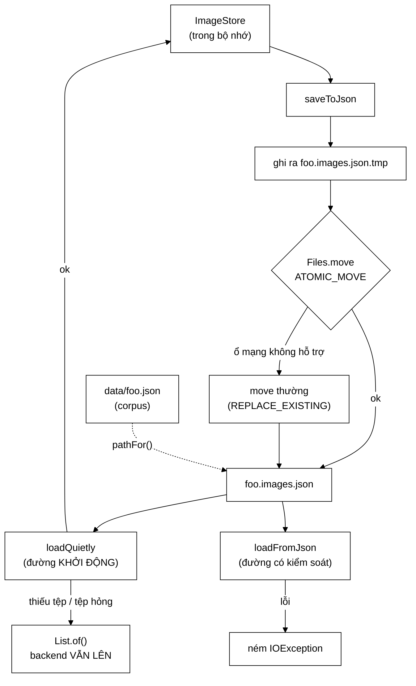

# ImageStorage — tệp anh em của corpus, và ba lý do không nhét thêm trường

**File nguồn:** `search-engine/src/main/java/com/vnsearch/crawler/modular/ImageStorage.java` (168 dòng)
**Gói:** `com.vnsearch.crawler.modular` · **Loại:** `final class`, toàn `static`, không trạng thái
**Vị trí trong sơ đồ:** phần **lưu bền** của [`ImageStore`](./ImageStore.md)
**Đọc kèm:** [`ImageStore.md`](./ImageStore.md) · [`../ContentStorage.md`](../ContentStorage.md) · [`../bus/ImageFound.md`](../bus/ImageFound.md)

---

## 📌 Hiểu trong 30 giây

[`ImageStore`](./ImageStore.md) nằm hoàn toàn trong bộ nhớ tiến trình. Hệ quả
mà Javadoc dòng 23–24 gọi là *"không ai nói ra nhưng ai dùng cũng gặp"*:

> **Khởi động lại backend là mất sạch ảnh.** Tab "Hình ảnh" trống trơn, trong
> khi corpus văn bản trên đĩa vẫn nguyên vẹn và tab "Tất cả" vẫn đầy kết quả.
> Người dùng thấy hai tab bất đồng nhau **mà không có lỗi nào để lần**.

Lớp này là tệp cho kho ảnh. Ba quyết định thiết kế đáng chú ý: **tệp riêng**
(không nhét vào corpus), **tên suy ra** (không cấu hình), và **ghi nguyên tử**.



```
   CẶP TỆP ĐI CÙNG NHAU

   data/crawled-documents.json         ← corpus (87 MB)
   data/crawled-documents.images.json  ← ảnh     ← suy ra từ tên corpus

   data/thu-nghiem.json
   data/thu-nghiem.images.json
```

---

## 1. Hai hệ quả của việc chỉ nằm trong bộ nhớ

Javadoc dòng 21–36.

### 1.1 Khởi động lại là mất sạch

```
   ┌──────────────────────────────────────────────────────────────┐
   │  TRIỆU CHỨNG THẬT MÀ NGƯỜI DÙNG GẶP                          │
   │                                                              │
   │  Sau khi restart backend:                                    │
   │     tab "Tất cả"      →  đầy kết quả  ✓                      │
   │     tab "Hình ảnh"    →  TRỐNG TRƠN   ✗                      │
   │                                                              │
   │  Và KHÔNG CÓ LỖI NÀO để lần:                                 │
   │     - không exception                                        │
   │     - không dòng log                                         │
   │     - API trả 200 với mảng rỗng                              │
   │                                                              │
   │  Người dùng kết luận: "chức năng tìm ảnh hỏng"               │
   │  Thực tế: nó chưa bao giờ được lưu.                          │
   └──────────────────────────────────────────────────────────────┘

   Điều làm nó khó chịu hơn: corpus VĂN BẢN vẫn nguyên vẹn trên đĩa.
   Nên trực giác nói "dữ liệu còn đó", mà thực ra chỉ còn một nửa.
```

Đây là ví dụ điển hình của **trạng thái không đối xứng**: hai loại dữ liệu sinh
ra từ cùng một phiên crawl nhưng có độ bền khác nhau. Người dùng không có cách
nào biết điều đó, nên họ suy luận sai về nguyên nhân.

### 1.2 Công cụ ngoài tiến trình không đọc được gì

```
   crawl-stats.ps1 thống kê corpus bằng cách ĐỌC TỆP.

        Ảnh không có tệp nào  ⇒  không có cách nào đếm
        kể cả khi vừa crawl xong hàng nghìn ảnh.

   ⇒ Muốn biết "phiên crawl vừa rồi thu được bao nhiêu ảnh?"
     phải gọi API của backend ĐANG CHẠY.
     Mà nếu backend đã restart thì con số đó = 0.
```

```
   NGUYÊN TẮC RÚT RA

   Dữ liệu chỉ tồn tại trong bộ nhớ thì:
        ✘ không khảo sát được bằng công cụ ngoài
        ✘ không sao lưu được
        ✘ không so sánh được giữa hai phiên
        ✘ không debug được sau sự cố

   Một tệp giải HẾT bốn vấn đề trên cùng lúc — kể cả những vấn đề
   ta chưa nghĩ tới. Đó là lý do "cứ ghi ra tệp" thường thắng
   "giữ trong bộ nhớ cho nhanh" ở tầng lưu trữ.
```

---

## 2. Tệp **riêng**, không nhét thêm trường vào corpus

Javadoc dòng 38–52. Cách rẻ hơn là thêm một mảng `images` vào mỗi
`WebDocument`. Ba lý do không chọn:

### 2.1 Corpus đang được nhiều bên đọc

```
   ĐỌC corpus hiện tại:
        EvaluationRunner
        TokenizerBenchmark
        QrelsEvaluationRunner
        crawl-stats.ps1
        + JsonDocumentStore, IndexBuilder...

   Đổi lược đồ của nó là ĐỤNG VÀO TẤT CẢ.

   Và với crawl-stats.ps1 (đọc theo dòng, không parse JSON —
   xem mục 4.1), việc thêm một mảng lồng nhau có thể làm
   nó đọc sai mà KHÔNG BÁO LỖI.
```

### 2.2 Ảnh và văn bản có **vòng đời khác nhau** — lý do sâu nhất

```
   VĂN BẢN:  crawler tự lưu, ĐỒNG BỘ, ngay sau Duplicate Detection

   ẢNH:      do một Modular Service RIÊNG sinh ra
             qua BUS
             CÓ THỂ TỚI SAU KHI TRANG ĐÃ ĐƯỢC LƯU

   ┌──────────────────────────────────────────────────────────────┐
   │  t=0      crawler lưu WebDocument("/bai-x") vào corpus       │
   │  t=+50ms  ImageDownloadService phát ImageFound("/bai-x")     │
   │  t=+51ms  ImageStore nhận                                    │
   │                                                              │
   │  NẾU GHÉP CHUNG TỆP:                                         │
   │     → phải MỞ LẠI corpus, tìm document /bai-x, thêm ảnh,     │
   │       ghi lại                                                │
   │     → hoặc phải chờ đủ ảnh rồi mới ghi document              │
   │     → và ở chế độ Kafka, "đủ ảnh" là khái niệm KHÔNG XÁC ĐỊNH│
   │       (thông điệp có thể đến sau vài phút)                   │
   │                                                              │
   │  "Ghép chúng vào một tệp là ÉP HAI NHỊP GHI KHÁC NHAU        │
   │   DÙNG CHUNG MỘT KHOÁ."                                      │
   └──────────────────────────────────────────────────────────────┘
```

Đây là lập luận đáng nhớ nhất của lớp: **hai luồng dữ liệu bất đồng bộ với nhau
thì không nên chia sẻ một đơn vị ghi.** Nó đúng cho tệp, và cũng đúng cho bảng
cơ sở dữ liệu.

### 2.3 Kích thước

```
   Corpus đã là 87 MB cho vài nghìn trang.

   "Ai chỉ cần số liệu ảnh không nên phải quét cả phần bodyText."

   Tệp ảnh: ~25.707 bản ghi × ~250 byte ≈ 6 MB
   ⇒ đọc nhanh hơn ~15 lần cho một câu hỏi chỉ về ảnh.
```

---

## 3. `pathFor` — suy ra chứ không cấu hình

Javadoc dòng 75–90.

```java
public static String pathFor(String corpusPath) {
    if (corpusPath == null || corpusPath.isBlank()) {
        throw new IllegalArgumentException("corpusPath không được rỗng");
    }
    String base = corpusPath.endsWith(".json")
            ? corpusPath.substring(0, corpusPath.length() - ".json".length())
            : corpusPath;
    return base + SUFFIX;          // ".images.json"
}
```

### 3.1 Vì sao không dùng một hằng số `data/images.json`

```
   HẰNG SỐ DÙNG CHUNG — hỏng ngay khi có HAI corpus trong cùng thư mục:

        data/vnexpress.json    ─┐
                                ├──▶  data/images.json   ← GHI ĐÈ LẪN NHAU
        data/tuoitre.json      ─┘

        Phiên crawl thứ hai ghi đè ảnh của phiên thứ nhất.
        ⇒ số ảnh KHÔNG CÒN ỨNG với số trang.
        ⇒ và không có gì báo lỗi — tệp vẫn hợp lệ, chỉ là sai dữ liệu.
```

### 3.2 Nguyên tắc: làm cho trạng thái sai **không biểu diễn được**

Javadoc dòng 86–87 dùng đúng cách nói này:

> Buộc tên tệp ảnh theo tên corpus khiến trạng thái sai đó **không biểu diễn
> được**.

```
   ┌──────────────────────────────────────────────────────────────┐
   │  BA MỨC PHÒNG NGỪA MỘT LỖI                                   │
   │                                                              │
   │  ① Tài liệu:  "nhớ đặt tên tệp ảnh khác nhau cho mỗi corpus" │
   │               → ai đó sẽ quên                                │
   │                                                              │
   │  ② Kiểm tra:  ném lỗi nếu hai corpus dùng chung tệp ảnh       │
   │               → phát hiện được, nhưng chỉ LÚC CHẠY           │
   │                                                              │
   │  ③ THIẾT KẾ:  tên tệp SUY RA từ tên corpus                   │
   │               → trạng thái sai KHÔNG TỒN TẠI ĐƯỢC            │
   │                                                              │
   │  Mức ③ luôn tốt hơn, và ở đây nó còn RẺ HƠN (ít mã hơn).      │
   └──────────────────────────────────────────────────────────────┘
```

Cùng tinh thần với việc dùng `record` để ép bất biến ở
[`PageEvent`](../bus/PageEvent.md) mục 3: thay vì hứa sẽ không sửa, làm cho việc
sửa không biên dịch được.

### 3.3 Ca `corpusPath` không kết thúc bằng `.json`

```
   "data/foo"      →  "data/foo.images.json"
   "data/foo.json" →  "data/foo.images.json"
   "data/foo.txt"  →  "data/foo.txt.images.json"     ← hơi xấu nhưng ĐÚNG

   Ca thứ ba giữ được tính chất quan trọng nhất:
   HAI corpus khác nhau LUÔN cho HAI tệp ảnh khác nhau.
```

---

## 4. Hướng dẫn về code

### 4.1 `INDENT_OUTPUT` là **ràng buộc**, không phải thẩm mỹ

Chú thích dòng 116–120 — đây là chi tiết dễ bị "tối ưu" nhầm nhất:

```java
ObjectMapper mapper = new ObjectMapper()
        .enable(SerializationFeature.INDENT_OUTPUT);
```

```
   crawl-stats.ps1 đọc tệp theo TỪNG DÒNG bằng StreamReader,
   KHÔNG nạp cả cây JSON.

   VÌ SAO ĐỌC THEO DÒNG:
        corpus 87 MB — nạp cả cây JSON vào PowerShell tốn
        hàng trăm MB RAM và vài chục giây.
        Đọc theo dòng + đếm bằng regex: vài giây, RAM không đổi.

   NHƯNG cách đọc đó CHỈ CHẠY khi mỗi trường nằm trên một dòng riêng:

   ┌─ CÓ INDENT_OUTPUT ───────────────────────────────────────┐
   │  [ {                                                     │
   │      "pageUrl" : "https://a.vn/bai-1",                    │
   │      "imageUrl" : "https://cdn.vn/anh.jpg",   ← đếm được │
   │      "altText" : "mô tả"                                  │
   │  }, ... ]                                                │
   └──────────────────────────────────────────────────────────┘

   ┌─ KHÔNG INDENT_OUTPUT ────────────────────────────────────┐
   │  [{"pageUrl":"...","imageUrl":"...","altText":"..."}, ...│
   │   ↑ TOÀN BỘ 6 MB TRÊN MỘT DÒNG                           │
   │   → StreamReader đọc một dòng = nạp cả tệp               │
   │   → hoặc regex khớp sai                                  │
   └──────────────────────────────────────────────────────────┘

   "Tắt INDENT_OUTPUT ở đây là LÀM HỎNG THỐNG KÊ
    mà KHÔNG CÓ LỖI BIÊN DỊCH NÀO BÁO."
```

Đây là loại phụ thuộc nguy hiểm: một script PowerShell bên ngoài phụ thuộc vào
một tuỳ chọn định dạng của Jackson. Chú thích ở đúng chỗ là biện pháp bảo vệ duy
nhất. Xem đề xuất 2 ở mục 7.

### 4.2 Ghi nguyên tử — dòng 124–132

```java
Path temp = filePath.resolveSibling(filePath.getFileName() + ".tmp");
mapper.writeValue(temp.toFile(), new ArrayList<>(images));
try {
    Files.move(temp, filePath, REPLACE_EXISTING, ATOMIC_MOVE);
} catch (AtomicMoveNotSupportedException e) {
    Files.move(temp, filePath, REPLACE_EXISTING);
}
```

```
   GHI THẲNG VÀO TỆP ĐÍCH — kịch bản hỏng:

        ghi được 3 MB / 6 MB  →  Ctrl+C  hoặc mất điện
        →  tệp đích chứa JSON CỤT
        →  lần khởi động sau: loadFromJson ném
        →  và bản cũ ĐÃ MẤT — không còn gì để lùi về

   GHI RA .tmp RỒI ĐỔI TÊN:

        bị cắt ngang  →  chỉ .tmp cụt, tệp đích CÒN NGUYÊN BẢN CŨ
        đổi tên xong  →  tệp đích là bản mới ĐẦY ĐỦ

        KHÔNG CÓ trạng thái nào ở giữa.
```

Javadoc dòng 62–63 nêu một chi tiết quan trọng:

> Điều này quan trọng hơn hẳn khi có **ghi điểm kiểm tra định kỳ**, vì số lần
> ghi đè tăng từ một lên hàng chục mỗi phiên.

```
   Ghi 1 lần/phiên:    xác suất bị cắt ngang thấp
   Ghi 30 lần/phiên:   xác suất cao hơn 30 lần
                       và mỗi lần đều đặt toàn bộ dữ liệu vào rủi ro

   ⇒ Checkpoint làm cho ghi nguyên tử từ "nên có" thành "bắt buộc".
```

**Nhánh dự phòng `AtomicMoveNotSupportedException`** (dòng 129–131): vài hệ tệp
— thường là ổ mạng (SMB/NFS) — không hỗ trợ đổi tên nguyên tử. Lùi về `move`
thường giữ được **phần lớn** lợi ích: cửa sổ rủi ro thu từ "cả thời gian ghi 6
MB" xuống "thời gian đổi tên", tức từ vài giây xuống vài mili-giây.

Cùng cách làm với [`ContentStorage`](../ContentStorage.md) — và sự nhất quán này
có giá trị thật: người đọc mã chỉ cần hiểu khuôn mẫu một lần.

### 4.3 Danh sách rỗng **vẫn được ghi** — dòng 104–107

```
   ┌──────────────────────────────────────────────────────────┐
   │  Tệp chứa []       →  "đã crawl, KHÔNG tìm được ảnh nào" │
   │  KHÔNG có tệp      →  "chưa crawl lần nào"               │
   └──────────────────────────────────────────────────────────┘

   HAI CA NÀY CẦN HAI LỜI KHUYÊN KHÁC NHAU ở crawl-stats:

        []          →  "kiểm tra lại cấu hình bóc ảnh — có thể
                        selector sai, hoặc site dùng quy ước lazy lạ"
                        (xem ImageDownloadService mục 1)

        không tệp   →  "hãy chạy một phiên crawl"

   Bỏ qua việc ghi tệp rỗng "cho đỡ tốn" sẽ gộp hai ca thành một,
   và người dùng nhận sai lời khuyên.
```

Đây là ứng dụng của nguyên tắc **phân biệt "rỗng" với "không có"** — cùng nguyên
tắc đã dùng cho `-1` vs `0` ở [`ImageFound`](../bus/ImageFound.md) mục 4.3, và
cho `outlinks` rỗng ở [`OutlinksExtracted`](../bus/OutlinksExtracted.md) mục
3.3.

### 4.4 `loadFromJson` vs `loadQuietly` — hai hợp đồng khác nhau

```java
public static List<ImageFound> loadFromJson(String path) throws IOException  // NÉM
public static List<ImageFound> loadQuietly(String path)                      // KHÔNG NÉM
```

| | `loadFromJson` | `loadQuietly` |
|---|---|---|
| Lỗi | Ném `IOException` | Trả `List.of()` |
| Dùng khi | Có kiểm soát: test, công cụ, nạp lại thủ công | **Đường khởi động** |
| Lý do | Người gọi cần biết chính xác chuyện gì xảy ra | Backend phải lên được |

Javadoc dòng 153–156 giải thích lựa chọn:

```
   Thiếu ảnh          →  giao diện NGHÈO ĐI
   Ném ở đường khởi động  →  BACKEND KHÔNG LÊN ĐƯỢC
                             → hỏng cả phần tìm kiếm VĂN BẢN
                               vốn chẳng liên quan gì

   "Đánh đổi rõ ràng nghiêng về phía CHẠY ĐƯỢC."

   ⇒ Cùng nguyên tắc "fail-fast lúc khởi động, fail-soft lúc chạy"
     ở KafkaCrawlEventBus mục 3.1 — nhưng ở đây áp NGƯỢC LẠI,
     và có lý do:

        Kafka: tên topic sai = LỖI CẤU HÌNH, sửa 2 phút, phải lộ ra
        Ảnh:   tệp thiếu = TRẠNG THÁI BÌNH THƯỜNG lần chạy đầu tiên

     ⇒ Fail-fast cho thứ CHẮC CHẮN là lỗi;
       fail-soft cho thứ CÓ THỂ là trạng thái hợp lệ.
```

**Điểm yếu thật:** `loadQuietly` bắt `Exception` rồi trả rỗng **mà không ghi
log**. Javadoc nói *"người gọi vẫn ghi log để lần khi cần"* — tức là đẩy trách
nhiệm sang chỗ gọi. Nếu chỗ gọi quên, một tệp ảnh **hỏng** sẽ không phân biệt
được với tệp **không tồn tại**. Xem đề xuất 1.

### 4.5 `loadFromJson` là bài kiểm tra `@JsonIgnore` — dòng 135–142

```java
ImageFound[] images = mapper.readValue(new File(path), ImageFound[].class);
```

Javadoc chỉ thẳng:

```
   Jackson dựng lại ImageFound qua hàm khởi tạo chính của record.
   isDownloaded() và missingAlt() mang @JsonIgnore nên không lọt vào tệp.

   NẾU LỌT  →  chính lời gọi này ném UnrecognizedPropertyException.

   ⇒ Lớp này là MỘT ĐIỂM PHÁT HIỆN THỨ HAI cho lỗi đã xảy ra ở
     ImageFound (xem lớp đó mục 3).

   Và nó phát hiện SỚM HƠN Kafka trong một số ca:
        chạy in-process + lưu tệp + đọc lại  ⇒  lộ ngay
        mà KHÔNG cần dựng broker.
```

Đây là một lợi ích không lên kế hoạch: việc lưu bền bằng JSON vô tình tạo ra một
phép kiểm serialize chạy trong mọi lần khởi động.

### 4.6 Cạm bẫy khi sửa lớp này

| Ý định | Hậu quả |
|---|---|
| Tắt `INDENT_OUTPUT` "cho gọn tệp" | `crawl-stats.ps1` đọc sai — **không có lỗi biên dịch nào báo** |
| Ghi thẳng vào tệp đích | Mất cả bản cũ khi bị cắt ngang |
| Bỏ nhánh `AtomicMoveNotSupportedException` | Không chạy được trên ổ mạng |
| Dùng hằng số `data/images.json` | Hai corpus ghi đè nhau, im lặng |
| Bỏ qua khi danh sách rỗng | Không phân biệt "chưa crawl" với "crawl rồi, không có ảnh" |
| `loadQuietly` ở đường có kiểm soát | Nuốt lỗi thật, che giấu tệp hỏng |
| `loadFromJson` ở đường khởi động | Một tệp hỏng làm backend không lên |
| Thêm trường vào `ImageFound` mà quên `@JsonIgnore` | Tệp cũ đọc không được ⇒ mất toàn bộ ảnh đã lưu |

---

## 5. Độ phức tạp & chi phí

| Thao tác | Chi phí |
|---|---|
| `pathFor` | O(độ dài chuỗi) |
| `saveToJson` | O(n) serialize + một lần ghi tệp |
| `loadFromJson` | O(n) deserialize |
| Bộ nhớ khi ghi | `new ArrayList<>(images)` — **sao chép cả danh sách** |

```
   KÍCH THƯỚC TỆP TRÊN CORPUS 25.707 ẢNH

        25.707 bản ghi × ~250 byte (có indent)  ≈  6,4 MB

   So với corpus: 87 MB  ⇒  tệp ảnh chỉ ~7%.

   THỜI GIAN GHI:  ~200-400 ms cho 6,4 MB
   ⇒ với checkpoint 30 lần/phiên: ~10 giây tổng. Chấp nhận được.
```

**Một chi phí ẩn cần biết:** `new ArrayList<>(images)` ở dòng 125 sao chép toàn
bộ danh sách trước khi ghi.

```
   VÌ SAO CẦN: images là Collection<ImageFound>, có thể là view của
   một ConcurrentHashMap đang được worker khác GHI VÀO.
   Serialize trực tiếp trên view đó → ConcurrentModificationException
   hoặc dữ liệu không nhất quán.

   CÁI GIÁ: một mảng 25.707 tham chiếu ≈ 200 KB tạm thời.
            Rẻ. Nhưng nó KHÔNG PHẢI ảnh chụp nguyên tử — chỉ là
            giảm cửa sổ đua, không xoá hẳn.
```

---

## 6. Kiểm thử liên quan

| Bộ test | Kiểm gì |
|---|---|
| [`ImageStorageTest`](../../../../../test/java/com/vnsearch/crawler/modular/ImageStorageTest.md) | `pathFor`; vòng ghi–đọc; `loadQuietly` |
| [`ImageStoreTest`](../../../../../test/java/com/vnsearch/crawler/modular/ImageStoreTest.md) | Kho trong bộ nhớ |
| [`ImageStorePreloader`](../../config/ImageStorePreloader.md) | Bên gọi `loadQuietly` lúc khởi động |

```
   ĐẦU VÀO                                   KẾT QUẢ MONG ĐỢI
   ──────────────────────────────────────    ─────────────────────────────
   pathFor("data/foo.json")                  "data/foo.images.json"
   pathFor("data/foo")                       "data/foo.images.json"
   pathFor(null) / pathFor("  ")             IllegalArgumentException
   saveToJson([], path)                      TỆP ĐƯỢC TẠO, chứa []
   ghi rồi đọc lại                           danh sách bằng nhau (equals)
   loadQuietly(tệp không tồn tại)            List.of(), KHÔNG ném
   loadQuietly(tệp JSON hỏng)                List.of(), KHÔNG ném
   loadQuietly(null)                         List.of()
   loadFromJson(tệp hỏng)                    NÉM
   thư mục cha chưa tồn tại                  tự tạo (createDirectories)
```

Ba bài test còn thiếu:

```java
// 1. Chống hồi quy INDENT_OUTPUT — bảo vệ phụ thuộc vô hình với crawl-stats.ps1
@Test
void moiTruongNamTrenMotDongRieng() throws Exception {
    ImageStorage.saveToJson(List.of(mauAnh(), mauAnh2()), tmp);
    var dong = Files.readAllLines(Path.of(tmp));
    assertTrue(dong.size() > 5,
            "tệp bị dồn vào ít dòng ⇒ crawl-stats.ps1 sẽ đọc sai");
    assertTrue(dong.stream().anyMatch(d -> d.trim().startsWith("\"imageUrl\"")));
}

// 2. Ghi nguyên tử — tệp cũ còn nguyên khi ghi mới thất bại
@Test
void ghiThatBaiKhongLamHongTepCu() throws Exception {
    ImageStorage.saveToJson(List.of(mauAnh()), tmp);
    var banCu = Files.readString(Path.of(tmp));
    // ép writeValue ném giữa chừng (ví dụ ổ đầy / mock)
    assertThrows(IOException.class, () -> ImageStorage.saveToJson(danhSachGayLoi(), tmp));
    assertEquals(banCu, Files.readString(Path.of(tmp)));
}

// 3. Chống hồi quy @JsonIgnore qua đường tệp — rẻ hơn KafkaCrawlBusIT 3000 lần
@Test
void vongGhiDocKhongMatVaKhongThuaTruong() throws Exception {
    var goc = List.of(mauAnh());
    ImageStorage.saveToJson(goc, tmp);
    assertFalse(Files.readString(Path.of(tmp)).contains("downloaded"));
    assertEquals(goc, ImageStorage.loadFromJson(tmp));
}
```

---

## 7. Liên kết

- Kho trong bộ nhớ mà lớp này ghi ra: [`ImageStore.md`](./ImageStore.md)
- Bản ghi được lưu: [`../bus/ImageFound.md`](../bus/ImageFound.md)
- Cùng khuôn ghi nguyên tử: [`../ContentStorage.md`](../ContentStorage.md) · [`../UrlStorage.md`](../UrlStorage.md)
- Bên nạp lúc khởi động: [`../../config/ImageStorePreloader.md`](../../config/ImageStorePreloader.md)
- Bên ghi khi có ảnh mới: [`../../config/ImageStoreListener.md`](../../config/ImageStoreListener.md)
- Corpus mà tệp này đi kèm: [`../../storage/JsonDocumentStore.md`](../../storage/JsonDocumentStore.md)
- Ca `@JsonIgnore` mà lớp này cũng phát hiện được: [`../bus/ImageFound.md`](../bus/ImageFound.md) mục 3
- Tổng quan: `docs/ARCHITECTURE.md`
