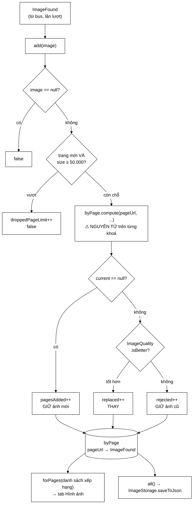

# ImageStore — giữ một ảnh mỗi trang, và giảm 96,1% dung lượng

**File nguồn:** `search-engine/src/main/java/com/vnsearch/crawler/modular/ImageStore.java` (274 dòng)
**Gói:** `com.vnsearch.crawler.modular` · **Loại:** `class`, trạng thái là một `ConcurrentHashMap`
**Vị trí trong sơ đồ:** kho nguồn cho **tab "Hình ảnh"** ở giao diện
**Đọc kèm:** [`ImageQuality.md`](./ImageQuality.md) · [`ImageStorage.md`](./ImageStorage.md) · [`../bus/ImageFound.md`](../bus/ImageFound.md)

---

## 📌 Hiểu trong 30 giây

Trước lớp này, `ImageFound` được phát lên bus rồi **không ai giữ lại** —
`CrawlAnalyticsService` đếm xong là vứt bản ghi. Hệ thống biết *"có 4.213 ảnh"*
nhưng không trả lời được *"ảnh nào nằm ở trang nào"* — mà đó chính là câu hỏi
giao diện cần.

Quyết định trung tâm: **giữ đúng MỘT ảnh cho mỗi trang**, tấm mà
[`ImageQuality`](./ImageQuality.md) chấm là có khả năng cao nhất là ảnh chính
của bài.

```
   ĐO TRÊN CORPUS THẬT (1.028 trang)

   GIỮ TẤT CẢ:    25.707 ảnh / 1.013 trang  =  25 ảnh/trang  →  10,7 MB
   GIỮ MỘT ẢNH:    1.013 ảnh                                 →   0,4 MB
                                                    ────────────────────
                                              GIẢM  96,1%  DUNG LƯỢNG

   Và 24 trong 25 tấm bị bỏ là logo toà soạn, icon chia sẻ,
   và ảnh thu nhỏ của những bài "đọc thêm" ở chân trang.
```



---

## 1. Vì sao chỉ giữ một ảnh mỗi trang

Javadoc dòng 23–48.

### 1.1 Hai triệu chứng nhìn thấy được ở giao diện

```
   ① LƯỚI ẢNH ĐẦY LOGO

      Heuristic "có alt nghĩa là ảnh nội dung" KHÔNG CỨU ĐƯỢC,
      vì logo cũng có alt.

      Bằng chứng cụ thể đo được:
           một tấm 100×42 mang alt="Fica"  ← LOGO
           nằm ở ĐẦU kết quả tìm ảnh

   ② MỘT TÊN MIỀN CHIẾM 38–52% LƯỚI

      Vì một trang nhiều ảnh NUỐT TRỌN phần đầu danh sách:

      Trang A (25 ảnh) ─┐
                        ├──▶ 25 ô đầu tiên của lưới đều là của trang A
      Trang B (1 ảnh)  ─┘    trang B đẩy xuống tận ô 26
```

Triệu chứng ② là loại vấn đề **không lộ ra khi test với dữ liệu nhỏ**: với 3
trang thì lưới trông ổn; với 1.000 trang xếp hạng thì một trang duy nhất chiếm
hết màn hình đầu.

### 1.2 Một quyết định giải cả hai

```
   GIỮ MỘT ẢNH MỖI TRANG:

   ① Logo bị loại  →  vì ImageQuality xếp nó xuống TIER_DECORATIVE
                      và mỗi trang chỉ còn một suất

   ② Không trang nào nuốt lưới  →  mỗi trang góp ĐÚNG một ô
                                   ⇒ lưới đa dạng tự nhiên,
                                     KHÔNG cần thuật toán cân bằng nào

   + Giảm 96,1% dung lượng như một tác dụng phụ.
```

Điểm đáng chú ý: giải pháp thông thường cho vấn đề ② là thêm một bước
"diversification" (giới hạn số kết quả mỗi domain). Ở đây, **ràng buộc một ảnh
mỗi trang khiến bước đó không cần thiết** — một ràng buộc dữ liệu thay thế được
cả một thuật toán.

### 1.3 Cái mất đi — được ghi rõ

Javadoc dòng 44–48:

```
   MẤT:  một trang thư viện ảnh có 30 tấm đáng xem
         →  29 tấm KHÔNG vào chỉ mục

   VÌ SAO CHẤP NHẬN:
        "Đây là máy tìm kiếm TRANG WEB, không phải máy tìm kiếm ẢNH.
         Người dùng bấm vào ảnh là để tới TRANG chứa nó,
         nên mỗi trang xuất hiện một lần là đủ."

   ⇒ Quyết định này đúng cho MỤC TIÊU HIỆN TẠI.
     Nếu mục tiêu đổi (làm máy tìm ảnh thật), nó sẽ sai.

   VÀ Javadoc chỉ luôn chỗ sửa:
        "Muốn đổi hướng thì ImageQuality là chỗ DUY NHẤT phải sửa."
```

Câu cuối là dấu hiệu của thiết kế tốt: **quyết định gây tranh cãi được cô lập
vào một chỗ**, kèm chỉ dẫn cho người muốn đổi.

---

## 2. Chọn dần, không cần thấy hết

Javadoc dòng 50–59. Đây là phần lập luận toán học của lớp.

### 2.1 Bài toán

```
   Ảnh tới LẦN LƯỢT qua bus, KHÔNG thành lô.

   ⇒ Kho không thể "xem hết 25 ảnh của trang rồi chọn tấm tốt nhất".
   ⇒ Nó phải: giữ tấm tốt nhất ĐANG CÓ, thay khi gặp tấm tốt hơn.
```

### 2.2 Vì sao kết quả vẫn đúng

```
   ┌──────────────────────────────────────────────────────────────┐
   │  ImageQuality.compare là một QUAN HỆ THỨ TỰ TOÀN PHẦN.        │
   │                                                              │
   │  Với một quan hệ như vậy, phép chọn CỰC ĐẠI                   │
   │  KHÔNG PHỤ THUỘC THỨ TỰ DUYỆT:                               │
   │                                                              │
   │      max(a, b, c)  ==  max(c, a, b)  ==  max(b, c, a)         │
   │                                                              │
   │  ⇒ "Kết quả cuối cùng GIỐNG HỆT như khi chọn trên toàn bộ     │
   │     danh sách."                                              │
   └──────────────────────────────────────────────────────────────┘

   Đây là lý do thuật toán "một lượt, giữ cực đại" (streaming max)
   là ĐÚNG chứ không phải xấp xỉ.
```

### 2.3 Vì sao điều đó quan trọng ở chế độ Kafka

```
   Kafka bảo đảm:      thứ tự TRONG một phân hoạch
   Kafka KHÔNG bảo đảm: thứ tự GIỮA các phân hoạch

   ⇒ Ảnh của một trang có thể đến theo BẤT KỲ thứ tự nào.

   NẾU phép chọn phụ thuộc thứ tự:
        → hai lần chạy cho hai ảnh đại diện khác nhau
        → tab Hình ảnh đổi nội dung sau mỗi lần crawl lại
        → test không tái hiện được

   Tính chất "không phụ thuộc thứ tự" được bảo đảm bởi HAI thứ:
        ① compare là thứ tự toàn phần          (ImageQuality)
        ② isBetter dùng `> 0`, KHÔNG phải `>= 0` (ImageQuality mục 5.2)

   Thiếu ② thì ① không đủ — hoà sẽ thay, và "ai đến sau" lại quyết định.
```

Hai lớp này phụ thuộc nhau chặt hơn vẻ ngoài: `ImageStore` **đúng** chỉ khi
`ImageQuality` giữ đúng hai tính chất trên. Đó là lý do bài test tính xác định
đề xuất ở [`ImageQuality`](./ImageQuality.md) mục 7 quan trọng cho **cả hai** lớp.

---

## 3. Cấu trúc dữ liệu được rút gọn — và một lớp lỗi biến mất

Javadoc dòng 75–84.

```
   TRƯỚC:  Map<String, Map<String, ImageFound>>
                    ↑ trang        ↑ mọi ảnh của trang đó

           Bảng trong phải là LinkedHashMap (giữ thứ tự DOM)
           bọc synchronizedMap (an toàn đa luồng)

   SAU:    Map<String, ImageFound>
           ConcurrentHashMap thuần
```

```
   ┌──────────────────────────────────────────────────────────────┐
   │  LỚP LỖI BIẾN MẤT                                            │
   │                                                              │
   │  Với cấu trúc cũ, PHÂN TRANG đọc phải hai thứ tự khác nhau    │
   │  ở hai lần gọi:                                              │
   │                                                              │
   │     lần 1 (trang 1):  [a, b, c, d, e]  → trả a, b            │
   │     (một worker thêm ảnh mới vào giữa)                        │
   │     lần 2 (trang 2):  [a, x, b, c, d]  → trả b, c            │
   │                                          ↑ b LẶP LẠI          │
   │                                                              │
   │  Đây là lỗi kinh điển của phân trang trên dữ liệu đang đổi.   │
   │                                                              │
   │  "Thứ tự ảnh TRONG một trang không còn tồn tại thì cũng       │
   │   không còn chuyện phân trang đọc phải hai thứ tự."          │
   └──────────────────────────────────────────────────────────────┘
```

> **Rút gọn mô hình dữ liệu làm biến mất cả một lớp lỗi, chứ không chỉ tiết
> kiệm bộ nhớ.** Đây là lợi ích khó thấy nhất và có giá trị nhất của quyết định
> ở mục 1.

Bảng dưới tóm lại những gì cấu trúc mới **không cần** nữa:

| Cấu trúc cũ cần | Cấu trúc mới |
|---|---|
| `LinkedHashMap` giữ thứ tự trong trang | Không có "thứ tự trong trang" |
| `synchronizedMap` bọc bảng trong | `ConcurrentHashMap` là đủ |
| Trần số ảnh mỗi trang | Không cần — mỗi trang một ảnh |
| Logic khử trùng ảnh trong một trang | `compute` xử lý luôn |
| Xử lý phân trang không ổn định | Không tồn tại |

---

## 4. Hướng dẫn về code

### 4.1 `compute` là nguyên tử — chú thích dòng 115–118

```java
boolean[] won = new boolean[1];
byPage.compute(pageUrl, (url, current) -> {
    if (current == null)                          { won[0] = true; pagesAdded.incrementAndGet(); return image; }
    if (ImageQuality.isBetter(image, current))    { won[0] = true; replaced.incrementAndGet();   return image; }
    rejected.incrementAndGet();
    return current;
});
return won[0];
```

```
   VIẾT SAI (đọc-so-ghi):

        ImageFound current = byPage.get(pageUrl);
        if (ImageQuality.isBetter(image, current)) {
            byPage.put(pageUrl, image);
        }

   KỊCH BẢN ĐUA:
        byPage[/bai-x] = anhKem (bậc 1)

        Luồng A: nhận anhTot (bậc 3), đọc thấy anhKem, quyết định ghi
        Luồng B: nhận anhTB  (bậc 2), đọc thấy anhKem, quyết định ghi
        B ghi anhTB   → byPage = anhTB
        A ghi anhTot  → byPage = anhTot        ✓ may
        --- HOẶC ---
        A ghi anhTot  → byPage = anhTot
        B ghi anhTB   → byPage = anhTB         ✗ ẢNH TỐT HƠN BỊ ĐÈ

   "Kết quả phụ thuộc thời điểm, tức là KHÔNG TÁI LẬP ĐƯỢC."

   compute() khoá riêng ô của khoá đó trong lúc chạy lambda
   ⇒ hai luồng không thể cùng thấy cùng một `current`.
```

Đây là cùng lớp lỗi với `updateAndGet` ở
[`CrawlAnalyticsService`](./CrawlAnalyticsService.md) mục 4.3 — **check-then-act
không nguyên tử**. Cả hai đều được giải bằng cách dùng phép toán nguyên tử có
sẵn thay vì tự viết khoá.

**Mảng một phần tử `boolean[] won`** (dòng 120–121): biến cục bộ dùng trong
lambda phải là `final` hoặc "effectively final", nên không gán lại được. Mảng
một phần tử là thủ thuật chuẩn để mang kết cục ra ngoài. Trông xấu, nhưng đúng
và không có cách gọn hơn trong Java.

### 4.2 Kiểm trần **trước** `compute` — dòng 105–113

```java
if (!byPage.containsKey(pageUrl) && byPage.size() >= MAX_PAGES) {
    droppedPageLimit.incrementAndGet();
    return false;
}
```

```
   `!containsKey` TRƯỚC `size()` là quan trọng:

        Trang ĐÃ CÓ trong kho  →  luôn được cập nhật, KỂ CẢ khi đầy trần
        →  vì nó không làm bảng to thêm
        →  và ta vẫn muốn nâng cấp ảnh đại diện của nó

   NẾU đảo thứ tự (kiểm size trước):
        →  khi đầy trần, MỌI cập nhật bị chặn
        →  kể cả cập nhật cho trang đã có
        →  chất lượng ảnh của 50.000 trang đầu bị đóng băng ở
           tấm ĐẦU TIÊN gặp được — thường là logo
```

Cửa sổ đua ở đây (hai luồng cùng thấy `size() == MAX-1`) được ghi chú là **chấp
nhận có ý thức**, cùng lý do và cùng cách diễn đạt với
[`CrawlAnalyticsService`](./CrawlAnalyticsService.md) mục 2.2. Sự nhất quán
trong cách ghi chép này có giá trị: người đọc nhận ra ngay đây là cùng một
khuôn mẫu đã được cân nhắc.

### 4.3 `forPage` trả `List` chứ không `Optional` — dòng 140–151

```java
public List<ImageFound> forPage(String pageUrl) {
    ImageFound image = byPage.get(pageUrl);
    return image == null ? List.of() : List.of(image);
}
```

Javadoc dòng 143–147 giải thích:

```
   Về mặt kiểu, Optional<ImageFound> ĐÚNG HƠN — danh sách này
   không bao giờ quá 1 phần tử.

   NHƯNG:  FeedController đang gọi images.get(0) sau khi kiểm rỗng.
           Đổi kiểu = phải sửa chỗ gọi.

   Và NGỮ NGHĨA của lời gọi đó KHÔNG ĐỔI —
   chỉ có điều bây giờ phần tử thứ nhất là ảnh TỐT NHẤT
   chứ không phải ảnh đầu tiên theo thứ tự DOM.

   ⇒ Giữ chữ ký cũ, đổi HÀNH VI bên trong.
     Chỗ gọi được cải thiện mà không phải sửa một dòng nào.
```

```
   ĐÁNH ĐỔI:
        ✔ tương thích ngược, chỗ gọi hưởng lợi miễn phí
        ✘ kiểu trả về nói dối một chút (List cho thứ tối đa 1 phần tử)
        ✘ và nó che giấu một thay đổi ngữ nghĩa QUAN TRỌNG —
          người đọc FeedController không biết ảnh đã đổi cách chọn

   ⇒ Chấp nhận được cho một thay đổi, nhưng nên có ghi chú
     ở phía FeedController. Xem đề xuất 3.
```

Javadoc còn nhắc lại con số **19%** từ [`ImageQuality`](./ImageQuality.md) — để
người đọc lớp này hiểu vì sao thay đổi ngữ nghĩa đó là cải thiện, không phải
tuỳ tiện.

### 4.4 `forPages` — tab "Hình ảnh" thừa hưởng xếp hạng của tab "Web"

Javadoc dòng 158–168. Đây là ý tưởng đẹp nhất về mặt sản phẩm:

```java
for (String pageUrl : pageUrls) {          // THỨ TỰ XẾP HẠNG
    if (out.size() >= limit) return out;
    ImageFound image = byPage.get(pageUrl);
    if (image != null && seen.add(image.imageUrl())) {
        out.add(image);
    }
}
```

```
   ┌──────────────────────────────────────────────────────────────┐
   │  pageUrls đến theo THỨ TỰ XẾP HẠNG của máy tìm kiếm.          │
   │  Giữ nguyên thứ tự đó ⇒ ảnh của trang liên quan nhất hiện     │
   │  trước.                                                      │
   │                                                              │
   │  "Tab Hình ảnh THỪA HƯỞNG chất lượng xếp hạng của tab Web     │
   │   mà KHÔNG CẦN một mô hình xếp hạng riêng cho ảnh."           │
   │                                                              │
   │  Xây một mô hình xếp hạng ảnh riêng là công việc HÀNG THÁNG.  │
   │  Ở đây nó có được MIỄN PHÍ, chỉ bằng cách không phá thứ tự.   │
   └──────────────────────────────────────────────────────────────┘
```

**Hai chi tiết cài đặt:**

```
   ① seen (HashSet theo imageUrl)
        Cùng một ảnh có thể là đại diện của NHIỀU trang
        (ảnh chuyên mục dùng chung). Hiện một lần là đủ.
        → tránh lưới ảnh có 5 ô giống hệt nhau

   ② Cảnh báo ở dòng 166-168:
        "số ảnh trả về KHÔNG BAO GIỜ vượt quá số trang truyền vào"

        ⇒ ImageSearchController phải quét ĐỦ NHIỀU TRANG
          thì lưới mới có đủ ảnh để cuộn.

        Muốn 60 ảnh?  → phải truyền vào ÍT NHẤT 60 trang,
                        và thực tế nhiều hơn (vì không phải trang nào
                        cũng có ảnh, và có ảnh trùng bị `seen` loại)
```

Cảnh báo ② là loại thông tin dễ mất nhất khi đọc mã: nó là một **ràng buộc liên
lớp** mà chỉ Javadoc mới nói được.

### 4.5 `all()` trả bản **sao** — dòng 192–206

```java
public List<ImageFound> all() {
    return new ArrayList<>(byPage.values());
}
```

```
   byPage.values() là một VIEW SỐNG của bảng.

   Đưa nó ra ngoài trong lúc crawl:
        → luồng ghi điểm kiểm tra đang duyệt
        → worker khác thêm ảnh
        → ConcurrentModificationException
          (ConcurrentHashMap không ném CME khi duyệt, nhưng
           Jackson serialize một view đang đổi vẫn cho kết quả
           không nhất quán)

   Bản sao: ~1.013 tham chiếu ≈ 8 KB. Rẻ.
```

Javadoc cũng nói rõ **thứ tự không xác định** và vì sao điều đó không sao: người
đọc tệp đều gom lại theo `pageUrl`, còn thứ tự phục vụ tìm kiếm do `forPages`
áp đặt lại theo xếp hạng. Nêu rõ một tính chất *không* được bảo đảm cũng quan
trọng như nêu tính chất được bảo đảm.

### 4.6 `addAll` — chuyển đổi định dạng cũ miễn phí, dòng 208–230

```java
for (ImageFound image : images) {
    if (add(image)) changed++;
}
```

Javadoc dòng 211–215 nêu một hiệu ứng đẹp:

```
   Đi qua ĐÚNG add() chứ không đổ thẳng vào bảng
   ⇒ mọi bất biến vẫn được giữ.

   HIỆU ỨNG CÓ ÍCH KHÔNG LÊN KẾ HOẠCH:

        Nạp một tệp ghi bằng bản mã CŨ (nhiều ảnh mỗi trang)
        → tệp đó TỰ ĐỘNG được rút xuống một ảnh mỗi trang
        → và ảnh được giữ là ảnh TỐT NHẤT trong số đó
        → KHÔNG CẦN bước chuyển đổi (migration) riêng nào

   ⇒ Cùng một phép chọn phục vụ hai việc:
     lọc dòng dữ liệu mới VÀ nâng cấp dữ liệu cũ.
```

Đây là lợi ích của việc **luôn đi qua một cổng duy nhất** thay vì có đường tắt
cho việc nạp hàng loạt.

### 4.7 Bốn bộ đếm, và một phép kiểm tính đúng

Chú thích dòng 265–267 trong `snapshot()` đặc biệt đáng chú ý:

```java
stats.put("candidatesRejected", rejected.get());
// Số ảnh ĐÃ XÉT, không phải số ảnh đang giữ. Chênh lệch giữa hai con số
// cho biết bộ lọc đang loại bao nhiêu — nếu `rejected` bằng 0 trong một
// phiên crawl thật thì gần như chắc chắn ImageQuality không được gọi.
```

```
   ┌──────────────────────────────────────────────────────────────┐
   │  MỘT BỘ ĐẾM ĐƯỢC THIẾT KẾ LÀM PHÉP KIỂM TÍNH ĐÚNG            │
   │                                                              │
   │  rejected == 0 trong một phiên crawl thật                     │
   │      ⇒ với 25 ảnh/trang, không thể có chuyện tấm nào cũng    │
   │        tốt hơn tấm trước                                     │
   │      ⇒ gần như chắc chắn ImageQuality KHÔNG ĐƯỢC GỌI         │
   │                                                              │
   │  Đây là một BÀI TEST CHẠY TRONG SẢN PHẨM, không phải trong    │
   │  bộ test. Nó bắt được ca mà mọi test đơn vị đều bỏ sót:      │
   │  "hàm đúng nhưng không ai gọi nó".                           │
   └──────────────────────────────────────────────────────────────┘

   BẤT BIẾN:  pagesAdded + replaced + rejected == số lần add() hợp lệ
              pageCount() == pagesAdded (trừ phần vượt trần)
```

Lưu ý một điểm nhỏ: `snapshot()` ghi cả `pagesWithImages` và `images` với **cùng
một giá trị** `byPage.size()` — đúng, vì mỗi trang một ảnh, nhưng dư thừa. Giữ
cả hai là để giao diện không phải sửa khi ngữ nghĩa đổi.

### 4.8 Cạm bẫy khi sửa lớp này

| Ý định | Hậu quả |
|---|---|
| Thay `compute` bằng `get` + `put` | Ảnh tốt hơn bị đè, phụ thuộc thời điểm, không tái lập |
| Đảo thứ tự `!containsKey` và `size()` | Khi đầy trần, ảnh của 50.000 trang đóng băng ở tấm đầu (thường là logo) |
| Trả `byPage.values()` trực tiếp từ `all()` | Ảnh chụp không nhất quán trong lúc crawl |
| Bỏ `seen` trong `forPages` | Lưới có nhiều ô giống hệt nhau |
| Sắp xếp lại `pageUrls` trong `forPages` | **Mất toàn bộ** chất lượng xếp hạng thừa hưởng |
| Đổi `forPage` sang `Optional` | Phải sửa `FeedController`; và mất tính tương thích ngược |
| Đổ thẳng vào `byPage` trong `addAll` | Mất phép rút gọn tự động cho tệp định dạng cũ |
| Quay lại giữ mọi ảnh | Kéo về cả một lớp lỗi phân trang — xem mục 3 |

---

## 5. Độ phức tạp & chi phí

| Thao tác | Độ phức tạp | Ghi chú |
|---|---|---|
| `add` | O(1) + chi phí `ImageQuality.compare` | ~4 lần khớp regex |
| `forPage` | O(1) | |
| `forPages(n, limit)` | O(n) | n = số trang truyền vào |
| `all()` | O(số trang) — sao chép | ~1.013 tham chiếu |
| `addAll(m)` | O(m) × chi phí `add` | |
| Bộ nhớ | ≤ 50.000 × (~40 B khoá + ~250 B `ImageFound`) ≈ **14,5 MB** | Có trần |

```
   SO SÁNH BỘ NHỚ

   CẤU TRÚC CŨ (mọi ảnh):
        1.013 trang × 25 ảnh × ~250 B  ≈  6,3 MB
        + chi phí bảng lồng nhau       ≈  +2 MB
        + LinkedHashMap + synchronizedMap wrapper
        ⇒ ~10,7 MB TRÊN ĐĨA, nhiều hơn trong RAM

   CẤU TRÚC MỚI:
        1.013 trang × 1 ảnh × ~250 B   ≈  0,25 MB
        ⇒ 0,4 MB TRÊN ĐĨA

        ┌──────────────────────────────────────────────┐
        │  cũ  ████████████████████████████  10,7 MB   │
        │  mới ▌                              0,4 MB   │
        └──────────────────────────────────────────────┘
                                    GIẢM 96,1%

   TRẦN MAX_PAGES = 50.000
        Corpus hiện tại: 31.030 trang  →  chưa chạm trần
        Trần chỉ bảo vệ chống việc bảng lớn tuyến tính vô hạn theo corpus.
```

Chi phí `add` chủ yếu nằm ở `ImageQuality.compare` (~4 lần khớp regex). Với
25.707 lần gọi trên cả phiên: ~0,1 giây. Không đo được.

---

## 6. Kiểm thử liên quan

| Bộ test | Kiểm gì |
|---|---|
| [`ImageStoreTest`](../../../../../test/java/com/vnsearch/crawler/modular/ImageStoreTest.md) | `add`, `forPage`, `forPages`, trần, bộ đếm |
| [`ImageStorageTest`](../../../../../test/java/com/vnsearch/crawler/modular/ImageStorageTest.md) | Lưu bền |
| [`ImageDownloadServiceTest`](../../../../../test/java/com/vnsearch/crawler/modular/ImageDownloadServiceTest.md) | Nguồn `ImageFound` |

```
   ĐẦU VÀO                                        KẾT QUẢ MONG ĐỢI
   ────────────────────────────────────────────   ─────────────────────────
   add(null)                                      false
   add(ảnh đầu tiên của trang)                    true, pagesAdded==1
   add(ảnh KÉM hơn cùng trang)                    false, rejected==1
   add(ảnh TỐT hơn cùng trang)                    true, replaced==1
   add cùng một ảnh hai lần                       lần 2 → false (không tốt hơn)
   forPage(trang chưa có)                         List.of()
   forPage(trang có ảnh)                          đúng 1 phần tử
   forPages([A,B,C], limit=2)                     2 ảnh, ĐÚNG thứ tự A,B
   forPages có 2 trang cùng ảnh                   ảnh hiện 1 lần
   forPages(null) / limit=0                       danh sách rỗng
   50.001 trang phân biệt                         droppedPageLimit ≥ 1
   trang ĐÃ CÓ, kho đã đầy trần                   VẪN cập nhật được
   addAll(tệp định dạng cũ, 25 ảnh/trang)         rút xuống 1 ảnh/trang
   clear()                                        pageCount()==0
```

Ba bài test còn thiếu, và bài đầu bảo vệ tính chất trung tâm ở mục 2:

```java
// 1. Kết quả KHÔNG phụ thuộc thứ tự đến — lập luận ở mục 2.2/2.3
@Test
void ketQuaGiongNhauVoiMoiThuTuDen() {
    var anh = List.of(anhLogo(), anhBaiTot(), anhThumb(), anhBaiTB());
    var ketQua = new HashSet<String>();
    for (var hoanVi : moiHoanViCua(anh)) {
        var kho = new ImageStore();
        hoanVi.forEach(kho::add);
        ketQua.add(kho.forPage("https://a.vn/bai").get(0).imageUrl());
    }
    assertEquals(1, ketQua.size(),
            "ảnh đại diện đổi theo thứ tự đến ⇒ không tái lập được ở chế độ Kafka");
}

// 2. add() an toàn khi gọi song song
@RepeatedTest(20)
void addAnToanDaLuong() throws Exception {
    var kho = new ImageStore();
    var pool = Executors.newFixedThreadPool(16);
    var latch = new CountDownLatch(200);
    for (int i = 0; i < 200; i++) {
        int k = i;
        pool.submit(() -> { kho.add(anhVoiBeRong("https://a.vn/bai", k)); latch.countDown(); });
    }
    latch.await(10, TimeUnit.SECONDS);
    assertEquals(199, ImageQuality.estimatedWidth(kho.forPage("https://a.vn/bai").get(0)),
            "ảnh rộng nhất phải thắng bất kể thứ tự");
}

// 3. Trần không chặn cập nhật cho trang đã có
@Test
void trangDaCoVanCapNhatDuocKhiDayTran() {
    var kho = new ImageStore();
    for (int i = 0; i < ImageStore.MAX_PAGES; i++) kho.add(anhCua("https://a.vn/bai-" + i));
    assertTrue(kho.add(anhTotHonCua("https://a.vn/bai-0")));
}
```

---

## 7. Liên kết

- Phép chấm điểm quyết định ảnh nào được giữ: [`ImageQuality.md`](./ImageQuality.md)
- Phần lưu bền: [`ImageStorage.md`](./ImageStorage.md)
- Bản ghi được lưu: [`../bus/ImageFound.md`](../bus/ImageFound.md)
- Service sinh ra ảnh: [`ImageDownloadService.md`](./ImageDownloadService.md)
- Bên tiêu thụ: [`../../controller/ImageSearchController.md`](../../controller/ImageSearchController.md) · [`../../controller/FeedController.md`](../../controller/FeedController.md)
- Nạp lúc khởi động / ghi khi có ảnh mới: [`../../config/ImageStorePreloader.md`](../../config/ImageStorePreloader.md) · [`../../config/ImageStoreListener.md`](../../config/ImageStoreListener.md)
- Cùng khuôn ghi chú cuộc đua có ý thức: [`CrawlAnalyticsService.md`](./CrawlAnalyticsService.md) mục 2.2
- Tổng quan: `docs/ARCHITECTURE.md`
