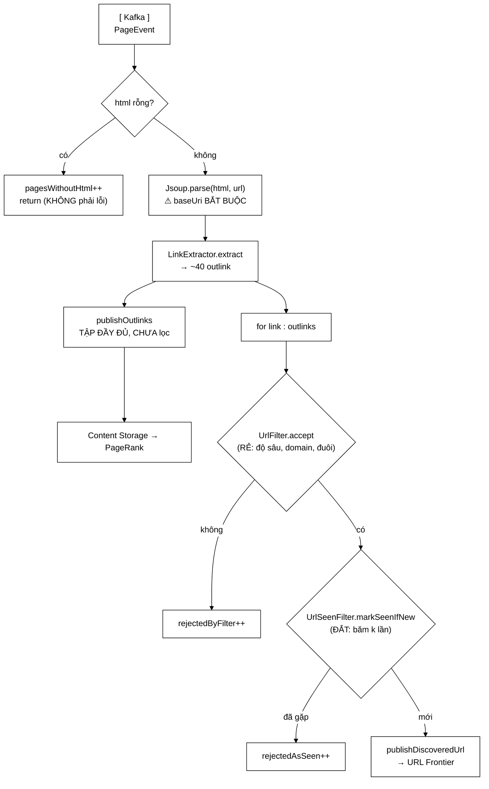

# UrlExtractorService — bốn dòng trong `processPage` được tách ra, và ba thứ thu về

**File nguồn:** `search-engine/src/main/java/com/vnsearch/crawler/modular/UrlExtractorService.java` (226 dòng)
**Gói:** `com.vnsearch.crawler.modular` · **Loại:** `class`, cài [`PageEventHandler`](../bus/PageEventHandler.md)
**Vị trí trong sơ đồ:** **Modular Service 1 — "URL Extractor"**, và trọn chặng dưới của sơ đồ
**Đọc kèm:** [`../bus/OutlinksExtracted.md`](../bus/OutlinksExtracted.md) · [`../bus/DiscoveredUrl.md`](../bus/DiscoveredUrl.md) · [`../LinkExtractor.md`](../LinkExtractor.md)

---

## 📌 Hiểu trong 30 giây

Đây là service **khép lại vòng lặp crawl**: nhận trang đã sạch từ bus, bóc liên
kết, và phát ra **hai luồng khác nhau** cho hai mục đích loại trừ nhau.

Phần việc này trước đây là **bốn dòng** trong `CrawlerService.processPage`.
Tách ra thành service riêng, và Javadoc dòng 35–51 liệt kê ba thứ thu về — thứ
thứ ba là thứ đáng giá nhất và cũng là lý do dùng **Kafka** chứ không phải một
hàng đợi công việc.



```
   MỘT TRANG → HAI LUỒNG RA

   ┌─────────────────────────────────────────────────────────────┐
   │  publishOutlinks     40 liên kết   CHƯA lọc   → PageRank    │
   │  publishDiscoveredUrl 12 liên kết  ĐÃ lọc     → Frontier    │
   └─────────────────────────────────────────────────────────────┘

   Gộp lại là hỏng MỘT trong hai — xem OutlinksExtracted.md mục 1.
```

---

## 1. Ba thứ thu được khi tách service

Javadoc dòng 39–51.

### 1.1 Co giãn độc lập — hai loại nút thắt khác nhau

```
   BÓC LIÊN KẾT:  tốn CPU        (phân tích lại DOM, ~3-8 ms)
   TẢI TRANG:     chờ MẠNG       (~200-800 ms, chủ yếu là ngồi đợi)

   ┌──────────────────────────────────────────────────────────────┐
   │  NHỐT CHUNG MỘT TIẾN TRÌNH                                   │
   │                                                              │
   │  Phải chọn MỘT số luồng thoả hiệp cho cả hai:                │
   │     - nhiều luồng  → tốt cho chờ mạng, nhưng CPU tranh nhau  │
   │     - ít luồng     → tốt cho CPU, nhưng mạng ngồi không      │
   │                                                              │
   │  Và cả hai đều không đạt tối ưu.                             │
   ├──────────────────────────────────────────────────────────────┤
   │  TÁCH RA                                                     │
   │                                                              │
   │  Crawler:      nhiều luồng (chờ mạng), ít CPU                │
   │  UrlExtractor: số luồng ≈ số nhân (tốn CPU)                  │
   │                                                              │
   │  Mỗi bên chỉnh riêng theo nút thắt CỦA MÌNH.                 │
   └──────────────────────────────────────────────────────────────┘
```

Đây là cùng tiêu chí đã dùng cho [`ImageDownloadService`](./ImageDownloadService.md):
**hai phần việc có nút thắt khác nhau thì nên co giãn riêng.**

### 1.2 Hỏng riêng

```
   Một trang có DOM dị dạng làm Jsoup ném ngoại lệ.

   TRƯỚC (trong processPage):
        ngoại lệ bay lên vòng lặp tải trang
        → trang đó bị tính là lỗi tải (dù đã tải xong)
        → và nếu là lỗi lặp lại, cả worker chết

   SAU (service riêng):
        in-process → InProcessCrawlEventBus bọc try/catch, hai service kia vẫn chạy
        Kafka      → thông điệp vào dead-letter, các trang khác không ảnh hưởng
```

### 1.3 Chạy lại được — lý do dùng Kafka, không phải hàng đợi công việc

Đây là điểm đắt giá nhất và cũng dễ bị bỏ qua nhất:

```
   ┌──────────────────────────────────────────────────────────────┐
   │  TÌNH HUỐNG THẬT:                                            │
   │  Sau khi crawl xong 31.030 trang, phát hiện luật UrlFilter    │
   │  đang bỏ sót đường dẫn dạng /video/... — mất hàng nghìn trang │
   ├──────────────────────────────────────────────────────────────┤
   │  KIẾN TRÚC GỌI HÀM TRỰC TIẾP:                                │
   │     → sửa luật → CRAWL LẠI TỪ ĐẦU                            │
   │     → 8,6 giờ, và làm phiền lại toàn bộ các site              │
   ├──────────────────────────────────────────────────────────────┤
   │  HÀNG ĐỢI CÔNG VIỆC (RabbitMQ, SQS...):                       │
   │     → thông điệp TIÊU THỤ XONG LÀ MẤT                        │
   │     → cũng phải crawl lại                                    │
   ├──────────────────────────────────────────────────────────────┤
   │  KAFKA (log TUA LẠI ĐƯỢC):                                   │
   │     → sửa luật                                               │
   │     → đặt lại offset của consumer group về 0                 │
   │     → bóc lại toàn bộ liên kết của corpus cũ                 │
   │     → KHÔNG crawl lại MỘT trang nào                          │
   │     → vài phút thay vì 8,6 giờ                               │
   └──────────────────────────────────────────────────────────────┘
```

> **Kafka không phải "hàng đợi tin nhắn có thương hiệu".** Nó là một **log lưu
> giữ**, và khả năng tua lại là tính chất phân biệt nó với mọi hàng đợi công
> việc. Ở dự án này, khả năng đó chính là thứ biến việc sửa luật lọc từ "crawl
> lại 8,6 giờ" thành "chạy lại vài phút".

Đây là lập luận đáng nói nhất khi bảo vệ lựa chọn công nghệ.

---

## 2. Vì sao phân tích lại HTML thay vì nhận sẵn cây DOM

Javadoc dòng 53–65. Phần trung thực nhất của lớp, vì nó tự nêu cái giá.

### 2.1 Cây DOM không serialize được

```
   Document của Jsoup là một ĐỒ THỊ ĐỐI TƯỢNG có THAM CHIẾU VÒNG:

        <html>
          └── <body>          body.parent() → html
                └── <div>     div.parent()  → body
                      ↑                        ↓
                      └────────────────────────┘   VÒNG

   Jackson gặp vòng → StackOverflowError hoặc lặp vô hạn.
   ⇒ Qua Kafka BẮT BUỘC phải là HTML thô.
   ⇒ Bên nhận PHẢI phân tích lại: ~3-8 ms/trang.

   TRÊN CẢ CORPUS:  31.030 × 5 ms ≈ 2,6 phút CPU

   Javadoc dòng 57-58 gọi đúng tên: "cái giá THẬT của việc tách
   tiến trình, ghi ra đây để không ai tưởng nó miễn phí."
```

### 2.2 Điểm gây tranh cãi: in-process **cũng** phân tích lại

```
   Ở chế độ in-process, CrawlerService ĐÃ CÓ SẴN cây DOM
   (nó vừa dùng để bóc title và bodyText).
   Nhưng service này chỉ nhận PageEvent, nên vẫn parse lại.

   → 2,6 phút CPU bị "lãng phí" ngay cả khi không cần.

   VÌ SAO CHẤP NHẬN?
```

```
   ┌──────────────────────────────────────────────────────────────┐
   │  PHƯƠNG ÁN "đường tắt": nếu in-process thì truyền thẳng       │
   │  Document, khỏi parse lại.                                    │
   │                                                              │
   │  HẬU QUẢ:                                                    │
   │    → HAI nhánh hành xử khác nhau trong cùng một service       │
   │    → nhánh Kafka CHỈ chạy ở môi trường thật                   │
   │    → tức là nhánh KHÔNG ĐƯỢC TEST                            │
   │    → và mọi khác biệt hành vi giữa hai nhánh sẽ chỉ lộ ra     │
   │      lúc triển khai                                          │
   │                                                              │
   │  Đây ĐÚNG là lớp lỗi đã cắn dự án một lần rồi —              │
   │  xem ImageFound.md mục 3.2                                    │
   └──────────────────────────────────────────────────────────────┘

   ⇒ CHỌN: một đường mã duy nhất cho cả hai chế độ.
     Trả 2,6 phút CPU trên 8,6 giờ crawl (0,5%) để đổi lấy việc
     KHÔNG có nhánh mã nào không được test.
```

Nguyên tắc rút ra, và nó lặp lại nguyên tắc ở
[`InProcessCrawlEventBus`](../bus/InProcessCrawlEventBus.md) mục 2.2:

> **Hai chế độ triển khai phải đi chung một đường mã.** Mọi "tối ưu chỉ áp dụng
> cho chế độ đơn giản" đều tạo ra một nhánh không được kiểm chứng ở chế độ thật.

---

## 3. Thứ tự hai phép lọc — rẻ trước, đắt sau

Javadoc dòng 67–71.

```java
for (String link : outlinks) {
    if (!urlFilter.get().accept(link, childDepth)) {   // ① RẺ
        rejectedByFilter.incrementAndGet();
        continue;
    }
    if (!urlSeenFilter.get().markSeenIfNew(link)) {    // ② ĐẮT
        rejectedAsSeen.incrementAndGet();
        continue;
    }
    ...
}
```

```
   ① UrlFilter:      so chuỗi, so độ sâu, so đuôi tệp
                     ~0,1 µs/URL          RẺ

   ② UrlSeenFilter:  băm k lần vào Bloom Filter (k ≈ 7)
                     ~1-2 µs/URL          ĐẮT HƠN ~15 LẦN

   ĐO THỰC TẾ trên corpus (từ các bộ đếm của chính lớp này):

        40 liên kết/trang
         ├─ ~10 bị UrlFilter loại  (ngoài domain, .pdf, .jpg, quá sâu)
         ├─ ~18 bị UrlSeen loại    (đã gặp)
         └─ ~12 được chấp nhận

   THỨ TỰ ĐÚNG (rẻ trước):   40 × rẻ + 30 × đắt
   THỨ TỰ SAI (đắt trước):   40 × đắt + 30 × rẻ

   Chênh: 10 lượt băm k lần mỗi trang × 31.030 trang
        = 310.300 lượt băm tiết kiệm được
```

Ngoài hiệu năng còn một lý do **đúng đắn** quan trọng hơn:

```
   UrlSeenFilter.markSeenIfNew() có TÁC DỤNG PHỤ — nó GHI vào Bloom Filter.

   Nếu chạy nó TRƯỚC UrlFilter:
        → mọi URL .pdf, .jpg, ngoài domain đều bị ĐÁNH DẤU "đã gặp"
        → Bloom Filter bị bơm đầy bằng rác
        → tỷ lệ false positive tăng
        → và false positive ở đây nghĩa là BỎ SÓT một trang thật

   ⇒ Thứ tự này không chỉ nhanh hơn — nó GIỮ SẠCH bộ lọc Bloom.
```

Đây là điểm mà lập luận "chỉ là tối ưu vi mô" sẽ bỏ sót: một hàm có tác dụng
phụ thì thứ tự gọi là vấn đề **đúng/sai**, không phải nhanh/chậm.

---

## 4. `Supplier<UrlFilter>` — bắt buộc, không phải phong cách

Javadoc dòng 82–92. Đây là quyết định thiết kế tinh tế nhất của lớp.

```java
private final Supplier<UrlFilter> urlFilter;
private final Supplier<UrlSeenFilter> urlSeenFilter;
```

### 4.1 Vấn đề

```
   CrawlerService cấp phát LẠI UrlFilter và UrlSeenFilter cho TỪNG PHIÊN crawl,
   vì chúng phụ thuộc tham số của phiên:

        UrlFilter      ← allowedDomains, maxDepth
        UrlSeenFilter  ← maxPages (quyết định kích thước Bloom Filter)

   NHƯNG UrlExtractorService là một BEAN DÙNG CHUNG, sống suốt vòng đời ứng dụng.
```

```
   NẾU GIỮ THAM CHIẾU CỐ ĐỊNH (UrlFilter thay vì Supplier<UrlFilter>):

   ┌──────────────────────────────────────────────────────────────┐
   │  Phiên 1:  crawl vnexpress.net, maxDepth=3                   │
   │            → service nhận UrlFilter(vnexpress.net, depth≤3)  │
   │                                                              │
   │  Phiên 2:  crawl tuoitre.vn, maxDepth=5                      │
   │            → CrawlerService tạo UrlFilter MỚI                │
   │            → nhưng service VẪN GIỮ bộ lọc CŨ                 │
   │                                                              │
   │  HẬU QUẢ ①: phiên 2 lọc theo domain của phiên 1              │
   │             → MỌI liên kết của tuoitre.vn bị loại            │
   │             → frontier không được nạp                        │
   │             → phiên 2 crawl được đúng các URL hạt giống rồi   │
   │               DỪNG, không báo lỗi gì                         │
   │                                                              │
   │  HẬU QUẢ ②: Bloom Filter KHÔNG BAO GIỜ được làm mới          │
   │             → càng chạy càng đầy                             │
   │             → tỷ lệ false positive tăng dần                  │
   │             → "càng chạy càng báo đã gặp cho MỌI THỨ"        │
   │             → sau vài phiên, crawler gần như không crawl      │
   │               được gì, mà không có một dòng lỗi nào          │
   └──────────────────────────────────────────────────────────────┘
```

Hậu quả ② đặc biệt xấu vì nó **tiến triển dần**: phiên 2 hơi kém, phiên 5 kém
rõ, phiên 10 gần như vô dụng. Không có mốc nào để nhận ra.

### 4.2 Lời giải và cái giá

```java
urlFilter.get().accept(link, childDepth)
//        ↑↑↑↑↑ lấy bộ lọc TẠI THỜI ĐIỂM GỌI
```

```
   ✔ Luôn dùng bộ lọc của phiên ĐANG chạy
   ✔ Service không cần biết vòng đời phiên crawl
   ✔ Không cần cơ chế "đăng ký lại" hay "reset" nào

   CÁI GIÁ: một lời gọi get() cho MỖI liên kết.
        40 liên kết × 31.030 trang = 1,24 triệu lần gọi get()

   Với một lambda `() -> this.currentFilter` thì get() chỉ là
   một lần đọc trường — vài nano-giây. Tổng: ~vài mili-giây.
   ⇒ Không đáng kể.

   NHƯNG: nếu Supplier được cài bằng thứ gì đắt (tra Spring context,
   dựng đối tượng mới mỗi lần), 1,24 triệu lần gọi sẽ thành vấn đề thật.
   ⇒ Hợp đồng ngầm: Supplier ở đây PHẢI rẻ. Xem đề xuất 3 ở mục 8.
```

Đây là ứng dụng của mẫu **lazy lookup**: thay vì tiêm giá trị, tiêm cách lấy giá
trị. Nó là lời giải chuẩn cho tình huống "bean sống lâu cần dùng đối tượng sống
ngắn".

---

## 5. Hướng dẫn về code

### 5.1 `baseUri` trong `Jsoup.parse` — chú thích dòng 128–131

```java
Document document = Jsoup.parse(event.html(), event.url());
//                                            ↑↑↑↑↑↑↑↑↑↑↑ BẮT BUỘC
```

```
   baseUri là thứ để absUrl("href") phân giải liên kết TƯƠNG ĐỐI.

   THIẾU NÓ:
        <a href="/tin-tuc/bai-1">  →  absUrl("href")  →  ""  (CHUỖI RỖNG)

        → trang coi như KHÔNG CÓ LIÊN KẾT NÀO
        → frontier không được nạp
        → crawler dừng sau vài trang

   TRIỆU CHỨNG:
        ✘ KHÔNG có exception
        ✘ KHÔNG có dòng lỗi
        ✘ chỉ là "crawl xong 5 trang rồi dừng"
        ✔ và các bộ đếm sẽ nói: linksExtracted == 0

   ⇒ Đây là lý do bộ đếm linksExtracted tồn tại: nó là dấu hiệu
     DUY NHẤT phân biệt "trang không có liên kết" với "ta parse sai".
```

Trên báo điện tử Việt Nam, **gần như 100%** liên kết nội bộ là tương đối
(`/the-thao/bai-x`), nên thiếu `baseUri` là hỏng hoàn toàn chứ không phải hỏng
một phần.

### 5.2 `html` rỗng → `return`, không phải lỗi — dòng 121–126

```java
if (event.html() == null || event.html().isBlank()) {
    pagesWithoutHtml.incrementAndGet();
    return;
}
```

Chú thích giải thích: một `PageEvent` rút gọn (từ
[`withoutHtml()`](../bus/PageEvent.md)) vẫn **hợp lệ** cho Analytics. Chỉ
service này mới cần DOM.

```
   ĐÚNG:  đếm rồi return
   SAI ①: ném ngoại lệ → thông điệp hợp lệ vào dead-letter
   SAI ②: return im lặng, không đếm → không ai biết bao nhiêu trang bị bỏ

   Bộ đếm pagesWithoutHtml là thứ phân biệt:
        "đúng như thiết kế"  vs  "có ai đó đang gửi nhầm"
   Nếu nó bằng 0 thì mọi thứ bình thường; nếu nó bằng pagesProcessed
   thì có người đang truyền withoutHtml() vào nhầm chỗ.
```

### 5.3 `hostOf` — lùi về chính URL, dòng 167–182

```java
private static String hostOf(String url) {
    try {
        String host = URI.create(url).getHost();
        return host != null && !host.isBlank() ? host : url;
    } catch (Exception e) {
        return url;
    }
}
```

```
   BA ĐƯỜNG THOÁT, đều trả về `url`:
        ① URI.create ném (URL dị dạng)
        ② getHost() trả null (một số dạng URL hợp lệ về cú pháp)
        ③ getHost() trả chuỗi rỗng

   VÌ SAO KHÔNG trả null hay ném?

        DiscoveredUrl TỪ CHỐI host rỗng (compact constructor ném).
        → nếu hostOf trả null, thông điệp không tạo được
        → ngoại lệ bay lên giữa vòng lặp
        → CÁC LIÊN KẾT CÒN LẠI của trang đó KHÔNG được xử lý
        → một URL dị dạng làm mất cả trang

   VỚI cách lùi về url:
        → URL dị dạng tự nó làm khoá phân hoạch
        → nó nằm MỘT MÌNH trên một phân hoạch nào đó
        → vô hại: không host thật nào bị nó chiếm chỗ
        → và vòng lặp chạy tiếp bình thường
```

Javadoc gọi đây là "cùng quy ước với `UrlFrontier.addUrl`" — sự nhất quán này
quan trọng, vì hai chỗ cùng phải trả lời câu hỏi *"host của một URL không phân
giải được là gì?"* và hai câu trả lời khác nhau sẽ làm URL đó được xử lý khác
nhau ở hai chặng.

### 5.4 `jobId` đi theo suốt chuỗi — chú thích dòng 155–156

```java
bus.publishDiscoveredUrl(new DiscoveredUrl(
        link, hostOf(link), childDepth, event.url(), event.jobId()));
//                                                   ↑↑↑↑↑↑↑↑↑↑↑↑↑
```

```
   CHUỖI TRUYỀN:  trang → liên kết → frontier

        PageEvent.jobId  →  DiscoveredUrl.jobId  →  frontier của phiên đó

   Mất nó ở MỘT chặng thì URL không biết đường về phiên crawl của mình.
   Hậu quả đầy đủ: xem PageEvent.md mục 4.

   Chú ý publishOutlinks (dòng 141-142) CŨNG truyền jobId — vì Content
   Storage cũng phân theo phiên.
```

### 5.5 Sáu bộ đếm và bất biến giữa chúng

| Bộ đếm | Ý nghĩa |
|---|---|
| `pagesProcessed` | Số trang **có HTML** đã xử lý |
| `pagesWithoutHtml` | Số trang bị bỏ vì không có HTML |
| `linksExtracted` | Tổng liên kết bóc được (trước lọc) |
| `rejectedByFilter` | Bị `UrlFilter` loại |
| `rejectedAsSeen` | Bị `UrlSeenFilter` loại |
| `linksAccepted` | Được phát đi frontier |

```
   BẤT BIẾN PHẢI LUÔN ĐÚNG:

        linksExtracted == rejectedByFilter + rejectedAsSeen + linksAccepted

   Đây là một bài test rất rẻ và rất mạnh (xem mục 7).
   Nếu nó sai, nghĩa là có một đường thoát nào đó không được đếm.
```

`getAverageOutlinksPerPage()` (dòng 215–225) tồn tại vì một lý do rất cụ thể:
`UrlSeenFilter.URLS_SEEN_PER_PAGE` dựa vào con số này để cấp phát Bloom Filter
(đang đặt **200**, đo được **78,8**). Phơi ra đây để lần đo sau không phải viết
công cụ riêng — một ví dụ tốt về việc **để lại dụng cụ đo cho người sau**.

### 5.6 Cạm bẫy khi sửa lớp này

| Ý định | Hậu quả |
|---|---|
| Đổi `Supplier<UrlFilter>` thành `UrlFilter` | Phiên 2 lọc theo domain phiên 1; Bloom Filter không bao giờ mới — xem 4.1 |
| Bỏ `baseUri` trong `Jsoup.parse` | Mọi liên kết tương đối thành `""` — crawler dừng lặng lẽ |
| Đảo thứ tự hai phép lọc | Bloom Filter bị bơm rác ⇒ false positive tăng ⇒ bỏ sót trang thật |
| Lọc `outlinks` trước khi `publishOutlinks` | PageRank mất cạnh nội bộ — xem [`OutlinksExtracted`](../bus/OutlinksExtracted.md) mục 1 |
| Thêm đường tắt "in-process truyền Document" | Tạo nhánh mã không được test — xem 2.2 |
| Ném khi `html` rỗng | Thông điệp hợp lệ vào dead-letter |
| `hostOf` trả `null` khi không parse được | Ngoại lệ giữa vòng lặp ⇒ mất các liên kết còn lại của trang |
| Cài `Supplier` bằng thứ đắt | 1,24 triệu lời gọi `get()` thành nút thắt thật |

---

## 6. Độ phức tạp & chi phí

| Thao tác | Độ phức tạp | Chi phí thực tế |
|---|---|---|
| `Jsoup.parse` | O(kích thước HTML) | **3–8 ms** ← chi phí chính |
| `LinkExtractor.extract` | O(số nút DOM) | ~1 ms |
| `UrlFilter.accept` | O(1) | ~0,1 µs × 40 |
| `UrlSeenFilter.markSeenIfNew` | O(k), k ≈ 7 | ~1–2 µs × 30 |
| `publishOutlinks` | O(số outlink) | 1 thông điệp |
| `publishDiscoveredUrl` | O(1) mỗi URL | ~12 thông điệp |
| Bộ nhớ giữ | 6 `AtomicLong` | < 100 byte |

```
   PHÂN RÃ THỜI GIAN MỖI TRANG (~5 ms tổng)

        Jsoup.parse       ████████████████████  ~4 ms   (80%)
        extract           █████                 ~1 ms   (20%)
        40 × accept       ▏                     ~4 µs
        30 × markSeen     ▏                     ~45 µs

   ⇒ 80% chi phí nằm ở việc PHÂN TÍCH LẠI DOM — đúng cái giá
     đã được ghi ra ở mục 2.1.

   TRÊN CẢ CORPUS:  31.030 × 5 ms ≈ 2,6 phút
   trên tổng 8,6 giờ crawl = 0,5%
```

Kết luận: chi phí phân tích lại DOM là **thật nhưng nhỏ**, và nó mua được tính
nhất quán giữa hai chế độ. Nếu sau này corpus lớn gấp 100 lần, 0,5% vẫn là
0,5% — chi phí này co giãn tuyến tính cùng với chính việc crawl, nên nó không
bao giờ trở thành nút thắt tương đối.

---

## 7. Kiểm thử liên quan

| Bộ test | Kiểm gì |
|---|---|
| [`UrlExtractorServiceTest`](../../../../../test/java/com/vnsearch/crawler/modular/UrlExtractorServiceTest.md) | Hai luồng ra; thứ tự lọc; `Supplier` lấy đúng bộ lọc hiện hành |
| [`LinkExtractorTest`](../../../../../test/java/com/vnsearch/crawler/LinkExtractorTest.md) | Phép bóc liên kết bên dưới |
| [`UrlFilterTest`](../../../../../test/java/com/vnsearch/crawler/UrlFilterTest.md) · [`UrlSeenFilterTest`](../../../../../test/java/com/vnsearch/crawler/UrlSeenFilterTest.md) | Hai bộ lọc |

```
   ĐẦU VÀO                                     KẾT QUẢ MONG ĐỢI
   ─────────────────────────────────────────   ───────────────────────────
   html=null                                   pagesWithoutHtml==1, không ném
   html="  "                                   pagesWithoutHtml==1
   trang 5 liên kết, 3 đã gặp, 1 .pdf, 1 mới   publishOutlinks: 5 URL
                                               publishDiscoveredUrl: 1 lần
                                               rejectedByFilter==1
                                               rejectedAsSeen==3
   liên kết tương đối "/bai-1"                 phân giải thành URL tuyệt đối
   URL dị dạng "ht!tp://x"                     hostOf trả chính chuỗi đó, KHÔNG ném
   depth của trang = 2                         DiscoveredUrl.depth == 3
   jobId="job-A"                               có mặt ở CẢ hai luồng ra
```

Ba bài test còn thiếu, và bài đầu là bài rẻ nhất mà mạnh nhất:

```java
// 1. Bất biến bộ đếm — bắt được mọi đường thoát chưa được đếm
@Test
void tongBoDemLuonKhop() {
    service.onPage(trangCoNhieuLienKet());
    assertEquals(service.getLinksExtractedCount(),
            service.getRejectedByFilterCount()
          + service.getRejectedAsSeenCount()
          + service.getLinksAcceptedCount());
}

// 2. Supplier thực sự lấy bộ lọc HIỆN HÀNH, không giữ bản cũ
@Test
void doiBoLocGiuaChungThiServiceDungBoMoi() {
    var hienTai = new AtomicReference<>(locChoDomain("a.vn"));
    var service = new UrlExtractorService(extractor, hienTai::get, seenSupplier, bus);

    service.onPage(trangCua("a.vn"));
    assertEquals(1, bus.discoveredUrls().size());

    hienTai.set(locChoDomain("b.vn"));          // đổi phiên
    bus.reset();
    service.onPage(trangCua("a.vn"));
    assertEquals(0, bus.discoveredUrls().size(),
            "service vẫn dùng bộ lọc CŨ ⇒ Supplier không có tác dụng");
}

// 3. baseUri — liên kết tương đối phải phân giải được
@Test
void lienKetTuongDoiDuocPhanGiai() {
    var event = mauPageEvent("https://a.vn/muc/trang",
            "<a href='/bai-1'>x</a><a href='bai-2'>y</a>");
    service.onPage(event);
    assertThat(bus.outlinks().get(0).outlinks())
            .containsExactlyInAnyOrder("https://a.vn/bai-1", "https://a.vn/muc/bai-2");
}
```

---

## 8. Chấm theo chuẩn doanh nghiệp

| Tiêu chí | Điểm | Nhận xét |
|---|---|---|
| Lập luận tách service | 10/10 | Ba lý do cụ thể, và lý do thứ ba (tua lại được) là lập luận chọn công nghệ đắt giá |
| Trung thực về chi phí | 10/10 | Tự ghi ra 3–8 ms/trang và nói rõ "để không ai tưởng nó miễn phí" |
| Nhất quán hai chế độ | 10/10 | Từ chối đường tắt in-process dù nó tiết kiệm 0,5% CPU — lập luận đúng |
| Thứ tự phép lọc | 10/10 | Rẻ trước đắt sau, **và** nhận ra đó còn là vấn đề đúng/sai vì `markSeenIfNew` có tác dụng phụ |
| Xử lý vòng đời | 10/10 | `Supplier` giải đúng bài toán bean sống lâu / đối tượng sống ngắn, kèm mô tả hậu quả nếu sai |
| Xử lý biên | 10/10 | `html` rỗng, URL dị dạng, `baseUri` — cả ba đều có lối thoát an toàn và có bộ đếm |
| Quan sát được | 10/10 | Sáu bộ đếm có bất biến giữa chúng; `getAverageOutlinksPerPage()` để lại dụng cụ đo cho người sau |
| Khả năng kiểm thử | 8/10 | Có test đường chính; thiếu test bất biến bộ đếm và test `Supplier` |

**Năm đề xuất nâng lên mức sản phẩm:**

1. **Test bất biến bộ đếm** (mã ở mục 7). Ba dòng, và nó bắt được mọi đường thoát
   mới thêm vào vòng lặp mà quên đếm — loại lỗi làm dashboard nói dối.

2. **Đo thời gian parse riêng.** Hiện biết tổng ~5 ms/trang từ ước lượng, nhưng
   không có thang đo. Một `Timer` quanh `Jsoup.parse` sẽ xác nhận (hoặc bác bỏ)
   con số 80% ở mục 6, và phát hiện được ca trang khổng lồ làm parse mất hàng
   trăm ms.

3. **Ghi hợp đồng "Supplier phải rẻ" vào Javadoc.** Hiện `get()` được gọi 1,24
   triệu lần trên một phiên crawl, và điều đó chỉ an toàn nếu bản cài là một
   phép đọc trường. Một người cài `Supplier` bằng `context::getBean` sẽ tạo ra
   nút thắt thật mà không có gì cảnh báo.

4. **Trần cho số outlink của một trang.** Một trang sitemap HTML có thể chứa
   hàng nghìn liên kết; thông điệp `OutlinksExtracted` sẽ phình lên vài trăm KB
   và vòng lặp chạy hàng nghìn vòng. Cùng đề xuất với
   [`OutlinksExtracted`](../bus/OutlinksExtracted.md) — nên đặt ngưỡng kèm cảnh
   báo, vì trang như vậy gần như chắc chắn là trang chỉ mục.

5. **Cân nhắc đưa `getAverageOutlinksPerPage()` thành một `Gauge`.** Hiện nó chỉ
   đọc được qua getter, tức là chỉ trong cùng JVM và chỉ khi phiên còn chạy —
   đúng vấn đề mà [`CrawlAnalyticsService`](./CrawlAnalyticsService.md) sinh ra
   để giải. Con số này là đầu vào để chỉnh `URLS_SEEN_PER_PAGE`, nên nó xứng
   đáng sống lâu hơn một phiên crawl.

---

## 9. Liên kết

- Hợp đồng service: [`../bus/PageEventHandler.md`](../bus/PageEventHandler.md)
- Thông điệp nhận vào: [`../bus/PageEvent.md`](../bus/PageEvent.md)
- Hai luồng phát ra: [`../bus/OutlinksExtracted.md`](../bus/OutlinksExtracted.md) · [`../bus/DiscoveredUrl.md`](../bus/DiscoveredUrl.md)
- Phép bóc liên kết bên dưới: [`../LinkExtractor.md`](../LinkExtractor.md)
- Hai bộ lọc: [`../UrlFilter.md`](../UrlFilter.md) · [`../UrlSeenFilter.md`](../UrlSeenFilter.md)
- Bên nhận cuối cùng: [`../frontier/UrlFrontier.md`](../frontier/UrlFrontier.md)
- Nơi số liệu được biến thành thang đo: [`./CrawlAnalyticsService.md`](./CrawlAnalyticsService.md)
- Nơi bốn dòng cũ từng nằm: [`../CrawlerService.md`](../CrawlerService.md)
- Tổng quan: `docs/ARCHITECTURE.md`
