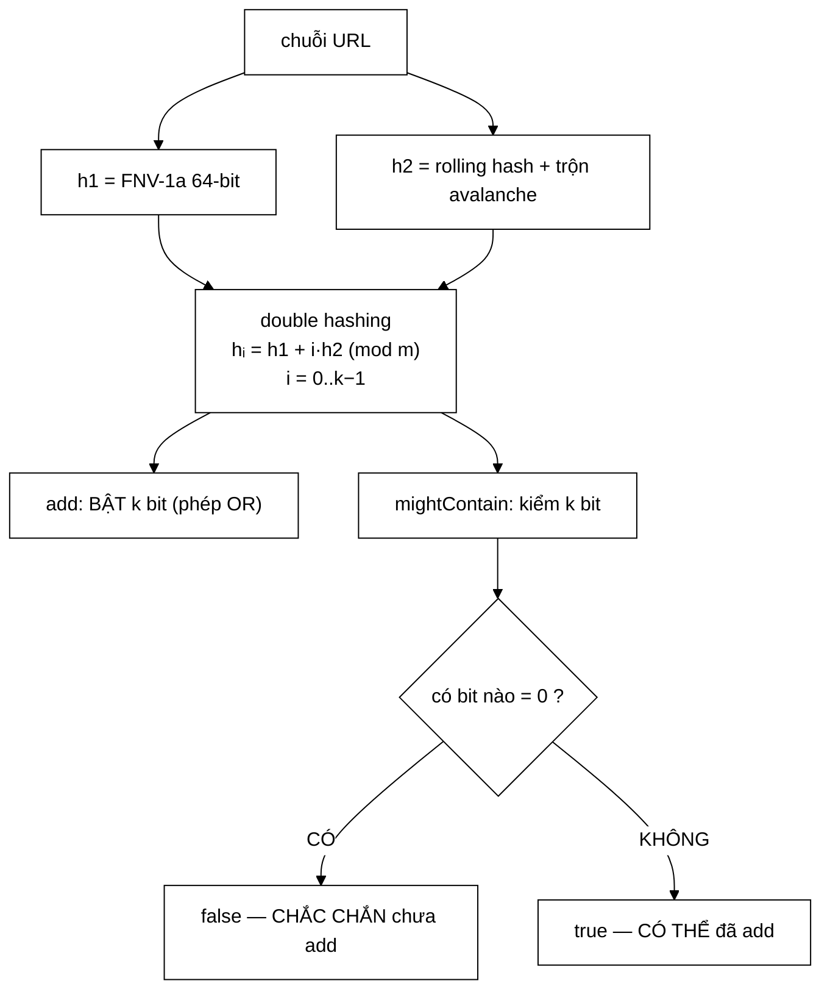

# BloomFilter — chiều sai của cấu trúc khớp đúng chiều an toàn của bài toán

**File nguồn:** `search-engine/src/main/java/com/vnsearch/datastructure/BloomFilter.java` (163 dòng)
**Gói:** `com.vnsearch.datastructure` · **Loại:** lớp thường, ba trường `final` ⇒ bất biến về cấu hình, **không** an toàn đa luồng khi ghi (xem mục 6)
**Vị trí trong luồng:** khử trùng lặp URL trong crawler — [`UrlSeenFilter`](../crawler/UrlSeenFilter.md), [`ContentSeenFilter`](../crawler/ContentSeenFilter.md)
**Đọc kèm:** [`../crawler/UrlSeenFilter.md`](../crawler/UrlSeenFilter.md) · [`../crawler/frontier/UrlFrontier.md`](../crawler/frontier/UrlFrontier.md)

---

## 📌 Hiểu trong 30 giây

Kiểm tra "URL này đã crawl chưa" mà **không lưu URL nào**. Đánh đổi: đôi khi báo
nhầm "đã có" (false positive), nhưng **không bao giờ** bỏ sót (false negative).

```
   ┌──────────────────┬────────────────────────────────────────┐
   │ mightContain()   │ Ý nghĩa                                │
   ├──────────────────┼────────────────────────────────────────┤
   │ false            │ CHẮC CHẮN chưa add   — không thể sai   │
   │ true             │ CÓ THỂ đã add        — có thể sai      │
   └──────────────────┴────────────────────────────────────────┘
```



---

## 1. Chiều sai của cấu trúc — và vì sao nó khớp đúng bài toán

Javadoc dòng 26–37 là phần đáng giá nhất của cả file:

> *"Bloom Filter có thể có **FALSE POSITIVE** vì nhiều chuỗi khác nhau có thể cùng
> bật trúng một tập hợp bit. Nhưng nó **KHÔNG BAO GIỜ** có **FALSE NEGATIVE**, vì
> `add` chỉ **BẬT** bit (phép OR), không bao giờ **TẮT** bit."*
>
> *"Đây chính là lý do cấu trúc này dùng được cho bài toán khử trùng lặp URL:
> false positive khiến **bỏ lỡ vài trang** — tiếc nhưng vô hại; false negative sẽ
> khiến crawl lại trang cũ và gây **VÒNG LẶP VÔ HẠN** — và điều đó không bao giờ
> xảy ra."*

```
   ⭐ ĐÂY LÀ LẬP LUẬN QUAN TRỌNG NHẤT KHI CHỌN CẤU TRÚC XÁC SUẤT

   Không phải "Bloom Filter tiết kiệm bộ nhớ nên ta dùng".
   Mà là: "cấu trúc này sai theo MỘT CHIỀU, và chiều đó
          trùng với chiều mà bài toán CHỊU ĐƯỢC".

   ┌────────────────────┬──────────────────────────────────────┐
   │ Loại lỗi           │ Hậu quả trong crawler                │
   ├────────────────────┼──────────────────────────────────────┤
   │ false positive     │ Bỏ lỡ một trang chưa crawl           │
   │ (báo "đã có" nhầm) │ ⇒ corpus thiếu vài trang             │
   │                    │ ⇒ TIẾC, nhưng hệ thống vẫn chạy      │
   ├────────────────────┼──────────────────────────────────────┤
   │ false negative     │ Crawl lại trang ĐÃ crawl             │
   │ (báo "chưa" nhầm)  │ ⇒ trang đó lại sinh outlink cũ       │
   │                    │ ⇒ lại vào frontier                   │
   │                    │ ⇒ VÒNG LẶP VÔ HẠN — crawler treo     │
   └────────────────────┴──────────────────────────────────────┘

   ⇒ Hai loại lỗi KHÔNG cân xứng: một cái tốn vài trang,
     một cái làm hệ thống không bao giờ dừng.
   ⇒ Bloom Filter đảm bảo loại nguy hiểm KHÔNG BAO GIỜ xảy ra.
```

### 1.1 Chứng minh không có false negative

```java
private void setBit(int index) {
    bits[index / 64] |= (1L << (index % 64));   // CHỈ phép OR
}
```

```
   CHỨNG MINH

   ① add(X) bật đúng k bit tại các vị trí i₁..i_k
   ② KHÔNG có phương thức nào TẮT bit
      (không có remove, không có clear, không có &= ~mask)
   ③ ⇒ tại mọi thời điểm sau add(X), k bit đó VẪN bật
   ④ ⇒ mightContain(X) kiểm đúng k bit đó, thấy đủ ⇒ true

   ⇒ ∀X: add(X) rồi thì mightContain(X) = true.  ∎

   Các phần tử Y khác chỉ có thể bật THÊM bit, không tắt bit nào.
   ⇒ Chúng làm tăng false positive, KHÔNG tạo false negative.
```

```
   ⇒ HỆ QUẢ THIẾT KẾ: BLOOM FILTER KHÔNG XOÁ ĐƯỢC.

   Muốn xoá một phần tử ⇒ phải tắt k bit của nó
   ⇒ nhưng một số bit đó có thể đang được dùng bởi phần tử khác
   ⇒ tắt đi sẽ tạo FALSE NEGATIVE cho phần tử kia

   ⇒ Không có remove() KHÔNG PHẢI là thiếu sót.
     Nó là hệ quả toán học bắt buộc.
   (Biến thể Counting Bloom Filter dùng bộ đếm thay bit
    để xoá được, đổi lại tốn 4–8 lần bộ nhớ.)
```

---

## 2. Double hashing — sinh $k$ hàm băm từ 2 hàm

Javadoc dòng 14–18:

> *"Sinh $k$ hàm băm từ 2 hàm băm cơ sở bằng kỹ thuật **double hashing** (Kirsch
> & Mitzenmacher): $h_i(x) = h_1(x) + i \cdot h_2(x) \pmod m$, $i = 0..k-1$. Kỹ
> thuật này chỉ cần tính **2** hàm băm thật sự, các hàm còn lại là tổ hợp tuyến
> tính của chúng, vẫn đảm bảo phân bố đủ tốt (đã được chứng minh trong bài báo gốc
> năm 2008)."*

```java
private int indexFor(long h1, long h2, int i) {
    long combined = h1 + (long) i * h2;
    return (int) Math.floorMod(combined, (long) numBits);
}
```

```
   TIẾT KIỆM ĐƯỢC BAO NHIÊU

   Với p = 0,01 ⇒ k ≈ 7 hàm băm

   NGÂY THƠ: 7 hàm băm độc lập
     mỗi hàm duyệt toàn bộ chuỗi URL (~60 ký tự)
     ⇒ 7 × 60 = 420 phép trên byte

   DOUBLE HASHING: 2 hàm băm + 7 phép nhân-cộng
     ⇒ 2 × 60 + 7 × 2 = 134 phép

   ⇒ NHANH HƠN ~3 LẦN
   ⇒ Và tỉ lệ này TĂNG theo k: với p = 0,001 ⇒ k = 10,
     tiết kiệm 5 lần.
```

```
   ⚠️ (long) i * h2 — ÉP KIỂU CÓ CHỦ ĐÍCH

   i là int, h2 là long.
   Không ép kiểu: i * h2 vẫn tự nâng lên long ⇒ đúng.
   Ép kiểu tường minh: nói rõ ý định, chống lỗi nếu ai
   đổi h2 thành int sau này.

   Math.floorMod thay vì %:
     % trong Java trả kết quả ÂM nếu toán hạng trái âm
     ⇒ combined âm (rất dễ xảy ra với hash 64-bit)
     ⇒ idx âm ⇒ bits[idx/64] ném ArrayIndexOutOfBoundsException

   ⇒ floorMod LUÔN trả kết quả không âm. Bắt buộc phải có.
```

### 2.1 Hai hàm băm cơ sở

```java
private static long hash1(String s) {          // FNV-1a 64-bit
    byte[] data = s.getBytes(StandardCharsets.UTF_8);
    long hash = 0xcbf29ce484222325L;           // FNV offset basis
    for (byte b : data) {
        hash ^= (b & 0xffL);
        hash *= 0x100000001b3L;                // FNV prime
    }
    return hash;
}
```

```
   FNV-1a: XOR TRƯỚC, NHÂN SAU

   hash ^= byte;  hash *= prime;     ← FNV-1a  (dùng ở đây)
   hash *= prime; hash ^= byte;      ← FNV-1   (biến thể cũ)

   FNV-1a có phân bố tốt hơn ở bit thấp — quan trọng vì
   floorMod lấy phần dư, tức phụ thuộc nhiều vào bit thấp.

   (b & 0xffL) — BẮT BUỘC:
     byte trong Java có DẤU, giá trị −128..127
     Không mask: byte âm nâng lên long thành 0xFFFF...FF80
     ⇒ XOR với 56 bit cao, phá hỏng phân bố
```

```java
private static long hash2(String s) {
    long hash = 1125899906842597L;
    for (int i = 0; i < s.length(); i++) hash = 31 * hash + s.charAt(i);
    hash ^= (hash >>> 33);            // tron avalanche
    hash *= 0xff51afd7ed558ccdL;
    hash ^= (hash >>> 33);
    return hash;
}
```

```
   BA DÒNG CUỐI LÀ "TRỘN AVALANCHE" (từ MurmurHash3)

   Bình luận dòng 144: "trộn avalanche để tránh các bit thấp
   quá tương quan với hash1"

   VÌ SAO CẦN:
     hash = 31·hash + char  là rolling hash tuyến tính
     ⇒ hai chuỗi giống nhau ở phần đuôi cho hash gần nhau
       ở các bit THẤP
     ⇒ mà URL thì rất giống nhau ở phần đuôi
       ("https://vnexpress.net/tin-tuc/a", ".../b", ".../c")

   ⇒ Không trộn: h1 và h2 TƯƠNG QUAN
   ⇒ Double hashing cần h1, h2 ĐỘC LẬP TƯƠNG ĐỐI
   ⇒ Tương quan ⇒ các hᵢ dồn cụm ⇒ false positive TĂNG VỌT

   ⇒ Đây là chi tiết dễ bỏ qua nhất, và bỏ qua nó làm
     Bloom Filter tệ đi mà KHÔNG có gì báo — tỉ lệ lỗi
     chỉ cao hơn công thức lý thuyết.
```

```
   HÀM TRỘN NÀY LÀ FINALIZER CỦA MurmurHash3

   x ^= x >>> 33;  x *= 0xff51afd7ed558ccd;  x ^= x >>> 33;

   Tính chất "avalanche": đổi MỘT bit đầu vào
   ⇒ khoảng MỘT NỬA số bit đầu ra đổi theo.
```

---

## 3. Công thức kích thước tối ưu

```java
double ln2 = Math.log(2);
int m = (int) Math.ceil(-expectedItems * Math.log(falsePositiveRate) / (ln2 * ln2));
m = Math.max(m, 64);
int k = (int) Math.round((double) m / expectedItems * ln2);
this.numHashes = Math.max(k, 1);
this.bits = new long[(m + 63) / 64];
```

$$m = \left\lceil \frac{-n \ln p}{(\ln 2)^2} \right\rceil, \qquad k = \text{round}\left(\frac{m}{n} \ln 2\right)$$

```
   BẢNG THAM SỐ THỰC TẾ

   n = 1.000.000 URL

   p         m (bit)        m (MB)    k     so với HashSet
   ─────────────────────────────────────────────────────────
   0,1       4.792.529       0,57 MB   3      1/175
   0,01      9.585.059       1,14 MB   7      1/88
   0,001    14.377.588       1,71 MB  10      1/58
   0,0001   19.170.117       2,29 MB  13      1/44

   HashSet<String> 1 triệu URL (~60 ký tự):
     mỗi String ≈ 40 B header + 60 B dữ liệu = 100 B
     + HashMap.Node 32 B + mảng bảng
     ≈ 100 MB

   ⇒ Với p = 1 %, tiết kiệm 88 lần bộ nhớ.
```

```
   Ý NGHĨA CỦA CÔNG THỨC

   m tỉ lệ với −ln(p): muốn p nhỏ đi 10 lần ⇒ m tăng ~2,3 lần
   ⇒ Chi phí bộ nhớ tăng LOGARIT theo độ chính xác
   ⇒ Rất rẻ để làm chính xác hơn

   k = (m/n)·ln2: số hàm băm TỐI ƯU
   ⇒ k quá nhỏ: mỗi phần tử bật ít bit ⇒ dễ trùng ngẫu nhiên
   ⇒ k quá lớn: bảng bit đầy nhanh ⇒ cũng dễ trùng
   ⇒ Cực tiểu đúng tại (m/n)·ln2 — kết quả giải tích cổ điển
```

```
   HAI LÁ CHẮN

   m = Math.max(m, 64)      → ít nhất một long
     expectedItems = 1, p = 0,5 ⇒ m = 3 bit ⇒ vô nghĩa
     ⇒ ép tối thiểu 64

   numHashes = Math.max(k, 1) → ít nhất một hàm băm
     m/n rất nhỏ ⇒ k làm tròn về 0
     ⇒ k = 0 ⇒ vòng lặp không chạy
     ⇒ mightContain LUÔN trả true (không bit nào bị kiểm)
     ⇒ filter vô dụng HOÀN TOÀN, im lặng

   ⇒ Lá chắn thứ hai quan trọng hơn: k = 0 không gây lỗi,
     nó chỉ làm cấu trúc mất hết ý nghĩa.
```

⚠️ **Nhưng:** `(int) Math.ceil(...)` có thể **tràn** với `expectedItems` lớn.
Với $n = 10^9$ và $p = 0{,}001$, $m \approx 1{,}4 \times 10^{10}$ — vượt
`Integer.MAX_VALUE`, cho ra số âm và `new long[...]` ném
`NegativeArraySizeException`. Xem đề xuất 3.

---

## 4. Thao tác bit thủ công

```java
private void setBit(int index)     { bits[index / 64] |= (1L << (index % 64)); }
private boolean getBit(int index)  { return (bits[index / 64] & (1L << (index % 64))) != 0; }
```

Javadoc dòng 11–12: *"Bit array tự quản lý bằng `long[]` và phép dịch bit (không
dùng `java.util.BitSet` có sẵn) để thể hiện rõ cơ chế lưu trữ bit."*

```
   MINH HOẠ — index = 100

   index / 64 = 1        → nằm ở long thứ 1
   index % 64 = 36       → bit thứ 36 trong long đó

   1L << 36 = 0b0000...0001000...000
                        ↑ bit 36

   setBit :  bits[1] |= mask     → BẬT bit 36, giữ nguyên các bit khác
   getBit :  bits[1] & mask      → khác 0 ⟺ bit 36 đang bật
```

```
   ⚠️ 1L << (index % 64) — CHỮ L BẮT BUỘC

   1 << 36  (int)  ⇒ Java lấy 36 % 32 = 4 ⇒ 1 << 4 = 16   SAI HOÀN TOÀN
   1L << 36 (long) ⇒ đúng bit 36                          ✓

   Đây là một trong những lỗi im lặng khó chịu nhất của Java:
   phép dịch bit trên int TỰ ĐỘNG lấy modulo 32 mà không cảnh báo.
   Kết quả vẫn là một số hợp lệ, chỉ là sai bit.
```

```
   VÌ SAO TỰ CÀI THAY VÌ BitSet

   Lý do Javadoc nêu: "để thể hiện rõ cơ chế lưu trữ bit"
   ⇒ Mục đích SƯ PHẠM — đây là đồ án môn cấu trúc dữ liệu.

   Về kỹ thuật, BitSet cũng dùng long[] và cũng làm y hệt,
   nhưng nó TỰ MỞ RỘNG kích thước — tính năng KHÔNG cần ở đây
   (m cố định sau khi dựng) và có thể gây bất ngờ.

   ⇒ Tự cài ở đây là lựa chọn hợp lý cả về sư phạm lẫn kỹ thuật.
```

---

## 5. Hướng dẫn thực hành

### 5.1 Chạy demo cho báo cáo

```powershell
cd search-engine
.\mvnw.cmd -q compile exec:java "-Dexec.mainClass=com.vnsearch.datastructure.BloomFilter"
```

```
   numBits=9586 numHashes=7
   mightContain(vnexpress) = true
   mightContain(tuoitre)   = true
   mightContain(chưa thêm) = false
```

### 5.2 Chọn tham số

```
   CÂU HỎI CẦN TRẢ LỜI TRƯỚC:
   "Bỏ lỡ p × n trang có chấp nhận được không?"

   n = 1.000.000 URL:
     p = 0,1   ⇒ bỏ lỡ ~100.000 trang  ⇒ QUÁ NHIỀU
     p = 0,01  ⇒ bỏ lỡ ~10.000 trang   ⇒ có thể chấp nhận
     p = 0,001 ⇒ bỏ lỡ ~1.000 trang    ⇒ tốt, chỉ tốn thêm 0,6 MB

   ⚠️ ĐỪNG chọn p theo cảm giác "1 % nghe nhỏ".
     Nhân với n rồi mới quyết định.

   ⇒ Vì bộ nhớ tăng LOGARIT theo 1/p (mục 3),
     chọn p nhỏ hơn gần như miễn phí. Nên chọn 0,001.
```

### 5.3 Cạm bẫy

```
   ① expectedItems là ƯỚC LƯỢNG, không phải giới hạn cứng.
     Thêm nhiều hơn expectedItems ⇒ tỉ lệ false positive
     TĂNG VỌT so với p đã cấu hình, và KHÔNG có cảnh báo.
     Thêm gấp đôi ⇒ p thực tế ≈ p^0,5 (1 % → 10 %).

   ② KHÔNG XOÁ ĐƯỢC. Không có remove() và không thể có.

   ③ KHÔNG an toàn đa luồng khi GHI.
     bits[i] |= mask là đọc-sửa-ghi, không nguyên tử.
     Hai luồng add cùng lúc có thể MẤT một bit
     ⇒ tạo FALSE NEGATIVE — đúng cái mà cấu trúc hứa không có.
     Xem đề xuất 2.

   ④ Không có cách đo tỉ lệ lấp đầy hiện tại.
     Không biết filter đã "no" hay chưa.

   ⑤ Hàm dựng thứ hai (rawConfig) là package-private cho test,
     và tham số boolean đó KHÔNG được dùng — nó chỉ để
     phân biệt chữ ký. Hợp lệ nhưng khó hiểu.

   ⑥ mightContain(null) ném NullPointerException từ
     s.getBytes() — không có kiểm tra tường minh.
```

---

## 6. Độ phức tạp & chi phí

| Thao tác | Thời gian | Bộ nhớ |
|---|---|---|
| Hàm dựng | $O(m/64)$ | $O(m)$ bit |
| `add` | $O(L + k)$ | 0 |
| `mightContain` | $O(L + k)$ | 0 |

($L$ = độ dài chuỗi, chi phí hai hàm băm; $k$ = số hàm băm, thường < 20)

```
   ĐIỂM MẤU CHỐT: BỘ NHỚ KHÔNG PHỤ THUỘC ĐỘ DÀI CHUỖI

   Javadoc dòng 41–42: "O(m) bit, KHÔNG phụ thuộc độ dài chuỗi
   đã lưu (khác với HashSet phải lưu toàn bộ chuỗi)"

   HashSet : mỗi URL 60 ký tự tốn ~100 B
             URL 300 ký tự tốn ~340 B
             ⇒ bộ nhớ phụ thuộc DỮ LIỆU

   Bloom   : mỗi URL tốn m/n bit = 9,6 bit (p=0,01)
             bất kể URL dài 60 hay 300 ký tự
             ⇒ bộ nhớ CỐ ĐỊNH

   ⇒ Với URL thật (thường rất dài, nhiều tham số truy vấn),
     khác biệt còn lớn hơn con số 88 lần ở mục 3.
```

```
   ⚠️ NHƯNG: mightContain LÀ O(L), KHÔNG PHẢI O(k)

   Javadoc dòng 39–40 ghi "đều O(k)".
   Thực tế phải duyệt toàn bộ chuỗi HAI lần (h1 và h2)
   ⇒ O(L + k), và với URL 60 ký tự thì L CHI PHỐI.

   Sai lệch nhỏ trong tài liệu, nhưng nó che mất
   điểm tối ưu thật: nếu cần nhanh hơn, phải giảm
   chi phí BĂM chứ không phải giảm k.
```

---

## 7. Kiểm thử liên quan

| Test | Bảo vệ điều gì |
|---|---|
| `test/java/com/vnsearch/datastructure/BloomFilterTest.java` | 7 ca |

| Ca test | Tính chất được canh giữ |
|---|---|
| `constructorRejectsInvalidArguments` | Hai lệnh `throw` |
| `mightContainOnEmptyFilterIsFalse` | Filter rỗng |
| `singleItemAddedIsAlwaysFound` | Đường đi cơ bản |
| `addingSameItemTwiceIsIdempotent` | `add` hai lần vô hại (OR luỹ đẳng) |
| **`neverProducesFalseNegative`** | **Bảo đảm cốt lõi của cả cấu trúc** |
| **`falsePositiveRateIsApproximatelyAsConfigured`** | **Công thức $m$, $k$ cho ra đúng $p$ như hứa** |
| `vietnameseUrlsWithDiacritics` | UTF-8 nhiều byte |

```
   ⭐ HAI CA GIỮA LÀ MẪU MỰC CHO VIỆC KIỂM THỬ
     MỘT CẤU TRÚC XÁC SUẤT.

   neverProducesFalseNegative
     → kiểm bảo đảm TUYỆT ĐỐI (phải đúng 100 %)
     → đây là thứ toàn bộ crawler dựa vào

   falsePositiveRateIsApproximatelyAsConfigured
     → kiểm bảo đảm THỐNG KÊ (phải đúng "xấp xỉ")
     → nó canh giữ CÔNG THỨC m, k VÀ chất lượng hai hàm băm
     → nếu bỏ phần trộn avalanche ở hash2 (mục 2.1),
       tỉ lệ thực tế sẽ cao hơn cấu hình ⇒ ca này ĐỎ

   ⇒ Ca thứ hai là cách DUY NHẤT phát hiện hàm băm kém —
     và nó có sẵn. Rất tốt.
```

```
   ⚠️ vietnameseUrlsWithDiacritics ĐÁNG CHÚ Ý

   URL có dấu ⇒ UTF-8 nhiều byte ⇒ ép đúng nhánh
   (b & 0xffL) trong FNV-1a (mục 2.1).

   Không mask ⇒ byte âm ⇒ phân bố hỏng
   ⇒ nhưng KHÔNG ném lỗi, chỉ làm tỉ lệ false positive tăng

   ⇒ Ca này phủ đúng chỗ tinh vi nhất của hash1.
```

**Còn thiếu:**

```
   ✗ Thêm QUÁ expectedItems ⇒ tỉ lệ lỗi tăng thế nào
     (cạm bẫy ① — hành vi quan trọng nhất mà người dùng
      cần biết, không được ghi ở đâu)
   ✗ mightContain(null) / add(null)
   ✗ An toàn đa luồng — không có ca nào, và đây là chỗ
     bảo đảm "không false negative" CÓ THỂ VỠ
   ✗ expectedItems rất lớn ⇒ tràn int khi tính m
```

```powershell
cd search-engine
.\mvnw.cmd -q -Dtest='BloomFilterTest' test
```

---

## 8. Chấm theo chuẩn doanh nghiệp

| Tiêu chí | Điểm | Nhận xét |
|---|---|---|
| **Khớp chiều sai với chiều an toàn của bài toán** | 10/10 | Lập luận đúng bản chất: false positive mất vài trang, false negative gây **vòng lặp vô hạn** |
| **Chứng minh không có false negative** | 10/10 | Truy về đúng nguyên nhân: `add` chỉ dùng phép OR, không có đường nào tắt bit |
| **Test bảo đảm tuyệt đối + bảo đảm thống kê** | 10/10 | Hai ca tách bạch hai loại bảo đảm — cách kiểm thử đúng cho cấu trúc xác suất |
| Double hashing có trích nguồn | 10/10 | Kirsch & Mitzenmacher 2008, và nói rõ vì sao vẫn đủ tốt |
| Trộn avalanche ở `hash2` | 10/10 | Chi tiết dễ bỏ qua nhất; thiếu nó thì filter tệ đi **im lặng** |
| Công thức tối ưu $m$, $k$ | 9/10 | Chuẩn, kèm hai lá chắn `max(m,64)` và `max(k,1)` |
| Xử lý bẫy ngôn ngữ | 9/10 | `1L <<`, `floorMod`, `(b & 0xffL)` — ba bẫy Java kinh điển, tránh đúng cả ba |
| Kiểm tra tham số | 9/10 | Ném ở hàm dựng, có ca test |
| **An toàn đa luồng** | **3/10** | `bits[i] \|= mask` không nguyên tử ⇒ hai luồng `add` có thể **mất bit** ⇒ tạo đúng false negative mà cấu trúc hứa không có |
| **Cảnh báo khi vượt `expectedItems`** | **3/10** | Tỉ lệ lỗi tăng vọt mà không có cách nào biết; không có `loadFactor()` hay log |
| Tràn số với $n$ lớn | 4/10 | `(int) Math.ceil(...)` tràn im lặng ⇒ `NegativeArraySizeException` |
| Độ chính xác của tài liệu | 7/10 | Ghi $O(k)$ nhưng thực tế $O(L + k)$, và $L$ mới là phần chi phối |
| Hàm dựng `rawConfig` | 5/10 | Tham số `boolean` không dùng, chỉ để phân biệt chữ ký — khó hiểu |

**Ba đề xuất nâng lên mức sản phẩm:**

1. **Xử lý an toàn đa luồng — hoặc đảm bảo, hoặc nói rõ là không.** Đây là lỗ
   hổng nghiêm trọng nhất: crawler chạy **nhiều luồng**, và `bits[i] |= mask` là
   một chuỗi đọc-sửa-ghi không nguyên tử. Hai luồng `add` đồng thời vào cùng một
   `long` có thể làm **mất** một bit — tạo ra đúng false negative mà toàn bộ
   Javadoc khẳng định không thể xảy ra, và hậu quả là vòng lặp vô hạn ở mục 1.
   `AtomicLongArray` giải quyết triệt để với chi phí gần như bằng 0 cho thao tác
   đọc:
   ```java
   private final AtomicLongArray bits;

   private void setBit(int index) {
       int word = index >>> 6;
       long mask = 1L << (index & 63);
       long cu;
       do { cu = bits.get(word); } while ((cu & mask) == 0 && !bits.compareAndSet(word, cu, cu | mask));
   }
   private boolean getBit(int index) {
       return (bits.get(index >>> 6) & (1L << (index & 63))) != 0;
   }
   ```
   Nếu quyết định **không** đồng bộ (vì [`UrlSeenFilter`](../crawler/UrlSeenFilter.md)
   đã bọc `synchronized` bên ngoài), thì điều đó phải nằm trong Javadoc kèm tên
   lớp chịu trách nhiệm — hiện tại nó không nằm ở đâu cả, trong khi
   [`MinHeap`](./MinHeap.md) lại ghi rất rõ.

2. **Thêm `loadFactor()` và cảnh báo khi vượt `expectedItems`.** Cạm bẫy ① là
   hành vi quan trọng nhất mà người dùng cần biết, và hiện không có cách nào phát
   hiện: thêm gấp đôi số phần tử dự kiến làm $p$ nhảy từ 1 % lên ~10 %, tức bỏ lỡ
   gấp 10 lần số trang, mà crawler vẫn chạy bình thường:
   ```java
   /** Ty le bit dang bat — cang gan 0,5 thi cang gan muc thiet ke. */
   public double loadFactor() {
       long dem = 0;
       for (long w : bits) dem += Long.bitCount(w);
       return (double) dem / numBits;
   }

   /** Uoc luong ty le false positive HIEN TAI: (loadFactor)^k. */
   public double estimatedFalsePositiveRate() {
       return Math.pow(loadFactor(), numHashes);
   }
   ```
   Rồi để [`UrlSeenFilter`](../crawler/UrlSeenFilter.md) log con số này định kỳ —
   nó biến một rủi ro vô hình thành một chỉ số theo dõi được, và là số liệu đáng
   đưa vào báo cáo.

3. **Chuyển sang `long` cho `m` và chặn tràn tường minh.** Công thức
   `(int) Math.ceil(-n * ln(p) / (ln2)²)` tràn im lặng khi $n$ lớn, và triệu
   chứng — `NegativeArraySizeException` — không hề gợi ý nguyên nhân. Với một
   crawler nhắm tới hàng chục triệu URL, đây là giới hạn sẽ gặp thật:
   ```java
   long m = (long) Math.ceil(-(double) expectedItems * Math.log(falsePositiveRate) / (ln2 * ln2));
   if (m > Integer.MAX_VALUE) {
       throw new IllegalArgumentException(
               "Can " + m + " bit (" + m / 8 / 1024 / 1024 + " MB) cho " + expectedItems
             + " phan tu voi p=" + falsePositiveRate + ", vuot gioi han mot mang int. "
             + "Hay tang falsePositiveRate hoac chia nho thanh nhieu filter.");
   }
   ```
   Thông báo nêu cả **con số cụ thể** và **hai cách sửa** — đúng kiểu thông báo
   lỗi mà `BM25Scorer` và `ScorerFactory` trong dự án này đã làm tốt.

---

## 9. Liên kết

- Hai nơi dùng để khử trùng lặp: [`../crawler/UrlSeenFilter.md`](../crawler/UrlSeenFilter.md) · [`../crawler/ContentSeenFilter.md`](../crawler/ContentSeenFilter.md)
- Nơi vòng lặp vô hạn sẽ xảy ra nếu có false negative: [`../crawler/frontier/UrlFrontier.md`](../crawler/frontier/UrlFrontier.md) · [`../crawler/CrawlerService.md`](../crawler/CrawlerService.md)
- Chuẩn hoá URL trước khi đưa vào filter: [`../crawler/UrlCanonicalizer.md`](../crawler/UrlCanonicalizer.md)
- Cấu trúc dữ liệu tự cài khác trong gói: [`MinHeap.md`](./MinHeap.md) · [`SparseMatrix.md`](./SparseMatrix.md) · [`Trie.md`](./Trie.md) · [`LRUCache.md`](./LRUCache.md)
- Lớp có ghi rõ ràng buộc đa luồng — nên đối chiếu: [`MinHeap.md`](./MinHeap.md) mục 4
