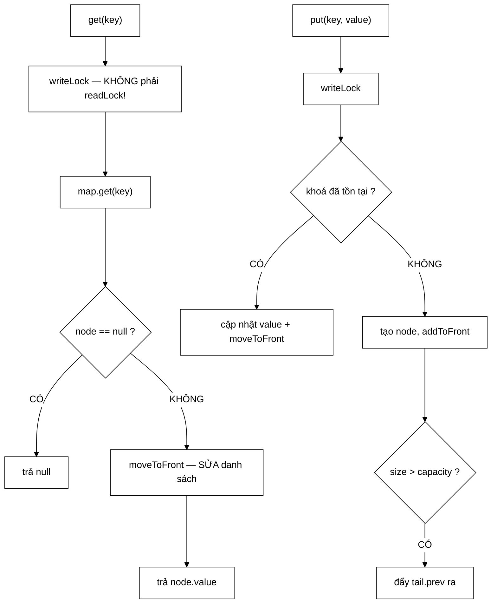

# LRUCache — `get()` không phải thao tác đọc, nên nó phải dùng write lock

**File nguồn:** `search-engine/src/main/java/com/vnsearch/datastructure/LRUCache.java` (158 dòng)
**Gói:** `com.vnsearch.datastructure` · **Loại:** lớp tổng quát `LRUCache<K,V>`, **an toàn đa luồng** bằng `ReentrantReadWriteLock`
**Vị trí trong luồng:** cache kết quả tìm kiếm gần đây và trang đã ghé trong trình duyệt
**Đọc kèm:** [`Trie.md`](./Trie.md) · [`../service/SearchEngineFacade.md`](../service/SearchEngineFacade.md)

---

## 📌 Hiểu trong 30 giây

`HashMap` cho tra cứu $O(1)$, cộng danh sách liên kết **đôi** cho việc di chuyển
node lên đầu trong $O(1)$. Hai cấu trúc trỏ vào **cùng** các node.

```
   head ⇄ [C] ⇄ [A] ⇄ [B] ⇄ tail
    ↑     MRU           LRU    ↑
  lính canh                lính canh

   map: { "A" → node A,  "B" → node B,  "C" → node C }

   get("B")  ⇒ map cho node B trong O(1)
             ⇒ gỡ B khỏi vị trí giữa và đưa lên đầu, O(1)
   cache đầy ⇒ đẩy tail.prev (LRU) ra
```



---

## 1. `get()` **không** phải thao tác đọc — và hậu quả nếu nhầm

Javadoc dòng 27–33:

> *"`get()` về bản chất **KHÔNG** phải thao tác đọc thuần tuý vì nó **di chuyển
> node lên đầu** danh sách (cập nhật recency), nên phải dùng **write lock** giống
> như `put()` — nếu dùng read lock cho `get()` thì nhiều luồng đọc đồng thời sẽ
> cùng sửa đổi danh sách liên kết và **làm hỏng cấu trúc dữ liệu**. Đây là điểm
> khác biệt so với `Trie`, nơi `getSuggestions` là đọc thật sự nên dùng được read
> lock."*

```java
public V get(K key) {
    lock.writeLock().lock();        // ← WRITE, không phải READ
    try {
        Node<K, V> node = map.get(key);
        if (node == null) return null;
        moveToFront(node);           // ← SỬA ĐỔI danh sách
        return node.value;
    } finally {
        lock.writeLock().unlock();
    }
}
```

```
   ⭐ ĐÂY LÀ CÁI BẪY KINH ĐIỂN NHẤT CỦA LRU CACHE.

   Tên phương thức là "get" ⇒ phản xạ là dùng readLock.
   Nhưng LRU cache CẦN biết thứ tự truy cập,
   nên mỗi lần "đọc" đều PHẢI ghi lại thông tin đó.

   ⇒ Đọc logic ≠ đọc vật lý.
   ⇒ Khoá phải chọn theo cái sau, không phải cái trước.
```

```
   NẾU DÙNG readLock CHO get() — CHUYỆN GÌ XẢY RA

   ReentrantReadWriteLock cho phép NHIỀU luồng giữ readLock cùng lúc.

   Luồng 1: get("A")  →  moveToFront(A)
   Luồng 2: get("B")  →  moveToFront(B)      ← CÙNG LÚC

   moveToFront gồm removeNode + addToFront, tổng 6 phép gán
   con trỏ — KHÔNG nguyên tử.

   Đan xen xấu:
     L1: A.prev.next = A.next        (gỡ A)
     L2: B.prev.next = B.next        (gỡ B — nhưng B.prev có thể LÀ A)
     L1: node.next = head.next
     L2: head.next.prev = node
     ...

   ⇒ Danh sách bị đứt, hoặc tạo VÒNG LẶP con trỏ
   ⇒ Duyệt danh sách ⇒ TREO VÔ HẠN
   ⇒ Hoặc map.size() lệch với số node thật ⇒ đẩy sai phần tử

   VÀ TỆ NHẤT: lỗi KHÔNG tái hiện đều. Nó chỉ xuất hiện
   dưới tải cao, ở môi trường sản phẩm.
```

```
   SO SÁNH VỚI Trie — VÌ SAO Trie DÙNG ĐƯỢC readLock

   Trie.getSuggestions : duyệt cây, KHÔNG sửa node nào
                         ⇒ đọc THẬT ⇒ readLock ✓

   LRUCache.get        : sửa 6 con trỏ
                         ⇒ ghi trá hình ⇒ writeLock ✓

   ⇒ Javadoc chỉ thẳng sự đối lập này. Người đọc hai lớp
     cạnh nhau sẽ hiểu ngay quy tắc: chọn khoá theo
     HÀNH VI THẬT, không theo TÊN phương thức.
```

⚠️ **Hệ quả hiệu năng:** với `writeLock`, cache **tuần tự hoá hoàn toàn** mọi
lượt đọc. Dưới tải cao, đây chính là điểm nghẽn — và `ReentrantReadWriteLock` khi
đó chỉ tốn chi phí mà không cho lợi ích nào so với `synchronized`. Xem đề xuất 1.

---

## 2. Vì sao phải là danh sách liên kết **đôi**

Javadoc dòng 22–25:

> *"Xoá một node ở **giữa** trong $O(1)$ đòi hỏi biết **cả** node trước và node
> sau. Danh sách đơn phải duyệt từ đầu để tìm node trước, tức $O(n)$ — và khi đó
> cache LRU **mất hoàn toàn ưu điểm**, vì mỗi lần truy cập đều thành $O(n)$."*

```java
private void removeNode(Node<K, V> node) {
    node.prev.next = node.next;
    node.next.prev = node.prev;
}
```

```
   HAI DÒNG, VÀ CHÚNG CHỈ ĐƯỢC PHÉP TỒN TẠI NHỜ CON TRỎ prev

   Trước:  [X] ⇄ [node] ⇄ [Y]

   node.prev.next = node.next    ⇒  X.next = Y
   node.next.prev = node.prev    ⇒  Y.prev = X

   Sau:    [X] ⇄ [Y]        (node bị gỡ, KHÔNG duyệt gì cả)

   ⇒ Danh sách ĐƠN: không có node.prev
     ⇒ phải duyệt từ head để tìm X  ⇒ O(n)
     ⇒ get() thành O(n) ⇒ cache vô nghĩa
```

```
   GIÁ PHẢI TRẢ CHO CON TRỎ prev

   Mỗi node thêm 8 byte (một tham chiếu).
   Với capacity = 1.000 ⇒ 8 KB.

   ⇒ Đổi 8 KB lấy O(1) thay vì O(1.000).
   ⇒ Đây là ví dụ sạch nhất của đánh đổi không gian–thời gian.
```

---

## 3. Hai node lính canh — xoá hết trường hợp đặc biệt

```java
this.head = new Node<>(null, null);
this.tail = new Node<>(null, null);
head.next = tail;
tail.prev = head;
```

Javadoc dòng 13–16: *"2 node lính canh (sentinel head/tail) **không chứa dữ liệu
thật**, chỉ để đánh dấu 2 đầu — nhờ vậy mọi thao tác thêm/xoá node đầu tiên hoặc
cuối cùng **không cần kiểm tra null riêng**, giảm hẳn số nhánh if/else."*

```
   KHÔNG CÓ LÍNH CANH — removeNode phải thành:

   private void removeNode(Node node) {
       if (node.prev != null) node.prev.next = node.next;
       else                   head = node.next;        ← xoá node ĐẦU
       if (node.next != null) node.next.prev = node.prev;
       else                   tail = node.prev;        ← xoá node CUỐI
   }

   ⇒ 2 dòng thành 4 dòng + 2 nhánh rẽ
   ⇒ VÀ head/tail không còn final được (phải gán lại)
   ⇒ VÀ addToFront cũng phải xử lý trường hợp danh sách rỗng

   CÓ LÍNH CANH:
     node.prev LUÔN khác null (tệ nhất là head)
     node.next LUÔN khác null (tệ nhất là tail)
   ⇒ KHÔNG có trường hợp đặc biệt nào
```

```
   ⇒ head và tail là final — đây là dấu hiệu thiết kế đúng.

   Chúng KHÔNG BAO GIỜ đổi trong suốt vòng đời cache.
   Danh sách rỗng: head ⇄ tail
   Danh sách 1 phần tử: head ⇄ [A] ⇄ tail

   ⇒ Cùng kỹ thuật với phần tử canh biên rowPtr[rows]
     ở SparseMatrix.md mục 2.2: thêm MỘT phần tử giả
     để xoá MỘT trường hợp đặc biệt.
```

```
   MINH HOẠ addToFront — 4 phép gán, không rẽ nhánh

   Trước:  head ⇄ [A] ⇄ tail          (thêm node X)

   node.prev = head;          X.prev = head
   node.next = head.next;     X.next = A
   head.next.prev = node;     A.prev = X
   head.next = node;          head.next = X

   Sau:    head ⇄ [X] ⇄ [A] ⇄ tail

   ⚠️ THỨ TỰ 4 DÒNG NÀY QUAN TRỌNG:
     dòng 3 và 4 đọc head.next — dòng 4 GHI ĐÈ nó.
     Đảo hai dòng cuối ⇒ head.next.prev trỏ vào chính X
     ⇒ danh sách đứt.
```

---

## 4. `put` — bốn nhánh, và một chi tiết thứ tự

```java
public void put(K key, V value) {
    lock.writeLock().lock();
    try {
        Node<K, V> existing = map.get(key);
        if (existing != null) {
            existing.value = value;
            moveToFront(existing);
            return;                      // ① khoá đã có ⇒ KHÔNG tăng size
        }
        Node<K, V> node = new Node<>(key, value);
        map.put(key, node);
        addToFront(node);
        if (map.size() > capacity) {     // ② vượt ngưỡng
            Node<K, V> lru = tail.prev;
            removeNode(lru);
            map.remove(lru.key);         // ③ xoá khỏi CẢ HAI cấu trúc
        }
    } finally {
        lock.writeLock().unlock();
    }
}
```

```
   ① CẬP NHẬT KHOÁ ĐÃ CÓ ⇒ return SỚM

   Không có nhánh này: tạo node MỚI cho khoá cũ
   ⇒ map.put ghi đè tham chiếu
   ⇒ node CŨ vẫn nằm trong danh sách liên kết
   ⇒ map.size() = 1 nhưng danh sách có 2 node
   ⇒ RÒ RỈ và thứ tự LRU sai

   Test duplicatePutsDoNotGrowSize canh giữ đúng chỗ này.

   ② size > capacity, KHÔNG PHẢI >=

   Thêm node TRƯỚC rồi mới kiểm tra.
   ⇒ capacity = 2, thêm phần tử thứ 3:
     map.size() = 3 > 2 ⇒ đẩy 1 ra ⇒ còn 2  ✓

   Nếu kiểm >= TRƯỚC khi thêm: đẩy ra khi size = 2
   ⇒ chỉ giữ được capacity − 1 phần tử.

   ③ XOÁ KHỎI CẢ HAI CẤU TRÚC

   removeNode(lru)      → gỡ khỏi danh sách
   map.remove(lru.key)  → gỡ khỏi HashMap

   Quên một trong hai ⇒ hai cấu trúc LỆCH NHAU.
   ⇒ Đây là lý do node PHẢI lưu `key`: để xoá ngược
     khỏi map khi chỉ biết node.
```

```
   ⭐ TRƯỜNG `key` TRONG Node LÀ CHI TIẾT DỄ QUÊN NHẤT

   Nhìn qua, node chỉ cần `value` — map đã có key rồi.
   Nhưng khi đẩy LRU ra, ta xuất phát TỪ node (tail.prev)
   và cần key để gọi map.remove().

   ⇒ Không có node.key ⇒ phải duyệt map tìm entry
     có value == node ⇒ O(n)
   ⇒ Toàn bộ ưu điểm O(1) sụp đổ ở đúng thao tác đẩy ra.
```

---

## 5. `size()` và `containsKey()` dùng `readLock` — đúng

```java
public int size() {
    lock.readLock().lock();
    try { return map.size(); } finally { lock.readLock().unlock(); }
}

public boolean containsKey(K key) {
    lock.readLock().lock();
    try { return map.containsKey(key); } finally { lock.readLock().unlock(); }
}
```

```
   HAI PHƯƠNG THỨC NÀY ĐỌC THẬT:
     - chỉ chạm map, không chạm danh sách liên kết
     - không sửa gì

   ⇒ readLock ĐÚNG.
   ⇒ Nhiều luồng gọi size()/containsKey() song song được.

   ⇒ Và điều này làm rõ hơn quyết định ở mục 1:
     lớp KHÔNG dùng writeLock cho mọi thứ "cho an toàn".
     Nó phân loại từng phương thức theo hành vi thật.
```

```
   ⚠️ NHƯNG containsKey KHÔNG cập nhật recency.

   containsKey(k) rồi get(k)  ≠  get(k)
   ⇒ Cách thứ nhất: hai lần khoá, và lần đầu KHÔNG
     đánh dấu vừa dùng
   ⇒ Người gọi dùng containsKey để "kiểm tra trước"
     sẽ vô tình bỏ qua cập nhật LRU

   Đây là hành vi ĐÚNG (containsKey là truy vấn thuần),
   nhưng nó dễ bị dùng sai và không được ghi ở đâu.
```

---

## 6. Hướng dẫn thực hành

### 6.1 Chạy demo cho báo cáo

```powershell
cd search-engine
.\mvnw.cmd -q compile exec:java "-Dexec.mainClass=com.vnsearch.datastructure.LRUCache"
```

```
   get(máy tính) = kết quả A
   get(trình duyệt) sau khi bị đẩy = null      ← LRU bị đẩy đúng
   get(máy tính) vẫn còn = kết quả A
   get(bloom filter) = kết quả C

   ⇒ Demo minh hoạ chính xác điểm cốt lõi: "trình duyệt"
     được thêm SAU "máy tính" nhưng bị đẩy ra TRƯỚC,
     vì get("máy tính") đã đưa nó lên MRU.
   ⇒ Không có bước get() đó, "máy tính" mới là cái bị đẩy.
```

### 6.2 Dùng

```java
LRUCache<String, SearchResponse> cache = new LRUCache<>(1000);

SearchResponse daCo = cache.get(truyVan);
if (daCo != null) return daCo;

SearchResponse moi = timKiem(truyVan);
cache.put(truyVan, moi);
return moi;
```

### 6.3 Cạm bẫy

```
   ① get() dùng writeLock ⇒ MỌI lượt đọc bị tuần tự hoá.
     Đây là điểm nghẽn dưới tải cao.

   ② containsKey() KHÔNG cập nhật recency.
     Đừng dùng nó để "kiểm tra trước khi get".

   ③ get(k) trả null cho CẢ HAI trường hợp:
     "không có trong cache" và "có nhưng giá trị là null".
     Không phân biệt được.

   ④ Không có remove() công khai, không có clear().
     Cache chỉ tự đẩy khi đầy. Muốn vô hiệu hoá một
     mục (khi chỉ mục đổi chẳng hạn) thì KHÔNG làm được.

   ⑤ Không có thống kê hit/miss. Không biết cache
     có hiệu quả không, và capacity chọn đúng chưa.

   ⑥ Khoá phải bất biến và có hashCode/equals đúng —
     yêu cầu chung của HashMap, không được nhắc ở đây.

   ⑦ Node giữ tham chiếu tới key VÀ value.
     Với value lớn (SearchResponse có snippet), capacity
     lớn ⇒ giữ nhiều bộ nhớ. Không có giới hạn theo BYTE.
```

---

## 7. Độ phức tạp & chi phí

| Thao tác | Thời gian | Khoá |
|---|---|---|
| `get` | $O(1)$ | **write** |
| `put` | $O(1)$ | write |
| `size` | $O(1)$ | read |
| `containsKey` | $O(1)$ | read |
| Bộ nhớ | $O(capacity)$ | |

```
   BỘ NHỚ MỖI MỤC

   Node   : 16 B header + 4 tham chiếu × 8 B = 48 B
   HashMap.Node: ~32 B
   ────────────────────────────────────────────
   ~80 B/mục + kích thước THẬT của key và value

   capacity = 1.000, value là SearchResponse ~10 KB:
     overhead : 80 KB
     dữ liệu  : 10 MB          ← CHI PHỐI

   ⇒ Giới hạn theo SỐ MỤC là sai đơn vị khi value có
     kích thước rất khác nhau. Xem đề xuất 3.
```

```
   CHI PHÍ KHOÁ

   ReentrantReadWriteLock nặng hơn synchronized khi
   KHÔNG có tranh chấp (~20 ns vs ~2 ns).

   Mà get() — thao tác phổ biến nhất — dùng writeLock,
   tức không hưởng lợi ích "nhiều luồng đọc song song".

   ⇒ Với mô hình sử dụng hiện tại (get chi phối),
     ReentrantReadWriteLock CHẬM HƠN synchronized.
   ⇒ Xem đề xuất 1.
```

---

## 8. Kiểm thử liên quan

| Test | Bảo vệ điều gì |
|---|---|
| `test/java/com/vnsearch/datastructure/LRUCacheTest.java` | 7 ca |

| Ca test | Tính chất được canh giữ |
|---|---|
| `constructorRejectsNonPositiveCapacity` | `capacity <= 0` |
| `getOnEmptyCacheReturnsNull` | Cache rỗng |
| `singleEntryPutAndGet` | Đường đi cơ bản |
| **`evictsLeastRecentlyUsedWhenOverCapacity`** | **Chính sách LRU — hợp đồng chính** |
| `puttingExistingKeyUpdatesValueAndRecency` | Nhánh ① của `put` |
| `duplicatePutsDoNotGrowSize` | Hai cấu trúc không lệch nhau |
| **`concurrentAccessDoesNotCorruptState`** | **Chính là lý do `get` dùng `writeLock`** |

```
   ⭐ concurrentAccessDoesNotCorruptState LÀ CA HIẾM VÀ ĐÁNG GIÁ

   Rất ít đồ án có test đa luồng, vì:
     - khó viết
     - chạy chậm
     - và KHÔNG tất định (lỗi có thể không xuất hiện)

   ⇒ Nó KHÔNG chứng minh được mã đúng (test đa luồng
     không bao giờ chứng minh được điều đó).
   ⇒ Nhưng nếu đổi writeLock thành readLock trong get(),
     ca này có xác suất cao sẽ đỏ.

   ⇒ Đó là mức bảo vệ tốt nhất khả dĩ cho loại lỗi này.
```

**Còn thiếu:**

```
   ✗ Chuỗi thao tác dài kiểm bất biến danh sách
     (map.size() luôn bằng số node giữa head và tail)
   ✗ capacity = 1 — trường hợp biên
   ✗ put cùng khoá nhiều lần rồi đẩy — kiểm node cũ
     không còn sót trong danh sách
   ✗ containsKey KHÔNG cập nhật recency (hành vi có chủ đích,
     nhưng không có gì khoá nó lại)
   ✗ Duyệt danh sách từ head và từ tail phải cho cùng
     tập phần tử (bất biến liên kết đôi)
```

```powershell
cd search-engine
.\mvnw.cmd -q -Dtest='LRUCacheTest' test
```

---

## 9. Chấm theo chuẩn doanh nghiệp

| Tiêu chí | Điểm | Nhận xét |
|---|---|---|
| **Nhận ra `get` là thao tác ghi** | 10/10 | Cái bẫy kinh điển nhất của LRU cache; Javadoc giải thích cả **hậu quả** nếu nhầm |
| **Đối chiếu với `Trie` để làm rõ quy tắc** | 10/10 | Nêu rõ vì sao `Trie.getSuggestions` dùng được `readLock` còn đây thì không — dạy được một nguyên tắc, không chỉ một sự thật |
| **Biện minh danh sách liên kết đôi** | 10/10 | "Danh sách đơn ⇒ $O(n)$ ⇒ cache mất hoàn toàn ưu điểm" — nêu đúng hệ quả |
| Kỹ thuật lính canh | 10/10 | Xoá hết trường hợp đặc biệt; `head`/`tail` là `final` |
| Phân loại khoá theo hành vi thật | 10/10 | `size`/`containsKey` dùng `readLock` — không dùng `writeLock` "cho an toàn" |
| Test đa luồng | 9/10 | Hiếm ở mức đồ án, và canh giữ đúng quyết định thiết kế chính |
| `put` không làm lệch hai cấu trúc | 9/10 | Nhánh cập nhật khoá cũ + xoá khỏi cả `map` lẫn danh sách |
| Kiểm tra tham số | 9/10 | Ném ở hàm dựng, có ca test |
| **Chọn loại khoá** | **4/10** | `ReentrantReadWriteLock` **chậm hơn** `synchronized` ở đây vì thao tác phổ biến nhất dùng `writeLock` |
| **Không có `remove`/`clear`** | **3/10** | Không vô hiệu hoá được mục nào khi chỉ mục đổi ⇒ cache trả kết quả **cũ** sau khi crawl lại |
| Thống kê hit/miss | 2/10 | Không có cách nào biết cache có hiệu quả không, hay `capacity` chọn đúng chưa |
| Giới hạn theo số mục | 4/10 | Sai đơn vị khi `value` có kích thước rất khác nhau |
| Phân biệt "không có" với "giá trị null" | 5/10 | `get` trả `null` cho cả hai |

**Ba đề xuất nâng lên mức sản phẩm:**

1. **Đổi sang `synchronized` — `ReentrantReadWriteLock` đang tốn chi phí mà không
   cho lợi ích.** Lý do duy nhất để dùng read-write lock là cho nhiều luồng đọc
   chạy song song; nhưng `get()` — thao tác chiếm gần như toàn bộ lưu lượng — bắt
   buộc dùng `writeLock`, nên tính năng đó **không bao giờ được dùng**. Đổi lại,
   `ReentrantReadWriteLock` nặng hơn `synchronized` khoảng 10 lần khi không tranh
   chấp:
   ```java
   public synchronized V get(K key) {
       Node<K, V> node = map.get(key);
       if (node == null) return null;
       moveToFront(node);
       return node.value;
   }
   public synchronized void put(K key, V value) { ... }
   public synchronized int size() { return map.size(); }
   ```
   Mã ngắn hơn, nhanh hơn, và không còn nguy cơ ai đó "sửa `get` về `readLock`
   cho hợp lý" — vì lựa chọn sai không còn biểu diễn được. Nếu về sau thật sự cần
   đọc song song, hướng đúng là chia đoạn (striping) hoặc chuyển sang chính sách
   xấp xỉ LRU kiểu Caffeine, chứ không phải quay lại read-write lock.

2. **Thêm `remove(key)` và `clear()` — thiếu chúng là một lỗi đúng nghĩa.** Cache
   này lưu kết quả tìm kiếm; khi crawler chạy xong và chỉ mục được dựng lại, **mọi
   mục trong cache đều lỗi thời**, nhưng hiện không có cách nào vô hiệu hoá chúng.
   Người dùng sẽ nhận kết quả cũ cho tới khi cache tự đầy và đẩy hết ra — có thể
   là hàng giờ:
   ```java
   public synchronized V remove(K key) {
       Node<K, V> node = map.remove(key);
       if (node == null) return null;
       removeNode(node);
       return node.value;
   }

   public synchronized void clear() {
       map.clear();
       head.next = tail;
       tail.prev = head;
   }
   ```
   Rồi để [`IndexBuilder`](../service/IndexBuilder.md) gọi `clear()` sau mỗi lần
   dựng lại chỉ mục. Đây không phải tính năng phụ — nó là điều kiện để cache
   không phục vụ dữ liệu sai.

3. **Thêm thống kê hit/miss và ghi log định kỳ.** Không có số liệu này thì
   `capacity = 1000` chỉ là một con số đoán, và không ai biết cache đang giúp hay
   chỉ tốn bộ nhớ. Hai bộ đếm là đủ:
   ```java
   private long soLanTrung, soLanTruot;

   public synchronized V get(K key) {
       Node<K, V> node = map.get(key);
       if (node == null) { soLanTruot++; return null; }
       soLanTrung++;
       moveToFront(node);
       return node.value;
   }

   /** Ty le trung cache — duoi 0,3 thi capacity dang qua nho hoac truy van qua da dang. */
   public synchronized double hitRate() {
       long tong = soLanTrung + soLanTruot;
       return tong == 0 ? 0 : (double) soLanTrung / tong;
   }
   ```
   Đưa `hitRate()` vào [`UsageAnalyticsService`](../analytics/UsageAnalyticsService.md)
   thì bảng điều khiển quản trị có thêm một chỉ số hành động được, và báo cáo có
   một con số thật thay vì một lời khẳng định rằng cache "giúp tăng tốc".

---

## 10. Liên kết

- Lớp dùng `readLock` **đúng** vì đọc thật — nên đọc kèm để thấy sự đối lập: [`Trie.md`](./Trie.md)
- Nơi cache kết quả tìm kiếm: [`../service/SearchEngineFacade.md`](../service/SearchEngineFacade.md)
- Nơi chỉ mục được dựng lại — lý do cần `clear()`: [`../service/IndexBuilder.md`](../service/IndexBuilder.md)
- Kiểu giá trị được cache: [`../model/SearchResponse.md`](../model/SearchResponse.md)
- Nơi nên đưa `hitRate()` vào: [`../analytics/UsageAnalyticsService.md`](../analytics/UsageAnalyticsService.md) · [`../analytics/AdminDashboard.md`](../analytics/AdminDashboard.md)
- Cùng kỹ thuật phần tử canh biên: [`SparseMatrix.md`](./SparseMatrix.md) mục 2.2
- Cấu trúc dữ liệu tự cài khác trong gói: [`MinHeap.md`](./MinHeap.md) · [`BloomFilter.md`](./BloomFilter.md) · [`SyllableTrie.md`](./SyllableTrie.md)
