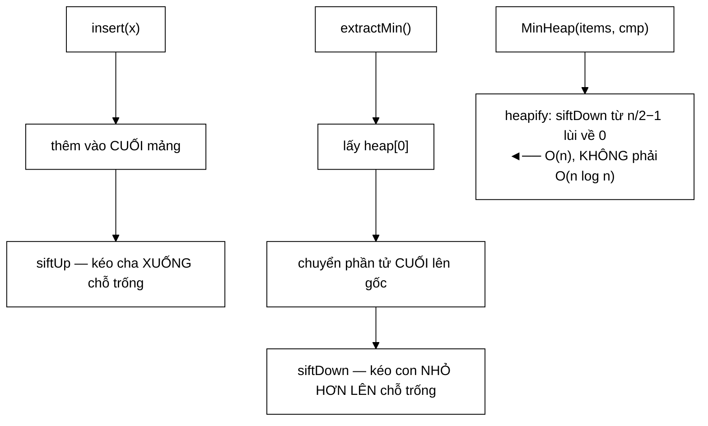

# MinHeap — dùng MIN-heap để tìm phần tử LỚN nhất, và tối ưu "lỗ trống" tiết kiệm 2/3 phép gán

**File nguồn:** `search-engine/src/main/java/com/vnsearch/datastructure/MinHeap.java` (241 dòng)
**Gói:** `com.vnsearch.datastructure` · **Loại:** lớp tổng quát `MinHeap<T>`, **không** an toàn đa luồng (xem mục 6)
**Vị trí trong luồng:** hai nơi dùng — top-K kết quả ([`../ranking/ResultRanker`](../ranking/ResultRanker.md)) và hàng đợi ưu tiên của crawler ([`../crawler/frontier/UrlFrontier`](../crawler/frontier/UrlFrontier.md))
**Đọc kèm:** [`../ranking/ResultRanker.md`](../ranking/ResultRanker.md) · [`../crawler/frontier/FrontQueues.md`](../crawler/frontier/FrontQueues.md)

---

## 📌 Hiểu trong 30 giây

Min-heap tự cài trên mảng, tổng quát với `Comparator` tuỳ ý. Ba điểm kỹ thuật
đáng chú ý:

```
   ① Tối ưu "lỗ trống"  → 1 phép gán mỗi bước thay vì 3 của swap
   ② Floyd heapify      → O(n) thay vì O(n log n) khi dựng từ tập có sẵn
   ③ topK dùng MIN-heap → tìm K phần tử LỚN nhất, O(n log k), bộ nhớ O(k)
```

```
   BIỂU DIỄN CÂY TRONG MỘT MẢNG — KHÔNG MỘT CON TRỎ NÀO

           chỉ số:  0
                   / \
                  1   2
                 / \ / \
                3  4 5  6

   con trái của i  = 2i + 1
   con phải của i  = 2i + 2
   cha của i       = (i − 1) / 2

   ⇒ Cây nhị phân đầy đủ nằm gọn trong ArrayList.
   ⇒ Không có Node, không có con trỏ, không có cấp phát lẻ.
   ⇒ Duyệt cha–con là số học chỉ số ⇒ cục bộ cache tốt.
```



---

## 1. Tối ưu "lỗ trống" — vì sao `swap` là lãng phí

Javadoc dòng 19–27:

> *"`siftUp` và `siftDown` **KHÔNG** dùng `swap`. Thay vào đó chúng giữ giá trị
> cần di chuyển trong một biến tạm, chỉ **KÉO** phần tử trên đường đi vào chỗ
> trống, rồi đặt giá trị đúng **MỘT** lần ở cuối."*
> ```
> swap  : 3 gán mỗi bước      → 3·log n
> "hole": 1 gán mỗi bước + 1  → log n + 1
> ```

```java
private void siftUp(int index) {
    T item = heap.get(index);          // giữ trong biến tạm — "lỗ" xuất hiện ở index
    while (index > 0) {
        int parent = (index - 1) >>> 1;
        T parentItem = heap.get(parent);
        if (comparator.compare(item, parentItem) >= 0) break;
        heap.set(index, parentItem);   // KÉO cha xuống lấp "lỗ" — 1 phép gán
        index = parent;                // "lỗ" dịch lên vị trí cha
    }
    heap.set(index, item);             // đặt MỘT lần duy nhất
}
```

```
   MINH HOẠ — chèn giá trị 1 vào heap [3, 5, 8, 9, 7]

   Mảng:  [3, 5, 8, 9, 7, 1]
                          ↑ index = 5, cha = 2 (giá trị 8)

   ══ CÁCH swap ══                      ══ CÁCH "lỗ trống" ══

   bước 1:                              item = 1  (lỗ ở vị trí 5)
     tmp = a[5]        (gán 1)
     a[5] = a[2]       (gán 2)            a[5] = a[2] = 8   (gán 1)
     a[2] = tmp        (gán 3)            lỗ dịch tới vị trí 2
   [3,5,1,9,7,8]                        [3,5,_,9,7,8]

   bước 2: (cha của 2 là 0, giá trị 3)
     tmp = a[2]        (gán 4)
     a[2] = a[0]       (gán 5)            a[2] = a[0] = 3   (gán 2)
     a[0] = tmp        (gán 6)            lỗ dịch tới vị trí 0
   [1,5,3,9,7,8]                        [_,5,3,9,7,8]

   kết thúc:                              a[0] = item = 1   (gán 3)
                                        [1,5,3,9,7,8]

   ⇒ swap: 6 phép gán      "lỗ trống": 3 phép gán
   ⇒ TIẾT KIỆM ĐÚNG 2/3
```

```
   VÌ SAO ĐÚNG: "LỖ TRỐNG" KHÔNG BAO GIỜ ĐƯỢC ĐỌC

   Trong suốt vòng lặp, vị trí `index` chứa RÁC (giá trị cũ chưa xoá).
   Nhưng vòng lặp chỉ đọc `heap.get(parent)` — không bao giờ
   đọc `heap.get(index)`.

   ⇒ Ghi giá trị đúng vào đó là VÔ ÍCH ở mọi bước trung gian.
   ⇒ Chỉ bước CUỐI mới cần.

   Đây cũng là kỹ thuật mà java.util.PriorityQueue của JDK dùng
   (Javadoc dòng 27) — không phải phát minh riêng, nhưng
   biết và áp dụng đúng là điều đáng ghi nhận.
```

### 1.1 `siftDown` — phải chọn con **nhỏ hơn**

```java
if (right < n) {
    T rightItem = heap.get(right);
    if (comparator.compare(rightItem, childItem) < 0) {
        child = right; // phải chọn con NHỎ hơn, nếu không vi phạm min-heap
        childItem = rightItem;
    }
}
```

```
   VÌ SAO BẮT BUỘC CHỌN CON NHỎ HƠN

   Heap:      5
             / \
            2   3

   Nếu kéo con PHẢI (3) lên:
              3
             / \
            2   5
   ⇒ 3 > 2 ⇒ VI PHẠM tính chất min-heap ở nhánh trái

   Nếu kéo con TRÁI (2) lên:
              2
             / \
            3   5
   ⇒ ĐÚNG

   ⇒ Chọn con nhỏ hơn đảm bảo phần tử được kéo lên
     nhỏ hơn CẢ HAI con của nó.
```

### 1.2 Chặn vòng lặp bằng `index < n/2`

Javadoc dòng 136–138:

> *"Vòng lặp chặn bằng `index < n/2` vì mọi node có chỉ số `>= n/2` đều là **lá**:
> nếu `i >= floor(n/2)` thì `2i+1 >= n`, tức không có con trái."*

```
   CHỨNG MINH

   i ≥ ⌊n/2⌋
   ⇒ 2i ≥ 2⌊n/2⌋ ≥ n − 1
   ⇒ 2i + 1 ≥ n
   ⇒ chỉ số con trái nằm NGOÀI mảng
   ⇒ i là LÁ

   ⇒ Không cần kiểm `child < n` trong vòng lặp.
   ⇒ Một phép so sánh được cắt khỏi MỖI bước.
```

Cùng lý do đó áp cho `heapify`:

```java
for (int i = (heap.size() >>> 1) - 1; i >= 0; i--) siftDown(i);
// Chi so >= size/2 deu la la (khong co con) nen khong can siftDown.
```

---

## 2. Floyd heapify — $O(n)$, và chứng minh

Javadoc dòng 29–34:

> *"Constructor `MinHeap(Collection, Comparator)` dùng thuật toán **Floyd
> heapify** — `siftDown` từ chỉ số `n/2 - 1` lùi về 0 — cho ra $O(n)$ thay vì
> $O(n \log n)$ nếu chèn lần lượt từng phần tử. Chứng minh: tổng chi phí là
> $\sum_{h=0}^{\log n} \frac{n}{2^{h+1}} \cdot h = n \sum \frac{h}{2^{h+1}} \le 2n$."*

```
   VÌ SAO KHÔNG PHẢI O(n log n)

   Trực giác sai:  "n phần tử × siftDown O(log n) = O(n log n)"

   Trực giác đúng: PHẦN LỚN node nằm GẦN ĐÁY, và node gần đáy
                   có siftDown RẤT NGẮN.

   ┌────────┬──────────────┬─────────────────┬──────────────┐
   │ Mức h  │ Số node      │ siftDown tối đa │ Tổng chi phí │
   ├────────┼──────────────┼─────────────────┼──────────────┤
   │ đáy    │ n/2          │ 0 (là lá)       │ 0            │
   │ h = 1  │ n/4          │ 1               │ n/4          │
   │ h = 2  │ n/8          │ 2               │ n/4          │
   │ h = 3  │ n/16         │ 3               │ 3n/16        │
   │ …      │ …            │ …               │ …            │
   │ gốc    │ 1            │ log n           │ log n        │
   └────────┴──────────────┴─────────────────┴──────────────┘

   Tổng = n · Σ h/2^(h+1)  với h = 0, 1, 2, …

   Chuỗi Σ h/2^(h+1) HỘI TỤ về 1 (không phụ thuộc n)
     = 0/2 + 1/4 + 2/8 + 3/16 + 4/32 + …
     = 0 + 0,25 + 0,25 + 0,1875 + 0,125 + … → 1

   ⇒ Tổng ≤ 2n = O(n)
```

```
   ⇒ ĐIỂM MẤU CHỐT: NỬA SỐ NODE LÀ LÁ, VÀ CHÚNG TỐN 0.

   Chèn lần lượt thì làm NGƯỢC LẠI: mỗi phần tử mới vào ĐÁY
   rồi siftUp LÊN — tức đi qua toàn bộ chiều cao.
   ⇒ Đó mới là O(n log n).

   ⇒ Cùng dữ liệu, cùng kết quả, khác thứ tự thao tác,
     khác hẳn độ phức tạp.
```

```
   ⚠️ HAI HEAP KHÁC NHAU VỀ CẤU TRÚC

   Floyd heapify và chèn-lần-lượt cho ra hai MẢNG KHÁC NHAU,
   dù cả hai đều là min-heap hợp lệ.

   ⇒ Test heapifyMatchesRepeatedInsertOnRandomData KHÔNG so
     hai mảng — nó so THỨ TỰ EXTRACT, thứ duy nhất được
     hợp đồng bảo đảm.
   ⇒ Chi tiết này rất dễ làm sai khi viết test.
```

---

## 3. `topK` — vì sao dùng **MIN**-heap để tìm phần tử **LỚN** nhất

Javadoc dòng 168–172:

> *"Duy trì một min-heap kích thước tối đa $k$ chứa $k$ phần tử **LỚN NHẤT** đã
> gặp. Đỉnh của min-heap chính là **NGƯỠNG CỬA** để lọt vào top-$k$, và đọc nó là
> $O(1)$ — **đây là lý do dùng MIN-heap để tìm phần tử LỚN nhất**."*

```
   ⭐ ĐÂY LÀ CHỖ NGƯỜI HỌC HAY NHẦM NHẤT

   "Tìm K phần tử LỚN nhất" ⇒ phản xạ đầu tiên là dùng MAX-heap.
   SAI.

   MAX-heap kích thước k:
     đỉnh = phần tử LỚN NHẤT trong k
     ⇒ để biết có nên nhận phần tử mới không, phải tìm
       phần tử NHỎ NHẤT trong heap ⇒ O(k), phải duyệt hết

   MIN-heap kích thước k:
     đỉnh = phần tử NHỎ NHẤT trong k = NGƯỠNG CỬA
     ⇒ phần tử mới > ngưỡng ⇒ nhận (thay đỉnh)
     ⇒ phần tử mới ≤ ngưỡng ⇒ BỎ QUA ngay
     ⇒ MỘT phép so sánh, O(1)

   ⇒ Ta cần truy cập nhanh tới phần tử "YẾU NHẤT trong nhóm
     được chọn", vì đó là kẻ sắp bị loại.
   ⇒ Nên heap phải sắp theo chiều NGƯỢC với thứ tự ta muốn.
```

```
   MINH HOẠ — top-3 lớn nhất từ [5, 3, 8, 1, 9, 2, 7]

   seed 3 phần tử đầu: [5, 3, 8] → heapify → heap = [3, 5, 8]
                                              đỉnh = 3 (ngưỡng)

   1: 1 > 3?  KHÔNG → bỏ qua               (1 phép so sánh)
   9: 9 > 3?  CÓ    → extractMin(3), insert(9)
                      heap = [5, 9, 8], ngưỡng = 5
   2: 2 > 5?  KHÔNG → bỏ qua
   7: 7 > 5?  CÓ    → extractMin(5), insert(7)
                      heap = [7, 9, 8], ngưỡng = 7

   extract lần lượt: 7, 8, 9 (TĂNG dần)
   reverse         : 9, 8, 7 (GIẢM dần)  ✓

   ⇒ 2/4 phần tử bị loại bằng ĐÚNG MỘT phép so sánh.
```

### 3.1 Ba tối ưu nhỏ trong `topK`

```
   ① SEED + HEAPIFY thay vì chèn k lần
     Javadoc dòng 174–175.
     k phần tử đầu gom vào List rồi heapify O(k),
     thay vì k lần insert O(k log k).

   ② DẤU ">" CHẶT, không phải ">="
     Bình luận dòng 202–203: "phần tử BẰNG ngưỡng thì bỏ qua,
     tiết kiệm một cặp extractMin+insert (2 log k) mà kết quả
     vẫn hợp lệ."
     ⇒ Với nhiều giá trị bằng nhau (điểm 0.0 chẳng hạn),
       đây là khác biệt lớn.

   ③ BỘ NHỚ O(k), KHÔNG PHỤ THUỘC n
     Javadoc dòng 177–179: "chạy được trên luồng dữ liệu rất lớn"
     ⇒ topK duyệt `items` bằng for-each, không cần
       toàn bộ dữ liệu trong bộ nhớ cùng lúc.
```

```
   ⚠️ NHƯNG CHỮ KÝ LÀ Collection<T>, KHÔNG PHẢI Iterable<T>

   Collection buộc dữ liệu phải NẰM SẴN trong bộ nhớ.
   ⇒ Lợi thế "bộ nhớ O(k) chạy được trên luồng lớn"
     KHÔNG khai thác được với chữ ký hiện tại.

   Đổi sang Iterable<T> là thay đổi một từ, và nó mở khoá
   đúng tính chất mà Javadoc đang quảng cáo. Xem đề xuất 2.
```

### 3.2 Ba trường hợp biên

```java
if (k <= 0 || items == null || items.isEmpty()) return new ArrayList<>();
...
if (heap == null) heap = new MinHeap<>(seed, cmp); // items.size() < k
```

```
   k <= 0            → danh sách rỗng
   items == null     → danh sách rỗng (không ném NPE)
   items rỗng        → danh sách rỗng
   items.size() < k  → heap vẫn null sau vòng lặp
                       ⇒ heapify phần seed đã gom
                       ⇒ trả về TẤT CẢ, đã sắp giảm dần

   ⇒ Bốn trường hợp biên, xử lý đúng cả bốn.
   ⇒ Trường hợp cuối tinh vi nhất: biến `heap` vẫn null
     là TÍN HIỆU cho biết "chưa đủ k phần tử".
```

---

## 4. Hai nơi lớp này được dùng

```
   ① ../ranking/ResultRanker — top-K kết quả
      MinHeap.topK(scored, topN, comparingDouble(::finalScore))
      c = 500 ứng viên, K = 10
      ⇒ O(500 · log 10) ≈ 1.650 thay vì sort O(500 · log 500) ≈ 4.500

   ② ../crawler/frontier — hàng đợi ưu tiên URL
      Dùng ĐỐI TƯỢNG heap (insert/extractMin), không phải topK.
      ⇒ Đây là lý do lớp có CẢ hai API: đối tượng và static.
```

```
   ⚠️ HAI CÁCH DÙNG, HAI YÊU CẦU AN TOÀN ĐA LUỒNG KHÁC NHAU

   ResultRanker : một luồng, một truy vấn ⇒ không cần đồng bộ
   UrlFrontier  : NHIỀU luồng crawler cùng lấy URL
                  ⇒ Javadoc dòng 46–48 nói rõ: "UrlFrontier bọc
                    MỌI thao tác trong khối synchronized"

   ⇒ Lớp KHÔNG tự đồng bộ — đúng quyết định:
     đồng bộ bên trong sẽ tính phí cho ResultRanker
     (nơi không cần) để phục vụ UrlFrontier.
   ⇒ Nhưng nó dời trách nhiệm sang người gọi, và điều đó
     chỉ được ghi trong Javadoc.
```

---

## 5. Hướng dẫn thực hành

### 5.1 Chạy demo cho báo cáo

```powershell
cd search-engine
.\mvnw.cmd -q compile exec:java "-Dexec.mainClass=com.vnsearch.datastructure.MinHeap"
```

```
   Extract theo thứ tự tăng dần: 1 2 3 5 7 8 9
   Heapify O(n) -> min = 1
   Top-3 lớn nhất (không sắp xếp toàn bộ): [9, 8, 7]
```

### 5.2 Dùng

```java
// Dang DOI TUONG — hang doi uu tien
MinHeap<CrawlTask> queue = new MinHeap<>(Comparator.comparingInt(CrawlTask::priority));
queue.insert(task);
CrawlTask next = queue.extractMin();

// Dang STATIC — top-K, KHONG sap xep toan bo
List<Doc> top10 = MinHeap.topK(candidates, 10,
        Comparator.comparingDouble(Doc::score));

// Dung O(n) khi da co san tap phan tu
MinHeap<Integer> heap = new MinHeap<>(danhSachCoSan, Comparator.naturalOrder());
```

### 5.3 Chọn `topK` hay `sort`

```
   k / n           Nên dùng
   ─────────────────────────────────────────────
   k << n          topK — O(n log k), bộ nhớ O(k)
   k ≈ n           sort — topK không lợi gì
   k = n           sort — topK phải extract hết rồi reverse

   Điểm hoà vốn ≈ khi log k ≈ log n, tức k ≈ n.
   ⇒ Với K = 10 và n = 500: rõ ràng dùng topK.
```

### 5.4 Cạm bẫy

```
   ① KHÔNG an toàn đa luồng. Người gọi phải tự đồng bộ.

   ② peek() và extractMin() NÉM NoSuchElementException
     khi rỗng, không trả null. Phải kiểm isEmpty() trước.

   ③ Constructor MinHeap(items, cmp) SAO CHÉP items
     (new ArrayList<>(items)) ⇒ không sửa danh sách gốc. ✓

   ④ topK trả về danh sách GIẢM dần.
     extractMin cho TĂNG dần rồi reverse.
     ⇒ Nếu ai bỏ dòng reverse "cho gọn", kết quả đảo ngược
       hoàn toàn mà vẫn "có vẻ đúng".

   ⑤ Comparator PHẢI nhất quán (transitive, phản đối xứng).
     Comparator không nhất quán ⇒ heap vẫn "chạy" nhưng
     thứ tự extract SAI, không có ngoại lệ nào.

   ⑥ Sửa một phần tử ĐANG NẰM trong heap (đổi trường
     mà comparator đọc) ⇒ heap hỏng im lặng.
     Chỉ dùng heap với đối tượng bất biến, hoặc khoá bất biến.
```

---

## 6. Độ phức tạp & chi phí

| Thao tác | Thời gian | Bộ nhớ thêm |
|---|---|---|
| `peek()` | $O(1)$ | 0 |
| `insert(x)` | $O(\log n)$ | Khấu hao — `ArrayList` tăng gấp đôi |
| `extractMin()` | $O(\log n)$ | 0 |
| `MinHeap(items, cmp)` | **$O(n)$** — Floyd | $O(n)$ (sao chép) |
| `topK(items, k, cmp)` | $O(n \log k)$ | $O(k)$ |

```
   SO SÁNH topK VỚI sort — n = 500, k = 10

   sort rồi cắt:  O(n log n) = 500 × 9   = 4.500 phép so sánh
                  bộ nhớ O(n) = 500 phần tử

   topK:          O(n log k) = 500 × 3,3 = 1.650 phép so sánh
                  bộ nhớ O(k) = 10 phần tử

   ⇒ Nhanh hơn 2,7 lần, ít bộ nhớ hơn 50 lần.

   VÀ TRONG THỰC TẾ CÒN TỐT HƠN CON SỐ TRÊN:
   phần lớn phần tử bị loại bằng ĐÚNG MỘT phép so sánh
   (không vào heap), nên hằng số nhỏ hơn nhiều.
```

```
   ĐO CHI PHÍ CỦA TỐI ƯU "LỖ TRỐNG"

   n = 1.000.000 phần tử, 1 triệu lần insert:
     swap  : 3 × log₂(10⁶) × 10⁶ = 3 × 20 × 10⁶ = 60 triệu gán
     "lỗ"  : (20 + 1) × 10⁶      = 21 triệu gán

   ⇒ Tiết kiệm 39 triệu phép gán tham chiếu.
   ⇒ Mỗi phép gán tham chiếu trong ArrayList còn kèm
     kiểm biên và (với ArrayList) một lần ghi vào mảng Object[].
```

---

## 7. Kiểm thử liên quan

| Test | Bảo vệ điều gì |
|---|---|
| `test/java/com/vnsearch/datastructure/MinHeapTest.java` | 8 ca — API cơ bản và biên |
| `test/java/com/vnsearch/datastructure/HeapifyAndFreezeTest.java` | 5 ca cho heap (+ 7 ca cho `SparseMatrix`) |

| Ca test | Tính chất được canh giữ |
|---|---|
| `peekAndExtractOnEmptyHeapThrows` | Ném `NoSuchElementException` |
| `singleElement` | $n = 1$ |
| `extractsInAscendingOrder` | **Hợp đồng chính** |
| `duplicateValuesHandledCorrectly` | Giá trị trùng — nơi comparator trả 0 |
| `topKReturnsDescendingLargest` | `topK` + thứ tự giảm dần |
| `topKWithEmptyCollectionReturnsEmpty` | Biên |
| `topKWithKGreaterThanSizeReturnsAllSorted` | Nhánh `heap == null` sau vòng lặp |
| `topKWithKZeroReturnsEmpty` | `k <= 0` |
| `heapifyProducesValidHeapOrder` | Floyd heapify cho heap hợp lệ |
| `heapifyOnEmptyCollectionWorks` | `(0 >>> 1) - 1 = -1` ⇒ vòng lặp không chạy |
| **`heapifyMatchesRepeatedInsertOnRandomData`** | **Hai đường dựng cho cùng thứ tự extract** |
| `heapMaintainsMinimumAfterMixedOperations` | Trộn `insert`/`extractMin` |
| `topKStillCorrectAfterHoleOptimisation` | **Tối ưu "lỗ trống" không làm sai kết quả** |

```
   ⭐ heapifyMatchesRepeatedInsertOnRandomData LÀ MẪU MỰC

   Nó so sánh HAI CÀI ĐẶT của cùng một hợp đồng:
     - chèn lần lượt (chậm, hiển nhiên đúng)
     - Floyd heapify (nhanh, tinh vi)

   VÀ nó so THỨ TỰ EXTRACT, không so mảng bên trong —
   vì hai cách dựng cho hai mảng KHÁC NHAU mà cùng hợp lệ.

   ⇒ Đúng kỹ thuật "test đối chiếu" mà
     ../query/PostingListMerger.md đề xuất 1 khuyến nghị.
   ⇒ Ở đây nó ĐÃ CÓ. Rất tốt.
```

**Còn thiếu:**

```
   ✗ Comparator null ⇒ Objects.requireNonNull ném NPE
   ✗ items null trong constructor ⇒ requireNonNull
   ✗ topK với items == null (được xử lý, không được kiểm)
   ✗ Constructor SAO CHÉP items — sửa danh sách gốc sau đó
     không được ảnh hưởng heap
   ✗ Dấu ">" chặt trong topK: với nhiều giá trị BẰNG NHAU,
     kết quả vẫn phải đủ k phần tử
```

```powershell
cd search-engine
.\mvnw.cmd -q -Dtest='MinHeapTest,HeapifyAndFreezeTest' test
```

---

## 8. Chấm theo chuẩn doanh nghiệp

| Tiêu chí | Điểm | Nhận xét |
|---|---|---|
| **Giải thích "vì sao MIN-heap cho phần tử LỚN nhất"** | 10/10 | Chỗ người học nhầm nhiều nhất, và Javadoc giải thích đúng bằng khái niệm "ngưỡng cửa" |
| **Chứng minh $O(n)$ của Floyd heapify** | 10/10 | Có công thức tổng chuỗi, không chỉ khẳng định |
| **Tối ưu "lỗ trống" có định lượng** | 10/10 | 3 gán vs 1 gán mỗi bước, và nêu rõ JDK cũng làm vậy |
| **Test đối chiếu hai cài đặt** | 10/10 | `heapifyMatchesRepeatedInsertOnRandomData` so **thứ tự extract**, không so mảng — đúng chỗ tinh tế |
| Chặn vòng lặp bằng `n/2` | 10/10 | Có chứng minh "mọi node ≥ n/2 là lá" |
| Ba tối ưu nhỏ trong `topK` | 9/10 | Seed+heapify, dấu `>` chặt, bộ nhớ $O(k)$ |
| Xử lý biên | 9/10 | Bốn trường hợp biên của `topK` đều đúng, kể cả `items.size() < k` |
| Quyết định không tự đồng bộ | 9/10 | Đúng — nhưng nêu rõ ai phải đồng bộ và ở đâu |
| Sao chép phòng vệ | 9/10 | Constructor `new ArrayList<>(items)` không sửa nguồn |
| **Chữ ký `Collection` chặn tính chất đã quảng cáo** | **5/10** | Javadoc nói "chạy được trên luồng dữ liệu rất lớn" nhưng `Collection` buộc dữ liệu nằm sẵn trong bộ nhớ |
| Kiểm thử tiền điều kiện | 4/10 | Hai `requireNonNull` và nhánh `items == null` không có ca nào |
| Bảo vệ khỏi sửa phần tử trong heap | 3/10 | Sửa trường mà comparator đọc ⇒ heap hỏng **im lặng**; không nói ở đâu |
| `main` trong lớp sản phẩm | 5/10 | Tiện cho báo cáo; dùng `java.util.Arrays` và `java.util.Collections` đầy đủ tên thay vì `import` |

**Ba đề xuất nâng lên mức sản phẩm:**

1. **Đổi `topK` sang nhận `Iterable<T>` — một từ, và nó mở khoá đúng tính chất
   Javadoc đang quảng cáo.** Dòng 177–179 nói bộ nhớ $O(k)$ "không phụ thuộc $n$
   nên chạy được trên luồng dữ liệu rất lớn", nhưng `Collection<T>` buộc toàn bộ
   dữ liệu phải nằm sẵn trong bộ nhớ — tức lợi thế đó **không dùng được**. Thân
   hàm đã duyệt bằng for-each nên không phải sửa gì khác:
   ```java
   public static <T> List<T> topK(Iterable<T> items, int k, Comparator<T> cmp) {
       if (k <= 0 || items == null) return new ArrayList<>();
       ...
   }
   ```
   Sau thay đổi này, `topK` dùng được thẳng trên một `Stream`, một con trỏ cơ sở
   dữ liệu, hay một luồng đọc file — và câu trong Javadoc trở thành sự thật thay
   vì tiềm năng. (Bỏ `items.isEmpty()` khỏi phép kiểm đầu; nhánh `heap == null`
   cuối hàm đã xử lý đúng tập rỗng.)

2. **Viết một `assert` chống "sửa phần tử đang nằm trong heap".** Đây là cạm bẫy
   ⑥ và là lỗi tệ nhất có thể xảy ra với cấu trúc này: heap hỏng **hoàn toàn im
   lặng**, `extractMin` trả sai thứ tự mà không có ngoại lệ nào, và triệu chứng
   xuất hiện ở rất xa nguyên nhân. Với
   [`UrlFrontier`](../crawler/frontier/UrlFrontier.md) — nơi `CrawlTask` sống lâu
   trong hàng đợi — rủi ro này là thật:
   ```java
   /** Chi dung o che do phat trien (-ea): kiem tra tinh chat heap con nguyen. */
   boolean laHeapHopLe() {
       for (int i = 0; i < heap.size() >>> 1; i++) {
           int l = 2 * i + 1, r = l + 1;
           if (comparator.compare(heap.get(l), heap.get(i)) < 0) return false;
           if (r < heap.size() && comparator.compare(heap.get(r), heap.get(i)) < 0) return false;
       }
       return true;
   }
   // trong extractMin / peek:
   assert laHeapHopLe() : "Tinh chat heap bi pha — co ai sua phan tu DANG nam trong heap khong?";
   ```
   `assert` tắt mặc định ở sản phẩm nên không tốn gì, nhưng Surefire bật `-ea` nên
   **mọi** test hiện có tự động được canh giữ thêm bất biến này.

3. **Phủ các tiền điều kiện và ghi rõ ràng buộc bất biến của phần tử.** Hai
   `Objects.requireNonNull` và nhánh `items == null` hiện không có ca test nào —
   nghĩa là xoá chúng đi thì mọi test vẫn xanh. Ba dòng khép lỗ, kèm một dòng
   Javadoc nói ra ràng buộc quan trọng nhất mà lớp đang giả định ngầm:
   ```java
   @Test
   void tuChoiDoiSoNull() {
       assertThrows(NullPointerException.class, () -> new MinHeap<Integer>(null));
       assertThrows(NullPointerException.class, () -> new MinHeap<>(List.of(1), null));
       assertEquals(List.of(), MinHeap.topK(null, 3, Comparator.naturalOrder()));
   }

   @Test
   void sapXepNguonKhongBiSuaDoi() {
       List<Integer> nguon = new ArrayList<>(List.of(5, 3, 8));
       new MinHeap<>(nguon, Comparator.naturalOrder());
       assertEquals(List.of(5, 3, 8), nguon, "Constructor PHAI sao chep, khong sua nguon");
   }
   ```
   ```java
   /**
    * <p><b>Rang buoc:</b> khoa so sanh cua phan tu PHAI bat bien trong suot
    * thoi gian phan tu nam trong heap. Sua no lam hong tinh chat heap ma
    * KHONG co ngoai le nao duoc nem.
    */
   ```

---

## 9. Liên kết

- Nơi dùng `topK` cho kết quả tìm kiếm: [`../ranking/ResultRanker.md`](../ranking/ResultRanker.md)
- Nơi dùng dạng đối tượng làm hàng đợi ưu tiên: [`../crawler/frontier/UrlFrontier.md`](../crawler/frontier/UrlFrontier.md) · [`../crawler/frontier/FrontQueues.md`](../crawler/frontier/FrontQueues.md) · [`../crawler/frontier/CrawlTask.md`](../crawler/frontier/CrawlTask.md)
- Cấu trúc dữ liệu tự cài khác trong cùng gói: [`SparseMatrix.md`](./SparseMatrix.md) · [`Trie.md`](./Trie.md) · [`BloomFilter.md`](./BloomFilter.md) · [`LRUCache.md`](./LRUCache.md)
- Cùng mẫu "dựng rồi đông băng": [`SparseMatrix.md`](./SparseMatrix.md) (`freeze()`)
- Kỹ thuật test đối chiếu hai cài đặt: [`../query/PostingListMerger.md`](../query/PostingListMerger.md)
