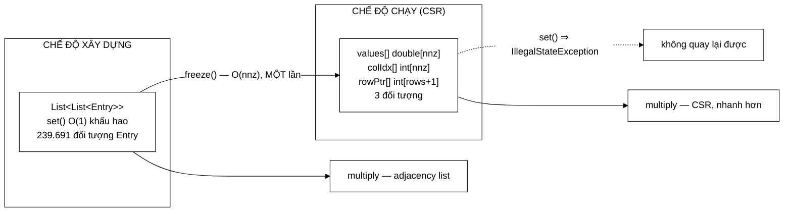

# SparseMatrix — dựng linh hoạt, đông cứng để chạy nhanh: một cấu trúc, hai chế độ

**File nguồn:** `search-engine/src/main/java/com/vnsearch/datastructure/SparseMatrix.java` (246 dòng)
**Gói:** `com.vnsearch.datastructure` · **Loại:** lớp có **hai trạng thái** (xây dựng / đông cứng) ⇒ **không** an toàn đa luồng khi đang dựng
**Vị trí trong luồng:** lưu ma trận liên kết cho [`PageRankService`](../ranking/PageRankService.md) — chạy ngoài chu kỳ truy vấn
**Đọc kèm:** [`../ranking/PageRankService.md`](../ranking/PageRankService.md) · [`MinHeap.md`](./MinHeap.md)

---

## 📌 Hiểu trong 30 giây

Ma trận $5011 \times 5011$ nhưng chỉ **0,95 %** ô khác 0. Lưu đặc là lãng phí
191 MB; lưu thưa tốn vài MB.

```
   ma trận đặc double[5011][5011] = 5.011² × 8 B = 191,5 MB
   thực tế khác 0                 = 239.691 ô  (độ thưa 0,95 %)
   ⇒ biểu diễn thưa               ≈ 2,9 MB

   VÀ TỈ LỆ NÀY CÒN XẤU ĐI KHI CORPUS LỚN HƠN:
     độ thưa = nnz/n² = k_tb/n     ← tỉ lệ NGHỊCH với n
     n = 1.000.000 ⇒ đặc cần 8 TB, thưa vẫn vài trăm MB
```



---

## 1. Vì sao thưa, và vì sao lập luận này **mạnh dần** theo quy mô

Javadoc dòng 10–14:

> *"Với $n = 5011$ trang, ma trận đặc cần $5011^2 \times 8 = 191{,}5$ MB, trong
> khi thực tế chỉ có $nnz = 239\,691$ phần tử khác 0 (độ thưa 0,95 %) nên biểu
> diễn thưa chỉ tốn vài MB. Tỉ lệ này còn **XẤU ĐI** khi corpus lớn hơn, vì
> **độ thưa** $= nnz/n^2 = k_{tb}/n$ **tỉ lệ nghịch với** $n$."*

```
   PHÉP BIẾN ĐỔI ĐÁNG CHÚ Ý

   nnz = n × k_tb        (n trang, mỗi trang trung bình k_tb liên kết)

   độ thưa = nnz / n²
           = (n × k_tb) / n²
           = k_tb / n              ← KHÔNG phụ thuộc nnz nữa

   Với corpus này: 239.691 / 5.011 = 47,8 liên kết/trang
                   độ thưa = 47,8 / 5.011 = 0,95 %  ✓

   ⇒ k_tb là hằng số của WEB (số link trung bình mỗi trang,
     không đổi khi corpus lớn hơn).
   ⇒ Nên độ thưa giảm TUYẾN TÍNH theo 1/n.
```

```
   ĐỘ THƯA THEO QUY MÔ (giả sử k_tb = 48 không đổi)

   n              đặc          thưa       độ thưa
   ──────────────────────────────────────────────────
   5.011        191,5 MB      2,9 MB      0,95 %
   50.000        19,1 GB       29 MB      0,096 %
   1.000.000      7,6 TB      580 MB      0,0048 %

   ⇒ Ở n = 1 triệu, ma trận đặc KHÔNG THỂ tồn tại.
   ⇒ Biểu diễn thưa không phải "tối ưu", nó là ĐIỀU KIỆN
     để bài toán giải được.
```

```
   ⭐ ĐÂY LÀ CÁCH BIỆN MINH ĐÚNG CHO MỘT LỰA CHỌN CẤU TRÚC

   Không nói "ma trận thưa tiết kiệm bộ nhớ" (ai cũng biết).
   Mà nói: "lợi thế này TĂNG theo n, vì độ thưa = k_tb/n".

   ⇒ Lập luận đúng ở quy mô hiện tại VÀ ở mọi quy mô lớn hơn.
   ⇒ Đây là điều một hội đồng chấm đồ án tốt nghiệp muốn thấy:
     quyết định không chỉ đúng cho số liệu demo.
```

---

## 2. Hai chế độ — và vì sao cần cả hai

### 2.1 Chế độ xây dựng: adjacency list

```java
private List<List<Entry>> rowEntries;   // null sau khi freeze()

public void set(int row, int col, double value) {
    if (isFrozen()) throw new IllegalStateException("Ma trận đã đông cứng...");
    if (row < 0 || row >= rows || col < 0 || col >= cols) throw new IndexOutOfBoundsException(...);
    rowEntries.get(row).add(new Entry(col, value));
}
```

Javadoc dòng 18–21:

> *"Cho phép `set` $O(1)$ khấu hao — **bắt buộc phải có** vì ma trận được xây
> **DẦN** trong lúc duyệt outlink, khi chưa biết trước số phần tử."*

```
   VÌ SAO KHÔNG DỰNG THẲNG CSR

   CSR cần biết TRƯỚC:
     - tổng nnz (để cấp phát values[] và colIdx[])
     - số phần tử của TỪNG hàng (để tính rowPtr[])

   Nhưng PageRankService duyệt outlink lần lượt:
     for mỗi trang idx:
       for mỗi outlink:
         if (nằm trong corpus và không tự trỏ)
           incoming.set(targetIdx, idx, weight)

   ⇒ Không biết trước hàng targetIdx sẽ có bao nhiêu phần tử
   ⇒ CSR sẽ phải cấp phát lại và dịch chuyển toàn bộ mảng
     mỗi lần thêm ⇒ O(nnz) mỗi lần set ⇒ O(nnz²) tổng cộng

   ⇒ Adjacency list là bắt buộc ở giai đoạn dựng.
```

### 2.2 Chế độ chạy: CSR

```java
csrValues = new double[nnz];   // gia tri khac 0, xep theo hang
csrColIdx = new int[nnz];      // chi so cot tuong ung
csrRowPtr = new int[rows + 1]; // rowPtr[i] = chi so bat dau cua hang i
```

```
   MINH HOẠ CSR — ma trận 3×3 của phần demo

   Ma trận:
        cột: 0     1     2
   hàng 0: [ .   0.5    .  ]
   hàng 1: [ .    .    1.0 ]
   hàng 2: [0.5  0.5    .  ]

   CSR:
     values[] = [0.5, 1.0, 0.5, 0.5]
     colIdx[] = [ 1,   2,   0,   1 ]
     rowPtr[] = [ 0,   1,   2,   4 ]
                 ↑    ↑    ↑    ↑
              hàng0 hàng1 hàng2 CANH BIÊN

   Đọc hàng i: các phần tử ở chỉ số rowPtr[i] .. rowPtr[i+1]−1
     hàng 0: [0, 1) → values[0]=0.5, col=1
     hàng 1: [1, 2) → values[1]=1.0, col=2
     hàng 2: [2, 4) → values[2]=0.5 col=0, values[3]=0.5 col=1
```

```
   csrRowPtr[rows] = position;   // CANH BIÊN

   Bình luận dòng 144: "giúp vòng lặp không cần if riêng cho hàng cuối"

   Không có phần tử canh biên:
     for (int p = rowPtr[row]; p < (row+1 < rows ? rowPtr[row+1] : nnz); p++)
                                    └── một phép rẽ nhánh MỖI hàng ──┘

   Có phần tử canh biên:
     int end = csrRowPtr[row + 1];       ← luôn hợp lệ
     for (int p = csrRowPtr[row]; p < end; p++)

   ⇒ Kỹ thuật "phần tử canh biên" (sentinel) kinh điển:
     thêm MỘT phần tử để xoá MỘT trường hợp đặc biệt.
   ⇒ Chi phí: 4 byte. Lợi ích: vòng lặp nóng không có rẽ nhánh thừa.
```

### 2.3 Ba lợi ích đo được

Javadoc dòng 30–38:

```
   ① BỘ NHỚ: 12 byte/phần tử thay vì ~32 byte của Entry
      Entry = 16 B header + 4 B int + 8 B double, căn lề lên 32 B
      CSR   = 8 B (double) + 4 B (int) = 12 B
      ⇒ TIẾT KIỆM ~2,7 LẦN

      239.691 phần tử:
        Entry : 239.691 × 32 =  7,67 MB  (+ overhead ArrayList)
        CSR   : 239.691 × 12 =  2,88 MB

   ② CỤC BỘ CACHE: "CPU nạp được 16 giá trị double mỗi cache line
      thay vì nhảy tới các object rải rác"

      cache line = 64 byte
      ⇒ 64/8 = 8 double, hoặc 64/4 = 16 int mỗi lần nạp
      ⇒ Entry rải rác trong heap: MỖI phần tử là một cache miss
      ⇒ cache miss ≈ 100 chu kỳ, phép nhân double ≈ 4 chu kỳ

   ③ ÁP LỰC GC: 3 đối tượng thay vì 239.691 đối tượng
      ⇒ GC phải duyệt và đánh dấu ít hơn 80.000 lần
```

```
   VÀ ĐÁNH ĐỔI ĐƯỢC BIỆN MINH BẰNG SỐ LẦN DÙNG

   Javadoc dòng 39–40: "PageRank chạy 53 vòng lặp trên CÙNG một
   ma trận, nên trả chi phí đông cứng MỘT lần để đổi lấy 53 lần
   nhân nhanh hơn là đánh đổi rất có lợi."

   chi phí freeze : O(nnz) MỘT lần
   lợi ích        : 53 × (cache tốt hơn + không dereference)

   ⇒ Nếu chỉ nhân MỘT lần, freeze không đáng.
   ⇒ Con số 53 là số vòng lặp THẬT đo được, không phải ước đoán.
```

---

## 3. `multiply` tự chọn chế độ — người gọi không phải biết

```java
public double[] multiply(double[] vector) {
    if (vector.length != cols) throw new IllegalArgumentException(...);
    double[] result = new double[rows];
    if (isFrozen()) multiplyCsr(vector, result);
    else            multiplyAdjacencyList(vector, result);
    return result;
}
```

```
   ⭐ THIẾT KẾ API ĐÚNG

   Hai chế độ lưu trữ là CHI TIẾT CÀI ĐẶT.
   Người gọi chỉ cần multiply(vector) và nhận kết quả GIỐNG HỆT.

   ⇒ Quên gọi freeze() ⇒ CHẬM HƠN, KHÔNG SAI.
   ⇒ Cùng tính chất an toàn với prepare() ở
     ../ranking/RelevanceScorer.md mục 3.2.

   ⇒ Đây là tính chất quý nhất khi thêm một tối ưu:
     người quên dùng nó vẫn nhận kết quả đúng.
```

```java
private void multiplyCsr(double[] vector, double[] result) {
    for (int row = 0; row < rows; row++) {
        double sum = 0.0;
        int end = csrRowPtr[row + 1];
        for (int p = csrRowPtr[row]; p < end; p++) {
            sum += csrValues[p] * vector[csrColIdx[p]];
        }
        result[row] = sum;
    }
}
```

```
   VÒNG NÓNG — KHÔNG MỘT PHÉP DEREFERENCE ĐỐI TƯỢNG NÀO

   csrValues[p]           → đọc mảng double, tuần tự
   csrColIdx[p]           → đọc mảng int, tuần tự
   vector[csrColIdx[p]]   → đọc mảng double, NGẪU NHIÊN

   ⇒ Hai trong ba lần đọc là TUẦN TỰ ⇒ prefetcher đoán đúng
   ⇒ Chỉ vector[] là truy cập ngẫu nhiên — không tránh được,
     vì đó là bản chất phép nhân ma trận-vector

   So với adjacency list:
     e.value, e.col        → theo con trỏ tới đối tượng Entry
                             nằm ĐÂU ĐÓ trong heap
     ⇒ mỗi phần tử là một lần nhảy ngẫu nhiên
```

```
   `double sum = 0.0` LÀ BIẾN CỤC BỘ, KHÔNG PHẢI result[row]

   Cộng dồn vào biến cục bộ ⇒ JIT giữ nó trong THANH GHI.
   Cộng dồn thẳng vào result[row] ⇒ mỗi lần là một lần ghi bộ nhớ
     (JIT không chứng minh được result[] không bị bí danh
      với vector[] hay csrValues[]).

   ⇒ Chi tiết nhỏ, nhưng nó nằm trong vòng chạy 239.691 × 53 lần.
```

---

## 4. `set` là phép **THÊM**, không phải phép **GÁN ĐÈ**

Javadoc dòng 97–100:

> *"Đây là phép **THÊM**, không phải phép **GÁN ĐÈ**. Gọi hai lần cùng một
> `(row, col)` sẽ tạo **HAI** mục, và `multiply` cộng cả hai. Người gọi
> (`PageRankService`) đảm bảo không trùng nhờ `LinkExtractor` đã khử trùng outlink
> bằng `LinkedHashSet`."*

```
   ⚠️ ĐÂY LÀ MỘT BẤT BIẾN LIÊN TẦNG RẤT MỎNG MANH

   SparseMatrix.set  : không khử trùng   (vì O(1) khấu hao)
        ↑ dựa vào
   PageRankService   : không khử trùng
        ↑ dựa vào
   LinkExtractor     : DÙNG LinkedHashSet ⇒ khử trùng   ✓

   ⇒ Tính đúng đắn của PageRank phụ thuộc vào một chi tiết
     cài đặt ở lớp CÁCH ĐÓ HAI TẦNG.

   Nếu LinkExtractor đổi sang ArrayList "cho nhẹ":
     trang A trỏ tới B hai lần ⇒ set(B, A, w) hai lần
     ⇒ B nhận uy tín từ A GẤP ĐÔI
     ⇒ PageRank sai, tổng vẫn = 1, KHÔNG có gì báo
```

```
   ⇒ ĐIỂM ĐÁNG KHEN: Javadoc NÓI RÕ bất biến này và
     CHỈ ĐÍCH DANH lớp chịu trách nhiệm.

   ⇒ ĐIỂM CÒN THIẾU: không có gì CƯỠNG CHẾ nó.
     Xem đề xuất 2.
```

```
   VÌ SAO KHÔNG KHỬ TRÙNG NGAY TRONG set()

   Khử trùng cần tra "cặp (row,col) đã có chưa"
   ⇒ một HashSet hoặc quét tuyến tính hàng
   ⇒ set() không còn O(1) khấu hao
   ⇒ với 239.691 lần gọi, chi phí đáng kể

   ⇒ Quyết định đánh đổi HỢP LÝ, nhưng nó chuyển
     một bất biến từ "được kiểm tra" sang "được tin tưởng".
```

---

## 5. Ba hàm phục vụ báo cáo

```java
public int nnz()            { ... }   // tong so phan tu khac 0
public double density()     { ... }   // nnz/(rows*cols)
public long estimatedBytes(){ ... }   // uoc luong bo nho theo che do
```

```
   ⭐ BA HÀM NÀY TỒN TẠI ĐỂ BÁO CÁO TỰ SINH SỐ LIỆU

   Javadoc dòng 195: "dùng để báo cáo độ thưa trong DSA-REPORT"

   ⇒ Con số "độ thưa 0,95 %" trong báo cáo KHÔNG phải
     gõ tay từ một lần đo cũ.
   ⇒ Nó được PageRankService log ra mỗi lần chạy:

     log.info("PageRank hoi tu sau {} vong lap (diff cuoi = {},
               nnz = {}, do thua = {}%)", ...)

   ⇒ Báo cáo không thể trôi lệch khỏi hệ thống thật.
   ⇒ Cùng tinh thần với name() tự ghép ở
     ../ranking/RelevanceScorer.md mục 2.
```

```
   nnz() HOẠT ĐỘNG Ở CẢ HAI CHẾ ĐỘ

   đã freeze : csrValues.length          O(1)
   chưa freeze: cộng size() từng hàng    O(rows)

   ⇒ Đúng, nhưng chi phí khác nhau 5.011 lần.
   ⇒ density() gọi nnz() ⇒ cũng O(rows) khi chưa freeze.
   ⇒ Gọi density() trong vòng lặp ở chế độ dựng sẽ chậm bất ngờ.
```

```
   estimatedBytes() Ở CHẾ ĐỘ DỰNG LÀ ƯỚC LƯỢNG THÔ

   return (long) n * 32 + (long) rows * 40;
                    ↑               ↑
              Entry ~32 B    ArrayList overhead ~40 B

   Javadoc dòng 220–222 nói rõ đây là ước lượng
   ("khoảng 16 B header + 4 B int + 8 B double, căn lề lên 32 B").

   ⇒ Trung thực: nó KHÔNG giả vờ đo chính xác.
   ⇒ Nhưng con số 32 và 40 phụ thuộc JVM, kiến trúc 32/64 bit,
     và có bật nén con trỏ (compressed oops) hay không.
   ⇒ Đủ cho báo cáo so sánh tương đối, không đủ để khẳng định tuyệt đối.
```

---

## 6. Hướng dẫn thực hành

### 6.1 Chạy demo cho báo cáo

```powershell
cd search-engine
.\mvnw.cmd -q compile exec:java "-Dexec.mainClass=com.vnsearch.datastructure.SparseMatrix"
```

```
   Adjacency list -> [0.5, 1.0, 1.0]
   CSR (đã freeze) -> [0.5, 1.0, 1.0]      ← PHẢI GIỐNG HỆT
   Bộ nhớ: 248 B -> 64 B (tiết kiệm 74,2%)
   nnz = 4 / 9 ô, độ thưa = 44,44%

   ⇒ Hai dòng đầu giống hệt nhau chính là bằng chứng
     "freeze không đổi kết quả" — đưa vào báo cáo được ngay.
```

### 6.2 Dùng

```java
SparseMatrix m = new SparseMatrix(n, n);
for (...) {
    m.set(dich, nguon, trongSo);     // che do XAY DUNG
}
m.freeze();                           // MOT lan, truoc vong lap

for (int i = 0; i < 53; i++) {
    double[] pr = m.multiply(pr);     // che do CHAY — CSR
}

log.info("nnz={}, do thua={}%", m.nnz(), m.density() * 100);
```

### 6.3 Cạm bẫy

```
   ① set() là phép THÊM, không GÁN ĐÈ.
     Gọi hai lần cùng (row,col) ⇒ giá trị bị CỘNG DỒN.

   ② freeze() KHÔNG QUAY LẠI ĐƯỢC. set() sau đó ném ngoại lệ.
     Cần sửa ma trận ⇒ phải dựng lại từ đầu.

   ③ Quên freeze() ⇒ CHẬM, không sai. Khó phát hiện vì
     kết quả hoàn toàn đúng.

   ④ density() và nnz() là O(rows) khi CHƯA freeze.
     Đừng gọi trong vòng lặp ở chế độ dựng.

   ⑤ estimatedBytes() là ƯỚC LƯỢNG phụ thuộc JVM.
     Đừng trích dẫn nó như số đo chính xác.

   ⑥ Không an toàn đa luồng ở chế độ dựng
     (rowEntries.get(row).add không đồng bộ).
     Sau freeze() thì CHỈ ĐỌC ⇒ an toàn.

   ⑦ multiply() cấp phát mảng result MỚI mỗi lần gọi.
     53 vòng PageRank ⇒ 53 mảng double[5011] = 2,1 MB rác.
     Xem đề xuất 3.
```

---

## 7. Độ phức tạp & chi phí

| Thao tác | Thời gian | Ghi chú |
|---|---|---|
| `set` | $O(1)$ khấu hao | `ArrayList.add` |
| `freeze` | $O(nnz)$ | Một lần |
| `multiply` (CSR) | $O(nnz)$ | Hằng số **nhỏ** |
| `multiply` (adjacency) | $O(nnz)$ | Hằng số lớn hơn |
| `nnz()` | $O(1)$ / $O(rows)$ | Tuỳ chế độ |
| Bộ nhớ (CSR) | $12 \cdot nnz + 4(rows{+}1)$ B | |
| Bộ nhớ (dựng) | $\approx 32 \cdot nnz + 40 \cdot rows$ B | Ước lượng |

```
   SO SÁNH VỚI MA TRẬN ĐẶC — n = 5.011, nnz = 239.691

   ĐẶC:  multiply = O(n²) = 25.110.121 phép nhân
   THƯA: multiply = O(nnz) =    239.691 phép nhân

   ⇒ NHANH HƠN 105 LẦN (đúng như Javadoc dòng 155 ghi)

   Và bộ nhớ: 191,5 MB → 2,88 MB (66 lần)

   ⇒ Cả hai chỉ số cải thiện cùng lúc, không có đánh đổi.
     Vì cả hai đều đến từ cùng một sự thật: 99,05 % ô bằng 0,
     và nhân với 0 rồi cộng vào là công việc thuần lãng phí.
```

---

## 8. Kiểm thử liên quan

| Test | Bảo vệ điều gì |
|---|---|
| `test/java/com/vnsearch/datastructure/SparseMatrixTest.java` | API cơ bản |
| `test/java/com/vnsearch/datastructure/HeapifyAndFreezeTest.java` | 7 ca dành riêng cho `freeze` |

| Ca test | Tính chất được canh giữ |
|---|---|
| **`frozenMatrixProducesSameResultAsAdjacencyList`** | **Hai chế độ cho kết quả GIỐNG HỆT — bất biến quan trọng nhất** |
| `freezePreservesNnz` | `nnz` không đổi qua `freeze` |
| `freezeReducesEstimatedMemory` | Lợi ích bộ nhớ có thật |
| `setAfterFreezeIsRejected` | `IllegalStateException` |
| `freezeIsIdempotent` | Gọi lại lần hai vô hại |
| `densityMatchesNnzOverCells` | Công thức `density` |
| `emptyFrozenMatrixMultipliesToZeros` | Biên: `nnz = 0` |

```
   ⭐ frozenMatrixProducesSameResultAsAdjacencyList LÀ CA
     QUAN TRỌNG NHẤT — VÀ NÓ ĐÚNG KIỂU "TEST ĐỐI CHIẾU".

   Hai cài đặt của cùng một phép toán:
     - adjacency list (đơn giản, hiển nhiên đúng)
     - CSR           (nhanh, nhiều chỉ số dễ sai)

   ⇒ So kết quả hai bên là cách rẻ nhất để canh giữ CSR.
   ⇒ Cùng kỹ thuật với heapifyMatchesRepeatedInsert ở
     MinHeap.md mục 7.

   ⇒ Gói datastructure áp dụng kỹ thuật này NHẤT QUÁN.
     Đó là dấu hiệu của một người viết test có phương pháp.
```

**Còn thiếu:**

```
   ✗ set() ngoài biên ⇒ IndexOutOfBoundsException
   ✗ multiply với vector sai độ dài ⇒ IllegalArgumentException
   ✗ set() hai lần cùng (row,col) ⇒ giá trị CỘNG DỒN
     (bất biến liên tầng ở mục 4 — không có gì ghi lại hành vi này)
   ✗ Test đối chiếu trên dữ liệu NGẪU NHIÊN
     (ca hiện tại dùng ma trận cố định nhỏ; ma trận ngẫu nhiên
      với hàng RỖNG xen kẽ mới ép đúng nhánh rowPtr canh biên)
```

```powershell
cd search-engine
.\mvnw.cmd -q -Dtest='SparseMatrixTest,HeapifyAndFreezeTest' test
```

---

## 9. Chấm theo chuẩn doanh nghiệp

| Tiêu chí | Điểm | Nhận xét |
|---|---|---|
| **Biện minh mở rộng theo quy mô** | 10/10 | Chỉ ra độ thưa $= k_{tb}/n$ ⇒ lợi thế **tăng** theo $n$, không chỉ đúng ở số liệu demo |
| **Hai chế độ, một API** | 10/10 | `multiply` tự chọn ⇒ quên `freeze()` thì chậm, **không sai** |
| **Test đối chiếu hai cài đặt** | 10/10 | `frozenMatrixProducesSameResultAsAdjacencyList` — cách rẻ nhất canh giữ CSR |
| Kỹ thuật phần tử canh biên | 10/10 | `rowPtr[rows]` xoá hẳn một trường hợp đặc biệt khỏi vòng nóng |
| Định lượng ba lợi ích của CSR | 10/10 | Bộ nhớ 2,7 lần, cache line 16 giá trị, GC 3 vs 239.691 đối tượng |
| Biện minh đánh đổi bằng số lần dùng | 10/10 | "53 vòng lặp trên **cùng** một ma trận" — số đo thật, không ước đoán |
| Hàm phục vụ báo cáo | 9/10 | `nnz`/`density`/`estimatedBytes` ⇒ số liệu báo cáo sinh **từ mã** |
| Trung thực về ước lượng | 9/10 | Nói rõ `estimatedBytes` ở chế độ dựng là ước lượng thô |
| Kiểm tra biên trong `set` | 9/10 | Cả `isFrozen` lẫn chỉ số, thông báo kèm giá trị |
| **Bất biến liên tầng không được cưỡng chế** | **4/10** | Tính đúng của PageRank phụ thuộc `LinkExtractor` dùng `LinkedHashSet` — cách đó **hai tầng**, không có gì kiểm |
| Kiểm thử tiền điều kiện | 4/10 | Hai lệnh `throw` trong `set`/`multiply` không có ca nào |
| Cấp phát mảng kết quả | 5/10 | `multiply` cấp phát `double[rows]` mới mỗi lần ⇒ 53 × 40 KB = 2,1 MB rác mỗi lần chạy PageRank |
| An toàn đa luồng | 5/10 | Không an toàn ở chế độ dựng, an toàn sau `freeze` — chỉ ngầm hiểu |

**Ba đề xuất nâng lên mức sản phẩm:**

1. **Viết test đối chiếu trên dữ liệu ngẫu nhiên có hàng rỗng.** Ca hiện có dùng
   một ma trận nhỏ cố định, nên nhánh mà `rowPtr[row] == rowPtr[row+1]` (hàng
   hoàn toàn rỗng) có thể không được đi qua — mà đó chính là chỗ chỉ số CSR dễ
   sai nhất, và là chỗ **rất phổ biến** trong ma trận PageRank thật (mọi trang
   không được ai trỏ tới đều cho một hàng rỗng):
   ```java
   @RepeatedTest(200)
   void csrGiongHetAdjacencyListTrenDuLieuNgauNhien() {
       Random r = new Random();
       int n = r.nextInt(1, 40);
       SparseMatrix a = new SparseMatrix(n, n);
       SparseMatrix b = new SparseMatrix(n, n);
       for (int i = 0; i < r.nextInt(0, 3 * n); i++) {        // co the = 0 ⇒ ma tran RONG
           int row = r.nextInt(n), col = r.nextInt(n);
           double v = r.nextDouble();
           a.set(row, col, v);
           b.set(row, col, v);
       }
       double[] vec = r.doubles(n).toArray();
       assertArrayEquals(a.multiply(vec), b.freeze().multiply(vec), 1e-12,
               "CSR PHAI cho ket qua giong het adjacency list");
   }
   ```

2. **Cưỡng chế bất biến "không trùng (row, col)" thay vì tin tưởng qua hai tầng.**
   Tính đúng đắn của PageRank hiện phụ thuộc vào việc
   [`LinkExtractor`](../crawler/LinkExtractor.md) dùng `LinkedHashSet` — một chi
   tiết cài đặt ở lớp cách đó hai tầng, và nếu nó đổi thì PageRank sai **im
   lặng** (tổng vẫn bằng 1, vẫn hội tụ). `freeze()` là chỗ lý tưởng để kiểm, vì
   nó đã duyệt toàn bộ `nnz` sẵn rồi:
   ```java
   public SparseMatrix freeze() {
       ...
       assert khongCoOTrungLap() : "Co (row,col) xuat hien HAI lan — set() la phep THEM, "
               + "khong phai GAN DE. Kiem tra LinkExtractor con khu trung outlink khong.";
       ...
   }
   ```
   Chạy dưới `-ea` (Surefire bật sẵn) là đủ để mọi test PageRank hiện có tự động
   canh giữ bất biến này — bao gồm cả ca `scoresSumToApproximatelyOne`, vốn
   **không** phát hiện được lỗi trùng lặp.

3. **Cho `multiply` nhận mảng kết quả để tái sử dụng.** Power iteration gọi
   `multiply` 53 lần, mỗi lần cấp phát một `double[5011]` = 40 KB rồi vứt đi —
   2,1 MB rác cho một lần chạy PageRank, và với corpus lớn hơn con số này tăng
   tuyến tính. Thêm một nạp chồng giữ nguyên API cũ:
   ```java
   /** Nhan vao mang ket qua co san de tranh cap phat trong vong lap nong. */
   public double[] multiply(double[] vector, double[] result) {
       if (vector.length != cols) throw new IllegalArgumentException(...);
       if (result.length != rows) throw new IllegalArgumentException(...);
       if (isFrozen()) multiplyCsr(vector, result); else multiplyAdjacencyList(vector, result);
       return result;
   }
   public double[] multiply(double[] vector) { return multiply(vector, new double[rows]); }
   ```
   [`PageRankService`](../ranking/PageRankService.md) khi đó luân phiên hai mảng
   `pr` và `newPr` — nó **đã** dựng `newPr` riêng mỗi vòng nên thay đổi này khớp
   tự nhiên với vòng lặp hiện có, và cắt hẳn phần cấp phát mà không đụng tới tính
   đúng đắn của Jacobi (mục 5 của tài liệu `PageRankService`).

---

## 10. Liên kết

- Người dùng duy nhất, và lý do chọn "chiều lưu" của ma trận: [`../ranking/PageRankService.md`](../ranking/PageRankService.md)
- Lớp đảm bảo bất biến "không trùng outlink": [`../crawler/LinkExtractor.md`](../crawler/LinkExtractor.md)
- Cùng mẫu "dựng linh hoạt rồi đông cứng": [`MinHeap.md`](./MinHeap.md) (Floyd heapify) · [`../index/CompressedPostings.md`](../index/CompressedPostings.md)
- Cùng nguyên lý "bỏ qua phần tử 0 là chính xác, không phải xấp xỉ": [`../ranking/TfIdfScorer.md`](../ranking/TfIdfScorer.md) mục 4
- Cấu trúc dữ liệu tự cài khác trong gói: [`Trie.md`](./Trie.md) · [`BloomFilter.md`](./BloomFilter.md) · [`LRUCache.md`](./LRUCache.md) · [`SyllableTrie.md`](./SyllableTrie.md)
- Nơi số liệu độ thưa được log ra: [`../ranking/PageRankService.md`](../ranking/PageRankService.md) mục 5.1
