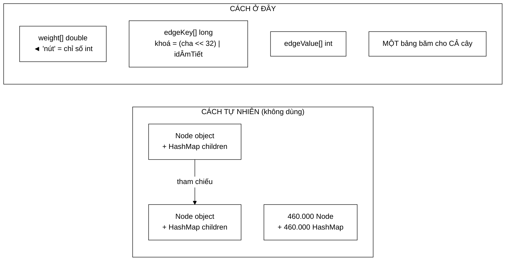

# SyllableTrie — một bảng băm cho cả cây, và "nút" chỉ là một chỉ số `int`

**File nguồn:** `search-engine/src/main/java/com/vnsearch/datastructure/SyllableTrie.java` (302 dòng)
**Gói:** `com.vnsearch.datastructure` · **Loại:** lớp thường, mảng phẳng + bảng băm địa chỉ mở tự cài, **không** an toàn đa luồng
**Vị trí trong luồng:** nền tảng của bộ tách từ tiếng Việt — [`MaxWeightSegmenter`](../index/MaxWeightSegmenter.md), [`VietnameseWordDictionary`](../index/VietnameseWordDictionary.md)
**Đọc kèm:** [`Trie.md`](./Trie.md) · [`../index/MaxWeightSegmenter.md`](../index/MaxWeightSegmenter.md) · [`../index/VietnameseTokenizer.md`](../index/VietnameseTokenizer.md)

---

## 📌 Hiểu trong 30 giây

Trie trên đơn vị **âm tiết** (không phải ký tự), lưu bằng **mảng phẳng**. Nó thay
thế một vòng lặp ghép chuỗi tốn 15 triệu lần cấp phát vô ích.

```
   CÁCH CŨ trong VietnameseTokenizer:

   for (int len = 4; len >= 2; len--) {
       String candidate = String.join(" ", Arrays.copyOfRange(syllables, i, i + len));
       if (bigramDictionary.contains(candidate)) { ... }
   }

   ⇒ MỖI vị trí i tạo BA mảng tạm + BA chuỗi mới, rồi vứt ngay
   ⇒ 5 triệu âm tiết × 3 = ~15 TRIỆU lần cấp phát vô ích
   ⇒ tất cả đều chết non ⇒ áp lực GC
```

```
   CÁCH TRIE:

   int node = trie.root();
   for (int j = i; j < n; j++) {
       node = trie.child(node, trie.idOf(syllables[j]));
       if (node == NONE) break;                 // ← CẮT NHÁNH
       if (trie.isWord(node)) { ... }
   }

   ⇒ KHÔNG cấp phát gì cả
   ⇒ Bốn độ dài 1..4 kiểm trong MỘT lượt đi
   ⇒ VÀ trả lời được câu hỏi HashSet không trả lời được:
     "còn từ nào dài hơn bắt đầu từ đây không?"
```



---

## 1. Vấn đề: 15 triệu lần cấp phát vô ích

Javadoc dòng 9–22:

> *"Mỗi vị trí `i` tạo ra **ba mảng tạm và ba chuỗi mới** chỉ để vứt đi ngay sau
> khi tra xong. Trên corpus 5.011 trang (khoảng 5 triệu âm tiết) đây là chừng **15
> triệu lần cấp phát vô ích**, và tất cả đều **chết non** nên đời hết lên vài, gây
> áp lực GC."*

```
   PHÂN TÍCH CHI PHÍ MỖI VỊ TRÍ i

   len = 4: Arrays.copyOfRange → mảng String[4]     (~48 B)
            String.join        → chuỗi ~20 ký tự    (~80 B)
   len = 3: tương tự                                 (~110 B)
   len = 2: tương tự                                 (~90 B)
   ─────────────────────────────────────────────────────────
   ~330 byte cho MỘT vị trí, VỨT ĐI ngay

   5 triệu âm tiết × 330 B ≈ 1,65 GB rác
   ⇒ hàng trăm chu kỳ GC thế hệ trẻ
```

```
   "CHẾT NON NÊN ĐỜI HẾT LÊN VÀI" — CHI TIẾT ĐÁNG CHÚ Ý

   Giả thuyết thế hệ (generational hypothesis): phần lớn đối
   tượng chết rất trẻ ⇒ GC thế hệ trẻ dọn chúng rất rẻ.

   ⇒ Javadoc thừa nhận đúng điều này ("đời hết lên vài"),
     tức KHÔNG phóng đại vấn đề.
   ⇒ Nhưng 1,65 GB rác vẫn là hàng trăm lần dừng-thế-giới
     ngắn, và chúng rơi vào giai đoạn dựng chỉ mục —
     lúc hệ thống đang chạy nặng nhất.

   ⇒ Đây là cách nêu vấn đề TRUNG THỰC: nói rõ cả yếu tố
     làm giảm nhẹ nó.
```

### 1.1 Thông tin mà `HashSet` **không** cung cấp được

Javadoc dòng 27–30:

> *"Trie còn trả lời được câu hỏi mà `HashSet` không trả lời được: «**có còn từ
> nào dài hơn bắt đầu từ đây không?**» — nếu `child` trả về `-1` thì **cắt nhánh
> ngay**, khỏi thử các độ dài còn lại."*

```
   ⭐ ĐÂY MỚI LÀ LỢI ÍCH LỚN NHẤT, LỚN HƠN CẢ VIỆC KHÔNG CẤP PHÁT.

   HashSet trả lời: "chuỗi X có trong từ điển không?"  (CÓ/KHÔNG)
   Trie trả lời:    "chuỗi X có trong từ điển không?"  (CÓ/KHÔNG)
                  + "có từ nào BẮT ĐẦU bằng X không?"  ← THÊM

   Ví dụ: âm tiết "xyz" không mở đầu từ nào

   HashSet: phải thử "xyz abc", "xyz abc def", "xyz abc def ghi"
            ⇒ 3 lần ghép chuỗi + 3 lần tra, TẤT CẢ đều trượt

   Trie:    child(root, id("xyz")) = NONE
            ⇒ DỪNG NGAY. 1 phép tra.

   ⇒ Với văn bản thật, phần lớn vị trí KHÔNG mở đầu từ ghép nào
     ⇒ cắt nhánh sau bước ĐẦU TIÊN là trường hợp phổ biến nhất
```

Test `deadEndIsDetectableAfterOneStep` canh giữ đúng tính chất này.

---

## 2. Mảng phẳng thay vì nút đối tượng

Javadoc dòng 32–43:

> *"Với 185.000 từ / khoảng 460.000 nút, đó là 460.000 đối tượng `Node` cộng
> 460.000 đối tượng `HashMap` — mỗi `HashMap` **rỗng** đã tốn ~48 byte header
> trước khi chứa gì."*

```
   SO SÁNH BỘ NHỚ — 460.000 nút, ~460.000 cạnh

   CÁCH TỰ NHIÊN (Node + HashMap mỗi nút):
     Node object          460.000 × 16 B  =  7,4 MB
     HashMap rỗng         460.000 × 48 B  = 22,1 MB
     HashMap.Node mỗi cạnh 460.000 × 32 B = 14,7 MB
     boxing String key/value                (thêm nữa)
     ────────────────────────────────────────────────
     ≈ 45–60 MB

   CÁCH Ở ĐÂY (mảng phẳng):
     weight[]     460.000 × 8 B  =  3,7 MB
     edgeKey[]    ~1.048.576 × 8 =  8,4 MB   (bảng 0,55 tải)
     edgeValue[]  ~1.048.576 × 4 =  4,2 MB
     ────────────────────────────────────────────────
     ≈ 16,3 MB

   ⇒ TIẾT KIỆM ~3 LẦN, và 3 đối tượng thay vì 1,4 triệu.
```

```
   HAI Ý TƯỞNG TÁCH BẠCH

   ① "NÚT" CHỈ LÀ MỘT CHỈ SỐ int
     Thuộc tính của nút nằm trong MẢNG SONG SONG (weight[]).
     ⇒ Không có đối tượng Node nào tồn tại.
     ⇒ Cùng kỹ thuật với mảng song song ở
       ../ranking/BM25Scorer.md mục 2.1.

   ② MỘT BẢNG BĂM CHO CẢ CÂY
     Khoá = (nútCha << 32) | idÂmTiết
     ⇒ Thay vì 460.000 HashMap nhỏ, chỉ có MỘT bảng lớn.
     ⇒ Đây là ý tưởng hay nhất của cả file.
```

```
   VÌ SAO MỘT BẢNG LỚN TỐT HƠN NHIỀU BẢNG NHỎ

   460.000 HashMap, mỗi cái trung bình 1 phần tử:
     - mỗi HashMap: 48 B header + mảng bucket 16 phần tử = 112 B
     - để chứa MỘT cặp 12 byte

   ⇒ Tỉ lệ overhead ~9:1

   Một bảng 1 triệu ô chứa 460.000 cạnh:
     - overhead = ô trống, tức 44 % dung lượng
   ⇒ Tỉ lệ overhead ~1,8:1

   ⇒ Bảng nhỏ luôn kém hiệu quả vì chi phí cố định
     không chia đều được.
```

### 2.1 Vì sao tự cài bảng băm thay vì `HashMap<Long,Integer>`

Javadoc dòng 45–51:

> *"Khoá là `long` và giá trị là `int`. `HashMap` **bắt buộc phải boxing** cả hai
> thành `Long`/`Integer`, tức thêm hai đối tượng mỗi cạnh (~16 và ~16 byte) cộng
> một đối tượng `Node` của bảng băm (~32 byte) — khoảng **64 byte phụ trội cho một
> cạnh đáng lẽ chỉ cần 12 byte dữ liệu**."*

```
   TỈ LỆ PHỤ TRỘI: 64 / 12 ≈ 5,3 LẦN

   460.000 cạnh × 64 B phụ trội = 29,4 MB THUẦN LÃNG PHÍ

   VÀ TỆ HƠN VỀ TỐC ĐỘ:
     HashMap<Long,Integer>.get(key):
       ① boxing key thành Long        (cấp phát!)
       ② hashCode của Long
       ③ tra bucket → theo con trỏ tới Node
       ④ equals của Long → theo con trỏ nữa
       ⑤ unboxing Integer             (theo con trỏ)
     ⇒ 3–4 lần nhảy con trỏ ngẫu nhiên ⇒ 3–4 cache miss

     Bảng địa chỉ mở ở đây:
       ① băm long                     (số học thuần)
       ② edgeKey[slot]                (đọc mảng)
       ③ edgeValue[slot]              (đọc mảng, GẦN ĐÓ)
     ⇒ 1–2 cache miss, không cấp phát

   ⇒ child() nằm trên đường nóng nhất của cả hệ thống
     (mỗi âm tiết của mỗi tài liệu). 4 lần khác biệt về
     cache miss là rất đáng kể.
```

---

## 3. Hàm băm — và cái bẫy nếu bỏ nó đi

```java
private static int hash(long key) {
    long h = key;
    h ^= (h >>> 33);  h *= 0xff51afd7ed558ccdL;
    h ^= (h >>> 33);  h *= 0xc4ceb9fe1a85ec53L;
    h ^= (h >>> 33);
    return (int) h;
}
```

Javadoc dòng 125–132:

> *"Khoá của ta là `(nútCha << 32) | idÂmTiết`. Nếu chỉ lấy `khoá & mask` thì **32
> bit cao — chính là nút cha — bị vứt đi hoàn toàn**: mọi cạnh xuất phát từ cùng
> một âm tiết sẽ đổ vào cùng một ô, bất kể cha là ai. Âm tiết phổ biến như «của»
> xuất hiện dưới hàng nghìn nút cha khác nhau, và tất cả sẽ xếp thành một chuỗi
> thăm dò dài — **biến $O(1)$ thành $O(n)$**."*

```
   ⭐ ĐÂY LÀ CÁI BẪY TINH VI NHẤT CỦA BẢNG BĂM TỰ CÀI.

   mask = capacity − 1 = 0x000FFFFF  (bảng 1 triệu ô)

   khoá = (cha << 32) | idÂmTiết
        = 0xAAAAAAAA_BBBBBBBB
           └─ cha ─┘ └ âm tiết ┘

   khoá & mask = chỉ lấy 20 bit THẤP NHẤT
               = một phần của idÂmTiết
               ⇒ 32 bit CAO (cha) HOÀN TOÀN BỊ VỨT

   ⇒ Âm tiết "của" (id = 42) dưới 5.000 nút cha khác nhau
     ⇒ 5.000 khoá KHÁC NHAU đều cho slot = 42 & mask
     ⇒ 5.000 phần tử xếp thành MỘT chuỗi thăm dò tuyến tính
     ⇒ tra cứu O(5.000) thay vì O(1)

   ⇒ VÀ CẤU TRÚC VẪN "CHẠY ĐÚNG" — chỉ chậm gấp hàng nghìn lần.
     Không có ngoại lệ nào, không có test nào đỏ.
```

```
   HÀM TRỘN splitmix64 SỬA ĐIỀU ĐÓ

   x ^= x >>> 33;  x *= C1;
   x ^= x >>> 33;  x *= C2;
   x ^= x >>> 33;

   Phép `x >>> 33` đưa 31 bit CAO xuống vùng thấp,
   rồi XOR trộn chúng vào. Nhân với hằng số nguyên tố
   lớn lan toả tiếp.

   ⇒ Sau ba vòng, MỖI bit đầu ra phụ thuộc CẢ 64 bit đầu vào
   ⇒ Đổi một bit của `cha` làm đổi ~32 bit đầu ra
   ⇒ Slot phân bố đều
```

Test `sameSyllableUnderManyParentsStaysCorrect` canh giữ đúng kịch bản này.

```
   LƯU Ý: ĐÂY LÀ CÙNG HÀM TRỘN Ở BloomFilter.hash2

   BloomFilter.md mục 2.1 dùng đúng finalizer MurmurHash3
   (x ^= x>>>33; x *= 0xff51afd7ed558ccd; x ^= x>>>33)
   cho cùng một mục đích: phá tương quan bit.

   ⇒ Cùng một kỹ thuật, hai chỗ, hai lý do khác nhau
     nhưng cùng bản chất. Dấu hiệu người viết hiểu vấn đề
     chứ không chép công thức.
```

---

## 4. Bất biến "id âm tiết $\ge 1$" — và giá trị 0 làm dấu hiệu ô trống

Javadoc dòng 58–61:

> *"Id âm tiết luôn $\ge 1$. Nhờ vậy khoá cạnh `(nútCha << 32) | idÂmTiết` **không
> bao giờ bằng 0**, và giá trị 0 trong `edgeKey` được dùng làm dấu hiệu «ô trống»
> — khỏi phải cấp phát thêm một mảng `boolean[]` đánh dấu ô đã dùng."*

```java
int id = syllableIds.size() + 1; // bat dau tu 1
```

```
   CHUỖI SUY LUẬN

   ① id ≥ 1  ⇒  phần thấp của khoá ≥ 1
   ② nútCha ≥ 0
   ③ ⇒ khoá = (cha << 32) | id  ≥ 1  ⇒  KHÁC 0 luôn luôn
   ④ ⇒ edgeKey[slot] == 0 ⟺ ô đó CHƯA DÙNG

   ⇒ Tiết kiệm boolean[1.048.576] = 1 MB
   ⇒ VÀ tiết kiệm một lần đọc mảng thứ hai trong vòng nóng
```

```
   ⚠️ NẾU id BẮT ĐẦU TỪ 0

   Cạnh (root=0, id=0) ⇒ khoá = 0
   ⇒ edgeKey[slot] == 0 nghĩa là "ô trống" HAY "cạnh này"?
   ⇒ KHÔNG PHÂN BIỆT ĐƯỢC
   ⇒ child() trả NONE cho một cạnh CÓ THẬT
   ⇒ Một từ trong từ điển biến mất khỏi trie, IM LẶNG

   ⇒ Dòng `syllableIds.size() + 1` trông vô hại,
     nhưng bỏ `+ 1` là một lỗi rất khó tìm.
   ⇒ Javadoc gọi hẳn nó là "Bất biến" và giải thích —
     đúng mức độ nghiêm trọng.
```

---

## 5. Hệ số tải 0,55 — và lý do đi ngược quy ước

```java
private static final double MAX_LOAD_FACTOR = 0.55;
```

Javadoc dòng 77–81:

> *"0,55 thay vì 0,75 quen thuộc của `HashMap`: độ dài chuỗi thăm dò trong địa chỉ
> mở tuyến tính tăng **phi tuyến** theo hệ số tải (xấp xỉ $1/(1-\alpha)$), nên 0,75
> cho chuỗi dài **gấp đôi** 0,55. Đổi 20 % bộ nhớ lấy độ trễ tra cứu ổn định là
> đáng giá ở đây, vì `child` nằm trên **đường nóng nhất** của cả hệ thống."*

```
   ĐỘ DÀI CHUỖI THĂM DÒ TRUNG BÌNH ≈ 1/(1−α)

   α = 0,50  ⇒ 1/(1−0,50) = 2,0
   α = 0,55  ⇒ 1/(1−0,55) = 2,2
   α = 0,75  ⇒ 1/(1−0,75) = 4,0        ← GẤP ~1,8 LẦN
   α = 0,90  ⇒ 1/(1−0,90) = 10,0
   α = 0,95  ⇒ 1/(1−0,95) = 20,0

   ⇒ Hàm này TĂNG VỌT khi α tiến tới 1.
   ⇒ Khác hẳn HashMap dây chuyền (chaining), nơi độ dài
     chuỗi tăng TUYẾN TÍNH theo α — nên 0,75 hợp lý ở đó
     mà KHÔNG hợp lý ở đây.
```

```
   ⭐ ĐIỂM ĐÁNG HỌC: KHÔNG CHÉP HẰNG SỐ TỪ NƠI KHÁC.

   0,75 là hằng số của HashMap, và HashMap dùng CHAINING.
   Bảng ở đây dùng OPEN ADDRESSING với thăm dò tuyến tính.
   Hai cấu trúc có hành vi tải KHÁC HẲN NHAU.

   ⇒ Chép 0,75 sang đây sẽ làm tra cứu chậm gấp đôi
     mà không ai biết vì sao.
   ⇒ Javadoc nêu rõ công thức và tính toán đánh đổi.
```

```
   ĐÁNH ĐỔI ĐƯỢC ĐỊNH LƯỢNG

   Bộ nhớ: 0,55 cần bảng lớn hơn 0,75 khoảng 36 %
           (1/0,55 vs 1/0,75)
           ⇒ 12,6 MB → 8,4+4,2 = 12,6 MB ... thực tế do
             làm tròn lên luỹ thừa 2 nên chênh ít hơn

   Tốc độ: chuỗi thăm dò 2,2 vs 4,0 ⇒ nhanh hơn ~1,8 lần

   ⇒ child() chạy ~5 triệu lần khi dựng chỉ mục.
     Chênh 1,8 bước thăm dò × 5 triệu = 9 triệu lần đọc mảng.
```

---

## 6. Hai chi tiết cài đặt nữa

### 6.1 `insert` giữ trọng số **lớn hơn**

```java
// Cung mot tu co the den tu ca hai nguon tu dien — giu ban trong so lon hon.
if (wordWeight > weight[node]) {
    weight[node] = wordWeight;
}
```

```
   VÌ SAO max CHỨ KHÔNG PHẢI GÁN ĐÈ HAY CỘNG

   Từ điển được nạp từ HAI nguồn (xem
   ../index/VietnameseWordDictionary.md).
   Cùng một từ có thể xuất hiện ở cả hai với trọng số khác nhau.

   GÁN ĐÈ  ⇒ nguồn nạp SAU thắng ⇒ kết quả phụ thuộc THỨ TỰ NẠP
   CỘNG    ⇒ từ có ở hai nguồn được thổi phồng gấp đôi
   MAX     ⇒ tất định, và giữ đánh giá tin cậy nhất  ✓

   ⇒ Cùng lựa chọn Math::max với Trie.md mục 1.1
     (gộp gợi ý trùng). Nhất quán trong cả gói.
```

### 6.2 `growEdgeTable` — băm lại toàn bộ

```java
private void growEdgeTable() {
    long[] oldKeys = edgeKey;  int[] oldValues = edgeValue;
    int capacity = oldKeys.length << 1;
    edgeKey = new long[capacity];  edgeValue = new int[capacity];
    edgeMask = capacity - 1;
    for (int i = 0; i < oldKeys.length; i++) {
        long key = oldKeys[i];
        if (key == 0) continue;
        int slot = hash(key) & edgeMask;
        while (edgeKey[slot] != 0) slot = (slot + 1) & edgeMask;
        edgeKey[slot] = key;  edgeValue[slot] = oldValues[i];
    }
}
```

```
   VÌ SAO PHẢI BĂM LẠI, KHÔNG CHỈ SAO CHÉP

   slot = hash(key) & edgeMask
   edgeMask ĐỔI khi capacity nhân đôi
   ⇒ MỌI slot đều đổi ⇒ phải tính lại từ đầu

   ⇒ Đây là chi phí O(capacity) mỗi lần nhân đôi.
   ⇒ Khấu hao: tổng chi phí băm lại ≤ 2 × số cạnh cuối cùng.

   ⇒ Vòng trong KHÔNG kiểm trùng khoá (chỉ tìm ô trống)
     — đúng, vì bảng cũ đã đảm bảo mọi khoá phân biệt.
     Tiết kiệm một phép so sánh trong vòng lặp băm lại.
```

Hàm dựng `SyllableTrie(expectedEdges)` tồn tại để **tránh** việc này:

```java
int capacity = tableSizeFor((int) (expectedEdges / MAX_LOAD_FACTOR) + 1);
```

```
   Nạp 185.000 từ ⇒ ~460.000 cạnh

   KHÔNG cấp phát trước (bắt đầu 4.096 ô):
     4.096 → 8.192 → ... → 1.048.576
     ⇒ 8 lần băm lại, tổng ~2 triệu lần chèn lại

   CÓ cấp phát trước:
     0 lần băm lại
```

Test `survivesRehashingWithManyWords` canh giữ tính đúng đắn của việc băm lại.

---

## 7. Hướng dẫn thực hành

### 7.1 Dùng

```java
// NAP TU DIEN — dung intern() de cap id moi
SyllableTrie trie = new SyllableTrie(500_000);   // cap phat truoc!
trie.insert(new String[]{"máy", "tính"}, 12.5);
trie.insert(new String[]{"máy", "tính", "xách", "tay"}, 8.0);

// TRA CUU — dung idOf(), KHONG dung intern()
int node = trie.root();
for (int j = i; j < syllables.length; j++) {
    int id = trie.idOf(syllables[j]);
    node = trie.child(node, id);
    if (node == SyllableTrie.NONE) break;        // CAT NHANH
    if (trie.isWord(node)) {
        ghiNhan(j, trie.weightAt(node));
    }
}
```

### 7.2 `intern` vs `idOf` — khác biệt sống còn

Javadoc dòng 151–153: *"Chỉ dùng khi **NẠP** từ điển. Lúc tra cứu hãy dùng `idOf`
để tránh làm phình bảng bằng những âm tiết chỉ xuất hiện trong văn bản đầu vào."*

```
   intern("xyz")  → cấp id MỚI nếu chưa có, làm syllableIds PHÌNH RA
   idOf("xyz")    → trả NONE nếu chưa có, KHÔNG sửa gì

   ⇒ Dùng intern() lúc tra cứu:
     mỗi âm tiết lạ trong văn bản crawl được cấp một id
     ⇒ syllableIds phình từ ~7.000 (âm tiết tiếng Việt)
       lên hàng trăm nghìn (mọi chuỗi rác trong HTML)
     ⇒ tốn bộ nhớ, VÀ làm biến đổi cấu trúc trong lúc đọc
       ⇒ không an toàn nếu có nhiều luồng

   ⇒ Đây là cạm bẫy dễ mắc nhất, và Javadoc cảnh báo đúng chỗ.
```

### 7.3 Cạm bẫy

```
   ① intern() lúc tra cứu ⇒ phình bảng (mục 7.2).

   ② KHÔNG an toàn đa luồng. insert/intern sửa mảng,
     child đọc mảng. Không có khoá nào.
     ⇒ Phải nạp XONG từ điển TRƯỚC khi cho luồng nào đọc.
     ⇒ Ràng buộc này KHÔNG được ghi ở đâu.

   ③ weightAt(node) KHÔNG kiểm biên.
     Truyền node = NONE (−1) ⇒ ArrayIndexOutOfBoundsException.
     Người gọi phải tự kiểm child() != NONE trước.

   ④ insert với wordWeight <= 0 ⇒ nút được TẠO nhưng
     isWord() trả false ⇒ "từ ma": tốn nút, không dùng được.
     Không có kiểm tra, không có cảnh báo.

   ⑤ Không có cách DUYỆT trie (không có iterator).
     Không kiểm tra được nội dung đã nạp, không xuất ra được.

   ⑥ Không cấp phát trước ⇒ 8 lần băm lại khi nạp từ điển lớn.

   ⑦ syllableIds là HashMap<String,Integer> — vẫn boxing.
     Nó nằm ngoài phần tối ưu, và idOf() được gọi
     cho MỖI âm tiết lúc tra cứu.
```

---

## 8. Độ phức tạp & chi phí

| Thao tác | Thời gian | Ghi chú |
|---|---|---|
| `intern` | $O(1)$ kỳ vọng | `HashMap` — có boxing |
| `idOf` | $O(1)$ kỳ vọng | `HashMap` — có boxing |
| `child` | $O(1)$ kỳ vọng | **Đường nóng nhất**, không cấp phát |
| `insert` ($k$ âm tiết) | $O(k)$ | |
| `weightAt` / `isWord` | $O(1)$ | Một lần đọc mảng |
| Băm lại | $O(capacity)$ khấu hao | Tránh được bằng cấp phát trước |
| Bộ nhớ | $O(\text{nút} + \text{bảng cạnh})$ | **Không** phụ thuộc độ dài chuỗi |

```
   SO SÁNH VỚI CÁCH CŨ — 5 triệu âm tiết

                          CÁCH CŨ            TRIE
   ────────────────────────────────────────────────────────
   cấp phát              15 triệu            0
   rác sinh ra           ~1,65 GB            0
   tra cứu mỗi vị trí    3 lần HashSet       1–4 lần child
                         + 3 lần ghép chuỗi  (thường DỪNG ở 1)
   cắt nhánh sớm         KHÔNG               CÓ

   ⇒ Lợi ích lớn nhất KHÔNG phải tốc độ tra cứu thuần,
     mà là (a) không cấp phát và (b) cắt nhánh sớm.
```

```
   ⚠️ ĐIỂM NGHẼN CÒN LẠI: idOf() VẪN DÙNG HashMap<String,Integer>

   Mỗi âm tiết lúc tra cứu:
     - băm String (duyệt ký tự)
     - tra HashMap → theo con trỏ
     - unboxing Integer → theo con trỏ nữa

   ⇒ Toàn bộ công sức tối ưu bảng cạnh có thể bị
     lu mờ bởi phần này, vì idOf() gọi CŨNG NHIỀU như child().

   ⇒ Xem đề xuất 3.
```

---

## 9. Kiểm thử liên quan

| Test | Bảo vệ điều gì |
|---|---|
| `test/java/com/vnsearch/datastructure/SyllableTrieTest.java` | 9 ca |

| Ca test | Tính chất được canh giữ |
|---|---|
| `storesAndRetrievesWordWeight` | Đường đi cơ bản |
| `prefixOfAWordIsNotItselfAWord` | `isWord` vs tồn tại nút |
| `childReturnsNoneForUnknownSyllable` | Nhánh `syllableId == NONE` |
| **`deadEndIsDetectableAfterOneStep`** | **Cắt nhánh — lợi ích chính so với `HashSet` (mục 1.1)** |
| `sameWordFromTwoSourcesKeepsLargerWeight` | `max` chứ không gán đè (mục 6.1) |
| `wordsSharingPrefixShareNodes` | Bản chất chia sẻ tiền tố của trie |
| **`survivesRehashingWithManyWords`** | **Băm lại không mất cạnh nào (mục 6.2)** |
| **`sameSyllableUnderManyParentsStaysCorrect`** | **Hàm băm trộn đủ 64 bit (mục 3)** |
| `emptyInsertIsIgnored` | `syllables.length == 0` |

```
   ⭐ BA CA IN ĐẬM PHỦ ĐÚNG BA QUYẾT ĐỊNH KỸ THUẬT KHÓ NHẤT:

     mục 1.1 (cắt nhánh)      → deadEndIsDetectableAfterOneStep
     mục 3   (hàm băm trộn)   → sameSyllableUnderManyParentsStaysCorrect
     mục 6.2 (băm lại)        → survivesRehashingWithManyWords

   ⇒ sameSyllableUnderManyParentsStaysCorrect đặc biệt đáng giá:
     nếu ai đó "đơn giản hoá" hash() thành `(int) key`,
     cấu trúc VẪN ĐÚNG (chỉ chậm), nên phần lớn test vẫn xanh.
     Ca này ép đúng kịch bản một âm tiết dưới nhiều cha —
     tức đúng chỗ lỗi biểu hiện.

   ⇒ Nhưng nó chỉ kiểm ĐÚNG, không kiểm NHANH.
     Xem "còn thiếu".
```

**Còn thiếu:**

```
   ✗ Hàm băm PHÂN BỐ ĐỀU — ca hiện có kiểm tính đúng đắn,
     không kiểm độ dài chuỗi thăm dò. Đổi hash() thành
     `(int) key` sẽ làm chậm hàng nghìn lần mà VẪN XANH.

   ✗ weightAt(NONE) ⇒ ngoại lệ (cạm bẫy ③)
   ✗ insert với wordWeight <= 0 ⇒ "từ ma" (cạm bẫy ④)
   ✗ Bất biến id ≥ 1 (mục 4) — nếu ai bỏ `+ 1`,
     cạnh (root, id=0) biến mất. Không có ca nào.
   ✗ Hệ số tải 0,55 được tôn trọng sau nhiều lần chèn
   ✗ Đa luồng — không có, và cũng không có tài liệu
     nói lớp này không an toàn
```

```powershell
cd search-engine
.\mvnw.cmd -q -Dtest='SyllableTrieTest' test
```

---

## 10. Liên kết

- Người dùng chính — thuật toán tách từ: [`../index/MaxWeightSegmenter.md`](../index/MaxWeightSegmenter.md)
- Nguồn từ điển được nạp vào: [`../index/VietnameseWordDictionary.md`](../index/VietnameseWordDictionary.md)
- Nơi cách cũ (ghép chuỗi + `HashSet`) từng nằm: [`../index/VietnameseTokenizer.md`](../index/VietnameseTokenizer.md)
- Trie trên ký tự cho autocomplete — nên đọc kèm để thấy hai bài toán khác nhau: [`Trie.md`](./Trie.md)
- Cùng hàm trộn bit, cùng lý do: [`BloomFilter.md`](./BloomFilter.md) mục 2.1
- Cùng kỹ thuật mảng song song: [`../ranking/BM25Scorer.md`](../ranking/BM25Scorer.md) mục 2.1
- Cùng mẫu "dựng xong rồi đông cứng" (đề xuất 2): [`SparseMatrix.md`](./SparseMatrix.md)
